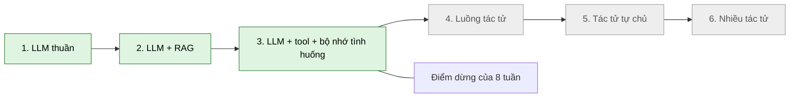

# 00 · Tổng quan, phạm vi và quyết định kiến trúc

> **Đã cập nhật trong `ship/`.** File này ghi kiến trúc trước lượt rà soát nguồn 21/09/2026 (đặc biệt phần AD-17, RAG). Bản đã sửa: `ship/01-kien-truc.md` và `ship/00-thuat-ngu-va-nguon.md`.

**Tài liệu:** kiến trúc giải pháp AI Assistant cho VF Structures
**Phiên bản:** 1.1 · 19/09/2026
**Đội ngũ:** 5 người · **Thời hạn:** 8 tuần (~2 tháng)
**Nguồn:** bộ tài liệu `vfstructures-ai-docs-2026-09-17.zip`, hiện trạng hệ thống VFSoftware (`kien-truc-solution-architecture-v2.md`), và tài liệu AWS được tra cứu ngày 18/09/2026 (xem [06-tang-bedrock.md](06-tang-bedrock.md) §Bảng thông số AWS đã xác minh).

---

## 1. Mục tiêu

Xây một trợ lý AI nhúng trong ứng dụng tính toán kết cấu `vfstructures-app`, nhằm hai việc:

1. **Tăng năng suất kỹ sư:** tra tiêu chuẩn có dẫn chứng đúng trang/điều khoản, chạy tính toán ngay trong hội thoại bằng engine đã có, tìm lại tình huống đã xử lý trước đó.
2. **Cải thiện trải nghiệm người dùng:** giải thích kết quả ngay trên trang tính toán đang mở, thay vì buộc kỹ sư rời màn hình đi tra cứu.

Nguyên tắc nền, kế thừa từ tài liệu kiến trúc gốc và không được nới lỏng:

| # | Nguyên tắc | Hệ quả thiết kế |
| --- | --- | --- |
| P1 | AI hỗ trợ kỹ sư, không thay thế kỹ sư | Mọi kết quả đưa vào kho kinh nghiệm phải qua thao tác duyệt có danh tính và thời điểm |
| P2 | LLM không bao giờ tự tính số | Mọi con số kỹ thuật đến từ tool gọi engine .NET; giao diện dựng thẻ kết quả từ JSON của tool |
| P3 | Không có câu trả lời nếu không có dẫn chứng | Từ chối có chủ đích khi truy xuất không đủ căn cứ; mỗi khẳng định gắn trích dẫn |
| P4 | Hàng rào kiểm soát nằm ngoài mô hình | Lọc quyền trước khi vào ngữ cảnh, guardrail ở tầng Bedrock, kiểm tra schema ở tool gate. Câu dặn trong prompt không phải biện pháp kiểm soát |
| P5 | Leo thang từ rẻ đến đắt | Prompt → RAG → tool → case memory. Không fine-tuning, không multi-agent trong 8 tuần |

### Chuỗi truy vết: mục tiêu kinh doanh → mục tiêu kỹ thuật → KPI

Mọi hạng mục trong phạm vi phải lần ngược được tới một mục tiêu kinh doanh; hạng mục không lần được là hạng mục đáng nghi (kỹ thuật ấn tượng nhưng không có lợi tức rõ).

| Mục tiêu kinh doanh | Mục tiêu kỹ thuật | KPI đo được |
| --- | --- | --- |
| Giảm thời gian kỹ sư tra tiêu chuẩn | Hỏi đáp có dẫn chứng đúng trang/điều khoản | recall@k, tỉ lệ trích dẫn hợp lệ, thời gian tới chữ đầu tiên ([11](11-lo-trinh.md) §3) |
| Giảm lỗi và thời gian lặp tính toán | Chạy tool qua engine hiện có, số liệu từ engine | Số khớp engine 100%, số lần dùng tool, human handoff rate |
| Giữ tri thức khi nhân sự đổi | Case memory tự ghi khi duyệt | Số case đã duyệt, tỉ lệ duyệt trên thẻ kết quả |
| Tăng giá trị và giữ chân người dùng module tính toán | Giải thích kết quả tại chỗ | Kỹ sư nói sẽ dùng tiếp (≥ 6/10), tỉ lệ dùng lại hằng tuần |

---

## 2. Phạm vi 8 tuần

Phạm vi đã được xác nhận: **RAG + tool nhóm A/B + case memory**.

### Có trong phạm vi

| Hạng mục | Mô tả | Chi tiết |
| --- | --- | --- |
| Hỏi đáp có dẫn chứng | Tra tiêu chuẩn/quy trình nội bộ, trả lời kèm trích dẫn tới trang | [03-rag.md](03-rag.md) |
| Tool nhóm A/B | Tra tham số (A) và tính toán/kiểm định qua engine hiện có (B), khoảng 5 tool đầu tiên | [04-tool-calling.md](04-tool-calling.md) |
| Case memory (lite) | Tự động ghi nhận tình huống từ kết quả tính toán đã được kỹ sư duyệt; tra lại tình huống tương tự trong cùng organization | [05-case-memory.md](05-case-memory.md) |
| Giải thích kết quả tại chỗ | Nút "Hỏi AI về kết quả này" trên trang tính toán, gửi kèm ngữ cảnh trang | [08-ux.md](08-ux.md) |
| Hỏi đáp chức năng VF, hướng dẫn thao tác | Tra tài liệu hướng dẫn sử dụng của VF (nhóm `app_help`), trả lời kèm phiên bản và trích dẫn | [03-rag.md](03-rag.md) §6 |
| Tra kết quả của đúng dự án và cấu kiện | Đọc kết quả đã lưu theo `projectId`, `memberId` qua Main API bằng quyền người dùng | [04-tool-calling.md](04-tool-calling.md) §9 |
| Gợi ý phương án có kiểm chứng | Đề xuất điều chỉnh tiết diện hoặc cốt thép; mỗi phương án phải qua engine trước khi gọi là "đạt" | [04-tool-calling.md](04-tool-calling.md) §10 |
| Guardrails, audit, eval, quan sát | Bắt buộc, không cắt | [06](06-tang-bedrock.md), [07](07-auth-bao-mat.md), [09](09-eval-quan-sat.md) |

### Cố tình không có

| Cắt | Lý do | Khi nào xem lại |
| --- | --- | --- |
| Tool nhóm C (ghi dữ liệu nghiệp vụ) | AI ghi vào hồ sơ chính thức là rủi ro pháp lý cao nhất; giá trị chưa chứng minh | Sau khi nhóm A/B ổn định ≥ 1 tháng |
| Multi-agent | Một agent là mặc định; chưa có ranh giới bảo mật hay quyền sở hữu buộc phải tách | Khi tool > ~20 hoặc có ranh giới tổ chức |
| Fine-tuning | RAG cho phép trích dẫn và cập nhật tức thì; fine-tuning không làm được cả hai | Không đặt ra |
| Knowledge graph | Chưa đạt ≥ 4/6 điều kiện đầu tư | Sau eval cho thấy lỗi bắc cầu nhiều chặng lặp lại |
| AgentCore Memory, Browser, Code Interpreter, và công cụ `shell`, `file_operations` của Harness | Kho hội thoại đã có ở PostgreSQL (Memory sẽ nhân đôi kho và làm phức tạp xóa dữ liệu); assistant không duyệt web, không chạy mã, không cần shell | Không đặt ra |
| Ứng dụng AI cho doanh nghiệp (mục riêng trong tài liệu cuộc họp) | Tài liệu cuộc họp ghi "trình bày sau và chốt phạm vi riêng"; chưa có yêu cầu để thiết kế | Khi có phạm vi được chốt |
| Bedrock Agents (classic) | AWS đã đưa vào maintenance mode và đóng cho khách hàng mới | Không dùng |
| Semantic Kernel, Microsoft Agent Framework hoặc `IChatClient` (Microsoft.Extensions.AI) làm lớp điều phối | Gói `AWSSDK.Extensions.Bedrock.MEAI` đưa client Bedrock Runtime vào `IChatClient`, nên về kỹ thuật là khả thi (đã xác minh gói tồn tại; chưa thử trong dự án). Vòng lặp tool ở đây cần các tham số riêng của Bedrock (`guardrailConfig`, `additionalModelRequestFields`, điểm cache) cùng ToolGate tự viết; chưa kiểm tra lớp trừu tượng chung có che các tham số này không | Kiểm ở M0 nếu đội muốn middleware MEAI có sẵn (cache, OpenTelemetry); nếu `ILlmClient` (AD-02) phình to thì xem lại |
| Câu hỏi đa phương thức (ảnh bản vẽ) | Cần pipeline riêng | Pha 2 |

**Cắt phạm vi khi trễ:** case memory là hạng mục đầu tiên bị thu hẹp (chỉ giữ phần ghi nhận, bỏ phần truy xuất) nếu tuần 6 chưa xong. Xem [11-lo-trinh.md](11-lo-trinh.md).

---

## 3. Hiện trạng làm nền (từ tài liệu VFSoftware)

| Thành phần | Hiện trạng | Ảnh hưởng tới thiết kế |
| --- | --- | --- |
| Backend | .NET 8, Clean Architecture, các service độc lập (Main API, Admin API, Authorization API, Payment API, Notification API, File API) | Assistant là service .NET 8 mới, cùng khuôn mẫu |
| Tính toán | Repository tính toán là **hàm thuần** (DTO vào, DTO ra, không truy vấn DB), có Swagger | Tool calling rẻ hơn dự kiến: chỉ cần bọc endpoint có sẵn |
| Phân quyền | `[ApiAccess("Module.View")]` → `IPermissionService` tra DB mỗi request; **thiếu quyền trả `ApiResult.Code = Forbidden` nhưng vẫn HTTP 200** | Tool client phải đọc `ApiResult.Code`, không chỉ HTTP status |
| Định danh | Keycloak OIDC + PKCE; token trong cookie HttpOnly; Next.js BFF gắn `Authorization: Bearer` | Assistant nằm sau BFF, validate JWT qua JWKS như các service khác |
| Database | PostgreSQL dùng chung (shared database), không có Redis, không có message broker | Job nền dùng bảng trong PostgreSQL; cache trong bộ nhớ tiến trình |
| Real-time | SignalR ở Notification API (stateful, cần backplane khi scale) | Streaming token dùng SSE, không dùng SignalR |
| Frontend | Next.js 16, React 19, Ant Design 5, i18next (**fr gốc**, en), Zustand | Giao diện chat viết bằng React thuần + Ant Design; tiếng Pháp là ngôn ngữ chính, tiếng Anh thứ hai. **Không có tiếng Việt** — thị trường mục tiêu là EU (GĐ-1) |
| Triển khai | Docker; dev bằng `docker compose` trên máy chủ tự quản (192.168.1.x); image lên GHCR; production có nginx + API gateway | Dev/staging **không chạy trong AWS**, cần cơ chế cấp credential cho Bedrock (xem [10](10-trien-khai.md)) |
| Observability | Elasticsearch + APM đang tạm chưa dùng | Dùng OpenTelemetry, đích CloudWatch |

---

## 4. Giả định

Mỗi giả định sai sẽ kéo theo phần kiến trúc phụ thuộc phải xem lại, không phải toàn bộ tài liệu.

| # | Giả định | Nếu sai |
| --- | --- | --- |
| GĐ-1 | **Thị trường mục tiêu là EU.** Giao diện chỉ có **tiếng Pháp (gốc) và tiếng Anh**; không có tiếng Việt. Người dùng hỏi bằng tiếng Pháp là chính, tiếng Anh là thứ hai. Tiêu chuẩn và tài liệu nguồn là tiếng Pháp (Eurocodes, DTU, NF EN). Công ty đặt tại Việt Nam và một phần kỹ sư dùng phần mềm ngồi tại Việt Nam, nhưng **họ cũng dùng giao diện tiếng Pháp hoặc tiếng Anh** | Đổi prompt, cấu hình FTS, bộ eval. Câu hỏi tiếng Anh trên tài liệu tiếng Pháp vẫn là truy vấn xuyên ngôn ngữ ở mức nhẹ (R42) |
| GĐ-1b | Người dùng và dữ liệu nằm dưới **hai khung pháp lý cùng lúc**: GDPR cho thị trường EU, và luật Việt Nam cho công ty và cho những người dùng là công dân Việt Nam | Không đổi kiến trúc, nhưng thêm nghĩa vụ hồ sơ; xem R40 và Q1 nửa (b) |
| GĐ-2 | Tài khoản AWS do công ty kiểm soát; dữ liệu không dùng để huấn luyện mô hình | Xem lại toàn bộ lựa chọn Bedrock |
| GĐ-3 | **Chưa rõ** công ty có chấp nhận request route trong 6 region EU hay bắt buộc single-region (xem AD-03) | Có thể phải đổi hướng mô hình |
| GĐ-4 | Có ≥ 1 kỹ sư kết cấu bán thời gian soạn và chấm bộ câu hỏi | Không có người chấm thì đội tự chấm bằng cảm tính; nghiệm thu không đáng tin |
| GĐ-5 | PostgreSQL production chạy được `pg_trgm` và `unaccent` (mọi phiên bản RDS đều có) | Chỉ cần một logical database `assistant`; instance vật lý riêng là tùy chọn (AD-12) |
| GĐ-6 | Có quyền hợp pháp ingest tiêu chuẩn vào kho nội bộ (xem rủi ro bản quyền, [12](12-rui-ro.md)) | Thu hẹp kho về tài liệu nội bộ và tiêu chuẩn miễn phí |
| GĐ-7 | Topology production (ECS/EC2/khác) **chưa xác định**; tài liệu chỉ mô tả mức container | Cập nhật [10-trien-khai.md](10-trien-khai.md) khi chốt |

---

## 5. Quyết định kiến trúc (AD)

| # | Quyết định | Loại bỏ | Vì sao |
| --- | --- | --- | --- |
| AD-01 | **Assistant là service .NET 8 mới `VFSoftware.Assistant.Api`**, đi qua BFF proxy hiện có | Route API trong Next.js (QĐ-1 của `poc-ai-assistant.md`) | Đồng nhất với 8 service hiện có; engine tính toán và permission đều ở .NET; giữ AWS credential ngoài Node; đội quen C#. Vercel AI SDK bị bỏ, nên rủi ro "provider không hỗ trợ profile EU cho embedding" trong tài liệu POC không còn |
| AD-02 | **Gọi Bedrock trực tiếp bằng AWS SDK for .NET (Converse/ConverseStream)** sau các interface `ILlmClient`, `IEmbeddingClient` và `IReranker` (ba endpoint khác nhau của Bedrock, không gộp thành một), cho các đường có quy trình cố định: định tuyến, viết lại câu hỏi, hỏi đáp tài liệu (`doc_qa`), embedding, rerank | Bedrock Agents classic (maintenance mode) | Đường cố định không cần vòng lặp agent; gọi trực tiếp cho độ trễ thấp nhất và kiểm soát guardrail, cache, retry trong code C#. Vòng lặp tool được xử lý riêng ở AD-13 |
| AD-03 | **Region chính `eu-central-1`, dùng inference profile `eu.*`** | `bedrock-mantle` in-region; region Paris | `eu.anthropic.claude-sonnet-5` bắt buộc dùng profile geo/global trên `bedrock-runtime`, request có thể route trong 6 region EU, **không phải single-region**. Rerank (Cohere Rerank 3.5, Amazon Rerank 1.0) trong EU chỉ có ở Frankfurt; Paris không có rerank. AgentCore có ở Frankfurt và cả Paris nên không quyết định việc chọn region. **Rủi ro mở R1:** cần công ty quyết định trước M0 |
| AD-05 | **Ba tầng mô hình theo tác vụ:** Haiku 4.5 (định tuyến, viết lại câu hỏi), Sonnet 5 (trả lời, tool loop), fallback Sonnet 4.6 | Một mô hình cho mọi việc | Khớp chi phí và độ trễ với hình dạng từng việc. Chi tiết [06](06-tang-bedrock.md). **Mô hình trả lời cũng phải qua đo:** so Sonnet 5, Sonnet 4.6 và Haiku 4.5 cho `doc_qa` trên 20 câu đầu của golden set theo chất lượng và chi phí mỗi lượt; Sonnet 5 chỉ là mặc định tạm |
| AD-06 | **Mô hình embedding của Managed Knowledge Base chốt bằng đo, trước khi tạo KB.** Mặc định là `embeddingModelType: MANAGED`; bộ 50 câu dùng để đo recall@8 của embedding managed. Không đạt thì tạo KB với `CUSTOM` + `embeddingModelArn` (role cần `bedrock:InvokeModel` trên ARN đó) | Chọn theo cảm tính; đổi sau khi đã nạp | Mô hình embedding **không đổi được sau khi tạo KB**. Đổi ý nghĩa là tạo lại KB và nạp lại toàn bộ kho, nên phải chốt trước lô nạp đầu tiên — cùng lúc với việc chốt danh sách thuộc tính metadata lọc được |
| AD-07 | **Streaming bằng SSE** từ Assistant, BFF chuyển tiếp nguyên dạng | SignalR; WebSocket | SSE đủ cho một chiều server → client, không cần backplane. Phải kiểm tra qua đúng chuỗi nginx + gateway production ở M0 |
| AD-08 | **Tool registry trong tiến trình**, sinh từ OpenAPI của Main API rồi chỉnh tay (đơn vị, nhóm rủi ro, căn cứ tiêu chuẩn, chủ sở hữu chuyên môn) | MCP server riêng; AI sinh SQL | Công thức chỉ nằm một nơi (.NET). Token của người dùng được chuyển tiếp nên `[ApiAccess]` hiện có tự áp dụng |
| AD-09 | **Case memory tự động ghi nhận** từ kết quả tính toán đã được duyệt, không bắt kỹ sư nhập tay | Form ghi nhận tình huống thủ công | Loại bỏ giả định rủi ro nhất của tài liệu gốc (GĐ-06: kỹ sư chịu ghi nhận dưới 2 phút). Dữ liệu có cấu trúc sẵn vì tham số tool đã là schema |
| AD-10 | **Guardrails bắt buộc**, ép bằng IAM condition key `bedrock:GuardrailIdentifier` cho mô hình chat | Chỉ dặn trong prompt | Không có ép buộc thì guardrail dễ bị bỏ qua. Role tách riêng: `assistant-runtime` (có điều kiện guardrail) và `assistant-ingest` (không có, vì mô hình embedding không hỗ trợ guardrail); test CI kiểm cả đường embedding ([07](07-auth-bao-mat.md) §7) |
| AD-11 | **Job nền dùng bảng PostgreSQL** (`FOR UPDATE SKIP LOCKED`), Worker .NET | RabbitMQ/Kafka/SQS | Hệ thống hiện không có broker; khối lượng ingestion nhỏ, thêm hạ tầng chưa đáng |
| AD-12 | **PostgreSQL của assistant dùng logical database `assistant` riêng.** Chứa `document`, `case`, `tool_run`, `message`, `audit_event` và bảng `clause_ref`; extension cần là `pg_trgm` và `unaccent`. **Aurora DSQL không dùng được** vì không hỗ trợ extension | Dùng chung schema với VFSoftware | Tách logical database giữ ranh giới dữ liệu và quyền rõ ràng, chi phí gần bằng không. **Instance vật lý riêng nay là tùy chọn, không bắt buộc:** lý do cũ là tải bộ nhớ khi build chỉ mục HNSW, mà kho vector nay nằm ở MKB (AD-17). Khối lượng còn lại của POC nhỏ. Công ty quyết dùng chung hay tách khi chốt topology production |
| AD-14 | **Vùng chạy là `eu-central-1` (phương án A ở [06](06-tang-bedrock.md) §10a).** Thị trường mục tiêu là EU, tài liệu và tiêu chuẩn là tiếng Pháp, người dùng chính ở EU, nên vùng EU là đúng chỗ | Vùng APAC; hai vùng theo nhóm người dùng | Vùng APAC làm dữ liệu người dùng EU rời EU, tức đổi một bài toán nhỏ lấy một bài toán GDPR lớn. Hai vùng gấp đôi vận hành để phục vụ nhóm kỹ sư tại Việt Nam vốn nhỏ hơn. **Cái giá đã biết và chấp nhận:** kỹ sư ngồi tại Việt Nam cộng khoảng 250 đến 320 ms mỗi lượt (R41), và việc công ty Việt Nam đưa dữ liệu cá nhân ra nước ngoài vẫn phát sinh nghĩa vụ hồ sơ theo luật Việt Nam (R40) — nghĩa vụ này **không tránh được bằng cách chọn vùng**, vì AWS không có vùng đặt tại Việt Nam |
| AD-15 | **Bỏ luật nhanh khỏi đường định tuyến chính; mọi lượt đi qua IntentRouter (Haiku).** Luật chỉ còn là đường lùi khi router lỗi | Giữ luật nhanh ở đường chính để tiết kiệm 300–500 ms cho nhóm câu có mã điều khoản | Luật khớp mã điều khoản phân loại **sai** câu hỏi hỗn hợp: *"6.2.2 tôi tính rồi, dầm B12 có đạt không?"* bị ép thành `doc_qa` trong khi ý định đúng là `mixed` và cần gọi engine. Hai bộ phân loại song song là hai thứ phải kiểm thử và có thể bất đồng; bộ đơn giản hơn mục ruỗng trước mà không ai thấy. **Cái giá đã biết và chấp nhận:** mọi lượt cộng 300–500 ms, và router thành điểm chết đơn trên một mô hình có mốc EOL rơi vào tuần 2 của POC (R44). **Điều kiện kèm theo:** `pageContext` phải mang `hasResult`, `resultKind`, `calcAt` — luật `explain_result` dựa vào trạng thái chứ không dựa vào chữ, nên nếu khối `pageContext` rút gọn không mang tín hiệu đó thì Haiku **không thể** thay được luật này. Chốt 20/09/2026 |
| AD-16 | **IntentRouter bóc luôn tham số tra case (`case_hints`).** Haiku trả thêm khối `case_hints` gồm `tool_id` và danh sách `{key, value, unit}`, chỉ nhận key nằm trong `similarity_keys` của `tools.manifest.yaml`; manifest được nhúng vào prompt router (schema grounding). Thứ tự ưu tiên nguồn tham số: `tool_run` > `pageContext` > `case_hints`. `case_hints` **chỉ dùng để lọc và chấm điểm case**, không bao giờ vào công thức (P1 giữ nguyên) | (a) Lọc case thuần bằng vector trên summary; (b) bắt người dùng nhập tham số qua form trước khi tra | Vector không xếp hạng được theo độ lớn: `nhịp 8,0 m, C30/37` và `nhịp 12,0 m, C30/37` có cosine gần 1, trong khi độ lớn chính là thứ duy nhất nhánh này cần. Muốn chấm điểm số học thì phải có số, nên phải có người bóc số — và chỗ đã đọc câu hỏi là router. Vector lùi về vai trò tie-break. **Cái giá đã biết và chấp nhận:** bóc sai một tham số thì kỹ sư nhận tiền lệ sai (R45); `MaxTokens` của router tăng lên 300–400, chạm trần là JSON đứt giữa chừng nên phải assert `stopReason != "max_tokens"`. **Điều kiện kèm theo:** (1) khi `case_hints` là nguồn duy nhất của một giá trị số, giao diện hiển thị chip tham số cho kỹ sư xác nhận hoặc sửa trước khi tra; (2) giải được dưới 2 key thì hỏi lại, không trả kết quả yếu. Chốt 20/09/2026 |
| AD-17 | **Truy xuất tài liệu chạy trên Bedrock Managed Knowledge Base (MKB).** `Assistant.Worker` parse, cắt đoạn theo cấu trúc điều khoản và giữ tiêu đề cột, rồi ghi ra **một object S3 cho mỗi chunk kèm metadata sidecar** (`standard`, `edition`, `clause_path`, `page`, `scope_key`, `status`); MKB nạp từ S3 qua managed connector và cung cấp embedding, kho vector và `Retrieve`. Lọc quyền là `retrievalConfiguration.vectorSearchConfiguration.filter` trên `scope_key` và `status`. Tra theo mã điều khoản dùng `pg_trgm` trong PostgreSQL làm chặng 1, phân giải `6.2.2` thành bộ lọc metadata rồi mới gọi `Retrieve` | (a) Tự xây retrieval trên PostgreSQL + pgvector: hybrid vector + FTS + trigram hợp nhất bằng RRF; (b) Customer-managed KB, tự cấp kho vector; (c) `AgenticRetrieveStream` thay cho `Retrieve` | Theo tiêu chí "ưu tiên dịch vụ có sẵn của AWS" của tài liệu cuộc họp. Chọn `Retrieve` chứ không `AgenticRetrieveStream` vì vòng lặp planner phá ngân sách ≲3 giây và đường đó hiện chỉ có ví dụ SDK Python, chưa rõ AWS SDK for .NET hỗ trợ. **Cái giá đã biết và chấp nhận:** (1) biên phân quyền là một tham số của lời gọi API chứ không còn là mệnh đề SQL — gọi `Retrieve` mà quên dựng filter là trả về tài liệu của mọi organization (R46); (2) không còn tự chủ RRF ba nhánh, không chỉnh được `ef_search`, `m`, `ef_construction`; (3) mô hình embedding không đổi được sau khi tạo KB (AD-06); (4) `Assistant.Worker` **không** biến mất — MKB chỉ nhận embedding, kho vector và truy xuất. **Bốn kiểm chứng chặn, hạn hết ngày 3 (23/09):** V-K2 MKB có GA ở `eu-central-1`; V-K3 AWS SDK for .NET có `MANAGED` và `MANAGED_KNOWLEDGE_BASE_CONNECTOR`; V-K4 managed S3 connector đọc được metadata sidecar và lọc được; V-K5 `overrideSearchType: HYBRID` dùng được không. Trượt cái nào thì đưa lại quyết định lên bàn ngay trong tuần 1, không lùi lịch. Chốt 20/09/2026 |
| AD-18 | **Bedrock Evaluation chạy song song golden set trong CI** | Chỉ golden set tự chấm | Managed, Claude-as-judge, có chấm responsible-AI. Golden set vẫn là cổng chặn vì nó đo đúng nhóm câu của ngành kết cấu; Bedrock Evaluation bắt phần tổng quát. **Proposed** |
| AD-19 | **Prompt router và prompt trả lời giữ trong Bedrock Prompt Management**, không nằm trong mã C# | Prompt hằng trong mã | Prompt hằng trong mã buộc sửa prompt phải deploy lại; tách ra thì kỹ sư phụ trách tri thức chỉnh và phiên bản hóa được. Thêm một nơi phải kiểm soát phiên bản. **Proposed** |
| AD-20 | **Ingestion điều phối bằng Step Functions, kích hoạt bằng S3 Event Notification** | Bảng hàng đợi PostgreSQL `FOR UPDATE SKIP LOCKED` cho nhánh ingestion | Mỗi chặng parse → chunk → ghi S3 → `start-ingestion-job` → poll `COMPLETE` → promote tự retry và debug riêng, không phải tự viết máy trạng thái job. AD-11 giữ nguyên cho job nền khác. Cái giá: thêm một hạ tầng vào POC đã nén (R39). **Proposed** |
| AD-21 | **Batch inference (`CreateModelInvocationJob`) cho golden set và chấm eval hàng loạt** | Gọi `Converse` từng câu | Giảm 50% so với on-demand, áp cho phần việc không ai ngồi chờ. Không dùng cho đường phục vụ người dùng. **Proposed** |
| AD-22 | **Cửa sổ lịch sử hội thoại đếm theo lượt, không theo message.** Router đọc **3 lượt gần nhất**. Đường trả lời giữ nguyên lịch sử tới 6 lượt; quá 6 thì giữ **4 lượt gần nhất** cộng một bản tóm tắt các lượt cũ do Haiku sinh, bản tóm tắt nằm ở khối bán tĩnh với `cachePoint` TTL 5 phút. Chunk truy xuất của lượt trước không đưa lại vào lượt sau. Ba con số cửa sổ nằm trong `ConversationWindowOptions`, hiệu chỉnh bằng nhóm câu hỏi dựa ngữ cảnh của golden set ở M1 | Gửi toàn bộ lịch sử hội thoại; cắt cứng theo số message; chỉ tóm tắt không giữ lượt nguyên văn | Sách *AI Agents on AWS* ch3 xếp "nhồi toàn bộ lịch sử vào ngữ cảnh" vào nhóm anti-pattern (chạm trần token và chi phí, sinh context rot) và chốt rằng production dùng **hỗn hợp**: sliding window giữ mạch hội thoại, retrieval lo tri thức dài hạn, compaction lo mạch dài. Sách *AI Agents in Action* ch8 xác nhận bộ đệm hội thoại là bộ nhớ ngắn hạn, còn tri thức lâu dài phải đi qua kho truy xuất. Kiến trúc này đã có đủ ba tầng đó nên chỉ cần chốt đơn vị và con số. Đếm theo lượt vì một lượt có gọi tool mang thêm `tool_call` và `tool_result`, đếm theo message làm cửa sổ co giãn theo loại lượt. Chốt 20/09/2026 |
| AD-23 | **Chống lạm dụng ba tầng, mọi bộ đếm nằm trong PostgreSQL.** Burst theo IP 5 request/10 giây trước xác thực; cửa sổ trượt theo user 20 lượt/phút; **một lượt đang chạy trên mỗi user**, ép bằng bảng `active_turn` với `INSERT ... ON CONFLICT DO NOTHING`, lượt thứ hai trả `429 concurrent_turn`; hạn mức ngày tính theo **token** của user và org, trừ theo token thực dùng sau khi lượt kết thúc, cảnh báo ở 50/80/100%. Con số hạn mức ngày chốt ở M0 sau khi đo chi phí mỗi lượt | Bộ giới hạn trong bộ nhớ của ASP.NET Core; hạn mức đếm theo số lượt; hủy lượt cũ khi có lượt mới; ma sát đăng ký | Sách *AI-Enhanced Web Apps* chốt ba tầng `rate limit → quota kiểm sau rate limit → ma sát đăng ký` và yêu cầu bộ đếm ở kho dùng chung. Bộ giới hạn trong bộ nhớ đếm theo từng instance nên chạy N task là nhân giới hạn lên N lần — đường denial-of-wallet. Hạn mức theo token chứ không theo lượt vì lượt có gọi tool tốn gấp nhiều lần lượt hỏi thường. Từ chối lượt thứ hai chứ không hủy lượt cũ, để người dùng không mất câu trả lời đang viết dở. Ma sát đăng ký không áp dụng: danh tính đến từ Keycloak của khách hàng, không tự đăng ký được. Chốt 20/09/2026 |
| AD-13 | **Vòng lặp tool của POC là AgentCore Harness** (`InvokeHarness`, Gateway `vf-tools`, facade C# giữ ToolGate, [04](04-tool-calling.md) §8). Model `eu.anthropic.claude-sonnet-5` đặt tường minh, `shell` và `file_operations` bị khóa, Memory tắt, `maxIterations` và `timeoutSeconds` đặt theo trần của §6. **Bốn kiểm chứng quyết định V-A1, V-A3, V-A4, V-A6 ([06](06-tang-bedrock.md) §1a) chạy trong tuần 1.** Hai mốc: V-A1 và V-A6 phải đạt **hết ngày 3 (23/09)**, trượt thì rơi về vòng lặp C# ([04](04-tool-calling.md) §6) ngay, không lùi lịch; cổng **G0 (25/09)** ghi nhận quyết định đó và kiểm V-A4 | Vòng lặp C# thuần cho cả POC; tool inline (vẫn phải tự viết một vòng lặp mỏng); tool chạy thẳng vào Main API | Quyết định của công ty ngày 19/09/2026, đảo lại kết luận của Vòng 2 phản biện. Lý do chọn: tiêu chí "ưu tiên dịch vụ có sẵn của AWS" của tài liệu cuộc họp; không phải tự bảo trì vòng lặp, Cedar Policy và token exchange là hạ tầng phân quyền dùng lại được. **Phản biện của hai reviewer vẫn còn hiệu lực và nay là rủi ro sống của POC:** không hỗ trợ hook nên ToolGate phải ra facade (R27), phải dịch stream sang SSE (R33), có thể phải tự viết bộ đọc event stream để gọi bằng Bearer JWT (R29), cần token exchange trên Keycloak (R32), ba hạ tầng mới trong POC nén (R39). Sách *AI Agents on AWS* nêu thêm một cái giá mà bản thảo chưa gọi tên: AgentCore Runtime cho mức cô lập và quản trị sẵn có **đổi lấy phụ thuộc AWS**. Ở đây phụ thuộc đó bị chặn lại một phần vì engine tính toán, phân quyền và kho tài liệu đều nằm ngoài AgentCore, và [04](04-tool-calling.md) §6 vẫn là đường thoát chạy được |

### Thang năng lực: dừng ở đâu

Thang leo thang đầy đủ theo tài liệu AWS agents: LLM → LLM + RAG → LLM có tool và bộ nhớ → luồng tác tử → tác tử tự chủ → nhiều tác tử. Dự án dừng ở nấc ba.

**Sơ đồ 0.1 — Thang năng lực và điểm dừng**

---

## 6. Kiểm tra trước khi xây

### 6.1 AI có phải câu trả lời không?

Nếu một giải pháp đơn giản hơn cho kết quả tương đương, hoặc không có dữ liệu tốt, hoặc không cam kết bảo trì lâu dài được, thì không dùng AI. Áp dụng cho từng năng lực:

| Năng lực | Phương án không dùng AI | Vì sao vẫn dùng AI, và ranh giới |
| --- | --- | --- |
| Hỏi đáp tiêu chuẩn | Tìm từ khóa, mục lục | Câu hỏi bằng ngôn ngữ tự nhiên, diễn đạt khác tài liệu, cần tổng hợp nhiều điều khoản. Tìm kiếm từ khóa vẫn là một nhánh của hybrid; LLM chỉ **tổng hợp từ chunk đã truy xuất** và phải trích dẫn |
| Tính toán | Engine .NET hiện có | **Không dùng AI để tính.** Sách Generative AI Tools ghi ví dụ mô hình chuyên dụng đạt ~99,5% trong khi LLM chỉ 47–53% trên bài toán dữ liệu có cấu trúc. AI chỉ chọn tool, lập tham số, diễn giải |
| Tra tham số có cấu trúc | Truy vấn có cấu trúc | Tool nhóm A gọi API; không sinh nội dung |
| Xếp hạng case tương tự | Lọc + khoảng cách trên tham số | Xếp hạng bằng code; LLM chỉ diễn giải phần so sánh |
| Định tuyến ý định | Luật, regex | Haiku chỉ chạy khi luật không khớp (định tuyến LLM có điều kiện, bỏ qua LLM khi không cần) |

### 6.2 Mức giám sát của con người theo rủi ro

| Mức | Áp dụng cho | Cách thực thi |
| --- | --- | --- |
| **Supervision** (AI đề xuất, người xác nhận) | Kết quả tool nhóm B; lưu case memory | Thẻ kết quả kèm tham số; nút Duyệt có xác nhận nêu rõ nội dung |
| **Cooperation** (AI hỗ trợ, người can thiệp được) | Hội thoại hỏi đáp tài liệu | Trích dẫn bấm được, cảnh báo `unverified`, nút Dừng/Thử lại |
| **Override** (AI chỉ cung cấp thông tin, người giữ toàn quyền) | Mọi nội dung đi vào hồ sơ kỹ thuật chính thức | Assistant **không ghi** vào hồ sơ nghiệp vụ; kỹ sư ký hồ sơ là người quyết định |

Mức tự chủ tăng dần theo niềm tin đã chứng minh: **chỉ gợi ý** → **chạy tool đọc/tính** (giai đoạn này) → **ghi dữ liệu nghiệp vụ** (nhóm C, chưa mở). Không mặc định mức tự chủ cao ngay từ lúc ra mắt.

### 6.3 Trường hợp sử dụng cho phép và không cho phép

Khung NIST AI RMF yêu cầu xác định rõ bước "Map" trước khi mở rộng. Danh sách này hiển thị trong điều khoản sử dụng, trong system prompt và trong cấu hình denied topics của guardrail.

| Cho phép | Không cho phép |
| --- | --- |
| Tra cứu và giải thích tiêu chuẩn có dẫn chứng | Thay thế phê duyệt của kỹ sư ký hồ sơ |
| Chạy tool tính toán/kiểm định và diễn giải kết quả | Đưa kết quả vào hồ sơ chính thức mà không có kỹ sư kiểm |
| Tra tình huống đã duyệt của **chính organization** | Dùng dữ liệu hoặc case của organization khác |
| Giải thích kết quả đang hiển thị trên trang tính toán | Quyết định an toàn công trình không có kỹ sư có thẩm quyền |
| Gợi ý điều chỉnh tiết diện hoặc cốt thép, mỗi phương án đã qua kiểm của engine | Kết luận "đạt" cho phương án chưa có kết quả của engine |
| | Tư vấn ngoài kỹ thuật kết cấu (pháp lý, tài chính) |
| | Trả lời dựa trên tài liệu chưa được phép nạp |

## 7. Ràng buộc kế thừa

| Ràng buộc | Nguồn |
| --- | --- |
| Trách nhiệm kỹ thuật thuộc kỹ sư ký hồ sơ, không thuộc phần mềm | Tài liệu gốc trong bộ zip, quyết định số 04 của tài liệu đó |
| Dữ liệu ở trong biên giới EU | `bedrock-architecture.md` AD-BR-01 (xem thêm R1) |
| Mục tiêu độ trễ: chữ đầu tiên ≲ 3 giây với hỏi đáp tài liệu | `bedrock-architecture.md` §5. Đo thật ở M0, không coi là cam kết |
| Đăng nhập dùng lại Keycloak, không làm mới | `poc-ai-assistant.md` |
| Ngưỡng nghiệm thu đặt **trước** khi xây | `poc-ai-assistant.md` §12; bản cập nhật ở [11-lo-trinh.md](11-lo-trinh.md) |
| **Bảo trì mô hình** là yêu cầu phi chức năng: đổi mô hình không sửa nghiệp vụ | Mô hình già nhanh hơn phần mềm thường; `ILlmClient` + `RequestBuilder` theo mô hình ([06](06-tang-bedrock.md) §3); lịch xem lại vòng đời (R23) |

---

## 8. Đối chiếu với yêu cầu trong tài liệu cuộc họp triển khai

Nguồn: ảnh `/home/vdloc/Downloads/f0d256ae7cf7fca9a5e6.jpg`, tài liệu "Mục tiêu triển khai trợ lý AI cho phần mềm VF". Bảng dưới ghi trạng thái **sau khi đối chiếu**: bản kiến trúc trước đó **chưa** phủ yêu cầu 2 và 4, phủ yêu cầu 3 chưa đủ, và lịch 8 tuần không thỏa tiêu chí thời gian. Các khoảng trống đó được bổ sung ở các tài liệu ghi trong cột cuối.

**Yêu cầu chức năng**

| Yêu cầu trong tài liệu | Trạng thái | Nơi trong bộ tài liệu | Điều kiện hoặc phần còn thiếu |
| --- | --- | --- | --- |
| 1. Tìm tiêu chuẩn và công thức; giải thích ý nghĩa, điều kiện áp dụng, dẫn nguồn | **Đáp ứng** | Luồng F1: [02](02-assistant-service.md), [03](03-rag.md); trích dẫn tới trang ([08](08-ux.md) §4) | Phụ thuộc Q2 (quyền nạp tiêu chuẩn có bản quyền) |
| 2. Hỏi đáp về chức năng VF; hướng dẫn thao tác | **Đáp ứng sau bổ sung** | Nhóm `app_help`: [03](03-rag.md) §6, ý định `app_help` ở [02](02-assistant-service.md) §4 | Phụ thuộc Q5: có tài liệu hướng dẫn sử dụng VF ở dạng nạp được không, phiên bản nào |
| 3. Truy vấn, giải thích kết quả tính toán của đúng dự án và cấu kiện đang xét | **Đáp ứng sau bổ sung** | `pageContext` mang `projectId` và `memberId`; tool nhóm A đọc kết quả đã lưu: [04](04-tool-calling.md) §9 | Cần Main API có endpoint đọc kết quả theo dự án và cấu kiện (chưa xác nhận trong tài liệu VFSoftware đã đọc) |
| 4. Gợi ý tối ưu phương án; kiểm chứng bằng bộ tính trước khi kết luận đạt | **Đáp ứng sau bổ sung, mức hẹp** | Ý định `optimize`, luồng đề xuất rồi kiểm chứng: [04](04-tool-calling.md) §10 | Chỉ với module đã có tool tính toán và khi có kỹ sư kết cấu ký manifest (chưa có người ký thì yêu cầu 4 không vào POC) (khoảng 5 tool đầu); module chưa có tool bị từ chối có thông báo |

**Tiêu chí triển khai**

| Tiêu chí | Trạng thái | Ghi chú |
| --- | --- | --- |
| POC hoàn thành tối đa 1 tháng; chốt ngày bắt đầu và hạn nghiệm thu | **Chỉ đạt với bản nén 4 tuần** | Lịch đầy đủ là 8 tuần. Bản POC 4 tuần, ngày bắt đầu và nghiệm thu đề xuất, ở [11](11-lo-trinh.md) §10. Có nguy cơ không đủ cả bốn yêu cầu (R35) |
| Tối ưu chi phí triển khai và vận hành; theo dõi chi phí mỗi yêu cầu | **Đáp ứng phần theo dõi; chưa có con số ngân sách** | Chỉ số `cost_per_request` ở [09](09-eval-quan-sat.md) §4 và §9; khung ngân sách ở [06](06-tang-bedrock.md) §10. Đơn giá của Sonnet 5, Haiku 4.5 và embedding chưa tra được trong lượt này |
| Ưu tiên dịch vụ có sẵn của AWS; tái sử dụng chức năng phần mềm; giới hạn tính năng POC | **Đáp ứng** | Tái sử dụng engine và phân quyền của Main API, dùng Bedrock, Guardrails, CloudWatch; vòng lặp tool dùng AgentCore Harness và Gateway (AD-13) thay vì tự viết. **Không còn điểm lệch nào:** truy xuất chạy trên Managed Knowledge Base (AD-17). Bốn kiểm chứng chặn V-K2 đến V-K5 ở [06](06-tang-bedrock.md) §10, hạn hết ngày 3 |
| Ứng dụng AI cho doanh nghiệp | **Ngoài phạm vi** | Tài liệu cuộc họp ghi trình bày sau và chốt riêng |

**Nội dung họp**

| Bước trong tài liệu | Tài liệu tương ứng |
| --- | --- |
| Thảo luận tìm phương án | Các quyết định kiến trúc ở §5 và loại bỏ kèm lý do |
| Chốt phương án | Câu hỏi Q1 đến Q7 ([12](12-rui-ro.md) §1) là điều kiện chốt |
| Phân công công việc | Vai, RACI ([11](11-lo-trinh.md) §1, §9) |
| Ngân sách dự kiến | Công thức và khung ở [06](06-tang-bedrock.md) §9, §10; **chưa có con số** |
| Thời gian triển khai | Lịch 8 tuần ([11](11-lo-trinh.md) §2) và POC 4 tuần (§10) |
