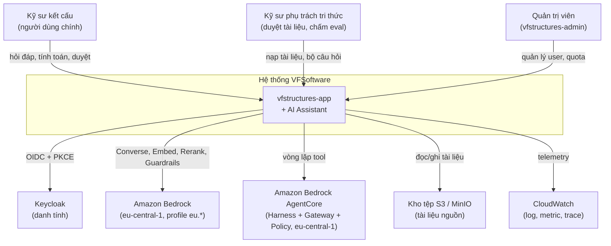
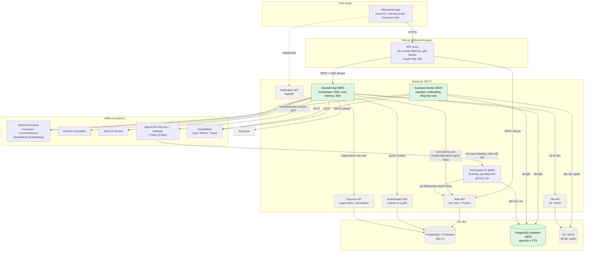
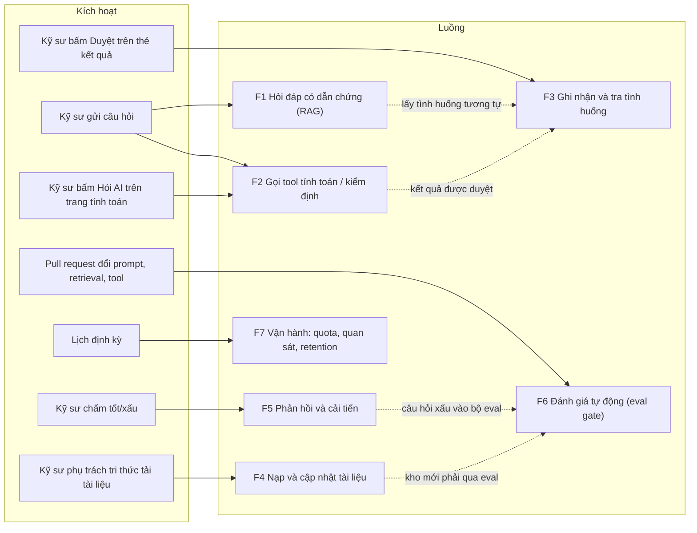
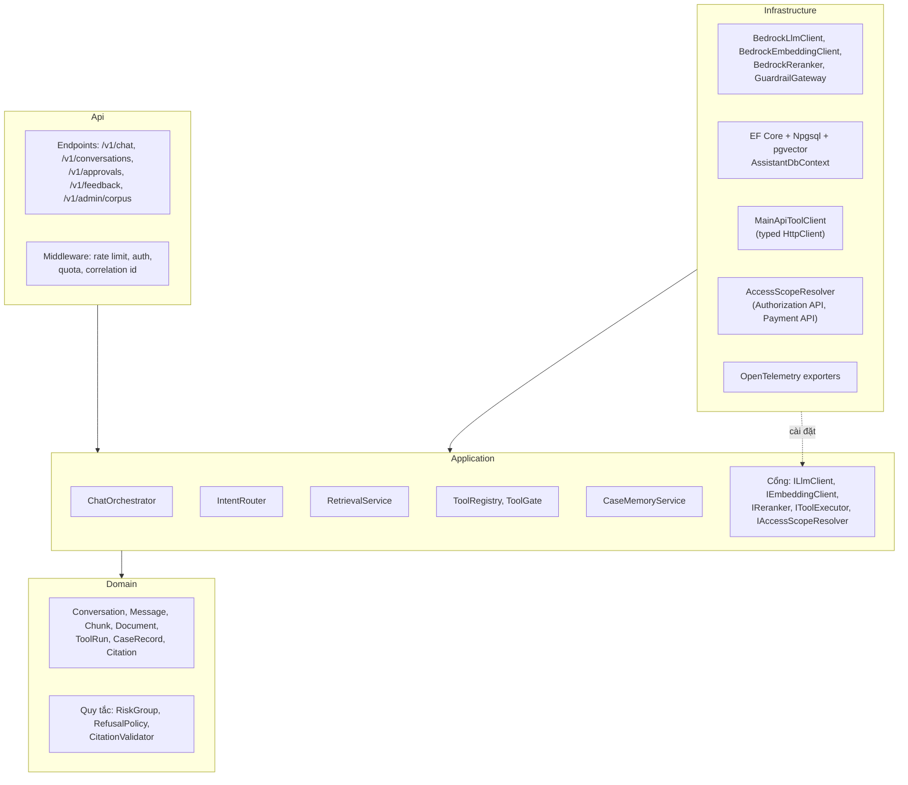

# 01 · Kiến trúc tổng thể

Tài liệu này chứa **sơ đồ tổng thể** và bản đồ các luồng. Mỗi luồng được phóng to ở một tài liệu chi tiết, có liên kết ngay dưới bản đồ.

---

## 1. Bối cảnh hệ thống (System context)

**Sơ đồ 1.1 — System context**

---

## 2. Sơ đồ tổng thể (Container diagram)

Màu xanh lá là thành phần **mới**. Màu xám là thành phần **hiện có**, không sửa (trừ hai điểm ghi chú bên dưới sơ đồ).

**Sơ đồ 1.2 — Container diagram tổng thể**

**Hai điểm chạm vào hệ thống hiện có:**

| Điểm chạm | Thay đổi | Ghi chú |
| --- | --- | --- |
| Keycloak | Thêm audience `assistant-api` vào token của client `vfstructures-app` (audience mapper) | Token cũ vẫn hợp lệ cho các service khác. Hướng cứng hơn là token exchange (RFC 8693), để sau |
| BFF proxy | Thêm route `/api/assistant/*` chuyển tiếp nguyên dạng luồng SSE, tắt buffering | Kiểm tra qua nginx và gateway production ở M0 |

Ngoài hai điểm trên, **Main API không sửa**. Tool gọi các endpoint tính toán hiện có qua HTTP, mang token người dùng.

---

## 3. Bản đồ luồng

Toàn bộ hệ thống là **bảy luồng**. Bảng dưới liệt kê từng luồng, kích hoạt bởi ai, và tài liệu nào chứa sơ đồ chi tiết.

**Sơ đồ 1.3 — Bản đồ các luồng**

| Luồng | Mô tả | Tài liệu chứa sơ đồ |
| --- | --- | --- |
| F1 | Hỏi đáp tài liệu: định tuyến → truy xuất → rerank → sinh có trích dẫn → guardrail | [02](02-assistant-service.md), [03](03-rag.md) |
| F2 | Vòng lặp tool: chọn tool → tool gate → gọi engine → thẻ kết quả | [04](04-tool-calling.md) |
| F3 | Case memory: tự ghi nhận khi được duyệt, tra lại theo điều kiện tương tự | [05](05-case-memory.md) |
| F4 | Ingestion: tải tệp → phân tích → cắt đoạn → embedding → phát hành phiên bản | [03](03-rag.md) |
| F5 | Phản hồi tốt/xấu → phân loại → bổ sung bộ eval | [09](09-eval-quan-sat.md) |
| F6 | Eval gate trong CI: chặn merge khi chất lượng lùi | [09](09-eval-quan-sat.md) |
| F7 | Rate limit, quota, retention, telemetry, audit | [07](07-auth-bao-mat.md), [09](09-eval-quan-sat.md) |

Các luồng xuyên suốt nằm ở: xác thực ([07](07-auth-bao-mat.md)), tầng Bedrock và chịu lỗi ([06](06-tang-bedrock.md)), giao diện ([08](08-ux.md)), triển khai ([10](10-trien-khai.md)).

---

## 4. Quy tắc phụ thuộc trong Assistant.Api

Assistant tuân theo Clean Architecture 4 lớp giống Main API: `Api → Infrastructure → Application → Domain`, phụ thuộc hướng vào trong. Điểm khác so với Main API: **có dùng interface cho mọi cổng ra ngoài** (`ILlmClient`, `IEmbeddingClient`, `IReranker`, `IToolExecutor`, `IAccessScopeResolver`), vì các cổng này cần thay bằng bản giả trong eval và test, và cần thay đổi nhà cung cấp mô hình mà không sửa nghiệp vụ.

**Sơ đồ 1.4 — Lớp và hướng phụ thuộc**

