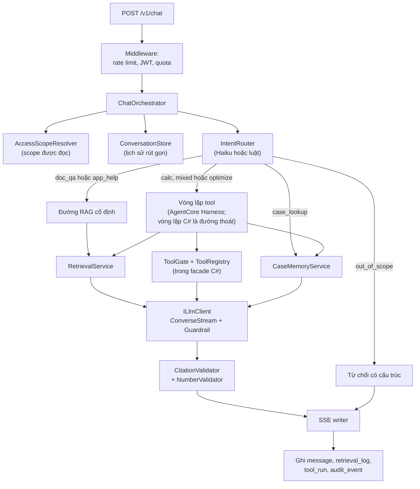
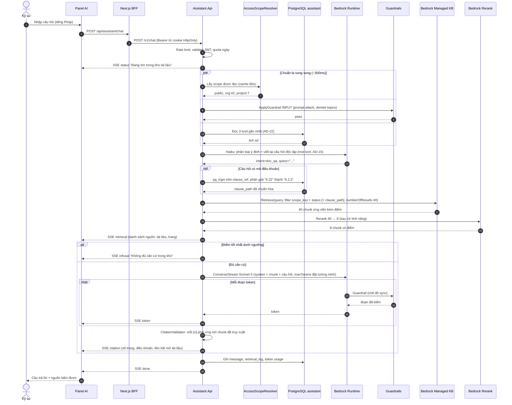
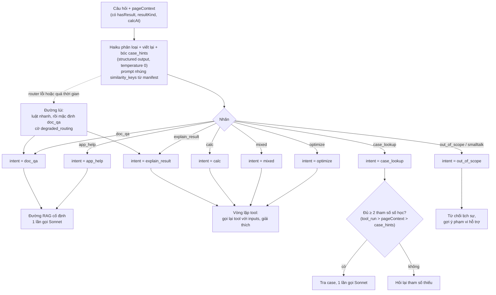
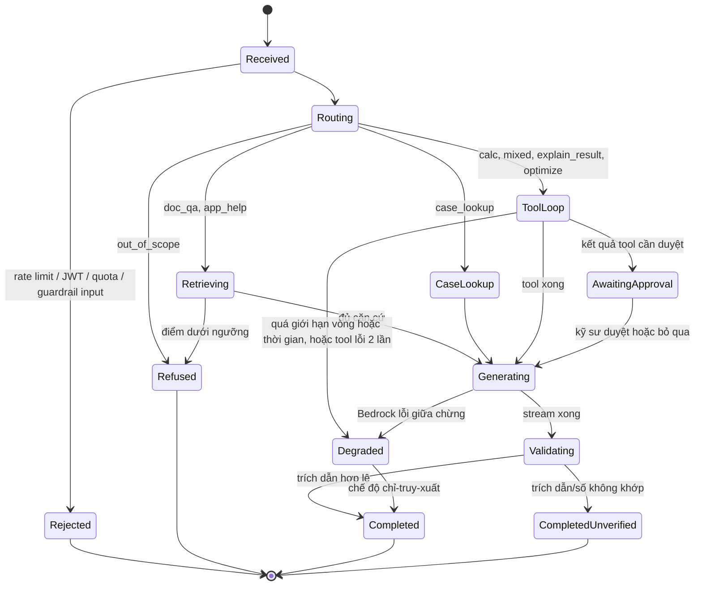
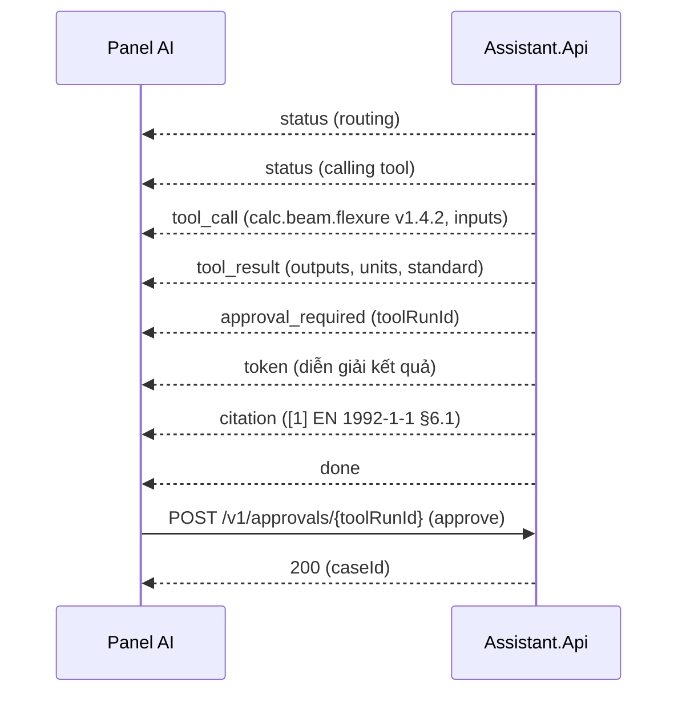
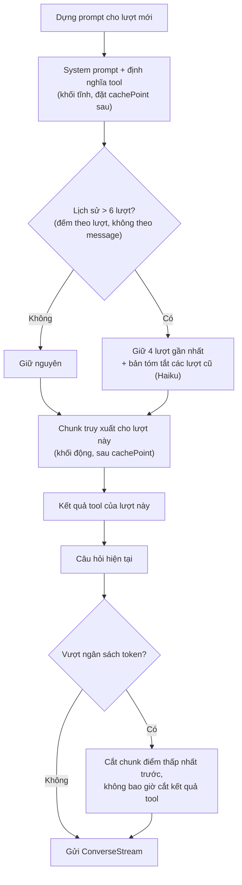

# 02 · Assistant service (.NET 8)

> **Đã cập nhật trong `ship/`.** File này ghi thiết kế Assistant service trước lượt rà soát 21/09/2026. Bản đã sửa: `ship/01-kien-truc.md` §6 và `ship/03-backend.md`. Từ AD-28 (22/09/2026), case tự ghi khi engine tính đạt và không còn bước duyệt: xem `ship/12-tra-case.md`.

Tài liệu mô tả **một lượt hỏi đáp từ đầu đến cuối** trong `VFSoftware.Assistant.Api`: nhận request, định tuyến, chạy đường RAG hoặc vòng lặp tool, phát trực tiếp (stream) kết quả, ghi nhận. Chi tiết truy xuất ở [03](03-rag.md), tool ở [04](04-tool-calling.md), guardrail và chịu lỗi ở [06](06-tang-bedrock.md).

---

## 1. Hợp đồng API

| Endpoint | Phương thức | Mục đích | Trả về |
| --- | --- | --- | --- |
| `/v1/chat` | POST | Gửi một lượt hỏi (kèm `conversationId` tùy chọn, `pageContext` tùy chọn) | `text/event-stream` (SSE) |
| `/v1/conversations` | GET | Danh sách hội thoại của người dùng | JSON |
| `/v1/conversations/{id}` | GET / DELETE | Đọc / xóa một hội thoại | JSON |
| `/v1/approvals/{toolRunId}` | POST | Duyệt hoặc từ chối một kết quả tool (kích hoạt ghi nhận case) | JSON |
| `/v1/feedback` | POST | Chấm tốt/xấu một câu trả lời | 204 |
| `/v1/sources/{docId}` | GET | Lấy URL ký ngắn hạn + trang cần tô sáng cho trình xem nguồn (kiểm tra lại scope) | JSON |
| `/v1/capabilities` | GET | Mô hình đang dùng, tool khả dụng cho người dùng, phiên bản kho tài liệu, trạng thái kill switch (giao diện dùng để ẩn/hiện tính năng) | JSON |
| `/health/live`, `/health/ready` | GET | Sống / sẵn sàng (PostgreSQL, cấu hình Bedrock nạp được). **Không gọi Bedrock trong health check** | 200 / 503 |
| `/v1/admin/corpus/*` | POST / GET | Quản lý tài liệu, phiên bản (quyền `Assistant.Curate`) | JSON |

Quy ước: đường dẫn có version `/v1/` ngay từ đầu; response JSON theo `ApiResponse<T>` của Payment API; **lỗi luôn đi kèm mã và hướng xử lý**, không chỉ thông điệp. Họ mã trạng thái dùng có chủ ý: 200 thành công, 400 dữ liệu vào sai, 401/403 danh tính/quyền, 429 rate limit hoặc hết hạn mức, 500 lỗi nội bộ, **503 khi Assistant bị tắt (kill switch) hoặc chưa sẵn sàng**. Đường dẫn đã công bố không bị đổi nghĩa; thay đổi phá vỡ đi vào `/v2/`.

`pageContext` (từ nút "Hỏi AI về kết quả này"): `{ module, inputs, outputs, locale }`. Đây là dữ liệu **không tin cậy**, do client gửi. Assistant không dùng làm căn cứ tính toán; nếu cần con số, tool được gọi lại với `inputs` (xem [04](04-tool-calling.md) §5). Bổ sung: `{ module, projectId, memberId, inputs, outputs, locale }`. `projectId` và `memberId` là **định danh**, không phải dữ liệu tin cậy: server dùng chúng để đọc kết quả đã lưu qua Main API bằng token của người dùng (Main API kiểm quyền), còn `inputs` và `outputs` từ client chỉ để phát hiện lệch ([04](04-tool-calling.md) §9).

---

## 2. Các thành phần tham gia một lượt

**Sơ đồ 2.1 — Cộng tác giữa các thành phần trong một lượt**



---

## 3. Sequence: một lượt hỏi đáp tài liệu (F1) end-to-end

Đây là luồng chính. Các mũi tên chú thích `~ms` là **ngân sách mục tiêu**, dùng để phát hiện lệch sớm; số thật đo ở M0.

**Sơ đồ 2.2 — Sequence: hỏi đáp tài liệu với SSE**



**Điểm đáng chú ý:**

- **Guardrail input chạy song song** với truy xuất, nên không cộng vào độ trễ chờ chữ đầu tiên.
- **Từ chối xảy ra trước khi gọi Sonnet** khi điểm truy xuất dưới ngưỡng. Vector search luôn trả về một cái gì đó, nên ngưỡng là hàng rào thật, không phải tùy chọn.
- **`CitationValidator` chạy sau khi stream xong** và có thể đánh dấu câu trả lời `unverified` nếu có trích dẫn không tồn tại. Giao diện hiển thị cảnh báo thay vì xóa chữ đã hiện.
- **Không có Redis:** cache scope 60 giây nằm trong bộ nhớ tiến trình. Khi scale nhiều instance, mỗi instance có cache riêng; chấp nhận được vì TTL ngắn.

---

## 4. Định tuyến ý định

Định tuyến phân biệt hai hình dạng chi phí khác hẳn nhau: tra cứu một bước (1 lần gọi mô hình) và vòng lặp tool (nhiều lần gọi).

**AD-15 (chốt 20/09/2026): luật nhanh không còn ở đường chính.** Bản trước cho luật chạy trước Haiku để tiết kiệm một lần gọi khi câu hỏi chứa mã điều khoản. Luật đó phân loại sai câu hỏi hỗn hợp — *"6.2.2 tôi tính rồi, dầm B12 có đạt không?"* chứa mã điều khoản nhưng ý định là `mixed`, cần gọi engine; luật ép nó thành `doc_qa` và người dùng nhận một đoạn tiêu chuẩn thay vì kết quả kiểm tra. Luật nay **chỉ còn là đường lùi** khi router lỗi hoặc quá thời gian, và lượt đó mang cờ `degraded_routing`.

Hệ quả phải xử lý: (a) mọi lượt cộng 300–500 ms, nên ngân sách ≲3 giây tới chữ đầu tiên phải đo lại ở M0; (b) router thành điểm chết đơn trên một mô hình có mốc EOL trong POC, nên so sánh Nova Lite ở M1 chuyển từ nên làm sang **bắt buộc** (R44); (c) `pageContext` phải mang `hasResult`, `resultKind`, `calcAt`, vì luật `explain_result` dựa vào trạng thái chứ không dựa vào chữ.

**Sơ đồ 2.3 — Luồng định tuyến ý định**



**Vì sao đường RAG cố định thay vì để agent tự gọi `search_documents`:** mỗi vòng tool thêm một lần gọi mô hình và làm chậm chữ đầu tiên. Hỏi đáp tài liệu là nhóm câu hỏi chiếm tỉ trọng lớn nhất, nên được tối ưu riêng. Trong vòng lặp tool, `search_documents` và `find_similar_cases` **vẫn là tool** để câu hỏi hỗn hợp ("tính rồi đối chiếu điều khoản") chạy được.

### 4a. Hợp đồng đầu ra của router (AD-16)

Router trả một khối structured output duy nhất. Ngoài nhãn ý định và câu truy vấn đã viết lại, nó bóc luôn tham số số học để nhánh `case_lookup` dùng.

```json
{
  "intent": "case_lookup",
  "search_query": "dầm nhịp 12 m bê tông C30/37",
  "instruction": "",
  "needs_clarification": false,
  "case_hints": {
    "tool_id": "calc.beam.flexure",
    "params": [
      { "key": "span",  "value": 12.0,  "unit": "m" },
      { "key": "fck",   "value": 30.0,  "unit": "MPa" }
    ]
  }
}
```

**Ràng buộc schema:** `key` là enum lấy từ `similarity_keys` của tool tương ứng trong `tools.manifest.yaml`; `unit` là enum đơn vị hợp lệ của key đó; `value` là số. Danh sách key, đơn vị và dải giá trị hợp lệ được nhúng vào system prompt của router — không nhúng thì mô hình bịa tên tham số, đây là hành vi mặc định chứ không phải trường hợp biên.

**Thứ tự ưu tiên nguồn tham số:** `tool_run` của lượt trước > `pageContext` > `case_hints`. Hints chỉ lấp chỗ trống. Giá trị nào đến từ hints mà không có nguồn nào khác xác nhận thì giao diện hiển thị chip cho kỹ sư xác nhận hoặc sửa trước khi tra ([08](08-ux.md)).

**`case_hints` không bao giờ vào công thức.** Nó chỉ đi vào mệnh đề lọc SQL và hàm chấm điểm khoảng cách của [05](05-case-memory.md) §4. P1 giữ nguyên: số trong câu trả lời chỉ đến từ `tool_run` hoặc từ chunk tài liệu.

**Giới hạn token:** `MaxTokens` của router đặt 300–400 (khối `case_hints` làm output dài hơn bản chỉ có bốn trường). Sau mỗi lần gọi phải kiểm `stopReason != "max_tokens"`; chạm trần thì JSON đứt giữa chừng, constrained decoding không cứu được, lượt đó rơi về đường lùi kèm cờ `degraded_routing`.

**Viết lại câu hỏi:** câu hỏi thường trộn **lệnh** ("giải thích", "so sánh", "viết ngắn") với **nội dung cần tra** ("hàm lượng cốt thép tối thiểu của dầm chịu uốn"). Truy xuất chỉ dùng phần nội dung, đã viết lại thành câu độc lập từ lịch sử; nếu đưa cả câu lệnh vào embedding và tìm kiếm, kết quả bị nhiễu bởi từ chỉ dẫn. Phần lệnh đi vào prompt sinh câu trả lời.

---

## 5. Máy trạng thái của một lượt

Trạng thái này quyết định sự kiện SSE nào được phát và bản ghi nào được ghi. Mọi đường kết thúc đều phải ghi `message` và `audit_event`, kể cả khi lỗi.

**Sơ đồ 2.4 — State machine của một lượt**



`Degraded` là đường chịu lỗi: khi mô hình không dùng được, hệ thống vẫn trả **danh sách nguồn đã truy xuất** thay vì lỗi trắng. Chi tiết ở [06](06-tang-bedrock.md) §3.

---

## 6. Hợp đồng sự kiện SSE

Giao diện chỉ phụ thuộc vào các sự kiện sau. Đây là hợp đồng giữa Assistant và frontend, có version cùng đường dẫn `/v1`.

| Sự kiện | Dữ liệu chính | Khi nào phát | Giao diện làm gì |
| --- | --- | --- | --- |
| `status` | `phase`, `text` | Đầu mỗi pha | Dòng trạng thái một dòng ("Đang tìm trong 1 240 tài liệu…") |
| `retrieval` | danh sách `{docId, title, page, clause}` · Nhánh `case_lookup` thêm `params: [{key, value, unit, source, confirmed}]` (AD-16) | Sau truy xuất, hoặc sau khi gom tham số với `case_lookup` | Danh sách nguồn cạnh câu trả lời (bấm được) |
| `token` | `text` | Mỗi đoạn sinh | Nối vào bong bóng trả lời |
| `tool_call` | `toolId`, `version`, `inputs` | Trước khi gọi tool | Thẻ "Đang tính…" hiển thị tham số đầu vào |
| `tool_result` | `toolRunId`, `outputs`, `units`, `standard` | Sau khi tool xong | Dựng thẻ kết quả **từ JSON**, không từ văn bản của LLM |
| `approval_required` | `toolRunId`, `summary` | Kết quả có thể vào kho kinh nghiệm | Nút Duyệt / Bỏ qua |
| `citation` | `[{n, docId, page, clause, quote}]` | Sau khi kiểm tra trích dẫn | Đánh dấu số `[n]` bấm được |
| `refusal` | `reason`, `suggestion` | Không đủ căn cứ hoặc ngoài phạm vi | Thẻ từ chối có gợi ý bước tiếp |
| `warning` | `code` (ví dụ `unverified_citation`) | Kiểm tra sau sinh thất bại | Banner cảnh báo trên câu trả lời |
| `error` | `code`, `retryable`, `partial`, `requestId` (correlation id, để người dùng gửi cho hỗ trợ và truy được toàn bộ lượt) | Lỗi giữa chừng | Giữ phần đã có, nút Thử lại |
| `done` | `messageId`, `usage` | Kết thúc | Mở khóa ô nhập, hiện nút chấm tốt/xấu |

**Sơ đồ 2.5 — Sequence: hợp đồng sự kiện khi có tool và duyệt**



---

## 7. Quản lý ngữ cảnh hội thoại

Lịch sử dài làm tăng chi phí và làm loãng ngữ cảnh. Nguyên tắc: **gửi ít, gửi đúng**.

**Sơ đồ 2.6 — Luồng dựng ngữ cảnh gửi lên mô hình**



**Quy tắc:**

- **Đơn vị đếm lịch sử là lượt, không phải message** (AD-22). Một lượt có gọi tool mang thêm `tool_call` và `tool_result`, nên đếm theo message làm cửa sổ co giãn theo loại lượt.
- Chunk truy xuất của lượt trước **không** được đưa lại vào lượt sau; mỗi lượt truy xuất mới theo câu hỏi đã viết lại. Lý do: chunk cũ có thể không còn liên quan, và nó phá tính nhất quán của trích dẫn.
- Nút **"Phiên mới"** xóa hẳn lịch sử gửi đi. Câu dặn "bỏ qua câu trước" trong prompt không phải biện pháp kiểm soát.
- Khối tĩnh (system prompt + tool) phải **byte-for-byte giống nhau** giữa các request, để prompt caching có hiệu lực; timestamp và session id đặt sau `cachePoint`.

---

## 8. Dịch stream của Harness sang hợp đồng SSE (AD-13)

> **Thuộc POC (AD-13).** Đây là lớp dịch bắt buộc của đường chính ([04](04-tool-calling.md) §8). Nếu V-A1 hoặc V-A6 trượt ở tuần 1 thì mục này không dùng đến và §6 chạy thẳng trên `ConverseStream`.

Frontend chỉ biết các sự kiện ở §6. Harness phát bộ sự kiện khác (`messageStart`, `contentBlockStart/Delta/Stop`, `messageStop`, `metadata` và các ngoại lệ), nên `Assistant.Api` giữ một lớp dịch. Các điểm dưới đây đã đối chiếu với trang API InvokeHarness ngày 19/09/2026; trang API InvokeHarness đã trả lời câu hỏi lớn nhất: `contentBlockDelta.delta` mang một trong `text`, `toolUse`, `toolResult`, `reasoningContent`, nên stream **có** phát sự kiện tool. V-A3 chỉ còn là xác nhận khi chạy thật, không còn chặn hợp đồng SSE.

| Sự kiện SSE | Lấy từ | Ghi chú |
| --- | --- | --- |
| `token` | `contentBlockDelta` mang văn bản | Nối như cũ |
| `tool_call` | `contentBlockDelta` có `delta.toolUse` (trang API InvokeHarness) | Đường dự phòng vẫn giữ: nếu thực tế lệch tài liệu, `tool_call` suy ra từ bản ghi `tool_run` của facade, cùng nguồn với `tool_result` |
| `tool_result` | **Không lấy từ stream.** Facade ghi `tool_run` (outputs, units, standard) kèm `toolUseId`; `Assistant.Api` đọc theo `toolUseId` rồi phát | Thẻ kết quả dựng từ JSON của engine, không từ văn bản của LLM. Kênh phụ này là mã mới và dễ lệch hợp đồng (R33) |
| `approval_required` | `Assistant.Api`, sau `tool_result`, nếu manifest đánh dấu tool cần duyệt | Không phụ thuộc Harness |
| `refusal` hoặc `warning` | `messageStop` có `stopReason = guardrail_intervened` | Theo trang models của Harness |
| `warning` (chạm trần) | `messageStop` có `stopReason` là `max_iterations_exceeded`, `max_output_tokens_exceeded` hoặc `timeout_exceeded` | Ba giá trị này là trần của §6 bị chạm. Hiển thị "chưa trả lời xong trong giới hạn", **không** trình bày kết quả dở dang như câu trả lời hoàn chỉnh |
| `citation`, `warning` (`unverified_*`) | Validator chạy sau khi stream kết thúc (`stopReason` kết thúc bình thường) | Không đổi so với đường cố định |
| `done.usage` | `metadata.usage` (`inputTokens`, `outputTokens`, `totalTokens`, `cacheReadInputTokens`, `cacheWriteInputTokens`) và `metadata.metrics.latencyMs` | Trừ quota theo token thực dùng ([07](07-auth-bao-mat.md) §5); `latencyMs` là nguồn số cho V-A4 |
| `error` | `internalServerException` (500), `runtimeClientError` (424), `validationException` (400), và lỗi HTTP 429, 402 (`ServiceQuotaExceededException`) | 500 và 429 thử lại theo `RetryMode.Standard`; 402 là hết quota, không thử lại; luôn kèm `requestId` |
