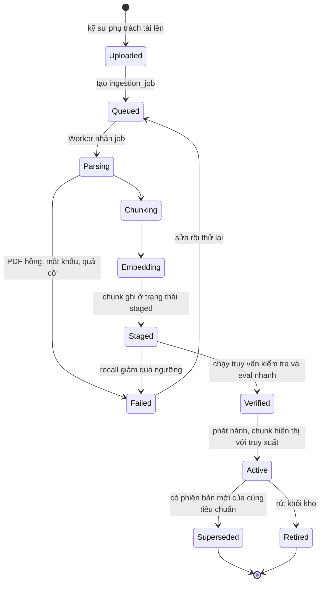
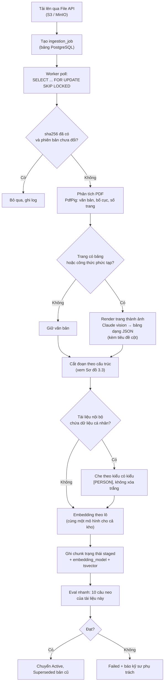
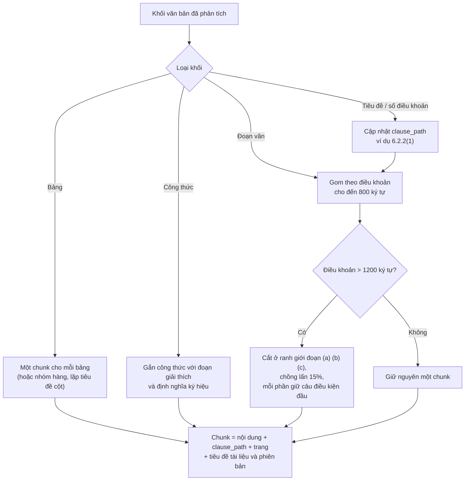
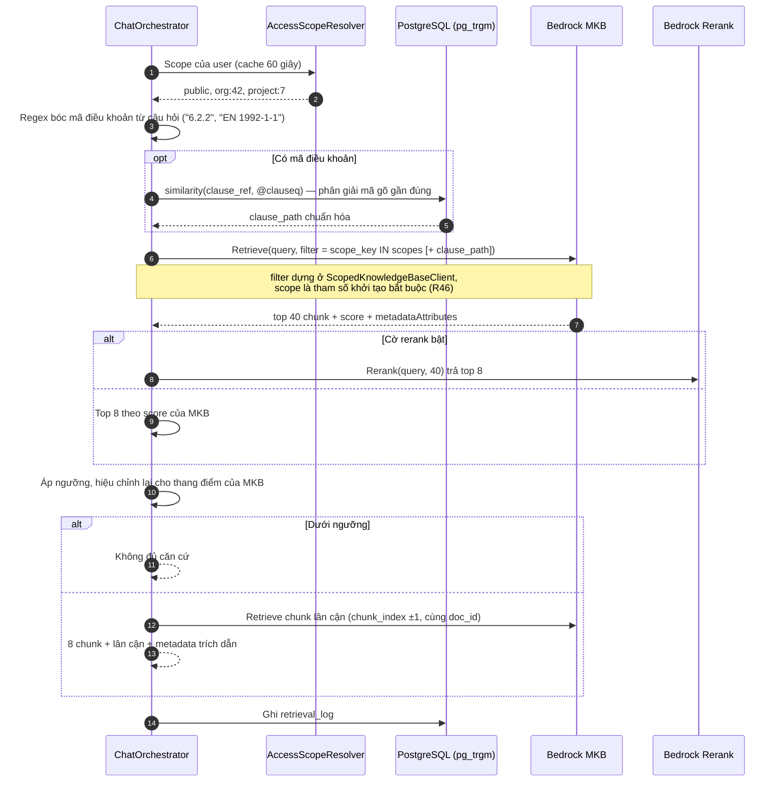
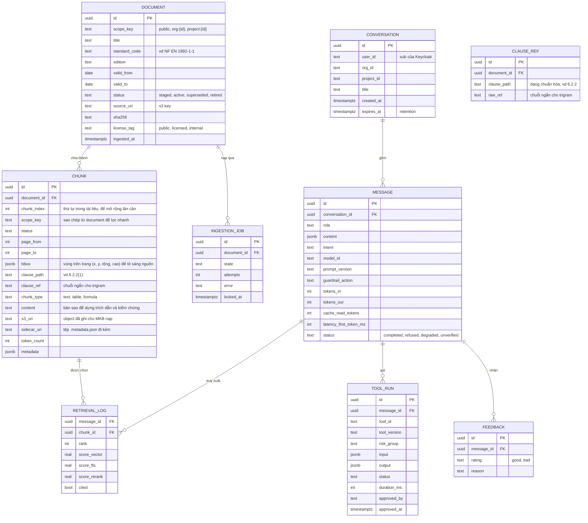
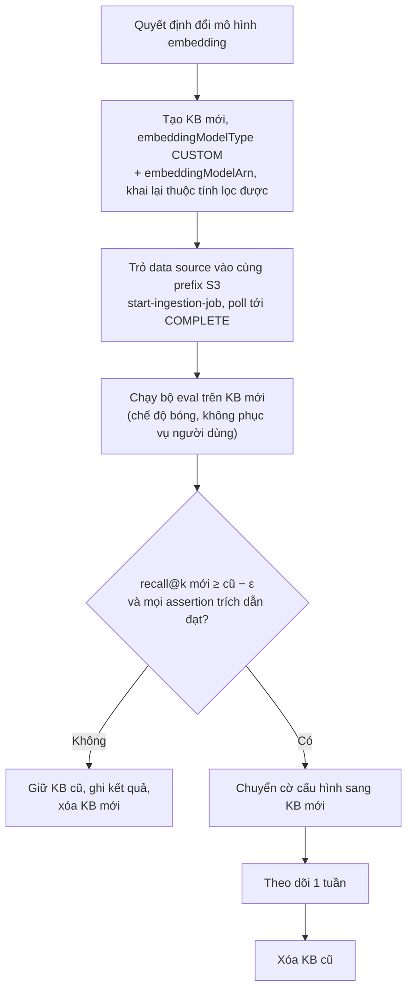

# 03 · RAG: nạp tài liệu và truy xuất

> **Đã cập nhật trong `ship/`.** File này ghi thiết kế RAG trước lượt rà soát nguồn 21/09/2026 — một số chi tiết `Retrieve`/`vectorSearchConfiguration` đã lỗi thời. Bản đã sửa, có nguồn kèm ngày fetch: `ship/00-thuat-ngu-va-nguon.md` và `ship/03-backend.md` mục 4A.

Hai luồng: **F4 nạp tài liệu** (offline, Worker) và **F1 truy xuất** (online, Assistant.Api). Chất lượng RAG là vấn đề của khâu tìm kiếm, không phải khâu viết câu trả lời: soát theo thứ tự tìm kiếm → nạp → prompt. **Tỉ lệ tìm đúng dưới 60–70% thì không tinh chỉnh prompt.**

---

## 1. Nạp tài liệu (F4)

### Vòng đời của một tài liệu

**Sơ đồ 3.1 — Trạng thái tài liệu và phiên bản**



**Quy tắc phiên bản:** một câu trả lời đúng theo bản tiêu chuẩn cũ là câu trả lời sai cho người đang làm theo bản mới. Vì vậy `document` mang `edition`, `valid_from`, `valid_to`; truy xuất mặc định chỉ lấy `status = 'active'`; trích dẫn luôn hiển thị **phiên bản tiêu chuẩn**.

### Pipeline

**Sơ đồ 3.2 — Pipeline nạp tài liệu**



**Chi tiết quyết định:**

| Điểm | Quyết định | Lý do |
| --- | --- | --- |
| Trình phân tích PDF | PdfPig cho văn bản; Claude vision chỉ cho trang có bảng/công thức | Bảng trong tiêu chuẩn bị mất tiêu đề cột khi cắt như văn xuôi; đây là bẫy gần như chắc chắn gặp. Vision chỉ chạy trên trang cần, giữ chi phí thấp |
| Ranh giới tích hợp `IDocumentParser` | Bộ phân tích PDF nằm sau interface; schema không phụ thuộc thư viện | Đầu vào bên ngoài (PDF, định dạng nhà xuất bản đổi) là phần **mong manh nhất** của hệ thống; đổi PdfPig hay bộ khác không được động vào schema. Kiểm tra bộ phân tích trên **mẫu đại diện** (kể cả trang bảng) trước khi tin: nhiều công cụ trả bảng rỗng hoặc sai cấu trúc mà không báo lỗi |
| Bảng nhiều trang | Nhận diện các mảnh liên tiếp có cùng số cột, bỏ tiêu đề lặp lại, **ghép thành một bảng** trước khi embedding | Nếu không, mảnh trang sau mất tiêu đề cột hoặc lặp tiêu đề gây nhiễu |
| Chunk con trỏ cho bảng | Văn bản dùng để embedding là **tóm tắt** của bảng (tên bảng, đại lượng, phạm vi áp dụng); nội dung đưa vào prompt là **bảng JSON đầy đủ** | Bảng phẳng thành văn xuôi làm mất quan hệ tiêu đề với ô số liệu; tóm tắt giúp tìm được, JSON giúp trả lời đúng |
| Kiểm tra bảng | Bảng lưu dạng JSON `{columns, rows}` và **kèm tiêu đề cột trong mỗi chunk** | Số liệu lấy ra mà mất tiêu đề cột là lỗi nguy hiểm |
| Trang bảng, phương án B | Cohere Embed v4 nhận **ảnh trang PDF** qua `inputs` xen kẽ ảnh + văn bản (tối đa 96 mục mỗi lượt, khoảng 20 MB mỗi request) | Dùng để tìm kiếm bảng khó trích xuất; câu trả lời vẫn cần bảng ở dạng văn bản/JSON có tiêu đề cột, nên vision-to-JSON ở bước phân tích vẫn là đường chính. Đo cả hai ở M2 |
| Phát hành hai bước (`staged` → `active`) | Chunk mới không hiển thị cho đến khi qua eval nhanh | Ngăn một tài liệu lỗi làm hỏng cả kho |
| Tệp nguồn bất biến | Tệp gốc ở S3 bật versioning, không ghi đè; chunk sinh ra là dữ liệu dẫn xuất dựng lại được | Giữ một lớp "nguồn sự thật" chưa che, chưa mã hóa ngữ nghĩa để xử lý lại khi đổi mô hình embedding hoặc cách cắt; lớp đã che PII là bản dẫn xuất |
| Giới hạn tải lên và phân tích | Trần kích thước, số trang, thời gian và bộ nhớ cho mỗi lần phân tích; hạn mức số tệp đang chờ theo organization; xác định loại tệp bằng nội dung (magic bytes), không chỉ đuôi tệp | Phân tích tệp không tin cậy tốn tài nguyên là bề mặt DoS (AI-Enhanced Web Apps ch11). Con số cụ thể chọn ở M1 theo tiêu chuẩn dài nhất thực tế |
| Quét mã độc tệp tải lên | Quét PDF/DOCX trước khi phân tích (dịch vụ quét malware cho S3 của AWS hoặc bộ quét tự chạy; **chưa xác minh ở tài liệu AWS trong lượt này**) | Tải tệp và xử lý là bề mặt tấn công (tệp độc hại, DoS bằng tệp lớn); phân tích chạy nền ở Worker, không nằm trên đường phục vụ người dùng; chỉ vai trò `Assistant.Curate` được tải lên |
| Nguồn gốc dữ liệu (provenance) | `sha256`, phiên bản, người nạp, thời điểm, `license_tag` lưu cùng `document` | Nguồn gốc là thứ cho phép **chứng minh** tính toàn vẹn với kiểm toán, khác với việc tự kiểm tra toàn vẹn |
| Idempotent và khởi động lại được | Mỗi `ingestion_job` chạy theo tài liệu; ghi chunk theo lô trong một transaction; chạy lại cùng job không tạo bản sao | Một tài liệu hỏng không được làm hỏng cả lô; tiêu chuẩn dài hàng nghìn trang: đọc và xử lý **từng trang/khoảng trang**, không nạp cả tệp vào bộ nhớ, và không cắt giữa bảng khi chia khoảng trang |
| Bỏ qua theo `sha256` | Không nhúng lại khi tệp không đổi | Tiết kiệm chi phí embedding |
| Che dữ liệu cá nhân | Che có kiểu (`[PERSON]`), không xóa trắng | Xóa trắng phá ngữ cảnh cần cho câu trả lời |

### Cắt đoạn theo cấu trúc

Một điều khoản bị cắt làm đôi mất điều kiện áp dụng nằm ở nửa kia. Với tra cứu tiêu chuẩn, đây là loại sai sót nguy hiểm nhất: câu trả lời đọc hợp lý nhưng thiếu điều kiện biên. Điểm khởi đầu **800 ký tự, chồng lấn 15%**, nhưng **ranh giới điều khoản ưu tiên hơn con số**.

**Sơ đồ 3.3 — Quyết định cắt đoạn**



Mỗi chunk **được tiền tố** bằng đường dẫn ngữ cảnh (`EN 1992-1-1:2004 · 6.2.2 Cắt · trang 84`) trước khi embedding, để vector mang cả vị trí điều khoản.

---

## 2. Truy xuất (F1)

**AD-17 (chốt 20/09/2026): truy xuất chạy trên Bedrock Managed Knowledge Base.** Bốn kiểm chứng chặn ở §2a.4 phải xong hết ngày 3.

### 2a. Thiết kế

#### 2a.1 Ranh giới trách nhiệm

MKB **không** thay được cả pipeline nạp. Nó nhận ba việc; phần còn lại vẫn ở `Assistant.Worker`.

| Việc | Ai làm | Ghi chú |
| --- | --- | --- |
| Parse PDF, đọc theo từng trang | `Assistant.Worker` | Không đổi |
| Cắt đoạn theo cấu trúc điều khoản | `Assistant.Worker` | Không đổi. MKB chunking mặc định không biết cấu trúc tiêu chuẩn NF EN |
| Giữ tiêu đề cột trong chunk bảng | `Assistant.Worker` | Không đổi |
| Ghi mỗi chunk thành một object S3 + metadata sidecar | `Assistant.Worker` | **Mới** |
| Embedding | MKB | `embeddingModelType: MANAGED` |
| Kho vector | MKB | Không cấp, không chỉnh |
| Truy xuất | MKB | `Retrieve` |
| Phân giải mã điều khoản | PostgreSQL `pg_trgm` | Giữ lại, xem §2a.3 |
| Rerank | Bedrock Rerank (gọi riêng) | Áp lên kết quả `Retrieve` |

Hệ quả cần nói thẳng: **`Assistant.Worker` không biến mất**, nên tiền đề của R43 (chi phí vận hành ingestion) vẫn còn nguyên. MKB bỏ được việc cấp và vận hành kho vector, không bỏ được việc hiểu tài liệu tiêu chuẩn.

Lý do Worker vẫn phải cắt đoạn: P2 buộc mọi trích dẫn truy được về **điều khoản và số trang**. Nạp thẳng PDF thô vào MKB cho chunk không mang `clause_path` và `page`, nên trích dẫn không dựng được.

#### 2a.2 Hình dạng dữ liệu nạp

Mỗi chunk là một object S3 kèm sidecar metadata. Metadata phải có mặt lúc nạp thì sau này mới lọc được.

```
s3://<bucket>/chunks/EN-1992-1-1-2004/6.2.2/0007.txt
s3://<bucket>/chunks/EN-1992-1-1-2004/6.2.2/0007.txt.metadata.json
```

```json
{
  "metadataAttributes": {
    "standard":    "EN 1992-1-1",
    "edition":     "2004",
    "clause_path": "6.2.2",
    "page":        84,
    "scope_key":   "public",
    "chunk_type":  "clause",
    "status":      "active",
    "doc_id":      "d3f1...",
    "chunk_index": 7
  }
}
```

**Thuộc tính metadata phải được khai là lọc được ngay lúc tạo KB hoặc tạo data source.** Lọc theo thuộc tính chưa khai **trả về rỗng và không báo lỗi** — cùng loại hỏng im lặng với `GuardrailVersion` thiếu (R30). Danh sách thuộc tính vì vậy phải chốt trước lô nạp đầu tiên, cùng lúc với việc chốt embedding.

**Trường `status` giữ lại vòng đời nạp.** MKB không có khái niệm chunk staged. Sách *Hands-On RAG for Production* xếp "chạy lại script nạp thẳng vào production" vào nhóm phản mẫu: một lỗi metadata làm hỏng chỉ mục cho mọi người dùng, nên quy tắc là **staged → verified → promote**. Cách giữ quy tắc đó trên MKB: Worker ghi sidecar `status: "staged"`, mọi truy vấn **luôn** lọc `status = "active"`, và phát hành là ghi lại sidecar rồi chạy lại `start-ingestion-job`. Cái giá: một lần nạp lại cho mỗi lần phát hành.

Nội dung object vẫn mang tiền tố ngữ cảnh `EN 1992-1-1:2004 · 6.2.2 Cắt · trang 84` như ở §1, để vector mang cả vị trí điều khoản.

**Tạo KB và data source** (hình dạng bắt buộc của đường managed — **không** phải `s3Configuration.bucketArn` như một số bài blog):

```bash
aws bedrock-agent create-knowledge-base --name vf-standards \
  --role-arn arn:aws:iam::<account-id>:role/AmazonBedrockExecutionRoleForKB-vf-standards \
  --knowledge-base-configuration '{"type":"MANAGED","managedKnowledgeBaseConfiguration":{"embeddingModelType":"MANAGED"}}'

aws bedrock-agent create-data-source --knowledge-base-id <kb-id> --name vf-chunks \
  --data-source-configuration '{"type":"MANAGED_KNOWLEDGE_BASE_CONNECTOR","managedKnowledgeBaseConnectorConfiguration":{"connectorParameters":{"type":"S3","version":"1","connectionConfiguration":{"bucketName":"<bucket>","bucketOwnerAccountId":"<account-id>"}}}}'
```

Không truyền `--storage-configuration`: kho vector do MKB quản. Tạo KB và tạo data source đều **bất đồng bộ**; poll `get-knowledge-base` tới `ACTIVE` và `get-data-source` tới `AVAILABLE` rồi mới `start-ingestion-job`. Truy vấn trước khi ingestion `COMPLETE` trả về rỗng.

Role của KB chỉ cần quyền đọc S3 (`s3:ListBucket`, `s3:GetObject` theo ARN cụ thể), **không** cần quyền kho vector và **không** cần `bedrock:InvokeModel` khi dùng embedding managed. Trust policy giữ `aws:SourceAccount` và `aws:SourceArn`; sau khi tạo xong thì siết `knowledge-base/*` về đúng KB ID.

#### 2a.3 Luồng truy vấn

**Sơ đồ 3.4 — Truy xuất qua MKB, hai chặng**



**Bốn tham số `Retrieve` mà mặc định là sai với bài toán này:**

| Tham số | Mặc định | Đặt thành | Vì sao |
| --- | --- | --- | --- |
| `numberOfResults` | **5** | 40 | Cùng loại bẫy với `maxTokens`: bỏ trống là nhận mặc định của dịch vụ, không phải giá trị mình cần. Ngân sách rerank của tài liệu này tính trên 40 |
| `overrideSearchType` | Không đặt, Bedrock tự chọn | **Chưa quyết được** | `HYBRID` chỉ có ở kho vector OpenSearch Serverless, RDS (gồm Aurora PostgreSQL) và MongoDB Atlas. Kho của MKB là kho managed, **không nằm trong danh sách đó**, nên nhiều khả năng chỉ có `SEMANTIC`. Đây là V-K5 |
| Ngưỡng điểm | Không đặt | 0.5 rồi hiệu chỉnh | Thang điểm của MKB không giống thang cosine, nên không bê con số của một hệ khác sang. Tài liệu AWS khuyên bắt đầu ở 0.5. Đặt quá cao thì không trả về gì — lỗi phổ biến nhất |
| `filter` | Không đặt | Luôn có `scope_key` và `status` | Xem R46 |

**Toán tử lọc dùng được và toán tử phải tránh.** `equals`, `notEquals`, `in`, `notIn`, `greaterThan(OrEquals)`, `lessThan(OrEquals)` dùng được rộng rãi. **`startsWith`, `stringContains` và `listContains` bị bỏ qua im lặng** trên kho vector không hỗ trợ — filter không chạy, truy vấn vẫn trả về kết quả, không có lỗi. Vì vậy `clause_path` **không được lọc bằng `startsWith`**; chặng trigram phải trả về danh sách `clause_path` đầy đủ rồi lọc bằng `in`.

```json
{
  "andAll": [
    { "in":     { "key": "scope_key", "value": ["public", "org:42", "project:7"] } },
    { "equals": { "key": "status",    "value": "active" } },
    { "in":     { "key": "clause_path", "value": ["6.2.2", "6.2.3"] } }
  ]
}
```

Hai chặng tồn tại vì MKB không có tương đương của trigram. Tìm vector kém khi tra chính xác số hiệu điều khoản, và `6.2.2` gõ thành `6.22` thì cả vector lẫn từ khóa đều trượt. Giữ một bảng nhỏ `clause_ref` trong PostgreSQL để phân giải mã, rồi đưa kết quả vào bộ lọc metadata. **PostgreSQL vì vậy vẫn nằm trong đường truy xuất**, dù kho chunk đã chuyển sang MKB.

**Lọc quyền — một lớp duy nhất được phép gọi `Retrieve`:**

```csharp
// Không có đường nào khác trong codebase được gọi Retrieve.
// Architecture test trong CI chặn mọi tham chiếu trực tiếp tới
// bedrock-agent-runtime retrieve ngoài lớp này.
sealed class ScopedKnowledgeBaseClient
{
    private readonly IReadOnlyList<string> _scopes;   // bắt buộc, không có giá trị mặc định

    public ScopedKnowledgeBaseClient(IReadOnlyList<string> resolvedScopes)
    {
        if (resolvedScopes is null || resolvedScopes.Count == 0)
            throw new ArgumentException("Scope rỗng: từ chối truy vấn.", nameof(resolvedScopes));
        _scopes = resolvedScopes;
    }

    public Task<RetrieveResponse> RetrieveAsync(string query, string? clausePath, CancellationToken ct)
        => _runtime.RetrieveAsync(new RetrieveRequest
        {
            KnowledgeBaseId    = _kbId,
            RetrievalQuery     = new KnowledgeBaseQuery { Text = query },
            RetrievalConfiguration = new KnowledgeBaseRetrievalConfiguration
            {
                VectorSearchConfiguration = new KnowledgeBaseVectorSearchConfiguration
                {
                    NumberOfResults = 40,
                    Filter = BuildFilter(_scopes, clausePath)   // luôn có, không nhánh nào bỏ qua
                }
            }
        }, ct);
}
```

`scope_key` được `AccessScopeResolver` tính từ token người dùng. **Không bao giờ nhận `scope_key` từ client.**

#### 2a.4 Bốn kiểm chứng chặn — hạn hết ngày 3 (23/09)

| Mã | Kiểm | Trượt thì sao |
| --- | --- | --- |
| V-K2 | MKB có GA ở `eu-central-1` không. MKB chỉ GA ở một tập region, phải tra `bedrock` endpoints rồi mới kết luận | Chọn vùng ngoài EU đụng thẳng AD-03, AD-14 và nghĩa vụ pháp lý ở R40, nên không phải phương án. Phải đưa lại quyết định lên bàn ngay trong tuần 1 |
| V-K3 | AWS SDK for .NET có `type: MANAGED` và `MANAGED_KNOWLEDGE_BASE_CONNECTOR` không. Tham chiếu của AWS chỉ nêu mốc boto3/botocore ≥ 1.43.64, **không nói gì về .NET**, mà toàn bộ backend là .NET | Không tạo được KB từ mã .NET thì phải dựng một lớp điều khiển riêng, hoặc đưa lại quyết định lên bàn |
| V-K4 | Managed S3 connector có đọc `.metadata.json` sidecar và khai được thuộc tính lọc được không | Không lọc được quyền trong truy vấn thì **không có phương án vòng**: đây là điều kiện sống còn của thiết kế, phải đưa lại quyết định lên bàn ngay |
| V-K5 | Kho vector của MKB có nhận `overrideSearchType: HYBRID` không | Chỉ còn `SEMANTIC`. Nhánh từ khóa biến mất, nên `pg_trgm` ở chặng 1 chuyển từ **bổ trợ** thành **bắt buộc**, và có thể phải thêm một bảng FTS nhỏ trong PostgreSQL cho câu hỏi nặng từ khóa |

V-K4 là cái nguy hiểm nhất vì nó **hỏng im lặng** theo ba đường khác nhau: thuộc tính chưa khai là lọc được thì trả về rỗng; toán tử không hỗ trợ thì bị bỏ qua và trả về **tất cả**; sidecar không đọc được thì cũng trả về tất cả. Không đường nào trong ba đường đó báo lỗi.

Cách kiểm V-K4, làm đủ ba bước: (1) nạp hai chunk khác `scope_key`, `Retrieve` kèm filter, xác nhận chỉ trả về một; (2) lọc trên một thuộc tính **chưa khai** và xác nhận hành vi là rỗng chứ không phải trả về tất cả; (3) thử `startsWith` trên `clause_path` và xác nhận nó bị bỏ qua — biết trước để không bao giờ dùng.

Bốn kiểm chứng này chặn ngang hàng với V-A1 và V-A6, không phải việc của M0.

#### 2a.5 Cái không còn tự chủ được

| Không còn nắm | Hệ quả |
| --- | --- |
| Hợp nhất nhiều nhánh tìm bằng RRF | Còn hai đường: `Retrieve` của MKB và trigram phân giải mã. Không tự đặt được hệ số cho từng nhánh |
| `m`, `ef_construction`, `ef_search`, `hnsw.iterative_scan` | Không chỉnh được. Bài toán "bộ lọc chọn lọc mạnh làm HNSW bỏ sót ứng viên" chuyển thành hộp đen — đo recall **theo từng scope** vì vậy càng bắt buộc |
| Chọn chiều vector | Theo embedding managed |
| `PARTITION BY LIST (scope_key)` khi lọc quá chọn lọc | Không có đường này nữa |
| Cấu hình FTS `fr_unaccent` và `english` riêng theo ngôn ngữ câu hỏi | MKB tự xử lý. Đo recall tách theo ngôn ngữ ở G1 vì vậy càng bắt buộc |
| Đổi mô hình embedding sau khi nạp | Phải tạo lại KB và nạp lại toàn kho (AD-06) |

#### 2a.6 Ngân sách độ trễ (mục tiêu, đo thật ở M0)

| Bước | Mục tiêu | Ghi chú |
| --- | --- | --- |
| Auth + quota + scope | ≲ 50 ms | Cache scope 60 giây |
| Guardrail input | song song, không cộng dồn | |
| Định tuyến + viết lại + bóc `case_hints` (Haiku) | ~300–500 ms | **Mọi lượt đều trả khoản này** kể từ AD-15 |
| Phân giải mã điều khoản (`pg_trgm`) | ≲ 20 ms | Chỉ chạy khi câu hỏi có mã |
| `Retrieve` của MKB | **Chưa đo** | Đo thật ở V-K2. Không suy ra từ số của một hệ khác |
| Rerank | ~200–400 ms | Sau cờ, tắt được nếu vỡ ngân sách |
| Chữ đầu tiên từ Sonnet | ~1–1,5 s | Prompt caching cho khối tĩnh |
| **Tổng tới chữ đầu tiên** | **≲ 3 s** | Vượt 10 giây thì chỉ báo tiến trình là bắt buộc |

Ngân sách này **chưa cộng được** vì thiếu số đo của `Retrieve`. Không có số thì không hứa tiêu chí độ trễ.

#### 2a.7 Quan sát và kiểm toán

`Retrieve` là **CloudTrail data event**, mặc định **không ghi**. Phải bật data-event selector cho `AWS::Bedrock::KnowledgeBase` ngay khi tạo KB, nếu không thì không truy được ai đã truy vấn cái gì — trong khi kho chứa tài liệu có ràng buộc bản quyền và có scope theo organization.

Log group nhận trace truy xuất mã hóa bằng KMS customer-managed: kết quả truy xuất phơi được bất kỳ dữ liệu nào đã nạp.

`ApplyGuardrail` trên nội dung chunk **trước khi** vào `toolResult` giữ nguyên ở facade. Đây là chỗ dễ đánh rơi nhất khi viết lại `search_documents` để gọi `Retrieve`.

---

#### 2a.8 Chia lại ranh giới tự xây và mua, theo từng thành phần

Sách *Hands-On RAG for Production* xếp Bedrock Knowledge Bases vào nhóm **"platform of services"**: nó gom sẵn các thành phần managed, nhưng vẫn bắt mình chọn, cấu hình và ghép chúng lại — khác với một nền tảng RAG trọn gói giấu mọi thứ sau một API. Sách cũng nói rõ: quyết định tự xây hay mua phải cân **theo từng thành phần**, không phải một lựa chọn nhị phân cho cả pipeline.

Áp vào đây:

| Thành phần | Sau AD-17 | Vì sao |
| --- | --- | --- |
| Parse PDF | Tự xây | Lỗi parse **không sửa được ở khâu sau**. Tiêu chuẩn NF EN có bảng, mất tiêu đề cột là mất tất cả |
| Cắt đoạn | Tự xây | P2 buộc trích dẫn về điều khoản và trang |
| Embedding | Mua (MKB managed) | Không có lý do tự vận hành |
| Kho vector | Mua (MKB) | Bỏ được HNSW, `ef_search`, phân vùng scope, nhúng lại khi đổi chiều |
| Truy xuất ngữ nghĩa | Mua (`Retrieve`) | |
| Tra mã điều khoản | Tự xây (`pg_trgm`) | MKB không có tương đương |
| Rerank | Mua (Bedrock Rerank) | Đã là API sẵn |
| Hậu kiểm số và trích dẫn | Tự xây | P1 và P2 là luật riêng của ngành, không dịch vụ nào biết |

Sách cũng cảnh báo một điều khớp chính xác với AD-06: **đổi mô hình embedding sau này là mã hóa lại toàn bộ kho**. Với MKB thì nặng hơn — phải tạo lại KB.

#### 2a.9 Bốn dịch vụ AWS sẵn có nên dùng thêm

Bốn đề xuất dưới đây là **Proposed**, chưa chốt. Chúng nhắm vào bốn chỗ tài liệu đang tự viết mà AWS đã có sẵn.

| Mã | Đề xuất | Thay cho | Đánh đổi |
| --- | --- | --- | --- |
| AD-18 | **Bedrock Evaluation** chạy song song với golden set trong CI | Chỉ có golden set tự chấm | Managed, Claude-as-judge, có chấm responsible-AI. Vẫn giữ golden set làm cổng chặn vì nó đo đúng nhóm câu của ngành; Bedrock Evaluation bắt phần tổng quát |
| AD-19 | **Bedrock Prompt Management** giữ prompt router và prompt trả lời | Prompt hằng trong mã C# | Sách Bedrock xếp "prompt hằng trong mã" vào phản mẫu: sửa prompt phải deploy lại. Tách ra thì người phụ trách tri thức chỉnh được. Đổi lại: thêm một nơi phải kiểm soát phiên bản |
| AD-20 | **Step Functions + S3 Event Notification** điều phối ingestion: parse → chunk → ghi S3 → `start-ingestion-job` → poll `COMPLETE` → promote | Bảng hàng đợi PostgreSQL `FOR UPDATE SKIP LOCKED` cho nhánh ingestion | Mỗi chặng tự retry và debug riêng; không phải tự viết máy trạng thái job. AD-11 giữ nguyên cho các job nền khác. Đổi lại: thêm một hạ tầng vào POC đã nén (R39) |
| AD-21 | **Batch inference** (`CreateModelInvocationJob`) khi chạy golden set và chấm eval hàng loạt | Gọi `Converse` từng câu | Giảm 50% so với on-demand, áp cho phần việc không ai ngồi chờ. Không dùng cho đường phục vụ người dùng |

Ba việc nhỏ hơn, không cần thành AD:

- **Retry bằng cấu hình SDK** (`standard` hoặc `adaptive`), không viết vòng `Thread.Sleep`. Retry đồng loạt tạo hiệu ứng bầy đàn và làm throttling nặng thêm.
- **AWS Budgets và Cost Anomaly Detection** bật **trước** khi tăng lưu lượng, không phải sau.
- **CloudTrail data event** cho `AWS::Bedrock::KnowledgeBase` bật ngay lúc tạo KB.

Một chỗ **chưa tra được, không chốt**: khâu parse PDF có thể chuyển sang dịch vụ trích xuất tài liệu của AWS thay vì tự viết. Chưa xác minh dịch vụ nào giữ được cấu trúc điều khoản và tiêu đề cột của tiêu chuẩn NF EN tiếng Pháp, nên tài liệu này **không** đề xuất. Nếu muốn theo hướng đó thì đó là một kiểm chứng riêng, không phải một quyết định.

---

## 3. Mô hình dữ liệu

**Sơ đồ 3.5 — ERD schema `assistant` (phần tài liệu và hội thoại)**



Các chỉ mục bắt buộc trong PostgreSQL: GIN `gin_trgm_ops` trên `clause_ref.raw_ref` cho chặng phân giải mã điều khoản; B-tree trên `chunk (document_id, chunk_index)` để mở rộng lân cận; B-tree trên `(scope_key, status)`.

Không còn cột `embedding`, không còn `content_tsv`, không còn chỉ mục HNSW: embedding và kho vector nằm ở Managed Knowledge Base (AD-17). Bảng `chunk` giữ lại **bản sao nội dung và siêu dữ liệu** để dựng trích dẫn, chạy `CitationValidator` và dựng lại kho khi cần nạp lại — nó là sổ cái của những gì đã đẩy sang MKB, không phải chỉ mục tìm kiếm.

**Bất biến tuyệt đối:** tài liệu và câu hỏi phải dùng **cùng một** mô hình embedding. Với MKB thì điều này tự đúng vì cả hai đầu đều do KB lo — cái phải giữ là **không tạo hai KB khác embedding rồi truy vấn lẫn lộn**. Quy ước `input_type` (`search_document` khi nạp, `search_query` khi hỏi với mô hình Cohere). Đây là lỗi tích hợp phổ biến nhất và hỏng trong im lặng.

---

### Cách ly tenant khi truy xuất

| Phương án | Khi nào | Quyết định |
| --- | --- | --- |
| **Một KB dùng chung + `scope_key` lọc bằng metadata filter** | Mặc định; tiết kiệm chi phí | **Chọn** cho 8 tuần |
| KB riêng cho từng organization | Organization có yêu cầu quy định hoặc hợp đồng bắt buộc cách ly vật lý | Để dành; thiết kế hiện tại không cản đường (cùng cấu trúc bảng, đổi chuỗi kết nối) |

## 4. Thay mô hình embedding

Mô hình embedding **không đổi được sau khi tạo KB**. Đổi ý nghĩa là **tạo một KB mới và nạp lại toàn bộ**, không phải thêm một cột rồi chuyển cờ. Vì vậy AD-06 bắt chốt mô hình **trước lô nạp đầu tiên**.

Quy trình chuyển đổi an toàn, không gián đoạn người dùng:

**Sơ đồ 3.6 — Chuyển sang KB mới mà không downtime**



Chi tiết dễ quên: **KB mới phải khai lại danh sách thuộc tính metadata lọc được**. Khai thiếu thì bộ lọc `scope_key` trả rỗng và không báo lỗi (R47) — đúng lúc đang chạy eval so sánh, số sẽ trông như "mô hình mới kém hẳn" trong khi lỗi nằm ở cấu hình.

Chunk trên S3 **không phải tạo lại**: object và sidecar giữ nguyên, chỉ nạp lại vào KB mới. Đây là lý do `Assistant.Worker` ghi chunk ra S3 thay vì đẩy thẳng nội dung vào KB.

---

## 5. Kho nguồn tiêu chuẩn và bản quyền

Các tiêu chuẩn NF EN (AFNOR) thường có bản quyền và điều khoản sử dụng hạn chế việc sao chép và xử lý tự động. Cột `license_tag` và cờ `Assistant.Curate` tồn tại để **kiểm soát ai nạp gì**. Việc xác nhận quyền ingest là điều kiện tiên quyết của tuần 1 (xem GĐ-6 và rủi ro R2 ở [12-rui-ro.md](12-rui-ro.md)). Nếu chưa có quyền, kho khởi điểm gồm tài liệu nội bộ và tiêu chuẩn miễn phí; kiến trúc không đổi.

---

## 6. Tài liệu hướng dẫn sử dụng VF (`app_help`)

Yêu cầu 2 của tài liệu cuộc họp (hỏi đáp chức năng VF, hướng dẫn thao tác) dùng **cùng pipeline** với hỏi đáp tiêu chuẩn, khác ở dữ liệu và bộ lọc. Bản trước của bộ tài liệu này chưa có mục này.

| Chủ đề | Quyết định | Lý do |
| --- | --- | --- |
| Nguồn | Hướng dẫn sử dụng, mô tả chức năng, tài liệu phát hành (release notes) của VF, nếu có ở dạng nạp được (Q5, [12](12-rui-ro.md)) | Không bịa chức năng: nội dung trả lời chỉ đến từ tài liệu đã nạp |
| Trường bổ sung ở `document` | `doc_type` (`standard`, `internal_procedure`, `app_help`), `app_version`, `module`, `ui_path` (đường đi menu) | Bộ lọc theo ý định: `doc_qa` lọc `standard` và `internal_procedure`, `app_help` lọc `app_help`; tránh trộn hướng dẫn phần mềm với điều khoản tiêu chuẩn |
| Phạm vi quyền | Toàn cục, không theo organization (`scope_key = global`) | Hướng dẫn dùng phần mềm giống nhau giữa các organization; vẫn đi qua cùng bộ lọc scope |
| Cắt đoạn | Theo tiêu đề và **danh sách bước thao tác giữ nguyên vẹn** (không cắt giữa danh sách bước) | Cắt giữa danh sách bước cho câu trả lời thiếu bước |
| Phiên bản | Câu trả lời nêu phiên bản VF của tài liệu; khi tài liệu ghi phiên bản khác với phiên bản người dùng đang chạy (nếu biết), cảnh báo | Hướng dẫn cũ dẫn tới thao tác sai (R36) |
| Tính năng không có trong tài liệu | Từ chối theo cách chung ("không có trong tài liệu"), không suy đoán | Cùng quy tắc với câu hỏi ngoài phạm vi |
| Ngoài POC | Ảnh chụp màn hình trong hướng dẫn (vision), liên kết mở đúng màn hình | Giới hạn tính năng POC |
