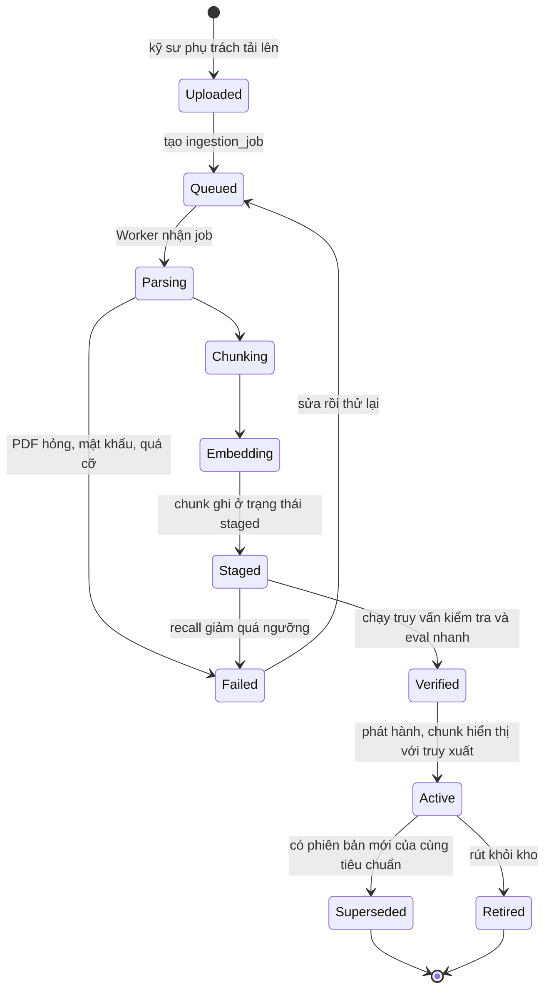
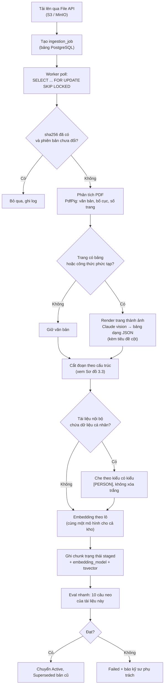
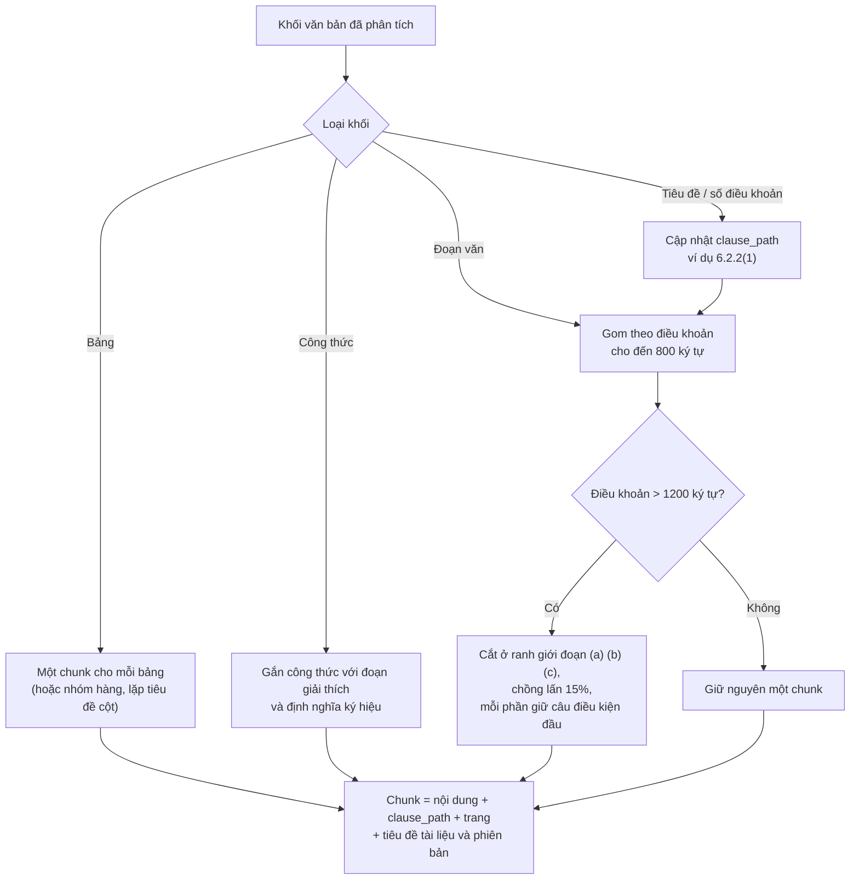
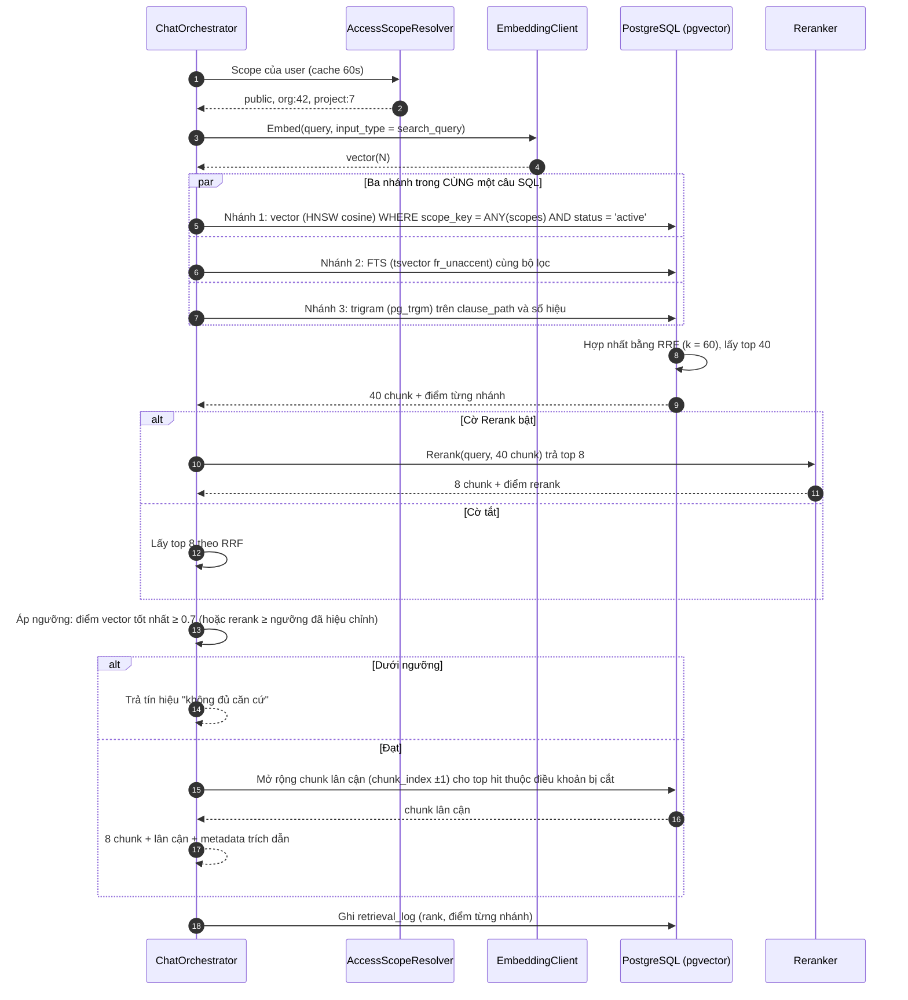
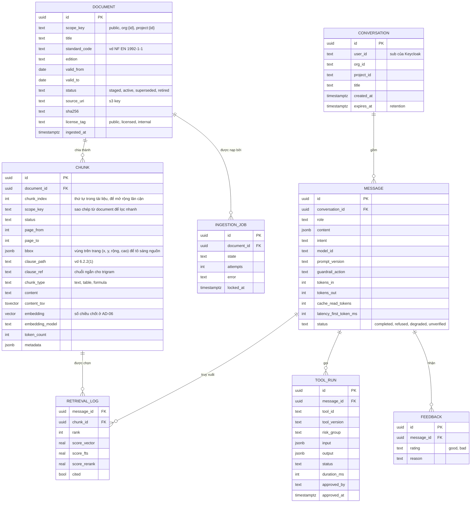
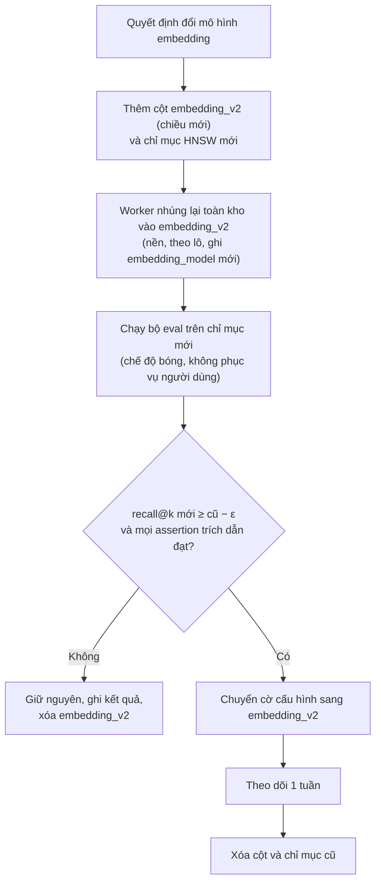

# 03 · RAG: nạp tài liệu và truy xuất

Hai luồng: **F4 nạp tài liệu** (offline, Worker) và **F1 truy xuất** (online, Assistant.Api). Chất lượng RAG là vấn đề của khâu tìm kiếm, không phải khâu viết câu trả lời: soát theo thứ tự tìm kiếm → nạp → prompt. **Tỉ lệ tìm đúng dưới 60–70% thì không tinh chỉnh prompt.**

---

## 1. Nạp tài liệu (F4)

### Vòng đời của một tài liệu

**Sơ đồ 3.1 — Trạng thái tài liệu và phiên bản**



**Quy tắc phiên bản:** một câu trả lời đúng theo bản tiêu chuẩn cũ là câu trả lời sai cho người đang làm theo bản mới. Vì vậy `document` mang `edition`, `valid_from`, `valid_to`; truy xuất mặc định chỉ lấy `status = 'active'`; trích dẫn luôn hiển thị **phiên bản tiêu chuẩn**.

### Pipeline

**Sơ đồ 3.2 — Pipeline nạp tài liệu**



**Chi tiết quyết định:**

| Điểm | Quyết định | Lý do |
| --- | --- | --- |
| Trình phân tích PDF | PdfPig cho văn bản; Claude vision chỉ cho trang có bảng/công thức | Bảng trong tiêu chuẩn bị mất tiêu đề cột khi cắt như văn xuôi; đây là bẫy gần như chắc chắn gặp. Vision chỉ chạy trên trang cần, giữ chi phí thấp |
| Ranh giới tích hợp `IDocumentParser` | Bộ phân tích PDF nằm sau interface; schema không phụ thuộc thư viện | Đầu vào bên ngoài (PDF, định dạng nhà xuất bản đổi) là phần **mong manh nhất** của hệ thống; đổi PdfPig hay bộ khác không được động vào schema. Kiểm tra bộ phân tích trên **mẫu đại diện** (kể cả trang bảng) trước khi tin: nhiều công cụ trả bảng rỗng hoặc sai cấu trúc mà không báo lỗi |
| Bảng nhiều trang | Nhận diện các mảnh liên tiếp có cùng số cột, bỏ tiêu đề lặp lại, **ghép thành một bảng** trước khi embedding | Nếu không, mảnh trang sau mất tiêu đề cột hoặc lặp tiêu đề gây nhiễu |
| Chunk con trỏ cho bảng | Văn bản dùng để embedding là **tóm tắt** của bảng (tên bảng, đại lượng, phạm vi áp dụng); nội dung đưa vào prompt là **bảng JSON đầy đủ** | Bảng phẳng thành văn xuôi làm mất quan hệ tiêu đề với ô số liệu; tóm tắt giúp tìm được, JSON giúp trả lời đúng |
| Kiểm tra bảng | Bảng lưu dạng JSON `{columns, rows}` và **kèm tiêu đề cột trong mỗi chunk** | Số liệu lấy ra mà mất tiêu đề cột là lỗi nguy hiểm |
| Trang bảng, phương án B | Cohere Embed v4 nhận **ảnh trang PDF** qua `inputs` xen kẽ ảnh + văn bản (tối đa 96 mục mỗi lượt, khoảng 20 MB mỗi request) | Dùng để tìm kiếm bảng khó trích xuất; câu trả lời vẫn cần bảng ở dạng văn bản/JSON có tiêu đề cột, nên vision-to-JSON ở bước phân tích vẫn là đường chính. Đo cả hai ở M2 |
| Phát hành hai bước (`staged` → `active`) | Chunk mới không hiển thị cho đến khi qua eval nhanh | Ngăn một tài liệu lỗi làm hỏng cả kho |
| Tệp nguồn bất biến | Tệp gốc ở S3 bật versioning, không ghi đè; chunk sinh ra là dữ liệu dẫn xuất dựng lại được | Giữ một lớp "nguồn sự thật" chưa che, chưa mã hóa ngữ nghĩa để xử lý lại khi đổi mô hình embedding hoặc cách cắt; lớp đã che PII là bản dẫn xuất |
| Giới hạn tải lên và phân tích | Trần kích thước, số trang, thời gian và bộ nhớ cho mỗi lần phân tích; hạn mức số tệp đang chờ theo organization; xác định loại tệp bằng nội dung (magic bytes), không chỉ đuôi tệp | Phân tích tệp không tin cậy tốn tài nguyên là bề mặt DoS (AI-Enhanced Web Apps ch11). Con số cụ thể chọn ở M1 theo tiêu chuẩn dài nhất thực tế |
| Quét mã độc tệp tải lên | Quét PDF/DOCX trước khi phân tích (dịch vụ quét malware cho S3 của AWS hoặc bộ quét tự chạy; **chưa xác minh ở tài liệu AWS trong lượt này**) | Tải tệp và xử lý là bề mặt tấn công (tệp độc hại, DoS bằng tệp lớn); phân tích chạy nền ở Worker, không nằm trên đường phục vụ người dùng; chỉ vai trò `Assistant.Curate` được tải lên |
| Nguồn gốc dữ liệu (provenance) | `sha256`, phiên bản, người nạp, thời điểm, `license_tag` lưu cùng `document` | Nguồn gốc là thứ cho phép **chứng minh** tính toàn vẹn với kiểm toán, khác với việc tự kiểm tra toàn vẹn |
| Idempotent và khởi động lại được | Mỗi `ingestion_job` chạy theo tài liệu; ghi chunk theo lô trong một transaction; chạy lại cùng job không tạo bản sao | Một tài liệu hỏng không được làm hỏng cả lô; tiêu chuẩn dài hàng nghìn trang: đọc và xử lý **từng trang/khoảng trang**, không nạp cả tệp vào bộ nhớ, và không cắt giữa bảng khi chia khoảng trang |
| Bỏ qua theo `sha256` | Không nhúng lại khi tệp không đổi | Tiết kiệm chi phí embedding |
| Che dữ liệu cá nhân | Che có kiểu (`[PERSON]`), không xóa trắng | Xóa trắng phá ngữ cảnh cần cho câu trả lời |

### Cắt đoạn theo cấu trúc

Một điều khoản bị cắt làm đôi mất điều kiện áp dụng nằm ở nửa kia. Với tra cứu tiêu chuẩn, đây là loại sai sót nguy hiểm nhất: câu trả lời đọc hợp lý nhưng thiếu điều kiện biên. Điểm khởi đầu **800 ký tự, chồng lấn 15%**, nhưng **ranh giới điều khoản ưu tiên hơn con số**.

**Sơ đồ 3.3 — Quyết định cắt đoạn**



Mỗi chunk **được tiền tố** bằng đường dẫn ngữ cảnh (`EN 1992-1-1:2004 · 6.2.2 Cắt · trang 84`) trước khi embedding, để vector mang cả vị trí điều khoản.

---

## 2. Truy xuất (F1)

### Luồng truy vấn

**Sơ đồ 3.4 — Sequence: hybrid retrieval có lọc quyền**



**Câu SQL ở dạng khung** (tham số hóa, không nối chuỗi):

```sql
WITH vec AS (
  SELECT id, ROW_NUMBER() OVER (ORDER BY embedding <=> @qvec) AS r
  FROM assistant.chunk
  WHERE scope_key = ANY(@scopes) AND status = 'active'
  ORDER BY embedding <=> @qvec
  LIMIT 40
), fts AS (
  SELECT id, ROW_NUMBER() OVER (ORDER BY ts_rank_cd(content_tsv, q) DESC) AS r
  FROM assistant.chunk, websearch_to_tsquery('fr_unaccent', @qtext) q
  WHERE scope_key = ANY(@scopes) AND status = 'active' AND content_tsv @@ q
  LIMIT 40
), tri AS (
  -- @clauseq = mã điều khoản/số hiệu trích từ câu hỏi bằng regex ("6.2.2", "EN 1992-1-1").
  -- Không có mã thì bỏ nhánh này, không truyền cả câu hỏi vào trigram.
  SELECT id, ROW_NUMBER() OVER (ORDER BY similarity(clause_ref, @clauseq) DESC) AS r
  FROM assistant.chunk
  WHERE scope_key = ANY(@scopes) AND status = 'active' AND clause_ref % @clauseq
  LIMIT 20
)
SELECT c.id, SUM(1.0 / (60 + x.r)) AS rrf
FROM (SELECT * FROM vec UNION ALL SELECT * FROM fts UNION ALL SELECT * FROM tri) x
JOIN assistant.chunk c USING (id)
GROUP BY c.id
ORDER BY rrf DESC
LIMIT 40;
```

**Vì sao ba nhánh:** tìm vector giỏi khái niệm nhưng kém khi tra chính xác số hiệu điều khoản ("6.2.2", "NF EN 1992-1-1"). FTS bắt từ khóa; trigram bắt số hiệu gần đúng. RRF hợp nhất theo **thứ hạng**, nên không cần chuẩn hóa điểm BM25 (không có trần) với cosine (có trần). Sách Vector Databases dùng cộng có trọng số 0,7/0,3 sau khi chuẩn hóa BM25 theo giá trị lớn nhất; RRF được chọn vì bỏ được bước chuẩn hóa và không phải tinh chỉnh trọng số. Nếu eval cho thấy cần lệch về một nhánh, thêm hệ số cho từng nhánh trong tổng RRF.

### Quyết định cấu hình

| Tham số | Giá trị khởi điểm | Cách chốt |
| --- | --- | --- |
| Chỉ mục vector | HNSW, `m = 16`, `ef_construction = 64`, cosine | Đủ tới ~10 triệu vector; kho dự kiến < 1 triệu chunk |
| `hnsw.ef_search` | 80 | Tinh chỉnh theo recall/độ trễ ở tuần 3 |
| Lọc kết hợp HNSW | Bật `hnsw.iterative_scan` (pgvector ≥ 0.8.0; trên RDS PostgreSQL là 15.18+, 16.6+ hoặc 17.3+, PostgreSQL 14 chỉ có 0.7.4; Aurora và bản tự quản kiểm tra riêng ở M0) hoặc overfetch × 10 rồi lọc | Bộ lọc `scope_key` chọn lọc rất mạnh (tài liệu của một organization là phần nhỏ của kho) có thể làm HNSW trả ít hơn `LIMIT` hoặc bỏ sót ứng viên: **lỗi im lặng**. Bắt buộc đo recall **theo từng scope** ở M3 |
| Chiều vector | Chốt theo M2c | Cohere Embed v4 cho `output_dimension` 256/512/1024/1536 (mặc định 1536); Titan V2 cho 256/512/1024. Chiều nhỏ hơn giảm bộ nhớ HNSW; 1536 chỉ đáng khi eval cho thấy recall tốt hơn rõ rệt |
| Ngưỡng theo mô hình | Hiệu chỉnh riêng cho từng mô hình embedding | 0.7 là điểm khởi đầu của sách cho cosine (`1 - (a <=> b)`) trên văn bản khoa học; phân phối điểm của Cohere Embed v4 và Titan V2 khác nhau |
| Cắt cụt embedding | Cohere Embed v4: `truncate = NONE` | Chunk vượt giới hạn phải **báo lỗi**, không bị cắt âm thầm làm mất thông tin. Giới hạn của mô hình embedding thường nhỏ hơn của LLM: chunk phải nằm dưới mức nhỏ hơn |
| Phân vùng khi `iterative_scan` chưa đủ | `PARTITION BY LIST (scope_key)` hoặc chỉ mục HNSW riêng theo nhóm scope lớn | Một chỉ mục lẫn nhiều loại tài liệu làm giảm độ chính xác và khó mở rộng; phân vùng còn giải quyết gốc rễ vấn đề lọc chọn lọc mạnh. Chỉ làm khi đo thấy recall theo scope không đạt |
| Truy xuất hai mức | Thêm chunk cấp tài liệu (`chunk_type = doc_summary`: tiêu đề, phạm vi áp dụng, mục lục) tìm song song với chunk điều khoản | Câu hỏi khám phá ("tiêu chuẩn nào quy định X?") khác câu hỏi chi tiết ("điều kiện ở 6.2.2?"). Thử ở M3, giữ nếu recall theo nhóm câu tăng |
| Mở rộng lân cận | Top hit thuộc điều khoản bị cắt: lấy thêm chunk `chunk_index ± 1` cùng tài liệu, **đánh dấu `is_target`** cho chunk khớp để prompt phân biệt chunk khớp và chunk ngữ cảnh | Một chunk đứng riêng thường thiếu điều kiện áp dụng nằm ở chunk kề bên |
| Ngưỡng tương đồng | 0.7 | 0.8+ rất chắc; dưới 0.6 là "liên quan giả". Hiệu chỉnh bằng bộ eval |
| Top-k trước rerank | 40 | Đánh đổi recall/độ trễ rerank |
| Top-k đưa vào prompt | 8 | Đủ bối cảnh, giữ prompt gọn |
| Rerank | Cohere Rerank 3.5 hoặc Amazon Rerank 1.0 (cả hai có ở `eu-central-1`) | Chỉ bật nếu **cải thiện recall@k trên bộ eval** và độ trễ còn trong ngân sách |
| Cấu hình FTS | `fr_unaccent` (dựa trên `french`, thêm `unaccent`) cho tài liệu và cho câu hỏi tiếng Pháp | Người dùng gõ không dấu; tiêu chuẩn tiếng Pháp có dấu |
| Cấu hình FTS, câu hỏi tiếng Anh | Cấu hình `english` riêng, chọn theo `locale` của câu hỏi | Giao diện có tiếng Pháp và tiếng Anh (GĐ-1), nên câu hỏi tiếng Anh chạy trên kho tài liệu tiếng Pháp. Bộ chặt gốc `french` xử lý từ tiếng Anh không đúng, làm nhánh từ khóa yếu đi. Số hiệu điều khoản và thuật ngữ tiêu chuẩn vẫn khớp vì không phụ thuộc ngôn ngữ; phần còn lại dựa vào **mô hình embedding đa ngữ**. Đo recall tách theo ngôn ngữ ở G1 (R42) |

### Ngân sách độ trễ (mục tiêu, đo thật ở M0)

| Bước | Mục tiêu | Ghi chú |
| --- | --- | --- |
| Auth + quota + scope | ≲ 50 ms | Cache scope 60 giây |
| Guardrail input | song song, không cộng dồn | |
| Định tuyến + viết lại (Haiku) | ~300–500 ms | Bỏ qua khi luật nhanh khớp |
| Embedding câu hỏi | ~100–200 ms | |
| Hybrid SQL | ~50–150 ms | Phụ thuộc `ef_search` |
| Rerank | ~200–400 ms | Sau cờ, có thể tắt nếu vỡ ngân sách |
| Chữ đầu tiên từ Sonnet | ~1–1.5 s | Prompt caching cho khối tĩnh |
| **Tổng tới chữ đầu tiên** | **≲ 3 s** | Vượt 10 giây thì chỉ báo tiến trình là bắt buộc |

---

## 3. Mô hình dữ liệu

**Sơ đồ 3.5 — ERD schema `assistant` (phần tài liệu và hội thoại)**



`content_tsv` và truy vấn dùng **cùng một** cấu hình tìm kiếm tên `fr_unaccent` (`TEXT SEARCH CONFIGURATION` sao chép từ `french`, thêm dictionary `unaccent` vào chuỗi xử lý), để câu hỏi không dấu khớp tài liệu có dấu và hai phía cho cùng lexeme. Không gọi `unaccent()` thủ công ở một phía: thứ tự bỏ dấu và stemming khác nhau giữa hai phía là lỗi im lặng.

Các chỉ mục bắt buộc: HNSW trên `chunk.embedding`; GIN trên `chunk.content_tsv`; GIN `gin_trgm_ops` trên `chunk.clause_ref`; B-tree trên `(scope_key, status)`. Cột `embedding_model` là bảo hiểm rẻ tiền: nạp dần qua nhiều tháng rất dễ có một phần kho nhúng bằng mô hình khác, triệu chứng là chất lượng giảm dần **không có lỗi nào**.

**Bất biến tuyệt đối:** tài liệu và câu hỏi phải dùng **cùng một** mô hình embedding và cùng `input_type` quy ước (`search_document` khi nạp, `search_query` khi hỏi với mô hình Cohere). Đây là lỗi tích hợp phổ biến nhất và hỏng trong im lặng.

---

### Cách ly tenant trong kho vector

| Phương án | Khi nào | Quyết định |
| --- | --- | --- |
| **Kho dùng chung + `scope_key` lọc trong SQL** | Mặc định; tiết kiệm chi phí | **Chọn** cho 8 tuần |
| Schema hoặc database riêng cho từng organization | Organization có yêu cầu quy định/hợp đồng bắt buộc cách ly vật lý | Để dành; schema hiện tại không cản đường (cùng cấu trúc bảng, đổi chuỗi kết nối) |

Nếu bộ nhớ đè lên chỉ mục HNSW, tách `chunk_embedding (id, embedding)` khỏi `chunk` (nội dung dài, tsvector) theo mô hình ba bảng (siêu dữ liệu / văn bản / vector) của sách Vector Databases. Khi đó dựng lại chỉ mục sau khi đổi mô hình chỉ chạm bảng nhỏ.

## 4. Thay mô hình embedding hoặc đổi chiều vector

Số chiều vector là tham số schema. Đổi mô hình = nhúng lại toàn kho. Quy trình chuyển đổi an toàn, không làm gián đoạn:

**Sơ đồ 3.6 — Luồng chuyển embedding mà không downtime**



---

## 5. Kho nguồn tiêu chuẩn và bản quyền

Các tiêu chuẩn NF EN (AFNOR) thường có bản quyền và điều khoản sử dụng hạn chế việc sao chép và xử lý tự động. Cột `license_tag` và cờ `Assistant.Curate` tồn tại để **kiểm soát ai nạp gì**. Việc xác nhận quyền ingest là điều kiện tiên quyết của tuần 1 (xem GĐ-6 và rủi ro R2 ở [12-rui-ro.md](12-rui-ro.md)). Nếu chưa có quyền, kho khởi điểm gồm tài liệu nội bộ và tiêu chuẩn miễn phí; kiến trúc không đổi.

---

## 6. Tài liệu hướng dẫn sử dụng VF (`app_help`)

Yêu cầu 2 của tài liệu cuộc họp (hỏi đáp chức năng VF, hướng dẫn thao tác) dùng **cùng pipeline** với hỏi đáp tiêu chuẩn, khác ở dữ liệu và bộ lọc. Bản trước của bộ tài liệu này chưa có mục này.

| Chủ đề | Quyết định | Lý do |
| --- | --- | --- |
| Nguồn | Hướng dẫn sử dụng, mô tả chức năng, tài liệu phát hành (release notes) của VF, nếu có ở dạng nạp được (Q5, [12](12-rui-ro.md)) | Không bịa chức năng: nội dung trả lời chỉ đến từ tài liệu đã nạp |
| Trường bổ sung ở `document` | `doc_type` (`standard`, `internal_procedure`, `app_help`), `app_version`, `module`, `ui_path` (đường đi menu) | Bộ lọc theo ý định: `doc_qa` lọc `standard` và `internal_procedure`, `app_help` lọc `app_help`; tránh trộn hướng dẫn phần mềm với điều khoản tiêu chuẩn |
| Phạm vi quyền | Toàn cục, không theo organization (`scope_key = global`) | Hướng dẫn dùng phần mềm giống nhau giữa các organization; vẫn đi qua cùng bộ lọc scope |
| Cắt đoạn | Theo tiêu đề và **danh sách bước thao tác giữ nguyên vẹn** (không cắt giữa danh sách bước) | Cắt giữa danh sách bước cho câu trả lời thiếu bước |
| Phiên bản | Câu trả lời nêu phiên bản VF của tài liệu; khi tài liệu ghi phiên bản khác với phiên bản người dùng đang chạy (nếu biết), cảnh báo | Hướng dẫn cũ dẫn tới thao tác sai (R36) |
| Tính năng không có trong tài liệu | Từ chối theo cách chung ("không có trong tài liệu"), không suy đoán | Cùng quy tắc với câu hỏi ngoài phạm vi |
| Ngoài POC | Ảnh chụp màn hình trong hướng dẫn (vision), liên kết mở đúng màn hình | Giới hạn tính năng POC |
