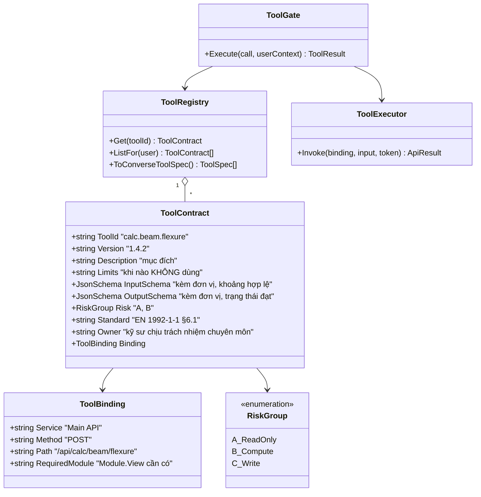
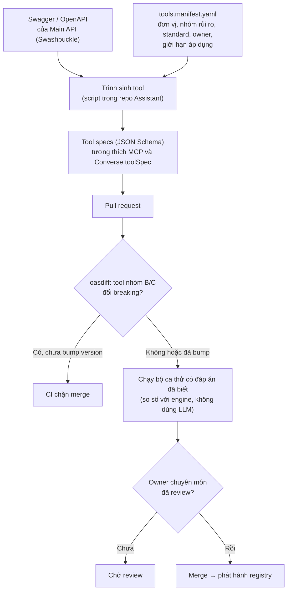
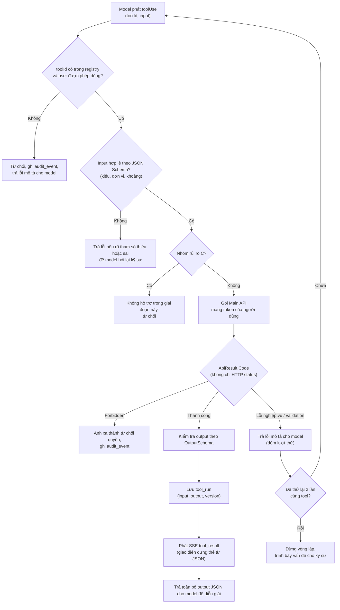
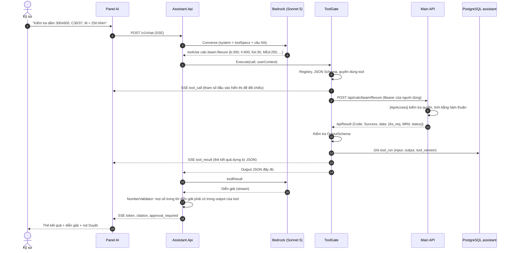
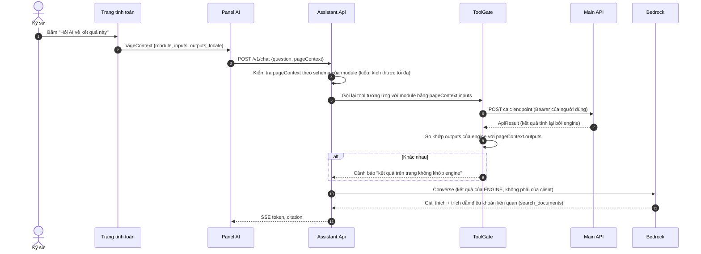
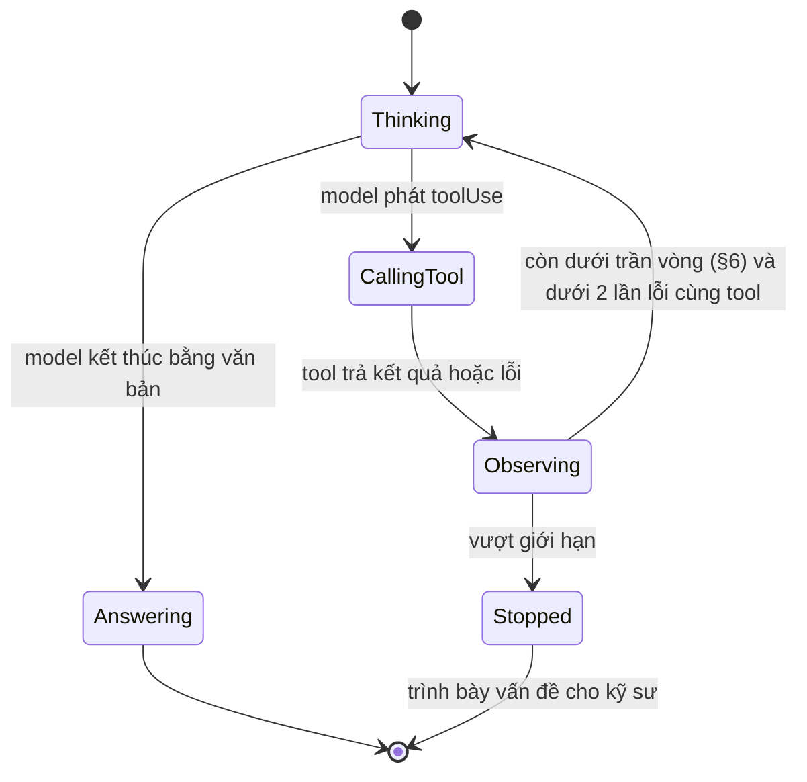
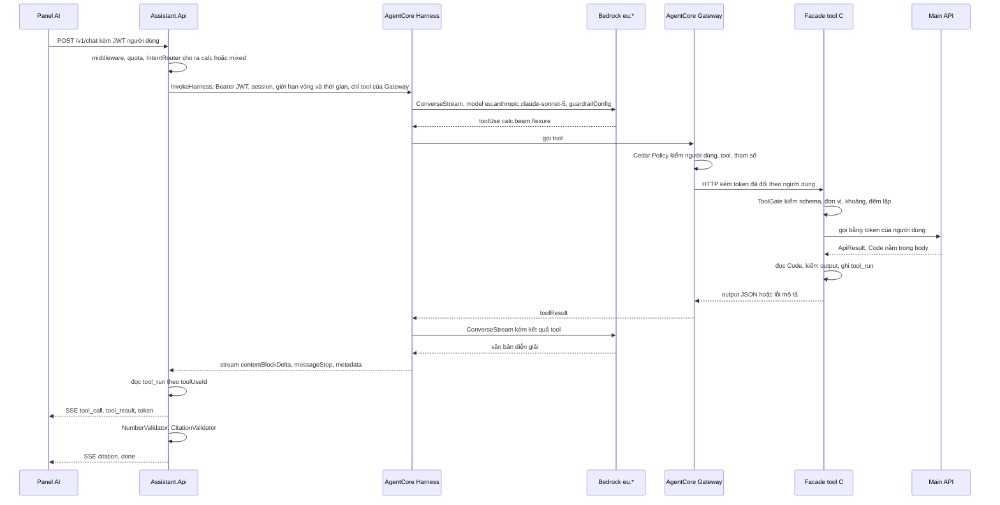
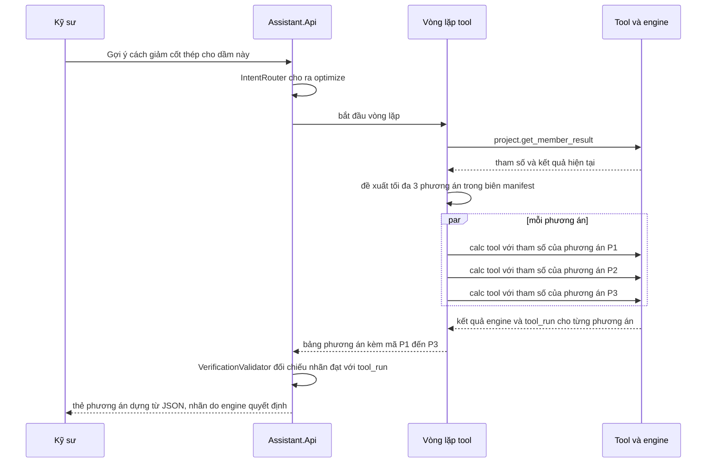
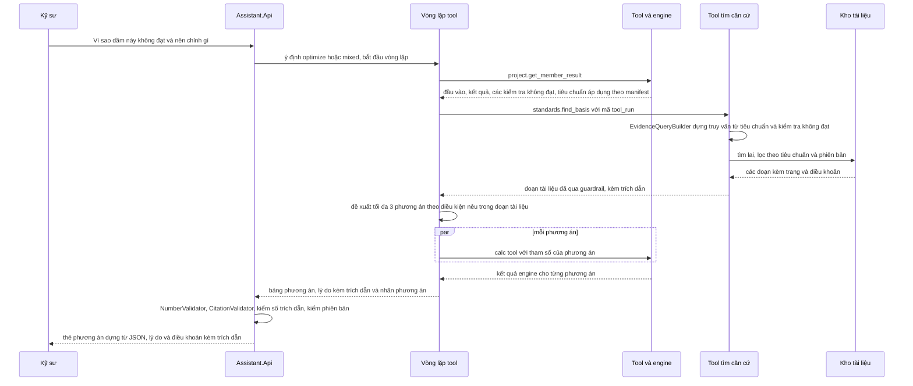

# 04 · Tool calling (F2)

Tool calling là ranh giới giữa trợ lý hỏi đáp và hệ thống dùng được trong công việc kỹ thuật. Đồng thời đây là **cơ chế kiểm soát an toàn quan trọng nhất**: AI chỉ hành động qua tập tool đã đăng ký, mỗi tool là một điểm kiểm soát.

Lợi thế của VFSoftware: repository tính toán là **hàm thuần** và đã có Swagger, nên tool chỉ là lớp bọc mỏng quanh endpoint hiện có. Công thức chỉ nằm ở một nơi (.NET); LLM không bao giờ tự tính.

---

## 1. Hợp đồng tool

Mỗi tool có bảy thành phần bắt buộc (kế thừa từ tài liệu kiến trúc gốc §6.3). Hai thành phần cuối là chỗ phân biệt danh mục được quản trị với một tập hàm tiện ích.

**Sơ đồ 4.1 — Mô hình lớp của tool contract**

### Nhóm rủi ro

| Nhóm | Đặc điểm | Ví dụ | Chế độ kiểm soát | Trong 8 tuần |
| --- | --- | --- | --- | --- |
| **A — chỉ đọc** | Không đổi dữ liệu | Tra thông số cấu kiện, tìm tài liệu, tìm tình huống | Agent gọi tự do trong phạm vi quyền của người dùng | Có |
| **B — tính toán** | Không đổi dữ liệu, kết quả có thể vào hồ sơ | Khả năng chịu uốn, độ võng | Gọi tự do; kết quả **luôn hiển thị kèm tham số đầu vào** để đối chiếu | Có |
| **C — ghi** | Đổi trạng thái hệ thống nghiệp vụ | Cập nhật thông số cấu kiện trong dự án | Bắt buộc xác nhận nêu rõ nội dung thao tác | **Không** |

Ghi vào bảng của **chính assistant** (case record) không phải nhóm C: đó là kho phụ trợ, không phải hồ sơ nghiệp vụ. Vẫn cần duyệt của người dùng vì lý do P1 (xem [05](05-case-memory.md)).

---

## 2. Sinh tool registry từ OpenAPI

Schema sinh từ OpenAPI của Main API rồi **chỉnh tay** ở những chỗ OpenAPI không tự sinh ra được: đơn vị, nhóm rủi ro, căn cứ tiêu chuẩn, chủ sở hữu chuyên môn, mô tả giới hạn áp dụng. Phần chỉnh tay nằm trong tệp manifest `tools.manifest.yaml`, **được review như code**.

**Sơ đồ 4.2 — Pipeline sinh và kiểm soát thay đổi tool**

**Vì sao không tự viết MCP server ở giai đoạn này:** registry trong tiến trình cho cùng kết quả với ít phần chuyển động hơn. Vì spec tương thích MCP, có thể mở một MCP server hoặc AgentCore Gateway sau này mà không viết lại tool.

### Chọn 5 tool đầu tiên

Không phải mọi endpoint đều đáng làm tool. Chọn bằng RICE (Reach × Impact × Confidence ÷ Effort) do kỹ sư phụ trách và Product chấm ở tuần 1. Tiêu chí loại trừ: tool có tham số quá nhiều hoặc quá phụ thuộc trạng thái giao diện (canvas 2D/3D) không nên là tool ở lượt đầu.

---

## 3. Cổng kiểm soát tool (ToolGate)

Mỗi mũi tên là một điểm kiểm soát. Không có đường tắt.

**Sơ đồ 4.3 — Luồng kiểm soát của một lệnh gọi tool**

**Các điểm cần lưu ý:**

| Điểm | Quy tắc | Lý do |
| --- | --- | --- |
| **Lỗi trả về dạng mô tả** | "Tham số `b` (mm) thiếu; khoảng hợp lệ 100–2000" | Để model hỏi lại; khác biệt giữa hệ thống dùng được và hệ thống hay trả "không thực hiện được" |
| **Giới hạn thử lại** | Tối đa 2 lần cho cùng tool trong một lượt; tối đa 5 vòng tool mỗi lượt, riêng lượt `optimize` 7 vòng (§6) | Ngăn vòng lặp không hội tụ (rủi ro chi phí lẫn trải nghiệm) |
| **`ApiResult.Code`** | Đọc mã trong body, không tin HTTP 200 | Main API trả `Forbidden` nhưng vẫn HTTP 200; bỏ sót sẽ coi thiếu quyền là thành công |
| **Chuyển tiếp token** | Tool gọi bằng token của người dùng, không dùng service account | `[ApiAccess("Module.View")]` hiện có tự áp dụng; AI không có quyền nào vượt quyền người dùng |
| **Không giao thừa tool** | Mỗi request chỉ đưa cho model các tool user được phép dùng | Mô hình được giao nhiều tool hơn mức cần tăng xác suất hành vi ngoài ý muốn |

---

## 4. Sequence: một lượt gọi tool nhóm B

Ví dụ `calc.beam.flexure`. Số liệu do engine tính; LLM chỉ chọn tool, lập tham số, diễn giải.

**Sơ đồ 4.4 — Sequence: tool nhóm B end-to-end**

**`NumberValidator`:** kiểm tra tất định (không dùng LLM giám khảo) rằng mọi giá trị số trong lời diễn giải xuất hiện trong output của tool (cho phép làm tròn). Khớp thất bại thì phát `warning: unverified_number`. Đây là bản thực thi của nguyên tắc P2.

---

## 5. Sequence: "Hỏi AI về kết quả này" (explain_result)

Đường đi này đem lại giá trị trải nghiệm lớn nhất và rủi ro cao nhất: dữ liệu từ trang do client gửi lên, **không tin cậy**.

**Sơ đồ 4.5 — Sequence: giải thích kết quả từ trang tính toán**

**Nguyên tắc:** căn cứ của giải thích luôn là kết quả **do engine tính lại**, không phải giá trị client gửi. Nếu hai bên lệch nhau, đó là thông tin có giá trị và được nêu cho kỹ sư.

---

## 6. Vòng lặp agent và giới hạn

> **Đường chính của POC là AgentCore Harness (§8, AD-13).** Mục này mô tả **đường thoát**: vòng lặp C# gọi thẳng `ConverseStream`, dùng khi V-A1 hoặc V-A6 trượt ở tuần 1. Các trần vòng, quy tắc dừng và phân loại lỗi ở đây áp dụng cho cả hai đường; khi chạy dưới Harness chúng được đặt bằng `maxIterations`, `timeoutSeconds` và bộ đếm ở facade (§8).

**Sơ đồ 4.6 — Máy trạng thái vòng lặp tool**

| Giới hạn | Giá trị |
| --- | --- |
| Số vòng tool tối đa mỗi lượt | 5 |
| Lượt `optimize` | Tối đa 7 vòng và 90 giây (`project.get_member_result`, `standards.find_basis`, các calc tool song song, `submit_recommendation`, câu trả lời); trần 5 vòng thường không đủ cho lượt này |
| Thử lại cùng một tool | 2 |
| `maxTokens` mỗi lần gọi | Đặt tường minh (không để mặc định của mô hình) |
| Thời gian tối đa mỗi lượt | Cấu hình (mặc định 60 giây), quá thì dừng và báo |
| Gọi lặp cùng tool với cùng tham số | Lần thứ hai trong một lượt là dừng (không đợi hết 5 vòng) và trình bày cho kỹ sư; đếm `tool_repeat_rate` ([09](09-eval-quan-sat.md) §9) |

Mô hình lặp lại cùng một lời gọi là dấu hiệu vòng lặp không hội tụ (theo phần theo dõi tác tử của AI Agents in Action, "lặp lại suy nghĩ" là mùi thiết kế). Cách sửa là mô tả tool và tham số, không phải nâng giới hạn vòng.

### Đối chiếu với mô hình năm thành phần của tác tử

Dùng làm danh mục kiểm tra phạm vi, không phải mục tiêu phải đạt đủ năm:

| Thành phần | Trong thiết kế | Mức đầu tư |
| --- | --- | --- |
| Hồ sơ (persona) | System prompt nêu vai trò, giọng điệu ([08](08-ux.md) §12) | Đủ |
| Hành động | ToolRegistry chỉ-đọc/tính toán, ToolGate | Đủ |
| Tri thức và bộ nhớ | RAG, case memory ([03](03-rag.md), [05](05-case-memory.md)) | Đủ |
| Suy luận và đánh giá | Tắt adaptive thinking ở đường RAG; `NumberValidator`, `CitationValidator` là đánh giá tất định; **không** tự phản biện nhiều lượt | Tối thiểu có chủ ý: phản biện đổi độ trễ và chi phí lấy độ chính xác, chỉ thêm nếu eval chỉ ra lỗi suy luận |
| Lập kế hoạch và phản hồi | Không có planner riêng; phụ thuộc tuần tự giải bằng các vòng tool (tối đa 5); phản hồi ngoài luồng (Tốt/Xấu, Duyệt) | Tối thiểu có chủ ý |

Sách xếp bot hỗ trợ khách (môi trường kiểm soát, ít tool) vào nhóm cần ít lập kế hoạch và suy luận nhất; assistant này gần nhóm đó hơn nhóm tác tử tự chủ.

---

## 7. Nguyên tắc thiết kế tool

Rút từ sách AI Agents on AWS và AI Agents in Action, áp cho registry của dự án:

| Nguyên tắc | Áp dụng |
| --- | --- |
| **Một tool, một việc** | Không có tool "đa chế độ" (`calc.beam` với cờ `mode`); mỗi phép kiểm tra là một tool riêng. Model chọn đúng tool dễ hơn và test dễ hơn |
| **Mô tả là giao diện của tool** | Tên, tham số có kiểu và đơn vị, mô tả mục đích và **giới hạn áp dụng** đều là thứ model đọc để quyết định gọi; viết như tài liệu API |
| **Trả dữ liệu có cấu trúc đầy đủ, không lọc trước** | Trả toàn bộ output JSON của engine cho model (trong ngân sách token), không tự rút gọn thành câu văn. Model cần đủ dữ liệu để diễn giải, và `NumberValidator` cần đủ số để đối chiếu |
| **Chỉ giao tool cần dùng** | Mỗi request chỉ đưa các tool user được phép dùng và liên quan tới ý định; quá nhiều tool làm đầy prompt và tăng hành vi ngoài ý muốn. Ngưỡng xem lại kiến trúc: khoảng 20 tool |
| **Tool độc lập gọi song song** | Một vòng có thể có nhiều `toolUse` độc lập (ví dụ kiểm tra hai tiết diện); chạy đồng thời bằng `Task.WhenAll` với giới hạn song song. Tool phụ thuộc nhau chạy tuần tự qua các vòng |
| **Dùng chung tài nguyên đắt** | Tool client dùng `IHttpClientFactory` và pool kết nối có sẵn, không mở kết nối riêng mỗi lần gọi |
| **Lời diễn giải không thay cho bước tính** | Thẻ kết quả luôn hiện các giá trị trung gian của engine bên cạnh lời diễn giải; lời diễn giải chỉ dựa trên output tool, không tự suy "vì sao" ngoài output | Giải thích hậu nghiệm chỉ là xấp xỉ (Interpretable AI cảnh báo "double black box"): LLM giải thích một engine tất định vẫn có thể bịa nguyên nhân nghe hợp lý. Golden set có nhóm câu hỏi về kết quả bất ngờ để kiểm ([09](09-eval-quan-sat.md) §9) |
| **Ba độ sâu giải thích từ một output** | Tóm tắt, từng bước, đối chiếu điều khoản; giao diện chọn độ sâu, không gọi lại tool | Người đọc khác nhau cần độ sâu khác nhau (kỹ sư tự dùng, người soát, kiểm toán); một phép tính, ba cách trình bày |
| **Phần mềm cổ điển cầm lái khi quy trình đếm được** | Với `explain_result`, tool cần gọi được biết từ `pageContext.module`; mã C# gọi tool, AI chỉ diễn giải. AI chỉ tự chọn tool ở câu hỏi mở (`calc`, `mixed`) |

### Guardrail không đánh giá kết quả tool

Theo tài liệu AWS, khi dùng tool trong Converse, `guardrailConfig` **không đánh giá** `toolResult`, `toolSpec` và `toolUse.input`. Hai hệ quả cho thiết kế:

1. `search_documents` và `find_similar_cases` trả nội dung có thể chứa chỉ dẫn độc hại (chunk từ tài liệu bên thứ ba). Trong vòng lặp tool, nội dung đó phải qua `ApplyGuardrail` (đầu vào) **trước khi** đưa vào `toolResult`; nếu bị chặn thì trả lỗi mô tả thay vì nội dung.
2. Tham số do model sinh ra (`toolUse.input`) không được guardrail kiểm; ToolGate (schema, quyền, đơn vị) là lớp duy nhất, nên không được nới lỏng.

Kết quả của tool tính toán (nhóm B) là dữ liệu sinh ra từ engine của công ty, không chứa văn bản tự do từ bên thứ ba; rủi ro thấp hơn, nhưng vẫn không tin nội dung chuỗi tự do trong output (nếu có).

### Phân loại thất bại của agent và điều khiển tương ứng

Theo sách Hands-On RAG (ch7) và AI Agents on AWS, các thất bại đặc thù của vòng lặp agent, ánh xạ vào thiết kế:

| Thất bại | Ví dụ | Điều khiển trong thiết kế |
| --- | --- | --- |
| Tool hallucination | Model tin đầu ra sai của tool | Tool tất định từ engine; `OutputSchema`; kiểm tra khoảng hợp lý theo manifest |
| Response hallucination | Tool đúng nhưng lời diễn giải sai số | `NumberValidator` |
| Hiểu sai mục tiêu | Chọn tool cho bài toán khác | Mô tả tool nêu **giới hạn áp dụng**; hiện tham số đầu vào để kỹ sư đối chiếu |
| Lập kế hoạch sai | Gọi tool theo sai thứ tự | Câu hỏi `mixed` hiện dòng kế hoạch ([08](08-ux.md) §10); giới hạn 5 vòng |
| Dùng tool sai | Tool sai hoặc tham số sai | Schema, ToolGate, ranh giới chỉ-đọc/tính toán (không có tool ghi) |
| Không dừng đúng lúc | Lặp vô hạn | Giới hạn vòng, giới hạn thử lại, thời gian tối đa mỗi lượt |
| Prompt injection | Chỉ dẫn trong chunk | [07](07-auth-bao-mat.md) §4 |

Ranh giới quyền (chỉ đọc/tính toán) là điều khiển mạnh hơn viết prompt tốt hơn: tool chỉ đọc không thể xóa gì dù model suy luận tệ đến đâu.

**Client dùng lại:** `AmazonBedrockRuntimeClient`, `HttpClient` tới Main API và kết nối PostgreSQL (`NpgsqlDataSource`) là **singleton** dùng chung cho mọi lượt; khởi tạo mỗi lượt gây tốn thời gian và làm cạn kết nối.

Thêm hai nguyên tắc từ sách AI Agents in Action và AI-Enhanced Web Apps: tool **không** trả dữ liệu đã lọc trước (đã nêu ở trên), và **không** dùng MCP server bên thứ ba chưa rà soát: hệ sinh thái MCP còn non (chưa có cơ chế tin cậy trưởng thành), phải xử lý như một phụ thuộc bên thứ ba khác. Mô hình không bao giờ gọi API ngoài trực tiếp; mọi truy cập đi qua ToolGate.

---

## 8. Vòng lặp do AgentCore Harness quản lý (AD-13)

**Trạng thái: đường chính của POC (AD-13).** Bốn kiểm chứng quyết định V-A1, V-A3, V-A4, V-A6 chạy trong tuần 1: V-A1 và V-A6 có hạn chót hết ngày 3 (23/09), V-A4 được kiểm ở cổng G0 (25/09). Trượt bất kỳ mốc nào thì rơi về §6. Mọi thông số AgentCore ở đây lấy từ tài liệu AWS ngày 19/09/2026 (danh sách nguồn ở [13](13-doi-chieu-skill.md)); các điểm chưa kiểm được nằm ở [06](06-tang-bedrock.md) §1a.

### Vì sao ToolGate phải chuyển ra facade

Bảng so sánh Harness và Runtime của AWS ghi **Hooks: không hỗ trợ** với Harness. ToolGate ở §3 thực chất là một chuỗi hook (kiểm schema, quyền, đơn vị, đếm thử lại, đọc `ApiResult.Code`), nên không đặt được vào vòng lặp của Harness. Cách giữ các bảo đảm: tool chạy sau **AgentCore Gateway**, và Gateway gọi một **facade C#** (endpoint nội bộ `/internal/tools/*`). Facade chạy phần còn lại của ToolGate.

**Sơ đồ 4.7 — Sequence: một lượt tool khi vòng lặp do Harness quản lý**

### ToolGate: từng bảo đảm nằm ở đâu

| Bảo đảm (mục §3) | Nơi thực hiện khi dùng Harness | Trạng thái |
| --- | --- | --- |
| Schema đầu vào | Schema OpenAPI của target Gateway, kiểm lại ở facade | Facade là tuyến phòng thủ chính |
| Quyền theo người dùng | `[ApiAccess]` của Main API (nhận token đã đổi), cộng Cedar cho phép tool theo danh tính | Cần V-A6 |
| Biên tham số (ví dụ `b` từ 100 đến 2000 mm) | Manifest kiểm ở facade; Cedar nếu điều kiện số học được hỗ trợ | Cedar: chưa xác minh (V-A9) |
| `ApiResult.Code = Forbidden` trong HTTP 200 | Facade ánh xạ thành lỗi HTTP 4xx kèm mô tả | Cedar và Gateway không thấy body phản hồi, nên **bắt buộc** ở facade (R9) |
| Đơn vị, khoảng hợp lý, giới hạn áp dụng | Facade theo manifest | Không đổi |
| `ApplyGuardrail` trên chunk trước khi vào `toolResult` | Facade, ngay trước khi trả kết quả của `search_documents` và `find_similar_cases` | Dưới Harness đây là **lớp bảo vệ còn lại** nếu claim guardrail không đánh giá `toolResult` đúng (V-A8) |
| Thử lại tối đa 2 lần cùng tool; không lặp cùng tool cùng tham số | Facade đếm theo `(toolUseId, tên tool, hash tham số)` và trả lỗi cụ thể để model dừng | Không có hook nên phải đếm ở phía tool |
| Tối đa 5 vòng và 60 giây cho lượt thường, 7 vòng và 90 giây cho lượt `optimize` (§6); `maxTokens` | `maxIterations`, `timeoutSeconds`, `maxTokens` trong cấu hình hoặc từng lần gọi | Mặc định của Harness là 75 vòng và 3 600 giây, **phải đặt tường minh**; ý nghĩa một "vòng" của Harness chưa khớp 1:1 với vòng tool của §6 (V-A4) |
| `NumberValidator`, `CitationValidator` | `Assistant.Api` sau khi stream kết thúc | Không đổi |
| Audit và `tool_run` | Facade | Không đổi |

### Cấu hình bắt buộc của Harness

| Mục | Giá trị | Lý do |
| --- | --- | --- |
| Model | `bedrockModelConfig.modelId = eu.anthropic.claude-sonnet-5`, `apiFormat = converse_stream` | Mặc định của Harness là `global.anthropic.claude-sonnet-4-6`, route toàn cầu, **vi phạm residency (Q1)**; `converse_stream` bắt buộc để dùng Guardrails |
| Guardrail | `additionalParams.guardrailConfig` (`guardrailIdentifier`, `guardrailVersion`, `trace = disabled`); execution role có `bedrock:ApplyGuardrail` trên guardrail đó | Cùng cấu hình với đường cố định ([06](06-tang-bedrock.md) §4) |
| Công cụ | Chỉ tool của Gateway `vf-tools`; `allowedTools` loại `shell` và `file_operations` | Hai công cụ này bật sẵn trong mọi phiên và mỗi request tốn khoảng 900 token đầu vào |
| Memory | Tắt (`disabled`) | Managed Memory bật mặc định khi tạo qua API; kho hội thoại đã ở PostgreSQL (nhân đôi kho là rủi ro Q3) |
| Danh tính | `CUSTOM_JWT` với `discoveryUrl` của Keycloak; đặt **cả** `allowedClients` **và** `allowedAudience` | SigV4 không mang danh tính người dùng xuống Gateway. Xác thực gọi vào là **loại trừ**: một harness chỉ nhận SigV4 hoặc JWT, không có chế độ lẫn. Thiếu cả `allowedClients` lẫn `allowedAudience` thì authorizer **nhận mọi token hợp lệ của issuer** |
| Phiên | `runtimeSessionId` dài ít nhất 33 ký tự, dựng từ `orgId` và `conversationId`; một phiên cho một hội thoại | Tài liệu yêu cầu độ dài từ 33 đến 100 ký tự |
| Vòng đời microVM | `idleRuntimeSessionTimeout` mặc định 900 giây | Giữ phiên ấm để tránh cold start. **Runtime v2 tự thu hồi bộ nhớ rảnh sau 120 giây** và chỉ tính theo mức tiêu thụ thật, nên kéo dài `idleRuntimeSessionTimeout` không làm đội chi phí bộ nhớ tương ứng (trang giá AgentCore, tra 19/09/2026) |
| Mạng | Chế độ VPC nếu cần tới Keycloak hoặc facade riêng | **Bắt buộc có NAT gateway ra internet.** Harness kéo container từ **ECR Public** (`public.ecr.aws`) mỗi lần mở phiên, và ECR Public **không có VPC endpoint**; thiếu NAT thì phiên hỏng vì image-pull timeout (V-A10). Endpoint riêng vẫn dùng cho `bedrock-runtime` và `s3`, nhưng **không thay được NAT**. Khi thêm route ra internet, không nới rộng chiều vào |
| Quyền | Chỉ `Assistant.Api` có `bedrock-agentcore:InvokeHarness` và `InvokeAgentRuntime`; **không ai** có `InvokeAgentRuntimeCommand` | API này chạy lệnh trực tiếp, bỏ qua LLM và `allowedTools` |
| Cấu hình như mã | Định nghĩa Harness trong repo; test tự động đọc lại cấu hình sau mỗi lần triển khai và kiểm các giá trị trên | Các mặc định sai là rủi ro R30 |

### Danh tính và token

Trong Sơ đồ 4.7, Gateway dùng **token exchange (RFC 8693)** để đổi token người dùng thành token cho facade; đây chính là bản nâng cấp của R25 (chuyển tiếp token thô). Điều kiện: Keycloak bật token exchange và audience khớp (V-A6). Tài liệu ghi Gateway target OpenAPI hỗ trợ token exchange nhưng **không** hỗ trợ token passthrough; token passthrough chỉ có ở target kiểu AgentCore Runtime (HTTP), là phương án dự phòng nếu facade chạy như một Runtime; passthrough đòi Gateway dùng inbound `AUTHENTICATE_ONLY`, và target OpenAPI cũng không hỗ trợ "caller IAM credentials" (bảng outbound authorization của Gateway).

Lệnh gọi `InvokeHarness` phải mang **Bearer JWT** để danh tính người dùng đi xuống Gateway. AWS SDK for .NET ký SigV4, nên khả năng cao cần `HttpClient` thô kèm bộ đọc event stream tự viết (V-A1). Nếu chỉ dùng được SigV4, danh tính người dùng mất ở Gateway và hướng này không đạt yêu cầu phân quyền.

### Lỗi trong vòng lặp

Lỗi Bedrock giữa chừng do Harness xử lý; `Assistant.Api` chỉ thấy lỗi của `InvokeHarness` (bảng ở [02](02-assistant-service.md)). Chế độ `Degraded` (trả danh sách nguồn) vẫn áp dụng khi `InvokeHarness` lỗi hoặc quá thời gian.

---

## 9. Tra kết quả của đúng dự án và cấu kiện đang xét

Yêu cầu 3 của tài liệu cuộc họp. Trước đây `explain_result` dựa vào `pageContext` do client gửi (không tin cậy); giờ dựa vào **kết quả đã lưu ở server**.

| Thành phần | Thiết kế |
| --- | --- |
| Định danh | `pageContext` mang `projectId` và `memberId` ([02](02-assistant-service.md) §1). Khi câu hỏi nhắc cấu kiện khác ("dầm B2 thì sao"), model dùng `project.list_members` để đổi tên thành mã |
| Tool nhóm A | `project.list_members(projectId)` và `project.get_member_result(projectId, memberId, resultKind)`; gọi Main API bằng token của người dùng nên `[ApiAccess]` áp dụng: người không có quyền với dự án không đọc được |
| Kết quả trả về | Đầu vào, kết quả, `calcVersion` và thời điểm tính; là dữ liệu của engine, không phải văn bản |
| Đối chiếu `pageContext` | Nếu `outputs` do client gửi lệch với kết quả đã lưu, ưu tiên bản đã lưu và phát cảnh báo (giảm R20) |
| Điều kiện | Main API phải có endpoint đọc kết quả theo dự án và cấu kiện. Tài liệu VFSoftware đã đọc chưa xác nhận điều này; nếu chưa có, đây là công việc của Main API ở tuần 1 (R35) |

Hai tool này được đưa vào danh sách RICE ở §2 với ưu tiên bắt buộc, vì yêu cầu 3 không thực hiện được nếu thiếu chúng.

## 10. Gợi ý phương án có kiểm chứng

Yêu cầu 4: "gợi ý tối ưu phương án, ví dụ điều chỉnh tiết diện hoặc cốt thép; kiểm chứng bằng bộ tính trước khi kết luận đạt". Mức giám sát: **Supervision** ([00](00-tong-quan.md) §6.2). Assistant không ghi vào hồ sơ (nhóm C bị cắt), nên kỹ sư tự áp dụng phương án được chọn.

**Sơ đồ 4.8 — Sequence: đề xuất rồi kiểm chứng phương án**

| Quy tắc | Nội dung | Thực thi |
| --- | --- | --- |
| Chỉ engine kết luận "đạt" | Trạng thái đạt, không đạt hoặc chưa kiểm chứng của mỗi phương án lấy từ kết quả engine, hiển thị trên thẻ dựng từ JSON; lời văn của model không quyết định nhãn | UI dựng thẻ từ `tool_result` ([02](02-assistant-service.md) §6) |
| Không nhãn "đạt" khi chưa có `tool_run` | `VerificationValidator` (chạy sau khi stream xong, cùng chỗ với `NumberValidator`) tìm các cụm như "đạt", "thỏa mãn" gắn với mã phương án `[P1]` mà không có `tool_run` khớp tham số, rồi đánh dấu `unverified` | Kiểm bằng mã phương án nên chính xác hơn tìm từ khóa trơn; vẫn có thể sót cách diễn đạt lạ, nên eval có nhóm riêng (nhóm J, [09](09-eval-quan-sat.md) §9) |
| **Kết luận nộp qua công cụ có cấu trúc** | Kết quả cuối của lượt `optimize` phải nộp bằng tool `submit_recommendation` với các trường có kiểu: `candidateId`, `toolRunId`, `rationale`, `citationIds`; giao diện dựng thẻ từ các trường này, văn bản tự do chỉ nằm trong `rationale`. Sonnet 5 không có structured outputs, nên dùng tool cuối này để có cấu trúc | Phương án đạt mà thiếu `toolRunId` khớp bị từ chối ở tầng schema, không phụ thuộc bộ lọc cụm từ. `VerificationValidator` bằng cụm từ chỉ còn là lưới thứ hai (R34) |
| **Nhãn nói đúng điều engine đã làm** | Thẻ ghi "Đạt các kiểm tra của engine" và liệt kê điều engine **không** kiểm (cấu tạo, thi công, phụ lục quốc gia, mọi trạng thái giới hạn chưa lập trình), thay vì chữ "Đạt" trần | Kỹ sư dễ đọc "Đạt" là kết luận kỹ thuật toàn diện (R34) |
| **Chủ sở hữu manifest có chữ ký** | Biên tham số được đổi và tham số cố định trong manifest do một kỹ sư kết cấu có thẩm quyền **ký tên**, không mặc định là kỹ sư E bán thời gian đang soạn golden set; chưa có người ký thì yêu cầu 4 không vào POC | Biên manifest là phán đoán kỹ thuật, không phải phần mềm (R38) |
| Tối đa 3 phương án mỗi lượt | Mỗi phương án là một lời gọi tool; các lời gọi độc lập chạy song song trong cùng một vòng | Giữ trong trần của lượt `optimize`: 7 vòng và 90 giây (§6), hoặc `maxIterations` tương ứng (§8) và chi phí mỗi lượt |
| Biên thay đổi | Manifest khai báo tham số được phép đổi (kích thước tiết diện, đường kính và số thanh cốt thép) và tham số cố định (cường độ vật liệu, tiêu chuẩn đã chọn, tải trọng); đề xuất ngoài biên bị ToolGate chặn | ToolGate |
| Module chưa có tool | Trả lời "chưa hỗ trợ kiểm chứng cho module này", không đề xuất không kiểm chứng được | Router và manifest |
| Ghi rõ là đề xuất | Thẻ và lời văn ghi phương án là đề xuất; kỹ sư chịu trách nhiệm quyết định ([00](00-tong-quan.md) §6.3) | Prompt và giao diện |

Rủi ro chính: kỹ sư tin phương án vì nó "đã qua engine" trong khi engine chỉ kiểm các điều kiện đã lập trình, không thay đánh giá tổng thể của kỹ sư (R34).

---

## 11. Kết hợp kết quả tính toán với tài liệu để gợi ý

Gợi ý tốt cần **hai loại chứng cứ khác bản chất**, và không được lẫn vào nhau:

| Loại chứng cứ | Trả lời câu hỏi | Nguồn | Nhãn trong câu trả lời |
| --- | --- | --- | --- |
| Chứng cứ tính toán | "Số này bằng bao nhiêu, đạt hay không?" | Engine, qua `tool_run` | `[P1]`, `[P2]` (mã phương án, gắn với `tool_run`) |
| Chứng cứ tài liệu | "Tiêu chuẩn nói gì, điều kiện áp dụng là gì?" | Đoạn tài liệu đã truy xuất | `[1]`, `[2]` (trích dẫn tới trang và điều khoản) |
| Kinh nghiệm nội bộ (tùy chọn) | "Trước đây đã làm thế nào?" | Case memory ([05](05-case-memory.md) §4) | Nhãn "Kinh nghiệm nội bộ, không phải tiêu chuẩn" |

**Tìm kiếm ở đâu, bằng gì.** Kho chunk nằm ở Bedrock Managed Knowledge Base ([00](00-tong-quan.md) AD-17); kiến trúc **không dùng Elasticsearch hay OpenSearch**:

| Dữ liệu | Cách tìm | Công cụ |
| --- | --- | --- |
| Đoạn tài liệu (tiêu chuẩn, hướng dẫn VF) | `Retrieve` của MKB, có `filter` trên `scope_key` và `status`; mã điều khoản gõ gần đúng phân giải bằng trigram trước ([03](03-rag.md) §2a) | Bedrock MKB; PostgreSQL `pg_trgm` cho chặng 1 |
| Kết quả tính toán của dự án | **Không tìm kiếm văn bản.** Đọc theo mã `projectId` và `memberId` (§9) | Main API và engine, qua tool `project.get_member_result` |
| Tình huống tương tự | Lọc cứng, chấm theo khoảng cách tham số, tie-break bằng vector ([05](05-case-memory.md) §4) | PostgreSQL |
| Log và trace | Theo dõi vận hành | CloudWatch qua OpenTelemetry ([09](09-eval-quan-sat.md) §4) |

**Cách kết hợp.** Khó nhất là làm cho phần tìm tài liệu bám sát **kết quả tính toán**, thay vì bám câu hỏi mơ hồ của người dùng. Giải pháp: truy vấn được **dựng bằng mã** từ kết quả của engine, không để model tự viết.

**Sơ đồ 4.9 — Sequence: kết hợp kết quả tính toán và tài liệu để đưa ra gợi ý**

**Các bước và quy tắc:**

| Bước | Nội dung | Vì sao |
| --- | --- | --- |
| 1. Lấy kết quả | `project.get_member_result` trả đầu vào, kết quả, kiểm tra nào không đạt và `standardRef` (khai báo trong manifest: tiêu chuẩn, phiên bản, điều khoản) | Đây là điểm neo của cả lượt |
| 2. Dựng truy vấn bằng mã | Tool `standards.find_basis(toolRunId)` (nhóm A, chạy trong facade C# theo AD-13) chạy `EvidenceQueryBuilder`: từ `standardRef` và tên kiểm tra không đạt tạo 1 đến 3 truy vấn, lọc theo tiêu chuẩn và phiên bản, ưu tiên khớp chính xác số điều khoản bằng nhánh từ khóa | Truy vấn do model tự viết dễ lạc; truy vấn dựng từ dữ liệu có cấu trúc lặp lại được và đo được. Nếu chưa kịp làm tool này, dùng `search_documents` và đo chênh lệch bằng ablation ([09](09-eval-quan-sat.md) §9) |
| 3. Tách ba khối trong prompt | `<engine_results>`, `<standard_excerpts>`, `<internal_cases>` tách riêng, cùng cơ chế dấu phân cách chống prompt injection ([07](07-auth-bao-mat.md) §4) | Model biết số nào là tính ra, đoạn nào là văn bản tiêu chuẩn |
| 4. Đề xuất | Tối đa 3 phương án, trong biên manifest, theo điều kiện nêu trong đoạn tài liệu (ví dụ điều kiện tối thiểu, khoảng cách tối đa) | Tài liệu chỉ **gợi hướng**; không quyết đạt hay không |
| 5. Kiểm chứng | Mỗi phương án qua calc tool; nhãn đạt do engine quyết định (§10) | Hai loại chứng cứ gặp nhau ở đây |
| 6. Soát sau khi viết | `NumberValidator` cho số tính toán; **kiểm số trích dẫn**: số lấy từ tiêu chuẩn phải có trong đoạn trích của chunk đã truy xuất; `CitationValidator`; **kiểm phiên bản**: tiêu chuẩn của engine (`standardRef`) so với phiên bản của đoạn tài liệu | Ngăn số bịa ở cả hai phía |

**Quy tắc số liệu:** số **tính ra** chỉ đến từ `tool_run`; số **của tiêu chuẩn** chỉ đến từ đoạn trích của chunk đã truy xuất và phải có `[n]`; điều khoản chỉ được nêu nếu có `[n]`. `NumberValidator` ở §3 trước đây coi mọi số phải nằm trong output của tool, nên cần mở rộng cho phép số nằm trong trích dẫn (so khớp trong đoạn trích), nếu không câu trả lời nêu giá trị giới hạn của tiêu chuẩn sẽ bị gắn `unverified` oan.

**Khi engine và tài liệu lệch nhau:** thường do khác phiên bản tiêu chuẩn hoặc phụ lục quốc gia. Engine quyết định số, nhưng câu trả lời **phải nêu phiên bản của cả hai** và cảnh báo lệch; không im lặng chọn một phía (R37).

**Đo:** nhóm J của golden set ([09](09-eval-quan-sat.md) §9) thêm câu hỏi mà điều khoản chi phối đã biết trước, để đo recall của điều khoản chi phối theo hai cách dựng truy vấn (bằng mã và do model tự viết).
