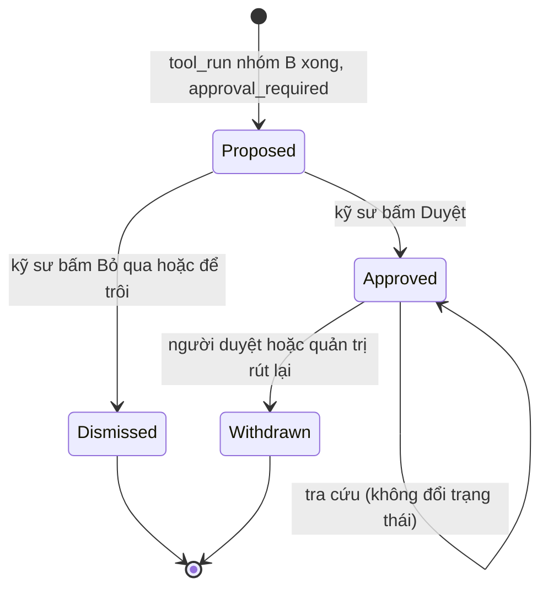
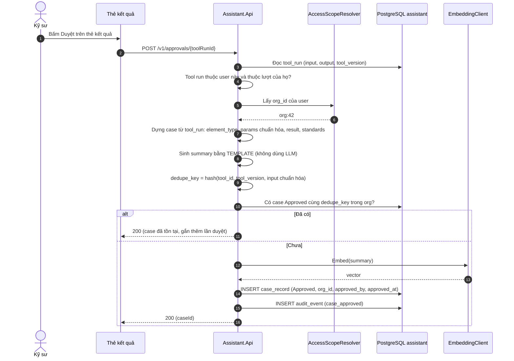
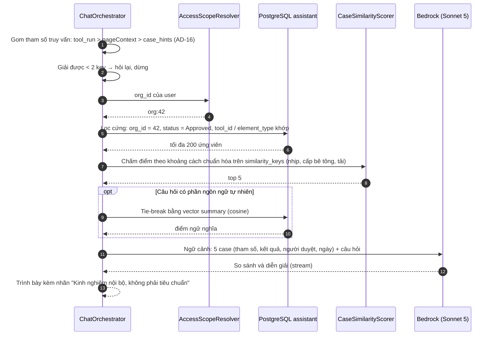
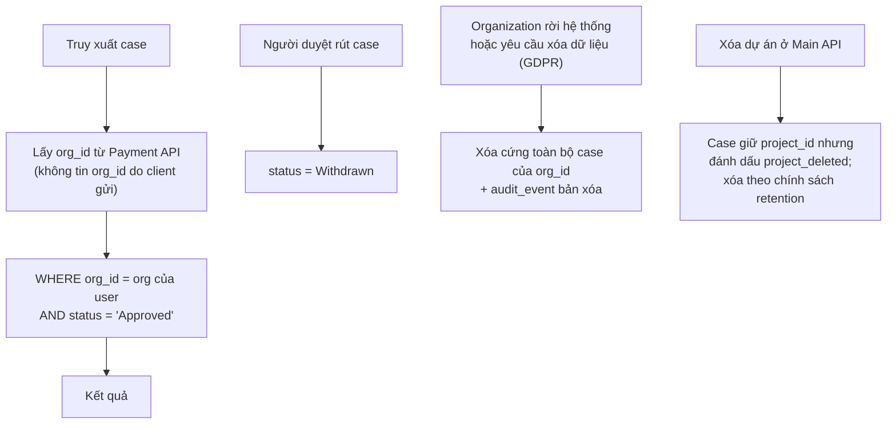
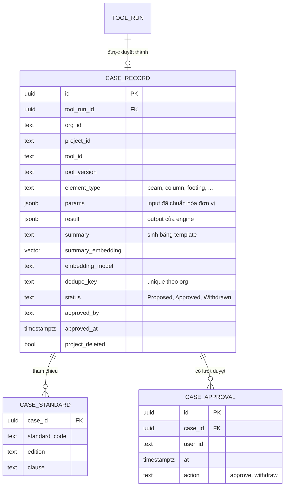
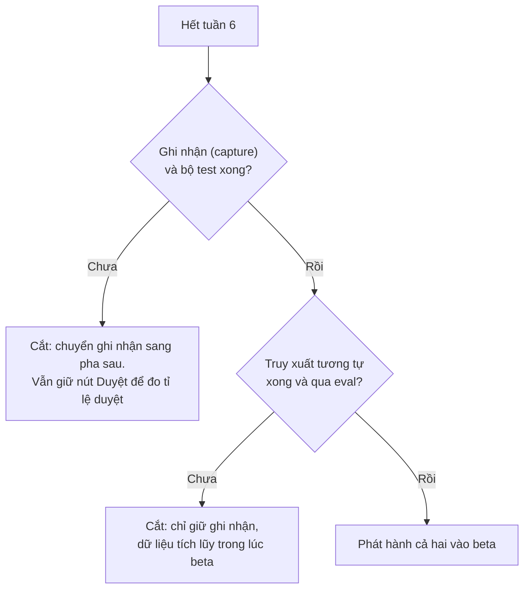

# 05 · Case memory: kho tình huống (F3)

> **Đã cập nhật trong `ship/`.** File này ghi thiết kế case memory theo AD-09, khi case còn sinh từ thao tác kỹ sư bấm Duyệt. Từ AD-28 (22/09/2026), case tự ghi khi engine tính đạt và không còn bước duyệt; bản đã sửa: `ship/12-tra-case.md`.

Tiêu chuẩn cho biết giới hạn được phép, nhưng không cho biết **đơn vị thường chọn phương án nào trong giới hạn đó**. Khoảng cách giữa "được phép" và "nên làm" là kinh nghiệm, và tài liệu không bao giờ ghi lại phần này.

Case memory biến kinh nghiệm cá nhân thành tài sản của organization: mỗi kết quả tính toán được kỹ sư **duyệt** sẽ thành một bản ghi có cấu trúc, tra lại được theo điều kiện tương tự.

---

## 1. Quyết định thiết kế: ghi nhận tự động

Tài liệu kiến trúc gốc coi giả định GĐ-06 ("kỹ sư sẵn sàng ghi nhận quyết định dưới 2 phút") là **giả định rủi ro nhất**: nếu sai, tầng này không có dữ liệu. Thiết kế này loại bỏ giả định đó:

| | Gốc (form ghi nhận thủ công) | Thiết kế này |
| --- | --- | --- |
| Nguồn dữ liệu | Kỹ sư nhập tay | Kết quả `tool_run` đã có schema, sinh ra trong hội thoại |
| Công sức thêm của kỹ sư | Mở form, điền, lưu | **Một cú bấm "Duyệt"** trên thẻ kết quả |
| Nếu kỹ sư không bấm | Mất dữ liệu | Không có case (đúng ý: chỉ ghi nhận cái đã được kiểm) |
| Chất lượng cấu trúc | Phụ thuộc kỷ luật nhập | Tự đảm bảo: tham số là input của tool đã validate |

Ràng buộc từ P1: AI **không tự ghi** case. Chính thao tác duyệt (có danh tính, thời điểm) là cái biến kết quả tính toán thành một tình huống đã được kiểm.

---

## 2. Vòng đời của một case

**Sơ đồ 5.1 — Trạng thái case**

Chỉ case ở trạng thái `Approved` mới xuất hiện trong truy xuất. `Proposed` không được tra cứu.

---

## 3. Ghi nhận (capture)

**Sơ đồ 5.2 — Sequence: ghi nhận case khi kỹ sư duyệt**

**Vì sao summary sinh bằng template, không dùng LLM:** người khác trong organization sẽ đọc lại case. Nếu LLM viết lời tóm tắt, nó có thể đưa vào tên dự án, chi tiết khách hàng hoặc một khẳng định sai. Template chỉ ghép các trường cấu trúc, nên không thể bịa và không lộ thêm gì ngoài tham số.

---

## 4. Truy xuất tình huống tương tự

**Sơ đồ 5.3 — Sequence: tra tình huống tương tự**

**Nguyên tắc trình bày:** case hiển thị **tham số, kết quả, người duyệt, ngày**, kèm nhãn rõ ràng đây là kinh nghiệm của organization chứ không phải căn cứ tiêu chuẩn. Hệ thống **không tự áp dụng** case cũ vào bài toán mới; kỹ sư tự quyết. Case có ngày duyệt cũ hơn phiên bản tiêu chuẩn hiện hành được gắn cảnh báo "có thể theo tiêu chuẩn cũ".

`similarity_keys` là danh sách tham số đo độ tương tự, **khai báo trong `tools.manifest.yaml`** cho từng tool (ví dụ dầm: nhịp, tiết diện, cấp bê tông, tải), kèm đơn vị bắt buộc và dải giá trị hợp lệ. Khoảng cách tính trong C# trên tập ứng viên đã lọc nhỏ, nên không cần chỉ mục đặc biệt.

### 4a. Tham số truy vấn đến từ đâu (AD-16)

Ba nguồn, xét theo thứ tự:

| Thứ tự | Nguồn | Khi nào có |
| --- | --- | --- |
| 1 | `tool_run` của lượt trước trong cùng phiên | Kỹ sư vừa chạy một phép tính |
| 2 | `pageContext` | Đang mở một cấu kiện trong ứng dụng |
| 3 | `case_hints` do IntentRouter bóc ra | Kỹ sư gõ thẳng con số trong câu hỏi |

Nguồn trên ghi đè nguồn dưới cho từng key một, không ghi đè cả khối. Giá trị chỉ có ở `case_hints` được đánh dấu `unconfirmed` và hiện thành chip cho kỹ sư xác nhận hoặc sửa trước khi chạy truy vấn.

### 4b. Khoảng cách khi thiếu key

Manifest khai báo `similarity_keys` đầy đủ cho một tool, nhưng một truy vấn thường chỉ giải được vài key. Quy tắc:

- **Chuẩn hóa từng key** về `[0, 1]` theo dải hợp lệ khai báo trong manifest.
- **Chỉ tính trên tập key giải được ở cả hai phía** (truy vấn và case). Khoảng cách là trung bình trên tập đó.
- **Phạt theo độ phủ:** điểm cuối `= distance / coverage`, với `coverage` là tỉ lệ key giải được trên tổng `similarity_keys`. Case khớp 4 trên 5 key thắng case khớp 2 trên 5 khi khoảng cách ngang nhau.
- **Dưới 2 key giải được thì không tra.** Hệ thống hỏi lại tham số thiếu thay vì trả về 5 case yếu. Vector trên summary **không** thay thế được ở bước này, vì nó không xếp hạng được theo độ lớn.
- Key không có trong manifest bị **loại**, không tính là thiếu — schema router đã chặn từ trước, đây là hàng rào thứ hai.

---

## 5. Cách ly dữ liệu giữa các organization

Hồ sơ dự án có thể bị ràng buộc bảo mật với chủ đầu tư (GĐ-05 của tài liệu gốc). Vì vậy case **không bao giờ vượt ranh giới organization**.

**Sơ đồ 5.4 — Cách ly và xóa case**

Case lưu **`project_id` (định danh)**, không lưu tên dự án. Vì summary sinh bằng template từ tham số tính toán, không có văn bản tự do có thể lộ thông tin khách hàng.

---

## 6. Mô hình dữ liệu

**Sơ đồ 5.5 — ERD case memory**

---

## 7. Đường cắt phạm vi

Case memory là hạng mục rủi ro về tiến độ nhất, nên có đường cắt định trước ở [11-lo-trinh.md](11-lo-trinh.md):

**Sơ đồ 5.6 — Quyết định thu hẹp**

Giữ ghi nhận ngay cả khi cắt truy xuất là lựa chọn có chủ ý: dữ liệu bắt đầu tích lũy từ ngày đầu beta, và **tỉ lệ kỹ sư bấm Duyệt** là số liệu đầu tiên cho biết tầng này có giá trị hay không.

---

## 8. Phân loại bộ nhớ và giữ kho gọn

Theo phân loại CoALA trong sách AI Agents on AWS:

| Loại bộ nhớ | Trong hệ thống này | Phạm vi (namespace hẹp nhất còn đúng) |
| --- | --- | --- |
| Ngữ nghĩa (sự kiện, quy tắc) | Kho tài liệu tiêu chuẩn (RAG) | `public`, `org:{id}` |
| **Episodic** (điều đã xảy ra, kết quả) | **Case memory** | `org:{id}`; không bao giờ rộng hơn |
| Thủ tục (kỹ năng cải thiện dần) | Chưa có; đề xuất tool mới từ case lặp lại là hướng pha sau | — |

Kho tình huống lâu dài sẽ có bản ghi gần trùng nhau (cùng tham số, khác lần duyệt). `dedupe_key` chặn trùng chính xác; **gộp định kỳ** các case gần giống (cùng tool, tham số trong dung sai) thành một bản ghi kèm số lần duyệt là việc làm sau khi có dữ liệu beta, không thuộc 8 tuần.

---

## 9. Đầu độc bộ nhớ và vòng đời dữ liệu

Bộ nhớ dài hạn vừa là năng lực vừa là gánh nặng quản trị: mỗi bản ghi được lưu là một bản ghi cần chính sách xóa, gỡ và hết hạn.

| Rủi ro | Điều khiển |
| --- | --- |
| **Đầu độc bộ nhớ:** một case sai hoặc bị lạm dụng được duyệt rồi kéo lệch các câu trả lời sau này | Chỉ case `Approved` bởi người dùng có quyền trong organization; mỗi case gắn người duyệt, thời điểm, phiên bản tool; nút Rút lại; quản trị organization có thể rút hàng loạt; kiểm tra khoảng hợp lý của kết quả so với engine khi ghi |
| Case lỗi thời so với tiêu chuẩn | Gắn cảnh báo khi ngày duyệt cũ hơn phiên bản tiêu chuẩn hiện hành ([05](05-case-memory.md) §4); đề xuất hết hạn sau một thời gian cấu hình |
| Xóa theo yêu cầu | Xóa cứng theo `org_id` ([05](05-case-memory.md) §5) |
| Lưu quá nhiều | Chỉ lưu case đã duyệt (không lưu mọi tương tác) |

**Đánh đổi khi tạo `summary`:** sách AI Agents in Action ghi nhận thêm một lượt LLM trích xuất ngữ nghĩa trước khi embedding cải thiện recall của bộ nhớ. Thiết kế này chọn **template** vì lý do an toàn (không thêm nội dung, không lộ thông tin khách hàng). Cân nhắc lại sau khi có số đo của nhóm eval D (tình huống tương tự) nếu recall không đạt.
