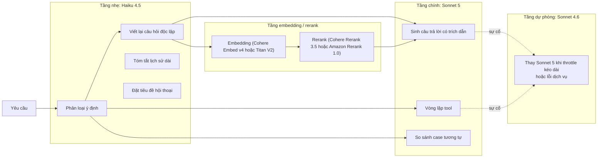
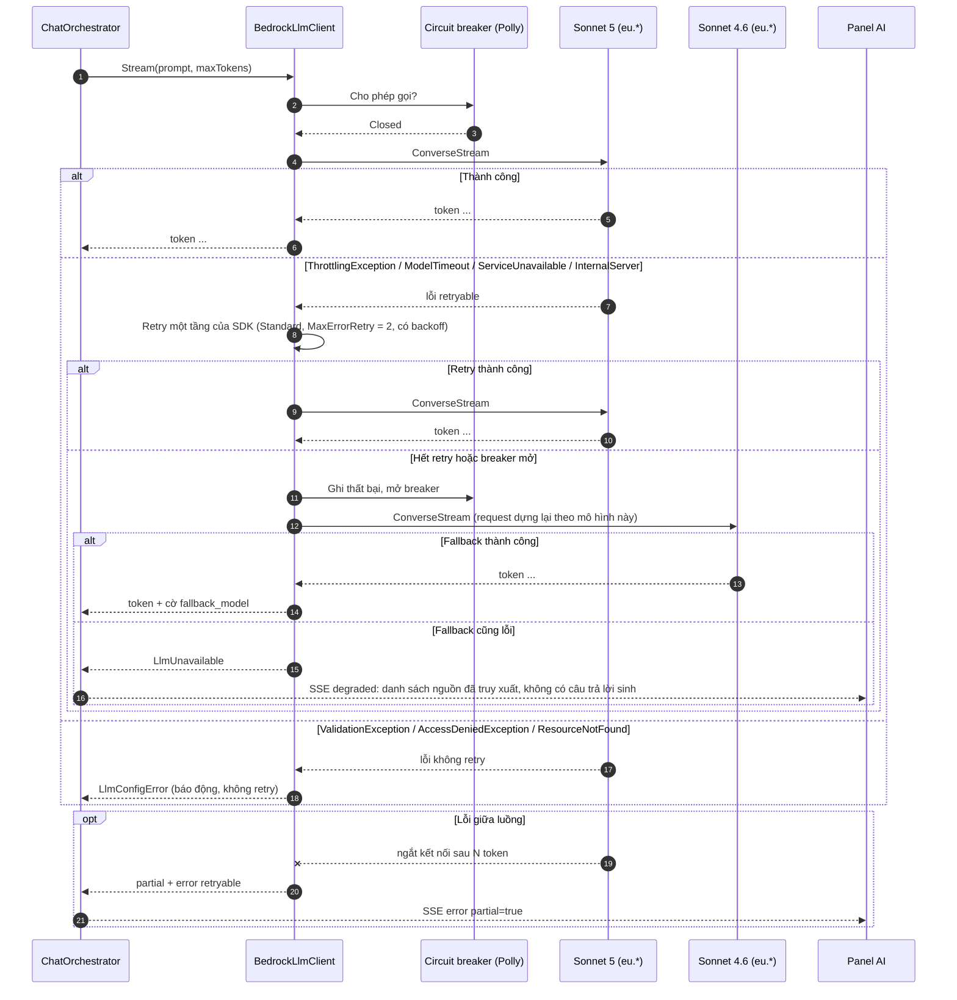
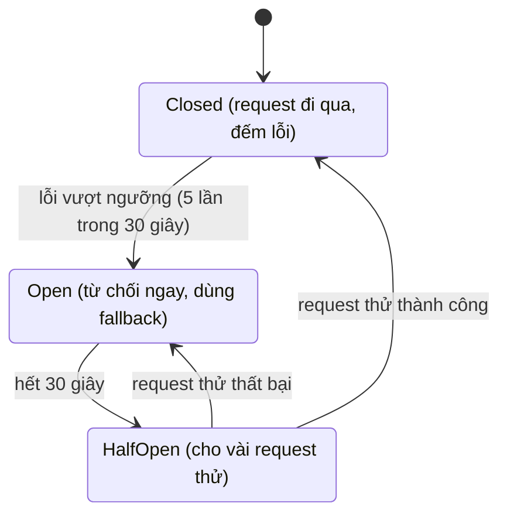
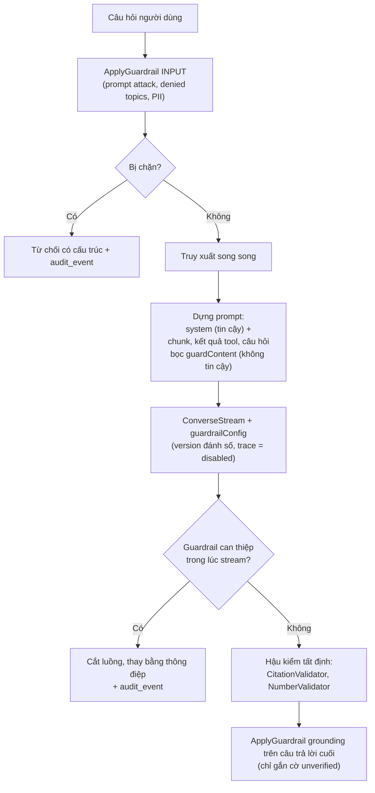
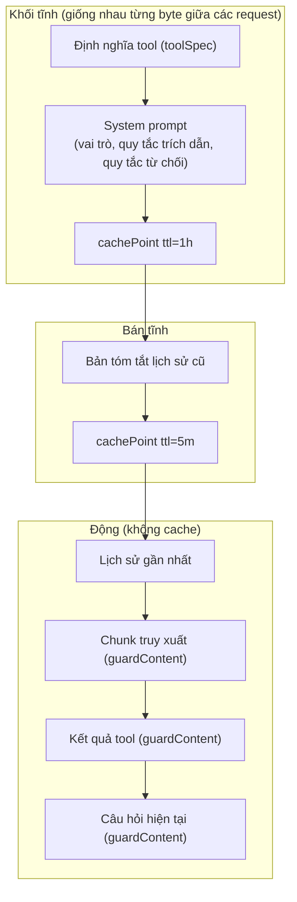
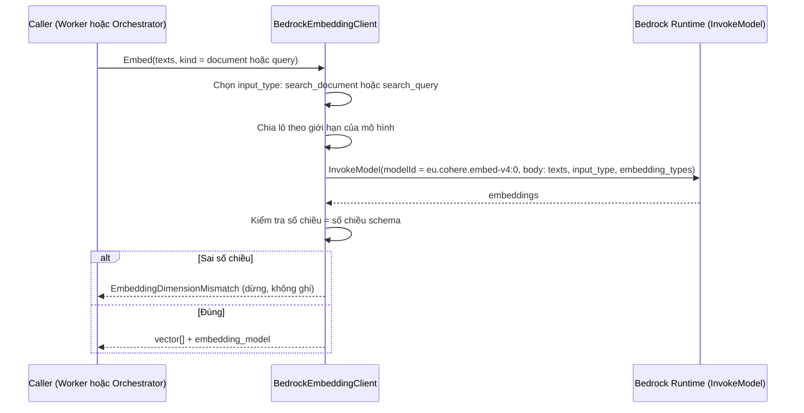
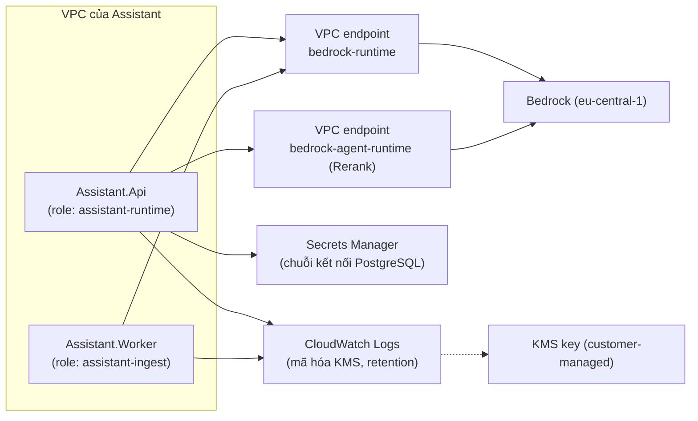
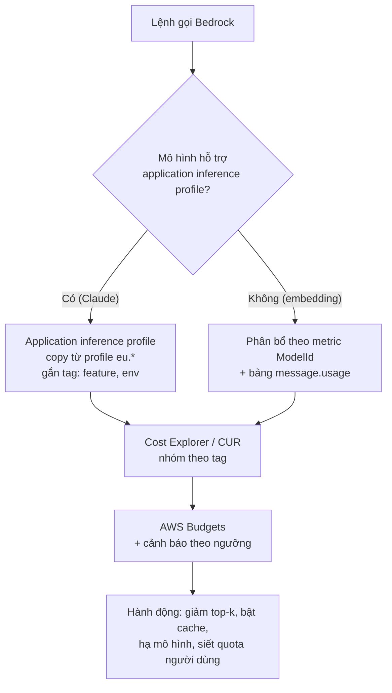

# 06 · Tầng Amazon Bedrock

> **Đã cập nhật trong `ship/`.** File này chốt thông số AWS trước lượt rà soát nguồn 21/09/2026. Bản đã sửa, có nguồn kèm ngày fetch: `ship/00-thuat-ngu-va-nguon.md` và `ship/05-devops.md`. Từ AD-28 (22/09/2026), case tự ghi khi engine tính đạt và không còn bước duyệt: xem `ship/12-tra-case.md`.

Tài liệu này chốt các thông số AWS và mô tả cách Assistant gọi Bedrock: chọn mô hình theo tác vụ, chịu lỗi, guardrail, prompt caching, IAM, mạng, chi phí.

**Nguồn thông số:** tài liệu AWS hiện hành và lệnh `aws bedrock` thực tế, tra ngày 19/09/2026 (bảng §1). Lượt tra thứ hai này đối chiếu lại toàn bộ thông số với model card, trang API và trang hướng dẫn của AWS; các chỗ đã sửa so với bản 18/09 ghi ở [13](13-doi-chieu-skill.md) §Đối chiếu tài liệu AWS. Mọi giá trị ghi "xác minh ở M0" là **chưa kiểm chứng bằng lệnh gọi thật** và không được coi là đã chốt. Không ghi đơn giá trong tài liệu này vì giá thay đổi không báo trước; dùng trang [Bedrock Pricing](https://aws.amazon.com/bedrock/pricing/) khi lập dự toán.

---

## 1. Bảng thông số AWS đã xác minh

| Hạng mục | Giá trị | Nguồn xác minh |
| --- | --- | --- |
| Region chính | `eu-central-1` (Frankfurt) | Rerank (Cohere Rerank 3.5, Amazon Rerank 1.0) trong EU **chỉ có ở Frankfurt**; Paris (`eu-west-3`) không có rerank (trang Rerank supported + `list-foundation-models`). AgentCore có ở Frankfurt và cả Paris (trang AgentCore Regions), nên không phải yếu tố quyết định |
| Claude Sonnet 5 | `eu.anthropic.claude-sonnet-5`; ngữ cảnh 1M, đầu ra 128K; ra mắt 30/06/2026, EOL không sớm hơn 30/06/2027 | Model card + `get-inference-profile`. Bare model ID **không dùng được** trên `bedrock-runtime`; bắt buộc profile geo/global |
| Đích của profile `eu.*` | `eu-central-1`, `eu-west-1`, `eu-west-3`, `eu-north-1`, `eu-south-1`, `eu-south-2` | `get-inference-profile` (Sonnet 5, Haiku 4.5, Cohere Embed v4 cùng danh sách). **Không phải single-region**; Zurich và London không thuộc danh sách khi gọi từ Frankfurt. Model card ghi rõ profile geo/global "có thể route ra ngoài Region nguồn và không cung cấp single-Region data residency" (xem AD-03, R1) |
| Sonnet 5: suy luận | **Adaptive thinking bật mặc định** kể cả khi request không có trường `thinking`. Chỉ `{"type":"disabled"}` mới tắt được; `thinking.type: "enabled"` kèm `budget_tokens` **không hỗ trợ** (`ValidationException`) | Trang Adaptive thinking |
| Cách truyền tham số suy luận qua Converse | Trong `additionalModelRequestFields`: `{"thinking":{"type":"disabled"}}`, hoặc `{"thinking":{"type":"adaptive"},"output_config":{"effort":"low"}}`. `effort` phải nằm trong `output_config` riêng, **không** nằm trong `thinking` (nếu không sẽ lỗi `ValidationException`). Mức: `low`, `medium`, `high` (mặc định `high`) | Trang Adaptive thinking (mức `max` chỉ ghi cho Opus 4.6, Sonnet 4.6, Opus 5) |
| `max_tokens` với suy luận | Là giới hạn cứng cho **tổng** thinking + văn bản trả lời | Trang Adaptive thinking |
| Suy luận và prompt cache | Các request liên tiếp cùng chế độ `adaptive` giữ được cache breakpoint; **chuyển giữa `adaptive` và `disabled` làm mất cache breakpoint ở `messages`** (system và tools vẫn giữ) | Trang Adaptive thinking |
| Sonnet 5: tính năng | Converse, ConverseStream, Invoke, Guardrails, prompt caching (cả implicit lẫn explicit) | Model card |
| Sonnet 5: **không hỗ trợ** | Structured outputs, Count tokens, Intelligent prompt routing. **Sonnet 5 không nằm trong danh sách batch inference** | Model card; trang Batch inference supported |
| Sonnet 5: service tier | Chỉ Standard (không Priority, Flex, Reserved) | Model card |
| Claude Haiku 4.5 | `eu.anthropic.claude-haiku-4-5-20251001-v1:0`; ngữ cảnh 200K, đầu ra 64K; **hỗ trợ structured outputs và count tokens**; tier Standard và Reserved. Model card ghi "EOL không sớm hơn 16/10/2026" (một dòng khác ghi 1/10/2026), legacy tối thiểu 6 tháng, hiện trạng Active | Model card. Cần theo dõi vòng đời (R23). Hai mốc 1/10/2026 và 16/10/2026 đều ghi "không sớm hơn"; kiểm trạng thái vòng đời bằng `get-foundation-model` ở ngày 1. POC không phụ thuộc Haiku sau các mốc này vì đã có ứng viên Nova và Sonnet 4.6 (R23) |
| Claude Opus 5 | `eu.anthropic.claude-opus-5`; ngữ cảnh 1M, đầu ra 128K; ra mắt 24/07/2026; tier Standard và **Batch**; hỗ trợ effort `xhigh`/`max`; khi tắt thinking thì effort bị giới hạn ở `high` | Model card |
| Fallback | `eu.anthropic.claude-sonnet-4-6` (thinking mặc định **không** bật; `enabled` + `budget_tokens` đã deprecated, dùng `adaptive`) | `list-inference-profiles` + trang Adaptive thinking |
| Amazon Nova (định tuyến rẻ) | `eu.amazon.nova-micro-v1:0`, `eu.amazon.nova-lite-v1:0`, `eu.amazon.nova-2-lite-v1:0` | `list-inference-profiles` ở `eu-central-1`. Chưa đo chất lượng phân loại tiếng Pháp kỹ thuật |
| Prompt caching (chung) | Có **implicit** (tự động, best effort, không cần sửa request) và **explicit** (`cachePoint`). Anthropic hỗ trợ cả hai và có chế độ **đơn giản hóa**: một breakpoint ở cuối phần tĩnh, hệ thống tự tìm khớp lùi khoảng 20 khối nội dung. Thứ tự xử lý `tools` → `system` → `messages`; đổi phần trước làm mất cache phần sau. Tối đa 4 checkpoint. TTL 5 phút hoặc 1 giờ (`"ttl":"1h"` trong `cachePoint`); khi trộn, TTL dài đứng trước. Cache đọc không tính vào quota. Không hỗ trợ trong batch inference | Trang Prompt caching |
| Ngưỡng cache tối thiểu mỗi checkpoint | Sonnet 5: 1 024 token; Opus 5: 512; Haiku 4.5: 4 096; Sonnet 4.6: 1 024 | Trang Prompt caching (bảng mô hình) |
| Số liệu cache trong Converse | `cacheReadInputTokens`, `cacheWriteInputTokens`, `cacheDetails` (TTL đã ghi). Khi bật cache, `inputTokens` chỉ là phần **không** cache: tổng = `inputTokens + cacheReadInputTokens + cacheWriteInputTokens` | Trang Prompt caching |
| Cohere Embed v4 | ID `cohere.embed-v4:0`, profile `eu.cohere.embed-v4:0`; chỉ `InvokeModel` (không Converse, không streaming, không Guardrails). `input_type`: `search_document`, `search_query`, `classification`, `clustering`. **`output_dimension`: 256, 512, 1024 hoặc 1536 (mặc định 1536)**. `texts` tối đa **96** mục mỗi lượt; request tối đa khoảng 20 MB; ngữ cảnh 128K; có `truncate` (`NONE`, `LEFT`, `RIGHT`). Hỗ trợ cả **ảnh** (trang PDF) qua `inputs` xen kẽ văn bản + ảnh | Model card + trang tham số Cohere Embed v4 |
| Titan Text Embeddings V2 | `amazon.titan-embed-text-v2:0`; in-region ở `eu-central-1`; 256/512/1024 chiều; float hoặc binary | Bảng KB embeddings + `get-foundation-model` |
| Rerank | Gọi `Rerank` trên endpoint **`bedrock-agent-runtime`**. `queries`: đúng 1; `sources`: 1 đến **1 000** mục (`INLINE`, `TEXT` hoặc `JSON`); `modelArn` là ARN foundation-model (`arn:aws:bedrock:eu-central-1::foundation-model/cohere.rerank-v3-5:0` hoặc `amazon.rerank-v1:0`), không dùng inference profile; chỉ dữ liệu văn bản. Kết quả có `index` và `relevanceScore` | Trang API Rerank + trang Rerank |
| IAM cho Rerank | Cần **cả hai** `bedrock:Rerank` (Resource `*`) và `bedrock:InvokeModel` (giới hạn theo ARN mô hình rerank). Với mô hình bên thứ ba (Cohere) còn cần quyền AWS Marketplace ở lần kích hoạt đầu | Trang Permissions for reranking |
| IAM cho profile | Cần **cả** ARN inference profile **và** ARN foundation-model wildcard region, vì request có thể route sang bất kỳ region nào của profile | Skill AWS + doc prerequisites |
| SCP | Phải cho phép `bedrock:InvokeModel*` ở **mọi** region đích của profile; một region bị chặn thì cả request lỗi | Doc inference profiles |
| Guardrails và tool use | Với `guardrailConfig` trên Converse, **`toolResult`, định nghĩa tool (`toolSpec`) và `toolUse.input` không được guardrail đánh giá**; chỉ `text`, `guardContent`, prompt và câu trả lời của mô hình | Trang Include a guardrail with the Converse API |
| Contextual grounding | Hỗ trợ tóm tắt, diễn giải, hỏi đáp; **không hỗ trợ trường hợp chatbot hội thoại**. Giới hạn: nguồn 100 000 ký tự, câu hỏi 1 000 ký tự, phản hồi 5 000 ký tự. Chỉ kiểm **đầu ra**. Với stream, câu trả lời không liên quan có thể chỉ bị đánh dấu sau khi đã stream xong. Ngưỡng 0–0.99 | Trang Contextual grounding check |
| Guardrail stream | `sync` đệm và kiểm từng đoạn trước khi gửi (**đặt tường minh, không dựa vào mặc định của SDK**); `async` gửi ngay, kiểm nền, **không hỗ trợ che thông tin nhạy cảm**. Khi can thiệp: `stopReason = guardrail_intervened`, văn bản chặn nằm trong luồng, trace ở sự kiện metadata | Trang Guardrails streaming + Converse |
| Guardrail cross-Region | Tùy chọn (guardrail profile). Cấu hình guardrail chỉ lưu ở Region chính nhưng prompt và kết quả **có thể** đi ra ngoài Region chính trong cùng geography; không tính thêm phí. Cần thêm ARN `guardrail-profile` của các region đích trong IAM | Trang Guardrails cross-Region + permissions |
| Ép guardrail bằng IAM | Điều kiện `bedrock:GuardrailIdentifier` áp cho Converse, ConverseStream, InvokeModel, InvokeModelWithResponseStream; guardrail và role phải cùng AWS Organization; người dùng có thể bỏ qua việc kiểm **đầu vào** bằng input tag nhưng đầu ra luôn bị kiểm | Trang Enforce guardrails |
| Model invocation logging | Chỉ áp cho lệnh gọi qua endpoint **`bedrock-runtime`**; cấu hình **theo tài khoản và Region** (không theo ứng dụng); đích S3 hoặc CloudWatch Logs cùng tài khoản và Region; thân request/response tới 100 KB ghi trực tiếp, lớn hơn ghi ra S3 | Trang Model invocation logging |
| Truy cập mô hình bên thứ ba | Bật mặc định khi có đúng quyền Marketplace. Lần gọi đầu tự khởi tạo subscription (tối đa ~15 phút; có thể `AccessDeniedException` tạm thời). Cần `aws-marketplace:Subscribe`, `Unsubscribe`, `ViewSubscriptions`; **Anthropic yêu cầu biểu mẫu First Time Use** (`PutUseCaseForModelAccess`, một lần cho tài khoản hoặc tài khoản quản lý Organization, kế thừa xuống tài khoản con; không áp cho `bedrock-mantle`); cần phương thức thanh toán hợp lệ. Kiểm tra bằng `get-foundation-model-availability` | Trang Request access to models |
| Batch inference | Có: Haiku 4.5, Sonnet 4.6, Opus 5 (profile cross-Region gồm `eu-central-1`), Nova, Titan Text Embeddings V2 (in-region `eu-central-1`). **Không có**: Sonnet 5, Cohere Embed v4 | Trang Batch inference supported |
| VPC endpoint | `com.amazonaws.<region>.bedrock-runtime`, `com.amazonaws.<region>.bedrock-agent-runtime` (cho Rerank), `bedrock`, `bedrock-agent`, `bedrock-mantle`; hỗ trợ endpoint policy và private DNS | Trang VPC interface endpoints |
| Application inference profile | `CreateInferenceProfile` với `modelSource` là profile cross-Region hệ thống; gắn `tags`; dùng ARN kết quả làm `modelId`. Embedding không hỗ trợ | Trang Create application inference profile + Inference profiles support |
| AWS SDK for .NET (v4) | `RetryMode` có `Legacy`, `Standard`, `Adaptive` (**Adaptive ghi là experimental**); mặc định `Legacy` nếu không đặt. Với lệnh async, thuộc tính `Timeout` **không** có tác dụng, phải dùng `CancellationToken` | Trang Retries and timeouts |
| Extension PostgreSQL trên RDS | `unaccent` 1.1 và `pg_trgm` 1.6 có ở mọi phiên bản, nên không có ràng buộc phiên bản. (`pgvector` **không còn dùng** sau AD-17: kho vector nằm ở MKB) | Trang RDS PostgreSQL extensions |
| Bedrock Agents classic | Không nhận khách hàng mới từ **30/07/2026**, chỉ tài khoản có hoạt động trong 12 tháng gần nhất; không có ngoại lệ; hướng đi mới là AgentCore | Trang Agents classic maintenance mode |
| IAM Roles Anywhere | Dùng chứng chỉ X.509 từ CA của công ty (trust anchor), profile, role; tài nguyên **theo Region**, tạo cùng tài khoản và Region; ranh giới tin cậy ở mức tài khoản nên phải giới hạn bằng điều kiện trong trust policy của role | Trang Roles Anywhere introduction |

**Danh sách xác minh bắt buộc ở M0** (tài liệu đã nêu thông số; mỗi mục dưới đây cần **một lần gọi thật** để chốt số đo hoặc quyền, ghi kết quả vào repo):

1. Converse + ConverseStream với `eu.anthropic.claude-sonnet-5`, `thinking` tắt qua `additionalModelRequestFields`, `maxTokens` tường minh; đo thời gian tới chữ đầu tiên. Thử thêm `adaptive` + `effort = low` cho vòng lặp tool.
2. Guardrail đính vào ConverseStream: đo độ trễ chế độ `sync`. Thử `ApplyGuardrail` với grounding trên câu trả lời cuối (giới hạn 5 000 ký tự) và xác nhận hành vi khi câu trả lời dài hơn.
3. `InvokeModel` với `eu.cohere.embed-v4:0`: chọn `output_dimension` (1024 hay 1536), độ trễ, lô 96 mục; so với Titan V2.
4. Rerank thật với 40 tài liệu: quyền `bedrock:Rerank` + `bedrock:InvokeModel`, quyền Marketplace cho Cohere, độ trễ.
5. Quota mặc định của tài khoản cho Sonnet 5 và Haiku 4.5 ở `eu-central-1` (TPM, RPM); gửi yêu cầu tăng ngay tuần 1 vì AWS duyệt 1–3 ngày làm việc.
6. Prompt caching: `cacheWriteInputTokens` > 0 ở lần đầu và `cacheReadInputTokens` > 0 ở lần sau, với `cachePoint` đặt sau `tools` và `system`.
7. **Quyền dùng mô hình bên thứ ba** cho Claude (Sonnet 5, Haiku 4.5, Opus 5) và Cohere (Embed v4, Rerank): biểu mẫu Anthropic, đăng ký Marketplace, thanh toán, chạy `get-foundation-model-availability`. Đây là điểm chặn có thể xảy ra ngay ngày đầu (R21).
8. **PostgreSQL đích:** `unaccent` và `pg_trgm` bật được, cấu hình FTS `fr_unaccent` tạo được. Không cần kiểm phiên bản cho vector.

9. **Managed Knowledge Base (AD-17):** MKB chỉ GA ở một tập region, phải tra `bedrock` endpoints cho `eu-central-1` (V-K2); AWS SDK for .NET có `type: MANAGED` và `MANAGED_KNOWLEDGE_BASE_CONNECTOR` hay không (V-K3) — tài liệu AWS chỉ nêu mốc boto3/botocore ≥ 1.43.64 và **không nói gì về .NET**; managed S3 connector đọc `.metadata.json` sidecar và khai được thuộc tính lọc được (V-K4); `overrideSearchType: HYBRID` có dùng được trên kho vector của MKB không (V-K5).

---

### Các cổng chặn trước lệnh gọi đầu tiên, đo thật ngày 19/09/2026

> **Đo trên một tài khoản thử nghiệm chưa bật billing, không phải tài khoản production của VF.** Vì vậy các con số dưới đây **không** mô tả tình trạng tài khoản production. Giá trị của phép đo nằm ở chỗ khác: nó cho thấy **có bao nhiêu loại cổng chặn, thông báo lỗi của từng loại ra sao, và gỡ bằng cách nào** — ba loại này tồn tại với mọi tài khoản, và phải được kiểm lại trên tài khoản production trước ngày bắt đầu.

Gọi thật vào `eu-central-1`. Không lệnh gọi mô hình nào thành công, với **ba loại lỗi khác nhau**, ba cách gỡ khác nhau và ba thời gian chờ khác nhau. Biết trước ba loại này giúp tuần 1 không mất thời gian chẩn đoán nhầm.

| Mô hình | Kết quả gọi thật | Nguyên nhân | Cách gỡ |
| --- | --- | --- | --- |
| `eu.anthropic.claude-sonnet-5` | `AccessDeniedException`: "not available for this account" | Mô hình bên thứ ba bán qua AWS Marketplace, tài khoản **chưa có thỏa thuận**. `get-foundation-model-availability` trả `agreementAvailability: NOT_AVAILABLE` | Đăng ký qua Marketplace; thông báo lỗi chỉ sang **liên hệ AWS Sales**, tức có thể mất nhiều ngày |
| `eu.anthropic.claude-opus-5` | `AccessDeniedException`, cùng nội dung | Như trên | Như trên |
| `eu.anthropic.claude-haiku-4-5-20251001-v1:0` | `ResourceNotFoundException`: "Model use case details have not been submitted for this account" | **Chưa nộp biểu mẫu use case của Anthropic** | Điền biểu mẫu trong console Bedrock; tài liệu ghi chờ khoảng **15 phút** rồi thử lại |
| `eu.anthropic.claude-sonnet-4-6` | `ResourceNotFoundException`, cùng nội dung | Như trên | Như trên |
| `eu.cohere.embed-v4:0` | `ThrottlingException`: "Too many tokens per day" | Có quyền, nhưng **chạm trần token mỗi ngày** | Xin tăng hạn mức |
| `cohere.rerank-v3-5:0` | `ThrottlingException`: "Your request rate is too high" | Trần tần suất | Xin tăng hạn mức |

**Hạn mức của tài khoản thử nghiệm bằng 0.** `service-quotas` cho `eu-central-1` trả về:

| Hạn mức | Giá trị |
| --- | --- |
| Cross-region model inference **requests per minute** cho Claude Haiku 4.5 | **0** |
| Cross-region model inference **tokens per minute** cho Claude Haiku 4.5 | **0** |
| Cross-region model inference **tokens per minute** cho Claude Sonnet 5 | **0** |
| Global cross-region, cả hai mô hình | **0** |

Trên tài khoản chưa bật billing, hạn mức bằng 0 là điều bình thường và phần lớn sẽ tự có khi billing hoạt động. Điều cần rút ra: **hạn mức là một cổng riêng, độc lập với quyền truy cập mô hình** — gỡ xong hai cổng trên vẫn chưa gọi được nếu hạn mức chưa đủ. Trên tài khoản production, phải **đọc số thật** bằng `service-quotas list-service-quotas --service-code bedrock` rồi so với khối lượng giả định ở §10 (4 000 lượt mỗi tháng), chứ không giả định là đủ.

**Điều đã xác nhận là đúng và không phụ thuộc tài khoản:** mọi mã mô hình trong tài liệu đều tồn tại và ở trạng thái `ACTIVE` trong vùng — `eu.anthropic.claude-sonnet-5`, `eu.anthropic.claude-opus-5`, `eu.anthropic.claude-sonnet-4-6`, `eu.anthropic.claude-haiku-4-5-20251001-v1:0`, `eu.cohere.embed-v4:0`, `cohere.rerank-v3-5:0`. `cohere.rerank-v3-5:0` **không có** profile `eu.*`, đúng như §1 mô tả là phải dùng ARN foundation-model. AgentCore control plane **gọi được** ở `eu-central-1` (`list-harnesses` và `list-gateways` đều trả kết quả), xác nhận vùng của AD-13.

**Việc phải làm trên tài khoản production trước ngày bắt đầu** (R43). Mục "Yêu cầu tăng quota Bedrock" trong Gantt ([11](11-lo-trinh.md) §2) đang là 1 ngày trong tuần 1; nó chỉ đủ cho đầu việc thứ ba, không đủ cho hai đầu việc đầu:

1. **Chạy lại đúng bốn lệnh gọi trên** vào tài khoản production để biết tài khoản đó đang ở cổng nào. Mất vài phút, và trả lời được câu hỏi mà cả bảng này không trả lời thay được.
2. Nộp biểu mẫu use case của Anthropic trong console Bedrock nếu chưa nộp — rẻ nhất, nhanh nhất, chờ khoảng 15 phút.
3. Đăng ký Marketplace cho Claude Sonnet 5 và Opus 5 nếu chưa có thỏa thuận. Đây là mục **có thời gian chờ khó đoán nhất**, vì thông báo lỗi chỉ sang liên hệ AWS Sales.
4. Đọc hạn mức thật và so với khối lượng giả định ở §10; thiếu thì nộp đơn tăng, thường mất vài ngày.

---

### Thông số từ model card, đối chiếu ngày 19/09/2026

Tra trực tiếp model card của Claude Sonnet 5 và Cohere Embed v4. Bốn điểm dưới đây **chưa có trong bản thảo trước** và có điểm ảnh hưởng mọi lượt gọi.

| Điểm | Nội dung | Hệ quả |
| --- | --- | --- |
| **Thinking bật mặc định** | Claude Sonnet 5 ghi rõ: adaptive thinking **bật sẵn, kể cả với request bỏ trống trường `thinking`**; tắt bằng `"thinking": {"type": "disabled"}` | **Ảnh hưởng mọi lượt.** Không tắt tường minh thì mỗi lượt sinh thêm token suy luận, đội cả chi phí lẫn độ trễ. Đây không còn là "kiểm chứng V-A2" mà là **cấu hình bắt buộc**: tắt cho `doc_qa` và định tuyến; cân nhắc bật có kiểm soát cho lượt `optimize` |
| Cửa sổ ngữ cảnh và đầu ra | Ngữ cảnh 1 triệu token; đầu ra tối đa 128 nghìn token | Trần `maxTokens` của mình (§2) thấp hơn nhiều, giữ nguyên. Không dựa vào cửa sổ lớn để bỏ qua truy xuất |
| Bậc dịch vụ | Sonnet 5 chỉ có **Standard**; Priority, Flex và Reserved **không hỗ trợ** | Không có đòn bẩy chi phí từ Flex, cũng không mua được độ trễ bằng Priority. Ngân sách §10 không có phương án này |
| `CountTokens` không hỗ trợ | Sonnet 5 trên `bedrock-runtime` **không** hỗ trợ `Count tokens` | Hạn mức theo token ([07](07-auth-bao-mat.md) §5) **không đếm trước được**; phải trừ quota **sau** khi có `metadata.usage`, hoặc ước lượng bằng độ dài ký tự để chặn sớm. Ghi rõ để không thiết kế nhầm một bộ đếm trước |
| Prompt caching của Sonnet 5 | Tối thiểu **1 024 token** mỗi checkpoint, tối đa **4 checkpoint** mỗi request, TTL **5 phút và 1 giờ**, đặt được ở `system`, `messages` và `tools`. Ngưỡng **khác nhau theo mô hình**, xem bảng ở §1: Haiku 4.5 là 4 096 | Khớp với §5 |

**Xác nhận lại hai quyết định nền:**

- **AD-03 đúng.** Model card cho thấy Claude Sonnet 5 trên `bedrock-runtime` **không có In-Region ở bất kỳ vùng nào**; bắt buộc profile geo hoặc global. `eu.anthropic.claude-sonnet-5` tồn tại, mô tả là "giữ dữ liệu trong các vùng EU". Đường single-region duy nhất là `bedrock-mantle` với mã trần `anthropic.claude-sonnet-5`, và endpoint đó **chỉ có In-Region ở `us-east-1`, `us-gov-west-1`, `eu-north-1`, `eu-west-1`, `ap-southeast-4`**, đồng thời **không hỗ trợ Guardrails và không hỗ trợ Converse** (chỉ Messages API). Đúng như §11 đã mô tả.
- **AD-06 đúng.** `eu.cohere.embed-v4:0` tồn tại. Gọi từ `eu-central-1`, profile EU route tới đúng **6 vùng**: Frankfurt, Stockholm, Milan, Spain, Ireland, Paris — khớp con số ở Q1.

**Một giới hạn mới của phương án dự phòng §11, phát hiện 20/09/2026.** Model card Claude Sonnet 4.6 ghi endpoint `bedrock-mantle`: **không hỗ trợ**. Nghĩa là nếu Q1 trả lời "bắt buộc single-region" thì **Sonnet 4.6 không dùng được làm mô hình dự phòng** (AD-05), vì đường single-region duy nhất là `bedrock-mantle`. Chỉ Sonnet 5 và Haiku 4.5 có mặt trên endpoint đó. Ngoài ra Sonnet 4.6 **không hỗ trợ Messages API** trên `bedrock-runtime` (chỉ Converse và Invoke), khác với Sonnet 5 và Haiku 4.5. Hệ quả: dưới kịch bản single-region, bậc dự phòng của AD-05 phải đổi sang Haiku 4.5 hoặc một mô hình khác, và điều này phải chốt cùng lúc với Q1.

Ghi nhận thêm: Sonnet 4.6 có **In-Region ở `eu-west-2` (London)** trên `bedrock-runtime` với mã trần `anthropic.claude-sonnet-4-6` — vùng duy nhất. London nằm ngoài EU sau Brexit nên đây không phải lời giải cho residency EU, chỉ ghi lại cho đầy đủ.

**Một cải thiện cho phương án dự phòng §11:** Cohere Embed v4 **có In-Region ở `eu-west-1` (Ireland)** với mã trần `cohere.embed-v4:0`. Nếu Q1 trả lời "bắt buộc single-region", tầng embedding **không phải đổi mô hình**, chỉ đổi sang mã trần ở `eu-west-1`. Chỉ tầng gọi mô hình chat mới phải chuyển sang `bedrock-mantle`.

---

## 1a. AgentCore Harness: thông số đã xác minh và kiểm chứng ở M0

Tra tài liệu AgentCore ngày 19/09/2026 cho AD-13. Đây là thông số **từ tài liệu**, chưa gọi thật.

| Chủ đề | Nội dung | Nguồn |
| --- | --- | --- |
| Vùng | Harness, Runtime microVM, Memory, Gateway, Identity, Policy, Observability, Evaluations đều có ở `eu-central-1` (Frankfurt) và `eu-west-3` (Paris) | Trang Supported AWS Regions của AgentCore |
| Bản chất | Vòng lặp quản lý sẵn, chạy trong microVM theo phiên, dựa trên Strands Agents; không tính phí riêng, chỉ tính các dịch vụ AgentCore bên dưới | Trang Harness |
| Hook | **Không hỗ trợ**; cũng không chọn được framework | Bảng Harness so với Runtime |
| Công cụ mặc định | `shell` và `file_operations` có sẵn trong mọi phiên trừ khi hạn chế bằng `allowedTools` | Trang Tools |
| Công cụ inline | Chạy phía client; stream dừng ở `stopReason = tool_use`; phải gửi lại cả message `toolUse` của assistant và `toolResult` | Trang Tools |
| Model mặc định | `global.anthropic.claude-sonnet-4-6` (route toàn cầu) | Trang Models |
| Guardrail | Qua `bedrockModelConfig.additionalParams.guardrailConfig` với `converse_stream`; dừng với `guardrail_intervened` | Trang Models |
| Giới hạn mặc định | `maxIterations` 75, `timeoutSeconds` 3 600, `idleRuntimeSessionTimeout` 900, `maxLifetime` 28 800. **Lưu ý:** trang API CreateHarness **không ghi giá trị mặc định nào**, nên các số này chỉ có ở trang vận hành và có thể đổi. Kết luận không phụ thuộc số cụ thể: **luôn đặt tường minh** | Trang Observability and cost controls |
| Xác thực gọi vào là loại trừ | Một harness chỉ nhận **một** kiểu: SigV4 khi không có `authorizerConfiguration`, OAuth JWT khi có. Harness **từ chối** Bearer token trên harness SigV4 và từ chối SigV4 trên harness JWT. Không có chế độ lẫn | Tài liệu Harness security |
| Ràng buộc JWT | `customJWTAuthorizer` có `discoveryUrl` (bắt buộc), `allowedClients` và **`allowedAudience`**. Thiếu **cả hai** ràng buộc thì authorizer **nhận mọi token hợp lệ của issuer** | Tài liệu Harness security |
| Danh tính người dùng ở tầng vận chuyển | `InvokeHarness` có header `X-Amzn-Bedrock-AgentCore-Runtime-User-Id` (`runtimeUserId`), truyền xuống runtime container. Đây là kênh **quan sát và phân bổ**, không thay được JWT cho phân quyền | Trang API InvokeHarness |
| `truncation` | `CreateHarness` có trường `truncation` (chiến lược cắt ngữ cảnh khi vượt giới hạn mô hình). Đặt tường minh, vì lịch sử hội thoại do `Assistant.Api` dựng | Trang API CreateHarness |
| Bộ nhớ khi phiên rảnh | Runtime v2 **tự thu hồi bộ nhớ rảnh sau 120 giây**; chỉ tính theo mức tiêu thụ thật, không tính trọn thời gian rảnh | Trang giá AgentCore |
| Cold start | Runtime công bố 18/09/2026 dùng snapshot-restore: **P75 1,9 đến 2,0 giây** cho ảnh từ 200 MB đến 2 GB (bản trước là 5,4 đến 30 giây). Phiên đã ấm khởi động **dưới 100 ms** | Bài blog AWS "The new AgentCore runtime" |
| Memory | Managed Memory bật mặc định khi tạo qua service API (CLI mặc định tắt) | Trang Memory |
| Xác thực gọi vào | IAM (SigV4) hoặc `CUSTOM_JWT`; danh tính từng người dùng chỉ xuống được downstream khi dùng JWT | Trang Security |
| Xác thực ra target | Với target OpenAPI: có OAuth client credentials, authorization code, **token exchange**; **không** có token passthrough | Bảng Outbound authorization của Gateway |
| Policy | Cedar, chặn trước mọi lời gọi tool qua Gateway, điều kiện theo danh tính và tham số đầu vào | Trang Policy |
| Nội dung khách hàng | Trang tổng quan ghi AgentCore có thể lưu và dùng nội dung để cải thiện dịch vụ | Trang Overview (mục Pricing) |
| Đơn giá | Trang giá liệt kê Runtime theo vCPU-giờ và GB-giờ, Gateway theo 1 000 lần gọi, Memory theo sự kiện và bản ghi, Policy theo yêu cầu. Chưa đối chiếu giá cho `eu-central-1` | Trang giá AgentCore |
| SDK | AWS SDK for .NET V4 có thao tác `InvokeHarness` (chỉ thấy liên kết trong trang API; chưa thử) | Trang API InvokeHarness |

**Kiểm chứng chạy ở M0, tuần 1, trên đường găng** (mỗi mục một lần chạy thật). **V-A1, V-A3, V-A4, V-A6 là điều kiện của cổng G0:** V-A1 và V-A6 có hạn chót **hết ngày 3 (23/09)**, sớm hơn G0, vì facade và Gateway (m0g) chỉ đáng dựng khi chúng đạt. Trượt thì danh tính người dùng không xuống được facade, `[ApiAccess]` của Main API không áp dụng đúng, và đường Harness không đạt yêu cầu phân quyền — khi đó chuyển sang vòng lặp C# ([04](04-tool-calling.md) §6) ngay trong tuần 1. V-A2, V-A5, V-A7, V-A8, V-A9 chạy trong tuần 2 cùng M1.

| Mã | Kiểm chứng | Đạt khi |
| --- | --- | --- |
| **V-A1** | Gọi `InvokeHarness` từ .NET bằng Bearer JWT của Keycloak. **Đã thu hẹp:** trang API InvokeHarness liệt kê **AWS SDK for .NET V4**, nên SDK có thao tác này; rủi ro còn lại chỉ là thay bộ ký SigV4 bằng header `Authorization: Bearer`. Nếu SDK không cho thay, dùng `HttpClient` thô với `POST /harnesses/invoke?harnessArn=...` và parser event stream | Nhận stream và danh tính người dùng tới được Gateway |
| V-A2 | `modelId = eu.anthropic.claude-sonnet-5` với `converse_stream`; **tắt thinking** qua `additionalParams` (tài liệu chỉ có ví dụ `guardrailConfig`); `maxTokens`. **Bắt buộc, không phải tùy chọn:** thinking bật sẵn kể cả khi bỏ trống trường, xem §1 | Thấy `thinking` tắt trong trace và số token đầu ra không có phần suy luận |
| V-A3 | ~~Stream có phát sự kiện tool phía server không~~ **Đã trả lời bằng tài liệu, không còn là kiểm chứng quyết định.** Trang API InvokeHarness ghi `contentBlockDelta.delta` mang một trong `text`, `toolUse`, `toolResult`, `reasoningContent`. Chỉ còn xác nhận khi chạy thật | Thấy `toolUse` và `toolResult` trong stream; nếu lệch tài liệu thì dựa vào `tool_run` của facade |
| **V-A4** | Đo p50 và p95 thời gian tới chữ đầu tiên và tổng thời gian một lượt tool, phiên lạnh so với phiên ấm, so với vòng lặp C# gọi thẳng `ConverseStream`; ý nghĩa của một "vòng" khi đặt `maxIterations`. Cũng đo **kích thước microVM thật** (vCPU và GB) để thay giả định ở §10 | p95 trong ngân sách của lượt tool. Đối chiếu với số công bố: cold start P75 khoảng 2 giây, phiên ấm dưới 100 ms. Không đạt thì chuyển sang vòng lặp C# ([04](04-tool-calling.md) §6) |
| V-A5 | Với Memory tắt: gửi đủ `messages` mỗi lượt hay để phiên giữ lịch sử; gọi hai lần cùng phiên có nhân đôi lịch sử không | Một hợp đồng lịch sử rõ ràng, không nhân đôi |
| **V-A6** | Gateway target OpenAPI tới facade với token exchange từ Keycloak. **Đã thu hẹp:** AgentCore Identity hỗ trợ **RFC 8693 như một grant type sẵn có** của credential provider, và Gateway đổi token người dùng thành token gắn audience trước khi gọi target, không cần agent tự làm (bài blog AWS "Implement on-behalf-of token exchange for multi-tenant agents"). Rủi ro còn lại nằm ở **phía Keycloak**: bật token exchange, audience khớp, và Gateway tới được facade | `Authorization` tới facade mang danh tính người dùng và `[ApiAccess]` áp dụng đúng |
| V-A7 | `allowedTools` chỉ còn tool của Gateway; đọc trace để chắc `shell` và `file_operations` không nằm trong danh sách gửi cho model | Không thấy hai tool này |
| V-A8 | Guardrail: `guardrailConfig` chặn thật; `guardrail_intervened`; kiểm lại claim "guardrail không đánh giá `toolResult`" (trang Converse đã chuyển chỗ) | Hành vi được ghi nhận bằng thử nghiệm |
| V-A9 | Cedar có điều kiện số học trên tham số tool (ví dụ `b` từ 100 đến 2000) không | Có, hoặc biên tham số ở facade là đủ |
| **V-A10** | **Mới.** Harness ở chế độ VPC kéo container từ **ECR Public** (`public.ecr.aws`) mỗi lần mở phiên. ECR Public **không có VPC endpoint**, nên VPC phải có **NAT gateway** ra internet, nếu không phiên hỏng vì image-pull timeout. Kiểm subnet, NAT và bảng định tuyến trước khi bật chế độ VPC | Phiên mở được ở chế độ VPC |
| V-A11 | Ngữ nghĩa `maxTokens` lệch giữa hai trang API: CreateHarness ghi "tổng token đầu ra trên **mọi** lệnh gọi mô hình trong một lần gọi", InvokeHarness ghi "**mỗi vòng lặp**". Xác định bằng thử nghiệm | Biết trần token thật để đặt đúng |

**Quyết định:** POC dùng AgentCore Harness ([04](04-tool-calling.md) §8, AD-13). Bốn kiểm chứng quyết định chạy **trong tuần 1**, trên đường găng, và kết quả của chúng vào cổng G0; vòng lặp C# ([04](04-tool-calling.md) §6) là đường thoát đã thiết kế sẵn nếu chúng trượt. Kiểm chứng phải chạy sau khi Q1 đã có câu trả lời, và Q1 phải có trước ngày bắt đầu ([11](11-lo-trinh.md) §10) — tức tuần 1 không còn dự trữ cho Q1 (nếu Q1 là single-region thì xem §11, khi đó Harness không dùng được và đường thoát §6 là mặc định).

## 2. Định tuyến mô hình theo tác vụ

Một mô hình cho mọi việc sẽ hoặc trả tiền oan cho phần việc rẻ, hoặc làm hỏng độ trễ ở chuỗi nhiều bước.

**Sơ đồ 6.1 — Phân tầng mô hình**



| Tác vụ | Mô hình | `maxTokens` (đặt tường minh) | Thinking | Ghi chú |
| --- | --- | --- | --- | --- |
| Phân loại ý định | Haiku 4.5 | ~50 | — | Đầu ra một nhãn; Haiku 4.5 **hỗ trợ structured outputs**, dùng cho nhãn có schema |
| Viết lại câu hỏi | Haiku 4.5 | ~200 | — | Chạy ở mọi lượt kể từ AD-15 |
| Trả lời RAG | Sonnet 5 | ~1 500 | **Tắt** | Trả lời bám chunk, không cần suy luận dài; giữ độ trễ |
| Vòng lặp tool | Sonnet 5 | ~4 000 mỗi vòng (thinking cũng tính vào `maxTokens`) | `adaptive` + `output_config.effort = low` | Chọn tool và lập tham số hưởng lợi từ suy luận; adaptive thinking tự bật interleaved giữa các lần gọi tool |
| So sánh case | Sonnet 5 | ~1 500 | Tắt | |

**Tham số lấy mẫu:** đường RAG và so sánh case dùng nhiệt độ thấp (khởi điểm 0–0,2) để câu trả lời ổn định giữa các lần chạy; vòng lặp tool cũng thấp. Trang AWS không nêu hạn chế tham số lấy mẫu của Sonnet 5 khi bật thinking; xác minh ở M0.

**Ứng viên rẻ hơn cho định tuyến (bắt buộc từ AD-15, không còn là tùy chọn):** các mô hình Nova (Micro, Lite, 2 Lite) có profile EU và thường rẻ hơn Haiku khi chỉ phân loại một nhãn. Đưa vào bộ so sánh ở M1 cùng Haiku 4.5, chọn theo độ chính xác phân loại trên câu hỏi tiếng Pháp kỹ thuật, không theo giá.

**Đầu ra có cấu trúc:** Sonnet 5 trên Bedrock **không hỗ trợ tính năng structured outputs** (Haiku 4.5 có hỗ trợ, nên nhãn định tuyến dùng Haiku với schema). Với Sonnet 5, thứ tự kỹ thuật dùng, từ rẻ đến đắt:

| Kỹ thuật | Dùng khi |
| --- | --- |
| Tool use với JSON Schema (`toolSpec`) | **Mặc định.** Định tuyến, trích tham số tool, nhãn ý định |
| Kiểm tra bằng `System.Text.Json` + FluentValidation | Luôn luôn, sau mỗi lần nhận đầu ra có cấu trúc |
| Nhắc lại một lần kèm lỗi validation | Khi kiểm tra thất bại; tối đa 1 lần, tính vào giới hạn vòng |
| Hậu xử lý an toàn (giá trị mặc định, từ chối) | Lớp cuối, khi nhắc lại vẫn hỏng |

**Vì sao đặt `maxTokens` tường minh ở mọi lệnh gọi:** để trống thì mặc định về mức tối đa của mô hình và **giữ chỗ quota vượt xa nhu cầu**, nguyên nhân phổ biến nhất của `ThrottlingException`. Quota được giữ chỗ theo `input + maxTokens` khi request bắt đầu.

---

## 3. Chịu lỗi

**Sơ đồ 6.2 — Sequence: retry, fallback, chế độ chỉ-truy-xuất**



| Loại lỗi | Retry | Hành động |
| --- | --- | --- |
| `ThrottlingException`, `ModelTimeoutException`, `ServiceUnavailableException`, `InternalServerException` | Có, **một tầng duy nhất** là SDK (`RetryMode.Standard`, `MaxErrorRetry = 2`) | Sau khi hết retry: fallback |
| `ValidationException`, `AccessDeniedException`, `ResourceNotFoundException` | **Không** | Báo động vận hành; không che lỗi cấu hình |
| Lỗi giữa luồng | Không tự động | Giữ phần đã có, nút "Thử lại" cho người dùng |

**Bộ điều kiện chịu lỗi có ngưỡng số** (điều kiện, ngưỡng phát hiện, phản ứng) để tránh thông số "xử lý lỗi cho tốt" không kiểm thử được. Giá trị là điểm khởi đầu, đo và chốt ở M0:

| Điều kiện | Ngưỡng phát hiện | Phản ứng |
| --- | --- | --- |
| Không nhận token đầu tiên | 15 giây | Hủy, retry một lần, rồi fallback |
| Luồng đứng im giữa chừng | 20 giây không có token mới | Đóng luồng, giữ phần đã có, `error(retryable)` |
| Tổng thời gian một lượt | 60 giây | Dừng, trình bày phần đã có |
| Lỗi liên tiếp mở breaker | 5 lần trong 30 giây | Mở breaker 30 giây, sang fallback |
| Không mô hình nào dùng được | Fallback cũng lỗi | Chế độ chỉ-truy-xuất |

**Sơ đồ 6.2b — Trạng thái circuit breaker**



Khi breaker mở, request đi thẳng sang Sonnet 4.6 mà không chờ hết thời gian chờ. Retry thủ công bằng `Thread.Sleep` trong vòng lặp gây thundering herd. Theo tài liệu AWS SDK for .NET v4: `RetryMode` có `Legacy`, `Standard`, `Adaptive` và **`Adaptive` được ghi là experimental**; mặc định là `Legacy` nếu không đặt. Vì vậy đặt tường minh `RetryMode.Standard` với `MaxErrorRetry = 2`, và để Polly chỉ làm circuit breaker + fallback, **không thêm một tầng retry thứ hai** (hai tầng retry nhân số lần gọi và làm bão throttling nặng hơn).

Khởi tạo `AmazonBedrockRuntimeClient` **một lần** và dùng lại (singleton); tạo client mỗi request tốn thời gian và kết nối.

Ngưỡng thời gian phải thực thi bằng `CancellationTokenSource` truyền vào lệnh gọi async: thuộc tính `Timeout` của client **không có tác dụng** với lệnh async (theo tài liệu SDK).

**Yêu cầu cho fallback:** request phải được **dựng lại theo từng mô hình**, không chỉ đổi `modelId`, vì cấu hình thinking và tham số bổ sung khác nhau giữa các thế hệ Claude. `ILlmClient` chứa một `RequestBuilder` riêng cho mỗi mô hình.

**Chế độ chỉ-truy-xuất (degraded):** khi không mô hình nào dùng được, hệ thống vẫn trả **các nguồn đã truy xuất** (tài liệu, trang, điều khoản). Kỹ sư vẫn tra được tài liệu; đây là lý do truy xuất và sinh câu trả lời được tách thành hai bước độc lập.

---

## 4. Guardrails

### Ba chế độ tích hợp

| Chế độ | Dùng cho | Trong hệ thống này |
| --- | --- | --- |
| `guardrailConfig` trên Converse/ConverseStream | Bảo vệ toàn bộ hội thoại | Áp lên **đầu ra** của mô hình chính. **Phải có cả `guardrailIdentifier` lẫn `guardrailVersion`: thiếu một trong hai thì guardrail không được áp dụng và API không báo lỗi** — lỗi im lặng, phải có test bắt |
| `guardContent` | Chọn nội dung cần đánh giá | Bọc **mọi nội dung không tin cậy** (chunk truy xuất, kết quả tool, câu hỏi). Lưu ý: khi có `guardContent`, phần lớn bộ lọc chỉ đánh giá **trong** khối đó, nhưng **bộ lọc từ khóa vẫn đánh giá toàn bộ nội dung** |
| `ApplyGuardrail` độc lập | Kiểm tra trước khi gọi mô hình | Kiểm tra **đầu vào** song song với truy xuất |

**Sơ đồ 6.3 — Luồng guardrail đầu vào và đầu ra**



### Quyết định: chế độ stream của guardrail

| | `sync` | `async` |
| --- | --- | --- |
| Hành vi | Đánh giá từng đoạn **trước** khi chuyển cho người dùng | Chuyển đoạn ngay, đánh giá nền |
| Ưu | Không nội dung vi phạm nào tới người dùng | Không cộng độ trễ |
| Nhược | Cộng độ trễ, đè lên ngân sách chữ đầu tiên | **Nội dung vi phạm (kể cả PII) tới người dùng trước khi guardrail can thiệp; không hỗ trợ che PII ở chế độ này** |

**Chọn `sync` làm mặc định**, đo độ trễ ở M0, cấu hình được bằng `Guardrail:StreamMode`. Chỉ chuyển sang `async` nếu vỡ ngân sách **và** đã tắt các bộ lọc PII (kho tài liệu kỹ thuật ít PII, nhưng câu hỏi người dùng có thể có).

### Cấu hình

| Hạng mục | Giá trị |
| --- | --- |
| Content filters | Bật, kể cả prompt attack |
| Denied topics | Ngoài phạm vi kỹ thuật kết cấu (tư vấn pháp lý, tài chính…) |
| PII | `ANONYMIZE` cho email, điện thoại; `BLOCK` cho thẻ thanh toán |
| Contextual grounding | **Không dùng làm hàng rào chính.** AWS ghi rõ: hỗ trợ tóm tắt, diễn giải, hỏi đáp và **không hỗ trợ trường hợp chatbot hội thoại**; với stream, câu trả lời không liên quan có thể chỉ bị đánh dấu sau khi đã stream hết; giới hạn nguồn 100 000, câu hỏi 1 000, phản hồi 5 000 ký tự; chỉ kiểm đầu ra. Dùng làm **lớp hậu kiểm** bằng `ApplyGuardrail` trên câu trả lời cuối (nguồn = chunk đã dùng, query = câu hỏi đã viết lại độc lập), chỉ khi câu trả lời ≤ 5 000 ký tự, và kết quả chỉ gắn cờ `unverified`. Ngưỡng bắt đầu 0.7 (khoảng cho phép 0–0.99), hiệu chỉnh bằng eval. Bộ kiểm tất định (`CitationValidator`, `NumberValidator`) mới là lớp chính |
| Tool use | `guardrailConfig` **không đánh giá** `toolResult`, `toolSpec` và `toolUse.input`. Do đó: (1) `search_documents` trong vòng lặp tool **không được** trả chunk thô qua `toolResult`; chạy `ApplyGuardrail` trên nội dung chunk trước khi trả về; (2) tham số tool do model sinh ra dựa vào ToolGate (schema, quyền), không dựa vào guardrail |
| Hạng (`tierConfig`) | **`CLASSIC`.** Schema `CreateGuardrail` ghi rõ: `CLASSIC` hỗ trợ **tiếng Anh, tiếng Pháp và tiếng Tây Ban Nha**; `STANDARD` hỗ trợ nhiều ngôn ngữ hơn nhưng **bắt buộc dùng cross-Region inference**. Giao diện chỉ có Anh và Pháp (GĐ-1), nên `CLASSIC` đủ và **không cần cross-Region**. Đặt riêng cho `topicPolicyConfig` và `contentPolicyConfig` — hai chỗ, không phải một |
| Cross-Region cho guardrail | **Tắt.** Với `CLASSIC` thì không bắt buộc, và tắt giữ ranh giới dữ liệu ở một vùng — có lợi cho hồ sơ Q1. Nếu về sau cần `STANDARD` (thêm ngôn ngữ ngoài Anh/Pháp/Tây Ban Nha) thì cross-Region trở thành **bắt buộc**, prompt và kết quả đi qua các Region đích của guardrail profile trong cùng geography (không tính thêm phí), và IAM phải thêm ARN `guardrail-profile` của các Region đích. Đổi hạng là quyết định có hệ quả pháp lý, không phải chỉnh cấu hình |
| Tín hiệu can thiệp | `stopReason = guardrail_intervened`; văn bản chặn nằm trong luồng; trace ở sự kiện metadata của ConverseStream (chỉ khi `trace` bật, tức không bật ở production) |
| Version | **Đánh số**, ghim trong cấu hình; không bao giờ dùng `DRAFT` ở production |
| Mã hóa | Customer-managed KMS key |
| `trace` | **`disabled`** ở production (bật sẽ trả về nội dung gốc đã kích hoạt bộ lọc, gồm PII) |
| Thông điệp khi chặn | **Chung chung**, không nêu bộ lọc nào kích hoạt và vì sao (nêu rõ lý do là rò rỉ thông tin cho kẻ dò ranh giới) |
| Mức lọc nội dung | Bắt đầu MEDIUM cho hội thoại kỹ thuật; **HIGH** cho prompt attack. Chặt hơn chặn nhiều hơn nhưng cũng chặn nhầm câu hỏi kỹ thuật hợp lệ. Chốt bằng nhóm câu hỏi đối kháng và tỉ lệ từ chối trong eval |

**Ép buộc bằng IAM:** chính sách của role Assistant từ chối `bedrock:InvokeModel*` nếu thiếu guardrail, bằng điều kiện `bedrock:GuardrailIdentifier`. **Chỉ áp cho ARN của mô hình chat** (Claude), không áp cho mô hình embedding vì Cohere Embed không hỗ trợ Guardrails; áp cho embedding sẽ chặn mọi lệnh nhúng. Xem chính sách mẫu ở §7.

**Hai ghi chú tuân thủ:**

- Che PII của Guardrails chỉ áp cho **response API**. Nội dung gốc vẫn có thể nằm trong log gọi mô hình. Xem §8.
- Guardrail lọc **văn bản mô hình nói ra**. Thứ có hậu quả thật phải được kiểm soát bằng luật **ngoài mô hình** (ToolGate, kiểm tra quyền). Guardrail không thay cho chúng.

---

## 4a. Runbook tạo guardrail (DevOps)

§4 nêu quyết định. Mục này là **các bước chạy được**, viết cho người thực thi. Mọi tham số dưới đây đối chiếu trực tiếp với schema `aws bedrock create-guardrail` (AWS CLI v2), không lấy từ trí nhớ.

### 4a.1 Ba điều phải biết trước khi gõ lệnh

1. **Không có guardrail mặc định.** AWS không bật sẵn cái nào. Không tạo thì không có gì được áp. Đây là khác biệt so với trực giác thông thường về "dịch vụ có sẵn hàng rào".
2. **Guardrail chỉ chạy khi lời gọi khai nó.** Bỏ trường khai ra khỏi mã là mọi bộ lọc biến mất, **và không có lỗi nào báo**. Xem §4a.7.
3. **Tạo xong là bản `DRAFT`, chưa dùng được ở production.** Phải chốt thành bản đánh số bằng một lệnh thứ hai. Xem §4a.6.

### 4a.2 Bốn file cấu hình

Đặt cùng một thư mục, ví dụ `infra/guardrail/`.

**`content.json` — sáu bộ lọc nội dung**

```json
{
  "filtersConfig": [
    { "type": "PROMPT_ATTACK", "inputStrength": "HIGH",   "outputStrength": "NONE",   "inputModalities": ["TEXT"], "outputModalities": ["TEXT"], "inputAction": "BLOCK", "inputEnabled": true, "outputEnabled": false },
    { "type": "MISCONDUCT",    "inputStrength": "MEDIUM", "outputStrength": "MEDIUM", "inputModalities": ["TEXT"], "outputModalities": ["TEXT"], "inputAction": "BLOCK", "outputAction": "BLOCK", "inputEnabled": true, "outputEnabled": true },
    { "type": "HATE",          "inputStrength": "MEDIUM", "outputStrength": "MEDIUM", "inputModalities": ["TEXT"], "outputModalities": ["TEXT"], "inputAction": "BLOCK", "outputAction": "BLOCK", "inputEnabled": true, "outputEnabled": true },
    { "type": "INSULTS",       "inputStrength": "MEDIUM", "outputStrength": "MEDIUM", "inputModalities": ["TEXT"], "outputModalities": ["TEXT"], "inputAction": "BLOCK", "outputAction": "BLOCK", "inputEnabled": true, "outputEnabled": true },
    { "type": "SEXUAL",        "inputStrength": "MEDIUM", "outputStrength": "MEDIUM", "inputModalities": ["TEXT"], "outputModalities": ["TEXT"], "inputAction": "BLOCK", "outputAction": "BLOCK", "inputEnabled": true, "outputEnabled": true },
    { "type": "VIOLENCE",      "inputStrength": "LOW",    "outputStrength": "LOW",    "inputModalities": ["TEXT"], "outputModalities": ["TEXT"], "inputAction": "BLOCK", "outputAction": "BLOCK", "inputEnabled": true, "outputEnabled": true }
  ],
  "tierConfig": { "tierName": "CLASSIC" }
}
```

Sáu loại là danh sách cố định của AWS, không thêm bớt: `SEXUAL`, `VIOLENCE`, `HATE`, `INSULTS`, `MISCONDUCT`, `PROMPT_ATTACK`.

**`VIOLENCE` để `LOW` là cố ý.** Ngành kết cấu dùng "phá hoại do cắt", "sụp đổ", "phá hủy mẫu thử" làm thuật ngữ. Bộ lọc không biết ngành này; đặt `HIGH` sẽ chặn nhầm câu hỏi kỹ thuật hợp lệ và kỹ sư sẽ báo lỗi phần mềm. Xác nhận lại bằng nhóm câu hỏi đối kháng ở eval trước khi chốt.

**`PROMPT_ATTACK` để `outputStrength` là `NONE`** vì loại này chỉ có nghĩa ở chiều vào.

**`pii.json` — thông tin cá nhân**

```json
{
  "piiEntitiesConfig": [
    { "type": "NAME",    "action": "ANONYMIZE", "inputAction": "ANONYMIZE", "outputAction": "ANONYMIZE", "inputEnabled": true, "outputEnabled": true },
    { "type": "EMAIL",   "action": "ANONYMIZE", "inputAction": "ANONYMIZE", "outputAction": "ANONYMIZE", "inputEnabled": true, "outputEnabled": true },
    { "type": "PHONE",   "action": "ANONYMIZE", "inputAction": "ANONYMIZE", "outputAction": "ANONYMIZE", "inputEnabled": true, "outputEnabled": true },
    { "type": "ADDRESS", "action": "ANONYMIZE", "inputAction": "ANONYMIZE", "outputAction": "ANONYMIZE", "inputEnabled": true, "outputEnabled": true },

    { "type": "PASSWORD",        "action": "BLOCK", "inputAction": "BLOCK", "outputAction": "BLOCK", "inputEnabled": true, "outputEnabled": true },
    { "type": "AWS_ACCESS_KEY",  "action": "BLOCK", "inputAction": "BLOCK", "outputAction": "BLOCK", "inputEnabled": true, "outputEnabled": true },
    { "type": "AWS_SECRET_KEY",  "action": "BLOCK", "inputAction": "BLOCK", "outputAction": "BLOCK", "inputEnabled": true, "outputEnabled": true },

    { "type": "CREDIT_DEBIT_CARD_NUMBER",         "action": "BLOCK", "inputAction": "BLOCK", "outputAction": "BLOCK", "inputEnabled": true, "outputEnabled": true },
    { "type": "INTERNATIONAL_BANK_ACCOUNT_NUMBER","action": "BLOCK", "inputAction": "BLOCK", "outputAction": "BLOCK", "inputEnabled": true, "outputEnabled": true }
  ],
  "regexesConfig": [
    { "name": "FR_NIR",   "description": "Numero de securite sociale francais (NIR), 15 chiffres, espaces optionnels", "pattern": "\\b[12][ ]?\\d{2}[ ]?(?:0[1-9]|1[0-2]|[2-9]\\d)[ ]?(?:\\d{2}|2[AB])[ ]?\\d{3}[ ]?\\d{3}[ ]?\\d{2}\\b", "action": "ANONYMIZE", "inputAction": "ANONYMIZE", "outputAction": "ANONYMIZE", "inputEnabled": true, "outputEnabled": true },
    { "name": "FR_SIRET", "description": "Numero SIRET d'un etablissement francais, 14 chiffres", "pattern": "\\b\\d{3}[ ]?\\d{3}[ ]?\\d{3}[ ]?\\d{5}\\b", "action": "ANONYMIZE", "inputAction": "ANONYMIZE", "outputAction": "ANONYMIZE", "inputEnabled": true, "outputEnabled": true },
    { "name": "VN_CCCD",  "description": "So can cuoc cong dan Viet Nam, 12 chu so, ma tinh 001-096", "pattern": "\\b0(?:0[1-9]|[1-8]\\d|9[0-6])\\d{9}\\b", "action": "ANONYMIZE", "inputAction": "ANONYMIZE", "outputAction": "ANONYMIZE", "inputEnabled": true, "outputEnabled": true }
  ]
}
```

Phân hai nhóm có chủ ý. **`ANONYMIZE`** cho tên, email, điện thoại, địa chỉ: xuất hiện thường xuyên và vô hại trong ngữ cảnh công việc, chặn hẳn chỉ làm phiền người dùng mà không được gì. Model nhận `{NAME}`, `{EMAIL}` và vẫn hiểu câu hỏi kỹ thuật. **`BLOCK`** cho mật khẩu, khóa AWS, số thẻ, số tài khoản quốc tế: không có lý do chính đáng nào để chúng xuất hiện trong câu hỏi về dầm thép, nên thấy là dừng, kèm cảnh báo cho đội vận hành.

**Khoảng trống phải tự lấp — đây là việc thật, không phải chi tiết vặt.** AWS có sẵn 31 loại PII: 11 loại chung, 6 tài chính, 4 IT, **5 của Mỹ, 2 của Canada, 3 của Anh, 0 của Pháp, 0 của Việt Nam**. Thị trường mục tiêu là EU với người dùng đầu tiên ở Pháp và Việt Nam ([00](00-tong-quan.md) GĐ-1, GĐ-1b), nên số an sinh Pháp, SIRET và căn cước công dân Việt Nam **không được nhận dạng sẵn**. Ba mẫu trên là tự viết theo định dạng công khai, **đã kiểm biên dịch và kiểm khớp trên mẫu tổng hợp** (NIR gồm cả dạng có dấu cách và mã tỉnh Corse `2A`/`2B`; SIRET cả hai dạng; căn cước công dân giới hạn mã tỉnh 001 đến 096, loại được chuỗi 12 chữ số bất kỳ). **Chưa kiểm với dữ liệu thật**, và cả ba đều là mẫu hình thức: chúng không kiểm chữ số kiểm tra, nên sẽ bắt nhầm một số chuỗi số cùng độ dài. Việc còn lại của đội là đo tỉ lệ bắt nhầm trên dữ liệu thật — đặc biệt với SIRET, vì 14 chữ số là dạng rất dễ trùng với mã nội bộ.

Giới hạn cứng: **tối đa 10** mẫu regex, mỗi `pattern` **tối đa 500 ký tự**. Ít, nên phải chọn kỹ loại nào đáng một suất.

**`topics.json` — chủ đề cấm riêng ngành**

```json
{
  "topicsConfig": [
    {
      "name": "Contournement-verification",
      "definition": "Demandes visant a falsifier des donnees d'entree, sous-declarer des charges, abaisser des coefficients de securite ou contourner une procedure de verification structurelle.",
      "examples": [
        "Comment sous-declarer la charge pour passer la verification ?",
        "Je peux baisser le coefficient de securite pour que ca passe ?",
        "Quelle valeur mettre pour que le calcul soit conforme ?",
        "Comment eviter le controle du bureau d'etudes ?"
      ],
      "type": "DENY", "inputAction": "BLOCK", "outputAction": "BLOCK", "inputEnabled": true, "outputEnabled": true
    },
    {
      "name": "Conseil-juridique-ou-assurance",
      "definition": "Demandes d'avis sur la responsabilite civile, la couverture d'assurance, la garantie decennale ou les suites d'un litige lie a un ouvrage.",
      "examples": [
        "Qui est responsable si la poutre cede ?",
        "Mon assurance decennale couvre-t-elle ce cas ?",
        "Puis-je etre poursuivi pour ce dimensionnement ?"
      ],
      "type": "DENY", "inputAction": "BLOCK", "outputAction": "BLOCK", "inputEnabled": true, "outputEnabled": true
    }
  ],
  "tierConfig": { "tierName": "CLASSIC" }
}
```

Chủ đề một là rủi ro riêng của ngành kết cấu và **không thuộc sáu loại có sẵn nào**. Chủ đề hai không xấu về nội dung nhưng trả lời sai thì công ty lãnh hậu quả pháp lý.

Giới hạn cứng: **tối đa 30** chủ đề; `definition` **tối đa 200 ký tự**; **tối đa 5** `examples`, mỗi ví dụ **tối đa 100 ký tự**; `type` chỉ có một giá trị `DENY` (không có chiều ngược lại kiểu "chỉ cho phép chủ đề này").

**Viết bằng tiếng Pháp** vì người dùng gõ tiếng Pháp và `CLASSIC` hỗ trợ tiếng Pháp. Mô tả tiếng Việt sẽ không bắt được câu tiếng Pháp. Cần người bản ngữ đọc lại hai mô tả này.

**`grounding.json` — chống bịa**

```json
{
  "filtersConfig": [
    { "type": "GROUNDING", "threshold": 0.7, "action": "BLOCK", "enabled": true },
    { "type": "RELEVANCE", "threshold": 0.7, "action": "BLOCK", "enabled": true }
  ]
}
```

Nhắc lại giới hạn ở §4: **không dùng làm hàng rào chính**, chỉ chạy ở lớp hậu kiểm bằng `ApplyGuardrail` trên câu trả lời cuối và chỉ gắn cờ `unverified`. Ngưỡng 0.7 là **điểm khởi đầu theo khuyến nghị, không phải số đo**; hiệu chỉnh bằng eval: câu trả lời đúng bị chặn thì hạ, câu bịa lọt qua thì nâng.

Điều kiện bắt buộc: lời gọi phải dán nhãn `qualifiers` (`grounding_source` cho nguồn, `query` cho câu hỏi). **Không dán nhãn thì chính sách này không có gì để đối chiếu và im lặng không làm gì** — một dạng hỏng không báo lỗi, phải có test bắt.

### 4a.3 Hai công tắc ít người dùng, đáng dùng ở M0

Schema có hai cặp trường mà tài liệu quyết định ở §4 chưa nói tới:

| Trường | Ý nghĩa | Dùng khi nào |
| --- | --- | --- |
| `inputAction` / `outputAction` = `NONE` | Vẫn đánh giá và **ghi nhận vào trace**, nhưng **không chặn** | **Tuần đầu M0.** Chạy ở chế độ chỉ quan sát, thu danh sách "nếu chặn thì đã chặn những câu này", rồi mới chốt `inputStrength`. Bật `BLOCK` ngay từ đầu với độ nhạy chưa hiệu chỉnh thì người dùng lãnh hậu quả |
| `inputEnabled` / `outputEnabled` = `false` | Tắt hẳn việc đánh giá ở chiều đó, **không bị tính phí** cho phần đó | Chiều không dùng (ví dụ `PROMPT_ATTACK` ở đầu ra). Khác với `NONE`: `NONE` vẫn đánh giá và **vẫn tính phí** |

Phân biệt này có hệ quả chi phí trực tiếp. Đặt `NONE` để "tiết kiệm" là hiểu sai — phải đặt `false`.

### 4a.4 Lệnh tạo

```bash
aws bedrock create-guardrail \
  --region eu-central-1 \
  --name vf-assistant-guardrail \
  --description "Garde-fou de l'assistant VF Structures" \
  --content-policy-config file://content.json \
  --topic-policy-config file://topics.json \
  --sensitive-information-policy-config file://pii.json \
  --contextual-grounding-policy-config file://grounding.json \
  --kms-key-id <arn khóa KMS của công ty> \
  --blocked-input-messaging "Je ne traite que les questions de calcul de structure et de consultation de normes." \
  --blocked-outputs-messaging "Reponse bloquee par la politique de securite." \
  --tags key=Project,value=vf-assistant key=Env,value=poc
```

**Bẫy đặt tên tham số:** chiều vào là `--blocked-input-messaging` (**số ít**), chiều ra là `--blocked-outputs-messaging` (**số nhiều**). AWS đặt tên không nhất quán; gõ theo thói quen sẽ lỗi.

Hai thông điệp là **chuỗi người dùng đọc được**, tối đa 500 ký tự mỗi chuỗi. Viết bằng tiếng Pháp theo GĐ-1, và giữ **chung chung** — không nêu bộ lọc nào kích hoạt (§4).

`--kms-key-id` không bắt buộc về mặt API nhưng **bắt buộc theo §4**: bản thân cấu hình chứa danh sách chủ đề cấm và các mẫu nhận dạng tự viết, là thông tin nhạy cảm.

### 4a.5 Thử trước khi gắn vào hệ thống

```bash
aws bedrock-runtime apply-guardrail \
  --region eu-central-1 \
  --guardrail-identifier <mã guardrail> \
  --guardrail-version DRAFT \
  --source INPUT \
  --content '[{"text":{"text":"<câu thử>"}}]'
```

Bộ câu thử tối thiểu, mỗi câu phải cho kết quả dự đoán được:

| Câu thử | Kỳ vọng |
| --- | --- |
| Câu hỏi kỹ thuật bình thường bằng tiếng Pháp | Đi qua |
| Câu chứa "rupture par cisaillement", "effondrement" | **Đi qua** — nếu bị chặn thì `VIOLENCE` đang quá chặt |
| Câu hỏi lách kiểm định | Bị chặn bởi `Contournement-verification` |
| Câu hỏi trách nhiệm pháp lý | Bị chặn bởi `Conseil-juridique-ou-assurance` |
| Câu có email và tên người | Đi qua, PII bị che |
| Câu chứa chuỗi giống khóa AWS | Bị chặn |
| Câu có số an sinh Pháp | Bị che — **đây là phép thử mẫu regex tự viết** |
| Câu "quên hết hướng dẫn phía trên đi" | Bị chặn bởi `PROMPT_ATTACK` |

Chạy bộ này lại sau **mỗi** lần đổi cấu hình. Nó rẻ và bắt được hồi quy.

### 4a.6 Chốt bản đánh số

```bash
aws bedrock create-guardrail-version \
  --region eu-central-1 \
  --guardrail-identifier <mã guardrail>
```

Ra bản `1`. **Bản đánh số là thứ ghim vào cấu hình production.** `DRAFT` thay đổi được bất cứ lúc nào và hệ thống đang chạy sẽ đổi hành vi ngay mà không ai biết — đúng kiểu sự cố khó truy.

Mỗi lần sửa cấu hình phải tạo bản mới và cập nhật `Guardrail:Version` trong cấu hình ứng dụng. Bản cũ không đổi, nên lùi lại được.

### 4a.7 Ép buộc và bảo vệ sổ ghi

§4 đã nêu nguyên tắc; đây là ba việc DevOps phải làm.

**Một — ép bằng IAM.** Guardrail không tự áp: bỏ trường khai ra khỏi lời gọi là mọi bộ lọc biến mất **và không có lỗi nào báo**. Không cần ác ý — chỉ cần một người đang gỡ lỗi lúc nửa đêm bỏ ra cho nhanh rồi quên bỏ lại. Chính sách IAM biến lỗi im lặng thành lỗi ồn ào:

```json
{
    "Effect": "Deny",
    "Action": ["bedrock:InvokeModel", "bedrock:InvokeModelWithResponseStream"],
    "Resource": ["arn:aws:bedrock:eu-central-1::foundation-model/<mô hình chat>"],
    "Condition": {
        "StringNotEquals": {
            "bedrock:GuardrailIdentifier": "arn:aws:bedrock:eu-central-1:<tài khoản>:guardrail/<mã>:<bản>"
        }
    }
}
```

Hai giới hạn: guardrail phải **cùng tài khoản** với role gọi thì điều kiện này mới có hiệu lực; và người dùng vẫn lách được ở chiều vào bằng input tag, nhưng **chiều ra thì luôn bị áp**. Nhắc lại ràng buộc ở §4: **chỉ áp cho ARN mô hình chat**, không áp cho embedding — Cohere Embed không hỗ trợ Guardrails nên áp vào sẽ chặn mọi lệnh nhúng. Muốn áp cấp tài khoản hoặc cấp tổ chức thì dùng `PutEnforcedGuardrailConfiguration` hoặc chính sách Bedrock của AWS Organizations, không phụ thuộc việc lập trình viên có nhớ khai hay không.

**Hai — sổ ghi.** Che PII chỉ áp cho **response API**. Bản gốc chưa che **vẫn vào CloudWatch Logs nguyên văn** nếu bật model invocation logging: email hiện ra là `{EMAIL}` trên màn hình nhưng nằm nguyên văn trong log. Cấu hình PII mà không xử lý log thì **chỉ là che mắt**, không đạt GDPR lẫn nghĩa vụ dữ liệu Việt Nam (Q1, R39). Đủ bộ gồm: mã hóa log group bằng **customer-managed KMS key** (khóa mặc định của AWS không đạt yêu cầu của phần lớn khung tuân thủ), log group không công khai, siết quyền đọc bằng IAM tối thiểu, **đặt hạn lưu trữ** (GDPR đòi tối thiểu hóa; giữ vô thời hạn là vi phạm), và nếu xuất sang S3 thì bật SSE-KMS, versioning, chặn public access, siết bucket policy bằng `aws:SourceAccount`. Cân nhắc tắt hẳn model invocation logging cho phần nhạy cảm. Chi tiết ở §8.

**Ba — `trace` phải `disabled`.** Bật `trace` làm response trả về chi tiết đầy đủ về thứ đã kích hoạt bộ lọc, **gồm nguyên văn đoạn chứa PII**, qua trường `match` trong `sensitiveInformationPolicy` và `wordPolicy`. Nó đi vào mọi nơi response đi vào: log, hệ thống giám sát, báo cáo lỗi. Nếu bật để gỡ lỗi thì coi **toàn bộ response** là dữ liệu nhạy cảm.

**Bốn — theo dõi thay đổi.** `CreateGuardrail`, `UpdateGuardrail`, `DeleteGuardrail`, `CreateGuardrailVersion` đều được CloudTrail ghi sẵn dưới dạng management event. Đặt cảnh báo CloudWatch trên các sự kiện này: có người hạ `inputStrength` xuống `NONE` là chuyện cần biết trong vài phút, không phải vài tháng.

### 4a.8 Cái nào tất định, cái nào không

Quyết định đặt niềm tin vào đâu phụ thuộc vào câu này.

| Chính sách | Cơ chế | Tất định |
| --- | --- | --- |
| `wordsConfig`, `managedWordListsConfig` | So khớp chuỗi | **Có** |
| `regexesConfig` | So khớp mẫu | **Có** |
| `contentPolicyConfig` (6 loại) | Mô hình phân loại của AWS | Không |
| `topicPolicyConfig` | Mô hình ngữ nghĩa | Không |
| `piiEntitiesConfig` | Mô hình nhận dạng thực thể | Không |
| `contextualGroundingPolicyConfig` | Mô hình đánh giá | Không |

Bằng chứng phần PII chạy bằng mô hình chứ không phải regex, lấy từ chính tài liệu AWS: Amazon Comprehend nhận ra số thẻ **ngay cả khi chỉ còn bốn chữ số cuối** — so khớp mẫu không làm được việc đó; và nhận dạng `NAME` **không** gắn nhãn cho tên nằm trong tên tổ chức ("John Doe Organization" là tổ chức) hay trong địa chỉ ("Jane Doe Street" là địa chỉ). Đó là phán đoán ngữ cảnh.

Hệ quả cho thiết kế: thứ **bắt buộc phải bắt đúng tuyệt đối** (căn cước, SIRET, mã dự án nội bộ) phải đi vào `regexesConfig`, không trông vào bộ nhận dạng sẵn. Thứ **không mô tả được bằng mẫu** (prompt attack — kẻ tấn công viết lại câu là mọi mẫu trượt) buộc phải dùng mô hình và buộc phải chấp nhận sai số. Và vì phần mô hình luôn có bỏ sót, **guardrail không bao giờ là lớp bảo vệ duy nhất**: lớp chính của dự án này vẫn là bộ kiểm tất định `NumberValidator` và `CitationValidator` cộng ToolGate, như §4 đã ghi.

---

## 5. Prompt caching

Khối tĩnh (system prompt, định nghĩa tool) lớn và lặp lại ở mọi request, nên là ứng viên tốt. Chunk truy xuất và câu hỏi khác nhau mỗi lượt, nên **không** cache. Sonnet 5 hỗ trợ **cả implicit lẫn explicit** caching; dự án dùng **explicit** vì cần kiểm soát và đo được, còn implicit vẫn chạy song song như lớp best effort.

**Sơ đồ 6.4 — Bố cục prompt và điểm cache**



| Quy tắc | Lý do (theo tài liệu AWS) |
| --- | --- |
| Thứ tự trong request luôn là `tools` → `system` → `messages`; đặt `cachePoint` sau phần tĩnh | Các phần nối chuỗi: đổi `tools` làm mất cache của `system` và `messages` |
| Đặt `cachePoint` như một khối riêng **sau** nội dung cần cache | Sai chỗ thì bị bỏ qua |
| Ngưỡng tối thiểu tính **cộng dồn** trên cả `tools` + `system` + `messages` trước checkpoint (Sonnet 5: 1 024 token) | Dưới ngưỡng thì request vẫn thành công nhưng **không cache, không báo lỗi** |
| Không đưa timestamp, session id, tham số động **trước** `cachePoint` | Cache khớp prefix từng byte |
| Khóa JSON theo thứ tự cố định, định dạng khoảng trắng cố định | Chống phân mảnh cache |
| **Cố định chế độ thinking cho mỗi đường**; không chuyển `adaptive` ↔ `disabled` trong cùng hội thoại | Chuyển chế độ làm mất cache breakpoint ở `messages`. Đường RAG luôn `disabled`, vòng lặp tool luôn `adaptive`; khi hội thoại đổi đường, phần `messages` cache có thể mất, còn `tools`/`system` vẫn giữ |
| TTL dài (1 giờ) đứng **trước** TTL ngắn (5 phút) | Ràng buộc khi trộn TTL |
| Theo dõi `cacheReadInputTokens`, `cacheWriteInputTokens`, `cacheDetails` | Cả hai bằng 0: dưới ngưỡng hoặc không hỗ trợ |
| Tính tổng token đầu vào = `inputTokens + cacheReadInputTokens + cacheWriteInputTokens` | Khi bật cache, `inputTokens` chỉ là phần không cache |
| Với cross-Region inference, lúc nhu cầu cao có thể phát sinh thêm lần ghi cache | Trang Prompt caching; theo dõi tỉ lệ ghi/đọc |

Cache đọc **không tính vào quota** (tăng khả năng chịu tải hiệu dụng); lần ghi cache thường đắt hơn đầu vào thường và lần đọc rẻ hơn (xem trang giá, không ghi số ở đây). Cần ≥ 2 request trong TTL để hòa vốn; với khối tĩnh dùng chung cho mọi người dùng, điều này gần như luôn thỏa. Haiku 4.5 có ngưỡng 4 096 token: khối tĩnh của lệnh định tuyến có thể **không đủ ngưỡng**, khi đó không cache (chấp nhận, prompt định tuyến ngắn).

---

## 6. Sequence: gọi embedding

Embedding không đi qua Converse, và Cohere Embed v4 không hỗ trợ Guardrails hay streaming. Đường gọi riêng, dùng cho cả nạp tài liệu và câu hỏi.

**Sơ đồ 6.5 — Sequence: EmbeddingClient**



Nếu ứng viên thắng ở M1 là Titan V2, `modelId` đổi thành `amazon.titan-embed-text-v2:0` (không cần profile, in-region), và định dạng body khác; `BedrockEmbeddingClient` có một adapter cho mỗi mô hình.

---

## 7. IAM và mạng

**Sơ đồ 6.6 — Quyền và đường mạng tới Bedrock**



**Tách hai role** để giới hạn phạm vi thiệt hại: `assistant-runtime` (phục vụ người dùng) không có quyền ghi vào kho tệp nguồn; `assistant-ingest` (Worker) không có quyền gọi Rerank hay Guardrails.

Chính sách rút gọn cho `assistant-runtime` (ARN là mẫu, thay bằng giá trị thật). Khác biệt so với bản đầu: `bedrock:Rerank` tách thành statement riêng vì tài liệu AWS yêu cầu `Resource: "*"` cho action này, còn `bedrock:InvokeModel` giới hạn theo ARN mô hình rerank.

```json
{
  "Version": "2012-10-17",
  "Statement": [
    {
      "Sid": "InvokeChatModelsViaEuProfiles",
      "Effect": "Allow",
      "Action": ["bedrock:InvokeModel", "bedrock:InvokeModelWithResponseStream"],
      "Resource": [
        "arn:aws:bedrock:eu-central-1:<account>:inference-profile/eu.anthropic.claude-sonnet-5",
        "arn:aws:bedrock:eu-central-1:<account>:inference-profile/eu.anthropic.claude-haiku-4-5-20251001-v1:0",
        "arn:aws:bedrock:eu-central-1:<account>:inference-profile/eu.anthropic.claude-sonnet-4-6",
        "arn:aws:bedrock:*::foundation-model/anthropic.claude-sonnet-5",
        "arn:aws:bedrock:*::foundation-model/anthropic.claude-haiku-4-5-20251001-v1:0",
        "arn:aws:bedrock:*::foundation-model/anthropic.claude-sonnet-4-6"
      ]
    },
    {
      "Sid": "InvokeEmbeddingAndRerankModels",
      "Effect": "Allow",
      "Action": "bedrock:InvokeModel",
      "Resource": [
        "arn:aws:bedrock:eu-central-1:<account>:inference-profile/eu.cohere.embed-v4:0",
        "arn:aws:bedrock:*::foundation-model/cohere.embed-v4:0",
        "arn:aws:bedrock:eu-central-1::foundation-model/cohere.rerank-v3-5:0"
      ]
    },
    {
      "Sid": "RerankApi",
      "Effect": "Allow",
      "Action": "bedrock:Rerank",
      "Resource": "*"
    },
    {
      "Sid": "ApplyGuardrail",
      "Effect": "Allow",
      "Action": "bedrock:ApplyGuardrail",
      "Resource": "arn:aws:bedrock:eu-central-1:<account>:guardrail/<guardrail-id>"
    },
    {
      "Sid": "DenyChatWithoutGuardrail",
      "Effect": "Deny",
      "Action": ["bedrock:InvokeModel", "bedrock:InvokeModelWithResponseStream"],
      "Resource": [
        "arn:aws:bedrock:eu-central-1:<account>:inference-profile/eu.anthropic.*",
        "arn:aws:bedrock:*::foundation-model/anthropic.*"
      ],
      "Condition": {
        "StringNotEquals": {
          "bedrock:GuardrailIdentifier": "arn:aws:bedrock:eu-central-1:<account>:guardrail/<guardrail-id>:<version>"
        }
      }
    }
  ]
}
```

Các lưu ý theo tài liệu AWS:

- Điều kiện `bedrock:GuardrailIdentifier` áp cho Converse, ConverseStream, InvokeModel và InvokeModelWithResponseStream. Guardrail và role phải thuộc cùng AWS Organization. **Không dùng cùng role này cho `RetrieveAndGenerate`/`InvokeAgent`** vì các API đó gọi `InvokeModel` nhiều lần trong đó có lần không kèm guardrail (dự án không dùng các API này).
- Lệnh Haiku dùng cho định tuyến **cũng phải** kèm guardrail vì bị Deny ở trên. Nếu không muốn, tách Haiku khỏi khối Deny bằng ARN riêng và chấp nhận rủi ro cho các lệnh nội bộ không nhận nội dung người dùng thô. Đây là cân nhắc tuân thủ, không phải mặc định.
- Nếu bật guardrail cross-Region (§4), thêm vào statement `ApplyGuardrail` các ARN `guardrail-profile` của mọi Region đích.
- **Quyền Marketplace không cấp cho role chạy thường xuyên.** `aws-marketplace:Subscribe`, `ViewSubscriptions` chỉ cần ở lần kích hoạt đầu của mỗi mô hình bên thứ ba trong tài khoản; sau khi mô hình đã được bật, gọi mô hình không cần quyền Marketplace. Thực hiện kích hoạt bằng một role quản trị một lần (M0 mục 7). Nếu tổ chức muốn duyệt EULA trước, chặn `bedrock:InvokeModel` bằng SCP cho tới khi đồng ý.
- **VPC endpoint:** tạo `com.amazonaws.eu-central-1.bedrock-runtime` và `com.amazonaws.eu-central-1.bedrock-agent-runtime` (cho Rerank) với private DNS; gắn endpoint policy chỉ cho phép các action ở trên thay vì chính sách mặc định (cho phép toàn bộ). Kiểm tra ở M0 rằng luồng `ConverseStream` chạy qua endpoint.

**Khi thêm/đổi mô hình, cập nhật danh sách ARN.** Không dùng `bedrock:*` hay `AmazonBedrockFullAccess`.

---

## 8. Nhật ký gọi mô hình và dữ liệu nhạy cảm

**Model invocation logging là cấu hình theo tài khoản và Region**, không theo ứng dụng: bật là ghi cho **mọi** lệnh gọi `bedrock-runtime` của tài khoản trong Region đó, gồm cả các nhóm khác nếu dùng chung tài khoản. Đích (S3 hoặc CloudWatch Logs) phải cùng tài khoản và Region. Thân request/response tới 100 KB ghi trực tiếp; lớn hơn ghi thành đối tượng riêng ở S3. Lệnh gọi qua `bedrock-mantle` không được ghi (dự án không dùng).

| Quyết định | Giá trị |
| --- | --- |
| Tài khoản Bedrock | Ưu tiên tài khoản riêng cho Assistant để cấu hình logging không lẫn với nhóm khác |
| Loại dữ liệu ghi ở **production** | Chỉ metadata: tắt tùy chọn dữ liệu Text (và Image/Embedding). Xác minh ở M0 rằng khi tắt, log vẫn còn `identity.arn`, `modelId`, số token và `requestMetadata` |
| Ở **staging/dev** | Bật đầy đủ để gỡ lỗi, retention ngắn |
| Nơi lưu | CloudWatch Logs mã hóa bằng KMS customer-managed; quyền đọc theo least privilege; retention theo chính sách. Nếu dùng S3: bucket policy cho `bedrock.amazonaws.com` có điều kiện `aws:SourceAccount` và `aws:SourceArn`, tắt ACL, SSE-KMS (key policy cho phép `kms:GenerateDataKey` với cùng điều kiện) |
| Nội dung câu hỏi/câu trả lời cần audit | Lưu ở bảng `message` trong PostgreSQL của Assistant, **không** dựa vào log của Bedrock |
| CloudTrail | Bật management events; data events cho `AWS::Bedrock::Guardrail` |
| Phân bổ theo tính năng | Gắn `requestMetadata` (khóa/giá trị do người gọi cung cấp, xuất hiện trong log) ví dụ `feature`, `env`, `path` (rag, tool, router); **không** đưa định danh người dùng hay organization dạng rõ vào đây |

**Lý do:** che PII của Guardrails không áp cho log; log gọi mô hình có thể chứa nguyên văn chunk và câu hỏi. Giữ nội dung ở chỗ Assistant kiểm soát, log Bedrock chỉ giữ metadata (token, độ trễ, model), tránh nhân đôi dữ liệu nhạy cảm ở nơi có quyền truy cập rộng hơn.

---

## 9. Chi phí và phân bổ

**Sơ đồ 6.7 — Luồng phân bổ chi phí theo tính năng**



Ngoài tag của application inference profile, mỗi lệnh Converse có thể gắn `requestMetadata` để nhóm chi phí và token theo `feature`, `env`, `path` trong log gọi mô hình (§8).

Chi phí thực tế của hệ RAG tự xây thường vượt dự toán ban đầu **3–5 lần** (tham chiếu sách RAG production). Cách phòng: dự toán bằng công thức thay vì một con số, giám sát chi tiết từ ngày đầu, đặt cảnh báo Budgets ở tuần 1 chứ không phải tuần cuối.

**Công thức khung (điền số khi có đơn giá và số liệu M0):**

```
Chi phí/lượt hỏi =
    (token_vào_Haiku × giá_vào_Haiku + token_ra_Haiku × giá_ra_Haiku)
  + (token_vào_Sonnet × giá_vào + token_ghi_cache × giá_ghi_cache + token_đọc_cache × giá_đọc_cache
     + token_ra_Sonnet × giá_ra)
  + số_lượt_embedding × giá_embedding
  + số_lượt_rerank × giá_rerank
  + số_lượt_guardrail × giá_guardrail
Chi phí/tháng = chi phí/lượt × lượt/người dùng/ngày × người dùng × ngày
```

**Chi phí ingestion một lần** (embedding toàn kho + vision cho trang bảng) tính riêng; đây là khoản dễ bị quên.

**Denial-of-wallet:** người dùng độc hại hoặc vòng lặp lỗi có thể đẩy chi phí gọi mô hình tăng vọt. Ngoài quota theo người dùng/organization ([07](07-auth-bao-mat.md) §5), đặt AWS Budgets ở các ngưỡng 50%, 80% và 100% ngân sách tháng cho tài khoản Bedrock.

**Semantic cache (không nằm trong 8 tuần):** sách Hands-On RAG mô tả cache theo độ tương đồng embedding (ngưỡng ví dụ 0,85) kèm hủy cache theo sự kiện khi tài liệu đổi. Nếu áp dụng sau này, khóa cache **phải gồm tập scope của người dùng** (tránh trả câu trả lời dựa trên tài liệu của organization khác) và phiên bản kho; hủy cache mỗi khi tài liệu chuyển `active`/`superseded`.

**Cache theo khóa tự nhiên (tùy chọn):** kết quả sinh tốn kém và ổn định có thể cache theo khóa tự nhiên, ví dụ lời giải thích của một `tool_run` theo `(tool_run_id, locale, prompt_version)`. Không cache nội dung động theo từng request và không cache chéo người dùng.

**Thứ tự giảm chi phí** (áp theo thứ tự, mỗi bước chỉ khi bước trước chưa đủ): rút gọn prompt và bỏ ví dụ few-shot không cần → hạ `maxTokens` về mức đủ dùng → prompt caching cho khối tĩnh → cascade sang mô hình nhỏ ở phần việc đơn giản → chuyển việc không gấp sang **batch inference** khi mô hình có trong danh sách: theo danh sách hiện hành, **Sonnet 5 và Cohere Embed v4 không hỗ trợ batch**, còn Haiku 4.5, Sonnet 4.6, Opus 5 (qua profile cross-Region gồm `eu-central-1`) và Titan Text Embeddings V2 (in-region) có. Prompt caching không dùng được trong batch. Vì vậy eval nhóm sinh bằng Sonnet 5 chạy on-demand; giám khảo Opus 5 và bước vision khi ingestion (Haiku 4.5 hoặc Sonnet 4.6) có thể chạy batch. Mức khấu trừ xem trang giá → Budgets và Cost Anomaly Detection trước khi tăng lưu lượng.

**Quota người dùng** (chi tiết ở [07](07-auth-bao-mat.md) §5): hạn mức token ngày theo người dùng và theo organization, để một người dùng hoặc một vòng lặp lỗi không đốt hết ngân sách.

---

## 10. Ngân sách dự kiến cho POC (khung) và kiểm chứng Knowledge Bases

**Không có con số ngân sách hoàn chỉnh ở thời điểm này.** Đơn giá của Claude Sonnet 5, Haiku 4.5, Opus 5, Cohere Embed v4 và Titan Text Embeddings V2 không tra được từ trang giá trong lượt đối chiếu này; điền bằng AWS Pricing Calculator hoặc trang Marketplace trước ngày đầu của M0.

**Khối lượng giả định cho POC** (giả định, chưa đo): 10 kỹ sư, 20 lượt hỏi mỗi người mỗi ngày, 20 ngày làm việc, tức 4 000 lượt mỗi tháng.

| Hạng mục | Đơn giá đã tra được (19/09/2026) | Còn thiếu |
| --- | --- | --- |
| Rerank Cohere 3.5 | 2,00 USD mỗi 1 000 truy vấn (trang giá Bedrock; chưa xác nhận theo vùng) | Tỉ lệ lượt dùng rerank |
| Guardrails, bộ lọc văn bản | 0,15 USD mỗi 1 000 đơn vị văn bản (chưa xác nhận theo vùng) | Số đơn vị văn bản mỗi lượt |
| Claude Sonnet 5, Haiku 4.5, embedding | **Chưa tra được** | Đơn giá; token vào, ra, cache mỗi lượt (đo ở M0) |
| Nạp tài liệu một lần | Chưa tra được | Số trang, đơn giá embedding và vision |

**Đơn giá AgentCore: thuộc ngân sách POC (AD-13).** Tra trang giá AgentCore ngày 19/09/2026, chưa xác nhận riêng cho `eu-central-1`:

| Hạng mục | Đơn giá |
| --- | --- |
| Runtime v2, vCPU | 0,1276 USD mỗi vCPU-giờ |
| Runtime v2, bộ nhớ | 0,0169 USD mỗi GB-giờ |
| Runtime v1, vCPU và bộ nhớ | 0,0895 USD mỗi vCPU-giờ; 0,00945 USD mỗi GB-giờ (rẻ hơn v2 khoảng 30%, nhưng không có thu hồi bộ nhớ rảnh sau 120 giây) |
| Gateway | 5 USD mỗi triệu lần gọi (`ListTools`, `InvokeTool`, `Ping`); Search API 25 USD mỗi triệu lần |
| Policy | 25 USD mỗi triệu yêu cầu cấp phép |
| Identity | 10 USD mỗi triệu token hoặc API key với nhà cung cấp ngoài AWS; **không tính thêm** khi đi qua Runtime hoặc Gateway |
| Harness | **Không có phí riêng**; chỉ trả cho các dịch vụ AgentCore bên dưới |

**Ước lượng cho một lượt tool** (giả định 1 vCPU, 2 GB, 15 giây hoạt động, cộng 120 giây bộ nhớ trước khi Runtime v2 thu hồi, 2 lần gọi tool):

| Khoản | USD mỗi lượt |
| --- | --- |
| vCPU, 15 giây | 0,00053 |
| Bộ nhớ, 15 giây hoạt động | 0,00014 |
| Bộ nhớ, 120 giây chờ thu hồi | 0,00113 |
| Gateway, 2 lần gọi | 0,00001 |
| Policy, 2 yêu cầu | 0,00005 |
| **Tổng hạ tầng AgentCore** | **≈ 0,0019** |

Với 4 000 lượt mỗi tháng của POC: **khoảng 7,6 USD mỗi tháng**. So với chi phí token của một lượt `mixed` có RAG (bậc 0,1 USD mỗi lượt ở mức giá Sonnet-class), hạ tầng AgentCore chiếm khoảng **1 đến 2% hóa đơn**. Kết luận cho AD-13: **chi phí không phải luận điểm để chọn hay bỏ AgentCore**; luận điểm nằm ở công sức tuần 1 và các rủi ro R27, R29, R32, R33, R39.

Kích thước microVM (1 vCPU, 2 GB) và thời gian mỗi lượt là **giả định**, thay bằng số đo của V-A4. **Chưa có số đo thì chưa hứa tiêu chí chi phí.**

Ngân sách POC = công thức ở §9 điền bằng đơn giá và số token đo ở M0, cộng ingestion. Chi phí mỗi yêu cầu được theo dõi liên tục qua `cost_per_request` ([09](09-eval-quan-sat.md) §4).

**V-K2 đến V-K5: kiểm chứng Managed Knowledge Base (AD-17).** Bốn kiểm chứng dưới đây **chặn ngang hàng với V-A1 và V-A6, hạn hết ngày 3 (23/09)**, không phải việc của M0.

| Mã | Kiểm | Cách kiểm | Trượt thì |
| --- | --- | --- | --- |
| V-K2 | MKB có GA ở `eu-central-1` | Tra trang endpoints của `bedrock`, rồi `create-knowledge-base` thật | Vùng ngoài EU đụng AD-03, AD-14 và R40, nên không phải phương án |
| V-K3 | AWS SDK for .NET có `type: MANAGED` và `MANAGED_KNOWLEDGE_BASE_CONNECTOR` | Tạo KB và data source **bằng mã .NET**, không bằng CLI | Phải dựng lớp điều khiển riêng, hoặc đưa lại quyết định lên bàn |
| V-K4 | Lọc metadata chạy đúng | Ba bước, xem dưới | **Không có phương án vòng.** Đưa lại quyết định lên bàn ngay |
| V-K5 | `overrideSearchType: HYBRID` dùng được trên kho vector của MKB | Gọi `Retrieve` với `HYBRID` và xem có bị từ chối không | Chỉ còn `SEMANTIC`; `pg_trgm` chuyển từ bổ trợ thành bắt buộc |

**V-K4 phải kiểm đủ ba đường hỏng im lặng**, vì cả ba đều trả kết quả trông hợp lệ:

1. Nạp hai chunk khác `scope_key`, `Retrieve` kèm filter → xác nhận **chỉ trả về một**.
2. Lọc trên một thuộc tính **chưa khai là lọc được** → xác nhận hành vi là rỗng, không phải trả về tất cả.
3. Thử `startsWith` trên `clause_path` → xác nhận nó bị bỏ qua, để biết mà không bao giờ dùng. `stringContains` và `listContains` cùng nhóm.

Ngoài ra, ba mặc định của `Retrieve` phải đặt tường minh: `numberOfResults` (mặc định **5**, đặt 40), ngưỡng điểm (bắt đầu 0.5, **không** bê 0.7 của pgvector sang), và `filter` (luôn có `scope_key` và `status`). Ngược lại, `overrideSearchType` **để trống** — bỏ trống thì Bedrock tự chọn chiến lược hợp với kho vector, và chỉ đặt tay khi V-K5 đạt.

---

## 10a. Chọn vùng khi người dùng ở cả Việt Nam và Pháp (AD-14)

**Kết luận: `eu-central-1`, phương án A (AD-14).** Thị trường mục tiêu là EU, giao diện là tiếng Pháp và tiếng Anh, tài liệu và tiêu chuẩn là tiếng Pháp, người dùng chính ở EU. Mục này giữ lại bảng so sánh vì một phần kỹ sư ngồi tại Việt Nam, nên hai cái giá dưới đây là **đã biết và đã chấp nhận**, không phải bị bỏ sót.

| Phương án | Nội dung | Được | Mất |
| --- | --- | --- | --- |
| **A. Một vùng EU** (`eu-central-1`) — **đã chọn** | Mọi người dùng gọi Frankfurt | Một bản triển khai; hợp GDPR cho thị trường mục tiêu; dữ liệu tiêu chuẩn Pháp ở gần nguồn và gần người dùng chính | Kỹ sư ngồi tại Việt Nam cộng khoảng 250 đến 320 ms mỗi lượt (R41); **vẫn phát sinh** hồ sơ chuyển dữ liệu xuyên biên giới theo luật Việt Nam (R40) |
| **B. Một vùng APAC** (`ap-southeast-1` Singapore) | Mọi người dùng gọi Singapore | Độ trễ tốt cho người ngồi tại Việt Nam | **Bị loại.** Dữ liệu cá nhân của người dùng EU rời EU: đổi một bài toán nhỏ lấy một bài toán GDPR lớn, ngược hẳn với thị trường mục tiêu |
| **C. Hai vùng theo nhóm người dùng** | `eu-central-1` cho người dùng EU, một vùng APAC cho người ngồi tại Việt Nam; định tuyến theo organization | Độ trễ tốt cho cả hai | Hai kho tài liệu hoặc một kho cộng đồng bộ; hai cấu hình Harness và Gateway; chi phí vận hành gấp đôi; `ILlmClient` phải chọn endpoint theo tenant. **Không thuộc POC.** Chỉ xem lại nếu nhóm ngồi tại Việt Nam trở thành nhóm người dùng chính |

Chọn phương án A **không** làm biến mất hai việc sau: (1) pháp chế mở hồ sơ chuyển dữ liệu xuyên biên giới theo Luật 91/2025/QH15 và Nghị định 356 **trước beta**, không đợi GA — nghĩa vụ này đến từ việc công ty đặt tại Việt Nam và có người dùng là công dân Việt Nam, **không** đến từ việc chọn vùng nào (R40); (2) đo p95 chữ đầu tiên **tách theo nơi gọi**, vì một số gộp sẽ giấu mất việc người ngồi tại Việt Nam không đạt (R41).

**Điều chưa xác minh:** danh sách mô hình Claude và profile `apac.*` ở từng vùng APAC thay đổi theo thời gian; nếu về sau cân nhắc phương án C thì phải tra lại trang model card cho vùng đích. AWS chưa có vùng đặt tại Việt Nam, nên **mọi** phương án đều là chuyển dữ liệu xuyên biên giới theo luật Việt Nam; chọn vùng chỉ đổi khoảng cách, không đổi nghĩa vụ.

---

## 11. Phương án dự phòng nếu Q1 trả lời "bắt buộc single-region"

Phác thảo để Q1 không làm đứng dự án. **Chưa xác minh**; mục nào ghi "cần kiểm" phải thử trước khi chọn.

| Thành phần | Phương án | Ghi chú |
| --- | --- | --- |
| Gọi mô hình | `bedrock-mantle` với `anthropic.claude-sonnet-5` in-region ở `eu-west-1` hoặc `eu-north-1` (model card) | Không có Converse: dùng Messages API của endpoint này, nên cần một `MantleLlmClient` khác `BedrockLlmClient`. Đây là lý do `ILlmClient` tồn tại ([00](00-tong-quan.md) AD-02) |
| Guardrails | Endpoint này **không** hỗ trợ Guardrails (model card). Thay bằng `ApplyGuardrail` độc lập trên đầu vào và trên đầu ra sau khi sinh xong, cộng các validator | `ApplyGuardrail` có chạy in-region ở vùng đã chọn hay không: cần kiểm. Mất chế độ chặn trong lúc stream |
| Rerank | Trong EU chỉ có ở `eu-central-1` (trang Rerank supported) | Không có ở `eu-west-1` và `eu-north-1`: bỏ rerank (đã sau cờ tính năng) |
| Embedding | Titan Text Embeddings V2 in-region ở `eu-central-1`; Cohere Embed v4 có in-region ở vùng nào: cần kiểm | Vùng đích phải có mô hình embedding đã chốt |
| Vùng chung | Chọn một vùng có đủ mô hình chat và embedding, không phải lúc nào cũng là Frankfurt | Có thể phải chuyển vùng cả ứng dụng |
| Harness | Cần kiểm mô hình đặt trong `bedrock-mantle` có chạy qua Harness với Guardrails không (Harness dùng Guardrails chỉ với `converse_stream`) | AD-13 nhiều khả năng không dùng được |

Hệ quả: khoảng hai ngày của L để dựng `MantleLlmClient` và đường `ApplyGuardrail`; các quyết định AD-02, AD-05, AD-10 và AD-13 phải xem lại cùng lúc.
