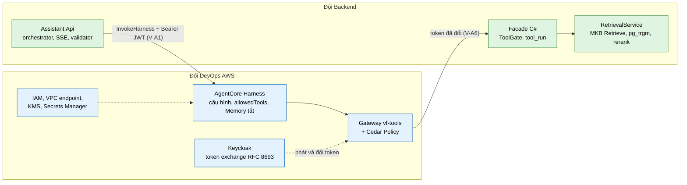
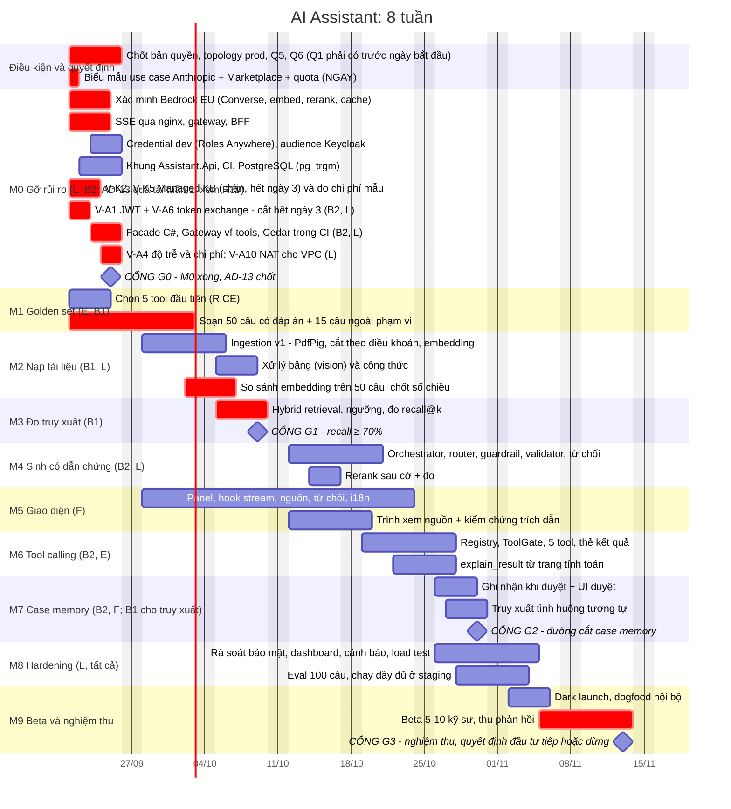
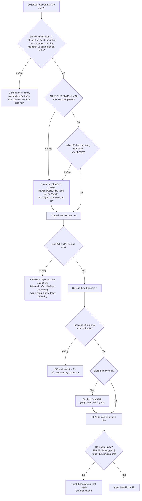
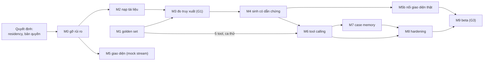

# 11 · Lộ trình 8 tuần, phân vai và cổng quyết định

> **Đã cập nhật trong `ship/`.** File này ghi lộ trình trước lượt rà soát 21/09/2026. Bản đã sửa: `ship/README.md`. Từ AD-28 (22/09/2026), case tự ghi khi engine tính đạt và không còn bước duyệt: xem `ship/12-tra-case.md`. Harness có lifecycle hook, nhưng ToolGate vẫn đặt ở facade: xem `ship/01-kien-truc.md` §8.5.

Ngày bắt đầu giả định: **thứ Hai 21/09/2026**, kết thúc **thứ Sáu 13/11/2026**. Đội tự ánh xạ sang lịch thực tế; mốc là **đơn vị công việc tuần tự** kết thúc bằng một thứ xem được và chạy được, không phải cam kết theo ngày.

---

## 1. Phân vai

| Vai | Người | Trách nhiệm chính |
| --- | --- | --- |
| **L — Lead / kiến trúc** | 1 | Quyết định kỹ thuật, gỡ vướng, hạ tầng AWS, IAM, CI/CD, review bảo mật; viết code ở `ILlmClient`, guardrail, chịu lỗi |
| **B1 — Backend AI (truy xuất)** | 1 | Ingestion, cắt đoạn, embedding, hybrid retrieval, rerank, bộ chạy eval |
| **B2 — Backend (orchestration)** | 1 | `ChatOrchestrator`, router, SSE, ToolGate/registry, case memory, quota, xác thực |
| **F — Frontend** | 1 | Panel AI, hook stream, thẻ kết quả, trình xem nguồn, luồng duyệt, i18n |
| **E — Kỹ sư kết cấu (bán thời gian)** | 1 | Golden set, chấm chất lượng, chọn tool, duyệt manifest, nghiệm thu, chủ sở hữu chuyên môn của tool |

Vai **E không phải tùy chọn**. Không có kỹ sư kết cấu thật tham gia, đội sẽ tự chấm bài của chính mình bằng cảm tính, và nghiệm thu không đáng tin.

### 1a. Ánh xạ sang hai đội: Backend và DevOps AWS

Bảng trên chia theo năng lực, giả định một đội 5 người và vai L ôm cả hạ tầng AWS. Nếu công ty tách thành **đội Backend** và **đội DevOps AWS**, phần việc chia như dưới. Ánh xạ này không đổi phạm vi, chỉ đổi người làm; **AD-13 làm ranh giới giữa hai đội trở nên chặt**, vì hai điều kiện cắt của tuần 1 nằm ở hai đội khác nhau.

**Sơ đồ 11.3 — Ranh giới hai đội ở một lượt tool**

**Đội DevOps AWS.** Trước ngày bắt đầu, chạy bốn lệnh gọi thử ở [06](06-tang-bedrock.md) §1 trên **tài khoản production** để biết đang vướng cổng nào, rồi gỡ theo thứ tự thời gian chờ giảm dần (R43): (1) thỏa thuận Marketplace cho Claude Sonnet 5 và Opus 5 — chờ lâu nhất, thông báo lỗi chỉ sang liên hệ AWS Sales, nên mở sớm nhất; (2) biểu mẫu use case của Anthropic cho Haiku 4.5 và Sonnet 4.6 — chờ khoảng 15 phút; (3) đọc hạn mức thật và nộp đơn tăng nếu thiếu — thường vài ngày. Cũng trước ngày bắt đầu: đưa Q1 (residency) tới pháp chế và lấy câu trả lời. Tuần 1 ngày 1 đến 3: bật **token exchange RFC 8693 trên Keycloak** và khớp audience (**V-A6**, điều kiện cắt của AD-13); tạo Harness với `CUSTOM_JWT` và `discoveryUrl` của Keycloak. Tuần 1 ngày 3 đến 5: dựng Gateway `vf-tools` với target OpenAPI tới facade (**tạo credential provider trước, target sau**; endpoint facade phải là HTTPS); viết Cedar Policy; nếu bật chế độ VPC thì dựng **NAT gateway** vì Harness kéo container từ ECR Public (V-A10); tách hai role `assistant-runtime` và `assistant-ingest` ([06](06-tang-bedrock.md) §7); **không cấp `InvokeAgentRuntimeCommand` cho bất kỳ ai** (API này chạy lệnh trực tiếp, bỏ qua LLM và `allowedTools`); bật CloudWatch Transaction Search cho tài khoản (không có nó thì V-A3 và V-A4 không đọc được số); dựng VPC endpoint `bedrock-runtime`, `bedrock-agent-runtime`, và thêm `ecr.dkr`, `ecr.api`, `s3` nếu Harness chạy chế độ VPC; chứng minh SSE chạy qua chuỗi thật không bị buffer. Hạ tầng nền: chốt PostgreSQL cho assistant theo Q4, cần `pg_trgm` và `unaccent` (mọi phiên bản RDS đều có, **không còn ràng buộc phiên bản** vì kho vector đã sang MKB); chốt topology production; tạo Guardrail và cấp `bedrock:ApplyGuardrail`; KMS cho CloudWatch Logs và Secrets Manager cho chuỗi kết nối; IAM Roles Anywhere nếu dev chạy ngoài AWS ([10](10-trien-khai.md) §3); đưa cấu hình Harness, Gateway và Cedar vào repo cùng **test đọc lại cấu hình sau mỗi lần triển khai** (R30); dashboard, cảnh báo, load test, runbook on-call ([10](10-trien-khai.md) §10).

**Đội Backend.** Tuần 1 ngày 1 đến 3: **V-A1**, gọi `InvokeHarness` từ .NET bằng Bearer JWT; SDK ký SigV4 nên khả năng cao phải viết `HttpClient` thô cộng bộ đọc event stream tự viết. Đây là phần khó đoán nhất của tuần 1 và là điều kiện cắt thứ hai của AD-13. Tuần 1 ngày 3 đến 5: dựng **facade C#** `/internal/tools/*` giữ toàn bộ ToolGate vì Harness không hỗ trợ hook (kiểm schema, biên tham số theo manifest, đơn vị, đọc `ApiResult.Code` vì `Forbidden` nằm trong body HTTP 200 mà Gateway và Cedar không thấy, đếm lặp theo `(toolUseId, tên tool, hash tham số)`, `ApplyGuardrail` lên chunk trước khi vào `toolResult`, ghi `tool_run`); chạy **V-A3** và **V-A4**; dựng lớp dịch stream Harness sang hợp đồng SSE ([02](02-assistant-service.md) §8, R33); khung `Assistant.Api`, CI và kết nối PostgreSQL. Phần còn lại giữ nguyên phân vai B1, B2 và F ở bảng trên.

**Ranh giới hay gây tranh cãi:**

| Việc | Chủ sở hữu | Ghi chú |
| --- | --- | --- |
| Token exchange trên Keycloak | DevOps | Backend phụ thuộc hoàn toàn, không tự làm được |
| Facade C# | Backend | DevOps chỉ lo đường mạng Gateway tới facade |
| Cedar Policy | DevOps viết, Backend review | Cedar không thấy body phản hồi nên phần kiểm còn lại vẫn ở facade |
| Cấu hình Harness | DevOps sở hữu, Backend nêu yêu cầu | Mặc định sai là R30 |
| Đo chi phí AgentCore | Chung | DevOps lấy vCPU-giờ và GB-giờ, Backend ghi vào `cost_per_request` |

**Điểm đồng bộ chặt nhất:** V-A1 (Backend) và V-A6 (DevOps) phải cùng đạt **hết ngày 3 (23/09)**. Hai việc này ở hai đội khác nhau và không việc nào thay thế được việc kia. Không đạt thì bỏ AgentCore, chạy vòng lặp C# ([04](04-tool-calling.md) §6), và phần lớn việc tuần 1 của DevOps (Gateway, Cedar, cấu hình Harness) thành bỏ đi — đó là cái giá đã biết trước của AD-13, ghi ở R39.

---

## 2. Biểu đồ Gantt

**Sơ đồ 11.1 — Gantt 8 tuần**

---

## 3. Cổng quyết định

Ngưỡng đặt **trước khi xây**, không phải lúc nghiệm thu. Không có ngưỡng định trước thì buổi nghiệm thu sẽ thành tranh luận cảm tính và ai to tiếng hơn sẽ thắng.

**Sơ đồ 11.2 — Các cổng và hành động khi không đạt**

### Tiêu chí nghiệm thu (G3)

| Tiêu chí | Ngưỡng | Loại |
| --- | --- | --- |
| Tỉ lệ tìm đúng (recall@k) trên golden set | ≥ 70% (khuyến nghị đặt mục tiêu ≥ 80%) | Kỹ thuật |
| Từ chối đúng các câu ngoài phạm vi | 15/15 | Kỹ thuật |
| Trích dẫn trỏ đúng tài liệu và trang | ≥ 90% số câu có dẫn chứng | Kỹ thuật |
| Số liệu tool khớp engine chạy độc lập | 100% (tất định) | Kỹ thuật |
| Cách ly tenant trong test tự động | 0 lỗi | Kỹ thuật, bảo mật |
| Prompt injection trong bộ đối kháng | Thành công < 1% trên bộ mô phỏng, không thực thi hành động ngoài ý muốn, phát hiện ≥ 90% mẫu tấn công (ngưỡng tham chiếu từ sách Enterprise GenAI; điều chỉnh khi có số đo thật) | Bảo mật |
| Thời gian tới chữ đầu tiên hỏi đáp tài liệu | p95 ≲ 3 giây (ghi nhận số thật nếu vượt) | Kỹ thuật |
| Kỹ sư beta nói sẽ dùng tiếp | ≥ 6/10 người | Người dùng |
| Tỉ lệ kỹ sư bấm Duyệt trên thẻ kết quả | Đo và báo cáo (chưa đặt ngưỡng) | Giá trị (case memory) |

**Chỉ số chặn đi kèm:** mọi mục tiêu chính đều phải có giới hạn cho tác dụng phụ. Ở đây: **tỉ lệ từ chối trên câu hỏi trong phạm vi không được vượt 30%**. Nếu tối ưu "không bao giờ sai" mà hệ thống từ chối gần hết thì nó vô dụng.

**Ba cột đều phải đạt:** khả thi kỹ thuật, có giá trị kinh doanh, và người dùng thật sự muốn dùng. Đạt 2 trên 3 là trượt.

**POC thất bại cũng là kết quả có giá trị**, miễn là biết thất bại ở đâu. Đó là lý do M1 và M3 tồn tại: chúng tách bạch "tìm kiếm kém" khỏi "mô hình trả lời kém", hai nguyên nhân cần hai cách sửa hoàn toàn khác nhau.

---

## 4. Phụ thuộc giữa các luồng công việc

**Sơ đồ 11.3 — Đường găng**

**Đường găng thực tế:** golden set (M1) và quyết định embedding (M2c). Cả hai phụ thuộc vào **con người (kỹ sư E) và dữ liệu thật**, không phụ thuộc code. Đây là lý do bắt đầu soạn golden set từ ngày đầu tiên và xác nhận bản quyền tiêu chuẩn trong tuần 1.

**Song song hóa:** frontend làm việc với **luồng SSE giả (mock server)** từ tuần 2, bám hợp đồng sự kiện ở [02](02-assistant-service.md) §6, nên không chờ backend.

---

## 5. Công việc theo tuần

| Tuần | Trọng tâm | Kết quả xem được / chạy được |
| --- | --- | --- |
| 1 | M0, khởi động M1 | Một lệnh gọi thật tới Sonnet 5 EU và embedding; SSE chạy qua chuỗi thật; khung service + CI; **một lượt tool chạy hết đường Harness → Gateway → facade với danh tính người dùng thật**; **AD-13 quyết hết ngày 3 (23/09), G0 ngày 25/09 ghi nhận** |

> **Tuần 1 quá tải (R39).** Sau AD-13 và AD-17, tuần 1 có chín việc chạy song song cho hai người (L và B2): 8 xác minh Bedrock, V-K1 và đo chi phí mẫu, SSE qua chuỗi thật, khung service và CI, bốn kiểm chứng AgentCore, cùng facade, Gateway và Cedar. Thứ tự ưu tiên khi vỡ: (1) V-A1 và V-A6, (2) 8 xác minh Bedrock và SSE, (3) facade và Gateway, (4) khung service và CI. Nếu V-A1 hoặc V-A6 không đạt hết ngày 3 thì m0g bị hủy, không lùi, và hai ngày còn lại của tuần dồn cho khung service và CI.
| 2 | M1, M2 | Golden set 50 câu; 20–30 tài liệu **thật** đã nạp; truy vấn được từ dòng lệnh |
| 3 | M3 | Số recall@k theo nhóm câu; **G1** |
| 4 | M4 | 50 câu chạy hết; 15 câu ngoài phạm vi đều bị từ chối đúng (orchestrator hoàn tất đầu tuần 5 theo Gantt; M6 khởi động đầu tuần 5, từ 19/10) |
| 5 | M6, M5 | Tool nhóm B chạy trong hội thoại; thẻ kết quả; nút Hỏi AI |
| 6 | M7, khởi động M8 | Ghi nhận case khi duyệt; truy xuất tình huống (B1 làm phần truy xuất song song với B2 làm ghi nhận, dùng lại hạ tầng hybrid); **G2 vào 30/10**, là chỗ cắt nếu trượt |
| 7 | M8, M9a | Rà soát bảo mật; dashboard; eval 100 câu; dark launch |
| 8 | M9b | Beta 5–10 kỹ sư; báo cáo nghiệm thu; **G3** |

---

## 6. Quy tắc quản lý phạm vi

- Khi có người đề nghị thêm việc: hỏi **"thiếu cái này thì có chứng minh được giá trị không?"** Nếu vẫn chứng minh được, nó thuộc giai đoạn sau.
- **Đóng băng phạm vi ở cuối tuần 6.** Tuần 7–8 chỉ hardening, sửa lỗi và beta.
- Mọi thay đổi đụng tới prompt, retrieval, tool, model phải qua eval ([09](09-eval-quan-sat.md) §3). Không có ngoại lệ "sửa nhanh".
- Cuộc họp 15 phút mỗi ngày; **review số liệu eval mỗi thứ Sáu** (đưa số vào lịch sử để thấy xu hướng, không chỉ thấy pass/fail).

---

## 7. Sau 8 tuần: thứ tự bổ sung

Mỗi bước chỉ làm khi bước trước đã chạm trần và eval chứng minh cần:

1. Cải thiện truy xuất theo dữ liệu beta (chunk, ngưỡng, từ điển thuật ngữ)
2. Mở rộng số tool nhóm A/B theo RICE
3. Xem xét MCP dùng chung nếu có nhiều client cần dùng tool. Gateway `vf-tools` và Policy (Cedar) đã có từ POC (AD-13), nên phần còn lại chỉ là mở cho client khác. Nếu G0 đã rơi về vòng lặp C# thì đây là hạ tầng mới phải dựng
4. Tool nhóm C (ghi dữ liệu) với xác nhận nêu rõ nội dung thao tác
5. Tầng chịu lỗi đầy đủ (đa vùng) khi cam kết mức sẵn sàng
6. Câu hỏi đa phương thức (ảnh bản vẽ, sơ đồ)

---

## 8. Chỉ số thành công (OKR)

Theo sách Building AI-Powered Products: một North Star, ít nhất một chỉ số từ mỗi nhóm (sức khỏe sản phẩm, sức khỏe hệ thống, chỉ số đại diện cho AI) và luôn có một chỉ số chặn tác dụng phụ. Ngưỡng ở §3 chính là **chất lượng tối thiểu chấp nhận được** (MVQ), được đặt trước khi xây, không phải lúc tranh luận ra mắt.

| Vai trò | Chỉ số | Mục tiêu beta |
| --- | --- | --- |
| **North Star** | Tỉ lệ câu trả lời được kỹ sư đánh giá Tốt hoặc dùng tiếp (Duyệt, mở nguồn) trên tổng lượt hỏi trong phạm vi | Đặt sau tuần đầu beta khi có đường cơ sở; ghi ngưỡng trước khi mở rộng |
| Sức khỏe sản phẩm | Số kỹ sư dùng lại trong tuần kế tiếp; số lượt hỏi/kỹ sư/tuần | ≥ 6/10 nói sẽ dùng tiếp |
| Sức khỏe hệ thống | Thời gian tới chữ đầu tiên p95; tỉ lệ lỗi; tỉ lệ fallback | p95 ≲ 3 giây; lỗi < 1% |
| Đại diện cho AI | recall@k, tỉ lệ trích dẫn hợp lệ, tỉ lệ `unverified`, số khớp engine | Theo §3 |
| **Chỉ số chặn** | Tỉ lệ từ chối trên câu hỏi trong phạm vi | ≤ 30% |

Không có chỉ số chặn thì North Star đang được tối ưu bằng một cái giá ẩn.

**Mục tiêu chất lượng production sau beta (tham chiếu ví dụ của sách Hands-On RAG, điều chỉnh khi có số đo thật):** context precision ≥ 0,9; context recall ≥ 0,8; tỉ lệ ảo giác ≤ 0,05; answer relevance ≥ 0,9; đo trực tuyến trên mẫu 5–10% lượt hỏi ([09](09-eval-quan-sat.md) §8).

---

## 9. Yêu cầu và trách nhiệm: MoSCoW, RACI, truy vết

Ba công cụ giải ba lỗi khác nhau: MoSCoW chống phình phạm vi, RACI chống mơ hồ người chịu trách nhiệm, RTM chống kiểm thử không truy vết được tới yêu cầu.

**MoSCoW cho 8 tuần**

| Mức | Hạng mục |
| --- | --- |
| Must | Hỏi đáp có dẫn chứng; từ chối đúng; ToolGate; cách ly tenant; guardrail; eval và cổng CI; kill switch |
| Should | Tool nhóm B (5 tool); giải thích kết quả tại chỗ; ghi nhận case khi duyệt; rerank sau cờ |
| Could | Truy xuất case tương tự; chỉnh tham số và tính lại; chunk cấp tài liệu |
| Won't (giai đoạn này) | Tool nhóm C; multi-agent; fine-tuning; câu hỏi ảnh bản vẽ; semantic cache; áp kết quả vào form |

**RACI** (R chịu trách nhiệm thực hiện, A chịu trách nhiệm cuối cùng, C được tham vấn, I được thông báo)

| Việc | L | B1 | B2 | F | E | DPO/Pháp lý | Quản trị AWS |
| --- | --- | --- | --- | --- | --- | --- | --- |
| Quyết định residency, bản quyền | A | I | I | I | C | R | C |
| Golden set và chấm chất lượng | I | R | I | I | A | I | — |
| Ingestion và chỉ mục | A | R | I | — | C | C | — |
| Tool registry và manifest | A | I | R | I | R (duyệt chuyên môn) | — | — |
| Guardrail, IAM, mạng | A, R | I | C | — | — | C | R |
| Giao diện và i18n | C | — | C | A, R | C | — | — |
| Retention và xử lý dữ liệu cá nhân | C | I | R | I | — | A | — |
| Nghiệm thu G3 | A | R | R | R | R | C | I |

**RTM rút gọn** (yêu cầu → kiểm thử → cổng)

| Yêu cầu | Kiểm thử | Cổng |
| --- | --- | --- |
| P2: LLM không tự tính số | `NumberValidator`; số tool khớp engine (Tầng 1) | CI, G3 |
| P3: không dẫn chứng thì từ chối | Nhóm B 15/15 | CI, G3 |
| Trích dẫn đúng | Tầng 1 và giám khảo Tầng 2 | G3 (≥ 90%) |
| Cách ly tenant | Test chéo tenant, nhóm eval G | CI, G3 (0 lỗi) |
| Chịu lỗi Bedrock | Chaos test: throttling, ngắt luồng, breaker | G2 |
| Hạn mức và rate limit | Test thứ tự middleware | CI |

---

## 10. POC 4 tuần (theo tiêu chí "tối đa 1 tháng")

Tài liệu cuộc họp yêu cầu POC hoàn thành tối đa 1 tháng, chốt ngày bắt đầu và hạn nghiệm thu. Lịch 8 tuần ở §2 là bản đầy đủ (POC mở rộng đến beta). Bản 4 tuần dưới đây là **bản nén**: cùng kiến trúc, nhưng M4, M5 và M6 của Gantt (khoảng 3 tuần, kết thúc sau ngày nghiệm thu đề xuất) bị nén vào tuần 4 với phạm vi hẹp. Vì vậy POC chỉ **hứa** yêu cầu 1 và 2; yêu cầu 3 và 4 là demo có điều kiện.

**Ngày đề xuất (chờ chốt):** bắt đầu thứ Hai 21/09/2026; nghiệm thu thứ Sáu 16/10/2026.

| Tuần | Nội dung | Yêu cầu phủ |
| --- | --- | --- |
| 1 | M0 gỡ rủi ro, V-K2..V-K5 (Managed KB, chặn) và đo chi phí mẫu; **V-A1, V-A3, V-A4, V-A6 và dựng facade + Gateway + Cedar (AD-13)**; khởi động golden set; nạp thử tài liệu | Nền tảng |
| 2 | Nạp tiêu chuẩn và tài liệu hướng dẫn VF; golden set 50 câu | 1, 2 |
| 3 | Truy xuất lai, đo recall; **G1**; khởi động Main API endpoint kết quả dự án | 1, 2 |
| 4 | Sinh câu trả lời có trích dẫn, giao diện tối thiểu, 1 đến 2 tool đọc và 1 tool tính toán cho một module; demo | 1, 2, 3 và 4 ở mức hẹp |

**Tiêu chí nghiệm thu POC** (tập con của G3): recall@k ≥ 70% ở G1; 15/15 câu ngoài phạm vi bị từ chối; trích dẫn đúng ≥ 90%; số của tool khớp engine 100% cho tool được demo; yêu cầu 1 và 2 có kịch bản demo chạy được; yêu cầu 3 và 4 chỉ vào tiêu chí nghiệm thu nếu các điều kiện ở bảng điều chỉnh bên dưới (endpoint của Main API xác nhận trước hết ngày 3, G1 đạt, có người ký manifest) được thỏa, nếu không chúng được ghi trong biên bản nghiệm thu là "ngoài phạm vi POC"; `cost_per_request` và p95 chữ đầu tiên **được đo và báo cáo** (không đặt ngưỡng ở POC).

**Cắt phạm vi:** nếu G1 trượt ở tuần 3, yêu cầu 3 và 4 bị bỏ khỏi POC, tuần 4 chỉ sửa truy xuất và POC chỉ chứng minh yêu cầu 1 và 2. Yêu cầu 4 ở mức demo cho **một** module có tool tính toán.

**Điều kiện để bản nén này khả thi:** kỹ sư E có mặt từ tuần 1 và có một kỹ sư kết cấu có thẩm quyền ký manifest (chưa có thì yêu cầu 4 không vào POC); Q2 và Q5 được trả lời trong tuần 1; Main API có (hoặc thêm được) endpoint đọc kết quả theo dự án và cấu kiện; đội đủ 5 người như giả định. Nếu thiếu một điều kiện, bốn yêu cầu trong 4 tuần **không** được coi là khả thi (R35).

**AgentCore trong bản nén (AD-13).** Bản nén dùng cùng kiến trúc với bản 8 tuần, nên vòng lặp tool cũng là Harness. Nhưng tuần 1 của bản nén đã kín việc, và AD-13 thêm vào đó ba hạ tầng mới (facade C#, Gateway `vf-tools`, Cedar Policy) cùng một lớp dịch stream (R39). Quy tắc giữ lịch, áp dụng cho **cả bản nén lẫn bản 8 tuần**: **V-A1 và V-A6 phải đạt hết ngày 3 (23/09)**; chưa đạt thì bỏ AgentCore và chạy vòng lặp C# ([04](04-tool-calling.md) §6) ngay, không chờ tới G0. Cổng G0 ngày 25/09 chỉ ghi nhận quyết định đó và kiểm V-A4; V-A4 ngoài ngân sách thì cũng bỏ AgentCore tại G0. Việc dựng facade và Gateway giao cho B2 (SSE và khung service của B2 lùi xuống ưu tiên hai trong hai ngày đầu) và L làm phần IAM, Gateway, Cedar.

### Điều chỉnh sau phản biện của subagent Opus

| Điểm | Quy tắc |
| --- | --- |
| Endpoint kết quả theo dự án và cấu kiện | Xác nhận với chủ Main API **trước hết ngày 3**. Chưa xác nhận được thì bỏ yêu cầu 3 và 4 khỏi POC ngay, không đợi đến G1 |
| Chốt embedding sớm hơn | E soạn **20 câu đầu tiên của golden set 50 câu** (không phải một bộ thêm) trước 28/09 để chốt embedding sớm; m2a chạy trên tài liệu thử vứt được cho tới khi chốt. Bộ 50 câu (02/10) dùng để xác nhận lại |
| Đo mô hình trả lời | Cùng 20 câu đó dùng để so Sonnet 5, Sonnet 4.6 và Haiku 4.5 cho `doc_qa` theo chất lượng và chi phí mỗi lượt trước G1; mô hình rẻ hơn đạt chất lượng thì đổi mặc định (đòn bẩy chi phí lớn nhất) |
| Phân bổ việc tuần 1 | L: Q1, Q2, Q4 với công ty; xác minh Bedrock; xin quota; V-K2..V-K5 và đo chi phí mẫu. B2: SSE qua nginx, gateway, BFF; khung `Assistant.Api` và CI. B1: script nạp thử và so sánh embedding. E: golden set và mini-set. F: panel với luồng SSE giả |
| Việc ngày 1 và 2 | Điền đơn giá thật của các mô hình vào công thức ([06](06-tang-bedrock.md) §10); chạy V-K2 đến V-K5; đo `cost_per_request` trên khoảng 20 lượt mẫu. Chưa có mẫu số thì chưa hứa tiêu chí chi phí |
| Q1 trước ngày bắt đầu | Q1 (residency) phải có câu trả lời **trước ngày bắt đầu**; chưa có thì lùi ngày, không lùi phạm vi ([06](06-tang-bedrock.md) §11). Với AD-13 điều này càng chặt: kiểm chứng AgentCore chạy ngay ngày 1 nên tuần 1 không còn chỗ chờ Q1 |
| AD-13 trong bản nén | Ba hạ tầng mới (facade, Gateway, Cedar) vào tuần 1 (R39). V-A1 và V-A6 không đạt hết ngày 3 (23/09) thì bỏ AgentCore ngay; G0 ngày 25/09 ghi nhận và kiểm V-A4 |

**Điều nên hứa với khách hàng ở POC:**

| Yêu cầu | Mức hứa |
| --- | --- |
| 1 và 2 (tra tiêu chuẩn, hướng dẫn dùng VF) | Nghiệm thu được bằng số: recall ≥ 70%, trích dẫn ≥ 90%, 15/15 câu ngoài phạm vi bị từ chối |
| 3 (kết quả của đúng dự án và cấu kiện) | **Có điều kiện:** phụ thuộc endpoint của đội Main API |
| 4 (gợi ý phương án) | **Kịch bản demo cho một module**, không phải năng lực sản phẩm |
