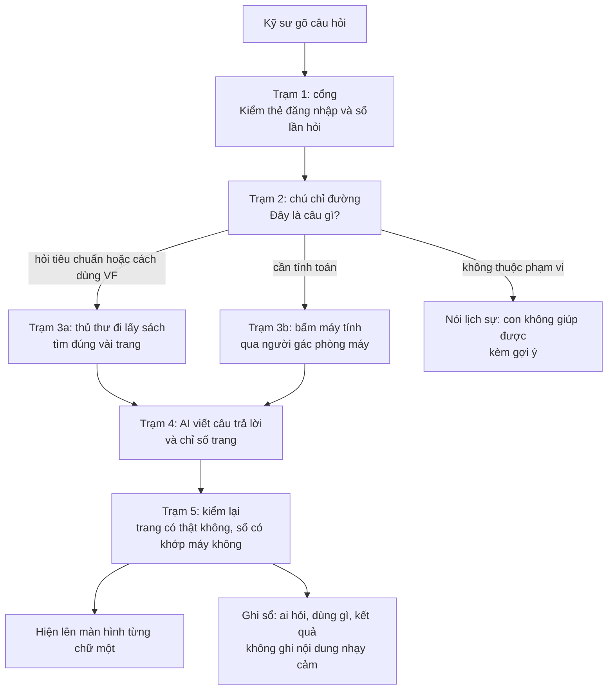

# 14 · Giải thích cho người mới (bé 5 tuổi cũng hiểu)

Tài liệu này giải thích **mọi công nghệ và thuật ngữ** trong bộ tài liệu kiến trúc bằng lời đời thường và ví von. Đọc từ trên xuống là thấy toàn cảnh; hoặc tra bảng chữ cái ở cuối.

**Quy ước:** nếu tài liệu này khác với các tài liệu 00 đến 13, thì **00 đến 13 đúng**. Tài liệu này chỉ để hiểu, không quyết định gì. Cột “Trong dự án này” chỉ chỗ dùng thật, kèm liên kết để đào sâu.

---

## 1. Câu chuyện lớn: một cô thủ thư thông minh

Hãy tưởng tượng một **thư viện của trường kỹ thuật**. Các anh chị kỹ sư đến hỏi bài. Ở quầy có một **cô thủ thư rất thông minh** (đó là AI). Cô đọc rất nhanh, nhưng đôi khi **nhớ nhầm** và bịa ra điều nghe hợp lý. Nên nhà trường đặt ra luật để cô làm việc an toàn.

| Trong câu chuyện | Ngoài đời của dự án | Vì sao có |
| --- | --- | --- |
| Kệ sách | Kho tài liệu: tiêu chuẩn, quy trình, hướng dẫn dùng phần mềm | Nơi cô lấy sách |
| Cô thủ thư | AI (Claude trên Bedrock) | Đọc, tóm tắt, giải thích |
| Cô lấy sách rồi mới trả lời, chỉ số trang | RAG và trích dẫn | Để khỏi bịa |
| **Máy tính bỏ túi của trường** | Engine tính toán của VF | Máy tính đúng tuyệt đối; **cô không tự tính, chỉ bấm máy** |
| Phiếu “xin bấm máy” | Tool calling | Cách cô nhờ máy |
| Người gác phòng máy, kiểm phiếu | ToolGate | Không cho bấm sai |
| Cô bảo vệ ở cổng | Guardrails | Chặn chuyện không nên |
| Thẻ học sinh | Token đăng nhập (Keycloak) | Biết ai đang hỏi |
| Thẻ chỉ ghi “được vào phòng nào” | Quyền theo organization và dự án | Không ai đọc sổ của lớp khác |
| Cuốn sổ “bài tương tự đã làm” | Case memory | Chỉ ghi những gì thầy đã duyệt |
| Camera và sổ ai-làm-gì | Log, trace, audit | Sự cố thì biết chuyện gì đã xảy ra |
| Cô trợ lý có sẵn quy trình do công ty khác cho thuê | AgentCore Harness | Lo hộ vòng lặp “nghĩ, bấm máy, nghĩ tiếp” |

**Quy tắc vàng của cả dự án:** *AI giải thích, máy tính tính, người quyết định.* AI **không bao giờ** tự tính số liệu kết cấu và **không bao giờ** tự ghi vào hồ sơ chính thức.

---

## 2. Đường đi của một câu hỏi

**Sơ đồ 14.1 — Một câu hỏi đi qua các trạm**

**Kể lại bằng lời:**

1. **Cổng.** Kỹ sư đưa thẻ đăng nhập. Hệ thống kiểm thẻ còn hạn không, người này được xem tài liệu nào, hôm nay đã hỏi quá nhiều chưa.
2. **Chú chỉ đường.** Câu hỏi “điều kiện áp dụng của điều 6.2.2 là gì?” đi quầy sách. Câu hỏi “dầm này chịu được bao nhiêu?” đi quầy máy tính. Câu ngoài lề như “ăn trưa món gì?” bị từ chối lịch sự.
3. **Lấy sách.** Thủ thư tìm bằng hai cách cùng lúc (theo ý nghĩa và theo từ khóa), gộp lại, xếp lại và chỉ giữ vài trang đạt điểm. Không trang nào đạt thì **nói không biết**, không đoán.
4. **Bấm máy.** Nếu cần tính, AI viết phiếu “tính dầm này với các số này”. Người gác kiểm phiếu, máy của VF tính, trả kết quả.
5. **Viết.** AI viết câu trả lời dựa **chỉ** vào những trang và kết quả đã có.
6. **Kiểm lại.** Máy kiểm từng số trong lời văn có đúng là số máy tính ra không, từng trích dẫn có thật không. Sai thì gắn nhãn “chưa kiểm chứng”.
7. **Ghi sổ.** Ai hỏi, lúc nào, dùng công cụ nào, tốn bao nhiêu tiền.

---

## 3. Từ điển theo nhóm

### 3.1. AI là gì và nói chuyện với AI thế nào

Phần này giải thích “bộ não” mà cả hệ thống dựa vào.

| Thuật ngữ | Giải thích như cho bé 5 tuổi | Trong dự án này |
| --- | --- | --- |
| **AI (trí tuệ nhân tạo)** | Chương trình máy tính làm được những việc mà bình thường phải có người nghĩ, như đọc, viết, trả lời. | Ở đây AI là “cô thủ thư thông minh” trả lời câu hỏi về tiêu chuẩn và về phần mềm VF. |
| **Mô hình (model)** | Một “bộ não” đã học sẵn từ rất nhiều sách. Mình không tự dạy nó, mình thuê nó làm việc. | Claude Sonnet 5, Claude Haiku 4.5… chạy trên dịch vụ Bedrock của AWS ([06](06-tang-bedrock.md) §1). |
| **LLM (mô hình ngôn ngữ lớn)** | Bộ não chuyên đoán “chữ tiếp theo” rất giỏi, nên viết được cả đoạn văn nghe như người. | Mọi mô hình Claude dùng trong dự án đều là LLM. |
| **Token** | AI không đọc từng chữ mà đọc từng “miếng” nhỏ: một chữ ngắn, nửa chữ dài, hoặc một dấu. Người ta đếm số miếng để tính tiền. | Tiền, hạn mức và độ dài câu trả lời đều tính bằng token ([06](06-tang-bedrock.md) §9, [07](07-auth-bao-mat.md) §5). |
| **Prompt (lời dặn)** | Tờ giấy ghi câu hỏi và lời dặn đưa cho AI trước khi nó trả lời. | Gồm câu hỏi của kỹ sư, các đoạn tài liệu tìm được và luật của hệ thống. |
| **System prompt (nội quy)** | Tờ nội quy dán ở bàn thủ thư: “con là trợ lý kết cấu, nói trang trọng, không biết thì nói không biết”. | Nằm trong kho mã, có đánh số phiên bản ([10](10-trien-khai.md) §7). |
| **Context window (cửa sổ ngữ cảnh)** | Kích cỡ cái bàn: AI chỉ trải ra đọc được bấy nhiêu chữ cùng một lúc. | Vì thế chỉ đưa vài đoạn tài liệu liên quan, không đưa cả thư viện. |
| **Ảo giác (hallucination)** | AI bịa ra điều nghe rất hợp lý nhưng sai, giống bé kể “hôm qua con thấy khủng long ở sân trường”. | Là lý do phải dẫn nguồn, kiểm lại số và để engine tính, không để AI tự tính. |
| **Nhiệt độ (temperature)** | Nút chỉnh độ “bay bổng”: thấp thì nói chắc chắn và giống nhau mỗi lần, cao thì sáng tạo và hay đổi. | Đường hỏi đáp dùng nhiệt độ thấp (khởi điểm 0 đến 0,2). |
| **Suy luận thích ứng (adaptive thinking)** | AI nghĩ thầm một lúc trước khi nói. Nghĩ nhiều thì đúng hơn nhưng chậm hơn và tốn tiền hơn. | Sonnet 5 bật sẵn; dự án tắt tường minh ở đường hỏi đáp ([06](06-tang-bedrock.md) §1). |
| **Fine-tuning (dạy thêm)** | Cho bộ não học thêm một cuốn sách riêng để nó thuộc lòng. Tốn công, tốn tiền, và khó cập nhật. | Không làm: dùng RAG để tra sách mỗi lần, vừa rẻ vừa dẫn được nguồn. |
| **Đa phương thức / vision** | AI nhìn được cả ảnh chứ không chỉ đọc chữ. | Dùng cho các trang có bảng khó đọc. Ảnh chụp màn hình trong tài liệu hướng dẫn nằm ngoài POC. |
| **Sycophancy (nịnh)** | AI hùa theo người hỏi dù người đó nói sai, như bạn nào cũng “ừ ừ đúng rồi”. | Phải thử ở đánh giá; nội quy dặn không đồng ý bừa ([08](08-ux.md) §11). |
| **Structured output (đầu ra có cấu trúc)** | Bắt AI trả lời theo mẫu điền ô, không viết tự do. | Dùng khi phân loại ý định bằng Haiku; Sonnet 5 không hỗ trợ ([06](06-tang-bedrock.md) §1). |

### 3.2. Tìm tài liệu đúng (RAG)

RAG là “thủ thư đi lấy sách trước, rồi mới trả lời”. Phần này là lõi của hệ thống.

| Thuật ngữ | Giải thích như cho bé 5 tuổi | Trong dự án này |
| --- | --- | --- |
| **RAG (tìm rồi mới trả lời)** | Thay vì đoán bừa, thủ thư chạy tới kệ, lấy vài trang đúng, đọc, rồi trả lời và chỉ số trang. | Luồng chính của hỏi đáp tiêu chuẩn ([03](03-rag.md)). |
| **Kho tài liệu** | Các kệ sách: tiêu chuẩn, quy trình nội bộ, hướng dẫn dùng phần mềm. | Nằm trong S3 (tệp gốc) và PostgreSQL (bản đã cắt nhỏ). |
| **Chunk (đoạn)** | Cắt cuốn sách thành các mảnh nhỏ, mỗi mảnh có nhãn “từ sách nào, trang mấy”, để tìm cho nhanh. | Khởi điểm 800 ký tự, nhưng ranh giới điều khoản được ưu tiên hơn số ký tự ([03](03-rag.md) §1). |
| **Overlap (chồng lấn)** | Hai mảnh liền nhau chồng lên nhau một chút, để câu nằm ở chỗ cắt không bị đứt đôi. | 15%. |
| **Cắt theo cấu trúc** | Cắt theo chương, mục, điều khoản như người đọc, không cắt ngang câu. | Điều khoản và điều kiện biên đi cùng nhau. |
| **Ghép bảng nhiều trang** | Một bảng dài qua hai trang thì dán lại thành một bảng. | Bảng lưu dạng có tiêu đề cột để không mất nghĩa. |
| **Chunk con trỏ** | Một mảnh chỉ ghi “xem bảng ở trang 45”, giúp tìm ra bảng dù bảng tự nó ít chữ. | [03](03-rag.md) §1. |
| **Mở rộng hàng xóm** | Tìm được một mảnh thì lấy luôn mảnh liền trước và liền sau cho đủ ý. | Neighbor ±1, mảnh trúng đích được đánh dấu. |
| **Embedding (bản đồ ý nghĩa)** | Biến mỗi mảnh chữ thành một dãy số, như tọa độ trên bản đồ: mảnh nói về cùng ý thì đứng gần nhau. | Cohere Embed v4 hoặc Titan V2, chốt bằng phép đo ([00](00-tong-quan.md) AD-06). |
| **Vector** | Chính dãy số tọa độ đó. | Lưu trong PostgreSQL. |
| **Số chiều** | Bản đồ có bao nhiêu hướng đi: nhiều hướng thì mô tả kỹ hơn nhưng nặng hơn. | Chốt trước lần nạp đầu; đổi sau là phải làm lại cả kho ([03](03-rag.md) §4). |
| **Cosine similarity (độ giống)** | Hai mũi tên chỉ cùng hướng thì giống nhau. Đo góc giữa hai mũi tên. | Cách so hai vector. |
| **Vector database** | Tủ chuyên cất và tìm nhanh các tọa độ. | Ở đây **không tự dựng tủ nào**: Bedrock Managed Knowledge Base giữ hộ (AD-17). |
| **pgvector** | Tiện ích cắm thêm cho PostgreSQL để nó biết lưu và tìm vector. **Không dùng nữa** kể từ AD-17: kho vector nằm ở Managed Knowledge Base. | [00](00-tong-quan.md) AD-04, AD-12. |
| **HNSW** | Mạng đường tắt giữa các điểm để đi tìm hàng xóm gần nhất không phải hỏi từng nhà. | MKB dùng loại chỉ mục nào là hộp đen, **ta không đặt tham số** ([03](03-rag.md) §2a). |
| **Index (chỉ mục)** | Mục lục cuối sách để tìm nhanh mà không lật từng trang. | Có chỉ mục vector, chỉ mục từ khóa, chỉ mục trigram. |
| **Full-text search (tìm theo từ khóa)** | Tìm đúng chữ như Ctrl+F, giỏi khi cần tìm đúng số hiệu như “6.2.2”. | Dùng `tsvector` với `fr_unaccent` cho tiếng Pháp; câu hỏi tiếng Anh dùng cấu hình `english` riêng (R42). |
| **Bỏ dấu (unaccent)** | Coi “é” và “e” là một khi tìm kiếm. | Áp dụng cho tiếng Pháp, vì người dùng hay gõ thiếu dấu. |
| **Trigram (pg_trgm)** | Bẻ chữ thành từng cụm ba chữ cái để tìm được cả khi gõ sai một chút. | Nhánh thứ ba của tìm kiếm lai. |
| **Hybrid search (tìm lai)** | Dùng cả hai cách: tìm theo ý nghĩa (bản đồ) và tìm theo chữ (Ctrl+F), rồi gộp kết quả. | Vector, từ khóa, trigram ([03](03-rag.md) §2). |
| **RRF (gộp hạng)** | Ba bạn xếp hạng bài hay, mỗi bạn một danh sách; ai được nhiều bạn xếp cao thì lên đầu. | Hằng số k = 60, lấy 40 mảnh đầu. |
| **Rerank (xếp lại)** | Một giám khảo thứ hai đọc kỹ từng mảnh ứng viên và xếp lại cho đúng thứ tự. | Bedrock Rerank, bật sau cờ tính năng, chỉ giữ nếu thật sự tăng chất lượng. |
| **Top-k** | Chỉ lấy k mảnh đứng đầu. | Khởi điểm 40 sau RRF. |
| **Ngưỡng (threshold)** | Điểm sàn: mảnh nào giống quá ít thì bỏ, không đem ra trả lời. | Khởi điểm 0,7; nếu không mảnh nào đạt thì hệ thống từ chối thay vì đoán. |
| **Recall@k (tìm đủ)** | Trong 10 trang đáng lẽ phải lấy, thủ thư lấy được mấy trang? Tìm đủ là quan trọng hơn thừa. | Cổng G1: ≥ 70% ([11](11-lo-trinh.md) §3). |
| **Precision (tìm đúng)** | Trong những trang thủ thư lấy, có bao nhiêu trang thật sự đúng? | Với từ chối thì ưu tiên chính xác ([09](09-eval-quan-sat.md) §9). |
| **nDCG** | Điểm chấm chất lượng xếp hạng: trang đúng nhất đứng đầu thì điểm cao. | Đo chất lượng xếp hạng ở đánh giá. |
| **Citation (trích dẫn)** | Ghi rõ “lấy ở sách nào, trang mấy” để người đọc mở ra kiểm. | Bấm được, mở đúng trang và tô sáng đoạn ([08](08-ux.md) §4). |
| **Bounding box (khung tô sáng)** | Cái khung hình chữ nhật đánh dấu đúng chỗ trên trang. | Lưu cùng chunk để tô sáng khi bấm trích dẫn. |
| **Parser (bộ đọc tệp)** | Máy đọc tệp PDF và lấy chữ ra. | PdfPig cho PDF; bảng khó thì dùng vision. |
| **OCR** | Đọc chữ trong ảnh chụp trang giấy. | Cần khi tài liệu là bản quét. |
| **Staged → active (chờ → chạy thật)** | Sách mới để ở kệ “chờ duyệt”, qua kiểm tra mới được đưa lên kệ chính. | Ngăn một tài liệu lỗi làm hỏng cả kho ([03](03-rag.md) §1). |
| **Idempotent (làm lại không hỏng)** | Bấm nút hai lần cũng chỉ ra một kết quả, như bật công tắc đã bật. | Chạy lại một lần nạp tài liệu không tạo bản sao. |
| **Hash sha256 (dấu vân tay tệp)** | Mỗi tệp có một dãy ký tự riêng; tệp đổi một chữ thì dãy đổi hẳn. | Tệp không đổi thì không cần nhúng lại, tiết kiệm tiền. |
| **Provenance (lai lịch)** | Ghi rõ tài liệu từ đâu, ai nạp, khi nào. | Lưu cùng tài liệu để chứng minh với kiểm toán. |
| **Immutable (không sửa đè)** | Bản gốc cất kỹ, chỉ thêm bản mới, không xóa hay đè lên bản cũ. | Tệp gốc ở S3 bật versioning. |
| **Quét mã độc** | Cô bảo vệ soi túi trước khi cho sách vào thư viện. | Tệp tải lên phải quét; dịch vụ cụ thể chưa xác minh ([12](12-rui-ro.md) §4). |
| **scope_key (nhãn quyền đọc)** | Mỗi trang sách gắn nhãn “ai được đọc”, và lúc tìm chỉ lấy trang có nhãn hợp với người hỏi. | Lọc theo organization và dự án ([07](07-auth-bao-mat.md) §1). |
| **doc_type (loại tài liệu)** | Nhãn phân kệ: tiêu chuẩn, quy trình, hướng dẫn phần mềm. | Câu hỏi dùng phần mềm chỉ tìm ở kệ hướng dẫn ([03](03-rag.md) §6). |
| **Phân vùng (partition)** | Chia kệ lớn thành nhiều kệ nhỏ theo nhãn để tìm khỏi sót. | Phương án dự phòng khi lọc quyền làm tìm thiếu (R22). |
| **Elasticsearch / OpenSearch** | Những “máy tìm kiếm” chuyên dụng, mạnh và to, thường phải thuê và trông coi riêng. | Không dùng: PostgreSQL đã đủ tìm ý nghĩa và từ khóa, nên bớt một thứ phải vận hành ([00](00-tong-quan.md) AD-04). |

### 3.3. AI biết “bấm máy” (công cụ và tác tử)

AI không tự tính. Nó gọi máy tính của công ty. Phần này giải thích ai gọi ai.

| Thuật ngữ | Giải thích như cho bé 5 tuổi | Trong dự án này |
| --- | --- | --- |
| **Tool calling (gọi công cụ)** | AI không tự làm mà nói “nhờ máy tính bấm giúp con phép này”, rồi đọc kết quả máy trả về. | Mọi phép tính đều do engine của VF làm ([04](04-tool-calling.md)). |
| **Engine tính toán** | Cái máy tính bỏ túi chính xác của công ty, đã được kỹ sư kiểm. | Nằm trong Main API của VF; AI không thay được. |
| **Tool (công cụ)** | Một nút bấm trên máy: “tính dầm chịu uốn”, “tra thông số cấu kiện”. | Khoảng 5 tool đầu, chọn bằng RICE. |
| **toolUse / toolResult** | Phiếu AI viết “xin bấm nút này với các số này” và phiếu máy trả lời kết quả. | Hai loại khối nội dung trong Converse. |
| **Agent (tác tử)** | AI được phép tự chọn nút để bấm và làm vài bước liên tiếp để hoàn thành việc. | Chỉ dùng khi câu hỏi cần tính toán; hỏi đáp tài liệu là đường cố định. |
| **Vòng lặp agent** | Nghĩ → bấm nút → xem kết quả → nghĩ tiếp… cho tới khi xong hoặc hết số vòng cho phép. | Tối đa 5 vòng và 60 giây; riêng lượt gợi ý phương án 7 vòng và 90 giây ([04](04-tool-calling.md) §6). |
| **Router / định tuyến ý định** | Chú chỉ đường ở cổng: câu này đi quầy tra sách, quầy máy tính hay quầy sổ tay? | Luật nhanh trước, Haiku khi luật không khớp ([02](02-assistant-service.md) §4). |
| **Ý định (intent)** | Nhãn cho biết người hỏi muốn gì. | `doc_qa`, `app_help`, `calc`, `mixed`, `explain_result`, `optimize`, `case_lookup`, `out_of_scope`. |
| **Tool registry (sổ đăng ký công cụ)** | Danh sách mọi nút bấm mà AI được phép dùng, kèm hướng dẫn dùng. | Sinh từ OpenAPI của Main API rồi chỉnh tay. |
| **OpenAPI** | Bản mô tả chuẩn của một dịch vụ: có những cửa nào, gửi gì, nhận gì. | Nguồn để tạo tool. |
| **Manifest** | Tờ khai của mỗi tool: đơn vị, phạm vi áp dụng, ai chịu trách nhiệm chuyên môn. | Do kỹ sư duyệt. |
| **ToolGate (cổng kiểm tool)** | Người gác phòng máy tính, kiểm phiếu trước khi cho bấm: đúng mẫu? được phép? số hợp lý? | Chặn gọi sai; nằm trong facade C# vì Harness không có hook ([04](04-tool-calling.md) §3, §8). |
| **Nhóm rủi ro A/B/C** | A: chỉ đọc. B: tính toán nhưng không đổi gì. C: ghi vào hồ sơ thật, nguy hiểm nhất. | Làm A và B; C chưa mở. |
| **RICE** | Cách chấm điểm việc nên làm trước: bao nhiêu người hưởng, ảnh hưởng lớn cỡ nào, chắc chắn ra sao, tốn bao nhiêu công. | Chọn 5 tool đầu ([04](04-tool-calling.md) §2). |
| **Facade tool** | Quầy lễ tân trước phòng máy: mọi yêu cầu đến quầy trước, quầy kiểm rồi mới chuyển vào. | Dịch vụ C# nhận lời gọi từ Gateway và giữ ToolGate ([04](04-tool-calling.md) §8). |
| **MCP** | Một chuẩn để AI cắm vào nhiều công cụ như ổ cắm chung cho mọi thiết bị. | Không dùng MCP của bên thứ ba chưa rà soát ([04](04-tool-calling.md) §7). |
| **AgentCore** | Bộ dịch vụ của AWS lo phần “nhà cửa” cho AI làm việc: chỗ chạy, cổng công cụ, danh tính, ghi vết. | [06](06-tang-bedrock.md) §1a. |
| **Harness** | Sẵn một “cô trợ lý có quy trình”: khai báo bộ não, công cụ, giới hạn là AWS tự chạy vòng lặp. | Đây là vòng lặp tool của POC (AD-13); vòng lặp C# tự viết là đường thoát nếu kiểm chứng tuần 1 trượt. |
| **Gateway (của AgentCore)** | Cổng chung để AI đi tới các công cụ, có kiểm soát ai được gọi gì. | Trỏ tới facade C# (AD-13); dựng trong tuần 1. |
| **Policy / Cedar** | Bộ luật ghi bằng chữ: “ai được gọi nút nào, với số nào”; kiểm trước mỗi lần bấm. | Cedar là ngôn ngữ viết luật của AWS. |
| **Runtime / microVM** | Mỗi cuộc trò chuyện được cho một phòng riêng nhỏ, đóng kín, không lẫn với phòng khác. | Harness chạy mỗi phiên trong một microVM. |
| **Session (phiên)** | Một cuộc trò chuyện liền mạch. | Mã phiên dài ít nhất 33 ký tự khi dùng Harness. |
| **allowedTools** | Danh sách trắng: chỉ những nút này được bấm. | Bắt buộc khóa `shell` và `file_operations` ([04](04-tool-calling.md) §8). |
| **shell** | Cửa sổ gõ lệnh trực tiếp vào máy, cực mạnh và cực nguy hiểm. | Bật sẵn trong Harness nên phải khóa. |
| **Tool inline** | Nút bấm nằm ở phía mình, không ở phía AWS; AI phải dừng và chờ mình bấm hộ. | Phương án không chọn vì vẫn phải tự viết vòng lặp. |
| **Orchestrator** | Người điều phối cả một lượt: gọi ai trước, ai sau. | `ChatOrchestrator` trong Assistant.Api. |
| **State machine (máy trạng thái)** | Sơ đồ các “trạm” một lượt hỏi có thể đứng và đi được từ trạm nào sang trạm nào. | [02](02-assistant-service.md) §5. |
| **HITL (người trong vòng lặp)** | Quyết định cuối cùng luôn là của người, AI chỉ đề xuất. | Ba mức: Supervision, Cooperation, Override ([00](00-tong-quan.md) §6). |
| **Kill switch (công tắc dừng)** | Nút đỏ tắt khẩn cấp khi có chuyện. | Có kế hoạch ứng phó sự cố AI ([07](07-auth-bao-mat.md) §9). |
| **Phương án đề xuất và kiểm chứng** | AI gợi ý vài cách sửa, máy tính chấm từng cách; chỉ máy mới được nói “đạt”. | [04](04-tool-calling.md) §10. |
| **Chứng cứ tính toán và chứng cứ tài liệu** | Hai loại bằng chứng khác nhau: “máy tính ra bao nhiêu” và “sách nói gì”. Không được trộn: số lấy từ máy, luật lấy từ sách. | Nhãn phương án và nhãn trích dẫn tách riêng ([04](04-tool-calling.md) §11). |
| **EvidenceQueryBuilder / standards.find_basis** | Cái thước tự động biến kết quả tính toán thành câu hỏi tra sách đúng chỗ, thay vì để AI tự nghĩ câu hỏi. | Dựng truy vấn bằng mã từ kết quả của engine ([04](04-tool-calling.md) §11). |
| **Dấu phân cách (XML delimiters)** | Bọc từng loại chữ trong khung riêng để AI không lẫn “lệnh” với “tài liệu”. | Ba khối `<engine_results>`, `<standard_excerpts>`, `<internal_cases>` ([07](07-auth-bao-mat.md) §4). |

### 3.4. Sổ tay các vụ đã làm (case memory)

Trợ lý biết nhớ những tình huống kỹ sư đã duyệt để lần sau tra lại.

| Thuật ngữ | Giải thích như cho bé 5 tuổi | Trong dự án này |
| --- | --- | --- |
| **Case memory** | Cuốn sổ tay ghi “lần trước gặp dầm thế này, làm thế này, kỹ sư đã duyệt”. | Chỉ ghi những gì kỹ sư bấm Duyệt ([05](05-case-memory.md)). |
| **Duyệt (approve)** | Bấm “đồng ý, ghi vào sổ”. | Tự động ghi nhận một cú bấm, không bắt kỹ sư điền form. |
| **Dedupe (chống trùng)** | Nếu đã có ghi chú giống hệt thì không ghi thêm. | Dùng khóa trùng lặp. |
| **Cách ly theo organization** | Mỗi công ty một sổ riêng, không ai đọc sổ của công ty khác. | Kiểm thử chéo bắt buộc trong CI. |
| **Memory poisoning (đầu độc bộ nhớ)** | Có người cố ý ghi vào sổ điều sai để lần sau AI tin theo. | Chỉ ghi tình huống đã duyệt, tóm tắt bằng mẫu không dùng LLM ([05](05-case-memory.md) §9). |
| **Bộ nhớ ngữ nghĩa / sự kiện / thủ tục** | Ba kiểu nhớ của người: nhớ điều biết, nhớ chuyện đã xảy ra, nhớ cách làm. | Case memory thuộc kiểu “chuyện đã xảy ra” ([05](05-case-memory.md) §8). |

### 3.5. AWS và hạ tầng đám mây

Đây là “tòa nhà” cho thuê chỗ chạy và bộ não AI.

| Thuật ngữ | Giải thích như cho bé 5 tuổi | Trong dự án này |
| --- | --- | --- |
| **AWS** | Công ty Amazon cho thuê máy, kho, mạng và cả bộ não AI, tính tiền theo lượng dùng. | Nền tảng bắt buộc của dự án. |
| **Bedrock** | Chợ bộ não AI của AWS: chọn Claude, Nova… rồi gọi qua một cửa thống nhất. | Nơi gọi mọi mô hình. |
| **Region (vùng)** | Thành phố nơi máy của AWS đặt. | Chính là `eu-central-1` (Frankfurt). |
| **Data residency (dữ liệu ở đâu)** | Luật có thể bắt dữ liệu không được rời khỏi một nơi nhất định, hoặc phải xin phép mới được mang đi. | Câu hỏi mở Q1, nay có **hai nửa** vì người dùng ở cả Việt Nam lẫn Pháp: luật châu Âu cho nhóm Pháp, luật Việt Nam cho nhóm Việt Nam ([06](06-tang-bedrock.md) §10a). |
| **Luật Bảo vệ dữ liệu cá nhân của Việt Nam** | Từ đầu năm 2026, muốn mang dữ liệu cá nhân của người Việt ra nước ngoài thì phải làm hồ sơ giải trình nộp cho Bộ Công an. | Luật 91/2025/QH15 và Nghị định 356. Áp dụng vì công ty đặt tại Việt Nam và có người dùng là công dân Việt Nam. Phạt tới 5% doanh thu năm trước. AWS không có trung tâm dữ liệu ở Việt Nam nên chọn vùng nào cũng phải làm hồ sơ (R40). |
| **Truy vấn xuyên ngôn ngữ** | Hỏi bằng một thứ tiếng nhưng sách trong thư viện viết bằng thứ tiếng khác. | Ở đây là hỏi tiếng Anh trên tài liệu tiếng Pháp. Nhánh tìm theo từ khóa yếu đi; số hiệu điều khoản vẫn khớp; phần còn lại dựa vào mô hình hiểu nhiều thứ tiếng (R42). |
| **Inference profile (hồ sơ suy luận)** | Tuyến đường AWS chọn máy nào trong nhiều máy để chạy AI cho mình. | `eu.anthropic.claude-sonnet-5`: có thể chạy ở nhiều vùng EU. |
| **Cross-region (chạy nhiều vùng)** | Máy ở Frankfurt bận thì chuyển sang thành phố bên cạnh. | Không phải chỉ một vùng cố định. |
| **Claude Sonnet / Haiku / Opus** | Ba cỡ bộ não cùng họ: Haiku nhỏ nhanh rẻ, Sonnet cỡ vừa, Opus lớn nhất. | Haiku: phân loại. Sonnet 5: trả lời. Opus 5: chấm điểm. |
| **Nova, Titan, Cohere** | Các bộ não của hãng khác: Nova và Titan của Amazon, Cohere làm embedding và xếp hạng. | Cohere Embed v4 và Rerank 3.5. |
| **Converse / ConverseStream** | Cửa nói chuyện chuẩn với AI; bản Stream trả lời từng chữ một. | Cách gọi chính cho mọi mô hình chat. |
| **InvokeModel** | Cửa cũ, thô hơn. | Dùng cho embedding. |
| **Prompt caching (nhớ đoạn dặn)** | Đoạn dặn dài giống nhau mỗi lần thì cất sẵn, lần sau khỏi đọc lại, rẻ và nhanh hơn. | [06](06-tang-bedrock.md) §5. |
| **Batch (làm hàng loạt)** | Gom nhiều việc chạy đêm cho rẻ, không cần trả lời ngay. | Dùng cho giám khảo chấm điểm. |
| **Guardrails** | Cô bảo vệ ở cổng: chặn chủ đề cấm, che thông tin cá nhân, chặn lời dặn độc hại. | Bắt buộc, ép bằng IAM ([06](06-tang-bedrock.md) §4). |
| **ApplyGuardrail** | Nhờ cô bảo vệ soi riêng một đoạn chữ, không cần gọi AI. | Dùng để soi chunk và dữ liệu vào. |
| **IAM** | Hệ thống thẻ quyền của AWS: ai được làm gì với thứ gì. | [06](06-tang-bedrock.md) §7. |
| **Role (vai)** | Một bộ quyền có thể “đội” tạm, như mũ đầu bếp. | `assistant-runtime`, `assistant-ingest`. |
| **Least privilege (quyền tối thiểu)** | Chỉ cho đúng quyền cần dùng, không hơn. | Nguyên tắc cho mọi role. |
| **SigV4** | Chữ ký số AWS dùng để chứng minh “yêu cầu này do tôi gửi”. | Không mang danh tính từng người dùng, nên Harness phải dùng JWT. |
| **IAM Roles Anywhere** | Cho máy ngoài AWS mượn quyền tạm thời bằng chứng chỉ, khỏi giữ khóa tĩnh. | Cho máy dev và staging ([10](10-trien-khai.md) §3). |
| **KMS** | Két sắt giữ chìa khóa mã hóa. | Mã hóa log và dữ liệu. |
| **S3** | Kho tệp khổng lồ của AWS. | Chứa tệp tài liệu gốc. |
| **VPC** | Khuôn viên riêng có tường rào trong mạng AWS. | Chế độ mạng của Harness nếu cần. Phải có NAT gateway, xem ô kế bên. |
| **NAT gateway** | Cổng cho người bên trong khuôn viên kín đi ra ngoài mua đồ, nhưng người ngoài không vào được. | Bắt buộc khi Harness chạy chế độ VPC: nó phải kéo hộp chương trình từ kho công cộng, mà kho đó không có cửa ngầm (V-A10). |
| **VPC endpoint / PrivateLink** | Cửa ngầm đi vào dịch vụ AWS mà không ra đường công cộng. | Cho `bedrock-runtime`, ECR, S3. |
| **CloudWatch / X-Ray / CloudTrail** | Bảng đồng hồ, camera hành trình và sổ ai-làm-gì của AWS. | Ghi log, trace, và các thao tác quản trị. |
| **Marketplace** | Cửa hàng ứng dụng của AWS; Claude và Cohere được bán qua đây. | Cần quyền và đăng ký ngày đầu ([12](12-rui-ro.md) R21). |
| **Quota / throttling** | Hạn mức số lần gọi mỗi phút; gọi quá thì bị bảo “chậm lại”. | Xin tăng ngay tuần 1. |
| **Service tier** | Hạng dịch vụ: thường, ưu tiên, giá rẻ… | Sonnet 5 chỉ có hạng thường. |
| **Budgets / Cost Explorer / tag** | Báo động chi tiêu, biểu đồ chi tiêu và nhãn dán để biết tiền chi vào đâu. | Theo dõi chi phí mỗi yêu cầu. |
| **EOL (hết vòng đời)** | Ngày một bộ não ngừng được hỗ trợ. | Haiku 4.5 không sớm hơn 16/10/2026 (R23). |

### 3.6. Phần mềm và cơ sở dữ liệu

Các mảnh ghép mà đội lập trình dùng.

| Thuật ngữ | Giải thích như cho bé 5 tuổi | Trong dự án này |
| --- | --- | --- |
| **C# / .NET** | Ngôn ngữ và bộ đồ nghề lập trình mà đội và các dịch vụ VF đang dùng. | Dịch vụ mới `VFSoftware.Assistant.Api` viết bằng .NET 8. |
| **Microservice** | Thay vì một tòa nhà khổng lồ, có nhiều nhà nhỏ, mỗi nhà một việc. | Assistant là nhà mới; VF có sẵn 8 nhà. |
| **Clean Architecture** | Xếp mã thành bốn lớp sao cho lớp lõi không phụ thuộc lớp ngoài. | Giống Main API ([01](01-kien-truc-tong-the.md)). |
| **API / endpoint** | Cửa để chương trình này nói chuyện với chương trình kia. | `/v1/chat`, `/v1/sources/{docId}`… ([02](02-assistant-service.md) §1). |
| **REST / JSON** | Cách nói chuyện qua web; JSON là mẫu điền thông tin gọn gàng. | Mọi cửa của Assistant. |
| **Mã HTTP (200, 402, 429, 500)** | Số báo tình trạng: 200 ổn, 429 hỏi quá nhiều, 500 máy lỗi. | Main API hay trả HTTP 200 kèm lỗi trong thân, nên phải đọc `ApiResult.Code` (R9). |
| **BFF** | Người phục vụ giữa quán: khách chỉ nói chuyện với người này, người này vào bếp. | Lớp Next.js sẵn có, giữ cookie đăng nhập. |
| **Next.js / React / hook** | Bộ dựng giao diện web; hook là mảnh mã dùng lại được. | Panel AI và hook stream ([08](08-ux.md) §7). |
| **SSE (streaming)** | Máy chủ nhả chữ từng đoạn ra màn hình như máy đánh chữ, khỏi chờ xong cả bài. | Chọn thay SignalR ([02](02-assistant-service.md) §6). |
| **SignalR / WebSocket** | Đường dây hai chiều luôn mở giữa máy và trình duyệt. | Không chọn vì SSE đủ dùng. |
| **PostgreSQL** | Tủ hồ sơ có ngăn kéo (bảng), nơi lưu dữ liệu có cấu trúc. | Cơ sở dữ liệu riêng `assistant`. |
| **Schema / bảng / ERD** | Bản vẽ các ngăn kéo và dây nối giữa chúng; ERD là hình vẽ bản vẽ đó. | [03](03-rag.md) §3. |
| **Transaction (giao dịch)** | Hoặc ghi xong hết, hoặc như chưa ghi gì. | Ghi chunk theo lô trong một giao dịch. |
| **Queue / job / worker** | Bảng việc cần làm và người thợ làm dần từng việc. | Bảng PostgreSQL với `FOR UPDATE SKIP LOCKED` (AD-11). |
| **DLQ** | Hộp thư chứa việc hỏng nhiều lần để người xem sau. | [10](10-trien-khai.md) §8. |
| **Redis / broker** | Bảng ghi nhớ nhanh và “bưu điện” chuyển tin giữa các dịch vụ. | Cố ý không dùng để bớt thứ phải vận hành. |
| **Cache / TTL** | Ghi nhớ tạm để khỏi hỏi lại; TTL là thời gian trước khi bị quên. | Cache quyền 60 giây trong bộ nhớ tiến trình. |
| **Container / Docker / ECR** | Hộp đóng gói sẵn chương trình cho chạy ở đâu cũng được; ECR là kho cất hộp. | Harness kéo hộp từ **kho công cộng** ECR Public mỗi lần mở phiên, nên cần NAT gateway (V-A10). |
| **nginx / API gateway** | Người gác cổng ngoài cùng, chuyển yêu cầu vào đúng nhà. | Không được đệm luồng SSE (R3). |
| **CI/CD** | Dây chuyền tự kiểm và tự đưa phần mềm lên máy chạy thật. | Có cổng đánh giá chất lượng ([09](09-eval-quan-sat.md) §3). |
| **dev / staging / production** | Sân tập, sân thi thử và sân thi thật. | [10](10-trien-khai.md) §2. |
| **Feature flag (cờ tính năng)** | Công tắc bật tắt một tính năng mà khỏi sửa mã. | Rerank chạy sau cờ. |
| **Canary / blue-green / rollback** | Cho vài người dùng thử trước; có hai bản chạy song song; lùi về bản cũ khi hỏng. | Phát hành theo giai đoạn ([10](10-trien-khai.md) §5). |
| **IaC (hạ tầng như mã)** | Viết công thức dựng hạ tầng thành tệp, khỏi bấm tay. | CloudFormation hoặc CLI của AgentCore. |
| **OpenTelemetry / trace / span** | Camera theo dõi một lượt hỏi: trace là cả hành trình, span là từng chặng. | [09](09-eval-quan-sat.md) §4. |
| **Latency / p50 / p95** | Độ chậm. p50 là mức người bình thường gặp, p95 là mức 19 trong 20 người chưa vượt. | Chữ đầu tiên p95 mục tiêu khoảng 3 giây. |
| **TTFT (chữ đầu tiên)** | Chờ bao lâu thì thấy chữ đầu tiên hiện ra. | Chỉ số trải nghiệm quan trọng. |
| **SLA / SLO** | Lời hứa và mục tiêu về độ nhanh và độ ổn định. | Chưa đặt ngưỡng ở POC. |
| **Retry / backoff / jitter** | Lỗi thì thử lại, chờ lâu dần và lệch nhau ngẫu nhiên để khỏi cùng xô vào một lúc. | SDK `RetryMode.Standard` ([06](06-tang-bedrock.md) §3). |
| **Circuit breaker (cầu dao)** | Dịch vụ hỏng kéo dài thì ngắt cầu dao, khỏi đập đầu vào tường mãi. | Mở sau 5 lỗi trong 30 giây, dùng mô hình dự phòng. |
| **Fallback / Degraded** | Có phương án dự phòng: AI hỏng thì vẫn đưa danh sách nguồn thay vì màn hình trắng. | Chế độ chỉ-truy-xuất. |
| **Streaming guardrail sync/async** | Cô bảo vệ soi từng đoạn trước khi cho hiện (an toàn) hay soi song song (nhanh). | Chọn sync, đo độ trễ ở M0 ([06](06-tang-bedrock.md) §4). |

### 3.7. Bảo mật, quyền riêng tư và luật

Ai được làm gì, và giữ bí mật ra sao.

| Thuật ngữ | Giải thích như cho bé 5 tuổi | Trong dự án này |
| --- | --- | --- |
| **Authentication / Authorization** | Cái đầu là “bạn là ai?” (chứng minh), cái sau là “bạn được làm gì?” (quyền). | Keycloak lo cái đầu, Main API lo cái sau. |
| **Keycloak** | Phòng cấp thẻ học sinh của công ty. | Hệ thống đăng nhập sẵn có. |
| **OIDC / OAuth / PKCE** | Quy tắc chuẩn để lấy thẻ mà không phải đưa mật khẩu cho từng ứng dụng. | Đăng nhập dùng lại Keycloak, không làm mới. |
| **Token / JWT** | Tấm thẻ tạm ghi “người này là ai, được vào đâu, hết hạn lúc nào”, có chữ ký để không giả được. | Đi kèm mọi lời gọi ([07](07-auth-bao-mat.md) §1). |
| **JWKS** | Danh sách con dấu mẫu để kiểm chữ ký thẻ. | Assistant dùng để xác thực thẻ. |
| **Audience / scope** | Audience: thẻ dành cho cửa nào. Scope: thẻ cho phép làm nhóm việc nào. | Endpoint từ chối thẻ thiếu audience `assistant-api`. (Lưu ý: `scope_key` ở phần tìm tài liệu là một khái niệm khác.) |
| **Token exchange / OBO** | Đổi thẻ của người dùng lấy một thẻ mới dành riêng cho cửa kế tiếp nhưng vẫn ghi đúng tên người đó. | RFC 8693, thay việc chuyển thẻ thô (R25). |
| **Bearer token** | Ai cầm thẻ này là được coi như chủ thẻ, nên phải giữ kỹ. | Cách gửi JWT vào Harness. |
| **Cookie HttpOnly** | Thẻ cất trong túi trình duyệt, mã trang web không lấy trộm được. | BFF giữ token cho người dùng. |
| **Rate limit / quota** | Giới hạn số lần hỏi mỗi phút và mỗi ngày. | Theo người dùng và theo organization ([07](07-auth-bao-mat.md) §5). |
| **Multi-tenant / organization** | Nhiều công ty chung một tòa nhà nhưng mỗi công ty một phòng khóa riêng. | Cách ly dữ liệu theo organization. |
| **RBAC / ABAC** | Quyền theo chức vụ; quyền theo đặc điểm (nhãn, dự án). | Main API đã có phân quyền. |
| **IDOR** | Đổi số trên đường dẫn để xem hồ sơ của người khác nếu hệ thống quên kiểm quyền. | Dùng UUID và kiểm quyền từng tài nguyên ([07](07-auth-bao-mat.md) §7). |
| **Prompt injection** | Trong tài liệu có câu giả vờ ra lệnh “bỏ qua nội quy, làm theo con”. AI ngây thơ có thể nghe theo. | Phòng thủ nhiều lớp ([07](07-auth-bao-mat.md) §4). |
| **Jailbreak** | Cố thuyết phục AI phá nội quy. | Nằm trong nhóm đối kháng của eval. |
| **PII (thông tin cá nhân)** | Tên, email, số điện thoại của người thật. | Che ở cửa vào trước khi tới AI và trước khi ghi log ([07](07-auth-bao-mat.md) §6). |
| **GDPR / DPO / DPIA** | Luật bảo vệ dữ liệu cá nhân châu Âu; người phụ trách bảo vệ dữ liệu; bản đánh giá tác động. | Câu hỏi mở Q3. |
| **Retention (thời hạn giữ)** | Giữ dữ liệu bao lâu thì phải xóa. | Mỗi loại dữ liệu một thời hạn. |
| **Audit log (sổ kiểm toán)** | Cuốn sổ chỉ được ghi thêm, không xóa: ai, làm gì, lúc nào. | `audit_event` không chứa nội dung câu hỏi. |
| **Append-only** | Chỉ viết thêm vào cuối, không sửa dòng cũ. | Áp dụng cho sổ kiểm toán. |
| **STRIDE / threat model** | Danh sách sáu kiểu kẻ xấu hay làm, đối chiếu với từng cửa của hệ thống. | [07](07-auth-bao-mat.md) §10. |
| **Defense in depth (phòng thủ nhiều lớp)** | Nhiều lớp khóa: vượt một lớp vẫn gặp lớp sau. | Nguyên tắc chung. |
| **Zero trust** | Không tin ai mặc định, mỗi lần đều kiểm lại. | Đi kèm token và kiểm quyền từng lần. |
| **Trách nhiệm chung (shared responsibility)** | AWS lo tòa nhà, mình lo khóa cửa phòng mình. | Đặc biệt với cấu hình Harness (R30). |
| **EU AI Act / NIST AI RMF** | Luật của EU về AI và khung quản lý rủi ro AI của Mỹ. | Dùng để đặt việc được và không được làm ([00](00-tong-quan.md) §6, [07](07-auth-bao-mat.md) §11). |
| **Automation bias (quá tin máy)** | Cái gì máy nói cũng cho là đúng. | Đây là rủi ro R10; có cách phát hiện duyệt qua loa ([08](08-ux.md) §13). |

### 3.8. Đo chất lượng: AI trả lời có tốt không?

Không đo thì chỉ là cảm giác.

| Thuật ngữ | Giải thích như cho bé 5 tuổi | Trong dự án này |
| --- | --- | --- |
| **Golden set (bộ câu hỏi vàng)** | Bài kiểm tra có đáp án chuẩn do kỹ sư thật soạn để chấm AI. | 50 câu ban đầu (30 tiêu chuẩn, 8 hướng dẫn VF, 6 kết quả dự án, 6 gợi ý phương án); 15 câu ngoài phạm vi và các nhóm đối kháng, cách ly scope là bộ riêng ngoài 50 câu ([09](09-eval-quan-sat.md) §9). |
| **Eval (đánh giá)** | Cho AI làm bài kiểm tra rồi chấm điểm. | Chạy hằng đêm và khi đổi prompt, tool, mô hình. |
| **LLM-as-judge (AI chấm bài)** | Một AI khác, mạnh hơn, đóng vai giám khảo chấm câu trả lời. | Opus 5, khác mô hình sinh câu trả lời ([09](09-eval-quan-sat.md) §7). |
| **Faithfulness (bám nguồn)** | Câu trả lời có nói đúng những gì tài liệu viết, không thêm thắt? | Chỉ số tầng hai của eval. |
| **Refusal (từ chối)** | Nói “con không biết” thay vì đoán. | Câu ngoài phạm vi phải từ chối; nhưng không được từ chối quá 30% câu hợp lệ. |
| **Metamorphic testing (thử biến thể)** | Đổi một chút đề bài rồi kiểm tra câu trả lời có đổi đúng chỗ. | Đổi 1 dữ kiện thì kết quả phải đổi tương ứng. |
| **Regression (lùi chất lượng)** | Sửa chỗ này lại làm hỏng chỗ khác. | Cổng CI chặn merge nếu điểm lùi. |
| **CI gate (cổng chất lượng)** | Không đạt điểm thì không cho lên máy chạy thật. | [09](09-eval-quan-sat.md) §3. |
| **Shadow test / A/B / canary** | Chạy bản mới âm thầm bên cạnh; so hai bản với hai nhóm người; thử với ít người trước. | Shadow cho thay đổi rủi ro cao ([09](09-eval-quan-sat.md) §7). |
| **Adversarial (đối kháng)** | Cố ý thử phá: tài liệu độc hại, hỏi đồ của công ty khác. | Nhóm E của golden set. |
| **Ablation / baseline** | Tháo từng bộ phận ra xem có còn cần không; so với cách đơn giản nhất. | Rerank hay viết lại câu hỏi phải thắng cách đơn giản hơn ([09](09-eval-quan-sat.md) §9). |
| **Telemetry / dashboard / alert** | Số đo gửi về, bảng đồng hồ và chuông báo động. | [09](09-eval-quan-sat.md) §4. |
| **cost_per_request** | Mỗi lần hỏi tốn bao nhiêu tiền. | Theo dõi liên tục, là ước tính ([09](09-eval-quan-sat.md) §4). |
| **Confidence interval (khoảng tin cậy)** | Với ít câu hỏi, điểm có thể lệch vài chục phần trăm chỉ vì may rủi. | 50 câu cho khoảng ±13 điểm phần trăm ([12](12-rui-ro.md) §6). |
| **Unverified (chưa kiểm chứng)** | Nhãn cảnh báo: trích dẫn hoặc số chưa khớp với nguồn. | Hiện banner cảnh báo. |

### 3.9. Quản lý dự án

Ai làm gì, khi nào, và khi nào dừng lại.

| Thuật ngữ | Giải thích như cho bé 5 tuổi | Trong dự án này |
| --- | --- | --- |
| **POC** | Bản thử nghiệm nhỏ để xem ý tưởng có chạy được không. | Tài liệu cuộc họp yêu cầu tối đa 1 tháng ([11](11-lo-trinh.md) §10). |
| **MVP / beta** | Bản đủ dùng cho vài người thật dùng thử. | Beta 5–10 kỹ sư ở tuần 8. |
| **Dogfood / dark launch** | Tự dùng thử trong nhà; chạy thật nhưng chưa cho người ngoài thấy. | Tuần 7. |
| **Milestone (M0–M9)** | Các cột mốc dọc đường. | [11](11-lo-trinh.md) §2. |
| **Gate (G0–G3)** | Cổng kiểm: đạt mới được đi tiếp, không đạt thì dừng hoặc cắt bớt. | G1 là cổng cứng về truy xuất ([11](11-lo-trinh.md) §3). |
| **Gantt** | Biểu đồ thanh ngang cho thấy việc nào bắt đầu và xong lúc nào. | [11](11-lo-trinh.md) §2. |
| **Critical path (đường găng)** | Chuỗi việc mà chậm một việc là chậm cả dự án. | Là golden set và quyết định embedding, cả hai phụ thuộc con người. |
| **Cut-line (đường cắt)** | Đã vạch sẵn phần nào bỏ nếu trễ, để khỏi cuống. | Case memory bị cắt đầu tiên. |
| **MoSCoW** | Chia việc thành: phải có, nên có, có thể có, lần này không. | [11](11-lo-trinh.md) §9. |
| **RACI** | Bảng ghi ai làm, ai chịu trách nhiệm, ai được hỏi, ai được báo. | [11](11-lo-trinh.md) §9. |
| **RTM (ma trận truy vết)** | Bảng nối mỗi yêu cầu với chỗ thực hiện và bài kiểm tra. | [11](11-lo-trinh.md) §9. |
| **OKR / KPI / North Star** | Mục tiêu và số đo; North Star là một số chính. | Kỹ sư đánh giá Tốt hoặc dùng tiếp, kèm chỉ số chặn. |
| **AD (quyết định kiến trúc)** | Một quyết định lớn, ghi rõ chọn gì, bỏ gì, vì sao. | AD-01 đến AD-13 ([00](00-tong-quan.md) §5). |
| **Bus factor** | Nếu một người nghỉ (bị xe buýt đụng) thì dự án còn chạy không? | Đội 5 người nên phải review chéo (R18). |
| **Câu hỏi mở (Q) và rủi ro (R)** | Q là điều cần công ty quyết. R là chuyện có thể xảy ra, có điểm khả năng và tác động. | [12](12-rui-ro.md). |
| **Giả định** | Điều mình tin là đúng nhưng chưa kiểm. | Ghi rõ ở [00](00-tong-quan.md) §4 và ở mỗi mục “chưa xác minh”. |

### 3.10. Kết cấu công trình (chuyện của kỹ sư)

Để đọc được các ví dụ trong tài liệu.

| Thuật ngữ | Giải thích như cho bé 5 tuổi | Trong dự án này |
| --- | --- | --- |
| **Kết cấu** | Bộ xương của công trình: cột, dầm, sàn giữ cho nhà không đổ. | Miền nghiệp vụ của VF. |
| **Tiêu chuẩn (NF EN, DTU)** | Cuốn luật kỹ thuật: NF EN là bản tiêu chuẩn châu Âu do Pháp ban hành; DTU là quy tắc kỹ thuật của Pháp. | Kho tài liệu chính ([12](12-rui-ro.md) Q2 về bản quyền). |
| **Dầm / tiết diện** | Dầm là thanh nằm ngang chịu tải; tiết diện là hình cắt ngang của nó. | Ví dụ tool `calc.beam.flexure`. |
| **Cốt thép** | Thanh thép đặt trong bê tông để chịu kéo. | Đối tượng của yêu cầu gợi ý phương án. |
| **Chịu uốn (flexure)** | Thanh bị võng như cây thước bị bẻ cong. | Phép tính dầm chịu uốn. |
| **fck, MEd, b, h** | fck: cường độ đặc trưng của bê tông; MEd: mômen uốn thiết kế; b và h: bề rộng và chiều cao tiết diện. | Tham số ví dụ của tool. |
| **Cấu kiện / module** | Một bộ phận của công trình (một dầm); module là một màn tính toán trong VF. | Yêu cầu 3 truy vấn kết quả “đúng cấu kiện đang xét”. |
| **Điều kiện áp dụng** | Công thức chỉ đúng khi số liệu nằm trong một khoảng. | Mỗi tool khai báo giới hạn áp dụng. |

### 3.11. Sơ đồ và tài liệu

Cách đọc các hình trong bộ tài liệu.

| Thuật ngữ | Giải thích như cho bé 5 tuổi | Trong dự án này |
| --- | --- | --- |
| **Mermaid** | Cách vẽ sơ đồ bằng chữ; máy tự biến thành hình. | Hơn 60 sơ đồ trong bộ tài liệu. |
| **Sequence diagram (sơ đồ tuần tự)** | Kịch bản như phim: ai nói với ai trước, ai đáp sau, đọc từ trên xuống. | Mô tả từng luồng. |
| **Flowchart / state diagram** | Sơ đồ rẽ nhánh; và sơ đồ các trạng thái có thể đứng. | [02](02-assistant-service.md) §4, §5. |
| **Markdown** | Cách viết tài liệu bằng chữ thường có vài dấu để ra tiêu đề và bảng. | Định dạng của mọi tài liệu này. |

### 3.12. Tên gọi hay gặp trong mã và cấu hình

Những cái tên viết bằng chữ liền hoặc có gạch dưới xuất hiện trong tài liệu. Nhìn thấy tên lạ thì tra ở đây.

| Thuật ngữ | Giải thích như cho bé 5 tuổi | Trong dự án này |
| --- | --- | --- |
| **ILlmClient** | Ổ cắm chuẩn: mọi chỗ trong mã đều cắm vào ổ này để nói chuyện với AI, nên đổi bộ não khỏi phải sửa nhiều chỗ. | Interface C# bọc quanh Bedrock ([00](00-tong-quan.md) AD-02). |
| **IChatClient** | Một ổ cắm chung khác của thế giới .NET cho mọi AI. | Đã cân nhắc, chưa dùng ([00](00-tong-quan.md) §2). |
| **InvokeHarness** | Câu lệnh “giao việc cho cô trợ lý Harness”. | Cách gọi vòng lặp tool của POC; phải gửi kèm thẻ JWT của người dùng, nếu không thì mất danh tính (V-A1). |
| **NumberValidator** | Người soát số: mọi con số AI viết ra phải có trong kết quả của máy tính. | Chạy sau khi AI viết xong ([04](04-tool-calling.md)). |
| **CitationValidator** | Người soát trích dẫn: mỗi số [n] phải trỏ tới trang có thật. | [02](02-assistant-service.md) §1. |
| **tool_run** | Phiếu ghi mỗi lần bấm máy: bấm nút nào, số nào, kết quả gì, phiên bản nào. | Bảng trong PostgreSQL; nền cho audit. |
| **pageContext** | Tờ ghi chú màn hình hiện tại do trình duyệt gửi kèm. Chưa chắc đúng nên không tin hẳn. | Chứa module, mã dự án, mã cấu kiện ([02](02-assistant-service.md) §1). |
| **projectId / memberId** | Mã số của dự án và của cấu kiện đang xem. | Dùng để đọc kết quả đã lưu ([04](04-tool-calling.md) §9). |
| **requestId** | Mã vé của một lượt hỏi, gửi cho hỗ trợ là truy được cả lượt. | Kèm mọi lỗi hiển thị. |
| **maxTokens** | Giới hạn độ dài câu trả lời. Để trống thì AWS giữ chỗ hạn mức rất lớn cho mỗi lần gọi. | Luôn đặt tường minh ([06](06-tang-bedrock.md) §2). |
| **cachePoint** | Cái kẹp sách đánh dấu “đến đây thì cất vào bộ nhớ đệm”. | [06](06-tang-bedrock.md) §5. |
| **cacheReadInputTokens / cacheWriteInputTokens** | Số miếng chữ đọc từ kho đệm và số miếng ghi vào kho đệm, tính tiền khác nhau. | Có trong dữ liệu đo mỗi lần gọi. |
| **guardrailConfig / guardContent** | Cấu hình gắn cô bảo vệ vào lời gọi; và khối đánh dấu đoạn nào cần cô soi kỹ. | [06](06-tang-bedrock.md) §4. |
| **bedrock:GuardrailIdentifier** | Chìa khóa điều kiện trong IAM: lời gọi mô hình chat phải kèm cô bảo vệ mới được chạy. | Ép bằng IAM (AD-10). |
| **ANONYMIZE** | Chế độ của Guardrails thay thông tin cá nhân bằng nhãn như <EMAIL>. | Che PII ở cửa vào ([07](07-auth-bao-mat.md) §6). |
| **toolSpec / toolUse.input** | Bản mô tả nút bấm và các số AI điền vào phiếu. Cô bảo vệ không soi hai thứ này. | Nên ToolGate không được nới ([04](04-tool-calling.md) §7). |
| **additionalModelRequestFields** | Ngăn kéo “tham số riêng của từng bộ não”, ví dụ tắt suy luận. | Dùng cho Sonnet 5 ([06](06-tang-bedrock.md) §1). |
| **additionalParams (Harness)** | Ngăn kéo tương tự của Harness; nhưng gửi thẳng tới nhà cung cấp mô hình nên phải kiểm. | Không chuyển tiếp từ client ([07](07-auth-bao-mat.md) §12). |
| **maxIterations / timeoutSeconds** | Số vòng tối đa và số giây tối đa của cô trợ lý Harness. | Mặc định 75 vòng và 3 600 giây phải đặt lại ([04](04-tool-calling.md) §8). |
| **InvokeAgentRuntimeCommand** | Lệnh chạy thẳng vào phòng máy, bỏ qua AI và bỏ qua danh sách trắng. | Không được cấp cho ai ([07](07-auth-bao-mat.md) §12). |
| **CUSTOM_JWT** | Kiểu kiểm thẻ theo hệ đăng nhập riêng của công ty (OIDC). | Cấu hình Harness dùng Keycloak. |
| **vf-tools** | Tên cổng Gateway chứa các nút bấm của trợ lý. | Dựng ở tuần 1 ([04](04-tool-calling.md) §8). |
| **tools.manifest.yaml** | Tờ khai của các tool viết trong một tệp, để duyệt như duyệt mã. | [04](04-tool-calling.md) §2. |
| **ApiAccess** | Cái nhãn dán trên cửa của Main API: “cửa này cần quyền Module.View”. | Vì chuyển tiếp token nên nhãn này tự áp dụng cho AI. |
| **ApiResult.Code / Forbidden** | Trạng thái nằm trong thân phản hồi của Main API, có khi nói “cấm” mà bên ngoài vẫn báo 200 là ổn. | Tool phải đọc thân, không tin mã ngoài (R9). |
| **ThrottlingException / ValidationException / AccessDeniedException** | Ba tiếng báo lỗi của Bedrock: gọi quá nhanh (thử lại được), gửi sai (đừng thử lại), không được phép (báo động ngay). | Bảng xử lý ở [06](06-tang-bedrock.md) §3. |
| **SCP** | Luật cấp tổ chức AWS có thể chặn cả khi vai của mình đã cho phép. | Nguyên nhân hay gặp của AccessDenied khi đổi mô hình. |
| **AmazonBedrockFullAccess** | Chìa khóa vạn năng của Bedrock, chỉ dùng lúc học, không dùng ở production. | [06](06-tang-bedrock.md) §7. |
| **bedrock-mantle** | Cửa phụ của Bedrock chạy đúng một vùng, nhưng không có Guardrails và không có Converse. | Vì vậy không phải lối đi chính ([12](12-rui-ro.md) Q1). |
| **In-region / single-region** | Chạy trong đúng một thành phố, khác với tuyến đường có thể chuyển qua nhiều thành phố. | Sonnet 5 trên `bedrock-runtime` không có in-region. |
| **ECS / EKS / EC2** | Ba cách thuê chỗ chạy chương trình của AWS: hộp container tự quản, hệ Kubernetes, và máy ảo trần. | Nền tảng thật của công ty chưa biết (Q4). |
| **RDS** | Dịch vụ cho thuê PostgreSQL có người của AWS chăm sóc. | Chỉ cần `pg_trgm` và `unaccent`, có sẵn ở mọi phiên bản. |
| **GHCR** | Kho cất hộp container của GitHub. | Có thể dùng nếu chưa dùng ECR ([10](10-trien-khai.md)). |
| **HttpClient** | Công cụ .NET để gọi web bằng tay. | Có thể cần để gọi Harness bằng thẻ JWT (V-A1). |
| **AmazonBedrockRuntimeClient / NpgsqlDataSource** | Hai cây cầu: một sang Bedrock, một sang PostgreSQL. Xây một lần dùng mãi, không xây lại mỗi lượt. | Singleton ([04](04-tool-calling.md) §7). |
| **ReadableStream** | Ống nước cho trình duyệt hứng chữ chảy về từng mảnh. | Hook stream ở giao diện ([08](08-ux.md) §7). |
| **FTS** | Viết tắt của full-text search (tìm theo từ khóa). | [03](03-rag.md) §2. |
| **BM25** | Cách chấm điểm tìm theo từ khóa rất cổ điển mà vẫn khó bị đánh bại. | Dùng làm mức so sánh cho truy xuất ([09](09-eval-quan-sat.md) §9). |
| **KB (Knowledge Bases)** | Dịch vụ tìm tài liệu làm sẵn của Bedrock: mình đưa tài liệu vào, nó tự nhúng, tự lưu, tự tìm. | **Đã chọn** (AD-17, 20/09/2026), thay cho cách tự xây trên PostgreSQL. Bốn kiểm chứng chặn V-K2 đến V-K5 ở [06](06-tang-bedrock.md). |
| **Metadata sidecar** | Tệp nhỏ đi kèm mỗi chunk, ghi chunk đó thuộc tiêu chuẩn nào, điều khoản nào, trang nào, ai được đọc. | Không có nó thì không lọc quyền được ([03](03-rag.md) §2a.2). |
| **hnsw.iterative_scan** | Tùy chọn của pgvector khi lọc quyền làm thiếu kết quả. | **Không dùng nữa** sau AD-17: tham số chỉ mục nằm trong MKB, không chỉnh được. Bù lại bằng `numberOfResults = 40` và đo recall theo scope ([12](12-rui-ro.md) R22). |
| **output_dimension** | Chọn bản đồ ý nghĩa có bao nhiêu hướng khi dùng Cohere Embed v4. | Ứng viên 1 024 hoặc 1 536. |
| **embedding_model (cột)** | Ghi mỗi mảnh do bộ não nào vẽ tọa độ, để đổi bộ não khỏi lẫn tọa độ cũ và mới. | [03](03-rag.md) §4. |
| **license_tag** | Nhãn giấy phép: tài liệu này có được nạp và dùng không. | Kiểm soát việc nạp (R2). |
| **retrieval_log / case_record / prompt_version** | Ba dòng nhật ký: lần tìm tài liệu nào, vụ nào được ghi nhớ, và lời dặn phiên bản nào đã dùng. | Bảng và cột trong PostgreSQL ([03](03-rag.md) §3). |
| **USD** | Đô la Mỹ, đơn vị AWS tính tiền. | Đơn giá của Claude chưa tra được ([06](06-tang-bedrock.md) §10). |
| **poc-ai-assistant.md** | Bản kế hoạch thử nghiệm có sẵn trong gói tài liệu gốc. | Bộ này khác bản đó ở ba điểm ([README](README.md)). |
| **GenAI** | Viết tắt của AI tạo sinh: AI viết, vẽ, nói. | Nhóm công nghệ của các mô hình Claude. |
| **Legacy (giai đoạn cũ)** | Bộ não sắp nghỉ hưu, còn dùng được một thời gian rồi bị tắt. | Theo dõi vòng đời Haiku 4.5 (R23). |
| **search_documents / find_similar_cases** | Hai nút bấm “tra tài liệu” và “tra vụ tương tự”. Nút thứ nhất dùng kho tài liệu, nút thứ hai dùng sổ case. | Tool nhóm A; kết quả phải qua guardrail trước khi vào lượt ([04](04-tool-calling.md) §7). |
| **standardRef** | Tờ ghi “máy này tính theo tiêu chuẩn nào, phiên bản nào, điều khoản nào”. | Khai báo trong manifest; dùng để dựng truy vấn và kiểm phiên bản ([04](04-tool-calling.md) §11). |
| **tool_call / tool_result (sự kiện SSE)** | Hai “tin nhắn” gửi cho màn hình: “đang bấm máy” và “máy trả kết quả”. | Trong hợp đồng 11 sự kiện ([02](02-assistant-service.md) §6). |
| **org_id** | Mã của công ty (organization) gắn vào mọi dòng dữ liệu. | Điều kiện lọc cứng để cách ly ([05](05-case-memory.md) §5). |
| **APM** | Bộ theo dõi hiệu năng ứng dụng. | Elasticsearch/APM của VF hiện tạm chưa dùng, nên dùng OpenTelemetry ([09](09-eval-quan-sat.md) §4). |
| **bedrock:InvokeModel / bedrock:Rerank** | Tên các “quyền” trong IAM: quyền gọi mô hình và quyền dùng xếp lại. | Rerank cần thêm quyền riêng trên mọi tài nguyên ([06](06-tang-bedrock.md) §7). |
| **Lệnh aws bedrock (CLI)** | Cách hỏi AWS bằng dòng lệnh, như xem mô hình nào có ở vùng nào. | Dùng để tra thông số ([06](06-tang-bedrock.md) §1). |
| **requestMetadata** | Nhãn dán kèm mỗi lời gọi để lọc log và phân bổ chi phí. | [06](06-tang-bedrock.md) §8. |

---

## 4. Bảng tra nhanh theo chữ cái

Tổng cộng **283** thuật ngữ. Cột phải là nhóm nơi thuật ngữ được giải thích (mục 3.x).

| Thuật ngữ | Nhóm |
| --- | --- |
| Ablation / baseline | 3.8. Đo chất lượng: AI trả lời có tốt không? |
| AD (quyết định kiến trúc) | 3.9. Quản lý dự án |
| additionalModelRequestFields | 3.12. Tên gọi hay gặp trong mã và cấu hình |
| additionalParams (Harness) | 3.12. Tên gọi hay gặp trong mã và cấu hình |
| Adversarial (đối kháng) | 3.8. Đo chất lượng: AI trả lời có tốt không? |
| Agent (tác tử) | 3.3. AI biết “bấm máy” (công cụ và tác tử) |
| AgentCore | 3.3. AI biết “bấm máy” (công cụ và tác tử) |
| AI (trí tuệ nhân tạo) | 3.1. AI là gì và nói chuyện với AI thế nào |
| allowedTools | 3.3. AI biết “bấm máy” (công cụ và tác tử) |
| AmazonBedrockFullAccess | 3.12. Tên gọi hay gặp trong mã và cấu hình |
| AmazonBedrockRuntimeClient / NpgsqlDataSource | 3.12. Tên gọi hay gặp trong mã và cấu hình |
| ANONYMIZE | 3.12. Tên gọi hay gặp trong mã và cấu hình |
| API / endpoint | 3.6. Phần mềm và cơ sở dữ liệu |
| ApiAccess | 3.12. Tên gọi hay gặp trong mã và cấu hình |
| ApiResult.Code / Forbidden | 3.12. Tên gọi hay gặp trong mã và cấu hình |
| APM | 3.12. Tên gọi hay gặp trong mã và cấu hình |
| Append-only | 3.7. Bảo mật, quyền riêng tư và luật |
| ApplyGuardrail | 3.5. AWS và hạ tầng đám mây |
| Audience / scope | 3.7. Bảo mật, quyền riêng tư và luật |
| Audit log (sổ kiểm toán) | 3.7. Bảo mật, quyền riêng tư và luật |
| Authentication / Authorization | 3.7. Bảo mật, quyền riêng tư và luật |
| Automation bias (quá tin máy) | 3.7. Bảo mật, quyền riêng tư và luật |
| AWS | 3.5. AWS và hạ tầng đám mây |
| Batch (làm hàng loạt) | 3.5. AWS và hạ tầng đám mây |
| Bearer token | 3.7. Bảo mật, quyền riêng tư và luật |
| Bedrock | 3.5. AWS và hạ tầng đám mây |
| bedrock-mantle | 3.12. Tên gọi hay gặp trong mã và cấu hình |
| bedrock:GuardrailIdentifier | 3.12. Tên gọi hay gặp trong mã và cấu hình |
| bedrock:InvokeModel / bedrock:Rerank | 3.12. Tên gọi hay gặp trong mã và cấu hình |
| BFF | 3.6. Phần mềm và cơ sở dữ liệu |
| BM25 | 3.12. Tên gọi hay gặp trong mã và cấu hình |
| Bounding box (khung tô sáng) | 3.2. Tìm tài liệu đúng (RAG) |
| Budgets / Cost Explorer / tag | 3.5. AWS và hạ tầng đám mây |
| Bus factor | 3.9. Quản lý dự án |
| Bỏ dấu (unaccent) | 3.2. Tìm tài liệu đúng (RAG) |
| Bộ nhớ ngữ nghĩa / sự kiện / thủ tục | 3.4. Sổ tay các vụ đã làm (case memory) |
| C# / .NET | 3.6. Phần mềm và cơ sở dữ liệu |
| Cache / TTL | 3.6. Phần mềm và cơ sở dữ liệu |
| cachePoint | 3.12. Tên gọi hay gặp trong mã và cấu hình |
| cacheReadInputTokens / cacheWriteInputTokens | 3.12. Tên gọi hay gặp trong mã và cấu hình |
| Canary / blue-green / rollback | 3.6. Phần mềm và cơ sở dữ liệu |
| Case memory | 3.4. Sổ tay các vụ đã làm (case memory) |
| Chunk (đoạn) | 3.2. Tìm tài liệu đúng (RAG) |
| Chunk con trỏ | 3.2. Tìm tài liệu đúng (RAG) |
| Chịu uốn (flexure) | 3.10. Kết cấu công trình (chuyện của kỹ sư) |
| Chứng cứ tính toán và chứng cứ tài liệu | 3.3. AI biết “bấm máy” (công cụ và tác tử) |
| CI gate (cổng chất lượng) | 3.8. Đo chất lượng: AI trả lời có tốt không? |
| CI/CD | 3.6. Phần mềm và cơ sở dữ liệu |
| Circuit breaker (cầu dao) | 3.6. Phần mềm và cơ sở dữ liệu |
| Citation (trích dẫn) | 3.2. Tìm tài liệu đúng (RAG) |
| CitationValidator | 3.12. Tên gọi hay gặp trong mã và cấu hình |
| Claude Sonnet / Haiku / Opus | 3.5. AWS và hạ tầng đám mây |
| Clean Architecture | 3.6. Phần mềm và cơ sở dữ liệu |
| CloudWatch / X-Ray / CloudTrail | 3.5. AWS và hạ tầng đám mây |
| Confidence interval (khoảng tin cậy) | 3.8. Đo chất lượng: AI trả lời có tốt không? |
| Container / Docker / ECR | 3.6. Phần mềm và cơ sở dữ liệu |
| Context window (cửa sổ ngữ cảnh) | 3.1. AI là gì và nói chuyện với AI thế nào |
| Converse / ConverseStream | 3.5. AWS và hạ tầng đám mây |
| Cookie HttpOnly | 3.7. Bảo mật, quyền riêng tư và luật |
| Cosine similarity (độ giống) | 3.2. Tìm tài liệu đúng (RAG) |
| cost_per_request | 3.8. Đo chất lượng: AI trả lời có tốt không? |
| Critical path (đường găng) | 3.9. Quản lý dự án |
| Cross-region (chạy nhiều vùng) | 3.5. AWS và hạ tầng đám mây |
| CUSTOM_JWT | 3.12. Tên gọi hay gặp trong mã và cấu hình |
| Cut-line (đường cắt) | 3.9. Quản lý dự án |
| Cách ly theo organization | 3.4. Sổ tay các vụ đã làm (case memory) |
| Câu hỏi mở (Q) và rủi ro (R) | 3.9. Quản lý dự án |
| Cấu kiện / module | 3.10. Kết cấu công trình (chuyện của kỹ sư) |
| Cắt theo cấu trúc | 3.2. Tìm tài liệu đúng (RAG) |
| Cốt thép | 3.10. Kết cấu công trình (chuyện của kỹ sư) |
| Data residency (dữ liệu ở đâu) | 3.5. AWS và hạ tầng đám mây |
| Dedupe (chống trùng) | 3.4. Sổ tay các vụ đã làm (case memory) |
| Defense in depth (phòng thủ nhiều lớp) | 3.7. Bảo mật, quyền riêng tư và luật |
| dev / staging / production | 3.6. Phần mềm và cơ sở dữ liệu |
| DLQ | 3.6. Phần mềm và cơ sở dữ liệu |
| doc_type (loại tài liệu) | 3.2. Tìm tài liệu đúng (RAG) |
| Dogfood / dark launch | 3.9. Quản lý dự án |
| Duyệt (approve) | 3.4. Sổ tay các vụ đã làm (case memory) |
| Dấu phân cách (XML delimiters) | 3.3. AI biết “bấm máy” (công cụ và tác tử) |
| Dầm / tiết diện | 3.10. Kết cấu công trình (chuyện của kỹ sư) |
| ECS / EKS / EC2 | 3.12. Tên gọi hay gặp trong mã và cấu hình |
| Elasticsearch / OpenSearch | 3.2. Tìm tài liệu đúng (RAG) |
| Embedding (bản đồ ý nghĩa) | 3.2. Tìm tài liệu đúng (RAG) |
| embedding_model (cột) | 3.12. Tên gọi hay gặp trong mã và cấu hình |
| Engine tính toán | 3.3. AI biết “bấm máy” (công cụ và tác tử) |
| EOL (hết vòng đời) | 3.5. AWS và hạ tầng đám mây |
| EU AI Act / NIST AI RMF | 3.7. Bảo mật, quyền riêng tư và luật |
| Eval (đánh giá) | 3.8. Đo chất lượng: AI trả lời có tốt không? |
| EvidenceQueryBuilder / standards.find_basis | 3.3. AI biết “bấm máy” (công cụ và tác tử) |
| Facade tool | 3.3. AI biết “bấm máy” (công cụ và tác tử) |
| Faithfulness (bám nguồn) | 3.8. Đo chất lượng: AI trả lời có tốt không? |
| Fallback / Degraded | 3.6. Phần mềm và cơ sở dữ liệu |
| fck, MEd, b, h | 3.10. Kết cấu công trình (chuyện của kỹ sư) |
| Feature flag (cờ tính năng) | 3.6. Phần mềm và cơ sở dữ liệu |
| Fine-tuning (dạy thêm) | 3.1. AI là gì và nói chuyện với AI thế nào |
| Flowchart / state diagram | 3.11. Sơ đồ và tài liệu |
| FTS | 3.12. Tên gọi hay gặp trong mã và cấu hình |
| Full-text search (tìm theo từ khóa) | 3.2. Tìm tài liệu đúng (RAG) |
| Gantt | 3.9. Quản lý dự án |
| Gate (G0–G3) | 3.9. Quản lý dự án |
| Gateway (của AgentCore) | 3.3. AI biết “bấm máy” (công cụ và tác tử) |
| GDPR / DPO / DPIA | 3.7. Bảo mật, quyền riêng tư và luật |
| GenAI | 3.12. Tên gọi hay gặp trong mã và cấu hình |
| GHCR | 3.12. Tên gọi hay gặp trong mã và cấu hình |
| Ghép bảng nhiều trang | 3.2. Tìm tài liệu đúng (RAG) |
| Giả định | 3.9. Quản lý dự án |
| Golden set (bộ câu hỏi vàng) | 3.8. Đo chất lượng: AI trả lời có tốt không? |
| guardrailConfig / guardContent | 3.12. Tên gọi hay gặp trong mã và cấu hình |
| Guardrails | 3.5. AWS và hạ tầng đám mây |
| Harness | 3.3. AI biết “bấm máy” (công cụ và tác tử) |
| Hash sha256 (dấu vân tay tệp) | 3.2. Tìm tài liệu đúng (RAG) |
| HITL (người trong vòng lặp) | 3.3. AI biết “bấm máy” (công cụ và tác tử) |
| HNSW | 3.2. Tìm tài liệu đúng (RAG) |
| hnsw.iterative_scan | 3.12. Tên gọi hay gặp trong mã và cấu hình |
| HttpClient | 3.12. Tên gọi hay gặp trong mã và cấu hình |
| Hybrid search (tìm lai) | 3.2. Tìm tài liệu đúng (RAG) |
| IaC (hạ tầng như mã) | 3.6. Phần mềm và cơ sở dữ liệu |
| IAM | 3.5. AWS và hạ tầng đám mây |
| IAM Roles Anywhere | 3.5. AWS và hạ tầng đám mây |
| IChatClient | 3.12. Tên gọi hay gặp trong mã và cấu hình |
| Idempotent (làm lại không hỏng) | 3.2. Tìm tài liệu đúng (RAG) |
| IDOR | 3.7. Bảo mật, quyền riêng tư và luật |
| ILlmClient | 3.12. Tên gọi hay gặp trong mã và cấu hình |
| Immutable (không sửa đè) | 3.2. Tìm tài liệu đúng (RAG) |
| In-region / single-region | 3.12. Tên gọi hay gặp trong mã và cấu hình |
| Index (chỉ mục) | 3.2. Tìm tài liệu đúng (RAG) |
| Inference profile (hồ sơ suy luận) | 3.5. AWS và hạ tầng đám mây |
| InvokeAgentRuntimeCommand | 3.12. Tên gọi hay gặp trong mã và cấu hình |
| InvokeHarness | 3.12. Tên gọi hay gặp trong mã và cấu hình |
| InvokeModel | 3.5. AWS và hạ tầng đám mây |
| Jailbreak | 3.7. Bảo mật, quyền riêng tư và luật |
| JWKS | 3.7. Bảo mật, quyền riêng tư và luật |
| KB (Knowledge Bases) | 3.12. Tên gọi hay gặp trong mã và cấu hình |
| Keycloak | 3.7. Bảo mật, quyền riêng tư và luật |
| Kho tài liệu | 3.2. Tìm tài liệu đúng (RAG) |
| Kill switch (công tắc dừng) | 3.3. AI biết “bấm máy” (công cụ và tác tử) |
| KMS | 3.5. AWS và hạ tầng đám mây |
| Kết cấu | 3.10. Kết cấu công trình (chuyện của kỹ sư) |
| Latency / p50 / p95 | 3.6. Phần mềm và cơ sở dữ liệu |
| Least privilege (quyền tối thiểu) | 3.5. AWS và hạ tầng đám mây |
| Legacy (giai đoạn cũ) | 3.12. Tên gọi hay gặp trong mã và cấu hình |
| license_tag | 3.12. Tên gọi hay gặp trong mã và cấu hình |
| LLM (mô hình ngôn ngữ lớn) | 3.1. AI là gì và nói chuyện với AI thế nào |
| LLM-as-judge (AI chấm bài) | 3.8. Đo chất lượng: AI trả lời có tốt không? |
| Luật Bảo vệ dữ liệu cá nhân của Việt Nam | 3.5. AWS và hạ tầng đám mây |
| Lệnh aws bedrock (CLI) | 3.12. Tên gọi hay gặp trong mã và cấu hình |
| Manifest | 3.3. AI biết “bấm máy” (công cụ và tác tử) |
| Markdown | 3.11. Sơ đồ và tài liệu |
| Marketplace | 3.5. AWS và hạ tầng đám mây |
| maxIterations / timeoutSeconds | 3.12. Tên gọi hay gặp trong mã và cấu hình |
| maxTokens | 3.12. Tên gọi hay gặp trong mã và cấu hình |
| MCP | 3.3. AI biết “bấm máy” (công cụ và tác tử) |
| Memory poisoning (đầu độc bộ nhớ) | 3.4. Sổ tay các vụ đã làm (case memory) |
| Mermaid | 3.11. Sơ đồ và tài liệu |
| Metamorphic testing (thử biến thể) | 3.8. Đo chất lượng: AI trả lời có tốt không? |
| Microservice | 3.6. Phần mềm và cơ sở dữ liệu |
| Milestone (M0–M9) | 3.9. Quản lý dự án |
| MoSCoW | 3.9. Quản lý dự án |
| Multi-tenant / organization | 3.7. Bảo mật, quyền riêng tư và luật |
| MVP / beta | 3.9. Quản lý dự án |
| Mã HTTP (200, 402, 429, 500) | 3.6. Phần mềm và cơ sở dữ liệu |
| Mô hình (model) | 3.1. AI là gì và nói chuyện với AI thế nào |
| Mở rộng hàng xóm | 3.2. Tìm tài liệu đúng (RAG) |
| NAT gateway | 3.5. AWS và hạ tầng đám mây |
| nDCG | 3.2. Tìm tài liệu đúng (RAG) |
| Next.js / React / hook | 3.6. Phần mềm và cơ sở dữ liệu |
| nginx / API gateway | 3.6. Phần mềm và cơ sở dữ liệu |
| Ngưỡng (threshold) | 3.2. Tìm tài liệu đúng (RAG) |
| Nhiệt độ (temperature) | 3.1. AI là gì và nói chuyện với AI thế nào |
| Nhóm rủi ro A/B/C | 3.3. AI biết “bấm máy” (công cụ và tác tử) |
| Nova, Titan, Cohere | 3.5. AWS và hạ tầng đám mây |
| NumberValidator | 3.12. Tên gọi hay gặp trong mã và cấu hình |
| OCR | 3.2. Tìm tài liệu đúng (RAG) |
| OIDC / OAuth / PKCE | 3.7. Bảo mật, quyền riêng tư và luật |
| OKR / KPI / North Star | 3.9. Quản lý dự án |
| OpenAPI | 3.3. AI biết “bấm máy” (công cụ và tác tử) |
| OpenTelemetry / trace / span | 3.6. Phần mềm và cơ sở dữ liệu |
| Orchestrator | 3.3. AI biết “bấm máy” (công cụ và tác tử) |
| org_id | 3.12. Tên gọi hay gặp trong mã và cấu hình |
| output_dimension | 3.12. Tên gọi hay gặp trong mã và cấu hình |
| Overlap (chồng lấn) | 3.2. Tìm tài liệu đúng (RAG) |
| pageContext | 3.12. Tên gọi hay gặp trong mã và cấu hình |
| Parser (bộ đọc tệp) | 3.2. Tìm tài liệu đúng (RAG) |
| pgvector | 3.2. Tìm tài liệu đúng (RAG) |
| Phân vùng (partition) | 3.2. Tìm tài liệu đúng (RAG) |
| Phương án đề xuất và kiểm chứng | 3.3. AI biết “bấm máy” (công cụ và tác tử) |
| PII (thông tin cá nhân) | 3.7. Bảo mật, quyền riêng tư và luật |
| POC | 3.9. Quản lý dự án |
| poc-ai-assistant.md | 3.12. Tên gọi hay gặp trong mã và cấu hình |
| Policy / Cedar | 3.3. AI biết “bấm máy” (công cụ và tác tử) |
| PostgreSQL | 3.6. Phần mềm và cơ sở dữ liệu |
| Precision (tìm đúng) | 3.2. Tìm tài liệu đúng (RAG) |
| projectId / memberId | 3.12. Tên gọi hay gặp trong mã và cấu hình |
| Prompt (lời dặn) | 3.1. AI là gì và nói chuyện với AI thế nào |
| Prompt caching (nhớ đoạn dặn) | 3.5. AWS và hạ tầng đám mây |
| Prompt injection | 3.7. Bảo mật, quyền riêng tư và luật |
| Provenance (lai lịch) | 3.2. Tìm tài liệu đúng (RAG) |
| Queue / job / worker | 3.6. Phần mềm và cơ sở dữ liệu |
| Quota / throttling | 3.5. AWS và hạ tầng đám mây |
| Quét mã độc | 3.2. Tìm tài liệu đúng (RAG) |
| RACI | 3.9. Quản lý dự án |
| RAG (tìm rồi mới trả lời) | 3.2. Tìm tài liệu đúng (RAG) |
| Rate limit / quota | 3.7. Bảo mật, quyền riêng tư và luật |
| RBAC / ABAC | 3.7. Bảo mật, quyền riêng tư và luật |
| RDS | 3.12. Tên gọi hay gặp trong mã và cấu hình |
| ReadableStream | 3.12. Tên gọi hay gặp trong mã và cấu hình |
| Recall@k (tìm đủ) | 3.2. Tìm tài liệu đúng (RAG) |
| Redis / broker | 3.6. Phần mềm và cơ sở dữ liệu |
| Refusal (từ chối) | 3.8. Đo chất lượng: AI trả lời có tốt không? |
| Region (vùng) | 3.5. AWS và hạ tầng đám mây |
| Regression (lùi chất lượng) | 3.8. Đo chất lượng: AI trả lời có tốt không? |
| requestId | 3.12. Tên gọi hay gặp trong mã và cấu hình |
| requestMetadata | 3.12. Tên gọi hay gặp trong mã và cấu hình |
| Rerank (xếp lại) | 3.2. Tìm tài liệu đúng (RAG) |
| REST / JSON | 3.6. Phần mềm và cơ sở dữ liệu |
| Retention (thời hạn giữ) | 3.7. Bảo mật, quyền riêng tư và luật |
| retrieval_log / case_record / prompt_version | 3.12. Tên gọi hay gặp trong mã và cấu hình |
| Retry / backoff / jitter | 3.6. Phần mềm và cơ sở dữ liệu |
| RICE | 3.3. AI biết “bấm máy” (công cụ và tác tử) |
| Role (vai) | 3.5. AWS và hạ tầng đám mây |
| Router / định tuyến ý định | 3.3. AI biết “bấm máy” (công cụ và tác tử) |
| RRF (gộp hạng) | 3.2. Tìm tài liệu đúng (RAG) |
| RTM (ma trận truy vết) | 3.9. Quản lý dự án |
| Runtime / microVM | 3.3. AI biết “bấm máy” (công cụ và tác tử) |
| S3 | 3.5. AWS và hạ tầng đám mây |
| Schema / bảng / ERD | 3.6. Phần mềm và cơ sở dữ liệu |
| scope_key (nhãn quyền đọc) | 3.2. Tìm tài liệu đúng (RAG) |
| SCP | 3.12. Tên gọi hay gặp trong mã và cấu hình |
| search_documents / find_similar_cases | 3.12. Tên gọi hay gặp trong mã và cấu hình |
| Sequence diagram (sơ đồ tuần tự) | 3.11. Sơ đồ và tài liệu |
| Service tier | 3.5. AWS và hạ tầng đám mây |
| Session (phiên) | 3.3. AI biết “bấm máy” (công cụ và tác tử) |
| Shadow test / A/B / canary | 3.8. Đo chất lượng: AI trả lời có tốt không? |
| shell | 3.3. AI biết “bấm máy” (công cụ và tác tử) |
| SignalR / WebSocket | 3.6. Phần mềm và cơ sở dữ liệu |
| SigV4 | 3.5. AWS và hạ tầng đám mây |
| SLA / SLO | 3.6. Phần mềm và cơ sở dữ liệu |
| SSE (streaming) | 3.6. Phần mềm và cơ sở dữ liệu |
| Staged → active (chờ → chạy thật) | 3.2. Tìm tài liệu đúng (RAG) |
| standardRef | 3.12. Tên gọi hay gặp trong mã và cấu hình |
| State machine (máy trạng thái) | 3.3. AI biết “bấm máy” (công cụ và tác tử) |
| Streaming guardrail sync/async | 3.6. Phần mềm và cơ sở dữ liệu |
| STRIDE / threat model | 3.7. Bảo mật, quyền riêng tư và luật |
| Structured output (đầu ra có cấu trúc) | 3.1. AI là gì và nói chuyện với AI thế nào |
| Suy luận thích ứng (adaptive thinking) | 3.1. AI là gì và nói chuyện với AI thế nào |
| Sycophancy (nịnh) | 3.1. AI là gì và nói chuyện với AI thế nào |
| System prompt (nội quy) | 3.1. AI là gì và nói chuyện với AI thế nào |
| Số chiều | 3.2. Tìm tài liệu đúng (RAG) |
| Telemetry / dashboard / alert | 3.8. Đo chất lượng: AI trả lời có tốt không? |
| ThrottlingException / ValidationException / AccessDeniedException | 3.12. Tên gọi hay gặp trong mã và cấu hình |
| Tiêu chuẩn (NF EN, DTU) | 3.10. Kết cấu công trình (chuyện của kỹ sư) |
| Token | 3.1. AI là gì và nói chuyện với AI thế nào |
| Token / JWT | 3.7. Bảo mật, quyền riêng tư và luật |
| Token exchange / OBO | 3.7. Bảo mật, quyền riêng tư và luật |
| Tool (công cụ) | 3.3. AI biết “bấm máy” (công cụ và tác tử) |
| Tool calling (gọi công cụ) | 3.3. AI biết “bấm máy” (công cụ và tác tử) |
| Tool inline | 3.3. AI biết “bấm máy” (công cụ và tác tử) |
| Tool registry (sổ đăng ký công cụ) | 3.3. AI biết “bấm máy” (công cụ và tác tử) |
| tool_call / tool_result (sự kiện SSE) | 3.12. Tên gọi hay gặp trong mã và cấu hình |
| tool_run | 3.12. Tên gọi hay gặp trong mã và cấu hình |
| ToolGate (cổng kiểm tool) | 3.3. AI biết “bấm máy” (công cụ và tác tử) |
| tools.manifest.yaml | 3.12. Tên gọi hay gặp trong mã và cấu hình |
| toolSpec / toolUse.input | 3.12. Tên gọi hay gặp trong mã và cấu hình |
| toolUse / toolResult | 3.3. AI biết “bấm máy” (công cụ và tác tử) |
| Top-k | 3.2. Tìm tài liệu đúng (RAG) |
| Transaction (giao dịch) | 3.6. Phần mềm và cơ sở dữ liệu |
| Trigram (pg_trgm) | 3.2. Tìm tài liệu đúng (RAG) |
| Truy vấn xuyên ngôn ngữ | 3.5. AWS và hạ tầng đám mây |
| Trách nhiệm chung (shared responsibility) | 3.7. Bảo mật, quyền riêng tư và luật |
| TTFT (chữ đầu tiên) | 3.6. Phần mềm và cơ sở dữ liệu |
| Unverified (chưa kiểm chứng) | 3.8. Đo chất lượng: AI trả lời có tốt không? |
| USD | 3.12. Tên gọi hay gặp trong mã và cấu hình |
| Vector | 3.2. Tìm tài liệu đúng (RAG) |
| Vector database | 3.2. Tìm tài liệu đúng (RAG) |
| vf-tools | 3.12. Tên gọi hay gặp trong mã và cấu hình |
| VPC | 3.5. AWS và hạ tầng đám mây |
| VPC endpoint / PrivateLink | 3.5. AWS và hạ tầng đám mây |
| Vòng lặp agent | 3.3. AI biết “bấm máy” (công cụ và tác tử) |
| Zero trust | 3.7. Bảo mật, quyền riêng tư và luật |
| Ý định (intent) | 3.3. AI biết “bấm máy” (công cụ và tác tử) |
| Đa phương thức / vision | 3.1. AI là gì và nói chuyện với AI thế nào |
| Điều kiện áp dụng | 3.10. Kết cấu công trình (chuyện của kỹ sư) |
| Ảo giác (hallucination) | 3.1. AI là gì và nói chuyện với AI thế nào |

---

## 5. Những câu người mới hay hỏi

| Câu hỏi | Trả lời ngắn |
| --- | --- |
| AI có “hiểu” không? | AI đoán chữ tiếp theo rất giỏi nên nghe như hiểu. Nó vẫn có thể sai một cách tự tin, nên cần dẫn nguồn và kiểm lại. |
| Sao không để AI tự tính luôn cho nhanh? | Nghiên cứu được trích trong sách của dự án cho thấy mô hình chuyên dụng chính xác hơn nhiều so với LLM ở bài toán số liệu có cấu trúc. Kết cấu liên quan đến an toàn nên số phải đến từ engine đã được kiểm. |
| Sao phải dẫn nguồn? | Để kỹ sư mở ra kiểm được. Câu trả lời không kiểm được thì không nên tin. |
| Sao AI không tự ghi vào hồ sơ? | Ghi sai vào hồ sơ chính thức là rủi ro pháp lý lớn nhất. Người ký hồ sơ mới là người chịu trách nhiệm. |
| Sao không dạy thêm cho AI (fine-tuning)? | Tra sách mỗi lần rẻ hơn, cập nhật ngay được, và dẫn được nguồn. Dạy thêm thì không làm được cả ba điều đó. |
| Sao có thể “từ chối”? | Nói “không biết” tốt hơn bịa. Nhưng từ chối quá nhiều (hơn 30% câu hợp lệ) thì hệ thống vô dụng, nên có số đo cả hai phía. |
| “Có điều kiện” và “chưa xác minh” nghĩa là gì? | Là điều tài liệu đọc được nhưng **chưa thử thật**. Tuần đầu (M0) thử 8 mục kiểm chứng ở [06](06-tang-bedrock.md) §1 cộng bốn kiểm chứng AgentCore ở §1a, không đạt thì đổi phương án. |
| Vì sao mất 8 tuần, mà cuộc họp muốn 1 tháng? | 8 tuần là bản đầy đủ. Bản POC 4 tuần là bản nén (cùng kiến trúc, phạm vi hẹp hơn), xem [11](11-lo-trinh.md) §10. |
| Nếu muốn hiểu sâu một phần thì đọc đâu? | Bảng tra ở mục 4 chỉ ra thuật ngữ nằm ở nhóm nào; cột “Trong dự án này” có liên kết tới tài liệu chi tiết. |
