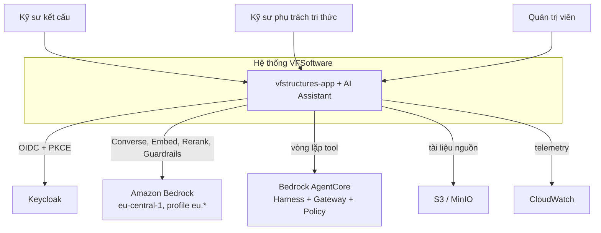
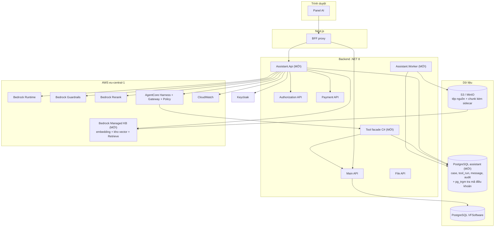
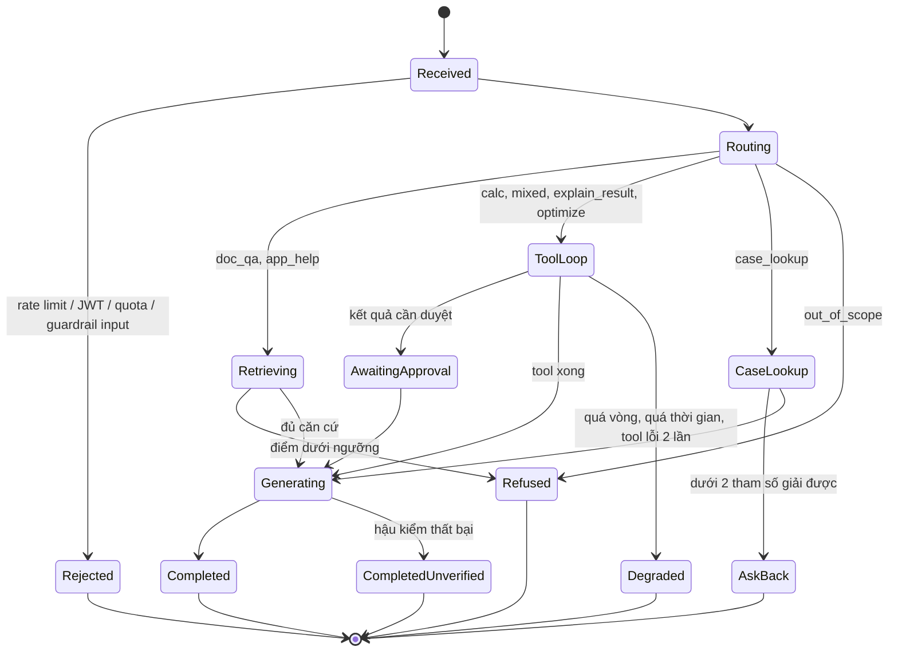
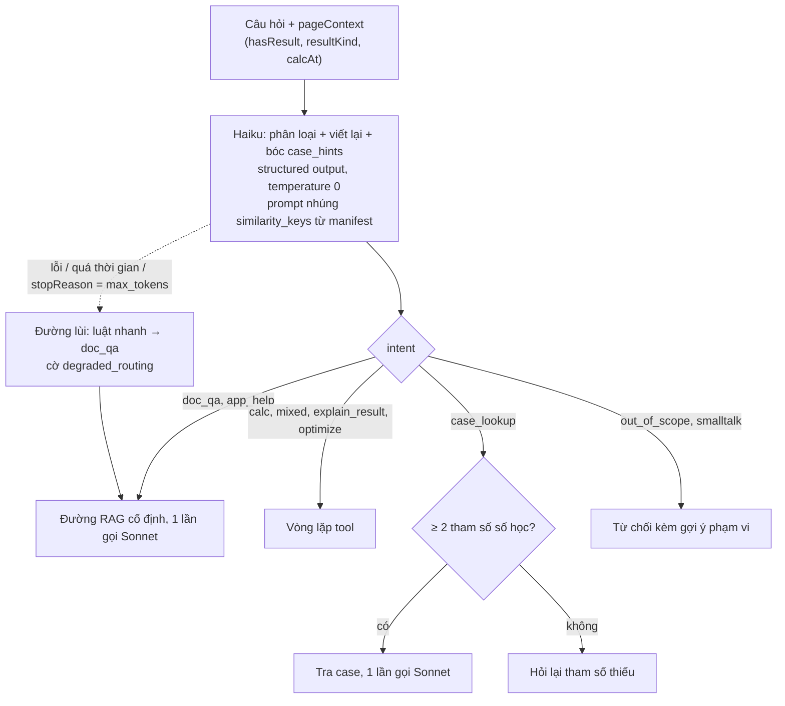
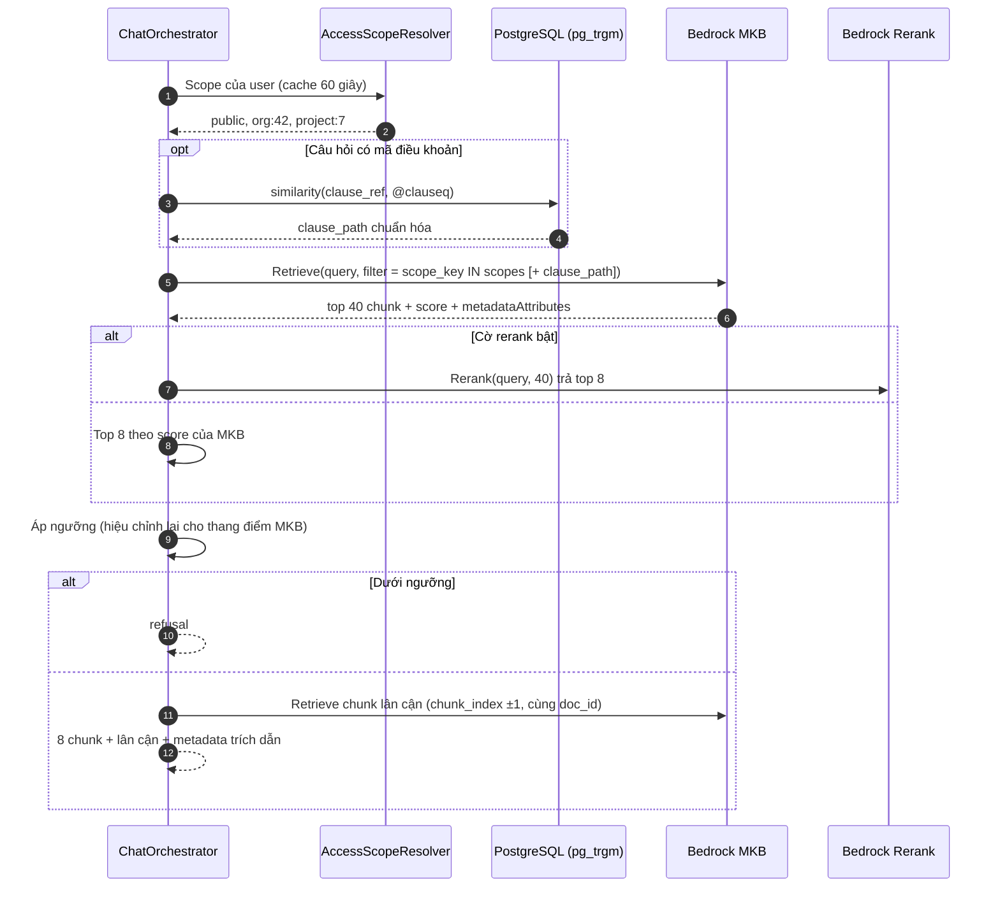
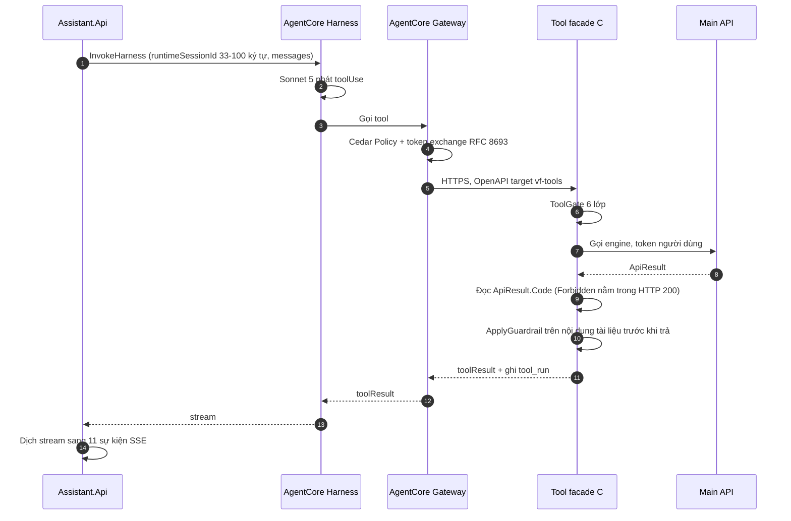
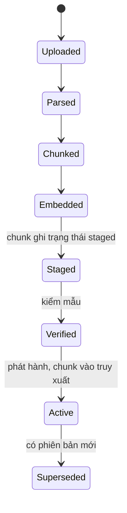
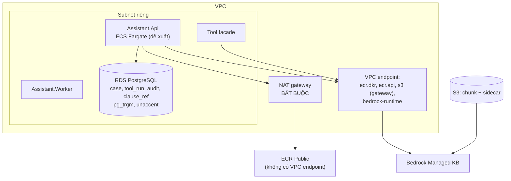
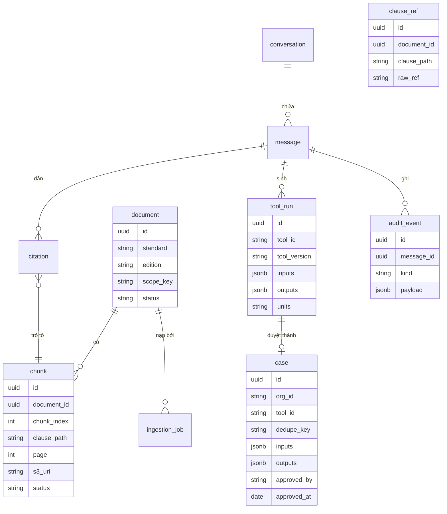

# 19 · Đặc tả kiến trúc — AI Assistant cho VF Structures

> **Đã cập nhật trong `ship/`.** File này ghi đặc tả trước lượt rà soát nguồn 21/09/2026. Bản đã sửa: `ship/01-kien-truc.md`. Từ AD-28 (22/09/2026), case tự ghi khi engine tính đạt và không còn bước duyệt: xem `ship/12-tra-case.md`. Harness có lifecycle hook, nhưng ToolGate vẫn đặt ở facade: xem `ship/01-kien-truc.md` §8.5.

**Phiên bản 1.0 · 20/09/2026 · Cấu trúc theo arc42 (12 mục)**

Tài liệu này chỉ mô tả kiến trúc: thành phần, hợp đồng, luồng, dữ liệu, cấu hình, quyết định, rủi ro. Phần diễn giải, hỏi đáp, lộ trình, chi phí và phân công đội nằm ở các tài liệu khác của bộ.

---

## 1. Mục tiêu và yêu cầu chất lượng

### 1.1 Phạm vi chức năng

| Mã | Chức năng |
| --- | --- |
| F1 | Hỏi đáp tiêu chuẩn có trích dẫn (RAG) |
| F2 | Tính toán qua engine hiện có (tool calling) |
| F3 | Tra tình huống nội bộ đã duyệt (case memory) |
| F4 | Nạp và phát hành tài liệu nguồn |
| F5 | Giải thích kết quả tính toán đang mở trên trang |
| F6 | Hậu kiểm số, trích dẫn và nhãn kết luận |
| F7 | Eval và quan sát |

### 1.2 Yêu cầu chất lượng

| Thuộc tính | Chỉ tiêu | Cách đo |
| --- | --- | --- |
| Truy xuất đúng | ≥ 60–70% recall@8 trước khi tinh chỉnh prompt | Golden set |
| Độ trễ tới chữ đầu | ≲ 3 giây (đo lại ở M0 sau AD-15) | Telemetry p50/p95 |
| Không bịa số | 100% số trong câu trả lời truy được về `tool_run` hoặc chunk | `NumberValidator` |
| Không bịa trích dẫn | 100% trích dẫn phân giải được về `chunk_id` có thật | `CitationValidator` |
| Cách ly dữ liệu | Case không vượt ranh giới `org_id` | Test tích hợp đa organization |
| Ép guardrail | Không gọi được mô hình chat khi thiếu guardrail | IAM condition key |
| Lọc quyền ở truy xuất | Không lượt nào gọi `Retrieve` thiếu `scope_key` và `status` | Architecture test CI + test tích hợp đa organization |

### 1.3 Nguyên tắc kiến trúc

| Mã | Nguyên tắc |
| --- | --- |
| P1 | Mô hình không tự tính bất kỳ con số nào. Số đến từ engine hoặc từ chunk. |
| P2 | Mọi khẳng định truy được về nguồn: `chunk_id` + trang + điều khoản, hoặc `tool_run_id`. |
| P3 | Phân quyền dùng lại cơ chế sẵn có (`[ApiAccess]`, token người dùng), không viết lại. |
| P4 | Thứ hệ thống biết chắc thì hệ thống cung cấp, không hỏi mô hình. |

---

## 2. Ràng buộc

| Loại | Ràng buộc |
| --- | --- |
| Kỹ thuật | Backend .NET 8; PostgreSQL; hệ thống hiện có không có message broker |
| Kỹ thuật | `eu.anthropic.claude-sonnet-5` bắt buộc dùng inference profile `eu.*`, route trong 6 region EU, không có single-region |
| Kỹ thuật | Aurora DSQL không dùng được: không hỗ trợ extension, tức không có `pg_trgm` và `unaccent` |
| Kỹ thuật | Rerank trong EU chỉ có ở Frankfurt |
| Kỹ thuật | Managed Knowledge Base chỉ GA ở một tập region; mô hình embedding **không đổi được sau khi tạo KB** |
| Kỹ thuật | `overrideSearchType: HYBRID` chỉ có ở kho vector OpenSearch Serverless, RDS và MongoDB Atlas — kho của MKB không nằm trong danh sách (V-K5) |
| Kỹ thuật | AgentCore Harness không hỗ trợ hook |
| Pháp lý | Dữ liệu cá nhân của công dân Việt Nam ra nước ngoài: hồ sơ đánh giá tác động theo Luật 91/2025/QH15 và Nghị định 356 |
| Pháp lý | Quyền ingest NF EN / DTU vào kho nội bộ chưa xác nhận |
| Tổ chức | Đội 5 người, 8 tuần, POC 4 tuần |
| Giao diện | Chỉ `fr` và `en` |

---

## 3. Bối cảnh và phạm vi

### 3.1 C4 mức 1 — System context



### 3.2 Giao diện ngoài

| Đối tác | Giao thức | Chiều | Nội dung |
| --- | --- | --- | --- |
| Trình duyệt → BFF | HTTPS | vào | Câu hỏi, `pageContext` |
| BFF → Assistant.Api | REST + SSE, Bearer | vào | Lượt hỏi đáp, stream sự kiện |
| Assistant.Api → Main API | REST, token người dùng chuyển tiếp | ra | Gọi engine tính toán, đọc `tool_run` |
| Assistant.Api → Authorization API | REST | ra | Quyền module |
| Assistant.Api → Payment API | REST | ra | `org_id`, subscription |
| Assistant.Api → Bedrock Runtime | AWS SDK | ra | `Converse`, `ConverseStream` |
| Assistant.Api → Bedrock Agent Runtime | AWS SDK | ra | `Retrieve` trên Managed Knowledge Base (AD-17) |
| Worker → Bedrock Agent (control) | AWS SDK | ra | `create-knowledge-base`, `create-data-source`, `start-ingestion-job` |
| Worker → S3 (kho chunk) | AWS SDK | ra | Ghi một object cho mỗi chunk + `.metadata.json` sidecar |
| Assistant.Api → AgentCore | `InvokeHarness`, Bearer JWT | ra | Vòng lặp tool |
| AgentCore Gateway → Tool facade | HTTPS, OpenAPI target `vf-tools` | vào | Gọi tool đã qua Cedar |
| Worker → S3 | AWS SDK | ra | Đọc tệp nguồn |

### 3.3 Ngoài phạm vi

Sinh bản vẽ; ký hồ sơ; thay thế phán đoán kỹ sư; sinh SQL bằng mô hình; MCP server công khai; case công khai giữa các organization.

---

## 4. Chiến lược giải pháp

| Vấn đề | Giải pháp | Quyết định |
| --- | --- | --- |
| Hỏi đáp tài liệu | Truy xuất qua Bedrock Managed Knowledge Base, đường cố định 1 lần gọi mô hình. Worker cắt đoạn theo điều khoản và ghi chunk ra S3 kèm metadata | AD-17 |
| Tính toán | Tool calling vào engine .NET hiện có, không để mô hình tính | AD-08, P1 |
| Tra kinh nghiệm | Lọc cứng SQL rồi chấm điểm khoảng cách số học, vector chỉ tie-break | AD-09, AD-16 |
| Vòng lặp tool | AgentCore Harness; ToolGate chuyển ra facade C# vì Harness không có hook | AD-13 |
| Định tuyến | Một lần gọi Haiku cho mọi lượt; luật chỉ là đường lùi | AD-15 |
| Chống bịa | Hậu kiểm sau stream, gắn cờ thay vì xóa chữ | F6 |
| Streaming | SSE một chiều, BFF chuyển tiếp nguyên dạng | AD-07 |

---

## 5. Khung nhìn thành phần

### 5.1 C4 mức 2 — Container



### 5.2 Trách nhiệm từng container

| Container | Trách nhiệm | Mới |
| --- | --- | --- |
| `Assistant.Api` | Điều phối lượt, định tuyến, RAG, case memory, hậu kiểm, phát SSE | Có |
| Tool facade C# | ToolGate 6 lớp, gọi Main API, ghi `tool_run`, `ApplyGuardrail` trên nội dung tool | Có |
| `Assistant.Worker` | Nạp tài liệu, cắt đoạn theo điều khoản, ghi chunk kèm sidecar ra S3, tổng hợp eval, tác vụ định kỳ. Embedding do MKB sinh | Có |
| Bedrock Managed KB | Embedding, kho vector, `Retrieve`. Nạp từ S3 qua managed connector | Có |
| PostgreSQL `assistant` | `document`, `case`, `tool_run`, `message`, `audit_event`, bảng `clause_ref`; `pg_trgm`, `unaccent`. Kho chunk **không** còn ở đây kể từ AD-17 | Có |
| BFF proxy | Đọc cookie HttpOnly, gắn Bearer, chuyển tiếp SSE nguyên dạng | Không |
| Main API | Engine tính toán, `[ApiAccess]` | Không |
| AgentCore Harness | Vòng lặp tool, gọi Sonnet 5 | Có |
| AgentCore Gateway | Phơi tool theo OpenAPI target `vf-tools`, Cedar Policy, token exchange RFC 8693 | Có |

### 5.3 Thành phần trong `Assistant.Api`

| Thành phần | Trách nhiệm |
| --- | --- |
| `ChatOrchestrator` | Máy trạng thái của lượt, phát sự kiện SSE |
| `IntentRouter` | Gọi Haiku, trả `intent`, `search_query`, `instruction`, `case_hints` |
| `ScopedKnowledgeBaseClient` | Lớp **duy nhất** được gọi `Retrieve`; scope là tham số khởi tạo bắt buộc; dựng `filter`, đặt `numberOfResults` |
| `ClauseResolver` | Regex bóc mã điều khoản, `pg_trgm` phân giải thành `clause_path` chuẩn hóa |
| `AccessScopeResolver` | Tính `scope_key`, cache trong tiến trình 60 giây |
| `CaseSimilarityScorer` | Gom tham số, lọc cứng, chấm điểm khoảng cách, top 5 |
| `NumberValidator` | Đối chiếu số trong câu trả lời với `tool_run` hoặc chunk |
| `CitationValidator` | Phân giải mọi `[n]` về `chunk_id` |
| `VerificationValidator` | Chặn nhãn "đạt" không có `tool_run` khớp |
| `ILlmClient`, `IEmbeddingClient`, `IReranker` | Ba endpoint Bedrock tách riêng |

### 5.4 Danh mục tool

| Tool | Nhóm rủi ro | Chạy ở |
| --- | --- | --- |
| `calc.*` (một tool cho mỗi phép kiểm tra) | A | Facade → Main API |
| `search_documents` | A | Facade → `ScopedKnowledgeBaseClient` → Bedrock Managed KB |
| `find_similar_cases` | A | Facade → PostgreSQL |
| `standards.find_basis(toolRunId)` | A | Facade |

Nguyên tắc: một tool một việc; không có tool đa chế độ với cờ `mode`.

---

## 6. Khung nhìn thời gian chạy

### 6.1 Máy trạng thái của một lượt



### 6.2 Định tuyến



**Hợp đồng đầu ra của router**

```json
{
  "intent": "doc_qa|app_help|calc|explain_result|mixed|optimize|case_lookup|out_of_scope",
  "search_query": "string ≤ 300",
  "instruction": "string ≤ 200",
  "needs_clarification": false,
  "case_hints": {
    "tool_id": "enum từ manifest | null",
    "params": [{ "key": "enum similarity_keys", "value": 0.0, "unit": "enum đơn vị" }]
  }
}
```

### 6.3 Truy xuất tài liệu (F1)



Hai chặng vì MKB không có tương đương của trigram. PostgreSQL vẫn nằm trong đường truy xuất để phân giải mã điều khoản gõ gần đúng. Chi tiết và đường lùi ở [03](03-rag.md) §2.

### 6.4 Vòng lặp tool (F2, F5)



### 6.5 Tra tình huống (F3)

```
0. Gom tham số:   tool_run > pageContext > case_hints
                  ghi đè theo từng key, không theo cả khối
                  key chỉ có nguồn case_hints → cờ unconfirmed
                  < 2 key giải được → hỏi lại, dừng
1. Lọc cứng SQL:  org_id, status = 'Approved', tool_id / element_type
                  → ≤ 200 ứng viên
2. Chấm điểm:     khoảng cách chuẩn hóa trên similarity_keys
                  điểm = distance / coverage
                  → top 5
3. Tie-break:     vector của summary, chỉ khi câu hỏi có phần ngôn ngữ tự nhiên
4. Sonnet:        so sánh và diễn giải 5 case
```

### 6.6 Nạp tài liệu (F4)



Quy tắc: một `ingestion_job` cho một tài liệu; ghi chunk theo lô trong một transaction; chạy lại cùng job không tạo bản sao; đọc theo từng trang, không nạp cả tệp; không cắt giữa bảng.

---

## 7. Khung nhìn triển khai



| Hạng mục | Giá trị |
| --- | --- |
| Region | `eu-central-1` |
| Cơ sở dữ liệu | RDS PostgreSQL hoặc Aurora PostgreSQL; **không** Aurora DSQL |
| Kho chunk | Bedrock Managed KB, nạp từ S3 qua managed connector (AD-17) |
| Extension PostgreSQL | `pg_trgm`, `unaccent`. **Không cần `pgvector`** — kho vector nằm ở MKB |
| CloudTrail | Data event cho `AWS::Bedrock::KnowledgeBase` bật ngay lúc tạo KB — `Retrieve` mặc định **không** ghi |
| Chạy container | ECS Fargate là mặc định đề xuất; topology production chưa chốt (GĐ-7) |
| NAT gateway | Bắt buộc khi Harness ở chế độ VPC; ECR Public không có VPC endpoint (V-A10) |
| Job nền | Bảng PostgreSQL + `FOR UPDATE SKIP LOCKED`; không có broker |
| Kết nối DB | `NpgsqlDataSource` singleton; RDS Proxy hoặc PgBouncer khi nhiều instance |
| Tác vụ định kỳ | ECS scheduled task hoặc `BackgroundService` trong Worker, tách khỏi tiến trình phục vụ |

---

## 8. Khái niệm xuyên suốt

### 8.1 Mô hình dữ liệu



### 8.2 Chỉ mục và tham số truy xuất

| Hạng mục | Giá trị |
| --- | --- |
| Kho chunk và embedding | Bedrock MKB, `type: MANAGED`. `embeddingModelType` theo hai nhánh AD-06: `MANAGED` mặc định, `CUSTOM` + `embeddingModelArn` nếu đo không đạt |
| Data source | `MANAGED_KNOWLEDGE_BASE_CONNECTOR`, `connectorParameters.type = S3`, `version: "1"`, `connectionConfiguration` mang `bucketName` và `bucketOwnerAccountId` |
| Trình tự tạo | `create-knowledge-base` → `ACTIVE` → `create-data-source` → `AVAILABLE` → `start-ingestion-job` → `COMPLETE`. Cả ba đều bất đồng bộ |
| Metadata lọc được | `standard`, `edition`, `clause_path`, `page`, `scope_key`, `chunk_type`, `doc_id`, `chunk_index` |
| Lọc quyền | `filter` `andAll` gồm `in` trên `scope_key` và `equals` trên `status`, dựng trong `ScopedKnowledgeBaseClient`. Chỉ dùng `equals`, `notEquals`, `in`, `notIn` và toán tử số — `startsWith`, `stringContains`, `listContains` bị bỏ qua im lặng |
| `numberOfResults` | Đặt tường minh 40. Mặc định của dịch vụ là **5** |
| `overrideSearchType` | **Để trống** cho Bedrock tự chọn. Chỉ đặt `HYBRID` nếu V-K5 đạt — `HYBRID` chỉ có ở OpenSearch Serverless, RDS và MongoDB Atlas |
| Ngưỡng điểm | Bắt đầu 0.5 rồi hiệu chỉnh. Số 0.7 là thang cosine của pgvector, không chuyển sang MKB được |
| Trigram | `pg_trgm` trên `clause_ref` trong PostgreSQL, phân giải mã điều khoản trước khi gọi `Retrieve` |
| Rerank | Cohere Rerank 3.5, sau cờ tính năng, top 8 |
| Ngưỡng từ chối | Bắt đầu 0.5, hiệu chỉnh bằng golden set. Thang điểm của MKB không giống thang cosine |
| Tiền tố chunk | `EN 1992-1-1:2004 · 6.2.2 Cắt · trang 84`, gắn vào nội dung chunk trước khi đẩy lên S3 |

### 8.3 Định tuyến mô hình

| Tác vụ | Mô hình | Ghi chú |
| --- | --- | --- |
| Định tuyến, viết lại câu hỏi, bóc `case_hints` | `eu.anthropic.claude-haiku-4-5-20251001-v1:0` | Structured output, `temperature 0`, `MaxTokens` 300–400 |
| Trả lời, vòng lặp tool | `eu.anthropic.claude-sonnet-5` | Không có structured output; chỉ có tool-use schema |
| Fallback | Sonnet 4.6 | |
| Embedding | Nhánh A: `MANAGED`, AWS chọn. Nhánh B: `CUSTOM` với Cohere Embed v4, Titan Text Embeddings V2 hoặc Cohere Embed Multilingual v3 | Chốt bằng đo trước khi tạo KB. Nhánh B thêm `bedrock:InvokeModel` cho role của KB |
| Rerank | Cohere Rerank 3.5 | Chỉ có ở Frankfurt |

Mọi lần gọi đặt `MaxTokens` tường minh. Bỏ trống là lấy trần của mô hình và giữ chỗ quota theo trần đó.

### 8.4 Sáu mặc định Harness phải ghi đè

| Tham số | Mặc định | Đặt thành |
| --- | --- | --- |
| Model | `global.anthropic.claude-sonnet-4-6` | `eu.anthropic.claude-sonnet-5` + `converse_stream` |
| `maxIterations` | 75 | 5 (`explain_result`) / 7 (`calc`, `mixed`) |
| `timeoutSeconds` | 3600 | 60 / 90 |
| `shell`, `file_operations` | Bật | Loại khỏi danh sách tool |
| Memory | Bật | `disabled` |
| Xác thực | SigV4 | `CUSTOM_JWT` với **cả** `allowedClients` và `allowedAudience` |

`runtimeSessionId`: 33–100 ký tự. `idleRuntimeSessionTimeout`: 900 giây.

### 8.5 ToolGate — sáu lớp

| Lớp | Kiểm | Khi trượt |
| --- | --- | --- |
| 01 | Schema tham số | Lỗi mô tả kèm schema |
| 02 | Quyền: user có được gọi tool này | 403 |
| 03 | Biên tham số theo manifest | Lỗi kèm khoảng hợp lệ |
| 04 | **Đơn vị bắt buộc** | Từ chối, không suy diễn đơn vị |
| 05 | Chống lặp: băm `(tool_id, tham số)`, quá hai lần trùng | Dừng kèm lỗi cụ thể |
| 06 | Đọc `ApiResult.Code` (`Forbidden` nằm trong HTTP 200) | Ánh xạ thành 4xx |

ToolGate nằm ở facade C#, không nằm trong Harness: Harness không có hook.

### 8.6 Hậu kiểm

| Bộ kiểm | Điều kiện đạt | Khi trượt |
| --- | --- | --- |
| `NumberValidator` | Mỗi số khớp `tool_run` (`relTol` 0.005) **hoặc** trích nguyên văn từ chunk | `warning`, trạng thái `CompletedUnverified` |
| `CitationValidator` | Mọi `[n]` phân giải về `chunk_id` có thật | `warning` |
| `VerificationValidator` | Không có nhãn "đạt", "thỏa mãn" thiếu `tool_run` khớp tham số | `warning` |
| Kiểm phiên bản | Tiêu chuẩn trích dẫn là ấn bản đang hiệu lực | Cảnh báo "có thể theo tiêu chuẩn cũ" |

Hậu kiểm chạy **sau khi stream kết thúc**. Gắn cờ, không xóa chữ đã hiện.

### 8.7 Hợp đồng SSE — 11 sự kiện

| Sự kiện | Payload | Phát khi |
| --- | --- | --- |
| `status` | `phase` | Đổi trạng thái |
| `retrieval` | `chunks`, `scores`, `params` (nhánh case) | Sau truy xuất hoặc sau khi gom tham số |
| `token` | `text` | Mỗi mảnh chữ |
| `tool_call` | `toolId`, `version`, `inputs` | Trước khi gọi tool |
| `tool_result` | `toolRunId`, `outputs`, `units`, `standard` | Sau khi tool xong |
| `approval_required` | `toolRunId`, `summary` | Kết quả có thể vào kho kinh nghiệm |
| `citation` | `[{n, docId, page, clause, quote}]` | Sau khi kiểm trích dẫn |
| `refusal` | `reason`, `suggestion` | Không đủ căn cứ hoặc ngoài phạm vi |
| `warning` | `code` | Hậu kiểm thất bại |
| `error` | `code`, `retryable`, `partial`, `requestId` | Lỗi giữa chừng |
| `done` | `messageId`, `usage` | Kết thúc |

Hợp đồng đóng băng từ tuần 1. Giao diện dựng thẻ từ JSON, không phân tích chữ trong `token`.

### 8.8 Xác thực và phân quyền

| Lớp | Cơ chế |
| --- | --- |
| Trình duyệt → BFF | Cookie HttpOnly |
| BFF → Assistant.Api | Bearer JWT Keycloak |
| Assistant.Api → Main API | Chuyển tiếp token người dùng, `[ApiAccess]` áp dụng nguyên trạng |
| Assistant.Api → AgentCore | `CUSTOM_JWT`, `allowedClients` + `allowedAudience` |
| Gateway → facade | Token exchange RFC 8693 |
| Gateway → tool | Cedar Policy |
| Bedrock | IAM condition key `bedrock:GuardrailIdentifier` bắt buộc cho mô hình chat |
| Role | `assistant-runtime` (có điều kiện guardrail), `assistant-ingest` (không có, vì mô hình embedding không hỗ trợ guardrail) |

`GuardrailVersion` thiếu thì guardrail không chạy và không báo lỗi. Test CI kiểm cả đường embedding.

### 8.9 Scope dữ liệu

| Kho | Mức scope |
| --- | --- |
| `chunk` | `public`, `org:*`, `project:*` |
| `case` | Chỉ `org_id`. Không có case công khai |

`org_id` lấy từ Payment API. Không tin `org_id` do client gửi.

### 8.10 Chống đầu độc và prompt injection

Nội dung của `search_documents` và `find_similar_cases` đi qua `ApplyGuardrail` (đầu vào) **trước khi** vào `toolResult`. Bị chặn thì trả lỗi mô tả thay cho nội dung. Summary của case sinh bằng **template**, không bao giờ bằng mô hình.

---

## 9. Quyết định kiến trúc

| Mã | Quyết định | Phương án loại | Cái giá đã biết |
| --- | --- | --- | --- |
| AD-01 | Service .NET 8 mới `VFSoftware.Assistant.Api` sau BFF proxy | Route API trong Next.js | Thêm một service phải vận hành |
| AD-02 | Gọi Bedrock trực tiếp bằng AWS SDK sau `ILlmClient`, `IEmbeddingClient`, `IReranker` | Bedrock Agents classic | Tự viết retry, cache, guardrail |
| AD-03 | Region chính `eu-central-1`, inference profile `eu.*` | `bedrock-mantle` in-region; Paris | Request route trong 6 region EU, không single-region |
| AD-05 | Ba tầng mô hình: Haiku (định tuyến), Sonnet 5 (trả lời), Sonnet 4.6 (fallback) | Một mô hình cho mọi việc | Ba đường phải đo riêng |
| AD-06 | Mô hình embedding chốt bằng đo trên bộ 50 câu, trước khi tạo KB. Nhánh A `embeddingModelType: MANAGED`; nhánh B `CUSTOM` + `embeddingModelArn` nếu nhánh A không đạt | Chọn theo cảm tính | Không đổi được sau khi tạo KB ở cả hai nhánh; đổi ý là tạo KB mới và nạp lại. Nhánh B thêm quyền `bedrock:InvokeModel` cho role của KB |
| AD-07 | Streaming bằng SSE, BFF chuyển tiếp nguyên dạng | SignalR; WebSocket | Phải kiểm qua chuỗi nginx + gateway production |
| AD-08 | Tool registry trong tiến trình, sinh từ OpenAPI rồi chỉnh tay | MCP server riêng; AI sinh SQL | Manifest phải review như code |
| AD-09 | Case memory ghi nhận tự động khi duyệt | Form ghi nhận thủ công | Kho case phụ thuộc thói quen bấm Duyệt |
| AD-10 | Guardrails ép bằng IAM condition key | Chỉ dặn trong prompt | Hai role tách riêng |
| AD-11 | Job nền bằng bảng PostgreSQL `FOR UPDATE SKIP LOCKED` | RabbitMQ / Kafka / SQS | Không có retry và DLQ sẵn của broker |
| AD-12 | Logical database `assistant` riêng; không dùng Aurora DSQL | Dùng chung schema với VFSoftware | Instance vật lý riêng nay là tùy chọn: lý do cũ là tải của chỉ mục HNSW, mà kho vector đã sang MKB |
| AD-13 | Vòng lặp tool là AgentCore Harness | Vòng lặp C# thuần | Không có hook nên ToolGate ra facade; phải dịch stream sang SSE; ba hạ tầng mới trong POC nén |
| AD-14 | Vùng chạy `eu-central-1` | APAC; hai vùng | Kỹ sư tại Việt Nam cộng 250–320 ms; nghĩa vụ hồ sơ theo luật Việt Nam vẫn còn |
| AD-15 | Bỏ luật nhanh khỏi đường định tuyến chính; mọi lượt qua IntentRouter | Giữ luật nhanh ở đường chính | Mọi lượt cộng 300–500 ms; router thành điểm chết đơn (R44) |
| AD-16 | IntentRouter bóc luôn `case_hints`; ưu tiên `tool_run` > `pageContext` > `case_hints` | Lọc case thuần bằng vector; bắt nhập qua form | Bóc sai thì kỹ sư nhận tiền lệ sai (R45); `MaxTokens` router lên 300–400 |
| AD-17 | **Truy xuất tài liệu chạy trên Bedrock Managed Knowledge Base.** Worker parse, cắt đoạn theo điều khoản, giữ tiêu đề cột, rồi ghi một object S3 cho mỗi chunk kèm metadata sidecar. Lọc quyền là `filter` trên `scope_key` và `status`. `pg_trgm` phân giải mã điều khoản trước khi gọi `Retrieve` | Tự xây hybrid trên PostgreSQL + pgvector với RRF; Customer-managed KB; `AgenticRetrieveStream` | Biên phân quyền là tham số API chứ không phải mệnh đề SQL (R46); không tự chủ được RRF và tham số HNSW; embedding không đổi được sau khi tạo KB; Worker **không** biến mất |
| AD-18 | Bedrock Evaluation chạy song song golden set trong CI | Chỉ golden set tự chấm | Thêm một nguồn chấm phải hiểu và đối chiếu |
| AD-19 | Prompt router và prompt trả lời giữ trong Bedrock Prompt Management | Prompt hằng trong mã C# | Thêm một nơi phải kiểm soát phiên bản |
| AD-20 | Ingestion điều phối bằng Step Functions, kích hoạt bằng S3 Event Notification | Bảng hàng đợi PostgreSQL cho nhánh ingestion | Thêm một hạ tầng vào POC đã nén (R39) |
| AD-21 | Batch inference cho golden set và chấm eval hàng loạt | Gọi `Converse` từng câu | Không dùng được cho đường phục vụ người dùng |
| AD-22 | Cửa sổ lịch sử đếm theo **lượt**: router đọc 3 lượt gần nhất; đường trả lời quá 6 lượt thì giữ 4 lượt gần nhất cộng tóm tắt các lượt cũ | Gửi toàn bộ lịch sử; cắt cứng theo số message | Hội thoại rất dài mất chi tiết nhỏ ở các lượt cũ; ba con số là cấu hình, hiệu chỉnh ở M1 |
| AD-23 | Chống lạm dụng ba tầng, bộ đếm trong PostgreSQL: burst theo IP, cửa sổ trượt theo user, **một lượt đồng thời trên mỗi user** (`active_turn`), hạn mức ngày theo token của user và org | Bộ giới hạn trong bộ nhớ; hạn mức theo số lượt; hủy lượt cũ | Thêm một bảng và một job quét dọn; mỗi lượt cộng hai lần ghi PostgreSQL |

**Ràng buộc kèm theo AD-15:** `pageContext` phải mang `hasResult`, `resultKind`, `calcAt`.

**Ràng buộc kèm theo AD-16:** `similarity_keys`, đơn vị và dải giá trị nhúng vào prompt router, sinh từ `tools.manifest.yaml` lúc khởi động; giá trị chỉ có nguồn `case_hints` phải được kỹ sư xác nhận trên giao diện; dưới 2 key giải được thì hỏi lại.

---

## 10. Yêu cầu chất lượng chi tiết

Mục tiêu chất lượng nằm ở §1.2. Mục này là các kịch bản chất lượng: hệ thống phải phản ứng thế nào khi gặp từng tình huống.

| Kịch bản | Kích thích | Phản ứng yêu cầu |
| --- | --- | --- |
| Truy xuất yếu | Điểm vector tốt nhất < 0.7 | `refusal` trước khi gọi Sonnet, không đoán |
| Router lỗi | Haiku timeout, lỗi, hoặc `stopReason = max_tokens` | Đường lùi luật nhanh, cờ `degraded_routing`, lượt vẫn hoàn thành |
| Tool lỗi hai lần | Engine trả lỗi | Trạng thái `Degraded`, không lặp tiếp |
| Số không truy được nguồn | `NumberValidator` trượt | `warning`, `CompletedUnverified`, giữ chữ đã hiện |
| Tham số case thiếu | Dưới 2 key giải được | Hỏi lại, không trả 5 case yếu |
| Gọi `Retrieve` thiếu filter | Đường mã mới bỏ qua `ScopedKnowledgeBaseClient` | Architecture test trong CI **chặn build**, không để chạy tới production (R46) |
| Lọc trên thuộc tính chưa khai | Sai cấu hình KB | Trả rỗng, không báo lỗi. Bắt bằng V-K4 và test tích hợp đa organization (R47) |
| Nội dung tool có chỉ dẫn độc hại | Guardrail chặn | Trả lỗi mô tả thay cho nội dung |
| Organization yêu cầu xóa | GDPR | Xóa cứng toàn bộ case, ghi `audit_event` bản xóa |
| Mọi đường kết thúc | Bất kỳ | Ghi `message` và `audit_event`, kể cả khi lỗi |

---

## 11. Rủi ro và nợ kỹ thuật

### 11.1 Kiểm chứng chặn quyết định

| Mã | Kiểm | Hạn |
| --- | --- | --- |
| V-A1 | Gọi `InvokeHarness` bằng Bearer JWT thay vì SigV4 | Hết ngày 3 (23/09) |
| V-A6 | Token exchange RFC 8693 trên Keycloak | Hết ngày 3 (23/09) |
| V-A4 | Stream của Harness dịch được sang 11 sự kiện SSE | Cổng G0 (25/09) |
| V-A9 | Cedar kiểm được điều kiện số học `b >= 100 && b <= 2000` | M0 |
| V-A10 | NAT gateway cho Harness ở chế độ VPC | M0 |
| V-K2 | MKB có GA ở `eu-central-1` | Hết ngày 3 (23/09) |
| V-K3 | AWS SDK for .NET có `MANAGED` và `MANAGED_KNOWLEDGE_BASE_CONNECTOR` | Hết ngày 3 (23/09) |
| V-K4 | Managed S3 connector đọc được metadata sidecar, và thuộc tính khai được là lọc được | Hết ngày 3 (23/09) |
| V-K5 | Kho vector của MKB có nhận `overrideSearchType: HYBRID` không | Hết ngày 3 (23/09) |

V-A1 hoặc V-A6 trượt thì rơi về vòng lặp C# ngay, không lùi lịch.

### 11.2 Rủi ro trọng yếu

| Mã | Rủi ro | X | T |
| --- | --- | --- | --- |
| R9 | `ApiResult.Code = Forbidden` nằm trong HTTP 200; Gateway không thấy body | C | C |
| R20 | Đầu độc kho case qua thao tác Duyệt | V | C |
| R21 | Prompt injection từ chunk tài liệu bên thứ ba | V | C |
| R23 | Mốc EOL của Haiku 4.5 rơi vào tuần 2 của POC | C | V |
| R27 | Harness không có hook nên ToolGate phải ra facade | C | C |
| R29 | Có thể phải tự viết bộ đọc event stream cho Bearer JWT | V | C |
| R30 | `GuardrailVersion` thiếu thì guardrail không chạy và không báo lỗi | V | C |
| R32 | Token exchange trên Keycloak chưa có | C | C |
| R33 | Dịch stream Harness sang SSE | C | V |
| R35 | `MaxTokens` bỏ trống giữ chỗ quota theo trần mô hình | V | C |
| R39 | Ba hạ tầng mới trong POC nén | C | C |
| R40 | Nghĩa vụ hồ sơ khi đưa dữ liệu cá nhân ra nước ngoài | C | C |
| R41 | Kỹ sư tại Việt Nam cộng 250–320 ms mỗi lượt | C | T |
| R42 | Sonnet 5 không có structured output | C | V |
| R43 | Chi phí ingestion vượt dự kiến | V | V |
| R44 | AD-15 biến IntentRouter thành điểm chết đơn | C | C |
| R45 | AD-16: bóc sai tham số thì kỹ sư nhận tiền lệ sai, và sai đó không để lại dấu vết trong câu trả lời | V | C |
| R46 | AD-17: biên phân quyền rời khỏi câu SQL thành tham số API. Gọi `Retrieve` thiếu filter trả về tài liệu của mọi organization, đúng định dạng, không lỗi | V | C |
| R47 | AD-17: bộ lọc metadata hỏng im lặng ba đường — thuộc tính chưa khai trả rỗng, `startsWith`/`stringContains`/`listContains` bị bỏ qua nên trả về tất cả, `numberOfResults` mặc định 5 | C | C |

X = xác suất, T = tác động. T/V/C = thấp/vừa/cao. Bảng đầy đủ 47 rủi ro ở [12](12-rui-ro.md).

### 11.3 Nợ kỹ thuật đã biết

| Nợ | Trạng thái |
| --- | --- |
| Topology production chưa chốt (GĐ-7) | Chờ công ty |
| Gộp định kỳ case gần trùng | Sau beta, ngoài 8 tuần |
| Cache scope chỉ trong bộ nhớ tiến trình, không dùng chung giữa instance | Chấp nhận, TTL 60 giây |
| So sánh Nova Lite với Haiku 4.5 | Bắt buộc ở M1 (R44) |
| Đơn giá mô hình chưa tra được | Dùng AWS Pricing Calculator khi lập dự toán |

---

## 12. Thuật ngữ

| Thuật ngữ | Nghĩa trong tài liệu này |
| --- | --- |
| `chunk` | Một đoạn tài liệu đã cắt, có `clause_path` và số trang; nội dung nằm trên S3 kèm sidecar, embedding do MKB giữ |
| `scope_key` | Khóa phân quyền của chunk: `public`, `org:<id>` hoặc `project:<id>` |
| RRF | Reciprocal Rank Fusion, hợp nhất nhiều bảng xếp hạng theo thứ hạng |
| `tool_run` | Bản ghi một lần chạy engine: tool, phiên bản, tham số vào, kết quả ra, đơn vị |
| `case` | Một `tool_run` đã được kỹ sư duyệt, thuộc một `org_id` |
| `similarity_keys` | Danh sách tham số đo độ tương tự của một tool, khai báo trong `tools.manifest.yaml` |
| `case_hints` | Khối tham số số học do IntentRouter bóc từ câu hỏi (AD-16) |
| `dedupe_key` | `hash(tool_id, tool_version, input đã chuẩn hóa)` |
| ToolGate | Sáu lớp kiểm chạy trong facade C# trước khi gọi engine |
| Harness | Vòng lặp agent quản lý sẵn của AgentCore; không hỗ trợ hook |
| Gateway | Thành phần AgentCore phơi REST thành tool MCP, kèm Cedar Policy |
| Cedar | Ngôn ngữ chính sách phân quyền của AWS, chạy ở Gateway |
| Facade | Service C# đứng giữa Gateway và Main API, giữ ToolGate |
| Managed Knowledge Base (MKB) | Dịch vụ RAG quản lý sẵn của Bedrock: embedding, kho vector và `Retrieve`. Nạp từ S3 qua managed connector |
| Metadata sidecar | Tệp `.metadata.json` đi kèm mỗi chunk trên S3, mang `clause_path`, `page`, `scope_key`, `status` |
| `ScopedKnowledgeBaseClient` | Lớp duy nhất được phép gọi `Retrieve`; scope là tham số khởi tạo bắt buộc |
| `degraded_routing` | Cờ đánh dấu lượt đi qua đường lùi định tuyến |
| `CompletedUnverified` | Trạng thái kết thúc khi hậu kiểm trượt; chữ vẫn hiện, kèm cảnh báo |

---

## Liên quan

[00](00-tong-quan.md) quyết định và giả định · [01](01-kien-truc-tong-the.md) sơ đồ tổng thể · [02](02-assistant-service.md) lượt hỏi đáp · [03](03-rag.md) RAG · [04](04-tool-calling.md) tool calling · [05](05-case-memory.md) case memory · [06](06-tang-bedrock.md) tầng Bedrock · [07](07-auth-bao-mat.md) bảo mật · [08](08-ux.md) giao diện · [09](09-eval-quan-sat.md) eval · [10](10-trien-khai.md) triển khai · [12](12-rui-ro.md) rủi ro
