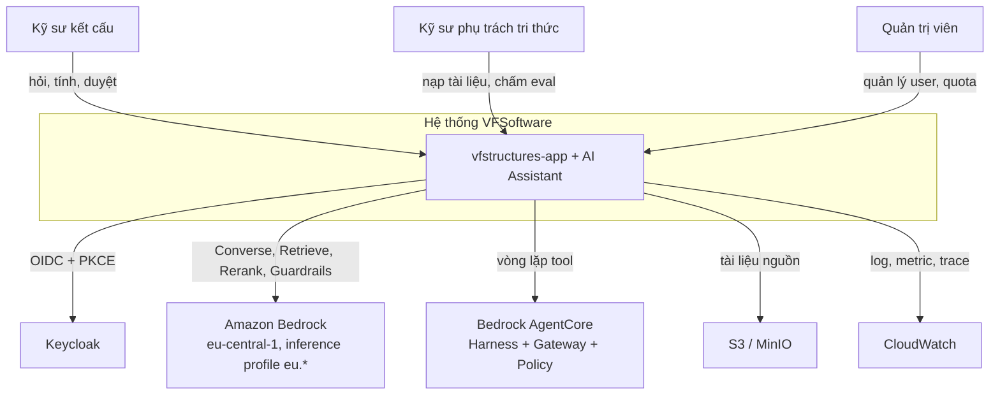
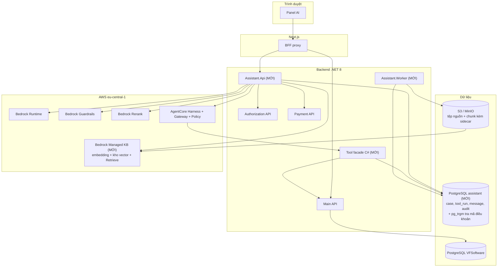
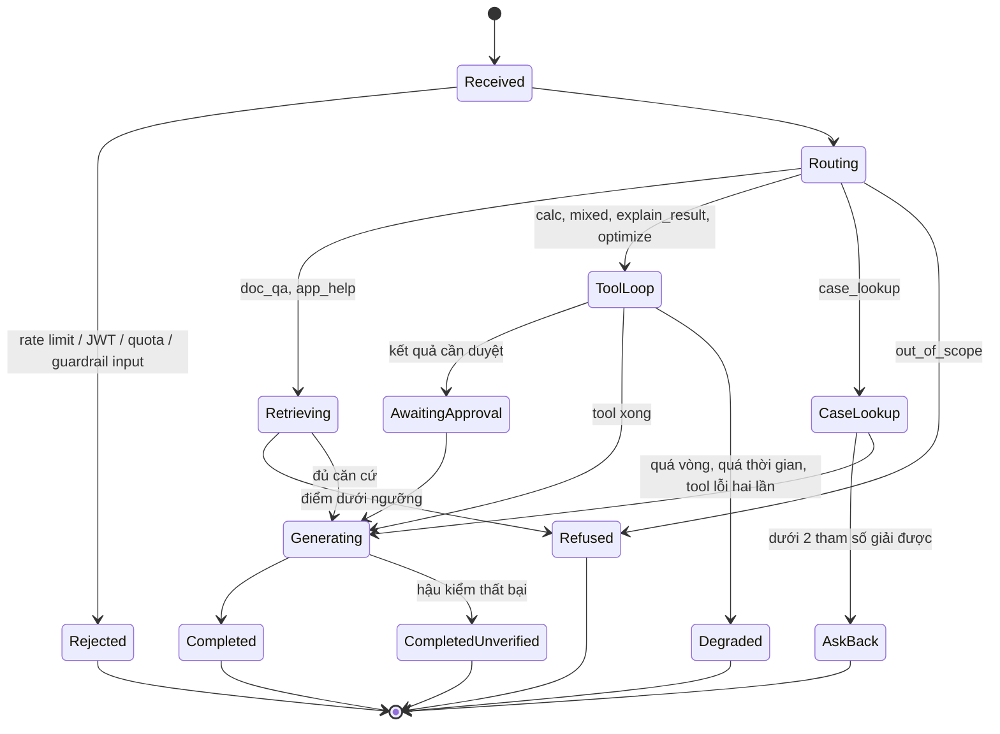
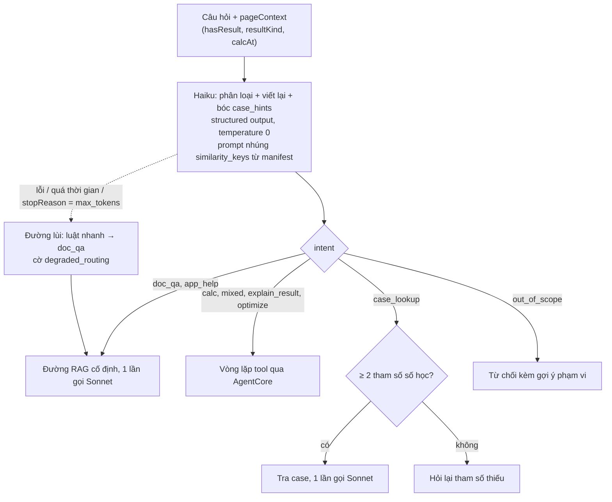
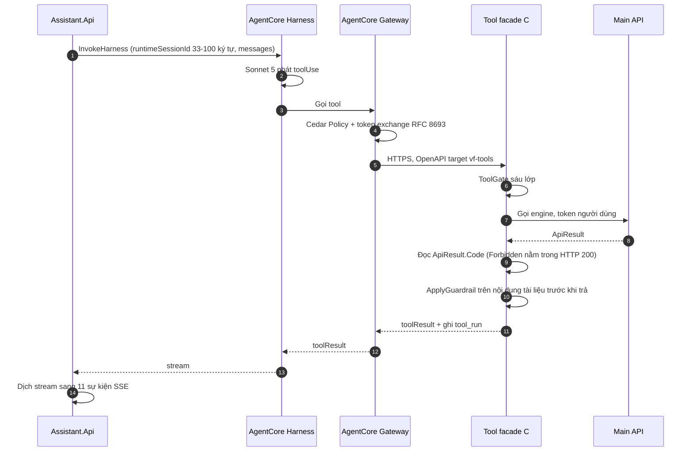
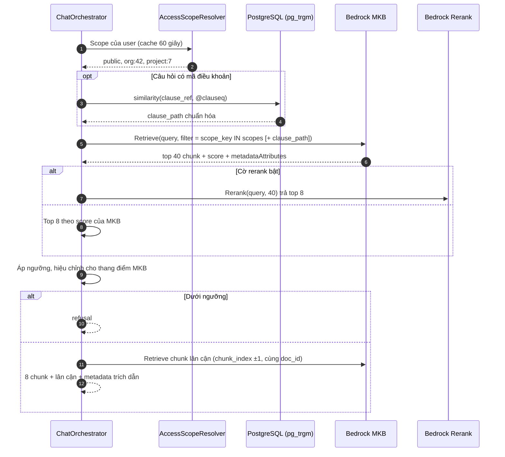
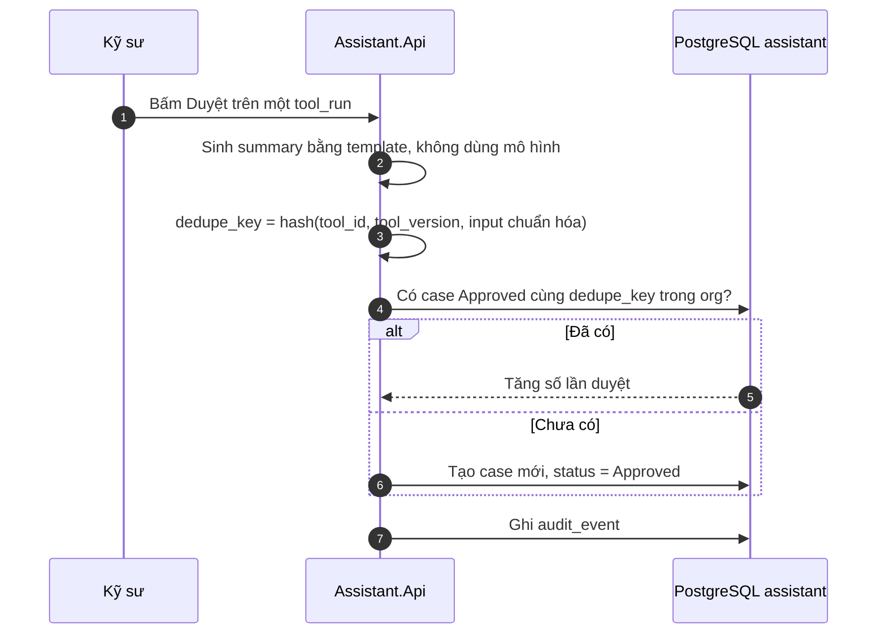
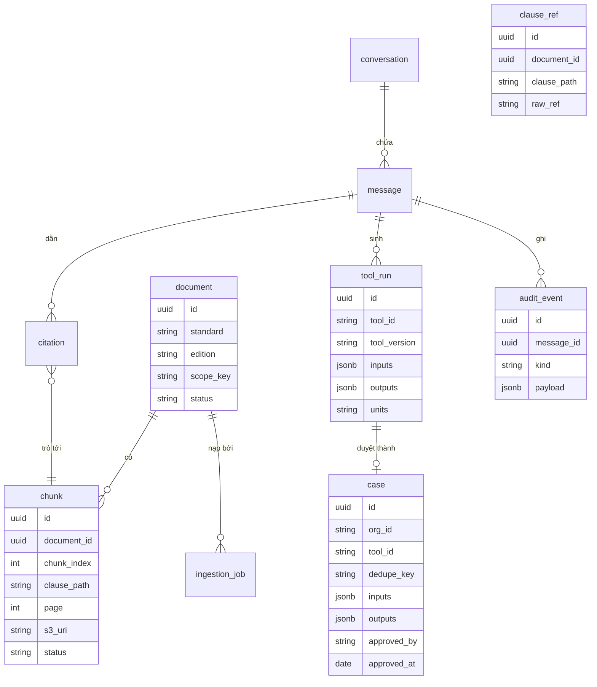
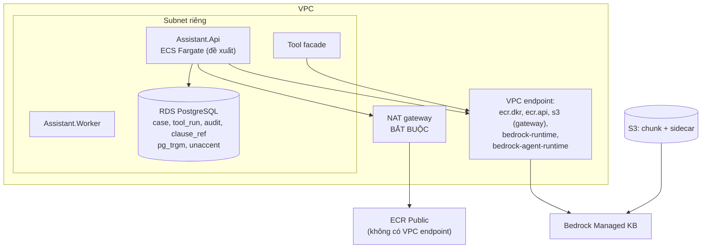

# Architecture Design Document — AI Assistant cho VF Structures

> **Đã cập nhật trong `ship/`.** File này ghi thiết kế trước lượt rà soát nguồn 21/09/2026. Bản đã sửa: `ship/01-kien-truc.md`.

**RFC-2026-001**

| | |
| --- | --- |
| **Primary author** | *(chưa điền — chủ sở hữu tài liệu, người nhận mọi câu hỏi)* |
| **Collaborators** | Đội Backend, Frontend, DevOps; kỹ sư kết cấu phụ trách tri thức |
| **Created** | 20/09/2026 |
| **Last updated** | 20/09/2026 |
| **Status** | **In review** — chờ duyệt để bắt đầu M0 |
| **Entity of interest** | `VFSoftware.Assistant.Api` và các thành phần phụ trợ trong `vfstructures-app` |

**Approvers**

| Vai trò | Người duyệt | yes | not yet | Ngày |
| --- | --- | --- | --- | --- |
| Engineering lead | *(chưa điền)* | | ☐ | |
| Kỹ sư kết cấu trưởng | *(chưa điền)* | | ☐ | |
| Bảo mật / pháp chế | *(chưa điền)* | | ☐ | |
| DevOps / hạ tầng | *(chưa điền)* | | ☐ | |

Người duyệt trả lời **"yes"** hoặc **"not yet"**, không trả lời "no". "Not yet" phải kèm điều kiện cụ thể để chuyển thành "yes". Cách làm này giữ cho tác giả không bị chặn mà vẫn biết rõ còn thiếu gì.

**Other reviewers** (góp ý, không cần duyệt): đội Frontend, đội vận hành Main API.

---

## 1. Overview

VF Structures cần một trợ lý AI nằm trong `vfstructures-app` làm ba việc: trả lời câu hỏi tiêu chuẩn kèm trích dẫn truy được về trang và điều khoản, chạy phép tính qua engine .NET sẵn có rồi diễn giải kết quả, và tra lại những tình huống đơn vị đã tính và đã duyệt.

Kiến trúc dựa trên bốn lựa chọn lớn: **mô hình không tự tính bất kỳ con số nào**; **mọi khẳng định phải truy được về một chunk tài liệu hoặc một `tool_run`**; **phân quyền dùng lại nguyên cơ chế hiện có bằng cách chuyển tiếp token người dùng**; và **hệ thống tự cung cấp thứ nó biết chắc thay vì hỏi mô hình**.

Hệ quả kỹ thuật: một service .NET 8 mới, truy xuất tài liệu trên Bedrock Managed Knowledge Base, một PostgreSQL riêng giữ case và phân giải mã điều khoản, vòng lặp tool chạy trên AgentCore Harness với một facade C# giữ sáu lớp kiểm, và một tầng hậu kiểm chạy sau khi stream kết thúc để gắn cờ thay vì xóa chữ đã hiện.

Chi phí lớn nhất của thiết kế này là **độ trễ**: mọi lượt hỏi cộng thêm 300–500 ms cho một lần gọi định tuyến. Rủi ro lớn nhất là **ba hạ tầng AWS mới cùng vào trong một POC bốn tuần**, và hai trong số đó phải kiểm chứng xong trước hết ngày 3.

---

## 2. Goals và Non-goals

### 2.1 Goals

| Mã | Mục tiêu | Chỉ tiêu nghiệm thu |
| --- | --- | --- |
| G1 | Hỏi đáp tiêu chuẩn có trích dẫn truy được | 100% trích dẫn phân giải về `chunk_id` có thật, kèm số trang và điều khoản |
| G2 | Tính toán qua engine hiện có | 100% số trong câu trả lời khớp `tool_run` (`relTol` 0.005) hoặc trích nguyên văn từ chunk |
| G3 | Tra tình huống nội bộ đã duyệt | Case không bao giờ vượt ranh giới `org_id`; kiểm bằng test tích hợp đa organization |
| G4 | Từ chối khi không đủ căn cứ | Điểm truy xuất dưới ngưỡng thì từ chối trước khi gọi mô hình trả lời |
| G5 | Đo được chất lượng truy xuất | Golden set chạy trong CI; recall@8 đạt 60–70% trước khi tinh chỉnh prompt |
| G6 | Giữ nguyên mô hình phân quyền hiện có | Không viết lại `[ApiAccess]`; token người dùng chuyển tiếp nguyên vẹn |

### 2.2 Non-goals

Những việc **cố ý không làm** trong phạm vi này:

- Sinh bản vẽ kỹ thuật.
- Ký hồ sơ hoặc chịu trách nhiệm kỹ thuật. Trách nhiệm thuộc kỹ sư ký, không thuộc phần mềm.
- Thay thế phán đoán của kỹ sư. Hệ thống trình bày căn cứ, kỹ sư quyết định.
- Sinh SQL bằng mô hình.
- Phơi MCP server ra ngoài.
- Chia sẻ case giữa các organization. Không có case công khai.
- Fine-tune mô hình. Toàn bộ tri thức đi qua retrieval.
- Hỗ trợ ngôn ngữ ngoài `fr` và `en`.

---

## 3. Background và Motivation

### 3.1 Hiện trạng

`vfstructures-app` là ứng dụng tính toán kết cấu: frontend Next.js, tám service backend .NET, PostgreSQL, Keycloak làm danh tính, S3/MinIO lưu tệp. Engine tính toán và toàn bộ phân quyền module nằm trong Main API dưới dạng attribute `[ApiAccess]`.

Kỹ sư kết cấu hiện phải rời màn hình tính toán để tra tiêu chuẩn NF EN và DTU dưới dạng PDF. Kết quả tính xong không để lại tri thức dùng lại được: người sau gặp bài toán tương tự vẫn bắt đầu từ đầu.

### 3.2 Thuật ngữ nội bộ

Định nghĩa đầy đủ ở Phụ lục B. Bốn thuật ngữ cần nắm ngay để đọc tiếp: **chunk** (đoạn tài liệu đã cắt, có số trang và mã điều khoản), **tool_run** (bản ghi một lần chạy engine), **case** (một `tool_run` đã được duyệt), **ToolGate** (sáu lớp kiểm trước khi engine chạy).

---

## 4. Stakeholders, mối quan tâm và cách tài liệu đáp ứng

### 4.1 Stakeholders và góc nhìn

| Stakeholder | Góc nhìn | Quan tâm chính |
| --- | --- | --- |
| Kỹ sư kết cấu | Người dùng cuối, người chịu trách nhiệm ký hồ sơ | C1, C2, C3 |
| Kỹ sư phụ trách tri thức | Người nạp tài liệu và chấm eval | C4, C5 |
| Đội Backend | Người xây và vận hành | C6, C7, C8 |
| Đội Frontend | Người tiêu thụ hợp đồng SSE | C8, C9 |
| Đội DevOps | Người chạy hạ tầng AWS | C7, C10, C11 |
| Bảo mật và pháp chế | Người chịu rủi ro tuân thủ | C10, C12, C13 |
| Ban lãnh đạo | Người cấp ngân sách và chốt phạm vi | C11, C14 |

### 4.2 Mối quan tâm và nơi trả lời

Bảng này là **correspondence table**: mỗi mối quan tâm trỏ tới đúng mục trả lời nó. Mối quan tâm không có nơi trả lời là lỗ hổng thiết kế.

| Mã | Mối quan tâm | Trả lời ở |
| --- | --- | --- |
| C1 | Câu trả lời có bịa không | §5.6 hậu kiểm, §6.1 |
| C2 | Con số có đúng không | D1 ở §5.1, §5.5 ToolGate lớp 04 |
| C3 | Kinh nghiệm cũ có bị áp nhầm không | §5.4.3, AD-16, R45 |
| C4 | Tài liệu bản quyền có được nạp không | §13 Q2 |
| C5 | Chất lượng truy xuất đo bằng gì | G5, §12 câu hỏi 1 |
| C6 | Vòng lặp tool ai quản | AD-13, §5.4.2 |
| C7 | Chạy ở đâu, tốn gì | §5.7, §9, §10 |
| C8 | Hợp đồng giữa FE và BE | §5.3 APIs, §5.4.4 |
| C9 | Giao diện phải hiện gì khi hệ thống không chắc | §6.1, §5.6 |
| C10 | Dữ liệu cá nhân ra khỏi Việt Nam | §6.3, AD-14, R40 |
| C11 | Chi phí vận hành | §9.3, §13 |
| C12 | Prompt injection từ tài liệu bên thứ ba | §6.2, R12, R24 |
| C13 | Cách ly giữa các organization | §5.4.3, §6.2 |
| C14 | Bao giờ xong, cổng nào chặn | §10 |

---

## 5. Design

### 5.1 Nguyên tắc chi phối

Bốn nguyên tắc thiết kế dưới đây quyết định phần lớn các lựa chọn còn lại. Mọi thay đổi thiết kế mâu thuẫn với chúng phải đi kèm một ADR mới. Ký hiệu **D** để không lẫn với năm nguyên tắc nền **P1–P5** ở [00](00-tong-quan.md) §1.

| Mã | Nguyên tắc thiết kế | Ép buộc bằng gì |
| --- | --- | --- |
| D1 | Mô hình không tự tính bất kỳ con số nào | `NumberValidator`; tool calling thay vì để mô hình tính |
| D2 | Mọi khẳng định truy được về nguồn | `CitationValidator`; chunk mang `clause_path` và số trang |
| D3 | Phân quyền dùng lại cơ chế sẵn có | Chuyển tiếp token người dùng; `[ApiAccess]` giữ nguyên |
| D4 | Thứ hệ thống biết chắc thì hệ thống cung cấp | `pageContext` mang `hasResult`, `resultKind`, `calcAt`; thứ tự ưu tiên tham số ở AD-16 |

### 5.2 System context diagram

**Mức 1 — hệ thống trong môi trường của nó**



**Mức 2 — container**



**Thành phần mới và trách nhiệm**

| Container | Trách nhiệm |
| --- | --- |
| `Assistant.Api` | Điều phối lượt hỏi, định tuyến, RAG, case memory, hậu kiểm, phát SSE |
| Tool facade C# | ToolGate sáu lớp, gọi Main API, ghi `tool_run`, chạy `ApplyGuardrail` trên nội dung tool |
| `Assistant.Worker` | Nạp tài liệu, cắt đoạn theo điều khoản, ghi chunk kèm sidecar ra S3, tổng hợp eval, tác vụ định kỳ. **Không** tự sinh embedding — MKB làm việc đó |
| Bedrock Managed KB | Embedding, kho vector, `Retrieve`. Nạp từ S3 qua managed connector |
| PostgreSQL `assistant` | `document`, `case`, `tool_run`, `message`, `audit_event`, bảng `clause_ref`. Kho chunk **không** còn ở đây kể từ AD-17 |

### 5.3 APIs

**Hợp đồng ngoài — SSE, 11 sự kiện.** Đóng băng từ tuần 1. Frontend dựng thẻ từ JSON, không phân tích chữ trong `token`.

| Sự kiện | Payload | Phát khi |
| --- | --- | --- |
| `status` | `phase` | Đổi trạng thái |
| `retrieval` | `{docId, title, page, clause}[]`; nhánh `case_lookup` thêm `params: [{key, value, unit, source, confirmed}]` | Sau truy xuất, hoặc sau khi gom tham số |
| `token` | `text` | Mỗi mảnh chữ |
| `tool_call` | `toolId`, `version`, `inputs` | Trước khi gọi tool |
| `tool_result` | `toolRunId`, `outputs`, `units`, `standard` | Sau khi tool xong |
| `approval_required` | `toolRunId`, `summary` | Kết quả có thể vào kho kinh nghiệm |
| `citation` | `[{n, docId, page, clause, quote}]` | Sau khi kiểm trích dẫn |
| `refusal` | `reason`, `suggestion` | Không đủ căn cứ hoặc ngoài phạm vi |
| `warning` | `code` | Hậu kiểm thất bại |
| `error` | `code`, `retryable`, `partial`, `requestId` | Lỗi giữa chừng |
| `done` | `messageId`, `usage` | Kết thúc |

**Hợp đồng trong — đầu ra của IntentRouter.** Structured output, `temperature 0`.

```json
{
  "intent": "doc_qa|app_help|calc|explain_result|mixed|optimize|case_lookup|out_of_scope",
  "search_query": "string ≤ 300",
  "instruction": "string ≤ 200",
  "needs_clarification": false,
  "case_hints": {
    "tool_id": "enum sinh từ tools.manifest.yaml | null",
    "params": [{ "key": "enum similarity_keys", "value": 0.0, "unit": "enum đơn vị" }]
  }
}
```

**Hợp đồng tool.** Sinh từ OpenAPI của Main API rồi chỉnh tay trong `tools.manifest.yaml`: đơn vị bắt buộc, nhóm rủi ro, căn cứ tiêu chuẩn, chủ sở hữu chuyên môn, giới hạn áp dụng, `similarity_keys`, dải giá trị hợp lệ. Manifest **review như code**.

### 5.4 Runtime views

#### 5.4.1 Máy trạng thái của một lượt



Mọi đường kết thúc đều ghi `message` và `audit_event`, kể cả đường lỗi.

#### 5.4.2 Định tuyến và vòng lặp tool





#### 5.4.3 Truy xuất — hai nhánh khác hẳn nhau

**Nhánh tài liệu.** Truy xuất chạy trên Bedrock Managed Knowledge Base kể từ AD-17, theo hai chặng:



Chặng đầu tồn tại vì MKB không có tương đương của trigram. Tìm vector kém khi tra chính xác số hiệu điều khoản, và `6.2.2` gõ thành `6.22` thì cả vector lẫn từ khóa đều trượt. PostgreSQL giữ một bảng `clause_ref` nhỏ để phân giải mã, rồi đưa kết quả vào bộ lọc metadata — nên **PostgreSQL vẫn nằm trong đường truy xuất**.

**Ranh giới trách nhiệm.** MKB nhận embedding, kho vector và `Retrieve`. `Assistant.Worker` **vẫn** parse PDF, cắt đoạn theo cấu trúc điều khoản, giữ tiêu đề cột bảng, và nay ghi mỗi chunk thành một object S3 kèm metadata sidecar (`standard`, `edition`, `clause_path`, `page`, `scope_key`, `doc_id`, `chunk_index`). Nạp PDF thô vào MKB không cho ra `clause_path` và `page`, nên D2 không thỏa.

**Lọc quyền.** `scope_key` chuyển từ mệnh đề SQL thành `retrievalConfiguration.vectorSearchConfiguration.filter`. Đúng **một** lớp trong codebase được phép gọi `Retrieve`, và lớp đó nhận scope đã phân giải làm tham số khởi tạo bắt buộc. Architecture test trong CI cấm mọi tham chiếu trực tiếp tới `bedrock-agent-runtime` retrieve ở nơi khác.

Bốn kiểm chứng V-K2 đến V-K5 chặn quyết định này, hạn hết ngày 3. Trượt cái nào thì đưa lại lên bàn ngay trong tuần 1, không lùi lịch — chi tiết ở [03](03-rag.md) §2a.4.

**Nhánh case.** Không bắt đầu bằng vector:

```
0. Gom tham số:   tool_run > pageContext > case_hints
                  ghi đè theo từng key, không theo cả khối
                  key chỉ có nguồn case_hints → cờ unconfirmed
                  < 2 key giải được → hỏi lại, dừng
1. Lọc cứng SQL:  org_id, status = 'Approved', tool_id / element_type
                  → ≤ 200 ứng viên
2. Chấm điểm:     khoảng cách chuẩn hóa trên similarity_keys
                  điểm = distance / coverage
                  → top 5
3. Tie-break:     vector của summary, chỉ khi câu hỏi có phần ngôn ngữ tự nhiên
4. Sonnet:        so sánh và diễn giải 5 case
```

Lý do không dùng vector ở bước 2: `nhịp 8,0 m, C30/37` và `nhịp 12,0 m, C30/37` có cosine gần 1, trong khi độ lớn chính là thứ duy nhất nhánh này cần phân biệt. Embedding không xếp hạng được theo độ lớn.

#### 5.4.4 Vòng đời một case



Summary sinh bằng **template**, không bao giờ bằng mô hình. Template chỉ ghép các trường có cấu trúc, nên không thể bịa và không lộ thêm gì ngoài tham số.

### 5.5 Data storage



**Tham số chỉ mục và truy xuất**

| Hạng mục | Giá trị | Ghi chú |
| --- | --- | --- |
| Kho chunk và embedding | Bedrock MKB, `type: MANAGED`. `embeddingModelType` chốt theo hai nhánh của AD-06 | Không truyền `--storage-configuration`; kho vector do MKB quản |
| Data source | `MANAGED_KNOWLEDGE_BASE_CONNECTOR`, `connectorParameters.type = S3`, `version: "1"`, `connectionConfiguration` mang `bucketName` và `bucketOwnerAccountId` | **Không** phải `s3Configuration.bucketArn` — hình dạng đó là đường customer-managed, và một số bài blog của AWS vẫn hướng dẫn nhầm sang hình dạng đó |
| Metadata lọc được | `standard`, `edition`, `clause_path`, `page`, `scope_key`, `chunk_type`, `doc_id`, `chunk_index` | Thuộc tính phải được khai lúc tạo KB hoặc data source **và** có mặt trên tài liệu lúc nạp. Lọc trên thuộc tính chưa khai thì trả **rỗng**, không báo lỗi (R47) |
| Lọc quyền | `filter` `andAll`: `in` trên `scope_key` + `equals` trên `status` | Dựng trong `ScopedKnowledgeBaseClient`, không nơi nào khác |
| Toán tử lọc | Dùng `equals`, `notEquals`, `in`, `notIn`, `greaterThan(OrEquals)`, `lessThan(OrEquals)`; ghép bằng `andAll` / `orAll` | Cấm `startsWith`, `stringContains`, `listContains`: ba toán tử này chỉ được hỗ trợ đầy đủ trên một số kho vector, và trên kho không hỗ trợ thì **bị bỏ qua im lặng** — truy vấn chạy như không có filter (R47) |
| `numberOfResults` | 40, đặt tường minh | Mặc định của dịch vụ là **5**. Cùng loại bẫy với `maxTokens`. Tài liệu AWS khuyến nghị 10–20 cho câu hỏi rộng và cảnh báo càng nhiều kết quả càng chậm — chọn 40 vì có chặng rerank phía sau, và phải đo lại độ trễ ở M0 |
| `overrideSearchType` | **Bỏ trống** | Bỏ trống thì Bedrock tự chọn chiến lược hợp với kho vector đang dùng — đó là hành vi đúng ở đây. Chỉ đặt tay thành `HYBRID` nếu V-K5 chứng minh kho của MKB nhận, vì `HYBRID` chỉ có ở OpenSearch Serverless, RDS và MongoDB Atlas. Không có `HYBRID` thì nhánh từ khóa biến mất và `pg_trgm` thành bắt buộc |
| Ngưỡng điểm | Bắt đầu 0.5, hiệu chỉnh bằng eval | 0.7 là thang cosine của pgvector, **không** chuyển sang thang của MKB được |
| Vòng đời nạp | `status: staged` → kiểm mẫu → `status: active` + nạp lại | MKB không có chunk staged. Mọi truy vấn luôn lọc `status = "active"` |
| Trigram | `pg_trgm` trên `clause_ref` trong PostgreSQL | Chặng 1, phân giải mã điều khoản gõ gần đúng |
| Rerank | Cohere Rerank 3.5, sau cờ tính năng, top 8 | EU chỉ có ở Frankfurt |
| Ngưỡng từ chối | Hiệu chỉnh cho thang điểm MKB | Truy xuất luôn trả về một cái gì đó, nên ngưỡng là hàng rào thật |
| Tiền tố chunk | `EN 1992-1-1:2004 · 6.2.2 Cắt · trang 84` | Gắn vào nội dung chunk trước khi đẩy lên S3, để vector do MKB sinh mang cả vị trí điều khoản |
| Trình tự tạo | `create-knowledge-base` → chờ `ACTIVE` → `create-data-source` → chờ `AVAILABLE` → `start-ingestion-job` → chờ `COMPLETE` | Cả ba lời gọi đều **bất đồng bộ**. Truy vấn trước khi nạp xong trả về rỗng mà không báo lỗi |
| Mã hóa | Mặc định là khóa do AWS sở hữu. Dùng khóa KMS của công ty thì truyền `serverSideEncryptionConfiguration.kmsKeyArn` **lúc tạo KB** | Q1 và Q3 có thể bắt buộc khóa tự quản; đặt sau khi tạo là không được |

**Quy tắc nạp.** Một `ingestion_job` cho một tài liệu; ghi chunk theo lô trong một transaction; chạy lại cùng job không tạo bản sao; đọc theo từng trang, không nạp cả tệp vào bộ nhớ; không cắt giữa bảng; bảng lưu dạng JSON `{columns, rows}` và **lặp tiêu đề cột trong mỗi chunk**. Tệp gốc ở S3 bật versioning, không ghi đè — chunk là dữ liệu dẫn xuất dựng lại được khi đổi mô hình embedding hoặc cách cắt.

**Mức scope**

| Kho | Scope |
| --- | --- |
| `chunk` | `public`, `org:*`, `project:*` |
| `case` | Chỉ `org_id`. Không có case công khai |

`org_id` lấy từ Payment API. Không tin `org_id` do client gửi.

### 5.6 Hậu kiểm và mức độ ràng buộc của mô hình

Mô hình là bộ phân loại có xác suất sai. Structured outputs bảo đảm **hình dạng** output — JSON parse được, enum đúng tập — nhưng không bảo đảm **nghĩa**. Schema chặn `intent: "banana"`, không chặn `intent: "case_lookup"` khi lẽ ra phải là `doc_qa`. Vì vậy mọi ràng buộc thật nằm ở lớp bao quanh mô hình.

**ToolGate — sáu lớp, chạy trong facade C# trước khi engine chạy**

| Lớp | Kiểm | Khi trượt |
| --- | --- | --- |
| 01 | Schema tham số | Lỗi mô tả kèm schema |
| 02 | Quyền: user có được gọi tool này | 403 |
| 03 | Biên tham số theo manifest | Lỗi kèm khoảng hợp lệ |
| 04 | **Đơn vị bắt buộc** | Từ chối, không suy diễn đơn vị |
| 05 | Chống lặp: băm `(tool_id, tham số)`, quá hai lần trùng | Dừng kèm lỗi cụ thể |
| 06 | Đọc `ApiResult.Code` (`Forbidden` nằm trong HTTP 200) | Ánh xạ thành 4xx |

Lớp 04 là lớp dễ bị coi nhẹ nhất. Mô hình thấy `b = 0.3` có thể hiểu là 0,3 m hoặc 0,3 mm; đoán sai một nghìn lần đơn vị thì kết quả vẫn ra một con số trông hợp lý. Lớp 06 tồn tại vì Main API trả `Forbidden` **bên trong** HTTP 200, mà Cedar và Gateway không nhìn thấy body.

**Hậu kiểm — chạy sau khi stream kết thúc**

| Bộ kiểm | Điều kiện đạt | Khi trượt |
| --- | --- | --- |
| `NumberValidator` | Mỗi số khớp `tool_run` (`relTol` 0.005) **hoặc** trích nguyên văn từ chunk | `warning`, trạng thái `CompletedUnverified` |
| `CitationValidator` | Mọi `[n]` phân giải về `chunk_id` có thật | `warning` |
| `VerificationValidator` | Không có nhãn "đạt", "thỏa mãn" thiếu `tool_run` khớp tham số | `warning` |
| Kiểm phiên bản | Tiêu chuẩn trích dẫn là ấn bản đang hiệu lực | Cảnh báo "có thể theo tiêu chuẩn cũ" |

Gắn cờ, **không xóa chữ đã hiện**. Xóa chữ giữa chừng làm người dùng mất niềm tin vào cả những lượt đúng.

**Sáu mặc định của AgentCore Harness phải ghi đè**

| Tham số | Mặc định | Đặt thành |
| --- | --- | --- |
| Model | `global.anthropic.claude-sonnet-4-6` | `eu.anthropic.claude-sonnet-5` + `converse_stream` |
| `maxIterations` | 75 | 5 (`explain_result`) / 7 (`calc`, `mixed`) |
| `timeoutSeconds` | 3600 | 60 / 90 |
| `shell`, `file_operations` | Bật | Loại khỏi danh sách tool |
| Memory | Bật | `disabled` |
| Xác thực | SigV4 | `CUSTOM_JWT` với **cả** `allowedClients` và `allowedAudience` |

`runtimeSessionId`: 33–100 ký tự. `idleRuntimeSessionTimeout`: 900 giây.

**Định tuyến mô hình**

| Tác vụ | Mô hình | Ghi chú |
| --- | --- | --- |
| Định tuyến, viết lại câu hỏi, bóc `case_hints` | `eu.anthropic.claude-haiku-4-5-20251001-v1:0` | Structured output; `MaxTokens` 300–400; assert `stopReason != "max_tokens"` |
| Trả lời, vòng lặp tool | `eu.anthropic.claude-sonnet-5` | Không có structured output, chỉ có tool-use schema |
| Fallback | Sonnet 4.6 | |
| Embedding | Chốt bằng đo trên bộ 50 câu | Số chiều là tham số schema, chốt trước lô nạp đầu |
| Rerank | Cohere Rerank 3.5 | |

Mọi lần gọi đặt `MaxTokens` tường minh. Bỏ trống là lấy trần của mô hình và giữ chỗ quota theo trần đó — đây là nguyên nhân phổ biến của `ThrottlingException` không giải thích được.

### 5.7 Deployment view



| Hạng mục | Giá trị |
| --- | --- |
| Region | `eu-central-1` |
| Cơ sở dữ liệu | RDS PostgreSQL hoặc Aurora PostgreSQL. **Aurora DSQL không dùng được** — không hỗ trợ extension, tức không có `pg_trgm` và `unaccent` |
| Chạy container | ECS Fargate là mặc định đề xuất; topology production chưa chốt (§13 Q4) |
| NAT gateway | Bắt buộc khi Harness ở chế độ VPC: Harness kéo container từ ECR Public mỗi lần mở phiên, mà ECR Public không có VPC endpoint |
| Job nền | Bảng PostgreSQL + `FOR UPDATE SKIP LOCKED`, Worker .NET |
| Kết nối DB | `NpgsqlDataSource` singleton; RDS Proxy hoặc PgBouncer khi chạy nhiều instance |
| Kho chunk | Bedrock Managed KB, nạp từ S3 qua managed connector (AD-17). **Không cần `pgvector`** |
| Role của KB | Chỉ `s3:ListBucket` và `s3:GetObject` theo ARN cụ thể, kèm điều kiện chống confused deputy (`aws:SourceAccount`, `aws:SourceArn`); **không** cần quyền kho vector. `bedrock:InvokeModel` chỉ cần ở nhánh B của AD-06 và phải giới hạn đúng ARN mô hình embedding |
| VPC endpoint | `bedrock-runtime` cho `Converse`, **`bedrock-agent-runtime` cho `Retrieve`**. Thiếu cái thứ hai thì nhánh tài liệu không chạy được trong subnet riêng |
| CloudTrail | Data event cho `AWS::Bedrock::KnowledgeBase` bật ngay lúc tạo KB — `Retrieve` mặc định **không** ghi |

### 5.8 Degree of constraint

Phần này nói rõ chỗ nào đội thi công được tự quyết và chỗ nào không.

| Vùng | Mức ràng buộc |
| --- | --- |
| Bốn nguyên tắc thiết kế D1–D4 | **Cố định.** Đổi phải có ADR mới |
| Hợp đồng SSE 11 sự kiện | **Đóng băng từ tuần 1.** Đổi sau đó buộc FE làm lại |
| Sáu lớp ToolGate và thứ tự của chúng | **Cố định** |
| Thứ tự ưu tiên tham số `tool_run > pageContext > case_hints` | **Cố định** (AD-16) |
| Danh sách thuộc tính metadata lọc được | **Cố định trước lô nạp đầu tiên.** Sửa sau là nạp lại toàn kho |
| Toán tử lọc: `equals`, `notEquals`, `in`, `notIn` và toán tử số | **Cố định.** `startsWith`, `stringContains`, `listContains` bị bỏ qua im lặng trên kho không hỗ trợ |
| `numberOfResults`, ngưỡng điểm | **Mặc định có căn cứ** (40 và 0.5), chỉnh theo số đo của golden set |
| Cửa sổ lịch sử: 3 lượt cho router, 6/4 lượt cho đường trả lời | **Mặc định có căn cứ** (AD-22), chỉnh theo nhóm câu hỏi dựa ngữ cảnh ở M1. Đơn vị **lượt** là cố định |
| Một lượt đang chạy trên mỗi user | **Cố định** (AD-23). Ngưỡng burst và cửa sổ trượt là mặc định có căn cứ, chỉnh theo số đo |
| Chọn mô hình embedding | **Mở.** Chốt bằng đo trước lô nạp đầu tiên (AD-06) |
| Mô hình trả lời | **Mặc định tạm.** So Sonnet 5, Sonnet 4.6, Haiku 4.5 trên 20 câu đầu golden set |
| Cấu trúc nội bộ `Assistant.Api` | **Mở**, miễn giữ ba interface `ILlmClient`, `IEmbeddingClient`, `IReranker` tách nhau |
| Nền tảng chạy container | **Mở**, chờ §13 Q4 |

---

## 6. Cross-cutting concerns

### 6.1 Hành vi khi hệ thống không chắc

Ba trạng thái kết thúc mà giao diện phải xử lý riêng, và cả ba đều dễ bị bỏ sót khi chỉ nghĩ tới đường thành công:

| Trạng thái | Nguyên nhân | Giao diện phải làm gì |
| --- | --- | --- |
| `Refused` | Điểm truy xuất dưới ngưỡng, hoặc ngoài phạm vi | Thẻ từ chối kèm gợi ý phạm vi hỗ trợ. Không hiện chữ nào của mô hình |
| `CompletedUnverified` | Hậu kiểm trượt | Giữ nguyên chữ đã hiện, thêm banner cảnh báo theo `code` |
| `Degraded` | Router lỗi, tool lỗi hai lần, quá giới hạn vòng | Hiện rõ lượt này chạy ở chế độ suy giảm |

Với `case_lookup`, giá trị chỉ đến từ `case_hints` hiện thành **chip sửa được**, và chỉ gọi backend khi người dùng bấm Tra. Dưới hai tham số giải được thì không hiện kết quả mà hỏi lại.

### 6.2 Bảo mật

| Lớp | Cơ chế |
| --- | --- |
| Trình duyệt → BFF | Cookie HttpOnly |
| BFF → Assistant.Api | Bearer JWT Keycloak |
| Assistant.Api → Main API | Chuyển tiếp token người dùng; `[ApiAccess]` áp dụng nguyên trạng |
| Assistant.Api → AgentCore | `CUSTOM_JWT` với cả `allowedClients` và `allowedAudience` |
| Gateway → facade | Token exchange RFC 8693 |
| Gateway → tool | Cedar Policy |
| Bedrock | IAM condition key `bedrock:GuardrailIdentifier` bắt buộc cho mô hình chat |

Hai role tách riêng. `assistant-runtime` mang điều kiện guardrail cho mọi lời gọi mô hình chat. `assistant-ingest` chỉ đọc S3 và không gọi mô hình nào ở nhánh A của AD-06, nên không có điều kiện guardrail; ở nhánh B nó thêm `bedrock:InvokeModel` giới hạn đúng ARN mô hình embedding, và vẫn không có điều kiện guardrail vì mô hình embedding không nhận guardrail. Test CI kiểm cả hai role.

**Prompt injection.** Nội dung của `search_documents` và `find_similar_cases` có thể chứa chỉ dẫn độc hại vì chunk đến từ tài liệu bên thứ ba. Nội dung đó phải qua `ApplyGuardrail` ở chế độ đầu vào **trước khi** vào `toolResult`; bị chặn thì trả lỗi mô tả thay cho nội dung.

**Đầu độc kho case.** Case chỉ sinh từ thao tác Duyệt của kỹ sư trên một `tool_run` có thật, summary sinh bằng template. Đường đầu độc còn lại là kỹ sư duyệt nhầm — xử lý bằng nhãn "kinh nghiệm nội bộ, không phải tiêu chuẩn" và bằng việc hệ thống không tự áp case cũ vào bài toán mới.

**Guardrail có một cách hỏng im lặng:** thiếu `GuardrailVersion` thì guardrail không chạy và không báo lỗi. Phải có test CI bắt trường hợp này.

### 6.3 Quyền riêng tư và tuân thủ

- Người dùng ở cả Việt Nam và Pháp. Vùng chạy là EU.
- Công ty đặt tại Việt Nam và có người dùng là công dân Việt Nam, nên đưa dữ liệu cá nhân của họ ra nước ngoài phát sinh nghĩa vụ hồ sơ đánh giá tác động nộp Bộ Công an theo Luật 91/2025/QH15 và Nghị định 356. **Nghĩa vụ này không tránh được bằng cách chọn vùng**, vì AWS không có vùng đặt tại Việt Nam.
- `audit_event` cố ý không chứa nội dung câu hỏi. `message` bị xóa sau thời hạn retention.
- Organization rời hệ thống hoặc yêu cầu xóa theo GDPR: xóa cứng toàn bộ case, kèm `audit_event` bản xóa.
- Quyền ingest NF EN và DTU vào kho nội bộ **chưa được xác nhận** (§13 Q2).

### 6.4 Quan sát

CloudWatch cho log, metric, trace. Cần có ngay từ M0: tỉ lệ `degraded_routing`, tỉ lệ `CompletedUnverified`, tỉ lệ `refusal`, p50/p95 thời gian tới chữ đầu tiên tách theo nhánh, số vòng tool mỗi lượt, `stopReason` của mỗi lần gọi router.

Golden set chạy trong CI như một cổng chặn, không phải một báo cáo đọc cho vui.

### 6.5 Đa ngôn ngữ

Giao diện chỉ `fr` và `en`. Tài liệu nguồn tiếng Pháp, nên cấu hình FTS là `fr_unaccent`. Golden set phải cân trọng số giữa câu hỏi tiếng Pháp và tiếng Anh theo tỉ lệ thật của người dùng — tỉ lệ này chưa biết (§13 Q8).

---

## 7. Alternatives considered

| Lựa chọn | Phương án đã cân nhắc | Vì sao loại | Điều kiện xem lại |
| --- | --- | --- | --- |
| Nơi đặt assistant | Route API trong Next.js, dùng Vercel AI SDK | Engine và permission đều ở .NET; đặt ở Node buộc phải nhân bản logic phân quyền và đưa AWS credential vào Node | Không |
| Truy xuất | Tự xây trên PostgreSQL + pgvector: hybrid vector + FTS + trigram hợp nhất bằng RRF | Công ty chốt ưu tiên dịch vụ có sẵn của AWS. Bài toán cắt đoạn theo điều khoản và giữ tiêu đề cột giải bằng cách **cắt trước ở Worker** rồi ghi mỗi chunk thành một object S3 kèm metadata; bài toán lọc quyền giải bằng `filter` trên `scope_key` | Nếu V-K2 đến V-K5 cho thấy MKB không đáp ứng |
| Parse và cắt đoạn | Giao luôn cho MKB tự chunk | Lỗi parse không sửa được ở khâu sau, và nạp PDF thô không cho ra `clause_path` + `page` nên D2 không thỏa. Quyết định tự xây hay mua cân **theo từng thành phần**, không phải một lựa chọn nhị phân cho cả pipeline | Khi có dịch vụ trích xuất giữ được cấu trúc điều khoản và tiêu đề cột — chưa tra, chưa đề xuất |
| Truy xuất | Customer-managed KB (tự cấp kho vector) | Nhận lại toàn bộ việc vận hành kho vector nhưng vẫn không tự chủ được đường nạp và chấm điểm của Bedrock. Đổi công sức lấy quyền chỉnh tham số chỉ mục — không đáng ở quy mô dưới một triệu chunk | Khi cần một kho vector mà MKB không hỗ trợ |
| API truy vấn | `AgenticRetrieveStream` | Vòng lặp planner cộng nhiều lần gọi mô hình vào một ngân sách đã chỉ còn ≲3 giây — **đây là ước lượng, chưa đo**. Đường này là streaming nên chỉ gọi được bằng SDK, và tham chiếu AWS chỉ có ví dụ Python. Nó cũng gọi mô hình planner và rerank **bằng IAM của mình**, nên phát sinh thêm quyền `bedrock:InvokeModel` phải cấp đúng ARN | Khi ngân sách độ trễ nới ra, hoặc khi cần truy vấn nhiều KB cùng lúc và lọc theo danh tính bằng `userContext`. Có `maxAgentIteration` và `rerankingModelType: NONE` để hạ chi phí vòng lặp — đo trước khi loại hẳn |
| Kho vector | OpenSearch, Elasticsearch, kho vector chuyên dụng | MKB đã giữ hộ kho vector, nên thêm một cụm tìm kiếm là thêm hạ tầng phải vận hành mà không giải quyết thêm bài toán nào | Khi kho vượt khoảng 10 triệu vector, hoặc khi cần `HYBRID` mà kho của MKB không hỗ trợ (V-K5) |
| Vòng lặp tool | Vòng lặp C# thuần; tool inline; tool gọi thẳng Main API | Công ty ưu tiên dùng dịch vụ có sẵn của AWS. Cedar Policy và token exchange là hạ tầng phân quyền dùng lại được | V-A1 hoặc V-A6 trượt thì rơi về vòng lặp C# ngay |
| Lớp điều phối | Semantic Kernel, Microsoft Agent Framework, `IChatClient` | Vòng lặp ở đây cần tham số riêng của Bedrock (`guardrailConfig`, `additionalModelRequestFields`, điểm cache) cùng ToolGate tự viết; chưa rõ lớp trừu tượng chung có che mất các tham số này không | Khi `ILlmClient` phình to |
| Định tuyến | Giữ luật khớp mã điều khoản ở đường chính để tiết kiệm 300–500 ms | Luật phân loại **sai** câu hỏi hỗn hợp: *"6.2.2 tôi tính rồi, dầm B12 có đạt không?"* bị ép thành `doc_qa` trong khi ý định là `mixed`. Hai bộ phân loại song song là hai thứ phải kiểm thử và có thể bất đồng | Khi số đo M0 cho thấy 300–500 ms phá ngân sách độ trễ |
| Tham số tra case | Xếp hạng case thuần bằng vector trên summary | Cosine không phân biệt được `nhịp 8,0 m` với `nhịp 12,0 m`, mà độ lớn là thứ duy nhất nhánh này cần | Không |
| Tham số tra case | Bắt người dùng nhập form trước khi tra | Phá trải nghiệm hội thoại; và với `explain_result` thì hệ thống vốn đã biết tham số | Nếu tỉ lệ bóc sai đo được quá cao ở M1 |
| Job nền | RabbitMQ, Kafka, SQS | Hệ thống hiện không có broker; khối lượng ingestion nhỏ | Khi khối lượng vượt khả năng của bảng hàng đợi |
| Streaming | SignalR, WebSocket | SSE đủ cho một chiều server → client, không cần backplane | Nếu chuỗi nginx + gateway production chặn SSE |
| Vùng chạy | APAC; hai vùng theo nhóm người dùng | APAC làm dữ liệu người dùng EU rời EU — đổi một bài toán nhỏ lấy một bài toán GDPR lớn. Hai vùng gấp đôi vận hành để phục vụ nhóm nhỏ hơn | Không |

---

## 8. Dependencies

| Phụ thuộc | Loại | Dùng vào việc gì | Nếu hỏng thì sao |
| --- | --- | --- | --- |
| Main API | Nội bộ | Engine tính toán, `tool_run`, `[ApiAccess]` | Nhánh tính toán ngừng; nhánh RAG vẫn chạy |
| Authorization API | Nội bộ | Quyền module | Không xác định được scope → từ chối |
| Payment API | Nội bộ | `org_id`, subscription | Nhánh case ngừng |
| Keycloak | Nội bộ | Danh tính, token exchange | Toàn bộ ngừng |
| BFF proxy (Next.js) | Nội bộ | Chuyển tiếp SSE | Toàn bộ ngừng |
| Bedrock Runtime | Ngoài | `Converse`, `ConverseStream` | Fallback Sonnet 4.6 |
| Bedrock Agent (control) | Ngoài | `create-knowledge-base`, `create-data-source`, `start-ingestion-job` | Không nạp được tài liệu mới; truy xuất vẫn chạy |
| Bedrock Guardrails | Ngoài | Lọc nội dung | **Không được bỏ qua.** Guardrail hỏng thì từ chối lượt |
| Bedrock Managed KB (qua `bedrock-agent-runtime`) | Ngoài | Kho chunk, embedding, `Retrieve` | Nhánh tài liệu ngừng. Không có đường vòng — đây là phụ thuộc cứng |
| Bedrock Rerank | Ngoài | Rerank top 40 | Sau cờ tính năng; tắt cờ thì dùng top 8 theo điểm của MKB |
| AgentCore Harness + Gateway | Ngoài | Vòng lặp tool | Rơi về vòng lặp C# (đường thoát đã thiết kế) |
| S3 / MinIO | Nội bộ | Tệp nguồn | Ingestion dừng; truy xuất vẫn chạy |
| PostgreSQL `assistant` | Mới | Case, tool_run, audit, `clause_ref` | Toàn bộ ngừng |

Phụ thuộc mới đáng chú ý: **Bedrock Managed Knowledge Base** (AD-17) — GA ở một tập region, phải xác minh `eu-central-1` trước khi dựa vào; và AWS SDK for .NET phải hỗ trợ `MANAGED` cùng `MANAGED_KNOWLEDGE_BASE_CONNECTOR`. `Retrieve` là **phụ thuộc cứng**: không có đường lùi viết sẵn. Trượt V-K2 đến V-K5 thì đưa quyết định lại lên bàn trong tuần 1.

---

## 9. Operations

### 9.1 Ai chạy cái gì

| Thành phần | Chủ sở hữu vận hành |
| --- | --- |
| `Assistant.Api`, facade, Worker | Đội Backend |
| Hạ tầng AWS, IAM, VPC, quota | Đội DevOps |
| `tools.manifest.yaml` (đơn vị, biên tham số, `similarity_keys`) | **Kỹ sư kết cấu**, review như code |
| Golden set và ngưỡng CI | Kỹ sư phụ trách tri thức |
| Nạp và phát hành tài liệu | Kỹ sư phụ trách tri thức |

### 9.2 Quy trình người mới phát sinh

Ba quy trình dưới đây là **việc mới của con người**, không phải việc của máy, và cần có người nhận trước khi hệ thống lên production:

1. **Duyệt tài liệu trước khi phát hành.** Chunk ở trạng thái `staged` không hiện trong truy xuất cho đến khi có người kiểm mẫu và chuyển sang `Active`.
2. **Khai báo biên tham số và đơn vị cho từng tool.** Chỉ kỹ sư kết cấu biết `b` nên nằm trong khoảng nào.
3. **Duyệt kết quả để đưa vào kho kinh nghiệm.** Đây là nguồn duy nhất sinh case, nên chất lượng kho phụ thuộc thói quen bấm Duyệt.

### 9.3 Chi phí

Đơn giá của các mô hình Claude và embedding **chưa tra được từ trang giá chính thức**, nên tài liệu này không đưa ra con số dự toán. Dùng AWS Pricing Calculator khi lập dự toán, và đo chi phí thật mỗi lượt trong M0 tách theo nhánh.

Ba khoản chi phí đã biết là cấu trúc chứ không phải đơn giá: **mọi lượt hỏi đều trả một lần gọi Haiku** kể từ AD-15; **NAT gateway chạy liên tục** khi Harness ở chế độ VPC; và **chi phí nạp tài liệu không giảm theo AD-17** — MKB bỏ được việc vận hành kho vector nhưng không bỏ được parse và cắt đoạn, nên phần tốn kém nhất của ingestion còn nguyên. Đo ở M1.

### 9.4 Chế độ suy giảm

| Hỏng cái gì | Hệ thống làm gì |
| --- | --- |
| Router (Haiku) lỗi, timeout, hoặc chạm `max_tokens` | Đường lùi luật nhanh → `doc_qa`, cờ `degraded_routing`. Mất khả năng giải đại từ, nên câu dựa vào lịch sử sẽ truy xuất sai |
| Rerank lỗi | Dùng top 8 theo điểm của MKB |
| Tool lỗi hai lần | Trạng thái `Degraded`, không lặp tiếp |
| AgentCore không dùng được | Rơi về vòng lặp C# |
| Guardrail không gọi được | Từ chối lượt. Không có đường đi vòng |

---

## 10. Timeline

| Mốc | Thời điểm | Nội dung | Cổng |
| --- | --- | --- | --- |
| Ngày 1–3 | 21–23/09 | V-A1 (Bearer JWT thay SigV4), V-A6 (token exchange Keycloak), **V-K2** (MKB GA ở `eu-central-1`), **V-K3** (AWS SDK for .NET có `MANAGED`), **V-K4** (metadata sidecar đọc được và lọc được — kiểm đủ ba đường hỏng im lặng), **V-K5** (`overrideSearchType: HYBRID` có dùng được không). **Trượt thì đưa quyết định lại lên bàn ngay trong tuần 1, không lùi lịch.** Với V-K2 đến V-K5 không có đường lùi viết sẵn — xem §8 | — |
| M0 | Tuần 1 | Đóng băng hợp đồng SSE; V-A4, V-A9, V-A10; đo độ trễ thật của `Retrieve` | **G0 — 25/09** |
| M1 | Tuần 2–4 | RAG chạy end-to-end; golden set; so sánh Nova Lite với Haiku 4.5 (**bắt buộc**, do R44); chốt mô hình embedding | **G1** |
| M2 | Tuần 5–6 | Vòng lặp tool, case memory, hậu kiểm | **G2** |
| M3 | Tuần 7–8 | Eval, quan sát, làm cứng, nghiệm thu | **G3** |

Cổng G0 quyết định vòng lặp tool chạy trên AgentCore hay trên C#. Mọi việc sau đó phụ thuộc kết quả cổng này, nên nó không được trượt lịch.

---

## 11. Risks

Thang điểm: **X** = xác suất, **T** = tác động; T/V/C = thấp/vừa/cao. Mọi mã R trong bảng này trỏ tới một dòng có thật trong sổ 47 rủi ro ở [12](12-rui-ro.md).

| Mã | Rủi ro | X | T | Giảm thiểu |
| --- | --- | --- | --- | --- |
| R39 | Ba hạ tầng AWS mới cùng vào một POC nén bốn tuần | C | C | Sáu kiểm chứng chặn (V-A1, V-A6, V-K2 đến V-K5) phải xong hết ngày 3; đường thoát về vòng lặp C# giữ sống suốt POC |
| R27 | Harness không có hook nên ToolGate phải ra facade | C | C | Facade là thành phần bắt buộc, không phải tùy chọn; ToolGate có test riêng |
| R32 | Token exchange RFC 8693 trên Keycloak chưa có | C | C | V-A6, hạn ngày 3 |
| R9 | `ApiResult.Code = Forbidden` nằm trong HTTP 200, Gateway không thấy body | C | C | ToolGate lớp 06 bắt buộc ở facade |
| R44 | Bỏ luật nhanh biến IntentRouter thành điểm chết đơn | C | C | Đổi mô hình định tuyến phải là đổi một dòng cấu hình; cảnh báo trên tỉ lệ `degraded_routing`; so Nova Lite ở M1 là bắt buộc |
| R40 | Nghĩa vụ hồ sơ khi đưa dữ liệu cá nhân ra nước ngoài | C | C | Cần người nhận và lịch cụ thể trước M0 |
| R23 | Mốc EOL của Haiku 4.5 rơi vào tuần 2 của POC | C | V | Như R44 |
| R12 | Prompt injection từ chunk tài liệu bên thứ ba | V | C | `ApplyGuardrail` trước khi vào `toolResult` |
| R26 | Đầu độc kho case qua thao tác Duyệt | V | C | Summary bằng template; nhãn kinh nghiệm nội bộ; không tự áp case cũ |
| R24 | Guardrails không tự đánh giá `toolResult`, nên chunk đi qua tool lọt vào ngữ cảnh mà không bị kiểm | V | C | `ApplyGuardrail` riêng trên chunk trước khi vào `toolResult`; test CI |
| R46 | AD-17 đưa biên phân quyền ra khỏi câu SQL thành một tham số API. Gọi `Retrieve` thiếu filter trả về tài liệu của mọi organization — đúng định dạng, không lỗi, không cảnh báo | V | C | Một lớp duy nhất được gọi `Retrieve`, scope là tham số khởi tạo bắt buộc; architecture test trong CI; test tích hợp đa organization trên đường MKB trước G1; bật CloudTrail data event cho `AWS::Bedrock::KnowledgeBase` |
| R47 | Bộ lọc metadata của Bedrock hỏng im lặng ba đường: thuộc tính chưa khai là lọc được thì trả **rỗng**; `startsWith` và `stringContains` trên kho không hỗ trợ thì **bị bỏ qua** nên trả về tất cả; `numberOfResults` bỏ trống lấy mặc định **5** | C | C | Chốt danh sách thuộc tính lọc được trước lô nạp đầu; cấm `startsWith` và `stringContains` bằng review; đặt `numberOfResults` tường minh; V-K4 kiểm đủ ba đường |
| R45 | Bóc sai tham số thì kỹ sư nhận tiền lệ sai, và sai đó không để lại dấu vết trong câu trả lời | V | C | Chip xác nhận; enum từ manifest; dưới 2 key thì hỏi lại; golden set đo riêng độ chính xác bóc tham số |
| R29 | Có thể phải tự viết bộ đọc event stream cho Bearer JWT | V | C | V-A1 |
| R33 | Dịch stream của Harness sang 11 sự kiện SSE | C | V | V-A4 |
| R41 | Kỹ sư tại Việt Nam cộng 250–320 ms mỗi lượt | C | T | Chấp nhận (AD-14) |

Ba ràng buộc dưới đây có sức phá tương đương một rủi ro nhưng **không có dòng trong sổ rủi ro**, vì chúng là hệ quả trực tiếp của thiết kế chứ không phải sự kiện có xác suất: `MaxTokens` bỏ trống giữ chỗ quota theo trần mô hình (§5.6); thiếu `GuardrailVersion` thì guardrail không chạy và không báo lỗi (§6.2); chi phí nạp tài liệu không giảm theo AD-17 (§9.3).

**Rủi ro dây chuyền** là loại gây thiệt hại lớn nhất và dễ bị bỏ sót nhất vì khung đánh giá một tầng không nhìn thấy: ảo giác → hồ sơ sai → thiệt hại pháp lý và uy tín. R20, R21 và R45 đều thuộc loại này, nên chấm T = C ngay cả khi X thấp.

---

## 12. Well-Architected review

AWS Well-Architected là bộ câu hỏi dùng để review một workload, không phải một mục trong tài liệu thiết kế. Phần này trả lời các câu hỏi đó với thiết kế hiện tại.

| Trụ cột | Câu hỏi | Trả lời hiện tại | Còn thiếu |
| --- | --- | --- | --- |
| Operational excellence | Làm sao biết hệ thống đang hoạt động đúng | Metric bắt buộc ở §6.4; golden set là cổng CI | Runbook cho từng chế độ suy giảm ở §9.4 |
| Operational excellence | Thay đổi được đưa vào như thế nào | Manifest tool review như code; hợp đồng SSE đóng băng; prompt tách khỏi mã qua Prompt Management (AD-19) | Phát hành tài liệu mới: `status: staged` → kiểm mẫu → `active` + nạp lại (AD-17) |
| Operational excellence | Pipeline nạp tự phục hồi thế nào | Step Functions, mỗi chặng retry và debug riêng (AD-20) | AD-20 còn ở trạng thái Proposed |
| Security | Danh tính và quyền quản ra sao | §6.2; token người dùng chuyển tiếp, `[ApiAccess]` giữ nguyên | V-A9: Cedar có kiểm được điều kiện số học không |
| Security | Dữ liệu được bảo vệ thế nào | Scope theo `scope_key` và `org_id`; `org_id` lấy từ Payment API | **V-K4**: chưa xác minh managed connector lọc được theo metadata. Bật CloudTrail data event cho KB (mặc định không ghi). Mã hóa CloudWatch Logs bằng KMS |
| Reliability | Hệ thống chịu lỗi phụ thuộc thế nào | §9.4 chế độ suy giảm; đường thoát vòng lặp C# | Chưa có số đo cho ngân sách lỗi |
| Reliability | Phục hồi ra sao | Chunk là dữ liệu dẫn xuất, dựng lại được từ tệp gốc có versioning | Kế hoạch backup cho `case` và `tool_run` |
| Performance efficiency | Chọn tài nguyên theo căn cứ nào | Ba tầng mô hình theo hình dạng tác vụ; `numberOfResults` và ngưỡng điểm đặt tường minh | Ngân sách ≲3 giây phải đo lại sau AD-15 và AD-17; độ trễ `Retrieve` **chưa đo** |
| Cost optimization | Chi phí được theo dõi thế nào | Đo chi phí mỗi lượt tách theo nhánh ở M0; batch inference giảm 50% ở phần việc không ai chờ (AD-21); prompt caching cho khối tĩnh | Đơn giá chưa tra được. **AWS Budgets và Cost Anomaly Detection phải bật trước khi tăng lưu lượng**, không phải sau |
| Sustainability | Tác động tài nguyên | Không thêm cụm tìm kiếm thứ hai; không fine-tune | Chưa đánh giá |

Bốn ô "còn thiếu" có mức độ nghiêm trọng khác nhau. Ô đáng lo nhất là **ngân sách ≲3 giây chưa đo lại sau AD-15** — quyết định đó cộng 300–500 ms vào mọi lượt mà ngân sách vẫn giữ nguyên con số cũ.

---

## 13. Những điều cần công ty quyết trước khi bắt đầu

| Mã | Câu hỏi | Chặn cái gì |
| --- | --- | --- |
| Q1 | Chấp nhận request route trong 6 region EU, hay bắt buộc single-region? Ai làm hồ sơ đánh giá tác động theo luật Việt Nam, theo lịch nào? | AD-03, AD-14; chặn M0 |
| Q2 | Có quyền ingest NF EN và DTU vào kho nội bộ không? | Toàn bộ F1; chặn ingestion |
| Q3 | Lưu hội thoại bao lâu, cơ sở pháp lý nào? | Chính sách retention |
| Q4 | Nền tảng chạy container ở production là gì, và assistant dùng chung instance PostgreSQL với VFSoftware hay tách riêng? Lý do cũ để tách là tải của chỉ mục HNSW, mà kho vector đã sang MKB (AD-12) | §5.7; chặn M3 |
| Q5 | Tài liệu hướng dẫn sử dụng VF có ở dạng nạp được không, phiên bản nào? | Nhánh `app_help` |
| Q6 | POC 4 tuần hay 8 tuần, ngày bắt đầu và hạn nghiệm thu? | §10 |
| Q7 | Có giữ bản ghi bất biến cho lượt có phương án được duyệt không? | Thiết kế `audit_event`, xung đột với retention |
| Q8 | Tỉ lệ câu hỏi tiếng Anh so với tiếng Pháp? | Trọng số golden set |

---

## Phụ lục A — Architecture Decision Record

Nhật ký này **chỉ ghi thêm**. Quyết định thay đổi thì viết bản ghi mới đè lên bản cũ và liên kết hai bản, không sửa bản đã chấp nhận.

Cột **Tự tin** là đánh giá của tác giả tại thời điểm chốt, không phải số đo. Mức thấp không có nghĩa quyết định sai — nó đánh dấu chỗ nên xem lại sớm nhất khi có dữ liệu.

| Mã | Quyết định | Phương án loại | Cái giá đã biết | Status | Tự tin |
| --- | --- | --- | --- | --- | --- |
| AD-01 | Service .NET 8 mới `VFSoftware.Assistant.Api`, đi qua BFF proxy | Route API trong Next.js | Thêm một service phải vận hành | Accepted | Cao |
| AD-02 | Gọi Bedrock trực tiếp bằng AWS SDK sau `ILlmClient`, `IEmbeddingClient`, `IReranker` | Bedrock Agents classic; lớp điều phối chung | Tự viết retry, cache, guardrail | Accepted | Cao |
| AD-03 | Region chính `eu-central-1`, inference profile `eu.*` | `bedrock-mantle` in-region; Paris | Request route trong 6 region EU, không có single-region | Accepted | Vừa — chờ Q1 |
| AD-05 | Ba tầng mô hình: Haiku định tuyến, Sonnet 5 trả lời, Sonnet 4.6 fallback | Một mô hình cho mọi việc | Ba đường phải đo riêng | Accepted | Vừa — mô hình trả lời còn phải đo |
| AD-06 | **Hai nhánh, chốt bằng đo trên bộ 50 câu trước khi tạo KB.** Nhánh A (mặc định): `embeddingModelType: MANAGED` — AWS chọn và vận hành mô hình embedding, role của KB không cần `bedrock:InvokeModel`. Nhánh B: `embeddingModelType: CUSTOM` + `embeddingModelArn` khi đo cho thấy nhánh A không đạt recall trên tiếng Pháp — role phải thêm `bedrock:InvokeModel` giới hạn đúng ARN đó | Chọn theo cảm tính; nhúng lại nhiều lần để so | Embedding **không đổi được sau khi tạo KB** ở cả hai nhánh; đổi ý là tạo KB mới và nạp lại toàn bộ. Nhánh B thêm một quyền IAM và một mô hình phải theo dõi vòng đời | Proposed | Thấp — chưa đo |
| AD-07 | Streaming bằng SSE, BFF chuyển tiếp nguyên dạng | SignalR; WebSocket | Phải kiểm qua đúng chuỗi nginx + gateway production | Accepted | Vừa |
| AD-08 | Tool registry trong tiến trình, sinh từ OpenAPI rồi chỉnh tay | MCP server riêng; AI sinh SQL | Manifest phải review như code | Accepted | Cao |
| AD-09 | Case memory ghi nhận tự động khi kỹ sư bấm Duyệt | Form ghi nhận thủ công | Kho case phụ thuộc thói quen bấm Duyệt | Accepted | Cao |
| AD-10 | Guardrails ép bằng IAM condition key | Chỉ dặn trong prompt | Hai role tách riêng | Accepted | Cao |
| AD-11 | Job nền bằng bảng PostgreSQL `FOR UPDATE SKIP LOCKED` | RabbitMQ / Kafka / SQS | Không có retry và DLQ sẵn của broker | Accepted | Cao |
| AD-12 | Logical database `assistant` riêng; Aurora DSQL không dùng được vì không hỗ trợ extension | Dùng chung schema với VFSoftware | Instance vật lý riêng nay là **tùy chọn**: lý do cũ là tải bộ nhớ của chỉ mục HNSW, mà kho vector đã sang MKB | Accepted | Cao |
| AD-13 | Vòng lặp tool của POC là AgentCore Harness | Vòng lặp C# thuần; tool inline | Không có hook nên ToolGate ra facade; phải dịch stream sang SSE; ba hạ tầng mới trong POC nén | Accepted | **Thấp** — bốn kiểm chứng chưa chạy |
| AD-14 | Vùng chạy `eu-central-1` | APAC; hai vùng theo nhóm người dùng | Kỹ sư tại Việt Nam cộng 250–320 ms; nghĩa vụ hồ sơ theo luật Việt Nam vẫn còn | Accepted | Cao |
| AD-15 | Bỏ luật nhanh khỏi đường định tuyến chính; mọi lượt qua IntentRouter | Giữ luật nhanh ở đường chính | Mọi lượt cộng 300–500 ms; router thành điểm chết đơn (R44) | Accepted 20/09/2026 | Vừa |
| AD-16 | IntentRouter bóc luôn `case_hints`; ưu tiên `tool_run` > `pageContext` > `case_hints` | Xếp hạng case thuần bằng vector; bắt nhập qua form | Bóc sai thì kỹ sư nhận tiền lệ sai (R45); `MaxTokens` router lên 300–400 | Accepted 20/09/2026 | Vừa — chưa có số đo độ chính xác bóc tham số |
| AD-17 | Truy xuất tài liệu chạy trên Bedrock Managed Knowledge Base; Worker cắt đoạn trước và ghi chunk ra S3 kèm metadata; `pg_trgm` phân giải mã điều khoản | Tự xây hybrid trên PostgreSQL + pgvector; Customer-managed KB; `AgenticRetrieveStream` | Biên phân quyền thành tham số API (R46); mất quyền hợp nhất nhiều nhánh tìm và quyền chỉnh tham số chỉ mục; embedding không đổi được sau khi tạo KB; `Assistant.Worker` **không** biến mất, nên chi phí nạp tài liệu không giảm | Accepted 20/09/2026 | **Thấp** — bốn kiểm chứng chặn chưa chạy |
| AD-18 | Bedrock Evaluation chạy song song golden set trong CI | Chỉ golden set tự chấm | Thêm một nguồn chấm phải hiểu và đối chiếu | **Proposed** | Vừa |
| AD-19 | Prompt router và prompt trả lời giữ trong Bedrock Prompt Management | Prompt hằng trong mã C# | Thêm một nơi phải kiểm soát phiên bản | **Proposed** | Cao |
| AD-20 | Ingestion điều phối bằng Step Functions, kích hoạt bằng S3 Event Notification | Bảng hàng đợi PostgreSQL cho nhánh ingestion | Thêm một hạ tầng vào POC đã nén (R39) | **Proposed** | Vừa |
| AD-21 | Batch inference cho golden set và chấm eval hàng loạt | Gọi `Converse` từng câu | Không dùng được cho đường phục vụ người dùng | **Proposed** | Cao |
| AD-22 | Cửa sổ lịch sử đếm theo **lượt**, không theo message: router 3 lượt; đường trả lời quá 6 lượt thì giữ 4 lượt gần nhất cộng tóm tắt lượt cũ (`cachePoint` TTL 5 phút) | Gửi toàn bộ lịch sử; cắt cứng theo số message | Hội thoại dài mất chi tiết nhỏ ở lượt cũ; lịch sử gần nhất nằm sau mọi `cachePoint` nên trả đủ giá mỗi lượt | Accepted 20/09/2026 | Vừa — ba con số hiệu chỉnh ở M1 |
| AD-23 | Chống lạm dụng ba tầng, mọi bộ đếm trong PostgreSQL: burst theo IP 5/10 giây, cửa sổ trượt 20 lượt/phút theo user, **một lượt đồng thời trên mỗi user**, hạn mức ngày theo token của user và org | Bộ giới hạn trong bộ nhớ của ASP.NET Core; hạn mức theo số lượt; hủy lượt cũ khi có lượt mới | Thêm bảng `active_turn` và job quét dọn; mỗi lượt cộng hai lần ghi PostgreSQL; quên xóa hàng trong `finally` là khóa người dùng | Accepted 20/09/2026 | Cao |

**Ràng buộc kèm AD-15:** `pageContext` phải mang `hasResult`, `resultKind`, `calcAt`. Luật `explain_result` dựa vào trạng thái chứ không dựa vào chữ, nên khối `pageContext` rút gọn không mang tín hiệu đó thì Haiku không thay được luật này.

**Ràng buộc kèm AD-17:** thuộc tính metadata phải khai là lọc được ngay lúc tạo KB hoặc data source; chỉ dùng `equals`, `notEquals`, `in`, `notIn` và toán tử số, cấm `startsWith`, `stringContains`, `listContains`; `numberOfResults` đặt tường minh, `overrideSearchType` bỏ trống; mọi truy vấn lọc cả `scope_key` lẫn `status = "active"`; ba lời gọi tạo KB, tạo data source và nạp đều bất đồng bộ, phải chờ đủ `ACTIVE`, `AVAILABLE`, `COMPLETE`; bật CloudTrail data event cho KB từ lúc tạo; cấp VPC endpoint `bedrock-agent-runtime`.

**Ràng buộc kèm AD-16:** `similarity_keys`, đơn vị và dải giá trị nhúng vào prompt router, sinh từ `tools.manifest.yaml` lúc khởi động; giá trị chỉ có nguồn `case_hints` phải được kỹ sư xác nhận trên giao diện; dưới 2 key giải được thì hỏi lại; ghi `case_hints` gốc vào `audit_event`.

---

## Phụ lục B — Glossary

| Thuật ngữ | Nghĩa trong tài liệu này |
| --- | --- |
| `chunk` | Một đoạn tài liệu đã cắt, mang `clause_path` và số trang. Nội dung nằm trên S3 kèm sidecar; embedding do MKB giữ |
| `scope_key` | Khóa phân quyền của chunk: `public`, `org:<id>` hoặc `project:<id>` |
| `tool_run` | Bản ghi một lần chạy engine: tool, phiên bản, tham số vào, kết quả ra, đơn vị |
| `case` | Một `tool_run` đã được kỹ sư duyệt, thuộc đúng một `org_id` |
| `similarity_keys` | Danh sách tham số đo độ tương tự của một tool, khai báo trong `tools.manifest.yaml` |
| `case_hints` | Khối tham số số học do IntentRouter bóc từ câu hỏi (AD-16) |
| `dedupe_key` | `hash(tool_id, tool_version, input đã chuẩn hóa)` |
| ToolGate | Sáu lớp kiểm chạy trong facade C# trước khi engine chạy |
| Harness | Vòng lặp agent quản lý sẵn của AgentCore. Không hỗ trợ hook |
| Gateway | Thành phần AgentCore phơi REST thành tool MCP, kèm Cedar Policy |
| Cedar | Ngôn ngữ chính sách phân quyền của AWS, chạy ở Gateway |
| Facade | Service C# đứng giữa Gateway và Main API, giữ ToolGate |
| Structured output | Chế độ ép mô hình trả JSON đúng schema. Bảo đảm hình dạng, không bảo đảm nghĩa |
| Managed Knowledge Base (MKB) | Dịch vụ RAG quản lý sẵn của Bedrock: embedding, kho vector và `Retrieve`. Nạp từ S3 qua managed connector |
| Metadata sidecar | Tệp `.metadata.json` đi kèm mỗi chunk trên S3, mang `clause_path`, `page`, `scope_key`, `status` |
| `ScopedKnowledgeBaseClient` | Lớp duy nhất được phép gọi `Retrieve`; scope là tham số khởi tạo bắt buộc |
| `degraded_routing` | Cờ đánh dấu lượt đi qua đường lùi định tuyến |
| `CompletedUnverified` | Trạng thái kết thúc khi hậu kiểm trượt; chữ vẫn hiện, kèm cảnh báo |
| Golden set | Bộ câu hỏi có đáp án đúng, chạy trong CI như một cổng chặn |

---

## Revisions

| # | Ngày | Thay đổi |
| --- | --- | --- |
| 1 | 20/09/2026 | Tạo tài liệu. Gồm AD-01 đến AD-16, 45 rủi ro, 8 câu hỏi mở. Status: In review |
| 2 | 20/09/2026 | AD-17: truy xuất chạy trên Bedrock Managed Knowledge Base. AD-06 và AD-12 viết lại theo. Thêm R46 và các kiểm chứng chặn V-K2 đến V-K5 |
| 3 | 20/09/2026 | Đối chiếu với skill `amazon-bedrock` và sách: sửa `numberOfResults`, `overrideSearchType`, ngưỡng điểm, toán tử lọc, khai thuộc tính lọc được, vòng đời `status`. Thêm R47 và V-K5. Đề xuất AD-18 đến AD-21 dùng thêm dịch vụ sẵn có của AWS |
| 4 | 20/09/2026 | Bỏ hết đánh dấu superseded và mọi mô tả đường lùi cho truy xuất: tài liệu nay chỉ mô tả kiến trúc đang chốt |
| 5 | 20/09/2026 | Đối chiếu lần hai với skill `amazon-bedrock`. Sửa: `overrideSearchType` để trống cho Bedrock tự chọn; bổ sung `notEquals` và cấm `listContains`; thêm `bucketOwnerAccountId`, trình tự bất đồng bộ `ACTIVE`/`AVAILABLE`/`COMPLETE`, khóa KMS lúc tạo KB, VPC endpoint `bedrock-agent-runtime`. Gỡ mâu thuẫn AD-06: tách hai nhánh `MANAGED` và `CUSTOM`, kéo theo role của KB và role `assistant-ingest`. Sửa sáu mã rủi ro trỏ sai sổ. Đổi nguyên tắc thiết kế P1–P4 thành D1–D4. Bỏ mục về cấu trúc tài liệu và mục so sánh với tài liệu POC trong bộ zip |
| 6 | 20/09/2026 | AD-22: chốt cửa sổ lịch sử hội thoại theo lượt, thay cách đếm theo message. Căn cứ từ sách *AI Agents on AWS* ch3 và *AI Agents in Action* ch8 |
| 7 | 20/09/2026 | AD-23: chống lạm dụng ba tầng, bộ đếm chuyển từ bộ nhớ tiến trình sang PostgreSQL, thêm giới hạn một lượt đồng thời. Căn cứ từ sách *AI-Enhanced Web Apps* |

---

## Tài liệu liên quan

[00](00-tong-quan.md) tổng quan và giả định · [01](01-kien-truc-tong-the.md) sơ đồ tổng thể · [02](02-assistant-service.md) một lượt hỏi đáp · [03](03-rag.md) RAG · [04](04-tool-calling.md) tool calling · [05](05-case-memory.md) case memory · [06](06-tang-bedrock.md) tầng Bedrock · [07](07-auth-bao-mat.md) bảo mật · [08](08-ux.md) giao diện · [09](09-eval-quan-sat.md) eval và quan sát · [10](10-trien-khai.md) triển khai · [11](11-lo-trinh.md) lộ trình · [12](12-rui-ro.md) rủi ro đầy đủ · [19](19-dac-ta-kien-truc.md) đặc tả kiến trúc theo arc42
