# 01 · Kiến trúc — AI Assistant cho VF Structures

**Phiên bản 1.0 · Cấu trúc arc42, 12 mục**

**Đây là file kiến trúc tổng thể — điểm vào của cả bộ.** Nó vừa giải thích *vì sao* hệ thống có hình dạng này, vừa mang đủ chi tiết kiến trúc: thành phần, hợp đồng, luồng chạy, mô hình dữ liệu, cấu hình, 26 quyết định kiến trúc (đánh mã tới AD-27, không có AD-04), kiểm chứng chặn và rủi ro.

Mỗi mục mở đầu bằng một khối trích dẫn nói rõ **mục đó trả lời câu hỏi gì**, và kết bằng **đường dẫn sang file con** giữ phần chi tiết tương ứng. Đọc hết file này là nắm được toàn bộ hệ thống; đi theo các đường dẫn khi cần mức thi công.

Mười hai file còn lại không lặp lại nội dung ở đây — chúng nói phải làm gì với nó ([03](03-backend.md), [04](04-frontend.md), [05](05-devops.md)), chốt hợp đồng giữa hai đội ([02](02-hop-dong.md)), hoặc giữ bản đầy đủ của một chủ đề ([00](00-thuat-ngu-va-nguon.md) thuật ngữ và nguồn, [06](06-bao-mat.md) bảo mật, [07](07-giao-dien.md) giao diện, [08](08-eval-quan-sat.md) đánh giá, [09](09-trien-khai.md) triển khai, [10](10-rui-ro.md) rủi ro).

Người không chuyên kỹ thuật đọc [11](11-thuyet-minh.md) trước — cùng hệ thống, kể bằng lời thường, không có bảng cấu hình.

Có tranh cãi về "hệ thống phải như thế nào", tài liệu này thắng. Riêng hợp đồng API giữa Backend và Frontend thì [02](02-hop-dong.md) thắng. Bản hiện tại là v1.1: 11 sự kiện giữ nguyên, phần bổ sung chỉ cộng thêm và chờ hai đội ký lại.

**Mục lục** — mỗi mục kèm file con giữ chi tiết

1. Mục tiêu và yêu cầu chất lượng
2. Ràng buộc
3. Bối cảnh và phạm vi
4. Chiến lược giải pháp
5. View thành phần
6. View thời gian chạy
7. View triển khai
8. Khái niệm xuyên suốt
9. Quyết định kiến trúc
10. Yêu cầu chất lượng chi tiết
11. Rủi ro và nợ kỹ thuật
12. Thuật ngữ

---

## 1. Mục tiêu và yêu cầu chất lượng

> **Mục này trả lời:** hệ thống phải làm được gì, và đo bằng gì để biết nó làm được.
>
> Bảy chức năng dưới đây không ngang hàng nhau: F1–F3 là giá trị người dùng thấy, F4 chuẩn bị dữ liệu cho F1, còn F6–F7 tồn tại để giữ cho F1–F3 đáng tin. Mỗi chỉ tiêu chất lượng ở §1.2 đều có một cách đo cụ thể — chỉ tiêu không đo được thì không đưa vào bảng.
>
> **Đọc tiếp:** cách đo và bộ câu hỏi kiểm định ở [08](08-eval-quan-sat.md) · giải thích cho người không chuyên ở [11](11-thuyet-minh.md) Phần 0.

### 1.1 Phạm vi chức năng

| Mã | Chức năng |
| --- | --- |
| F1 | Hỏi đáp tiêu chuẩn có citation (RAG) |
| F2 | Tính toán qua engine hiện có (tool calling) |
| F3 | Tra tình huống nội bộ đã duyệt (case memory) |
| F4 | Nạp và phát hành tài liệu nguồn |
| F5 | Giải thích kết quả tính toán đang mở trên trang |
| F6 | Post-validation số, citation và nhãn kết luận |
| F7 | Eval và quan sát |

### 1.2 Yêu cầu chất lượng

| Thuộc tính | Chỉ tiêu | Cách đo |
| --- | --- | --- |
| Retrieval đúng | ≥ 60–70% recall@8 trước khi tinh chỉnh prompt | Golden set |
| Độ trễ tới chữ đầu | ≲ 3 giây (đo lại sau AD-15) | Telemetry p50/p95 |
| Không bịa số | 100% số trong câu trả lời truy được về `tool_run` hoặc chunk | `NumberValidator` |
| Không bịa citation | 100% citation phân giải được về `chunk_id` có thật | `CitationValidator` |
| Cách ly dữ liệu | Case không vượt ranh giới `org_id` | Test tích hợp đa organization |
| Ép guardrail | Không gọi được mô hình chat khi thiếu guardrail | IAM condition key |
| Lọc quyền ở retrieval | Không lượt nào gọi `Retrieve` thiếu `scope_key` và `status` | Architecture test CI + test tích hợp đa organization |
| Không kết luận trái engine | 100% nhãn đạt/không đạt khớp verdict của `tool_run` | `VerificationValidator` + nhóm J của golden set |
| Đúng ấn bản | 0 chunk của ấn bản `superseded` ở chế độ hiện hành; 0 chunk sai ấn bản ở chế độ theo dự án | Assertion Tầng 1 ([08](08-eval-quan-sat.md)) |
| Không chạy cho lượt không ai đọc | Client ngắt thì lời gọi Bedrock bị hủy trong ≤ 2 giây | Test tích hợp: đóng kết nối giữa stream, đo thời điểm lời gọi cuối |

### 1.3 Đối chiếu yêu cầu của tài liệu cuộc họp

Nguồn: tài liệu cuộc họp "Mục tiêu triển khai trợ lý AI cho phần mềm VF". Bảng này chỉ đối chiếu phạm vi chức năng; lịch và ngân sách thuộc kế hoạch dự án, không nằm trong bộ này.

| Yêu cầu | Trạng thái | Nơi trong bộ | Điều kiện |
| --- | --- | --- | --- |
| 1. Tìm tiêu chuẩn và công thức; giải thích ý nghĩa, điều kiện áp dụng, dẫn nguồn | Đáp ứng | F1: §6.3, §8.2; citation tới trang ([07](07-giao-dien.md)) | Q2: quyền nạp tiêu chuẩn có bản quyền |
| 2. Hỏi đáp chức năng VF; hướng dẫn thao tác | Đáp ứng | Intent `app_help`, tài liệu `doc_type = app_help` (§8.2) | Q5: có tài liệu hướng dẫn VF ở dạng nạp được không, phiên bản nào |
| 3. Truy vấn, giải thích kết quả của đúng dự án và cấu kiện đang xét | Đáp ứng | Tool `project.list_members`, `project.get_member_result` (§5.4) đọc kết quả đã lưu, không dùng `pageContext` làm căn cứ | Main API phải có endpoint đọc kết quả theo dự án và cấu kiện (R35) |
| 4. Gợi ý tối ưu phương án; kiểm chứng bằng bộ tính trước khi kết luận đạt | Đáp ứng, mức hẹp | Intent `optimize`, §6.9, AD-24 | Chỉ module đã có tool tính toán, và phải có kỹ sư kết cấu có thẩm quyền ký manifest (R38). Module chưa có tool bị từ chối có thông báo |
| Theo dõi chi phí mỗi yêu cầu | Đáp ứng phần đo | `cost_per_request` ([08](08-eval-quan-sat.md) §4) | Chưa có đơn giá, chưa có ngưỡng |
| Ưu tiên dịch vụ có sẵn của AWS; tái sử dụng chức năng phần mềm | Đáp ứng | Engine và phân quyền của Main API dùng lại nguyên trạng; Bedrock, MKB, Guardrails, AgentCore | — |

### 1.4 Nguyên tắc kiến trúc

Đánh số theo [README](README.md), dùng chung cho mọi file trong bộ:

| Mã | Nguyên tắc |
| --- | --- |
| P1 | AI hỗ trợ kỹ sư, không thay thế kỹ sư. Case chỉ sinh từ thao tác Approve có danh tính và thời điểm. |
| P2 | Mô hình không tự tính bất kỳ con số nào. Số đến từ engine (`tool_run`) hoặc từ chunk (citation). |
| P3 | Không có căn cứ thì không có câu trả lời. Mọi khẳng định truy được về nguồn: `chunk_id` + trang + điều khoản, hoặc `tool_run_id`. |
| P4 | Hàng rào nằm ngoài mô hình: scope filter, guardrail, ToolGate. Phân quyền dùng lại cơ chế sẵn có (`[ApiAccess]`, token người dùng), không viết lại. Thứ hệ thống biết chắc thì hệ thống cung cấp, không hỏi mô hình. |
| P5 | Leo thang từ rẻ đến đắt: prompt → RAG → tool → case memory. Không fine-tuning. |

---

## 2. Ràng buộc

> **Mục này trả lời:** thứ gì đã bị khóa từ trước, không phải lựa chọn của thiết kế.
>
> Ràng buộc khác quyết định: quyết định thì cân nhắc rồi chọn, ràng buộc thì phải sống chung. Phần lớn hình dạng lạ của kiến trúc này truy về được một dòng trong bảng dưới.
>
> **Đọc tiếp:** nguồn tra cứu từng ràng buộc AWS kèm ngày fetch ở [00](00-thuat-ngu-va-nguon.md) Phần F.

| Loại | Ràng buộc |
| --- | --- |
| Kỹ thuật | Backend.NET 8; PostgreSQL; hệ thống hiện có không có message broker |
| Kỹ thuật | `eu.anthropic.claude-sonnet-5` bắt buộc dùng inference profile `eu.*`, route trong 6 region EU, không có single-region |
| Kỹ thuật | Aurora DSQL không dùng được: không hỗ trợ extension, tức không có `pg_trgm` và `unaccent` |
| Kỹ thuật | Rerank trong EU chỉ có ở region `eu-central-1` (Frankfurt, Đức) |
| Kỹ thuật | Managed Knowledge Base chỉ GA ở một tập region; mô hình embedding **không đổi được sau khi tạo KB**; dùng embedding riêng thì **mất managed reranker** |
| Kỹ thuật | MKB luôn dùng hybrid search. Cấu hình truy vấn nằm ở `retrievalConfiguration.managedSearchConfiguration` (`filter`, `numberOfResults` 1–100, `rerankingModelType`, `rerankingConfiguration`), không phải `vectorSearchConfiguration`. Không có `overrideSearchType` và không có tham số ngưỡng điểm |
| Kỹ thuật | AgentCore Harness không hỗ trợ hook |
| Pháp lý | Dữ liệu cá nhân của công dân Việt Nam ra nước ngoài: hồ sơ đánh giá tác động theo Luật 91/2025/QH15 và Nghị định 356 |
| Pháp lý | Quyền ingest NF EN / DTU vào kho nội bộ chưa xác nhận |
| Tổ chức | Đội 5 người |
| Giao diện | Chỉ `fr` và `en` |

---

## 3. Bối cảnh và phạm vi

> **Mục này trả lời:** hệ thống đứng ở đâu giữa các hệ thống sẵn có, và ranh giới ngoài phạm vi nằm ở đâu.
>
> Đáng chú ý ở §3.3: danh sách ngoài phạm vi cũng là một phần của thiết kế. Bỏ sinh bản vẽ và bỏ sinh SQL bằng mô hình là hai quyết định thu hẹp bề mặt rủi ro, không phải hai việc chưa kịp làm.
>
> **Đọc tiếp:** hợp đồng với từng hệ thống ngoài ở [02](02-hop-dong.md).

### 3.1 C4 mức 1 — System context

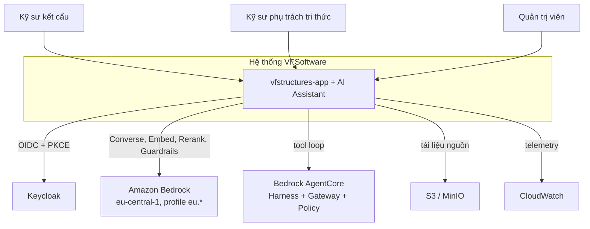

### 3.2 Giao diện ngoài

| Đối tác | Giao thức | Chiều | Nội dung |
| --- | --- | --- | --- |
| Trình duyệt → BFF | HTTPS | vào | Câu hỏi, `pageContext` |
| BFF → Assistant.Api | REST + SSE, Bearer | vào | Lượt hỏi đáp, stream sự kiện |
| Assistant.Api → Main API | REST, token người dùng chuyển tiếp | ra | Gọi engine tính toán, đọc `tool_run` |
| Assistant.Api → Authorization API | REST | ra | Quyền module |
| Assistant.Api → Payment API | REST | ra | `org_id`, subscription |
| Assistant.Api → Bedrock Runtime | AWS SDK | ra | `Converse`, `ConverseStream` |
| Assistant.Api → Bedrock Agent Runtime | AWS SDK | ra | `Retrieve` trên Managed Knowledge Base (AD-17) |
| Worker → Bedrock Agent (control) | AWS SDK | ra | `create-knowledge-base`, `create-data-source`, `start-ingestion-job` |
| Worker → S3 (chunk store) | AWS SDK | ra | Ghi một object cho mỗi chunk + `.metadata.json` sidecar |
| Assistant.Api → AgentCore | `InvokeHarness`, Bearer JWT | ra | Tool loop |
| AgentCore Gateway → Tool facade | HTTPS, OpenAPI target `vf-tools` | vào | Gọi tool đã qua Cedar |
| Worker → S3 | AWS SDK | ra | Đọc tệp nguồn |

### 3.3 Ngoài phạm vi

Sinh bản vẽ; ký hồ sơ; thay thế phán đoán kỹ sư; sinh SQL bằng mô hình; MCP server công khai; case công khai giữa các organization.

---

## 4. Chiến lược giải pháp

> **Mục này trả lời:** mỗi bài toán con giải bằng cơ chế nào, và vì sao không dùng cùng một cơ chế cho tất cả.
>
> Nguyên tắc chi phối là P5 — leo thang từ rẻ đến đắt: prompt trước, rồi RAG, rồi tool, rồi case memory. Không có fine-tuning ở bất kỳ nấc nào.
>
> **Đọc tiếp:** bảng quyết định đầy đủ kèm phương án đã loại ở §9 bên dưới.

| Vấn đề | Giải pháp | Quyết định |
| --- | --- | --- |
| Hỏi đáp tài liệu | Retrieval qua Bedrock Managed Knowledge Base, đường cố định 1 lần gọi mô hình. Worker chunking theo điều khoản và ghi chunk ra S3 kèm metadata | AD-17 |
| Tính toán | Tool calling vào engine .NET hiện có, không để mô hình tính | AD-08, P2 |
| Tra kinh nghiệm | Lọc cứng SQL rồi chấm điểm khoảng cách số học, vector chỉ tie-break | AD-09, AD-16 |
| Tool loop | AgentCore Harness; ToolGate chuyển ra facade C# vì Harness không có hook | AD-13 |
| Routing | Một lần gọi Haiku cho mọi lượt; luật chỉ là fallback | AD-15 |
| Chống bịa | Post-validation sau stream, gắn cờ thay vì xóa chữ | F6 |
| Streaming | SSE một chiều, BFF chuyển tiếp nguyên dạng | AD-07 |

---

## 5. View thành phần

> **Mục này trả lời:** hệ thống gồm những khối nào, khối nào là mới, khối nào dùng lại nguyên trạng.
>
> Điểm cần nhớ: `Main API` và engine tính toán **không bị sửa một dòng nào**. Toàn bộ phần mới nằm cạnh nó, và mọi lời gọi vào nó đều đi qua `Tool facade` để ToolGate chạy trước.
>
> **Đọc tiếp:** thi công từng khối ở [03](03-backend.md) (Backend), [04](04-frontend.md) (Frontend), [05](05-devops.md) (DevOps).

### 5.1 C4 mức 2 — Container

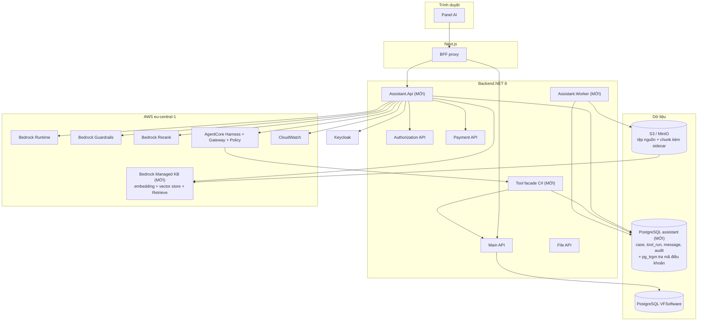

### 5.2 Trách nhiệm từng container

| Container | Trách nhiệm | Mới |
| --- | --- | --- |
| `Assistant.Api` | Điều phối lượt, routing, RAG, case memory, post-validation, phát SSE | Có |
| Tool facade C# | ToolGate 6 lớp, gọi Main API, ghi `tool_run`, `ApplyGuardrail` trên nội dung tool | Có |
| `Assistant.Worker` | Ingest tài liệu, chunking theo điều khoản, ghi chunk kèm sidecar ra S3, tổng hợp eval, tác vụ định kỳ. Embedding do MKB sinh | Có |
| Bedrock Managed KB | Embedding, vector store, `Retrieve`. Ingest từ S3 qua managed connector | Có |
| PostgreSQL `assistant` | `document`, `case`, `tool_run`, `message`, `audit_event`, bảng `clause_ref`; `pg_trgm`, `unaccent`. Kho chunk **không** còn ở đây kể từ AD-17 | Có |
| BFF proxy | Đọc cookie HttpOnly, gắn Bearer, chuyển tiếp SSE nguyên dạng | Không |
| Main API | Engine tính toán, `[ApiAccess]` | Không |
| AgentCore Harness | Tool loop, gọi Sonnet 5 | Có |
| AgentCore Gateway | Phơi tool theo OpenAPI target `vf-tools`, Cedar Policy, token exchange RFC 8693 | Có |

### 5.3 Thành phần trong `Assistant.Api`

| Thành phần | Trách nhiệm |
| --- | --- |
| `ChatOrchestrator` | State machine của lượt, phát sự kiện SSE |
| `IntentRouter` | Gọi Haiku, trả `intent`, `search_query`, `instruction`, `case_hints` |
| `ScopedKnowledgeBaseClient` | Lớp **duy nhất** được gọi `Retrieve`; scope là tham số khởi tạo bắt buộc; dựng `filter`, đặt `numberOfResults` |
| `ClauseResolver` | Regex bóc mã điều khoản, `pg_trgm` phân giải thành `clause_path` chuẩn hóa |
| `AccessScopeResolver` | Tính `scope_key`, cache trong tiến trình 60 giây |
| `CaseSimilarityScorer` | Gom tham số, lọc cứng, chấm điểm khoảng cách, top 5 |
| `NumberValidator` | Đối chiếu số trong câu trả lời với `tool_run` hoặc chunk |
| `CitationValidator` | Phân giải mọi `[n]` về `chunk_id` |
| `VerificationValidator` | Chặn nhãn "đạt" không có `tool_run` khớp |
| `ILlmClient`, `IEmbeddingClient`, `IReranker` | Ba endpoint Bedrock tách riêng |

### 5.4 Danh mục tool

| Tool | Nhóm rủi ro | Chạy ở |
| --- | --- | --- |
| `calc.*` (một tool cho mỗi phép kiểm tra) | B | Facade → Main API. Kết quả có thể vào hồ sơ, nên luôn hiện kèm tham số đầu vào và phát `approval_required` |
| `search_documents` | A | Facade → `ScopedKnowledgeBaseClient` → Bedrock Managed KB |
| `find_similar_cases` | A | Facade → PostgreSQL |
| `project.list_members(projectId)` | A | Facade → Main API. Đổi tên cấu kiện người dùng nhắc ("dầm B2") thành mã |
| `project.get_member_result(projectId, memberId, resultKind)` | A | Facade → Main API, token người dùng. Trả đầu vào, kết quả, `calcVersion`, thời điểm tính. Là dữ liệu của engine; `pageContext.outputs` chỉ dùng để phát hiện lệch (R20) |
| `standards.find_basis(toolRunId)` | A | Facade |
| `submit_recommendation` | A | Facade. Kết thúc lượt `optimize` và `explain_result` bằng các trường có kiểu: `candidateId`, `toolRunId`, `rationale`, `citationIds`. **Không có trường verdict** do mô hình điền: facade tra verdict từ `tool_run` (AD-24) |

Nguyên tắc: một tool một việc; không có tool đa chế độ với cờ `mode`.

Mỗi tool `calc.*` khai báo trong `tools.manifest.yaml` trường nào của output là verdict. Tool chưa khai báo verdict thì mô hình không được kết luận đạt/không đạt cho tool đó; validator gắn cờ mọi nhãn kết luận gắn với nó.

### 5.5 Hợp đồng tool và manifest

Mỗi tool có đủ các thành phần dưới đây. `Limits`, `Owner` và `VerdictField` là chỗ phân biệt một danh mục tool được quản trị với một tập hàm tiện ích.

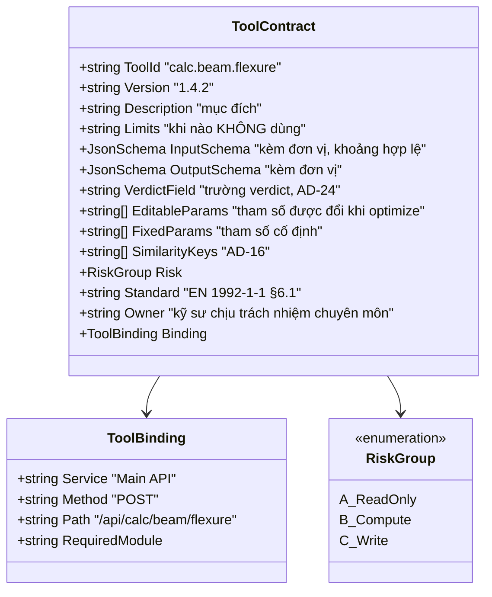

| Nhóm | Đặc điểm | Ví dụ | Kiểm soát | Trong phạm vi |
| --- | --- | --- | --- | --- |
| A — chỉ đọc | Không đổi dữ liệu | Tìm tài liệu, tìm case, đọc kết quả dự án | Mô hình gọi tự do trong phạm vi quyền của người dùng | Có |
| B — tính toán | Không đổi dữ liệu, kết quả có thể vào hồ sơ | Khả năng chịu uốn, độ võng | Gọi tự do; kết quả luôn hiện kèm tham số đầu vào; phát `approval_required` | Có |
| C — ghi | Đổi trạng thái hệ thống nghiệp vụ | Cập nhật thông số cấu kiện | Bắt buộc xác nhận; bắt buộc khóa idempotency (AD-27) | **Không** |

Ghi vào bảng của chính assistant (`case`) không phải nhóm C: đó là kho phụ trợ, không phải hồ sơ nghiệp vụ. Vẫn cần kỹ sư Duyệt vì P1.

**Registry sinh từ OpenAPI rồi chỉnh tay (AD-08).** Phần OpenAPI không tự sinh được (đơn vị, nhóm rủi ro, căn cứ tiêu chuẩn, chủ sở hữu, giới hạn áp dụng, verdict, biên tham số) nằm trong `tools.manifest.yaml`, review như code:

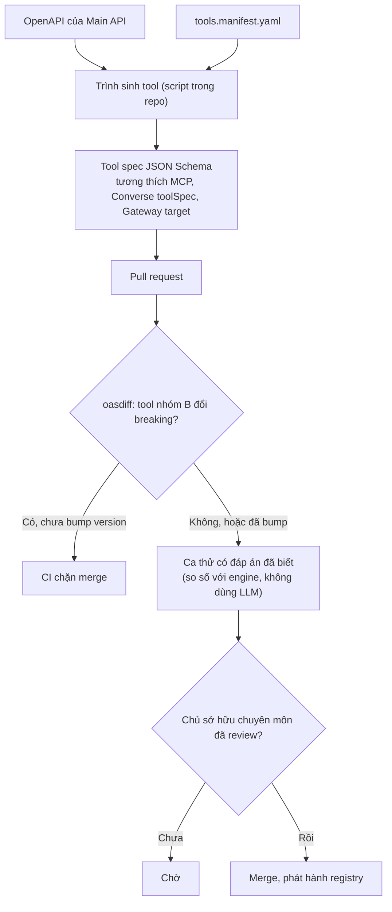

Chọn tool đầu tiên bằng RICE (Reach × Impact × Confidence ÷ Effort), do kỹ sư phụ trách và Product chấm. Loại khỏi lượt đầu các endpoint có quá nhiều tham số hoặc phụ thuộc trạng thái giao diện (canvas 2D/3D). Hai tool `project.*` là bắt buộc, vì yêu cầu 3 không làm được nếu thiếu.

**Nguyên tắc thiết kế tool:**

| Nguyên tắc | Áp dụng |
| --- | --- |
| Mô tả là giao diện của tool | Tên, tham số có kiểu và đơn vị, mục đích và **giới hạn áp dụng** là thứ mô hình đọc để quyết định gọi; viết như tài liệu API |
| Trả dữ liệu đầy đủ, không lọc trước | Trả toàn bộ output JSON của engine trong ngân sách token. `NumberValidator` cần đủ số để đối chiếu |
| Chỉ giao tool cần dùng | Mỗi request chỉ đưa tool người dùng được phép và liên quan tới intent. Ngưỡng xem lại kiến trúc: khoảng 20 tool |
| Tool độc lập gọi song song | Nhiều `toolUse` độc lập trong một vòng chạy bằng `Task.WhenAll` có giới hạn song song |
| Phần mềm cổ điển cầm lái khi quy trình đếm được | Với `explain_result`, tool cần gọi suy ra từ `pageContext.module`; mã C# gọi tool, mô hình chỉ diễn giải. Mô hình chỉ tự chọn tool ở câu hỏi mở (`calc`, `mixed`) |
| Lời diễn giải không thay bước tính | Thẻ kết quả luôn hiện giá trị trung gian của engine. Mô hình giải thích một engine tất định vẫn có thể bịa nguyên nhân nghe hợp lý |
| Không dùng MCP server bên thứ ba chưa rà soát | Mô hình không gọi API ngoài trực tiếp; mọi truy cập đi qua ToolGate |

**Thất bại của tool loop và điều khiển tương ứng:**

| Thất bại | Ví dụ | Điều khiển |
| --- | --- | --- |
| Tin đầu ra sai của tool | Tool trả số ngoài khoảng hợp lý | Engine tất định; `OutputSchema`; kiểm khoảng hợp lý theo manifest |
| Diễn giải sai kết quả đúng | Tool đúng, lời văn sai số hoặc sai kết luận | `NumberValidator`, `VerificationValidator` (AD-24) |
| Hiểu sai mục tiêu | Chọn tool cho bài toán khác | Mô tả tool nêu giới hạn áp dụng; hiện tham số đầu vào để kỹ sư đối chiếu |
| Dùng tool sai | Sai tool hoặc sai tham số | Schema, ToolGate, ranh giới chỉ đọc/tính toán |
| Không dừng đúng lúc | Lặp vô hạn | Trần vòng, trần thời gian, ToolGate lớp 05 dừng ở lần gọi trùng thứ hai (§8.12) |
| Prompt injection | Chỉ dẫn trong chunk | §8.10, [06](06-bao-mat.md) §4 |

Ranh giới quyền là điều khiển mạnh hơn prompt tốt hơn: tool chỉ đọc không xóa được gì, dù mô hình suy luận tệ đến đâu.

---

## 6. View thời gian chạy

> **Mục này trả lời:** một lượt hỏi đi qua những bước nào, rẽ nhánh ở đâu, và kết thúc theo mấy đường.
>
> Thứ tự các bước là thứ quyết định đúng sai, không phải danh sách module. Ba cổng chặn ở đầu chạy theo đúng thứ tự rẻ-trước, và một lượt có thể kết thúc mà không sinh ra chữ nào — giao diện phải chuẩn bị cho trường hợp đó.
>
> **Đọc tiếp:** cùng luồng này kể bằng lời thường ở [11](11-thuyet-minh.md) Phần 3–8 · trạng thái giao diện tương ứng ở [07](07-giao-dien.md).

### 6.1 State machine của một lượt

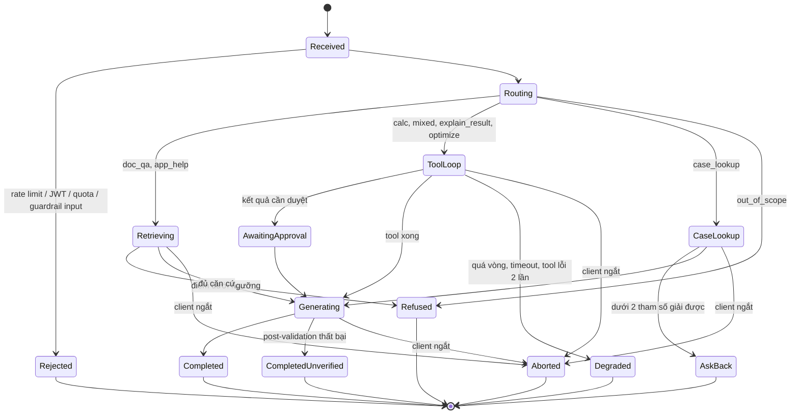

`Aborted` là trạng thái kết thúc khi client ngắt kết nối, dù do người dùng bấm Dừng hay do đóng tab, rớt mạng. Cách xử lý ở §6.7 (AD-25).

### 6.2 Routing

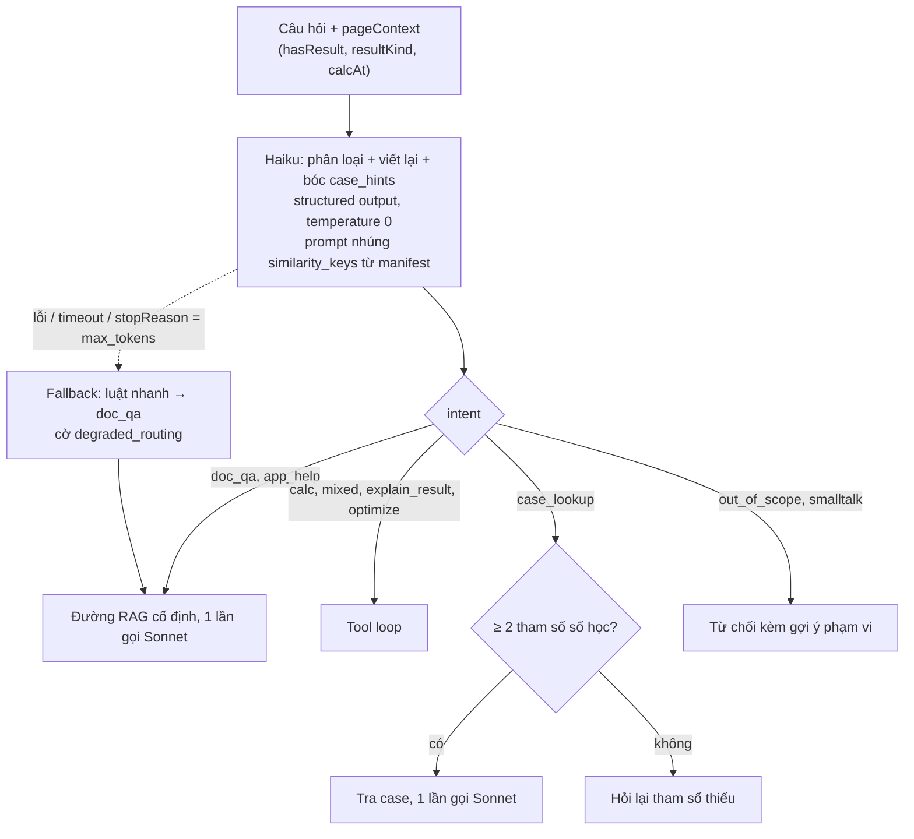

**Hợp đồng đầu ra của router**

```json
{
 "intent": "doc_qa|app_help|calc|explain_result|mixed|optimize|case_lookup|out_of_scope",
 "search_query": "string ≤ 300",
 "instruction": "string ≤ 200",
 "needs_clarification": false,
 "case_hints": {
 "tool_id": "enum từ manifest | null",
 "params": [{ "key": "enum similarity_keys", "value": 0.0, "unit": "enum đơn vị" }]
 }
}
```

### 6.3 Retrieval tài liệu (F1)

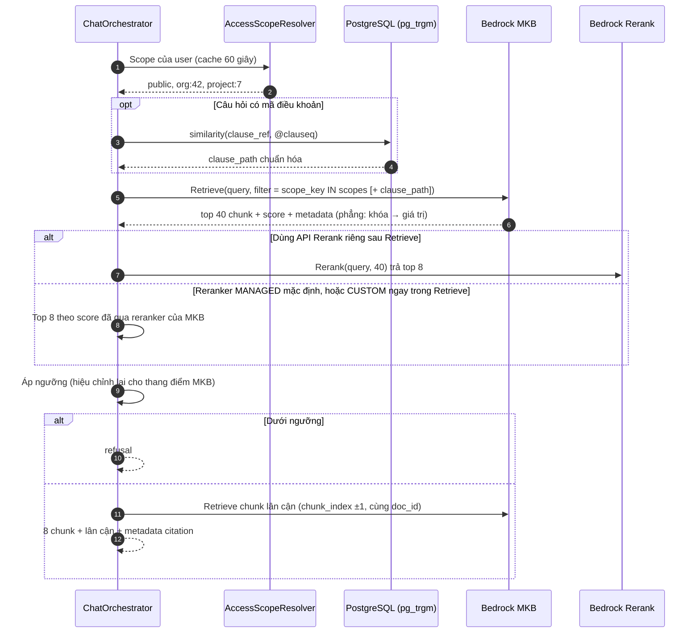

Hai stage vì MKB không có tương đương của trigram: MKB luôn tìm hybrid (nghĩa và từ khóa) nhưng không sửa được mã điều khoản gõ sai. PostgreSQL vẫn nằm trong đường retrieval để phân giải mã điều khoản gõ gần đúng. Bước rerank có thể do chính `Retrieve` làm (reranker sẵn, hoặc `rerankingModelType: CUSTOM` với Cohere), không nhất thiết là một lời gọi `Rerank` riêng như sơ đồ. Chi tiết ở §8.2

### 6.4 Tool loop (F2, F5)

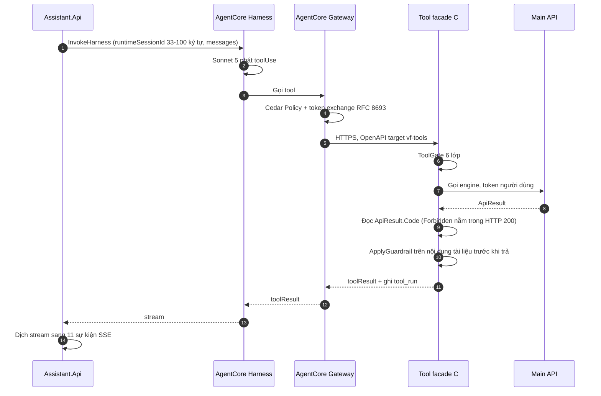

### 6.5 Tra tình huống (F3)

```
0. Gom tham số: tool_run > pageContext > case_hints
 ghi đè theo từng key, không theo cả khối
 key chỉ có nguồn case_hints → cờ unconfirmed
 < 2 key giải được → hỏi lại, dừng
1. Lọc cứng SQL: org_id, status = 'Approved', tool_id / element_type
 → ≤ 200 ứng viên
2. Chấm điểm: khoảng cách chuẩn hóa trên similarity_keys
 điểm = distance / coverage
 → top 5
3. Tie-break: vector của summary, chỉ khi câu hỏi có phần ngôn ngữ tự nhiên
4. Sonnet: so sánh và diễn giải 5 case
```

### 6.6 Ingest tài liệu (F4)

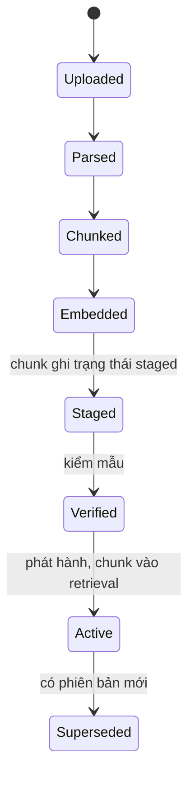

Quy tắc: một `ingestion_job` cho một tài liệu; ghi chunk theo lô trong một transaction; chạy lại cùng job không tạo bản sao; đọc theo từng trang, không nạp cả tệp; không cắt giữa bảng.

### 6.7 Khi client ngắt kết nối giữa lượt (AD-25)

Có ba cách một lượt mất người đọc: bấm **Dừng**, đóng tab hoặc tải lại trang, và rớt mạng. Với backend, cả ba trông giống nhau: kết nối HTTP đóng lại. Vì vậy chỉ có một đường xử lý, không tách theo nguyên nhân.

Nếu không xử lý, lượt vẫn chạy tiếp: Sonnet vẫn sinh chữ, tool loop vẫn gọi engine, và toàn bộ số token đó vẫn bị tính tiền cho một câu trả lời không ai đọc. Đây là một nhánh của denial-of-wallet: mở rồi đóng tab liên tục cũng đốt được tiền, dù không vượt rate limit.

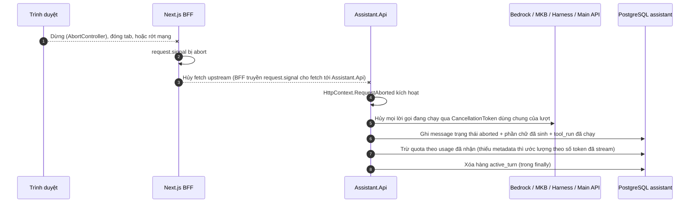

| Quy tắc | Lý do |
| --- | --- |
| Mỗi lượt có **một** `CancellationToken`, tạo bằng cách nối `HttpContext.RequestAborted` với token timeout của lượt. Mọi lời gọi ra ngoài (`ConverseStream`, `Retrieve`, `InvokeHarness`, Main API, PostgreSQL) nhận token này | Quên truyền token ở một lời gọi thì lời gọi đó chạy tới hết, và không có lỗi nào báo ra |
| Route BFF truyền `request.signal` vào `fetch` tới `Assistant.Api` | Nếu thiếu, trình duyệt đã đóng nhưng BFF vẫn giữ kết nối upstream mở, và backend không bao giờ thấy client ngắt |
| Ghi `message` trạng thái `aborted` kèm phần chữ đã sinh; `tool_run` đã chạy xong vẫn giữ nguyên | Người dùng tải lại trang thấy lượt dở dang qua `GET /v1/conversations/{id}` và hỏi tiếp từ đó, không phải dựng lại ngữ cảnh |
| Không chạy post-validation cho lượt `aborted`; giao diện hiện phần chữ đó kèm nhãn "chưa hoàn tất" | Validator kiểm câu trả lời hoàn chỉnh. Chạy trên câu cụt sẽ gắn cờ oan hàng loạt |
| **Không** hỗ trợ nối lại stream đang chạy trong v1 | Muốn nối lại phải cho lượt chạy tiếp sau khi client ngắt và lưu đệm sự kiện theo `Last-Event-ID`. Làm vậy tốn tiền cho mọi lượt bị bỏ, để phục vụ một số ít lượt có người quay lại |
| Đóng **panel** không phải là ngắt kết nối | Hook stream nằm ở store của app, không nằm trong panel. Đóng panel thì stream vẫn chạy, mở lại vẫn thấy tiếp ([07](07-giao-dien.md)) |

**Phần chưa biết:** hủy việc đọc stream `InvokeHarness` có dừng tool loop ở phía AWS hay không. Nếu không dừng, Harness chạy tiếp tới `maxIterations` hoặc `timeoutSeconds` (§8.4), và phần đó vẫn tính tiền. Hai trần này giới hạn thiệt hại tối đa, nhưng không cắt được nó. V-A11 kiểm việc này.

### 6.8 Chuyển ấn bản tài liệu (AD-26)

Một tiêu chuẩn có thể có nhiều ấn bản cùng nằm trong kho: EN 1992-1-1:2004 và bản thay thế, tiêu chuẩn nội bộ v1 và v2. Similarity score không biết bản nào đang có hiệu lực. Hai đoạn trích từ hai ấn bản có thể giống nhau gần hết và khác đúng một hệ số.

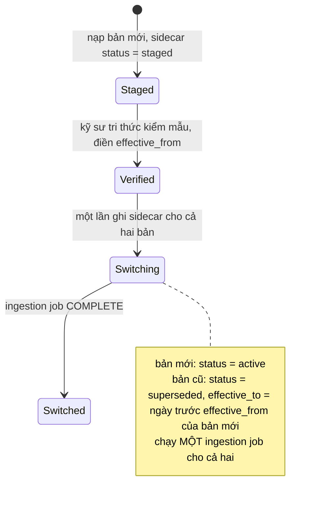

Trong lúc ingestion job đang chạy, `Retrieve` có thể trả về chunk của cả hai bản cùng `status = active`, vì MKB cập nhật từng tài liệu chứ không cập nhật cả job một lúc. `ScopedKnowledgeBaseClient` chặn trường hợp này bằng mã tất định: cùng `family_key` mà có hai `edition` cùng `active` thì chỉ giữ bản có `effective_from` lớn hơn, ghi `audit_event` loại `edition_conflict`, và bắn cảnh báo vận hành. Cảnh báo này kéo dài quá thời gian một ingestion job nghĩa là việc chuyển ấn bản đã hỏng giữa chừng.

Hai chế độ retrieval:

| Chế độ | Khi nào | Filter |
| --- | --- | --- |
| Hiện hành (mặc định) | Câu hỏi chung, không gắn dự án | `status = active` |
| Theo dự án | Lượt gắn một dự án có ấn bản áp dụng | `edition` = ấn bản dự án áp dụng, `status in [active, superseded]` |

Ấn bản dự án áp dụng lấy từ Main API bằng token người dùng, **không** lấy từ `pageContext.codeStandard`, vì `pageContext` là dữ liệu client gửi lên ([02](02-hop-dong.md) §3). Dự án thiết kế theo bản cũ thì phải nhận đoạn trích của bản cũ. Trả bản mới kèm một warning là sai về chuyên môn, vì kỹ sư đang kiểm hồ sơ theo bản cũ. Ở chế độ theo dự án, nếu kho có bản mới hơn thì phát thêm warning `standard_version_mismatch`, để kỹ sư biết có bản thay thế.

### 6.9 Gợi ý phương án có kiểm chứng (F2, intent `optimize`)

Yêu cầu 4: gợi ý điều chỉnh tiết diện hoặc cốt thép, và phải qua bộ tính trước khi nói "đạt". Trợ lý không ghi vào hồ sơ (không có tool ghi), nên kỹ sư tự áp dụng phương án đã chọn.

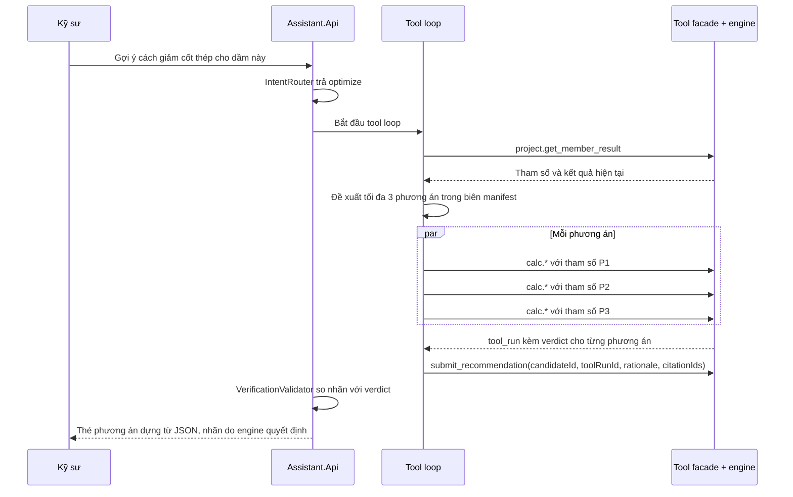

| Quy tắc | Nội dung |
| --- | --- |
| Chỉ engine kết luận | Nhãn đạt, không đạt, chưa kiểm chứng của mỗi phương án lấy từ verdict của `tool_run` (AD-24) |
| Nhãn nói đúng điều engine đã làm | Thẻ ghi "Đạt các kiểm tra của engine" và liệt kê điều engine **không** kiểm (cấu tạo, thi công, phụ lục quốc gia, trạng thái giới hạn chưa lập trình), không ghi chữ "Đạt" trần (R34) |
| Tối đa 3 phương án mỗi lượt | Mỗi phương án một lời gọi tool; các lời gọi độc lập chạy song song trong cùng một vòng, nằm trong trần 7 vòng và 90 giây (§8.4) |
| Biên thay đổi | Manifest khai báo tham số được đổi (tiết diện, đường kính và số thanh) và tham số cố định (cường độ vật liệu, tiêu chuẩn, tải trọng). Đề xuất ngoài biên bị ToolGate lớp 03 chặn |
| Chủ sở hữu manifest có chữ ký | Biên tham số do kỹ sư kết cấu có thẩm quyền ký. Chưa có người ký thì yêu cầu 4 không bật (R38) |
| Module chưa có tool | Trả "chưa hỗ trợ kiểm chứng cho module này", không đề xuất thứ không kiểm chứng được |
| Hai loại chứng cứ không trộn | Chứng cứ tính toán gắn mã `[P1]`, `[P2]` trỏ về `tool_run`; chứng cứ tài liệu gắn `[1]`, `[2]` trỏ về chunk; kinh nghiệm nội bộ gắn nhãn "Kinh nghiệm nội bộ, không phải tiêu chuẩn" |
| Truy vấn tìm căn cứ dựng bằng mã | `standards.find_basis(toolRunId)` dựng truy vấn từ `standardRef` và điều khoản mà engine đã kiểm, không để mô hình tự viết truy vấn. Nhóm J của eval so hai cách ([08](08-eval-quan-sat.md)) |
| Ghi rõ là đề xuất | Thẻ và lời văn ghi đây là đề xuất; kỹ sư chịu trách nhiệm quyết định (P1) |

### 6.10 Vòng đời và ghi nhận case (F3)

Case chỉ sinh từ một `tool_run` nhóm B khi kỹ sư bấm Duyệt. Mô hình không tự ghi case (P1). Nguồn dữ liệu là input và output của tool đã qua validate, nên chất lượng cấu trúc không phụ thuộc vào kỷ luật nhập tay.

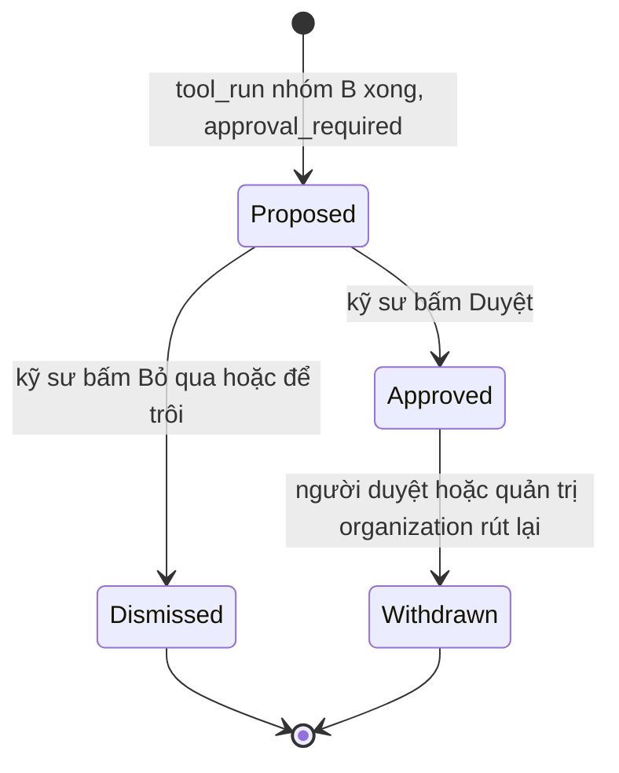

Chỉ case `Approved` xuất hiện khi tra cứu.

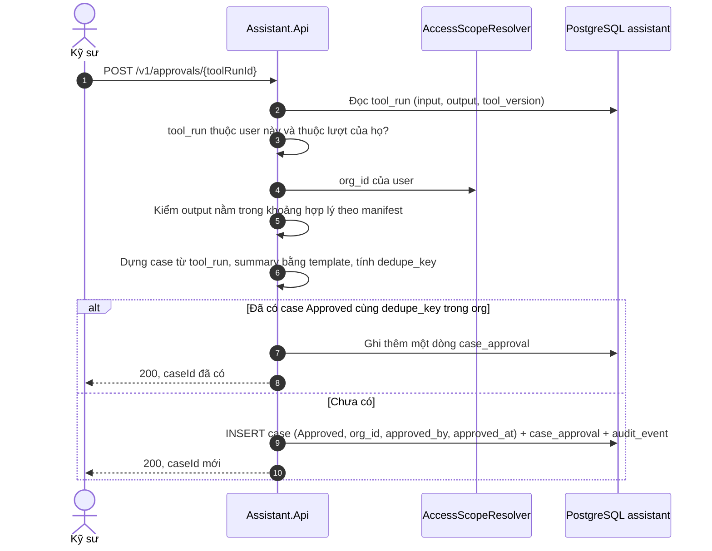

**Bảng dữ liệu kèm theo:** `case_standard` (`case_id`, `standard_code`, `edition`, `clause`) giữ căn cứ tiêu chuẩn của case; `case_approval` (`case_id`, `user_id`, `at`, `action` là `approve` hoặc `withdraw`) giữ mọi lần duyệt và rút. Case lưu `project_id` (định danh), không lưu tên dự án. Dự án bị xóa ở Main API thì case đánh dấu `project_deleted` và xóa theo retention.

**Chống đầu độc kho case (R26):**

| Rủi ro | Điều khiển |
| --- | --- |
| Case sai được duyệt rồi kéo lệch các câu trả lời sau | Chỉ người có quyền trong organization duyệt được; case gắn người duyệt, thời điểm, phiên bản tool; kiểm khoảng hợp lý của output khi ghi; nút Rút lại; quản trị organization rút hàng loạt được |
| Case lỗi thời so với tiêu chuẩn | Ngày duyệt cũ hơn ấn bản hiện hành thì thẻ case mang cảnh báo "có thể theo tiêu chuẩn cũ"; hết hạn sau một thời gian cấu hình được |
| Lưu quá nhiều | Chỉ lưu case đã duyệt, không lưu mọi tương tác. `dedupe_key` chặn trùng chính xác; gộp case gần trùng để sau beta (§11.3) |
| Xóa theo yêu cầu | Xóa cứng theo `org_id`, ghi `audit_event` bản xóa |

Theo phân loại bộ nhớ CoALA (sách *AI Agents on AWS* ch03): kho tài liệu là bộ nhớ ngữ nghĩa (scope `public`, `org:*`, `project:*`); kho case là bộ nhớ episodic, scope `org:{id}` và không bao giờ rộng hơn; bộ nhớ thủ tục chưa có.

**Chưa chốt: vector của summary nằm ở đâu.** §6.5 dùng vector của summary để tie-break, nhưng §7 ghi PostgreSQL không cần `pgvector` vì vector store của tài liệu đã sang MKB. Hai dòng này mâu thuẫn. Hai cách xử lý: (1) bật `pgvector` chỉ cho bảng `case`, tức thêm một extension và một lời gọi embedding khi duyệt; (2) bỏ tie-break bằng vector, chỉ giữ chấm khoảng cách số học. Chốt bằng nhóm D của eval: tie-break không làm tăng độ đúng thì chọn (2).

---

## 7. View triển khai

> **Mục này trả lời:** thứ gì chạy ở đâu trên AWS, và mạng phải mở những đường nào.
>
> Hai chỗ chỉ hỏng ở production: SSE bị proxy gom lại thành một cục, và phiên agent không khởi động vì thiếu VPC endpoint. Cả hai không báo lỗi ở môi trường dev.
>
> **Đọc tiếp:** thủ tục dựng từng hạ tầng ở [05](05-devops.md) · môi trường, CI/CD và phát hành ở [09](09-trien-khai.md).

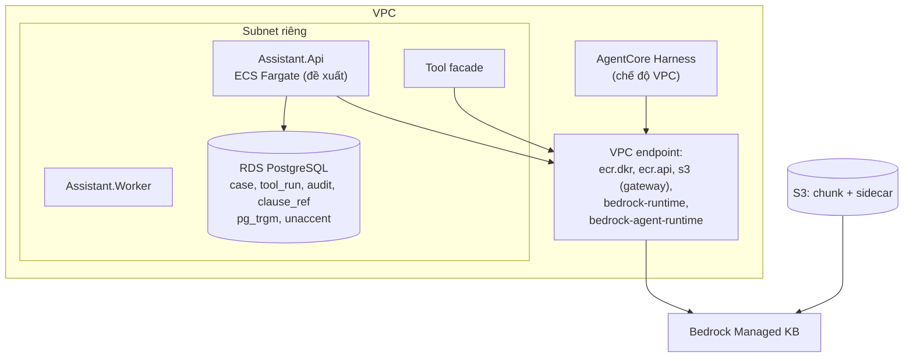

| Hạng mục | Giá trị |
| --- | --- |
| Region | `eu-central-1` |
| Cơ sở dữ liệu | RDS PostgreSQL hoặc Aurora PostgreSQL; **không** Aurora DSQL |
| Kho chunk | Bedrock Managed KB, nạp từ S3 qua managed connector (AD-17) |
| Extension PostgreSQL | `pg_trgm`, `unaccent`. **Không cần `pgvector`** — vector store nằm ở MKB |
| CloudTrail | Data event cho `AWS::Bedrock::KnowledgeBase` bật ngay lúc tạo KB — `Retrieve` mặc định **không** ghi |
| Chạy container | ECS Fargate là mặc định đề xuất; topology production chưa chốt (GĐ-7) |
| Mạng của Harness (chế độ VPC) | **Không cần NAT gateway để kéo image.** Ở chế độ VPC, Harness kéo image từ ECR riêng qua endpoint `ecr.dkr`, `ecr.api`, `s3` (gateway) và `bedrock-runtime`; thiếu endpoint thì phiên không khởi động được. Execution role cần quyền pull repo `harness-*` (V-A10 đã trả lời, xem [05](05-devops.md) mục 4C) |
| VPC endpoint cho `Retrieve` | `bedrock-agent-runtime`. `Retrieve` không đi qua `bedrock-runtime` |
| Job nền | Bảng PostgreSQL + `FOR UPDATE SKIP LOCKED`; không có broker |
| Kết nối DB | `NpgsqlDataSource` singleton; RDS Proxy hoặc PgBouncer khi nhiều instance |
| Tác vụ định kỳ | ECS scheduled task hoặc `BackgroundService` trong Worker, tách khỏi tiến trình phục vụ |

---

## 8. Khái niệm xuyên suốt

> **Mục này trả lời:** các cơ chế dùng lại ở nhiều nhánh — mô hình dữ liệu, tham số truy xuất, ToolGate, post-validation, phân quyền.
>
> Đây là mục dài nhất tài liệu, và cũng là nơi giữ bản chuẩn của những thứ hay bị chép lại: bảng sáu mặc định Harness (§8.4) và bảng sáu lớp ToolGate (§8.5) chỉ tồn tại một bản ở đây.
>
> **Đọc tiếp:** hợp đồng SSE bản ký ở [02](02-hop-dong.md) §4 · bảo mật và phân quyền đầy đủ ở [06](06-bao-mat.md).

### 8.1 Mô hình dữ liệu

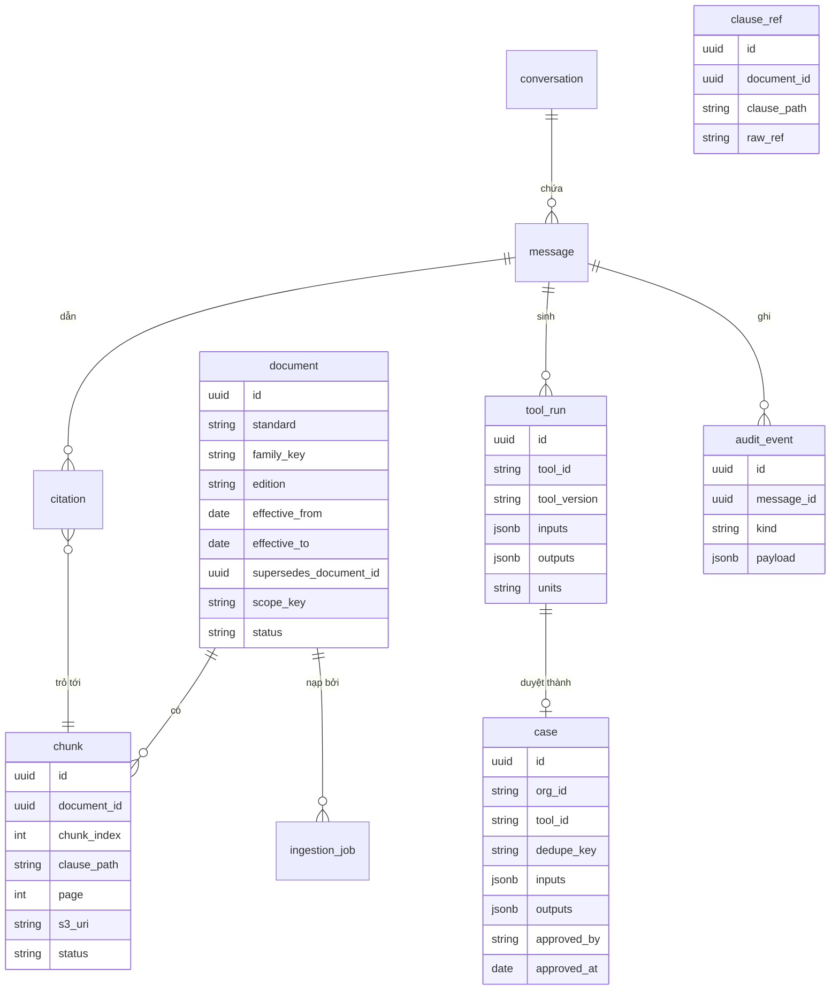

`effective_from` và `effective_to` có kiểu `date` trong PostgreSQL, nhưng ghi sang sidecar dạng `NUMBER` `yyyymmdd`, vì filter của MKB chỉ so lớn/nhỏ trên số (§8.2). `tool_run` có thêm cột `tool_use_id` (unique) cho AD-27.

### 8.2 Chỉ mục và tham số retrieval

| Hạng mục | Giá trị |
| --- | --- |
| Kho chunk và embedding | Bedrock MKB, `type: MANAGED`. `embeddingModelType` theo hai nhánh AD-06: `MANAGED` mặc định, `CUSTOM` + `embeddingModelArn` (1024 chiều, float32) nếu đo không đạt. **Nhánh `CUSTOM` mất managed reranker**, nên chốt cùng lúc với lựa chọn rerank |
| Data source | `MANAGED_KNOWLEDGE_BASE_CONNECTOR`, `connectorParameters.type = S3`, `version: "1"`, `connectionConfiguration` mang `bucketName` và `bucketOwnerAccountId` |
| Trình tự tạo | `create-knowledge-base` → `ACTIVE` → `create-data-source` → `AVAILABLE` → `start-ingestion-job` → `COMPLETE`. Cả ba đều bất đồng bộ |
| Metadata lọc được | `standard`, `family_key`, `edition`, `effective_from`, `effective_to`, `clause_path`, `page`, `scope_key`, `status`, `chunk_type`, `doc_id`, `chunk_index`. Mỗi thuộc tính phải **có trong sidecar** của chunk khi nạp. Không đặt tên bắt đầu bằng `_` (MKB dành riêng) |
| Loại tài liệu | `doc_type`: `standard`, `internal_procedure`, `app_help`. Intent `doc_qa` lọc `standard` và `internal_procedure`; intent `app_help` lọc `app_help`. Không trộn hướng dẫn phần mềm với điều khoản tiêu chuẩn |
| Tài liệu hướng dẫn VF (`app_help`) | Thêm `app_version`, `module`, `ui_path` (đường đi menu). Scope `public`. Cắt theo tiêu đề và giữ nguyên vẹn danh sách bước thao tác. Câu trả lời nêu phiên bản VF của tài liệu; khác phiên bản người dùng đang chạy thì cảnh báo (R36). Tính năng không có trong tài liệu thì từ chối, không suy đoán |
| Bản quyền | `license_tag` trên `document`; chỉ vai trò `Assistant.Curate` nạp được tài liệu (Q2, R2) |
| Ngày hiệu lực (AD-26) | `effective_from` và `effective_to` ghi dạng `NUMBER` theo `yyyymmdd`, vì filter chỉ so sánh lớn/nhỏ trên số (`greaterThan`, `lessThanOrEquals`...). Bản còn hiệu lực ghi `effective_to = 99991231`, **không** bỏ trống: filter trên thuộc tính thiếu có thể trả rỗng mà không báo lỗi (R47). `family_key` gom các ấn bản của cùng một tiêu chuẩn, kèm phụ lục quốc gia (ví dụ `EN1992-1-1+NA-FR`) |
| Sidecar | `{tên file chunk}.metadata.json`, tối đa **10 KB**. Định dạng có kiểu: `"page": { "value": { "type": "NUMBER", "numberValue": 84 } }` |
| Lọc quyền | `filter` `andAll` gồm `in` trên `scope_key` và `equals` trên `status`, dựng trong `ScopedKnowledgeBaseClient`, đặt ở `retrievalConfiguration.managedSearchConfiguration.filter`. Chỉ dùng `equals`, `notEquals`, `in`, `notIn` và toán tử số. `startsWith` và `stringContains` **không được hỗ trợ** trên managed KB (báo lỗi hay bị bỏ qua: chưa kiểm chứng, V-K4); `listContains` cấm theo thận trọng |
| `numberOfResults` | Đặt tường minh 40 (miền hợp lệ 1–100). Trang managed không nêu mặc định; tài liệu chung ghi **5** |
| `overrideSearchType` | **Không tồn tại** trên managed KB. MKB luôn hybrid (V-K5 đã trả lời) |
| Ngưỡng điểm | **Không phải tham số API.** Mã của mình so `score` của từng kết quả với ngưỡng, bắt đầu 0.5 rồi hiệu chỉnh. Số 0.7 là thang cosine của pgvector, không chuyển sang MKB được |
| Trigram | `pg_trgm` trên `clause_ref` trong PostgreSQL, phân giải mã điều khoản trước khi gọi `Retrieve` |
| Rerank | `rerankingModelType`: `MANAGED` (mặc định, không tính thêm tiền, chỉ khi dùng embedding do AWS quản), `CUSTOM` (Cohere Rerank 3.5, truyền ngay trong `Retrieve`), hoặc `NONE`. Reranker `MANAGED` **bật sẵn** dù không có cờ nào, nên cờ tính năng chỉ chọn *reranker nào* chứ không quyết định *có rerank hay không*. Muốn tắt hẳn thì `NONE`. `score` trả về đã qua reranker nên ngưỡng 0.5 phải hiệu chỉnh trên thang đó. Top 8 |
| Ngưỡng từ chối | Bắt đầu 0.5, hiệu chỉnh bằng golden set. Thang điểm của MKB không giống thang cosine |
| Tiền tố chunk | `EN 1992-1-1:2004 · 6.2.2 Cắt · trang 84`, gắn vào nội dung chunk trước khi đẩy lên S3 |

### 8.3 Routing mô hình

| Tác vụ | Mô hình | Ghi chú |
| --- | --- | --- |
| Routing, viết lại câu hỏi, bóc `case_hints` | `eu.anthropic.claude-haiku-4-5-20251001-v1:0` | Structured output, `temperature 0`, `MaxTokens` 300–400 |
| Trả lời, tool loop | `eu.anthropic.claude-sonnet-5` | Không có structured output; chỉ có tool-use schema |
| Fallback | Sonnet 4.6 | |
| Embedding | Nhánh A: `MANAGED`, AWS chọn. Nhánh B: `CUSTOM` với Cohere Embed v4, Titan Text Embeddings V2 hoặc Cohere Embed Multilingual v3 | Chốt bằng đo trước khi tạo KB. Nhánh B thêm `bedrock:InvokeModel` cho role của KB |
| Rerank | Reranker sẵn của MKB, hoặc Cohere Rerank 3.5 | Mô hình rerank riêng chỉ có ở Frankfurt trong EU. Reranker sẵn chỉ dùng được với embedding `MANAGED` |

Mọi lần gọi đặt `MaxTokens` tường minh. Bỏ trống là lấy trần của mô hình và giữ chỗ quota theo trần đó: quota được giữ theo `input + maxTokens` ngay khi request bắt đầu, đây là nguyên nhân phổ biến nhất của `ThrottlingException`.

**Tham số theo tác vụ** (khởi điểm, hiệu chỉnh bằng golden set):

| Tác vụ | Mô hình | `MaxTokens` | Thinking | Nhiệt độ |
| --- | --- | --- | --- | --- |
| Routing, viết lại câu hỏi, `case_hints` | Haiku 4.5 | 300–400 | — | 0 |
| Trả lời RAG | Sonnet 5 | ~1 500 | Tắt | 0–0,2 |
| Tool loop | Sonnet 5 | ~4 000 mỗi vòng (thinking tính vào `MaxTokens`) | `adaptive` + `output_config.effort = low`, truyền qua `additionalModelRequestFields` | Thấp |
| So sánh case | Sonnet 5 | ~1 500 | Tắt | 0–0,2 |

Hạn chế tham số lấy mẫu của Sonnet 5 khi bật thinking chưa có trên trang AWS; kiểm ở giai đoạn đầu.

**Đầu ra có cấu trúc với Sonnet 5.** Sonnet 5 trên Bedrock không có structured output (Haiku 4.5 có). Thứ tự dùng, từ rẻ đến đắt: (1) tool use với JSON Schema (`toolSpec`), mặc định; (2) luôn kiểm lại bằng `System.Text.Json` + FluentValidation; (3) hỏng thì nhắc lại một lần kèm lỗi validation, tính vào trần vòng; (4) vẫn hỏng thì dùng giá trị mặc định an toàn hoặc từ chối.

### 8.4 Sáu mặc định Harness phải ghi đè

| Tham số | Mặc định | Đặt thành | Bỏ qua thì |
| --- | --- | --- | --- |
| Model | `global.anthropic.claude-sonnet-4-6` | `eu.anthropic.claude-sonnet-5` + `converse_stream` | Request route ra ngoài EU, vi phạm residency (Q1) |
| `maxIterations` | 75 | 5 (`explain_result`) / 7 (`calc`, `mixed`) | Một lượt chạy tới khi hết token |
| `timeoutSeconds` | 3600 | 60 / 90 | Một lượt chạy một tiếng |
| `shell`, `file_operations` | Bật | Loại khỏi danh sách tool | Tốn ~900 token mỗi request, và cho mô hình quyền chạy lệnh |
| Memory | Gọi API mà bỏ trống `memory` thì service tạo managed memory (AgentCore CLI mặc định tắt) | `disabled` | Hai kho hội thoại song song, phí AgentCore Memory |
| Xác thực | SigV4 | `CUSTOM_JWT`. AWS bắt buộc ít nhất một ràng buộc (audience, client, scope hoặc custom claim) và kiểm đủ mọi ràng buộc đã đặt. Thiết kế này đặt **cả** `allowedClients` và `allowedAudience` | Chỉ đặt một ràng buộc thì token hợp lệ của client hoặc audience khác vẫn qua được |

Không đụng vào sáu chỗ này thì hệ thống **vẫn chạy** — chỉ là chạy sai, và không có lỗi nào báo ra để biết. Đây là loại lỗi khó phát hiện nhất: mọi thứ trông bình thường cho tới khi có sự cố hoặc audit.

`runtimeSessionId`: 33–100 ký tự. `idleRuntimeSessionTimeout`: 900 giây.

### 8.5 ToolGate — sáu lớp

| Lớp | Kiểm | Khi trượt |
| --- | --- | --- |
| 01 | Schema tham số | Lỗi mô tả kèm schema |
| 02 | Quyền: user có được gọi tool này | 403 |
| 03 | Biên tham số theo manifest | Lỗi kèm khoảng hợp lệ |
| 04 | **Đơn vị bắt buộc** | Từ chối, không suy diễn đơn vị |
| 05 | Chống lặp: băm `(tool_id, tham số)`, quá hai lần trùng | Dừng kèm lỗi cụ thể |
| 06 | Đọc `ApiResult.Code` (`Forbidden` nằm trong HTTP 200) | Ánh xạ thành 4xx |

Lớp 04 và lớp 06 nguy hiểm hơn bốn lớp còn lại, vì cả hai đều là chỗ hệ thống có thể **sai mà vẫn trông như đúng**.

Lớp 04: mô hình thấy `b = 0.3` có thể hiểu là 0,3 mét hoặc 0,3 milimét. Đoán sai lệch một nghìn lần, nhưng engine vẫn tính ra một con số, và con số đó vẫn trông hợp lý trên màn hình. Không có cách nào phát hiện sai số đó sau khi đã tính — nên quy tắc là chặn **trước khi** gọi engine: thiếu đơn vị thì từ chối, không suy diễn.

Lớp 06: Main API hiện tại trả lỗi `Forbidden` **bên trong thân một phản hồi HTTP 200**. Về mặt giao thức, request đó "thành công" — mọi lớp hạ tầng phía trước (load balancer, Gateway, Cedar) chỉ nhìn mã trạng thái HTTP, không mở thân phản hồi ra đọc. Không bắt ở lớp 06 thì lỗi quyền trôi thẳng vào `toolResult`, và mô hình diễn giải nó như dữ liệu hợp lệ.

ToolGate nằm ở facade C#, không nằm trong Harness: Harness không có hook.

### 8.6 Post-validation

| Validator | Điều kiện đạt | Khi trượt |
| --- | --- | --- |
| `NumberValidator` | Mỗi số khớp `tool_run` (`relTol` 0.005) **hoặc** nằm nguyên văn trong chunk mà **chính câu đó** trích. Câu không có `[n]` thì chỉ chấp nhận số từ `tool_run` | `warning: unverified_number`, trạng thái `CompletedUnverified` |
| `CitationValidator` | Mọi `[n]` phân giải về một chunk **đã retrieval trong lượt này**, không chỉ là một `chunk_id` có trong kho | `warning: unverified_citation` |
| `VerificationValidator` | Mọi nhãn kết luận trong văn bản khớp **verdict** của `tool_run` được tham chiếu, không chỉ khớp tham số (AD-24) | `warning: unverified_verdict` |
| Kiểm phiên bản | Ấn bản của citation khớp chế độ retrieval ở §6.8: hiện hành, hoặc ấn bản dự án áp dụng | `warning: standard_version_mismatch` |

Post-validation chạy **sau khi stream kết thúc**. Gắn cờ, không xóa chữ đã hiện.

**Ba mức kiểm một citation.** Validator lúc chạy thật chỉ phủ được hai mức đầu:

| Mức | Câu hỏi | Kiểm ở đâu |
| --- | --- | --- |
| 1 | Citation có tồn tại và thuộc lượt này không | `CitationValidator`, mọi lượt |
| 2 | Chunk được trích có chứa số và mã điều khoản mà câu nêu không | `NumberValidator` và so mã điều khoản, mọi lượt |
| 3 | Chunk được trích có **chứng minh** câu đó không | Giám khảo LLM: eval offline trong CI và lấy mẫu 5–10% lượt thật ([08](08-eval-quan-sat.md) §8). **Không** chạy trên mọi lượt: mỗi câu tốn thêm một lần gọi mô hình, và kết quả không tất định nên không dùng làm cổng chặn được |

Mức 3 trượt ở eval thì lượt đó không bị gắn cờ lúc chạy. Cái giá này được chấp nhận vì đã có hai lớp khác: số luôn đến từ engine (P2), và kỹ sư mở được đúng trang để tự đối chiếu.

**Kiểm kết luận (AD-24).** `NumberValidator` xác nhận được `M = 125 kNm` khớp engine, nhưng không biết câu "dầm đạt" có đúng hay không. Hai việc này tách riêng:

| Câu hỏi | Nguồn sự thật |
| --- | --- |
| Con số có đúng không | Engine, qua `tool_run.outputs` |
| Con số có thỏa điều kiện thiết kế không | Engine, qua trường verdict khai báo trong manifest (ví dụ `verdict`, `utilization`) |
| Diễn giải vì sao | Mô hình, có citation |

Vì vậy thẻ kết quả hiện nhãn đạt/không đạt **từ `tool_result`**, không từ văn bản mô hình. Validator chỉ là lớp thứ hai: dò nhãn kết luận trong văn bản (tiếng Pháp và tiếng Anh: *conforme*, *vérifié*, *satisfait*, *passes*, *adequate*, *OK*, *safe*, kể cả dạng phủ định) rồi so với verdict. Dò từ khóa không bao giờ bắt đủ, nên không được là lớp duy nhất.

### 8.7 Hợp đồng SSE — 11 sự kiện

Một lượt phát 11 loại sự kiện: `status`, `retrieval`, `token`, `tool_call`, `tool_result`, `approval_required`, `citation`, `refusal`, `warning`, `error`, `done`.

**Bảng payload đầy đủ và bốn chuỗi sự kiện hợp lệ nằm ở [02](02-hop-dong.md) §4 — bản đó là bản đúng, và 11 sự kiện không đổi từ v1.** Tài liệu này cố ý không chép lại bảng: hai bản song song thì sớm muộn lệch nhau, và lúc lệch thì hợp đồng giữa hai đội mất hiệu lực.

Ràng buộc kiến trúc kèm theo: giao diện dựng thẻ từ JSON, không phân tích chữ trong `token`.

### 8.8 Xác thực và phân quyền

| Lớp | Cơ chế |
| --- | --- |
| Trình duyệt → BFF | Cookie HttpOnly |
| BFF → Assistant.Api | Bearer JWT Keycloak |
| Assistant.Api → Main API | Chuyển tiếp token người dùng, `[ApiAccess]` áp dụng nguyên trạng |
| Assistant.Api → AgentCore | `CUSTOM_JWT`, `allowedClients` + `allowedAudience` |
| Gateway → facade | Token exchange RFC 8693 |
| Gateway → tool | Cedar Policy |
| Bedrock | IAM condition key `bedrock:GuardrailIdentifier` bắt buộc cho mô hình chat |
| Role | `assistant-runtime` (có điều kiện guardrail), `assistant-ingest` (không có, vì mô hình embedding không hỗ trợ guardrail) |

`GuardrailVersion` thiếu thì guardrail không chạy và không báo lỗi. Test CI kiểm cả đường embedding.

### 8.9 Scope dữ liệu

| Kho | Mức scope |
| --- | --- |
| `chunk` | `public`, `org:*`, `project:*` |
| `case` | Chỉ `org_id`. Không có case công khai |

`org_id` lấy từ Payment API. Không tin `org_id` do client gửi.

**Lớp chặn thứ hai sau `Retrieve`.** Từ AD-17, filter `scope_key` là lớp chặn duy nhất giữa các organization (R46). Sau mỗi lần `Retrieve`, `ScopedKnowledgeBaseClient` kiểm lại `scope_key` trong metadata của **từng** chunk trả về với danh sách scope của người dùng. Chunk nằm ngoài danh sách thì bị loại trước khi vào ngữ cảnh, kèm `audit_event` loại `scope_violation` và cảnh báo mức cao nhất. Việc này tốn vài phép so sánh chuỗi. Nó không thay filter, nhưng biến lỗi "trả tài liệu của org khác mà không báo gì" thành lỗi có cảnh báo.

### 8.10 Chống đầu độc và prompt injection

Nội dung của `search_documents` và `find_similar_cases` đi qua `ApplyGuardrail` (đầu vào) **trước khi** vào `toolResult`. Bị chặn thì trả lỗi mô tả thay cho nội dung. Summary của case sinh bằng **template**, không bao giờ bằng mô hình.

**Tóm tắt lịch sử hội thoại (AD-22).** Đây là chỗ duy nhất mô hình viết ra một văn bản được dùng lại ở lượt sau. Quy tắc:

- Tóm tắt chỉ sống trong **một** conversation. Không ghi vào `case`, không dùng cho conversation khác, không dùng cho người dùng khác.
- Lưu kèm cờ `derived = true` và danh sách `message_id` nguồn.
- Không phải nguồn số hợp lệ: `NumberValidator` không chấp nhận một con số chỉ có trong tóm tắt. Muốn dùng lại số của lượt cũ thì phải trỏ về `tool_run` của lượt đó.
- Không phải nguồn tham số case: thứ tự ưu tiên `tool_run` > `pageContext` > `case_hints` (AD-16) không có chỗ cho tóm tắt.

Nhờ vậy, người dùng nói sai một điều ("dự án dùng thép loại X") thì điều sai đó chỉ ảnh hưởng hội thoại hiện tại, không vào bộ nhớ dài hạn. Bộ nhớ dài hạn duy nhất của hệ thống là kho case, và kho đó chỉ nhận dữ liệu từ `tool_run` qua thao tác Duyệt có danh tính.

### 8.11 Chạy lại an toàn (AD-27)

Retry ở tầng hạ tầng là chuyện bình thường: Gateway hết timeout nhưng facade đã chạy xong, mạng rớt sau khi ghi. Câu hỏi là chạy lần hai có sinh ra thứ gì hai lần không.

| Đường | Lặp thì sao | Quy tắc |
| --- | --- | --- |
| Tool `calc.*`, `search_documents`, `find_similar_cases` | Chỉ đọc hoặc tính, nên không hỏng dữ liệu. Chỉ tốn thêm tiền và sinh thêm `tool_run` | Facade dùng `toolUseId` của Harness làm khóa: cùng `toolUseId` thì trả lại kết quả `tool_run` đã có, không gọi engine lần hai. Khác `toolUseId` mà cùng tham số là mô hình tự gọi lặp, do ToolGate lớp 05 xử lý |
| `POST /v1/approvals/{toolRunId}` | Ghi. Bấm hai lần hoặc client retry có thể sinh hai case | Unique `(org_id, tool_run_id)` và unique `(org_id, dedupe_key)`. Gọi lại trả `caseId` đã có với `200`, không trả lỗi |
| `POST /v1/chat` | Mỗi lượt đều tốn tiền | BFF **không** tự retry. Nút Thử lại ở giao diện tạo lượt mới có chủ ý. `active_turn` chặn hai lượt chạy song song (AD-23) |
| Tool ghi trong tương lai (nhóm C, hiện bị loại) | Hỏng dữ liệu thật | Chỉ được đăng ký vào manifest khi phía ghi nhận khóa idempotency (`toolUseId`) và ép bằng unique constraint. Thiếu điều kiện này thì review manifest từ chối |

Harness có chuyển `toolUseId` xuống facade qua Gateway hay không thì chưa kiểm chứng (V-A12). Nếu không có, khóa thay thế là `hash(runtimeSessionId, tool_id, tham số đã chuẩn hóa)`.

### 8.12 Ngân sách một lượt

Quota ngày (AD-23) chặn tổng chi tiêu theo ngày. Nó không chặn được một lượt đơn lẻ tốn bất thường, ví dụ câu hỏi "phân tích lại 500 case". Các trần dưới đây chặn từng lượt:

| Trần | Giá trị | Ép ở đâu |
| --- | --- | --- |
| Số vòng tool loop | 5 (`explain_result`) / 7 (`calc`, `mixed`) | `maxIterations` của Harness (§8.4) |
| Thời gian một lượt | 60 / 90 giây | `timeoutSeconds` của Harness; token timeout của lượt ở `Assistant.Api` |
| Token đầu ra mỗi lần gọi | Đặt tường minh cho từng lời gọi | `MaxTokens` (§8.3) |
| Số lần `search_documents` mỗi lượt | Khởi điểm 3, hiệu chỉnh bằng golden set | ToolGate đếm theo lượt |
| Số lần `find_similar_cases` mỗi lượt | 1 | ToolGate |
| Số case một lần tra | ≤ 200 ứng viên, trả top 5 | `CaseSimilarityScorer` (§6.5) |
| Chi phí ước tính mỗi ngày theo organization | Chốt khi bảng đơn giá đã điền | Middleware quota, tính từ `cost_usd_est` ([06](06-bao-mat.md) §5) |

Chạm trần thì lượt kết thúc với warning `truncated`, không trình bày kết quả dở dang như câu trả lời hoàn chỉnh. Client ngắt thì lượt dừng ngay (§6.7), không chờ chạm trần.

### 8.13 Chịu lỗi khi gọi mô hình

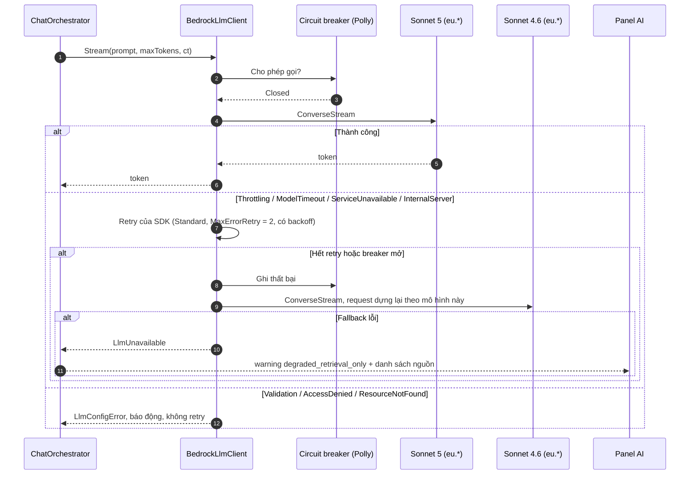

| Loại lỗi | Retry | Hành động |
| --- | --- | --- |
| `ThrottlingException`, `ModelTimeoutException`, `ServiceUnavailableException`, `InternalServerException` | Có, **một tầng duy nhất** là SDK: `RetryMode.Standard`, `MaxErrorRetry = 2` | Hết retry thì fallback Sonnet 4.6 |
| `ValidationException`, `AccessDeniedException`, `ResourceNotFoundException` | Không | Báo động vận hành; không che lỗi cấu hình |
| Lỗi giữa stream | Không tự động | Giữ phần đã có, `error` với `partial: true`, người dùng bấm Thử lại |

| Điều kiện | Ngưỡng khởi điểm | Phản ứng |
| --- | --- | --- |
| Không có token đầu tiên | 15 giây | Hủy, retry một lần, rồi fallback |
| Stream đứng giữa chừng | 20 giây không có token mới | Đóng stream, giữ phần đã có, `error` retryable |
| Lỗi liên tiếp | 5 lần trong 30 giây | Mở breaker 30 giây, đi thẳng sang fallback |
| Không mô hình nào dùng được | Fallback cũng lỗi | Chế độ chỉ retrieval: trả danh sách nguồn |

Quy tắc thi công:

- `RetryMode` mặc định của AWS SDK for .NET v4 là `Legacy`, và `Adaptive` được ghi là experimental. Đặt tường minh `Standard`. Polly chỉ làm circuit breaker và fallback, **không** thêm tầng retry thứ hai: hai tầng retry nhân số lần gọi và làm throttling nặng thêm.
- `AmazonBedrockRuntimeClient` tạo một lần, dùng lại (singleton).
- Thuộc tính `Timeout` của client không có tác dụng với lời gọi async. Ngưỡng thời gian phải đi qua `CancellationToken`, cùng token của lượt ở §6.7.
- Fallback phải **dựng lại request theo từng mô hình** (`RequestBuilder` riêng mỗi mô hình), không chỉ đổi `modelId`, vì cấu hình thinking và tham số bổ sung khác nhau giữa các thế hệ Claude.
- Retrieval và sinh câu trả lời là hai bước độc lập. Nhờ vậy khi không mô hình nào dùng được, kỹ sư vẫn nhận được tài liệu, trang, điều khoản.

### 8.14 Dịch stream của Harness sang SSE (AD-13, V-A4)

Frontend chỉ biết 11 sự kiện ở [02](02-hop-dong.md) §4. Harness phát bộ sự kiện khác (`messageStart`, `contentBlockStart/Delta/Stop`, `messageStop`, `metadata` và các ngoại lệ), nên `Assistant.Api` giữ một lớp dịch. Đối chiếu với trang API `InvokeHarness`: `contentBlockDelta.delta` mang một trong `text`, `toolUse`, `toolResult`, `reasoningContent`.

| Sự kiện SSE | Lấy từ | Ghi chú |
| --- | --- | --- |
| `token` | `contentBlockDelta` mang `text` | |
| `tool_call` | `contentBlockDelta` có `delta.toolUse` | Thực tế lệch tài liệu thì suy ra từ bản ghi `tool_run` của facade |
| `tool_result` | **Không lấy từ stream.** Facade ghi `tool_run` kèm `toolUseId`; `Assistant.Api` đọc theo `toolUseId` rồi phát | Thẻ kết quả dựng từ JSON của engine. Kênh phụ này là mã mới, dễ lệch hợp đồng (R33) |
| `approval_required` | `Assistant.Api`, sau `tool_result`, nếu manifest đánh dấu tool cần duyệt | Không phụ thuộc Harness |
| `refusal` hoặc `warning` | `messageStop` có `stopReason = guardrail_intervened` | |
| `warning: truncated` | `stopReason` là `max_iterations_exceeded`, `max_output_tokens_exceeded` hoặc `timeout_exceeded` | Không trình bày kết quả dở dang như câu trả lời hoàn chỉnh |
| `citation`, `warning` của validator | Validator chạy sau khi stream kết thúc bình thường | Như đường cố định |
| `done.usage` | `metadata.usage` và `metadata.metrics.latencyMs` | Trừ quota theo token thực dùng; `latencyMs` là nguồn số cho V-A4 |
| `error` | `internalServerException` (500), `runtimeClientError` (424), `validationException` (400), HTTP 429, và 402 `ServiceQuotaExceededException` | 500 và 429 retry theo `RetryMode.Standard`; 402 là hết quota, không retry; luôn kèm `requestId` |

---

## 9. Quyết định kiến trúc

> **Mục này trả lời:** đã chọn gì, loại gì, và trả giá bằng cái gì.
>
> Mỗi dòng có đủ ba phần — không có quyết định nào miễn phí, nên cột cuối ghi thẳng cái giá đã biết. Quyết định nào còn phụ thuộc một phép thử chưa chạy thì ghi rõ mã kiểm chứng ở §11.1.
>
> **Đọc tiếp:** rủi ro sinh ra từ các quyết định này ở [10](10-rui-ro.md).

| Mã | Quyết định | Phương án loại | Cái giá đã biết |
| --- | --- | --- | --- |
| AD-01 | Service.NET 8 mới `VFSoftware.Assistant.Api` sau BFF proxy | Route API trong Next.js | Thêm một service phải vận hành |
| AD-02 | Gọi Bedrock trực tiếp bằng AWS SDK sau `ILlmClient`, `IEmbeddingClient`, `IReranker` | Bedrock Agents classic | Tự viết retry, cache, guardrail. **Xác nhận đúng hướng (fetch 21/09/2026):** Bedrock Agents Classic ngừng nhận khách hàng mới từ 30/07/2026, ở chế độ maintenance, AWS khuyến nghị chuyển sang AgentCore — dự án này chưa từng dùng Bedrock Agents classic nên không bị ảnh hưởng, và việc chọn thẳng AgentCore (AD-13) khớp hướng khuyến nghị hiện tại của AWS |
| AD-03 | Region chính `eu-central-1`, inference profile `eu.*` | `bedrock-mantle` in-region; Paris | Request route trong 6 region EU, không single-region |
| AD-05 | Ba tầng mô hình: Haiku (routing), Sonnet 5 (trả lời), Sonnet 4.6 (fallback) | Một mô hình cho mọi việc | Ba đường phải đo riêng |
| AD-06 | Mô hình embedding chốt bằng đo trên bộ 50 câu, trước khi tạo KB. Nhánh A `embeddingModelType: MANAGED`; nhánh B `CUSTOM` + `embeddingModelArn` nếu nhánh A không đạt | Chọn theo cảm tính | Không đổi được sau khi tạo KB ở cả hai nhánh; đổi ý là tạo KB mới và ingest lại. Nhánh B thêm quyền `bedrock:InvokeModel` cho role của KB và **làm mất managed reranker** (chỉ còn rerank riêng hoặc không rerank) |
| AD-07 | Streaming bằng SSE, BFF chuyển tiếp nguyên dạng | SignalR; WebSocket | Phải kiểm qua chuỗi nginx + gateway production |
| AD-08 | Tool registry trong tiến trình, sinh từ OpenAPI rồi chỉnh tay | MCP server riêng; AI sinh SQL | Manifest phải review như code |
| AD-09 | Case memory ghi nhận tự động khi duyệt | Form ghi nhận thủ công | Kho case phụ thuộc thói quen bấm Duyệt |
| AD-10 | Guardrails ép bằng IAM condition key | Chỉ dặn trong prompt | Hai role tách riêng. **Xác nhận (fetch 21/09/2026, đọc trực tiếp bằng trình duyệt):** `bedrock:GuardrailIdentifier` áp dụng cho `Converse`, `ConverseStream`, `InvokeModel`, `InvokeModelWithResponseStream` — đúng bốn API dự án dùng. Cơ chế chuẩn của AWS là cặp Allow + Deny tường minh (`StringNotEquals`), không phải một điều kiện Allow đơn. Hai giới hạn quan trọng: (1) role đã gắn điều kiện này **không được** dùng thêm để gọi API đa bước nội bộ như `RetrieveAndGenerate`, `InvokeAgent`, `InvokeInlineAgent` — các API đó tự gọi `InvokeModel` nhiều lần bên trong, có lần không kèm guardrail, gây `AccessDenied` dù request gốc có guardrail (dự án này không gọi các API đó nên chưa bị, nhưng phải nhớ khi mở rộng); (2) guardrail input tag có thể bị lách ở phía prompt, nhưng **guardrail luôn áp cho response** bất kể input có bị lách hay không |
| AD-11 | Job nền bằng bảng PostgreSQL `FOR UPDATE SKIP LOCKED` | RabbitMQ / Kafka / SQS | Không có retry và DLQ sẵn của broker |
| AD-12 | Logical database `assistant` riêng; không dùng Aurora DSQL | Dùng chung schema với VFSoftware | Instance vật lý riêng nay là tùy chọn: lý do cũ là tải của chỉ mục HNSW, mà vector store đã sang MKB. **Xác nhận đúng hướng, lý do mạnh hơn (fetch 21/09/2026):** Aurora DSQL không hỗ trợ PL/pgSQL (chỉ SQL function), **một transaction chỉ sửa được tối đa 3 000 dòng** bất kể có bao nhiêu index phụ, DDL và DML phải tách thành hai transaction riêng, mỗi cluster chỉ có đúng một database tên `postgres`, và dùng optimistic concurrency control (xung đột trả lỗi serialization, phải tự viết retry thay vì chờ lock). Bất kỳ lý do nào ở trên cũng đủ loại Aurora DSQL khỏi vai trò lưu `message`/`tool_run`/`case` của dự án này, không chỉ vì HNSW |
| AD-13 | Tool loop là AgentCore Harness | Vòng lặp C# thuần | Không có hook nên ToolGate ra facade; phải dịch stream sang SSE; ba hạ tầng AWS mới cùng lúc |
| AD-14 | Vùng chạy `eu-central-1` | APAC; hai vùng | Kỹ sư tại Việt Nam cộng 250–320 ms; nghĩa vụ hồ sơ theo luật Việt Nam vẫn còn |
| AD-15 | Bỏ luật nhanh khỏi đường routing chính; mọi lượt qua IntentRouter | Giữ luật nhanh ở đường chính | Mọi lượt cộng 300–500 ms; router thành điểm chết đơn (R44) |
| AD-16 | IntentRouter bóc luôn `case_hints`; ưu tiên `tool_run` > `pageContext` > `case_hints` | Lọc case thuần bằng vector; bắt nhập qua form | Bóc sai thì kỹ sư nhận tiền lệ sai (R45); `MaxTokens` router lên 300–400 |
| AD-17 | **Retrieval tài liệu chạy trên Bedrock Managed Knowledge Base.** Worker parse, chunking theo điều khoản, giữ tiêu đề cột, rồi ghi một object S3 cho mỗi chunk kèm metadata sidecar. Lọc quyền là `filter` trên `scope_key` và `status`. `pg_trgm` phân giải mã điều khoản trước khi gọi `Retrieve` | Tự xây hybrid trên PostgreSQL + pgvector với RRF; Customer-managed KB; `AgenticRetrieveStream` | Biên phân quyền là tham số API chứ không phải mệnh đề SQL (R46); không tự chủ được RRF và tham số HNSW; embedding không đổi được sau khi tạo KB; Worker **không** biến mất |
| AD-18 | Bedrock Evaluation chạy song song golden set trong CI | Chỉ golden set tự chấm | Thêm một nguồn chấm phải hiểu và đối chiếu. **Xác nhận (fetch 21/09/2026, đọc trực tiếp bằng trình duyệt, URL đúng là `evaluation.html` không phải `model-evaluation.html`):** dịch vụ có tên chính thức "Amazon Bedrock evaluations", hỗ trợ đúng ba dạng dự án cần — "Model evaluation jobs that use a judge model" (chấm bằng LLM thứ hai), đánh giá tự động theo dataset tùy biến hoặc built-in, và "RAG evaluations that use LLMs" (chấm knowledge base theo ground truth). Nâng từ "Proposed" lên đã xác nhận tồn tại đúng như mô tả |
| AD-19 | Prompt router và prompt trả lời giữ trong Bedrock Prompt Management | Prompt hằng trong mã C# | Thêm một nơi phải kiểm soát phiên bản. **Xác nhận (fetch 21/09/2026):** Prompt Management cho tạo, lưu version, và dùng lại prompt lúc gọi inference hoặc qua Bedrock Flows — khớp mô tả AD-19 |
| AD-20 | Ingestion điều phối bằng Step Functions, kích hoạt bằng S3 Event Notification | Bảng hàng đợi PostgreSQL cho nhánh ingestion | Thêm một hạ tầng nữa vào phạm vi (R39) |
| AD-21 | Batch inference cho golden set và chấm eval hàng loạt | Gọi `Converse` từng câu | Không dùng được cho đường phục vụ người dùng. **Cảnh báo (fetch 21/09/2026):** bảng "Supported Regions and models for batch inference" liệt kê **Claude Opus 5** (dùng cho giám khảo) nhưng **không liệt kê Claude Sonnet 5** — tức mô hình sinh câu trả lời cho golden set (Sonnet 5) **có thể không hỗ trợ batch inference**. Nếu đúng vậy, phần sinh câu trả lời golden set phải gọi `Converse` từng câu trong vòng lặp (không có giảm giá batch), chỉ phần chấm điểm bằng Opus 5 mới batch được. **Giới hạn thứ hai (batch-inference.html, fetch 21/09/2026):** batch *không hỗ trợ tool calling và structured output*, nên các nhóm golden set cần gọi tool (C, D, I, J, xem [08](08-eval-quan-sat.md)) không chạy qua batch được. Cần gọi thử `CreateModelInvocationJob` với Sonnet 5 để xác nhận trước khi triển khai AD-21 |
| AD-22 | Cửa sổ lịch sử đếm theo **lượt**: router đọc 3 lượt gần nhất; đường trả lời quá 6 lượt thì giữ 4 lượt gần nhất cộng tóm tắt các lượt cũ | Gửi toàn bộ lịch sử; cắt cứng theo số message | Hội thoại rất dài mất chi tiết nhỏ ở các lượt cũ; ba con số là cấu hình, hiệu chỉnh bằng golden set |
| AD-23 | Chống lạm dụng ba tầng, counter trong PostgreSQL: burst theo IP, sliding window theo user, **một lượt đồng thời trên mỗi user** (`active_turn`), quota ngày theo token của user và org | Bộ giới hạn trong bộ nhớ; quota theo số lượt; hủy lượt cũ | Thêm một bảng và một job quét dọn; mỗi lượt cộng hai lần ghi PostgreSQL |

| AD-24 | **Kết luận đạt/không đạt là dữ liệu của engine.** Manifest khai báo trường verdict cho từng tool `calc.*`; thẻ kết quả hiện verdict từ `tool_result`; `VerificationValidator` so nhãn trong văn bản với verdict của `tool_run` được tham chiếu; lượt `optimize` và `explain_result` kết thúc bằng `submit_recommendation` (khôi phục từ bản 1.1 của bộ tài liệu) | Chỉ kiểm có `tool_run` khớp tham số; dò từ khóa trong văn bản làm lớp duy nhất | Manifest thêm một trường phải duyệt (R38). Nếu Main API chỉ trả số mà không trả verdict thì kỹ sư E phải định nghĩa verdict cho từng tool, và định nghĩa đó nằm ngoài engine. Dò từ khóa vẫn sót cách diễn đạt lạ, nên thẻ từ `tool_result` mới là lớp chính |
| AD-25 | **Lượt gắn với kết nối.** Client ngắt thì hủy lượt: một `CancellationToken` cho mỗi lượt, nối `RequestAborted` với timeout, truyền xuống mọi lời gọi ra ngoài; BFF truyền `request.signal`; ghi `aborted` kèm phần đã sinh | Cho lượt chạy tiếp rồi cho nối lại stream (`Last-Event-ID`) | Rớt mạng giữa lượt thì mất phần còn lại, phải hỏi lại. Harness phía AWS có thể chưa dừng (V-A11); thiệt hại tối đa bị chặn bởi `maxIterations` và `timeoutSeconds` |
| AD-26 | **Phiên bản tài liệu theo ngày hiệu lực.** `document` thêm `family_key`, `effective_from`, `effective_to`, `supersedes_document_id`; sidecar mang ngày dạng `NUMBER`; hai chế độ retrieval hiện hành và theo dự án; chuyển ấn bản bằng một ingestion job; `ScopedKnowledgeBaseClient` loại trùng ấn bản cùng `active` | Chỉ dựa vào `status`; luôn trả bản mới nhất kèm warning | Worker và kỹ sư tri thức phải điền ngày hiệu lực khi nạp. Thêm ba thuộc tính sidecar, mỗi thuộc tính là một chỗ có thể hỏng im lặng (R47) |
| AD-27 | **Chạy lại an toàn.** Facade khử trùng theo `toolUseId`; approvals unique theo `(org_id, tool_run_id)` và `(org_id, dedupe_key)`; BFF không tự retry `/v1/chat`; tool ghi chỉ được đăng ký khi có khóa idempotency | Để retry sinh bản ghi trùng rồi gộp sau | Thêm hai unique index. Chưa biết Gateway có chuyển `toolUseId` không (V-A12) |

**Ràng buộc kèm theo AD-15:** `pageContext` phải mang `hasResult`, `resultKind`, `calcAt`.

**Ràng buộc kèm theo AD-16:** `similarity_keys`, đơn vị và dải giá trị nhúng vào prompt router, sinh từ `tools.manifest.yaml` lúc khởi động; giá trị chỉ có nguồn `case_hints` phải được kỹ sư xác nhận trên giao diện; dưới 2 key giải được thì hỏi lại.

---

## 10. Yêu cầu chất lượng chi tiết

> **Mục này trả lời:** gặp từng tình huống xấu thì hệ thống phải phản ứng thế nào.
>
> Khác §1.2 ở chỗ: §1.2 là chỉ tiêu đo được, mục này là kịch bản — kích thích nào dẫn tới phản ứng bắt buộc nào. Dùng làm danh sách ca kiểm thử.
>
> **Đọc tiếp:** cách hiển thị từng phản ứng cho người dùng ở [07](07-giao-dien.md).

Mục tiêu chất lượng nằm ở §1.2. Mục này là các kịch bản chất lượng: hệ thống phải phản ứng thế nào khi gặp từng tình huống.

| Kịch bản | Kích thích | Phản ứng yêu cầu |
| --- | --- | --- |
| Retrieval yếu | `score` cao nhất dưới ngưỡng từ chối (khởi điểm 0.5, hiệu chỉnh bằng golden set) | `refusal` trước khi gọi Sonnet, không đoán |
| Router lỗi | Haiku timeout, lỗi, hoặc `stopReason = max_tokens` | Fallback luật nhanh, cờ `degraded_routing`, lượt vẫn hoàn thành |
| Tool lỗi hai lần | Engine trả lỗi | Trạng thái `Degraded`, không lặp tiếp |
| Số không truy được nguồn | `NumberValidator` trượt | `warning`, `CompletedUnverified`, giữ chữ đã hiện |
| Tham số case thiếu | Dưới 2 key giải được | Hỏi lại, không trả 5 case yếu |
| Gọi `Retrieve` thiếu filter | Đường mã mới bỏ qua `ScopedKnowledgeBaseClient` | Architecture test trong CI **chặn build**, không để chạy tới production (R46) |
| Lọc trên thuộc tính không có trong sidecar | Sai dữ liệu nạp | Có thể trả rỗng mà không báo lỗi (chưa kiểm chứng cho MKB). Bắt bằng V-K4 và test tích hợp đa organization (R47) |
| Nội dung tool có chỉ dẫn độc hại | Guardrail chặn | Trả lỗi mô tả thay cho nội dung |
| Organization yêu cầu xóa | GDPR | Xóa cứng toàn bộ case, ghi `audit_event` bản xóa |
| Client ngắt giữa lượt | Bấm Dừng, đóng tab, rớt mạng | Hủy mọi lời gọi đang chạy; ghi `aborted` kèm phần đã sinh; trừ quota theo phần đã dùng; xóa `active_turn` (§6.7) |
| Nhãn kết luận trái verdict | Văn bản ghi "đạt", `tool_run` ghi không đạt | Thẻ kết quả vẫn hiện verdict của engine; `warning: unverified_verdict` (AD-24) |
| Hai ấn bản cùng `active` | Đang chuyển ấn bản, ingestion job chưa xong | Giữ bản mới hơn; `audit_event` loại `edition_conflict`; cảnh báo vận hành (§6.8) |
| Chunk ngoài scope lọt qua filter | Lỗi filter hoặc sidecar | Loại chunk trước khi vào ngữ cảnh; `audit_event` loại `scope_violation`; cảnh báo mức cao nhất (§8.9) |
| Gọi lặp cùng `toolUseId` | Gateway retry sau timeout | Trả lại kết quả `tool_run` đã có, không gọi engine lần hai (§8.11) |
| Duyệt hai lần | Bấm đúp hoặc client retry | Trả `caseId` đã có, `200` (§8.11) |
| Mọi đường kết thúc | Bất kỳ | Ghi `message` và `audit_event`, kể cả khi lỗi |

---

## 11. Rủi ro và nợ kỹ thuật

> **Mục này trả lời:** phép thử nào chưa chạy mà đang chặn quyết định, rủi ro nào trọng yếu, và món nợ nào chấp nhận mang theo.
>
> Bảng §11.2 chỉ là phần trọng yếu, trích từ bộ đầy đủ 51 rủi ro. Mã rủi ro dùng chung toàn bộ tài liệu, nên khi bảng này và bảng gốc lệch nhau thì bảng gốc đúng.
>
> **Đọc tiếp:** bộ rủi ro R1–R51 đầy đủ kèm giảm thiểu và chủ sở hữu, cùng tám câu hỏi công ty phải quyết, ở [10](10-rui-ro.md).

### 11.1 Kiểm chứng chặn quyết định

| Mã | Kiểm | Mức |
| --- | --- | --- |
| V-A1 | Gọi `InvokeHarness` bằng Bearer JWT thay vì SigV4 | **Chặn** |
| V-A6 | Token exchange RFC 8693 trên Keycloak | **Chặn** |
| V-A4 | Stream của Harness dịch được sang 11 sự kiện SSE | **Chặn** |
| V-A9 | Cedar kiểm được điều kiện số học `b >= 100 && b <= 2000` | **Chặn** |
| V-A10 | NAT gateway cho Harness ở chế độ VPC — **có câu trả lời**: chế độ VPC kéo image từ ECR riêng, *"Your VPC does not need a NAT gateway or internet access for this pull"*; cần endpoint `ecr.dkr`, `ecr.api`, `s3`, `bedrock-runtime` | Xong |
| V-K2 | MKB có GA ở `eu-central-1` — **có câu trả lời**: tài liệu AWS liệt kê `eu-central-1` trong danh sách region của managed KB | Xong |
| V-K3 | AWS SDK for .NET có `MANAGED` và `MANAGED_KNOWLEDGE_BASE_CONNECTOR`, và gửi được `retrievalConfiguration.managedSearchConfiguration` | **Chặn** |
| V-K4 | Managed S3 connector đọc được sidecar có kiểu, và `managedSearchConfiguration.filter` lọc đúng theo `scope_key`, và toán tử số lọc đúng trên `effective_from`, `effective_to` (AD-26). Kiểm thêm ba điều chưa có trong tài liệu: lọc trên thuộc tính không có trong sidecar thì rỗng hay lỗi; `startsWith` / `stringContains` thì lỗi hay bị bỏ qua; `listContains` có chạy không | **Chặn** |
| V-K5 | `overrideSearchType: HYBRID` — **có câu trả lời**: managed KB luôn hybrid, `ManagedSearchConfiguration` không có `overrideSearchType`, semantic-only không khả dụng. `pg_trgm` stage 1 giữ lại để chuẩn hóa mã điều khoản gõ gần đúng, không phải làm phương án dự phòng | Xong |
| V-K6 | Reranker quản lý sẵn của MKB có đủ tốt so với Cohere Rerank 3.5 không. Reranker sẵn **không tính thêm tiền** nhưng **chỉ dùng được khi embedding do AWS quản**; chọn embedding riêng (AD-06 nhánh B) thì mất nó | **Chặn** |

| V-A11 | Hủy việc đọc stream `InvokeHarness` có dừng tool loop ở phía AWS không. Nếu không, có API nào dừng một phiên đang chạy không (skill `amazon-bedrock` không nêu API nào như vậy) | Không chặn. Chỉ ảnh hưởng chi phí, và đã có trần `maxIterations`, `timeoutSeconds` |
| V-A12 | Gateway có chuyển `toolUseId` xuống facade không (header hoặc body) | Không chặn. Thiếu thì dùng khóa thay thế ở §8.11 |

V-A1 hoặc V-A6 trượt thì rơi về tool loop C# ngay.

**Chỗ nguồn tham chiếu nói khác nhau.** Skill `amazon-bedrock` (bản `v6`) ghi hai điều trái với tài liệu AWS đã đọc trực tiếp ([00](00-thuat-ngu-va-nguon.md) Phần F):

| Chủ đề | Skill ghi | Tài liệu AWS ghi | Cách xử lý |
| --- | --- | --- | --- |
| Vị trí `filter` khi gọi `Retrieve` trên MKB | `vectorSearchConfiguration.filter`, và `overrideSearchType` dùng được | `managedSearchConfiguration.filter`, không có `overrideSearchType` | Giữ theo tài liệu AWS. V-K3 gửi thử **cả hai** vị trí và ghi lại vị trí nào lọc thật. Vị trí sai có thể bị bỏ qua im lặng, tức là trả tài liệu của mọi organization (R46) |
| Harness ở chế độ VPC có cần NAT gateway không | Cần, vì kéo image từ ECR Public | Không cần, vì chế độ VPC kéo image từ ECR riêng qua VPC endpoint | Giữ theo tài liệu AWS (V-A10). Lần dựng đầu mà phiên không khởi động vì image pull timeout thì kiểm lại ngay điểm này ([05](05-devops.md) mục 4C) |

### 11.2 Rủi ro trọng yếu

| Mã | Rủi ro | X | T |
| --- | --- | --- | --- |
| R9 | `ApiResult.Code = Forbidden` nằm trong HTTP 200; Gateway không thấy body | C | C |
| R12 | Prompt injection từ chunk tài liệu bên thứ ba | V | C |
| R26 | Đầu độc kho case qua thao tác Duyệt | C | V |
| R23 | Haiku 4.5 đã công bố mốc EOL | C | V |
| R27 | Harness không có hook nên ToolGate phải ra facade | C | C |
| R29 | Có thể phải tự viết bộ đọc event stream cho Bearer JWT | V | C |
| R30 | `GuardrailVersion` thiếu thì guardrail không chạy và không báo lỗi | V | C |
| R32 | Token exchange trên Keycloak chưa có | C | C |
| R33 | Dịch stream Harness sang SSE | C | V |
| R35 | `MaxTokens` bỏ trống giữ chỗ quota theo trần mô hình | V | C |
| R39 | Ba hạ tầng AWS mới cùng lúc | C | C |
| R40 | Nghĩa vụ hồ sơ khi đưa dữ liệu cá nhân ra nước ngoài | C | C |
| R41 | Kỹ sư tại Việt Nam cộng 250–320 ms mỗi lượt | C | T |
| R42 | Truy vấn xuyên ngôn ngữ: câu hỏi tiếng Anh trên kho tài liệu tiếng Pháp | V | V |
| R43 | Quyền gọi mô hình có ba cổng chặn độc lập, thời gian chờ khó đoán | V | C |
| R44 | AD-15 biến IntentRouter thành điểm chết đơn | C | C |
| R45 | AD-16: bóc sai tham số thì kỹ sư nhận tiền lệ sai, và sai đó không để lại dấu vết trong câu trả lời | V | C |
| R46 | AD-17: biên phân quyền rời khỏi câu SQL thành tham số API (`managedSearchConfiguration.filter`). Gọi `Retrieve` thiếu filter trả về tài liệu của mọi organization, đúng định dạng, không lỗi | V | C |
| R47 | AD-17: metadata filter có ba đường có thể hỏng im lặng — thuộc tính không có trong sidecar (có thể rỗng), `startsWith`/`stringContains` không được hỗ trợ (lỗi hay bị bỏ qua: chưa kiểm chứng), `numberOfResults` bỏ trống. Hành vi cụ thể của đường 1 và 2 trên MKB do V-K4 xác định | C | C |
| R48 | Client ngắt nhưng lượt vẫn chạy và vẫn tính tiền | V | V |
| R49 | Văn bản kết luận "đạt" trái với verdict của engine | V | C |
| R50 | Retrieval trả sai ấn bản tiêu chuẩn | V | C |
| R51 | Retry hạ tầng chạy tool hoặc tạo case hai lần | T | V |

X = xác suất, T = tác động. T/V/C = thấp/vừa/cao. Bảng đầy đủ 51 rủi ro ở [10](10-rui-ro.md).

### 11.3 Nợ kỹ thuật đã biết

| Nợ | Trạng thái |
| --- | --- |
| Topology production chưa chốt (GĐ-7) | Chờ công ty |
| Gộp định kỳ case gần trùng | Sau beta |
| Cache scope chỉ trong bộ nhớ tiến trình, không dùng chung giữa instance | Chấp nhận, TTL 60 giây |
| So sánh Nova Lite với Haiku 4.5 | Bắt buộc (R44) |
| Đơn giá mô hình chưa tra được | Dùng AWS Pricing Calculator khi lập dự toán |

---

## 12. Thuật ngữ

> **Mục này trả lời:** nghĩa chính xác của các từ dùng lặp trong tài liệu.
>
> Bản rút gọn, chỉ đủ để đọc tiếp tài liệu này.
>
> **Đọc tiếp:** bản đầy đủ — mỗi thuật ngữ kèm *là gì*, *vì sao hệ thống cần nó*, và nguồn tra cứu — ở [00](00-thuat-ngu-va-nguon.md).

| Thuật ngữ | Nghĩa trong tài liệu này |
| --- | --- |
| `chunk` | Một đoạn tài liệu đã cắt, có `clause_path` và số trang; nội dung nằm trên S3 kèm sidecar, embedding do MKB giữ |
| `scope_key` | Khóa phân quyền của chunk: `public`, `org:<id>` hoặc `project:<id>` |
| RRF | Reciprocal Rank Fusion, hợp nhất nhiều bảng xếp hạng theo thứ hạng |
| `tool_run` | Bản ghi một lần chạy engine: tool, phiên bản, tham số vào, kết quả ra, đơn vị |
| `case` | Một `tool_run` đã được kỹ sư duyệt, thuộc một `org_id` |
| `similarity_keys` | Danh sách tham số đo độ tương tự của một tool, khai báo trong `tools.manifest.yaml` |
| `case_hints` | Khối tham số số học do IntentRouter bóc từ câu hỏi (AD-16) |
| `dedupe_key` | `hash(tool_id, tool_version, input đã chuẩn hóa)` |
| ToolGate | Sáu lớp kiểm chạy trong facade C# trước khi gọi engine |
| Harness | Vòng lặp agent quản lý sẵn của AgentCore; không hỗ trợ hook |
| Gateway | Thành phần AgentCore phơi REST thành tool MCP, kèm Cedar Policy |
| Cedar | Ngôn ngữ chính sách phân quyền của AWS, chạy ở Gateway |
| Facade | Service C# đứng giữa Gateway và Main API, giữ ToolGate |
| Managed Knowledge Base (MKB) | Dịch vụ RAG quản lý sẵn của Bedrock: embedding, vector store và `Retrieve`. Ingest từ S3 qua managed connector |
| Metadata sidecar | Tệp `.metadata.json` đi kèm mỗi chunk trên S3, mang `clause_path`, `page`, `scope_key`, `status` |
| `ScopedKnowledgeBaseClient` | Lớp duy nhất được phép gọi `Retrieve`; scope là tham số khởi tạo bắt buộc |
| `degraded_routing` | Cờ đánh dấu lượt đi qua fallback routing |
| `CompletedUnverified` | Trạng thái kết thúc khi post-validation trượt; chữ vẫn hiện, kèm cảnh báo |
| `Aborted` | Trạng thái kết thúc khi client ngắt kết nối; giữ phần đã sinh, không chạy post-validation |
| Verdict | Kết luận đạt/không đạt do engine trả, khai báo trong manifest; mô hình không tự kết luận (AD-24) |
| `family_key` | Khóa gom các ấn bản của cùng một tiêu chuẩn, kèm phụ lục quốc gia |
| `effective_from`, `effective_to` | Khoảng ngày một ấn bản có hiệu lực, ghi dạng số `yyyymmdd` trong sidecar |
| `toolUseId` | Mã của một lần mô hình yêu cầu gọi tool; facade dùng làm khóa idempotency |

---

## Tài liệu trong bộ

| # | File | Dành cho |
| --- | --- | --- |
| 00 | [Thuật ngữ và nguồn](00-thuat-ngu-va-nguon.md) | Tất cả |
| 01 | Kiến trúc (tài liệu này) | Tất cả |
| 02 | [Hợp đồng API](02-hop-dong.md) | Backend và Frontend cùng ký |
| 03 | [Thi công Backend](03-backend.md) | Đội Backend |
| 04 | [Thi công Frontend](04-frontend.md) | Đội Frontend |
| 05 | [Thi công DevOps](05-devops.md) | Đội DevOps AWS |
| 06 | [Bảo mật và phân quyền](06-bao-mat.md) | Backend, DevOps, pháp chế |
| 07 | [Giao diện](07-giao-dien.md) | Frontend, thiết kế |
| 08 | [Đánh giá và quan sát](08-eval-quan-sat.md) | Backend, DevOps, kỹ sư tri thức |
| 09 | [Triển khai](09-trien-khai.md) | DevOps |
| 10 | [Rủi ro và câu hỏi mở](10-rui-ro.md) | Tất cả |
| 11 | [Thuyết minh](11-thuyet-minh.md) | Người không chuyên |
| — | [README của bộ](README.md) | Tất cả — thứ tự đọc, nguyên tắc không nhượng bộ |
| — | [Hồ sơ đề xuất cho lãnh đạo/CTO](../kien-truc-day-du.md) | Ban lãnh đạo, CTO |
