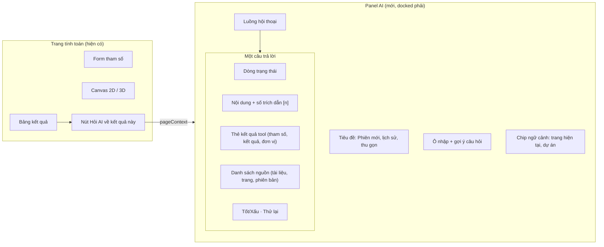
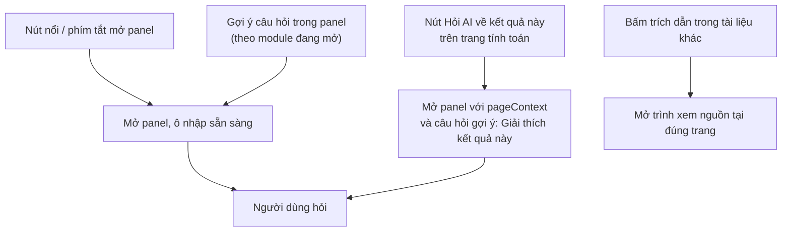
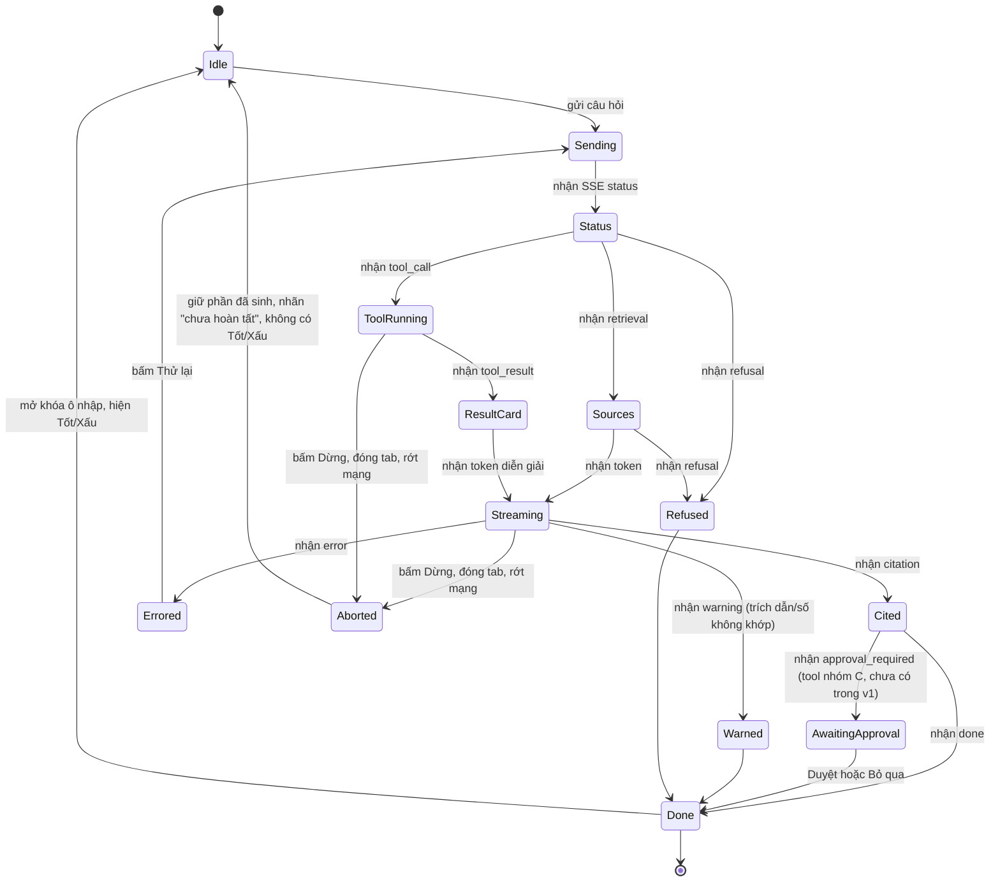
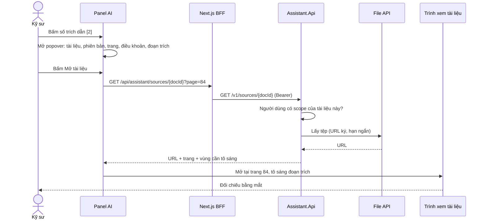
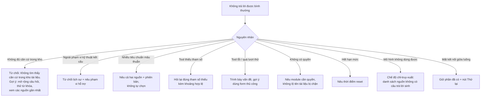
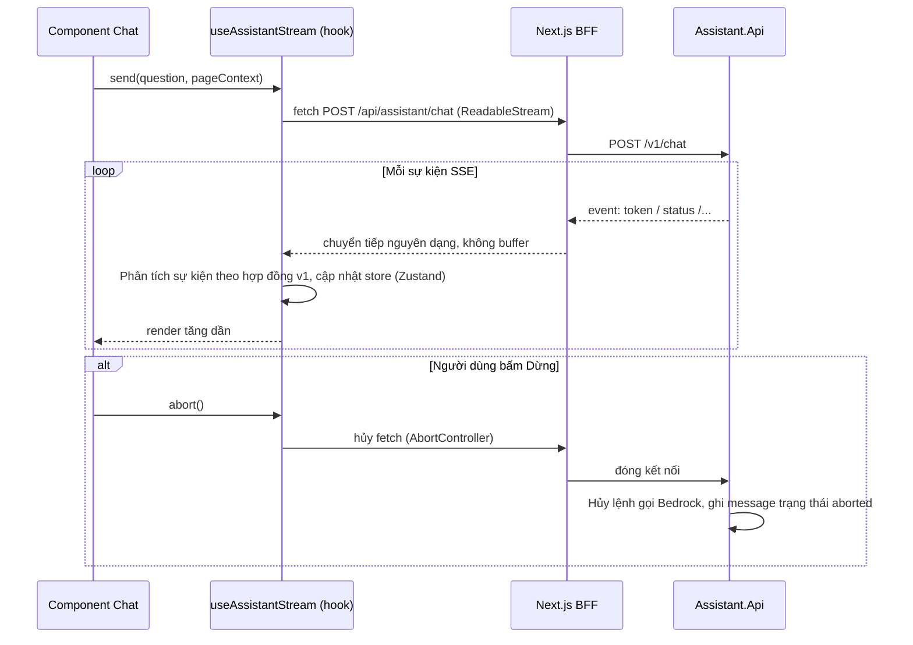

# 07 · Giao diện — nguyên tắc và trạng thái

**Ai đọc:** Frontend, thiết kế, và Backend (để biết giao diện cần gì).

---

## Vì sao có tài liệu này

Giao diện của một trợ lý AI khác giao diện phần mềm thường ở một điểm: **kết quả không chắc chắn**. Phần mềm thường thì bấm nút là ra kết quả, hoặc ra lỗi. Ở đây có một trạng thái thứ ba — ra kết quả **nhưng chưa kiểm chứng được** — và một trạng thái thứ tư: hệ thống **cố ý từ chối trả lời**.

Nếu giao diện không có sẵn chỗ cho hai trạng thái đó, thì khi chúng xảy ra người dùng sẽ thấy một màn hình treo hoặc một lỗi vô nghĩa.

Tài liệu này trả lời ba câu:

1. **Hiện gì khi hệ thống không chắc** — và vì sao không được giấu.
2. **Hiện gì trong lúc chờ** — một lượt có gọi engine mất cả chục giây.
3. **Làm sao để người dùng kiểm chứng được** — trích dẫn phải mở được, số phải truy được.

**Mục lục**

1. Bố cục
2. Điểm vào
3. Trạng thái của giao diện
4. Kiểm chứng trích dẫn
5. Thẻ kết quả và thẻ case (AD-28)
6. Từ chối và lỗi
7. Streaming phía client
8. Ngôn ngữ và đa ngôn ngữ
9. Đo lường trải nghiệm
10. Bổ sung: minh bạch AI, tiến trình, thử lại
11. Bổ sung từ các chương của Designing AI Interfaces
12. Bổ sung từ AI-Enhanced Web Apps, Agents in Action và Generative AI Tools
13. Bổ sung: ngăn tin quá mức vào kết quả AI

## Nguyên tắc nền

> **Thẻ kết quả dựng từ JSON của engine, không bao giờ bóc số ra từ chữ mô hình viết.**

Hai luồng tách biệt hẳn: mô hình viết **văn xuôi diễn giải** → vào bong bóng chữ; engine trả **JSON có cấu trúc** → vào thẻ kết quả.

Nếu Frontend tự đọc số ra từ văn xuôi thì toàn bộ công sức kiểm tra ở Backend thành vô nghĩa — vì cái được kiểm là văn xuôi, còn cái hiển thị là thứ Frontend tự diễn giải ra từ văn xuôi đó.

Nguyên tắc thứ hai: **gắn cờ, không xóa chữ đã hiện**. Xóa chữ giữa chừng làm người dùng mất niềm tin vào **cả những lượt đúng**.

## Thuật ngữ trong tài liệu này

Giải thích đầy đủ, kèm nguồn tra cứu, ở [00-thuat-ngu-va-nguon.md](00-thuat-ngu-va-nguon.md). Bản rút gọn dưới đây chỉ đủ để đọc tiếp tài liệu này.

| Thuật ngữ | Một câu |
| --- | --- |
| **SSE** | Server-Sent Events. Một kết nối mở sẵn, server đẩy dần từng mẩu xuống trình duyệt |
| **Streaming** | Chữ hiện dần thay vì chờ xong mới hiện một cục |
| **Citation** | Trích dẫn — dấu `[1]`, `[2]` trỏ về đúng trang và điều khoản |
| **`CompletedUnverified`** | Trạng thái kết thúc khi kiểm tra sau trượt: chữ vẫn hiện, kèm cảnh báo |
| **`Refused`** | Hệ thống cố ý từ chối vì không đủ căn cứ. **Không có một chữ nào từ mô hình** |
| **`Degraded`** | Lượt chạy ở chế độ giảm, ví dụ khi bộ phân loại ý định lỗi |
| **Chip tham số** | Ô hiện giá trị mô hình bóc ra từ câu hỏi, người dùng sửa được trước khi tra |

**Nguồn cho phần lớn nguyên tắc dưới đây:** *Designing AI Interfaces* (Louise Macfadyen) — trạng thái chờ, tiến trình, lỗi và minh bạch cho giao diện AI.

---
## 1. Bố cục

Panel AI **gắn cố định bên phải** (docked), có thể thu gọn và đổi kích thước. Không dùng modal hay overlay che canvas: kỹ sư cần thấy form và canvas 2D/3D trong khi hỏi. Trên màn hình hẹp, panel thành sheet toàn màn hình.

**Sơ đồ 8.1 — Bản đồ vùng giao diện**

**Chip ngữ cảnh** cho người dùng thấy AI đang được cấp dữ liệu gì (trang nào, dự án nào) và cho phép gỡ; tránh cảm giác "AI đọc mọi thứ" và tránh gửi ngữ cảnh ngoài ý muốn.

---

## 2. Điểm vào

**Sơ đồ 8.2 — Các cách kích hoạt trợ lý**

Điểm vào số 2 là nơi giá trị năng suất lớn nhất: kỹ sư không phải mô tả lại bài toán, và không rời màn hình đi tra cứu. Đây cũng là điểm vào dữ liệu do client gửi, nên xử lý theo [01](01-kien-truc.md)

---

## 3. Trạng thái của giao diện

**Sơ đồ 8.3 — State machine của một câu trả lời trên UI**

Ô nhập bị khóa từ `Sending` đến `Done`, ngoại trừ nút **Dừng** luôn khả dụng (hủy request, giữ phần đã có). Đóng panel không hủy lượt đang chạy trừ khi người dùng bấm Dừng. Đóng tab, tải lại trang hoặc rớt mạng thì lượt bị hủy ở backend (AD-25); mở lại conversation thấy phần chữ đã sinh kèm nhãn "chưa hoàn tất", không có nút chấm tốt/xấu. Theo *Designing AI Interfaces*: câu trả lời bị cắt ngang không nối lại được, nhưng câu hỏi, lịch sử và phần đã sinh phải còn nguyên để người dùng hỏi tiếp thay vì bắt đầu lại.

Khóa ô nhập là trải nghiệm, **không phải hàng rào** — nó chỉ khóa trong một tab. Hàng rào thật là giới hạn một lượt đồng thời trên mỗi user ở server (AD-23, [06](06-bao-mat.md)). Giao diện nhận `429 concurrent_turn` thì hiện thông báo "đang có một câu hỏi chạy dở ở nơi khác", không hiện lỗi chung.

---

## 4. Kiểm chứng trích dẫn

Trích dẫn là cơ chế chính để giảm rủi ro ảo giác, nên phải **rẻ để kiểm chứng**: một cú bấm tới đúng trang, đúng điều khoản, với đoạn được trích được tô sáng.

**Sơ đồ 8.4 — Sequence: kiểm chứng một trích dẫn**

Liên kết mở tài liệu **kiểm tra lại quyền** ở Assistant; không có URL công khai dài hạn tới tệp nguồn.

---

## 4a. Chip xác nhận tham số tra case (AD-16)

Khi ý định là `case_lookup` và một giá trị số **chỉ** đến từ `case_hints` do router bóc ra (không có `tool_run` hay `pageContext` xác nhận), giao diện hiện chip tham số **trước khi** chạy truy vấn.

- Mỗi chip: `tên tham số · giá trị · đơn vị`, sửa tại chỗ, xóa được.
- Giá trị có nguồn từ `tool_run` hoặc `pageContext` hiện ở dạng tĩnh, không sửa được ở đây.
- Dưới 2 tham số giải được: không hiện kết quả, hiện ô hỏi lại tham số còn thiếu.
- Bấm **Tra** mới gọi backend. Sửa chip không tự gọi lại.

Lý do có bước này: bóc sai tham số không để lại dấu vết trong câu trả lời (R45), nên chỗ duy nhất bắt được là trước khi truy vấn chạy.

## 5. Thẻ kết quả và thẻ case (AD-28)

Không còn cổng duyệt. Case tự ghi khi engine tính đạt ([12](12-tra-case.md)), nên thẻ kết quả tính **không có** nút Duyệt, Bỏ qua hay hộp xác nhận lưu vào kho.

Thẻ kết quả vẫn hiện đủ: tham số đầu vào, kết quả, đơn vị, căn cứ tiêu chuẩn, phiên bản tool, và `verdict` do engine trả.

Thẻ case khi tra cứu hiện `params`, `result`, `verdict`, số lần dùng, lần gần nhất, tiêu chuẩn đã dùng, nhãn **"Cấu hình đã từng tính đạt trong công ty, không phải khuyến nghị"**. Quản trị organization có nút **Rút case**.

---

## 6. Từ chối và lỗi

Từ chối và lỗi là các trạng thái **thiết kế**, không phải ngoại lệ. Mỗi loại có thông điệp và hướng đi tiếp riêng.

**Sơ đồ 8.6 — Phân loại từ chối và lỗi**

**Thông điệp lỗi luôn nói điều gì đã xảy ra và làm gì tiếp**, không đổ lỗi cho người dùng. Từ chối do không đủ căn cứ là **giá trị**, không phải thất bại: hệ thống nói thật khi không biết. Chỉ số chặn: tỉ lệ từ chối không được vượt 30% (xem [08](08-eval-quan-sat.md) mục *Chỉ số và cảnh báo*), tránh tối ưu "không bao giờ sai" bằng cách từ chối gần hết.

---

## 7. Streaming phía client

**Sơ đồ 8.7 — Sequence: hook stream phía client**

**Quyết định:** dùng hook tự viết (`fetch` + `ReadableStream` + bộ phân tích sự kiện theo hợp đồng ở [02](02-hop-dong.md)), lưu trạng thái bằng Zustand đang dùng. Không phụ thuộc thư viện chat ngoài, vì hợp đồng sự kiện có kiểu riêng (thẻ kết quả, duyệt, cảnh báo) không khớp giao thức chat chung. **Route BFF phải chuyển tiếp luồng không buffer**; nginx production cần `proxy_buffering off` cho đường dẫn này, và gateway phải cho phép kết nối dài (kiểm tra khi đo).

---

## 8. Ngôn ngữ và đa ngôn ngữ

- Tiếng Pháp là ngôn ngữ gốc của giao diện và của câu trả lời; tiếng Anh là ngôn ngữ thứ hai qua i18next hiện có. Chuỗi giao diện nằm trong tệp resource i18n, không hard-code.
- **Không làm bản tiếng Việt** (Q8, đã trả lời): thị trường mục tiêu là EU. Kỹ sư ngồi tại Việt Nam dùng chính giao diện tiếng Pháp hoặc tiếng Anh. Quy tắc cho câu trả lời: **trả lời theo ngôn ngữ của câu hỏi, nhưng giữ nguyên văn đoạn trích tiêu chuẩn bằng tiếng Pháp** kèm bản dịch nghĩa khi người dùng hỏi bằng tiếng Anh. Không dịch lại đoạn trích rồi trình bày như nguyên văn — người đọc phải đối chiếu được với bản tiêu chuẩn gốc.
- Ngôn ngữ trả lời **theo ngôn ngữ của câu hỏi**, mặc định theo locale của người dùng. System prompt viết bằng tiếng Anh (ổn định nhất cho mô hình) kèm chỉ dẫn ngôn ngữ trả lời.
- Thuật ngữ kỹ thuật kết cấu giữ đúng thuật ngữ của tiêu chuẩn Pháp (ví dụ *moment fléchissant*, *effort tranchant*); bộ thuật ngữ nằm trong system prompt và trong bộ eval.
- KaTeX đã có trong frontend, dùng để hiển thị công thức trong câu trả lời.
- Bộ chuỗi giao diện của panel AI cần **người bản ngữ duyệt** trước beta; văn bản dịch máy dễ sai sắc thái ở thông điệp lỗi và từ chối.

---

## 9. Đo lường trải nghiệm

| Tín hiệu | Ý nghĩa | Nguồn |
| --- | --- | --- |
| Tỉ lệ bấm trích dẫn | Kỹ sư có đang kiểm chứng không (quá thấp kéo dài = dấu hiệu tin mù quáng) | Sự kiện UI |
| Tỉ lệ Tốt/Xấu | Chất lượng cảm nhận | `feedback` |
| Tỉ lệ lượt `case_lookup` có kỹ sư mở ít nhất một thẻ case | Giá trị của kho case | `audit_event` |
| Thời gian tới chữ đầu tiên (p50, p95) | Độ trễ cảm nhận | `message.latency_first_token_ms` |
| Tỉ lệ từ chối | Hệ thống có đang từ chối quá tay không | `message.status` |
| Lượng câu hỏi theo tuần | **Tăng vọt rồi giảm dần sau một thời gian ngắn** thường là dấu hiệu chất lượng kém hoặc chờ lâu, không phải "hào hứng ban đầu lắng xuống"; xem log và đánh giá trước khi kết luận | `message` |

---

## 10. Bổ sung: minh bạch AI, tiến trình, thử lại

Đối chiếu với sách Designing AI Interfaces:

| Chủ đề | Quy tắc | Áp dụng |
| --- | --- | --- |
| **Công khai đây là AI** | Không để người dùng tưởng đang nói chuyện với người hoặc với một hệ tính toán tất định | Panel gắn nhãn AI rõ ràng; thẻ kết quả tool ghi "do engine tính", văn bản diễn giải ghi "do AI viết". Nghĩa vụ minh bạch theo luật (ví dụ EU AI Act) cần công ty rà soát cùng DPO trước beta, không thuộc phạm vi kỹ thuật |
| **Không giả tiến trình xác định** | Vòng lặp tool không có số bước cố định, đừng hiện "Bước 3/5" | Hiện số vòng đã chạy và thời gian đã trôi; pha (đang tìm, đang tính, đang viết) thay cho thanh phần trăm |
| **Tiến trình theo ba tầng** | Thông báo → Tổng quan → Chi tiết → Bản ghi đầy đủ | Dòng trạng thái (tổng quan) → bấm mở danh sách nguồn và tool đã gọi (chi tiết) → xem đầy đủ tham số, version tool, chunk đã dùng (bản ghi, dựa trên `tool_run` và `retrieval_log`) |
| **Lộ kế hoạch trước khi làm việc tốn kém** | Việc phức tạp hoặc khó hoàn tác thì hiện kế hoạch khi chỉnh còn rẻ | Câu hỏi `mixed` (tính rồi đối chiếu điều khoản) hiện một dòng kế hoạch trước khi chạy: "Sẽ tính X bằng tool Y rồi tra điều khoản Z" |
| **Thử lại không phải phép màu** | Người dùng bấm "thử lại" liên tục hy vọng sửa được, trong khi sinh lại chỉ ra kết quả khác, không chắc tốt hơn | Nút "Thử lại" chỉ xuất hiện khi lỗi kỹ thuật. Với câu trả lời sai, đưa ra "Sửa câu hỏi" và "Báo sai" (chuyển thành `feedback`), không phải "Sinh lại" |
| **Quyền theo mức rủi ro** | Việc chỉ đọc không hỏi; việc không hoàn tác được luôn hỏi; việc hoàn tác được nhưng có hệ quả cho phép nhớ theo phiên | Tool nhóm A/B không hỏi; **Duyệt case luôn hỏi** (dù có nút Rút lại), không có tuỳ chọn "đừng hỏi lại" vì P1 |
| **Ngữ cảnh ngầm phải hiện ra** | Đừng để người dùng phát hiện giả định sai | Chip ngữ cảnh, phiên bản tiêu chuẩn, ngày cập nhật kho, mô hình đã dùng (đã có ở U3) |

---

## 11. Bổ sung từ các chương của Designing AI Interfaces

| Chủ đề | Quy tắc | Áp dụng |
| --- | --- | --- |
| **Định tuyến ngầm làm mất niềm tin** | Nếu hệ thống đổi mô hình mà không báo, người dùng không giải thích được khác biệt về tốc độ và chất lượng | Luôn hiện mô hình đã dùng; khi fallback ([01](01-kien-truc.md)) hiện huy hiệu "mô hình dự phòng" và ghi vào `message` |
| **Phạm vi dữ liệu chi tiết** | Cấp quyền dữ liệu theo mức, đừng hai trạng thái tất cả hoặc không gì | Chip ngữ cảnh cho phép gỡ từng phần: chỉ kết quả này, cả dự án, không gửi ngữ cảnh trang |
| **Gợi ý câu hỏi là định vị sản phẩm** | Câu gợi ý chung chung ("Hỏi tôi bất cứ điều gì") phí điểm chạm đầu | Gợi ý cụ thể theo module đang mở, dùng đúng thuật ngữ và điều khoản của module đó |
| **Xu nịnh (sycophancy)** | Mô hình phản chiếu khung câu hỏi: hỏi dẫn dắt thì trả lời xuôi theo | System prompt yêu cầu kiểm tra tiền đề của câu hỏi và sửa nếu sai ("Theo tiêu chuẩn, có thể giảm hàm lượng thép tối thiểu đúng không?" phải được đối chiếu điều khoản, không chỉ đồng ý); thêm nhóm câu hỏi dẫn dắt vào bộ eval ([08](08-eval-quan-sat.md)) |
| **Dữ liệu thiếu thì nói thiếu** | Nếu không chỉ dẫn, mô hình bịa nội dung lấp chỗ trống | Quy tắc prompt: khi tài liệu không nêu, trả "không có trong tài liệu được truy xuất" thay vì suy đoán |
| **Từ chối không nghe như trách móc** | Từ chối trơ trọi, không lý do, đọc như quở trách | Mỗi từ chối có lý do ngắn và bước tiếp theo, giữ giọng hội thoại ([07](07-giao-dien.md)) |
| **Kỳ vọng của người dùng về AI** | Người dùng mặc định coi AI hiểu như người, luôn đúng, nhất quán, biết đủ, không thiên lệch | Màn hình giới thiệu ngắn ở lần dùng đầu: AI có thể sai; số liệu do engine tính; luôn kiểm trích dẫn; không thay thế chữ ký kỹ sư |
| **Đầu ra điều chỉnh được** | Người dùng sửa được đầu ra thay vì chỉ chấp nhận hoặc bỏ | Thẻ kết quả tool cho **"Chỉnh tham số và tính lại"**: gửi tham số đã sửa qua cùng ToolGate. Hạng mục nên có, chưa bắt buộc |
| **Hành động tiếp theo** | Đầu ra là bàn đạp cho bước kế tiếp | "Áp vào form tính toán" (điền tham số vào trang) để pha sau; phạm vi hiện tại chỉ có Duyệt, mở nguồn, sao chép |

---

## 12. Bổ sung từ AI-Enhanced Web Apps, Agents in Action và Generative AI Tools

| Chủ đề | Quy tắc | Áp dụng |
| --- | --- | --- |
| **Cuộn tự động có điều kiện** | Cuộn xuống mỗi token làm gián đoạn người đang đọc phần trước | Tạm dừng tự cuộn khi người dùng cuộn lên; hiện nút "Xuống câu mới nhất" |
| **Lỗi có mã tham chiếu** | Phân loại lỗi, nêu bước tiếp theo, kèm mã yêu cầu | Sự kiện `error` mang `requestId`; hiển thị mã để gửi hỗ trợ ([02](02-hop-dong.md)) |
| **Hồ sơ (persona) nhất quán** | Không có persona, giọng điệu lệch giữa các lượt | System prompt nêu vai trò (trợ lý kỹ thuật kết cấu), giọng trang trọng, thuật ngữ; persona nằm trong `prompt_version` |
| **Lỗi có phục hồi** | Không để lỗi im lặng hoặc bãi lỗi thô trong khung chat | Mọi lỗi phân loại theo Sơ đồ 8.6, kèm nút phù hợp |
| **Đồng ý và xóa dữ liệu** | Mỗi cơ chế đạo đức cần công cụ cụ thể | Đồng ý: thông báo lần dùng đầu; minh bạch: log và giới hạn ghi rõ; thiên lệch/sai: nút "Báo sai"; xóa: xóa hội thoại và case ([06](06-bao-mat.md)) |

---

## 13. Bổ sung: ngăn tin quá mức vào kết quả AI

R10 ([10](10-rui-ro.md)) đã nêu rủi ro kỹ sư tin mù quáng; mục này thêm cách **phát hiện** thay vì chỉ giảm thiểu.

| Cơ chế | Cách làm | Ghi chú |
| --- | --- | --- |
| **Phát hiện dùng case thiếu kiểm tra** | Sau AD-28 không còn bước duyệt. Đo lượt `case_lookup` mà kỹ sư đưa thông số của case vào form tính rồi chạy engine lại, so với lượt chỉ xem rồi đóng | Tín hiệu để đọc, không chặn |
| **Đọc tỉ lệ ghi đè** | Ghi đè (chỉnh tham số, bỏ qua) đã vào audit ([06](06-bao-mat.md)). Sách coi tỉ lệ can thiệp giảm dần là dấu hiệu tốt; ở đây giảm quá nhanh, kèm việc không bao giờ tính lại thông số lấy từ case, lại là dấu hiệu xấu | Đọc cùng chỉ số ở dòng trên, không đọc riêng |
| **Ma sát đặt đúng chỗ** | Thẻ case hiện nhãn "đã từng tính đạt, không phải khuyến nghị", `tool_version` và phiên bản tiêu chuẩn; hệ thống không tự điền case vào form tính (AD-28) | [12](12-tra-case.md) |
| **Làm quen có ví dụ sai** | Buổi giới thiệu 15–30 phút cho nhóm beta, có ví dụ AI sai thật và cách nhận ra | Con số là ước tính, không phải yêu cầu đã kiểm chứng. Thuộc phần "thiên lệch người dùng" của kiểm toán AI (Interpretable AI) |

---

## Liên quan

| Cần gì | Đọc |
| --- | --- |
| Kiến trúc tổng thể, điểm vào của bộ | [01-kien-truc.md](01-kien-truc.md) |
| Hợp đồng SSE và payload từng sự kiện | [02-hop-dong.md](02-hop-dong.md) §4 |
| Dựng UI từ 11 sự kiện | [04-frontend.md](04-frontend.md) |
| Mục lục cả bộ | [README.md](README.md) |
