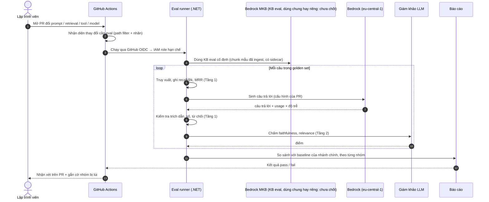
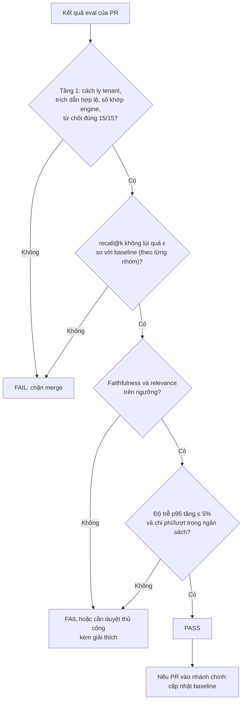
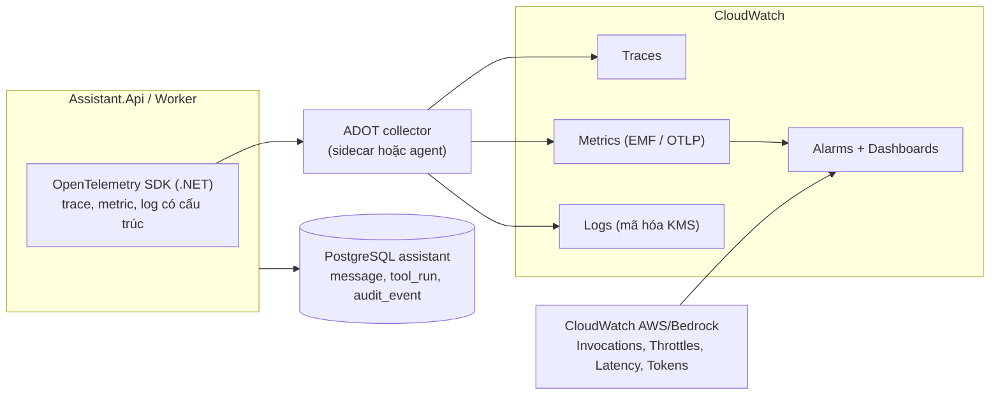
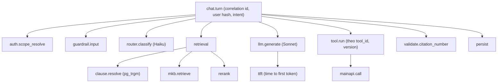
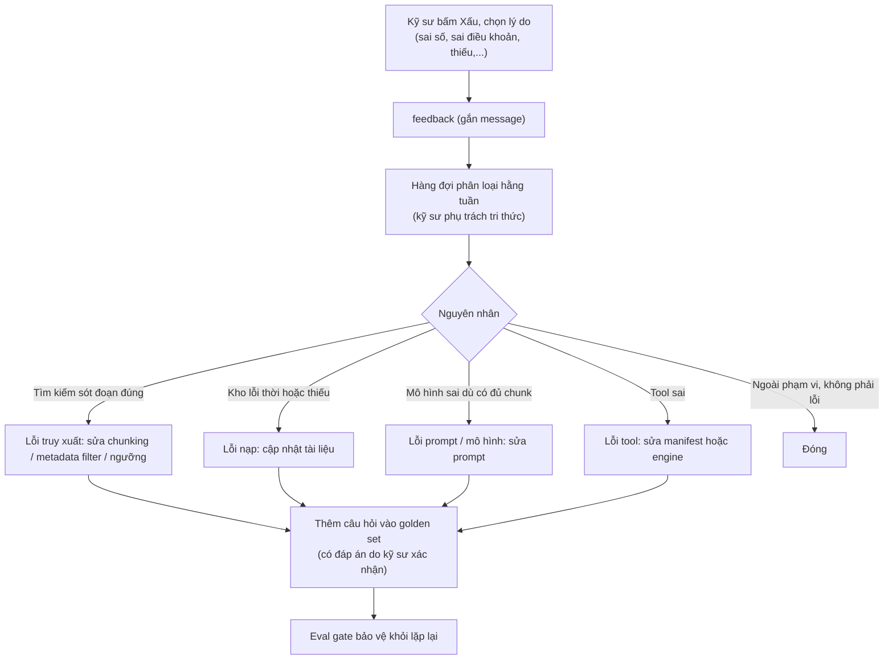
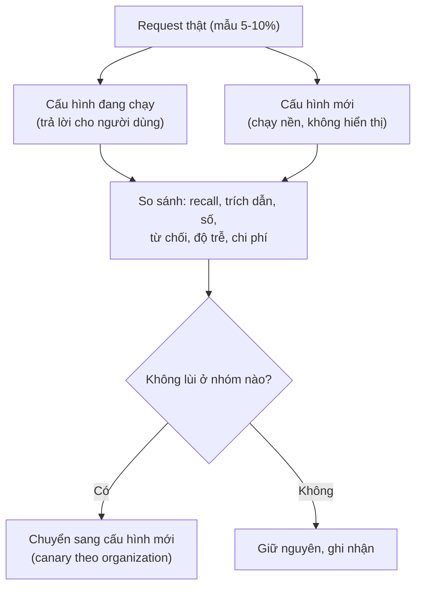

# 08 · Đánh giá chất lượng và quan sát vận hành

**Ai đọc:** Backend, DevOps, và kỹ sư phụ trách tri thức.

---

## Vì sao có tài liệu này

Phần mềm thường có unit test: cho đầu vào X thì phải ra đúng Y, sai là đỏ. Hệ thống dựa trên mô hình ngôn ngữ **không có khái niệm đó** — cùng một câu hỏi có thể ra hai câu trả lời khác nhau, và cả hai đều đúng.

Hệ quả: **không đo thì không biết mình đang tốt lên hay xấu đi.** Sửa một câu trong prompt có thể cải thiện mười câu hỏi và phá hỏng năm câu khác, mà không có dấu hiệu nào.

Tài liệu này trả lời hai câu:

1. **Đo chất lượng bằng gì** — và làm sao để phép đo đó chặn được một thay đổi tồi trước khi nó lên production.
2. **Khi chạy thật thì theo dõi gì** — chỉ số nào tăng là dấu hiệu sớm của hỏng hóc.

**Mục lục**

1. Bộ câu hỏi đánh giá (golden set)
2. Hai tầng đánh giá
3. Pipeline đánh giá và cổng CI
4. Quan sát khi vận hành
5. Vòng phản hồi
6. Audit
7. Bổ sung từ sách: giám khảo, mức đánh giá, shadow test, đối kháng
8. Bổ sung từ các chương của sách RAG: đánh giá trực tuyến, độ chính xác trích dẫn, tính nhất quán
9. Bổ sung từ các sách còn lại

## Nguyên tắc nền

> **Golden set chạy trong CI như một cổng chặn, không phải một báo cáo đọc cho vui.**

**Golden set** là bộ câu hỏi có đáp án đúng, để trong repo, có version. Nó chạy tự động mỗi lần có thay đổi, và điểm dưới ngưỡng thì không cho merge.

Trong bộ đề có một nhóm đặc biệt: **những câu mà đáp án đúng là "phải từ chối"**. Hệ thống cố trả lời những câu đó là trượt bài kiểm tra. Đây là cách duy nhất kiểm được nguyên tắc P3 một cách tự động.

Nguyên tắc thứ hai: **mỗi thành phần phức tạp phải thắng được phương án đơn giản hơn nó**. Thêm một chặng vào đường tìm kiếm mà không cải thiện số đo thì bỏ chặng đó đi.

## Thuật ngữ trong tài liệu này

Giải thích đầy đủ, kèm nguồn tra cứu, ở [00-thuat-ngu-va-nguon.md](00-thuat-ngu-va-nguon.md). Bản rút gọn dưới đây chỉ đủ để đọc tiếp tài liệu này.

| Thuật ngữ | Một câu |
| --- | --- |
| **Golden set** | Bộ câu hỏi có đáp án đúng, chạy trong CI như cổng chặn |
| **Recall@k** | Trong k đoạn tài liệu lấy ra, có bao nhiêu phần trăm chứa đáp án đúng |
| **LLM-as-judge** | Dùng một mô hình khác, mạnh hơn, để chấm điểm câu trả lời |
| **Shadow test** | Chạy phiên bản mới song song với phiên bản cũ trên lưu lượng thật, không hiện kết quả cho người dùng |
| **Trace / span** | Bản ghi chi tiết một lượt đi qua những bước nào, mỗi bước mất bao lâu |
| **`CompletedUnverified`** | Lượt mà kiểm tra sau trượt. Tỉ lệ này tăng là tín hiệu sớm nhất của hỏng hóc |

**Nguồn:** *Enterprise Guide for Implementing Generative AI and Agentic AI* — đánh giá đầu ra LLM · *Hands-On RAG for Production* — đánh giá RAG và phát hiện hallucination · *Interpretable and Trustworthy AI* — khung audit.

---
## 1. Bộ câu hỏi đánh giá (golden set)

Do kỹ sư kết cấu soạn, không do đội phần mềm tự soạn. Không có kỹ sư thật tham gia thì đội sẽ tự chấm bài của chính mình.

**Sơ đồ 9.1 — Cấu trúc bộ eval**

```mermaid
flowchart TD
 G["Golden set (JSONL, có version trong repo)"] --> A["Nhóm A: Hỏi đáp tài liệu<br/>(có đáp án, chỉ rõ tài liệu và điều khoản)"]
 G --> B["Nhóm B: Ngoài phạm vi kho<br/>(15 câu: PHẢI từ chối, không được đoán)"]
 G --> C["Nhóm C: Tính toán qua tool<br/>(đầu vào → kết quả engine đã biết)"]
 G --> D["Nhóm D: Tình huống tương tự<br/>(có case mẫu đã tính đạt)"]
 G --> E["Nhóm E: Đối kháng<br/>(prompt injection, chéo tenant, tài liệu độc hại)"]
 G --> F["Nhóm F: Biến thể<br/>(đổi 1 dữ kiện, đổi cách diễn đạt)"]
 G --> H["Nhóm G: Tài liệu theo scope<br/>(tài liệu của organization và dự án:<br/>kiểm tra filter scope_key của MKB)"]
 G --> HH["Nhóm H: Hướng dẫn dùng VF<br/>(có đáp án là bước thao tác; 3 câu về tính năng không tồn tại PHẢI từ chối)"]
 G --> II["Nhóm I: Kết quả dự án và cấu kiện<br/>(đối chiếu với engine; câu của organization khác PHẢI bị chặn)"]
 G --> JJ["Nhóm J: Gợi ý phương án<br/>(mọi nhãn đạt PHẢI khớp tool_run và engine 100%)"]
 G --> KK["Nhóm K: Ấn bản tài liệu<br/>(hiện hành và theo dự án)"]
 G --> LL["Nhóm L: Ngắt kết nối và chạy lại<br/>(test tích hợp)"]
```

| Trường | Ý nghĩa |
| --- | --- |
| `id`, `group`, `difficulty` | Nhóm và mức khó; **phải có đủ các mức khó** |
| `question`, `locale` | Câu hỏi thật. **Hai ngôn ngữ:** tiếng Pháp là chính, tiếng Anh là thứ hai (GĐ-1). `locale` là trường bắt buộc để **tách số recall theo ngôn ngữ**; một số gộp sẽ che việc câu hỏi tiếng Anh trên kho tiếng Pháp có khớp kém hơn không, dù tìm kiếm hybrid nay nằm trong MKB chứ không còn là một cấu hình FTS lộ ra ngoài (R42) |
| `expected_chunks` | Tài liệu, trang, điều khoản chứa đáp án (để đo truy xuất) |
| `expected_answer_facts` | Các dữ kiện phải có trong câu trả lời |
| `must_refuse` | Bắt buộc từ chối |
| `tool_expectation` | Tool nào, đầu vào nào, đầu ra engine mong đợi |
| `pair_id`, `variant_type` | Cặp biến thể: đổi dữ kiện (đáp án phải đổi) hoặc đổi diễn đạt (đáp án phải giữ nguyên) |
| `expected_verdict` | Kết luận engine mong đợi (`pass` / `fail` / `none` nếu tool không có verdict). Câu trả lời phải khớp, không chỉ số phải khớp (AD-24) |
| `max_tool_calls`, `max_retrievals` | Trần số lần gọi tool và số lần `Retrieve` cho câu này. Vượt là lỗi quỹ đạo, dù câu trả lời cuối đúng |
| `edition_mode`, `expected_edition` | Chế độ retrieval (`current` / `project`) và ấn bản phải được trích (AD-26) |

**Vì sao thêm ba trường cuối.** Sách *AI Agents on AWS* (ch07) tách đánh giá agent thành bốn phép kiểm: chọn đúng tool, truyền đúng tham số, dùng đúng ngữ cảnh của người dùng, chất lượng câu trả lời. Chỉ chấm câu trả lời cuối thì không thấy lỗi chọn sai tool hoặc gọi tool lặp, vì câu trả lời vẫn có thể trông hợp lý. `tool_expectation` phủ hai phép đầu; `max_tool_calls` và `max_retrievals` phủ phần "có dừng đúng lúc không"; `expected_verdict` phủ khoảng cách giữa đúng số và đúng kết luận.

**Kế hoạch tăng trưởng:** 50 câu khi đo (đủ để đo đường cơ sở), 100+ khi kho câu hỏi đã đủ đa dạng; mọi câu trả lời "xấu" từ beta được kỹ sư phân loại rồi bổ sung vào bộ (luồng F5 bên dưới).

**Cách chấm:** luôn xem tỉ lệ đúng **theo từng nhóm**, không chỉ con số tổng. Một tỉ lệ tổng đẹp có thể đang che một nhóm câu sai gần hết.

---

## 2. Hai tầng đánh giá

| Tầng | Cách đo | Dùng LLM giám khảo? | Chặn CI? |
| --- | --- | --- | --- |
| **Tầng 1: tất định** | Recall@k và MRR của truy xuất so với `expected_chunks`; trích dẫn trong câu trả lời phải ứng với chunk đã truy xuất; số trong câu trả lời tool phải khớp **engine chạy độc lập**; **verdict trên thẻ và nhãn trong văn bản khớp `expected_verdict`**; **số lần gọi tool và `Retrieve` không vượt trần**; **ấn bản được trích khớp `expected_edition`**; từ chối đúng nhóm B; cách ly tenant | **Không** | **Có** |
| **Tầng 2: thống kê** | Faithfulness (bám nguồn), answer relevance, context precision/recall; văn phong; kiểm tra biến thể | Có (mô hình khác mô hình sinh, cố định version) | Có ngưỡng, kèm dung sai |

Vì LLM không bao giờ tự tính số, câu trả lời tính toán kiểm được như phần mềm thường, không cần giám khảo LLM. Chỉ nửa còn lại (truy xuất, văn phong, từ chối) cần đánh giá thống kê.

**Kiểm tra biến thể** bắt được lỗi mà so khớp chuỗi bỏ sót: đổi một dữ kiện trong câu hỏi và kiểm tra câu trả lời **có đổi theo không**; đổi cách diễn đạt mà không đổi nội dung thì câu trả lời **phải giữ nguyên**. Hai câu trả lời gần giống hệt nhau nhưng khác đúng một con số quan trọng là loại lỗi nguy hiểm nhất.

**Cạm bẫy của giám khảo LLM:** điểm trôi theo thời gian mà hệ thống không đổi nghĩa là prompt hoặc version của **giám khảo** đã đổi. Ghim version mô hình và prompt giám khảo, lưu cùng kết quả.

---

## 3. Pipeline đánh giá và cổng CI

Bộ chạy eval viết bằng **.NET (xUnit, gắn trait `Category=Eval`)** để dùng chung CI GitHub Actions và `dotnet test` hiện có, và tái dùng các interface `ILlmClient`, `IRetrieval...` của Assistant.

**Sơ đồ 9.2 — Sequence: chạy eval trong CI**

**Sơ đồ 9.3 — Cổng chất lượng**

| Loại thay đổi | Phải chạy eval? | Ghi chú |
| --- | --- | --- |
| System prompt, định nghĩa tool, `tools.manifest.yaml` | Có | Đổi prompt mà không eval là cách phổ biến nhất để làm tệ đi trong im lặng |
| Cắt đoạn, embedding, truy xuất, ngưỡng, rerank | Có (kèm đo recall theo nhóm) | Kể từ AD-17, đổi **danh sách thuộc tính trong sidecar** cũng thuộc nhóm này: thuộc tính thiếu có thể làm bộ lọc trả rỗng mà không báo lỗi (R47) |
| Đổi `numberOfResults`, `filter`, `rerankingModelType` của `Retrieve`, hoặc ngưỡng điểm (mã của mình) | Có | Đổi chúng là đổi hình dạng truy xuất. `numberOfResults` phải đặt tường minh vì mặc định không được ghi cho managed KB |
| Đổi mô hình hoặc version guardrail | Có (đầy đủ) | |
| Đổi chỉ UI/CSS | Không | |
| Lịch định kỳ (hằng đêm) | Có (đầy đủ) | Bắt trôi dạt của mô hình/giám khảo |

Vì mỗi lần chạy tốn tiền Bedrock, eval đầy đủ chạy **hằng đêm và theo nhãn PR**, còn Tầng 1 không cần sinh câu trả lời (chỉ truy xuất và kiểm tra tất định) chạy ở mọi PR liên quan.

**Đánh giá "kho mới" trước khi phát hành:** mỗi lần nạp tài liệu (F4) chạy eval nhanh (10 câu neo) trước khi chuyển `active` ([01](01-kien-truc.md)). Đổi mô hình embedding chạy eval đầy đủ ở chế độ bóng ([01](01-kien-truc.md)).

---

## 4. Quan sát khi vận hành

Elasticsearch/APM hiện đang tạm chưa dùng, nên Assistant dùng **OpenTelemetry** với đích CloudWatch. Một trace theo mỗi lượt hỏi, span theo từng bước của pipeline.

**Sơ đồ 9.4 — Luồng telemetry**

Nếu nền tảng chạy (ECS/EKS/EC2) được chốt là hỗ trợ, có thể bật **Application Signals** cho.NET để có service map và SLO; skill AWS Observability có hướng dẫn cho.NET trên EC2/ECS/EKS/Lambda. Chọn sau khi chốt topology ([09](09-trien-khai.md), GĐ-7).

### Span của một lượt hỏi

**Sơ đồ 9.5 — Cây span**

Mọi span mang `correlation_id` xuyên từ BFF sang Assistant sang Main API, để một sự cố truy được từ giao diện tới tool.

### Chỉ số và cảnh báo

| Chỉ số | Cảnh báo khi | Ý nghĩa |
| --- | --- | --- |
| `InvocationThrottles` (Bedrock) | > 0 kéo dài | Quota thiếu; kiểm tra `maxTokens` và xin tăng |
| Thời gian tới chữ đầu tiên p95 | Vượt mục tiêu 3 giây | Vỡ ngân sách độ trễ |
| Tỉ lệ cache hit (`cacheReadInputTokens / input`) | Giảm đột ngột | Phân mảnh cache (timestamp lọt vào khối tĩnh) |
| Tỉ lệ can thiệp guardrail | Tăng đột biến | Tấn công hoặc cấu hình sai |
| Tỉ lệ từ chối | > 30% hoặc lệch khỏi baseline | Truy xuất kém hoặc ngưỡng quá chặt |
| Tỉ lệ `unverified` (trích dẫn/số) | Tăng | Prompt hoặc mô hình lùi chất lượng |
| Tỉ lệ fallback model / breaker mở | > 0 | Sự cố dịch vụ hoặc quota |
| Lỗi ingestion | Bất kỳ job `Failed`, hoặc document `FAILED` trong ingestion log của KB | Kho không được cập nhật |
| `Throttles`, `ServerErrors`, `ClientErrors` của KB (namespace `AWS/Bedrock/KnowledgeBases`, dimension `Operation = Retrieve`) | > 0 kéo dài | `Retrieve` bị throttle hoặc lỗi. Trace X-Ray của `Retrieve` (`TRACES`) cho thấy bước nào chậm; cả hai cần bật vended log delivery ở [05](05-devops.md) |
| Chi phí ngày | Vượt ngưỡng Budgets | Vòng lặp lỗi, spam, cấu hình cache hỏng |
| Tỉ lệ lượt `aborted` và token tiêu sau thời điểm ngắt | Token sau ngắt > 0 kéo dài | `CancellationToken` không được truyền ở một lời gọi nào đó, hoặc Harness chạy tiếp phía AWS (V-A11) |
| `audit_event` loại `scope_violation` | Bất kỳ | Filter hoặc sidecar hỏng; lỗi cách ly tenant. Mức cao nhất |
| `audit_event` loại `edition_conflict` | Kéo dài quá thời gian một ingestion job | Việc chuyển ấn bản hỏng giữa chừng |
| Tỉ lệ `unverified_verdict` | > 0 hoặc tăng | Mô hình kết luận ngược engine; xem lại prompt hoặc manifest verdict |
| Thời gian tới chữ đầu tiên | Đo và báo cáo **tách theo nơi gọi**, không gộp một số chung. Kỹ sư ngồi tại Việt Nam cộng khoảng 250 đến 320 ms đường truyền tới vùng EU, nên một số gộp sẽ che việc nhóm này không đạt ngân sách p95 ≲ 3 giây (R41, AD-14) |
| Chi phí mỗi yêu cầu (`cost_per_request`) | Gồm token mô hình, embedding, rerank, guardrail **và AgentCore Runtime, Gateway, Policy** ([01](01-kien-truc.md)). giai đoạn đầu: chỉ đo và báo cáo, chưa có ngưỡng chặn (không đặt ngưỡng ở giai đoạn đầu). Sau giai đoạn đầu: trung bình tuần vượt ngân sách mỗi lượt đã chốt, hoặc p95 theo ý định (`doc_qa`, `app_help`, `calc`, `optimize`) tăng bất thường | Yêu cầu của tài liệu cuộc họp: theo dõi chi phí mỗi yêu cầu. Tính trong `Assistant.Api` từ `metadata.usage` nhân với bảng giá có version trong repo, cộng phần cố định (rerank, guardrail; cộng AgentCore Runtime, Gateway và Policy theo AD-13); ghi vào `invocation_record.cost_usd_est`. Là **ước tính**, đối chiếu với Cost Explorer theo tag |
| Điểm chất lượng eval hằng đêm | Lùi | Trôi dạt |

Cảnh báo `AccessDeniedException` từ Bedrock ở mức cao nhất: thường là lỗi cấu hình IAM/SCP sau khi đổi mô hình hoặc region đích.

---

## 4a. Hai dịch vụ AWS đề xuất dùng thêm (AD-18, AD-21 — Proposed)

| Mã | Đề xuất | Vai trò bên cạnh golden set |
| --- | --- | --- |
| AD-18 | **Bedrock Evaluation** chạy song song golden set trong CI | Managed, Claude-as-judge, có chấm responsible-AI. **Không thay** golden set: golden set đo đúng nhóm câu của ngành kết cấu và vẫn là cổng chặn; Bedrock Evaluation bắt phần tổng quát mà golden set không phủ |
| AD-21 | **Batch inference** (`CreateModelInvocationJob`) khi chạy golden set và chấm hàng loạt | Giảm 50% so với on-demand. Chỉ áp cho phần việc không ai ngồi chờ — **không** dùng trên đường phục vụ người dùng. **Chưa chắc áp dụng được cho cả hai vế:** bảng model hỗ trợ batch inference (fetch 21/09/2026) có Opus 5 (dùng cho chấm điểm ở §7) nhưng không liệt kê Sonnet 5 (dùng để sinh câu trả lời golden set). **Giới hạn thứ hai (trang batch-inference.html, fetch 21/09/2026):** batch inference *"does not support tool calling (function calling) or structured output (`response_format`)"*, vì mỗi bản ghi xử lý độc lập, không nhiều lượt. Các nhóm golden set cần gọi tool (C, D, I, J) không chạy qua batch được; chỉ các nhóm hỏi đáp thuần văn bản và bước chấm điểm là ứng viên, và bước chấm phải kiểm tra không dựa vào structured output. Trước khi dựng pipeline, gọi thử `CreateModelInvocationJob` với `eu.anthropic.claude-sonnet-5` để xác nhận; nếu không hỗ trợ, phần sinh câu trả lời golden set phải chạy vòng lặp `Converse` thường, chỉ phần chấm điểm bằng Opus 5 chạy batch |

Kể từ AD-17, recall phải đo **theo từng scope** chặt hơn trước, vì tham số chỉ mục nay nằm trong hộp đen của MKB: không còn `ef_search` hay `hnsw.iterative_scan` để chỉnh khi bộ lọc quá chọn lọc làm mất ứng viên. Bù lại KB có metric, ingestion log và trace X-Ray riêng (bảng cảnh báo ở §4), nên hiện tượng đó nhìn thấy được dù vẫn không chỉnh được.

---

## 5. Vòng phản hồi

**Sơ đồ 9.6 — Luồng F5: từ phản hồi tới bộ eval**

**Cách phân biệt nhanh** nguyên nhân: mô hình lấy sai tài liệu nhưng lập luận vẫn mạch lạc thì là **lỗi tìm kiếm**; mô hình trả lời "tôi không biết" kèm nhiều chi tiết lạc đề thường là **truy xuất sót đoạn chứa đáp án**, không phải ảo giác; câu trả lời bám đúng nguồn nhưng vẫn sai thực tế thì thường là **tài liệu trong kho đã cũ**.

---

## 6. Audit

`audit_event` là bảng chỉ-thêm (append-only) ghi **ai, làm gì, khi nào, kết quả**, không chứa nội dung câu hỏi. Ghi: đăng nhập vào assistant, lệnh gọi tool (tool, version, hash tham số), duyệt/rút case, guardrail can thiệp, từ chối quyền, thay đổi kho tài liệu (ai nạp, version nào), thay đổi cấu hình prompt/guardrail (version). Đây là nền để trả lời về sau: "vì sao hệ thống đưa ra kết quả này vào ngày đó?" bằng đúng version của prompt, tool, kho và mô hình đã dùng.

### Bản ghi lần gọi mô hình (`invocation_record`)

Sách Building Gen AI Applications with Amazon Bedrock đề xuất lược đồ đủ để dựng lại mỗi lần gọi. Bản ở đây giữ tinh thần đó nhưng **không lưu nội dung**, để khớp retention ([06](06-bao-mat.md)):

| Trường | Ghi gì |
| --- | --- |
| `invocation_id`, `trace_id`, thời điểm UTC | Nối lần gọi với span của lượt hỏi |
| `org_id`, `user_id` | Mã, không phải tên |
| `model_id` (mã profile suy luận), `guardrail_version` | Mô hình và guardrail thực tế đã chạy (kể cả khi fallback) |
| `prompt_template_id` + version | Prompt nằm trong repo có version ([09](09-trien-khai.md)) |
| Tham số suy luận | `maxTokens`, nhiệt độ, chế độ thinking |
| `retrieved_chunk_ids` + version tài liệu, `message_ids` lịch sử, `tool_run_ids` | Đủ để dựng lại prompt đã render từ dữ liệu bất biến, không cần lưu prompt |
| Kết quả guardrail, độ trễ (chữ đầu tiên, tổng), token vào/ra/cache | Phục vụ chi phí và điều tra |

Dựng lại prompt từ các mã trên chỉ làm được trong thời hạn retention của `message`; sau đó chỉ còn metadata. Đây là chủ ý, không phải thiếu sót.

---

## 7. Bổ sung từ sách: giám khảo, mức đánh giá, shadow test, đối kháng

### Chọn mô hình giám khảo

Dùng một mô hình **khác và mạnh hơn** mô hình sinh cho điểm tuyệt đối (ví dụ sinh bằng Sonnet 5, chấm bằng `eu.anthropic.claude-opus-5`). Opus 5 có trong danh sách batch inference (profile cross-Region gồm `eu-central-1`), nên chạy chấm điểm hằng đêm bằng batch để giảm chi phí (prompt caching không dùng được trong batch). Chỉ dùng cùng một mô hình giám khảo cho so sánh **tương đối** (cấu hình A với cấu hình B), vì giám khảo cùng họ có thiên vị với kiểu trả lời của mô hình đó. Viết rubric có tiêu chí, thang điểm và mô tả từng mức trước khi tự động hóa chấm điểm; điểm giám khảo thiếu rubric khó diễn giải và thiếu ổn định.

### Ba mức đánh giá và chỉ số cho từng mức

| Mức | Chỉ số | Chẩn đoán được gì |
| --- | --- | --- |
| Phiên | Tỉ lệ đạt mục tiêu của cả hội thoại nhiều lượt | Cả cuộc trò chuyện có giải quyết được việc không |
| Lượt | Faithfulness, độ đúng, trích dẫn hợp lệ, số khớp engine | Một lượt hỏi đáp có tốt từ đầu đến cuối không |
| Bước / tool | **Độ chính xác chọn tool**, độ chính xác tham số, số lần gọi tool mỗi lượt | Sai chính xác ở bước nào; phát hiện vòng lặp gọi tool thừa |

Một câu trả lời "200 OK, đúng" vẫn có thể che việc gọi tool lặp ba lần làm tăng độ trễ và chi phí; chỉ mức bước/tool và trace mới thấy. Thêm chỉ số **số lần gọi tool trung bình mỗi lượt** và cảnh báo khi tăng.

Bộ đánh giá tự viết cho quy tắc miền (ví dụ: câu trả lời ngoài phạm vi kết cấu điểm 0) chạy **cùng với**, không thay cho, bộ đánh giá chung: chỉ số chung không nhìn thấy quy tắc nghiệp vụ.

### Shadow test cho thay đổi rủi ro cao

Đổi mô hình, prompt hoặc guardrail ở môi trường có dữ liệu thật nên chạy **shadow** trước khi bật: cấu hình mới chạy âm thầm song song trên một mẫu lưu lượng, so sánh với cấu hình đang chạy, người dùng không thấy gì.

**Sơ đồ 9.7 — Shadow test**

Shadow chỉ dùng dữ liệu người dùng đã được thông báo và cho phép; nếu không, dùng golden set. Shadow tốn gấp đôi chi phí gọi mô hình trên phần mẫu.

### Ngưỡng đối kháng và mục tiêu chất lượng

Tham chiếu từ sách Enterprise GenAI, dùng làm điểm khởi đầu và điều chỉnh khi có số đo thật:

| Chỉ số | Mục tiêu | Khi vượt ngưỡng xấu |
| --- | --- | --- |
| Tấn công prompt injection thành công (bộ mô phỏng) | < 1% | Bất kỳ lần phát hiện tấn công thật: tắt phiên, báo động |
| Tỉ lệ phát hiện tấn công trong red-team | > 90% | < 80%: chỉnh lớp phòng thủ |
| Đầu ra sai/ảo giác trên tổng lượt | < 1% mỗi 10 nghìn lượt (mục tiêu dài hạn) | > 3%: đánh giá lại prompt/truy xuất |
| Trễ phát sinh của cấu hình mới so với baseline | ≤ 5% p95 | Chặn ở cổng CI |

### Bốn tầng quan sát và chỗ phủ

| Tầng | Câu hỏi | Trong hệ thống này |
| --- | --- | --- |
| Hạ tầng | Compute có khỏe không | Metric nền tảng chạy |
| Yêu cầu | Có chậm/lỗi không | Span `chat.turn`, mã lỗi, độ trễ |
| **Trace agent** | **Vì sao** (suy luận, tool, token) | Cây span ở Sơ đồ 9.5 |
| Phân tích hành vi | Chất lượng có đang âm thầm trượt không | Eval hằng đêm, tỉ lệ `unverified`, tỉ lệ từ chối, số lần gọi tool/lượt |

---

## 8. Bổ sung từ các chương của sách RAG: đánh giá trực tuyến, độ chính xác trích dẫn, tính nhất quán

Đối chiếu với chương 3, 4 và 6 của Hands-On RAG for Production:

| Chủ đề | Nội dung | Áp dụng |
| --- | --- | --- |
| **Đánh giá trực tuyến** | Không chặn người dùng; chạy nền, lấy mẫu 5–10% lượt hỏi thật (đủ ý nghĩa thống kê); ngoại tuyến để tinh chỉnh, trực tuyến để cảnh báo trôi dạt | Job nền của `Assistant.Worker` chấm mẫu ngẫu nhiên các `message` đã hoàn tất, chỉ trên dữ liệu người dùng đã được thông báo ([06](06-bao-mat.md)) |
| **Chấm liên quan của từng chunk không cần golden** (UMBRELA) | Giám khảo cho từng chunk 0–3; dùng tính precision/nDCG trực tuyến, không tính được recall | Dùng cho đo trực tuyến; recall vẫn dựa trên golden set |
| **Độ chính xác trích dẫn** | Trích dẫn có thực sự **hỗ trợ đúng câu khẳng định** gắn với nó không, chứ không chỉ tồn tại | Tầng 1 giữ kiểm tra tất định (`[n]` ứng với chunk đã truy xuất; số và thuật ngữ trong câu có trong chunk được trích); Tầng 2 thêm giám khảo chấm "chunk này có hỗ trợ câu này không" |
| **Tính nhất quán câu trả lời** | Cùng câu hỏi chạy nhiều lần phải cho kết quả ổn định về dữ kiện; đặc biệt quan trọng ở lĩnh vực chịu trách nhiệm | Chỉ số mới: chạy mỗi câu golden N lần (nhiệt độ thấp), so dữ kiện chính; giám khảo cũng lấy trung bình nhiều lần chạy hoặc so cặp vì giám khảo LLM không ổn định kể cả ở nhiệt độ 0 |
| **Kiểm tra tài liệu hết hiệu lực** | Tài liệu bị thay thế mà chưa gỡ vẫn được truy xuất như bản hiện hành | Assertion Tầng 1: sau khi chuyển một tài liệu sang `superseded`, không chunk nào của nó xuất hiện trong kết quả truy xuất **ở chế độ hiện hành** (ở chế độ theo dự án thì bản cũ là bản đúng, xem nhóm K); kiểm tra xung đột định danh tiêu chuẩn trùng nhau |
| **Kiểm chứng chỉ số tự động bằng phản hồi người dùng** | Nếu điểm faithfulness thấp không tương quan với "Xấu" của kỹ sư thì chỉ số đang đánh lừa | Phân tích tương quan hằng tuần giữa `feedback` và điểm tự động; điều chỉnh ngưỡng khi lệch |
| **Chẩn đoán theo thứ tự** | Truy xuất → sinh → nạp; recall 40% thì không tinh chỉnh prompt | Đã là quy tắc của cổng chất lượng truy xuất |
| **Amazon Bedrock Evaluations** | Lựa chọn đánh giá do AWS quản lý, dùng mô hình giám khảo | Model card cho thấy Sonnet 5 hỗ trợ tính năng model evaluation; **chưa đánh giá chi tiết** (chương 6 của sách chỉ nêu tên). Bộ chạy.NET tự viết được chọn vì cần Tầng 1 tất định và chạy chung CI |

**Ngưỡng chất lượng production tham chiếu (ví dụ của sách, không phải cam kết):** context precision ≥ 0,9; context recall ≥ 0,8; tỉ lệ ảo giác ≤ 0,05; answer relevance ≥ 0,9. Đây là điểm để đặt mục tiêu **sau beta** khi đã có số đo thật ([01](01-kien-truc.md)); ngưỡng nghiệm thu phạm vi hiện tại vẫn là bảng ở [01](01-kien-truc.md)

### Bổ sung từ Designing AI Interfaces và AI Agents on AWS

- **Nhóm câu hỏi dẫn dắt (sycophancy):** câu hỏi mang tiền đề sai hoặc lệch; mô hình phải kiểm tiền đề thay vì xuôi theo. Thêm vào golden set như nhóm riêng.
- **Bốn kiểm tra khi đánh giá agent:** chọn đúng tool; tham số đúng; dùng đúng ngữ cảnh của người dùng; chất lượng câu trả lời. Chỉ chấm văn bản cuối bỏ sót lỗi tool và tham số mà câu trả lời trôi chảy có thể che.
- **Tỉ lệ chuyển giao cho người (human handoff):** số lượt kỹ sư bỏ kết quả AI để dùng form thủ công (đo qua hành vi sau thẻ kết quả); thêm vào chỉ số sức khỏe cùng tỉ lệ thành công của tool.
- **Chỉ số chi phí từ ngày đầu:** theo dõi token và số lần gọi mô hình mỗi lượt làm đường cơ sở, để phân biệt "lưu lượng tăng gấp đôi" (bình thường) với "agent bắt đầu gọi mô hình gấp đôi mỗi lượt" (lỗi).
- **Tính di động của telemetry:** OpenTelemetry cho phép đổi đích (CloudWatch, Langfuse tự lưu trữ, LangSmith) mà không sửa mã; chỉ chọn công cụ phân tích trace sâu nếu CloudWatch không đủ.

---

## 9. Bổ sung từ các sách còn lại

| Chủ đề | Nguồn | Áp dụng |
| --- | --- | --- |
| **Bốn trụ cột đánh giá** (chất lượng, an toàn, hiệu quả, đạo đức) | Enterprise GenAI | Kế hoạch eval phủ đủ bốn trụ: chất lượng (recall, trích dẫn, số khớp), an toàn (guardrail, đối kháng, cách ly tenant), hiệu quả (độ trễ, chi phí, cache), đạo đức và minh bạch (nhãn AI, từ chối có lý do). Tối ưu riêng chất lượng vẫn trượt kiểm toán an toàn |
| **Mỗi tham số phi chức năng có ngưỡng và hành động** | Enterprise GenAI | "Giám sát độ trễ" chưa đủ; cần "p95 chữ đầu tiên > 3 giây liên tục 15 phút thì bật cảnh báo và tắt rerank". Thêm cột hành động cho bảng cảnh báo ở §4 |
| **Chia nhóm theo độ phức tạp** | Enterprise GenAI | Golden set có tầng thấp/vừa/cao; kỳ vọng độ chính xác thấp hơn ở tầng cao (sách ghi 90–95% so với 80–85% ở bài toán khác); lên kế hoạch chấm thủ công có chọn mẫu theo tầng |
| **Nhịp cải tiến** | Enterprise GenAI | Hằng đêm: eval tự động; hằng tuần: phân loại phản hồi ([08](08-eval-quan-sat.md)); hai tuần một lần: cập nhật truy xuất/prompt theo sprint |
| **Rubric chấm điểm** | Using Amazon Bedrock, Agents in Action | Rubric giám khảo có mục đích, tiêu chí, thang, mô tả từng mức. Bộ tiêu chí RACCCA (phù hợp, chính xác, đầy đủ, rõ ràng, mạch lạc, thích hợp) làm điểm xuất phát cho Tầng 2 |
| **Nhất quán không đồng nghĩa với đúng** | Agents in Action | Chỉ số nhất quán ([08](08-eval-quan-sat.md)) là điều kiện cần, không thay cho đối chiếu golden |
| **Cô lập đáp án cuối để chấm** | Agents in Action | Prompt sinh yêu cầu đáp án cuối tách khỏi phần giải thích để phân tích tự động |
| **Ma trận truy vết yêu cầu → kiểm thử (RTM)** | Enterprise GenAI | [01](01-kien-truc.md) |
| **Chọn precision hay recall theo chi phí lỗi** | Building AI-Powered Products | Với truy xuất: ưu tiên recall (sót căn cứ nguy hiểm hơn thừa nguồn); với từ chối: ưu tiên chính xác (từ chối nhầm ≤ 30%) |
| **Ghi đè của người dùng trong audit** | Interpretable AI | Ghi cả "Bỏ qua" và chỉnh tham số ([06](06-bao-mat.md)) |

### Bổ sung sau khi đọc phần khung của 9 cuốn

| Chủ đề | Nguồn | Áp dụng |
| --- | --- | --- |
| **Mỗi thành phần phức tạp phải thắng phương án đơn giản hơn** | Interpretable AI (Rashomon), Enterprise GenAI (LLM fit) | Chạy loạt so sánh truy xuất trên golden set: chỉ trigram stage 1, cộng Retrieve, cộng rerank, cộng viết lại câu hỏi. Thành phần nào không tăng recall@k hoặc nDCG quá ε thì bỏ (rerank còn phải tính thêm độ trễ). Loạt này không gọi LLM nên rẻ; chạy ở giai đoạn sau, **trước cổng truy xuất**, làm bằng chứng cho cổng này |
| **Nhóm câu hỏi về kết quả bất ngờ** | Interpretable AI | Vài trường hợp engine cho số ngoài dự kiến; giám khảo kiểm lời diễn giải không bịa nguyên nhân ngoài output tool ([01](01-kien-truc.md)) |
| **`tool_repeat_rate`** | Lấy cảm hứng từ *AI Agents in Action* — sách không có metric tên này; chương 4 mô tả biểu đồ "Repeat Thoughts" của AgentOps cho thấy **vòng lặp suy luận lặp lại**, gần nhưng không giống hệt "gọi lại đúng cùng tool cùng tham số". Đã tách metric riêng cho dự án này, không trích thẳng sách | Tỉ lệ lượt có lời gọi lặp cùng tool cùng tham số ([01](01-kien-truc.md)); tăng bất thường sau đổi prompt hoặc mô tả tool là dấu hiệu hồi quy |
| **Định vị lỗi theo Plan / Action / Observation** | Building Gen AI Applications with Amazon Bedrock | Khi một lượt sai, gắn nhãn khâu hỏng: chọn/lập kế hoạch sai, gọi tool sai tham số, hay hiểu sai kết quả tool. Ba nhãn này khớp bảng phân loại thất bại ở [01](01-kien-truc.md) và giúp biết sửa mô tả tool, ToolGate hay prompt diễn giải |

### Quan sát trên AgentCore Harness (AD-13)

| Chủ đề | Áp dụng |
| --- | --- |
| Trace | AgentCore Observability tự phát trace cho model, tool và bước nhớ; cần bật Transaction Search của CloudWatch một lần cho tài khoản — **việc của giai đoạn đầu**, vì không có nó thì V-A3 và V-A4 không đọc được số. `Assistant.Api` truyền `traceparent` vào `InvokeHarness` để nối span của lượt hỏi ([08](08-eval-quan-sat.md)) với trace của Harness |
| Token và chi phí | Đọc từ sự kiện `metadata` của stream, ghi vào `invocation_record` như đường cố định; gắn tag cho Harness để phân bổ chi phí |
| Facade | Span riêng cho từng lần gọi tool và bản ghi `tool_run`; `tool_repeat_rate` tính ở facade |
| Đánh giá | Dịch vụ AgentCore Evaluations có ở region chính (`eu-central-1`, Frankfurt) nhưng tài liệu chỉ nêu hỗ trợ trace của Strands và LangGraph. Chưa dùng; giữ bộ eval riêng (giám khảo Opus 5, golden set, cổng CI) vì cần cổng chặn merge và bộ câu hỏi kỹ thuật tiếng Pháp |

**Bổ sung: AgentCore Evaluations có evaluator cho quỹ đạo.** Theo skill `amazon-bedrock`, dịch vụ có sẵn `Builtin.ToolSelectionAccuracy` và `Builtin.ToolParameterAccuracy` (chọn đúng tool, truyền đúng tham số), cùng `Builtin.Faithfulness` và `Builtin.Refusal`, chạy được ở chế độ online trên trace với tỉ lệ lấy mẫu. Điều chưa biết vẫn như dòng trên: trace của Harness có được hỗ trợ hay không. Nếu có, dùng hai evaluator quỹ đạo cho đánh giá online 5–10% lượt thật; cổng CI vẫn là golden set tự chấm, vì evaluator chung không biết quy tắc miền (sách *AI Agents on AWS* ch07: evaluator có sẵn không thay được evaluator viết theo quy tắc nghiệp vụ).

### Nhóm câu hỏi thêm theo yêu cầu cuộc họp

| Nhóm | Nội dung | Tiêu chí |
| --- | --- | --- |
| H | Hướng dẫn dùng VF: câu hỏi cách làm, có đáp án là các bước; tính năng không tồn tại | Đúng bước; từ chối đúng câu không có trong tài liệu |
| I | Kết quả dự án và cấu kiện: câu hỏi về kết quả đã lưu, gồm dự án của organization khác | Số khớp engine; chặn đúng câu ngoài quyền |
| J | Gợi ý phương án: phương án đạt, không đạt, ngoài biên manifest, module chưa có tool | Nhãn đạt khớp **verdict** của `tool_run`, không chỉ khớp tham số; không có phương án đạt mà thiếu kiểm chứng; câu có engine báo không đạt phải có trong nhóm (AD-24) |
| K | Ấn bản tài liệu: cùng câu hỏi ở chế độ hiện hành và chế độ theo dự án dùng ấn bản cũ; tiêu chuẩn có phụ lục quốc gia | Chế độ hiện hành không trích bản `superseded`; chế độ theo dự án trích đúng ấn bản dự án kèm `standard_version_mismatch` nếu có bản mới hơn (AD-26) |
| L | Ngắt kết nối và chạy lại: đóng kết nối giữa stream; lặp `toolUseId` | Không có lời gọi Bedrock sau khi ngắt ≤ 2 giây; một dòng case và `use_count` không tăng khi lặp `toolUseId`; engine chạy một lần (AD-25, AD-27). Nhóm này là test tích hợp, không cần giám khảo |

Với bộ 50 câu ban đầu, phân bổ khởi điểm gợi ý: 30 câu tiêu chuẩn, 8 câu hướng dẫn VF, 6 câu kết quả dự án, 6 câu gợi ý phương án; tăng dần về sau. Các nhóm đối kháng (E), cách ly scope (G) và 15 câu ngoài phạm vi (B) là **bộ riêng ngoài 50 câu này**. Số câu mỗi nhóm nhỏ, nên kết quả theo nhóm chỉ để định hướng, chưa có ý nghĩa thống kê ([10](10-rui-ro.md) cho khoảng tin cậy của bộ 50 câu).

| Chủ đề | Nguồn | Áp dụng |
| --- | --- | --- |
| **Truy vấn dựng bằng mã và truy vấn do model viết** | Câu hỏi về kết hợp tính toán với tài liệu | Nhóm J có câu hỏi mà điều khoản chi phối đã biết; so recall của điều khoản đó giữa hai cách. Nếu truy vấn dựng bằng mã không thắng thì bỏ tool `standards.find_basis` ([01](01-kien-truc.md)) |

| Chủ đề | Nguồn | Áp dụng |
| --- | --- | --- |
| **Giám khảo cùng họ với mô hình sinh** | Phản biện vòng 2 | Sinh bằng Sonnet 5 và chấm bằng Opus 5 đều thuộc họ Anthropic, dù §7 đã cảnh báo thiên vị cùng họ. Hiệu chỉnh: kỹ sư E chấm tay 20 câu, so với điểm giám khảo; thêm giám khảo khác họ trên mẫu đó; điểm tuyệt đối chỉ dùng cùng Tier 1 tất định, điểm giám khảo chỉ để so tương đối |

---

## Liên quan

| Cần gì | Đọc |
| --- | --- |
| Kiến trúc tổng thể, điểm vào của bộ | [01-kien-truc.md](01-kien-truc.md) |
| Quan sát ở tầng hạ tầng, CloudWatch và trace | [05-devops.md](05-devops.md) bước 5 |
| Post-validation sinh dữ liệu cho eval | [03-backend.md](03-backend.md) bước 5 |
| Đơn giá để tính `cost_per_request` | [13-chi-phi.md](13-chi-phi.md) |
| Mục lục cả bộ | [README.md](README.md) |
