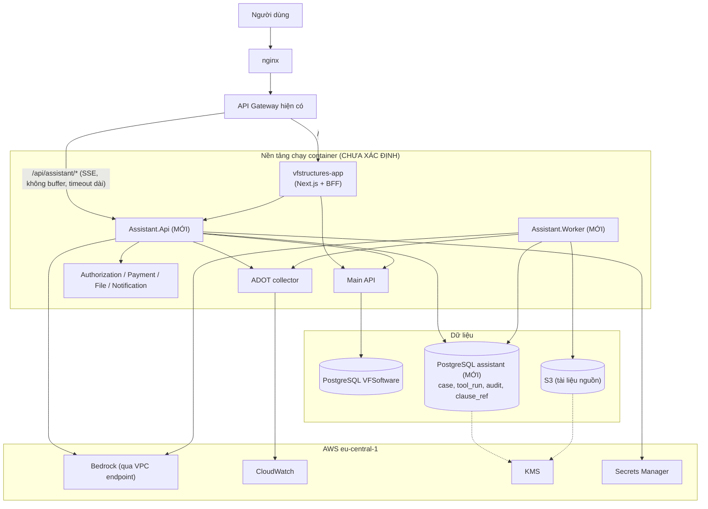
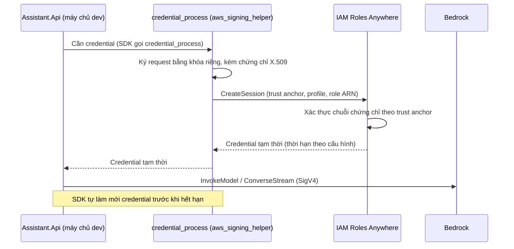
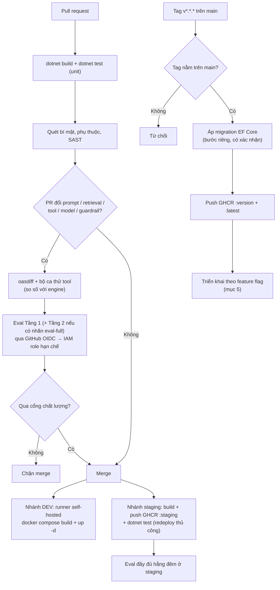
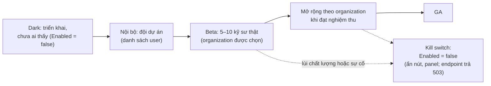

# 09 · Triển khai và vận hành

**Ai đọc:** DevOps, và Backend (phần CI/CD và cấu hình).

---

## Vì sao có tài liệu này

Kiến trúc chạy được trên máy lập trình viên không có nghĩa là chạy được ở production. Hệ thống này có ba chỗ **chỉ hỏng ở production và không hỏng ở môi trường dev**:

1. **Chữ không hiện dần.** Proxy ở production gom cả response rồi trả một lần, nên người dùng nhìn màn hình trắng mười giây. **Không có lỗi nào trong log.** Ở dev không có proxy nên không thấy.
2. **Phiên agent không khởi động được.** Ở chế độ VPC, dịch vụ vòng lặp của AWS kéo container từ một kho ECR riêng qua các VPC endpoint (`ecr.dkr`, `ecr.api`, `s3`, `bedrock-runtime`). Thiếu một endpoint là phiên chết vì image-pull timeout. Theo tài liệu AWS, việc kéo image **không cần NAT gateway**.
3. **Nhánh tìm tài liệu chết trong mạng riêng.** Lời gọi mô hình và lời gọi tìm kiếm đi qua **hai endpoint khác nhau**, mà mọi tài liệu chỉ nhắc cái thứ nhất.

Tài liệu này liệt kê từng chỗ đó, cách dựng, và cách nghiệm thu.

**Mục lục**

1. Topology mục tiêu (mức container)
2. Môi trường
3. Credential cho môi trường không chạy trong AWS
4. CI/CD
5. Phát hành theo giai đoạn
6. Phụ thuộc và sao lưu
7. Bổ sung: chọn nơi chạy, version prompt, kiểm tra sẵn sàng production
8. Bổ sung: cơ sở dữ liệu, tác vụ định kỳ, sẵn sàng
9. Triển khai AgentCore Harness (AD-13)
10. Vận hành trước beta

## Nguyên tắc nền

> **Nghiệm thu phải chạy qua đúng tuyến production, không chỉ localhost.**

Mọi lệnh kiểm trong tài liệu này đều kèm một cách chạy thật. Cấu hình đúng trên giấy mà chưa gọi thử một lần thì chưa tính là xong.

## Thuật ngữ trong tài liệu này

Giải thích đầy đủ, kèm nguồn tra cứu, ở [00-thuat-ngu-va-nguon.md](00-thuat-ngu-va-nguon.md). Bản rút gọn dưới đây chỉ đủ để đọc tiếp tài liệu này.

| Thuật ngữ | Một câu |
| --- | --- |
| **VPC** | Mạng riêng ảo trên AWS — tài nguyên bên trong không ra internet trừ khi mở đường |
| **VPC endpoint** | Lối đi riêng từ trong mạng tới một dịch vụ AWS, không qua internet |
| **NAT gateway** | Cổng cho tài nguyên trong mạng riêng gọi ra internet. Chạy liên tục và tính tiền liên tục |
| **ECS Fargate** | Cách chạy container trên AWS mà không phải quản máy chủ |
| **Idle timeout** | Thời gian bộ cân bằng tải chờ trước khi cắt một kết nối đang rảnh |
| **`proxy_buffering`** | Tùy chọn của nginx quyết định có gom response lại rồi mới trả hay không |
| **Blue-green / canary** | Phát hành song song hai phiên bản, chuyển dần lưu lượng sang bản mới |
| **Kill switch** | Một cờ cấu hình tắt toàn bộ trợ lý mà không phải deploy lại |

---
## 1. Topology mục tiêu (mức container)

**Sơ đồ 10.1 — Deployment topology (giả định GĐ-7)**

**Yêu cầu riêng cho đường SSE (kiểm tra sớm, không đợi tới lúc phát hành):**

| Lớp | Yêu cầu |
| --- | --- |
| nginx | `proxy_buffering off`, `proxy_read_timeout` đủ dài cho một lượt (ví dụ ≥ 120 giây), `X-Accel-Buffering: no` |
| API Gateway | Phải cho phép phản hồi streaming và kết nối dài; nhiều gateway hoặc chế độ gateway **buffer toàn bộ response** và phá hoàn toàn trải nghiệm stream. Đây có thể là điểm chặn lớn nhất của cả dự án nếu bị phát hiện muộn |
| BFF (Next.js) | Route handler trả `ReadableStream`, không `await` toàn bộ body; tắt nén cho đường này |
| Health check | Tách `/health/live` (tiến trình sống) và `/health/ready` (kết nối PostgreSQL, cấu hình Bedrock nạp được); **không** gọi Bedrock trong health check |

**Cấu hình cho PostgreSQL assistant (AD-12, GĐ-5):** extension `unaccent` và `pg_trgm`, chỉ mục GIN trigram trên `clause_ref.clause_path`. Instance riêng hay dùng chung là quyết định vận hành theo Q4 — kho vector nằm ở MKB nên không còn yêu cầu bộ nhớ cho chỉ mục vector. Sao lưu, mã hóa lưu trữ bằng KMS.

---

## 2. Môi trường

| Môi trường | Chạy ở đâu | Bedrock | Ghi chú |
| --- | --- | --- | --- |
| Local | Máy lập trình viên | Profile AWS cá nhân (SSO) hoặc **stub `ILlmClient`** | Phần lớn phát triển không cần gọi Bedrock thật nhờ interface |
| Dev | Máy chủ tự quản 192.168.1.x (`docker compose`) | **Cần cơ chế cấp credential** (§3) | Không có role IAM gắn tự động vì không chạy trong AWS |
| Staging | GHCR `:staging`, triển khai thủ công | Như production, dữ liệu thử | Chạy eval đầy đủ ở đây |
| Production | Nền tảng chưa xác định | Role IAM của nền tảng | Feature flag theo organization |

---

## 3. Credential cho môi trường không chạy trong AWS

Dev (và có thể staging) chạy trên máy chủ tự quản: **không có instance role**, mà Bedrock yêu cầu credential AWS. Khóa IAM tĩnh dài hạn trong biến môi trường là cách dễ nhưng vi phạm nguyên tắc "không khóa tĩnh" ([06](06-bao-mat.md)). Hai hướng thay thế:

| Hướng | Cách hoạt động | Nhược |
| --- | --- | --- |
| **IAM Roles Anywhere** (đề xuất) | Máy chủ giữ chứng chỉ X.509 do CA công ty cấp (đăng ký CA làm trust anchor); profile chỉ định role và session policy; đổi lấy credential tạm thời; AWS SDK nhận qua `credential_process`. Mọi tài nguyên **theo Region** và phải cùng tài khoản, Region với nhau | Cần CA (có thể dùng AWS Private CA). Ranh giới tin cậy ở mức **tài khoản**: chứng chỉ của bất kỳ trust anchor nào có thể assume bất kỳ role nào trong tài khoản trừ khi trust policy có điều kiện; phải giới hạn trust policy của role (trust anchor cụ thể, chủ thể chứng chỉ). Xác minh khi đo |
| Credential tạm từ SSO/`aws login` | Lập trình viên tự đăng nhập | Không dùng được cho dịch vụ chạy nền trên máy chủ dev |
| Khóa IAM tĩnh giới hạn cực hẹp | Người dùng IAM chỉ được gọi các mô hình ở dev, xoay vòng định kỳ | Nếu buộc phải dùng: quyền tối thiểu, xoay vòng, cảnh báo sử dụng, **chỉ ở dev** |

**Sơ đồ 10.2 — Sequence: lấy credential bằng IAM Roles Anywhere (đề xuất)**

Role dành cho dev có phạm vi **hẹp hơn** production (chỉ mô hình cần dùng, hạn mức thấp, có Budgets riêng).

---

## 4. CI/CD

Giữ đúng khuôn hiện có: GitHub Actions cho mỗi repo, image lên GHCR, dev tự động deploy bằng runner self-hosted, staging đẩy image rồi redeploy thủ công, production theo tag `v*.*.*` trên `main`. Assistant thêm ba job: **eval**, **kiểm tra tool registry**, **migration**.

**Sơ đồ 10.3 — Pipeline CI/CD của Assistant**

**Migration:** hệ thống hiện chạy migration thủ công. Assistant giữ nguyên quy ước (migration là bước riêng, không tự chạy khi khởi động), nhưng **schema `assistant` độc lập**, nên migration của Assistant không chạm bảng của service khác. Đổi mô hình embedding **không** phải là migration của PostgreSQL: đó là tạo Knowledge Base mới rồi nạp lại từ cùng tiền tố S3, theo quy trình ở [01](01-kien-truc.md)

**Quản lý version prompt:** system prompt, cấu hình guardrail và manifest tool nằm trong repo, có version; mỗi `message` ghi `prompt_version`. Đổi prompt là thay đổi code, qua PR và eval.

---

## 5. Phát hành theo giai đoạn

Không có dịch vụ feature flag riêng, nên dùng cấu hình: cờ tổng `Assistant:Enabled` và **danh sách cho phép theo organization**. Module `Assistant.Use` (Authorization API) là lớp kiểm soát thứ hai.

**Sơ đồ 10.4 — Các bước phát hành**

**Kill switch** phải tắt được **không cần triển khai lại** (đọc cấu hình động), và tắt AI không được ảnh hưởng tới tính toán, dự án hay bất kỳ chức năng nào hiện có. Đây là tiêu chí thiết kế: Assistant là tính năng cộng thêm, không nằm trên đường găng của sản phẩm.

---

## 6. Phụ thuộc và sao lưu

| Hạng mục | Cách xử lý |
| --- | --- |
| Sao lưu PostgreSQL assistant | Theo chính sách hiện có; **kho vector dựng lại được** từ tệp nguồn (S3) nên ưu tiên sao lưu `conversation`, `case`, `audit_event`, `feedback` |
| Khôi phục kho tài liệu | Chạy lại ingestion từ S3; có `sha256` và `embedding_model` để biết cần nhúng lại phần nào |
| Bedrock ngừng hoạt động | Chế độ chỉ-truy-xuất ([01](01-kien-truc.md)); tính toán và ứng dụng không phụ thuộc |
| Region chính (`eu-central-1`, Frankfurt) gặp sự cố | Ngoài phạm vi hiện tại; chấp nhận. Failover đa vùng phục vụ mục tiêu 99,5% mà giai đoạn này chưa cam kết |
| Vòng đời mô hình | Sonnet 5 đã công bố mốc EOL; đặt lịch xem lại định kỳ. Đổi mô hình = đổi cấu hình + chạy eval, không sửa code nghiệp vụ nhờ `ILlmClient` |

---

## 7. Bổ sung: chọn nơi chạy, version prompt, kiểm tra sẵn sàng production

### Chọn nơi chạy Assistant.Api (khi nền tảng AWS được chốt)

Theo sách AI Agents on AWS và Building Gen AI Applications with Amazon Bedrock, áp cho đặc điểm của Assistant: luồng SSE kéo dài, hội thoại nhiều lượt, kết nối tới PostgreSQL và Bedrock.

| Nơi chạy | Hợp khi | Với Assistant |
| --- | --- | --- |
| Lambda | Việc ngắn, không trạng thái, lưu lượng khó đoán; trần thực thi 15 phút; khởi động nguội vài giây | **Không hợp** cho đường SSE và pool kết nối PostgreSQL; hợp cho job nền nhỏ (ví dụ dọn retention) |
| **ECS trên Fargate** | Hội thoại nhiều lượt, trạng thái nóng, kết nối bền, không cần quản lý máy chủ | **Mặc định đề xuất** nếu chọn nền tảng mới cho Assistant.Api và Worker |
| AgentCore Runtime | Cô lập theo người dùng, xác thực/chính sách/quan sát có sẵn | Vòng lặp tool đã chạy trên AgentCore (AD-13), nhưng `Assistant.Api` giữ SSE và pool kết nối PostgreSQL nên vẫn là container thường; Runtime cho `Assistant.Api` là chuyện của pha 2 |
| Giữ nguyên nền tảng hiện có | Đội đã vận hành nền tảng đó | **Ưu tiên** nếu production hiện đã ổn định; Assistant chỉ là một container nữa |

Đây là khuyến nghị điều kiện, không phải quyết định, vì Q4 ([10](10-rui-ro.md)) chưa trả lời.

### Version prompt

Đánh version theo ngữ nghĩa và ghi vào `message.prompt_version`:

| Thay đổi | Tăng | Ví dụ |
| --- | --- | --- |
| Đổi hành vi hoặc hợp đồng đầu ra | MAJOR | Đổi định dạng trích dẫn, đổi quy tắc từ chối |
| Cải tiến tương thích ngược | MINOR | Thêm thuật ngữ, thêm ví dụ |
| Sửa câu chữ, định dạng | PATCH | Sửa lỗi chính tả trong prompt |

Prompt không nằm cứng trong chuỗi ký tự rải rác của code, mà ở tệp có version trong repo, nạp lúc khởi động; đổi prompt vẫn qua PR và eval ([08](08-eval-quan-sat.md)).

### Bản ghi kiểm toán cho mỗi lượt

Ngoài nội dung câu hỏi/trả lời, `message` lưu: `prompt_version`, `prompt_hash` (băm của prompt cuối đã dựng), `guardrail_summary` (hành động và loại bộ lọc, **không** chứa văn bản khớp), `model_id`. Cùng `retrieval_log` và `tool_run`, đủ dựng lại vì sao hệ thống đưa ra kết quả đó mà không phải lưu nguyên văn prompt đã dựng.

### Kiểm tra sẵn sàng production

Trước khi phát hành beta ra ngoài đội, mỗi mục phải có bằng chứng:

- [ ] Xử lý lỗi thật sự (không có `catch` rỗng); lỗi có mã và hướng xử lý
- [ ] Quan sát cấp request: trace, log có cấu trúc, cảnh báo
- [ ] Suy giảm có kiểm soát khi nhà cung cấp mô hình sự cố (chế độ chỉ-truy-xuất đã thử)
- [ ] Giới hạn tài nguyên: rate limit, quota, timeout, số vòng tool tối đa
- [ ] Người ngoài đội đã chạy được từ đầu theo tài liệu (không chỉ tác giả)
- [ ] Rollback và kill switch đã diễn tập
- [ ] Ước tính chi phí và Budgets đã đặt
- [ ] Không có bí mật cứng trong code, URI nội bộ cứng trong tool

---

## 8. Bổ sung: cơ sở dữ liệu, tác vụ định kỳ, sẵn sàng

- **Vai trò cơ sở dữ liệu tách nhau:** vai trò migration (có quyền tạo bảng, chỉ mục và **`CREATE EXTENSION`**) khác vai trò runtime của Assistant (chỉ đọc/ghi bảng của schema `assistant`, không có quyền tạo extension hay superuser). Tương tự thói quen tắt `enable_load_extension` sau khi nạp extension: bề mặt tấn công qua extension không được để mở ở tài khoản ứng dụng.
- **Kiểm tra sẵn sàng (`/health/ready`)** gồm: kết nối PostgreSQL, extension `unaccent` và `pg_trgm` có mặt. **Không kiểm cấu hình full-text-search theo ngôn ngữ** — không còn extension đó trong thiết kế này (xem [05](05-devops.md) mục 4A-bis). Kiểm tra khi khởi động thay vì phát hiện lúc có người hỏi. Phần tìm kiếm hybrid nay do MKB làm, không còn truy vấn UNION trong PostgreSQL; PostgreSQL chỉ còn giữ stage 1 (`pg_trgm` trên `clause_ref`).
- **Kết nối:** `NpgsqlDataSource` singleton, giới hạn số kết nối; nếu nhiều instance, cân nhắc bộ gom kết nối (RDS Proxy hoặc PgBouncer) để không chạm giới hạn kết nối của PostgreSQL.
- **Tác vụ định kỳ** (dọn retention, tổng hợp eval, tổng hợp chi phí): chạy như tác vụ chạy-một-lần theo lịch (ví dụ ECS scheduled task với `RunTask`) hoặc `BackgroundService` trong Worker, không gắn vào tiến trình phục vụ người dùng.
- **Job ingestion lỗi** không biến mất: trạng thái `Failed` kèm lỗi là hàng đợi thư chết (dead-letter) tương đương; có cảnh báo và quy trình sửa rồi đưa lại `Queued`.

### Bảy chiều triển khai cần rà cùng nhau

Sách Generative AI Tools nêu bảy chiều phải giải cùng lúc, không chỉ chất lượng hội thoại: **độ trễ**, **hiệu quả** (chi phí, tài nguyên), **quyền riêng tư**, **khả năng mở rộng**, **giám sát**, **khả năng tương tác** (giao thức và tích hợp với hệ thống hiện có), **trải nghiệm người dùng**. Dùng làm danh mục rà soát cuối giai đoạn sau, mỗi chiều có người chịu trách nhiệm và bằng chứng.

**Cờ tính năng bằng cấu hình** không phân đoạn theo người dùng và cần triển khai lại để đổi (sách AI-Enhanced Web Apps). Chấp nhận được cho MVP vì có allowlist theo organization và kill switch đọc cấu hình động ([09](09-trien-khai.md)); nếu cần phân đoạn tinh hơn hoặc thay đổi thường xuyên, chuyển sang dịch vụ quản lý cờ tính năng.

---

## 8a. Ingestion điều phối bằng Step Functions (AD-20 — Proposed)

Kể từ AD-17, pipeline nạp có sáu chặng: parse → cắt đoạn → ghi chunk và sidecar lên S3 → `start-ingestion-job` → poll tới `COMPLETE` → đổi `status` sang `active` và nạp lại. Chặng 4 và 5 là gọi dịch vụ bất đồng bộ, và chặng 6 phải chạy đúng thứ tự sau chặng 5.

**Đề xuất:** Step Functions điều phối, S3 Event Notification kích hoạt khi có tệp nguồn mới. Mỗi chặng tự retry và debug riêng, không phải tự viết máy trạng thái job.

| | Bảng hàng đợi PostgreSQL (AD-11) | Step Functions (AD-20) |
| --- | --- | --- |
| Retry từng chặng | Tự viết | Có sẵn |
| Nhìn được job đang kẹt ở đâu | Tự dựng | Có sẵn |
| Hạ tầng mới trong giai đoạn đầu | Không | Có — cộng vào R39 |
| Chi phí | Gần bằng không | Theo số lần chuyển trạng thái |

AD-11 **giữ nguyên** cho các job nền khác (dọn retention, tổng hợp eval, tổng hợp chi phí). AD-20 chỉ nhắm vào nhánh ingestion, và đang ở trạng thái **Proposed**.

Ba việc nhỏ không cần thành AD: retry Bedrock bằng cấu hình SDK (`standard` hoặc `adaptive`) chứ không phải vòng `Thread.Sleep` tự viết — retry đồng loạt tạo hiệu ứng bầy đàn và làm throttling nặng thêm; **AWS Budgets và Cost Anomaly Detection bật trước khi tăng lưu lượng**, không phải sau; prompt của router và của câu trả lời tách khỏi mã qua Bedrock Prompt Management (AD-19).

---

## 9. Triển khai AgentCore Harness (AD-13)

> **Thuộc giai đoạn đầu.** Facade C#, Gateway `vf-tools` và Cedar Policy phải có trong CI từ giai đoạn đầu, cùng lúc với bốn kiểm chứng quyết định ([01](01-kien-truc.md)). Nếu V-A1 hoặc V-A6 trượt thì bỏ mục này và chạy [01](01-kien-truc.md)

| Chủ đề | Nội dung |
| --- | --- |
| Cấu hình như mã | Định nghĩa Harness nằm trong repo (CloudFormation có tài nguyên `AWS::BedrockAgentCore::Harness`; hoặc AgentCore CLI); đi qua cùng luồng CI/CD và cổng eval như prompt ([01](01-kien-truc.md)) |
| Phiên bản và endpoint | Harness có phiên bản bất biến và endpoint đặt tên; dùng endpoint riêng cho staging và production, hoàn tác bằng cách trỏ endpoint về phiên bản trước |
| Mạng | Chế độ VPC cần endpoint `ecr.dkr`, `ecr.api`, `s3` (gateway) và `bedrock-runtime`; thiếu thì phiên không khởi động được vì kéo image quá thời gian |
| Vai thực thi | Tạo riêng, quyền tối thiểu: gọi model qua profile `eu.*`, `bedrock:ApplyGuardrail`, quyền ghi CloudWatch/X-Ray; ở chế độ VPC thêm quyền pull repo ECR riêng `harness-*` (`ecr:BatchGetImage`, `ecr:GetDownloadUrlForLayer`, `ecr:BatchCheckLayerAvailability`, `ecr:GetAuthorizationToken`); không có Memory, Browser, Code Interpreter |
| Gateway và facade | Gateway `vf-tools` với target OpenAPI tới facade; Cedar Policy đi kèm mã. Cách Gateway tới được facade (công khai hay riêng) chốt ở V-A6. **Thứ tự bắt buộc:** tạo credential provider **trước** rồi mới tạo target. Endpoint target **phải là HTTPS**, Gateway từ chối HTTP. Trạng thái chờ là `READY`, **không có** `ACTIVE`; `CREATE_PENDING_AUTH` nghĩa là đang chờ người dùng liên kết OAuth |
| Mạng của Harness ở chế độ VPC | **Không cần NAT gateway để kéo image** (V-A10 đã trả lời). Harness kéo image từ ECR riêng qua endpoint `ecr.dkr`, `ecr.api`, `s3` (gateway) và `bedrock-runtime`, như dòng trên. Chỉ thêm đường ra internet khi có việc cụ thể cần, và khi thêm thì không nới rộng chiều vào |
| Chi phí | Tag Harness để phân bổ; Runtime tính theo CPU và bộ nhớ tiêu thụ từng giây; Runtime v2 thu hồi bộ nhớ rảnh sau 120 giây. Ước lượng bằng số đo của đợt kiểm chứng V-A ở giai đoạn đầu, không bằng đơn giá tham khảo |

---

## 9a. Guardrail: runbook cho DevOps

Các bước tạo, thử, chốt bản đánh số và ép buộc bằng IAM, kèm bốn file cấu hình đầy đủ, nằm ở [05](05-devops.md) Bước 2A. Mục này chỉ nhắc ba việc ở mức triển khai, không lặp lại runbook. Ba việc thuộc DevOps và **không** nằm trong phạm vi đội backend:

1. **Tạo guardrail và chốt bản đánh số** trước khi `Assistant.Api` lên môi trường dùng chung. Ứng dụng ghim `Guardrail:Id` và `Guardrail:Version` qua cấu hình; `DRAFT` không bao giờ vào production.
2. **Chính sách IAM ép buộc** bằng điều kiện `bedrock:GuardrailIdentifier`, chỉ áp cho ARN mô hình chat. Không có nó thì guardrail bị bỏ qua chỉ bằng cách xóa một trường, và **không có lỗi nào báo**.
3. **Bảo vệ CloudWatch Logs**: customer-managed KMS key, siết quyền đọc, đặt hạn lưu trữ. Che PII chỉ áp cho response; bản gốc vẫn vào log nguyên văn. Đây là điều kiện tuân thủ, không phải tối ưu.

Việc 1 nằm trên đường găng của cổng hạ tầng: không có guardrail thì lượt đầu tiên chạy hết đường thật chưa đủ điều kiện nghiệm thu.

---

## 10. Vận hành trước beta

Bộ tài liệu chưa có phần vận hành. Không bắt buộc cho giai đoạn đầu, **bắt buộc trước dark launch và beta** ([01](01-kien-truc.md)):

| Hạng mục | Nội dung |
| --- | --- |
| Người trực | Một người trực mỗi tuần beta, có tên và cách liên lạc; ai xử lý sự cố ngoài giờ |
| Runbook | Một trang cho mỗi cảnh báo trong bảng *Chỉ số và cảnh báo* ở [08](08-eval-quan-sat.md): triệu chứng, kiểm gì trước, cách tắt (kill switch, tắt rerank, chế độ chỉ-truy-xuất) |
| Leo thang | Từ người trực tới L, rồi tới công ty; ngưỡng thời gian cho từng mức |
| Sau sự cố | Rà soát không quy lỗi cá nhân; mọi phát hiện thành một hạng mục có chủ sở hữu ([06](06-bao-mat.md)) |

---

## Liên quan

| Cần gì | Đọc |
| --- | --- |
| Kiến trúc tổng thể, điểm vào của bộ | [01-kien-truc.md](01-kien-truc.md) |
| Dựng từng hạ tầng AWS, mạng và quyền | [05-devops.md](05-devops.md) |
| Quan sát và cảnh báo sau khi phát hành | [08-eval-quan-sat.md](08-eval-quan-sat.md) §4 |
| Mục lục cả bộ | [README.md](README.md) |
