# 16 · Hướng dẫn cấu hình trên console AWS

**Đối tượng đọc:** tài liệu này dành cho người thực thi trực tiếp trên giao diện console, không sử dụng CLI.

Tài liệu này được trình bày theo đúng thứ tự của [05-devops.md](05-devops.md). Mỗi mục bao gồm một link console, ảnh chụp từng bước và giá trị cần điền. Mọi giá trị trong tài liệu đều được lấy từ [05](05-devops.md) §2A, [09](09-trien-khai.md) và [15](15-chi-tiet-devops.md); những chỗ mà thiết kế chưa chốt đều được ghi rõ là chưa chốt và không được tự đặt. Mục **J** ở cuối đặt cạnh mỗi dịch vụ một bản tự dựng chạy trong máy chủ công ty, dành cho lúc câu hỏi về on-prem được đặt ra.

**Vùng làm việc là `eu-central-1` (Europe — Frankfurt).** Vùng này cần được kiểm ở góc trên bên phải trước mỗi thao tác. Một link không kèm tham số vùng sẽ mở ở đúng vùng đang chọn của phiên, và tài nguyên của dự án không nằm ở vùng nào khác.

Ảnh chụp trong tài liệu đã được che tên và số tài khoản. Con số trong khung đỏ là thứ tự thao tác, còn dòng chữ bên cạnh giải thích trường đó dùng để làm gì.

---

## Mục lục

- [A · Bedrock Guardrails](#a--bedrock-guardrails)
  - [A.1 Mở trình tạo](#a1-mở-trình-tạo)
  - [A.2 Bước 1 — Guardrail details](#a2-bước-1--guardrail-details)
  - [A.3 Bước 2 — Content filters](#a3-bước-2--content-filters)
  - [A.4 Bước 3 — Denied topics](#a4-bước-3--denied-topics)
  - [A.5 Bước 5 — Sensitive information](#a5-bước-5--sensitive-information)
  - [A.6 Bước 6 — Contextual grounding](#a6-bước-6--contextual-grounding)
  - [A.7 Hai việc console không làm thay](#a7-hai-việc-console-không-làm-thay)
  - [A.8 Chi phí](#a8-chi-phí)
- [B · Knowledge Base — nạp chunk tự cắt, bỏ parse/chunk mặc định](#b--knowledge-base--nạp-chunk-tự-cắt-bỏ-parsechunk-mặc-định)
  - [B.1 Hai loại KB, chỉ một loại cho tự cắt chunk](#b1-hai-loại-kb-chỉ-một-loại-cho-tự-cắt-chunk)
  - [B.2 Tạo KB có chọn chunking](#b2-tạo-kb-có-chọn-chunking)
  - [B.3 Bước 2 — chọn No chunking](#b3-bước-2--chọn-no-chunking)
  - [B.4 Bước 3 — vector store](#b4-bước-3--vector-store)
  - [B.4a Quick create dựng index S3 Vectors bằng tham số gì](#b4a-quick-create-dựng-index-s3-vectors-bằng-tham-số-gì)
  - [B.4b Lỗi quyền đầu tiên gặp phải](#b4b-lỗi-quyền-đầu-tiên-gặp-phải)
  - [B.5 Nạp chunk lên: hai cách](#b5-nạp-chunk-lên-hai-cách)
  - [B.6 Chi phí embedding, truy vấn và rerank](#b6-chi-phí-embedding-truy-vấn-và-rerank)
- [C · Cổng truy cập và hạn mức](#c--cổng-truy-cập-và-hạn-mức)
  - [C.1 Model access — trang này đã bị gỡ](#c1-model-access--trang-này-đã-bị-gỡ)
  - [C.2 Service Quotas](#c2-service-quotas)
  - [C.3 Chi phí gọi mô hình](#c3-chi-phí-gọi-mô-hình)
- [D · Khoá, kho và sổ ghi](#d--khoá-kho-và-sổ-ghi)
  - [D.1 KMS — khoá customer-managed](#d1-kms--khoá-customer-managed)
  - [D.2 S3 — bucket nguồn](#d2-s3--bucket-nguồn)
  - [D.3 CloudWatch Logs](#d3-cloudwatch-logs)
  - [D.4 Parameter Store — kill switch](#d4-parameter-store--kill-switch)
  - [D.5 CloudTrail — data event](#d5-cloudtrail--data-event)
  - [D.6 Bedrock — Model invocation logging](#d6-bedrock--model-invocation-logging)
  - [D.7 Chi phí](#d7-chi-phí)
- [E · AgentCore](#e--agentcore)
  - [E.1 Advanced configurations — số vòng và thời gian chờ](#e1-advanced-configurations--số-vòng-và-thời-gian-chờ)
  - [E.2 Inbound Auth — danh tính gọi vào](#e2-inbound-auth--danh-tính-gọi-vào)
  - [E.3 Gateway](#e3-gateway)
  - [E.4 Chi phí](#e4-chi-phí)
- [F · Mạng, container, mạng biên](#f--mạng-container-mạng-biên)
  - [F.1 VPC endpoint](#f1-vpc-endpoint)
  - [F.2 ECR](#f2-ecr)
  - [F.3 ECS](#f3-ecs)
  - [F.4 ALB — cho SSE đi qua](#f4-alb--cho-sse-đi-qua)
  - [F.5 CloudFront](#f5-cloudfront)
  - [F.6 Chi phí](#f6-chi-phí)
- [G · Chi phí](#g--chi-phí)
  - [G.1 Cost Explorer — đã bật, đang chờ dữ liệu](#g1-cost-explorer--đã-bật-đang-chờ-dữ-liệu)
  - [G.2 Cost Anomaly Detection — còn một việc phải làm](#g2-cost-anomaly-detection--còn-một-việc-phải-làm)
  - [G.3 Kích hoạt cost allocation tags](#g3-kích-hoạt-cost-allocation-tags)
  - [G.4 Chi phí của chính các công cụ này](#g4-chi-phí-của-chính-các-công-cụ-này)
- [H · IAM — role và policy least-privilege](#h--iam--role-và-policy-least-privilege)
  - [H.1 Chọn loại thực thể tin cậy](#h1-chọn-loại-thực-thể-tin-cậy)
  - [H.2 Dán policy least-privilege (tab JSON)](#h2-dán-policy-least-privilege-tab-json)
  - [H.3 Trust policy chống confused-deputy](#h3-trust-policy-chống-confused-deputy)
- [I · Cơ sở dữ liệu — RDS/Aurora PostgreSQL](#i--cơ-sở-dữ-liệu--rdsaurora-postgresql)
  - [I.1 Engine và template](#i1-engine-và-template)
  - [I.2 Connectivity — trong VPC, không public](#i2-connectivity--trong-vpc-không-public)
  - [I.3 Encryption at-rest](#i3-encryption-at-rest)
  - [I.4 Row-Level Security và extension — [SQL], không có trên Console](#i4-row-level-security-và-extension--sql-không-có-trên-console)
  - [I.5 Chi phí](#i5-chi-phí)
- [J · Bản tự dựng on-prem cho từng dịch vụ](#j--bản-tự-dựng-on-prem-cho-từng-dịch-vụ)
  - [J.1 Mô hình nền — chỗ không có bản thay thế tương đương](#j1-mô-hình-nền--chỗ-không-có-bản-thay-thế-tương-đương)
  - [J.2 Guardrails](#j2-guardrails)
  - [J.3 Knowledge Base, embedding và rerank](#j3-knowledge-base-embedding-và-rerank)
  - [J.4 Khoá, kho và sổ ghi](#j4-khoá-kho-và-sổ-ghi)
  - [J.5 Vòng lặp agent](#j5-vòng-lặp-agent)
  - [J.6 Mạng, container và mạng biên](#j6-mạng-container-và-mạng-biên)
  - [J.7 Chi phí và giám sát chi phí](#j7-chi-phí-và-giám-sát-chi-phí)
  - [J.8 Danh tính và quyền](#j8-danh-tính-và-quyền)
  - [J.9 PostgreSQL](#j9-postgresql)
  - [J.10 Cái mất, cái được, và cái phải đo trước khi chốt](#j10-cái-mất-cái-được-và-cái-phải-đo-trước-khi-chốt)
- [Nguồn](#nguồn)

---

## A · Bedrock Guardrails

Link: `https://eu-central-1.console.aws.amazon.com/bedrock/home?region=eu-central-1#/guardrails`

### A.1 Mở trình tạo

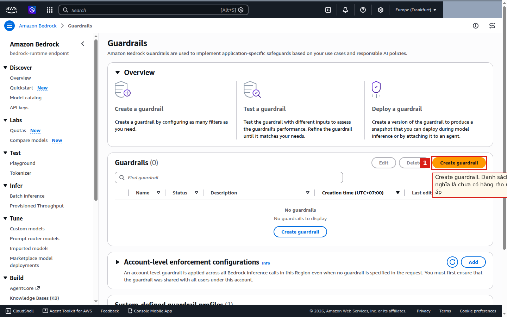

Danh sách trống có nghĩa là **chưa có guardrail nào được áp dụng**. AWS không bật sẵn guardrail nào cho tài khoản ([05](05-devops.md) §2A.1).

### A.2 Bước 1 — Guardrail details

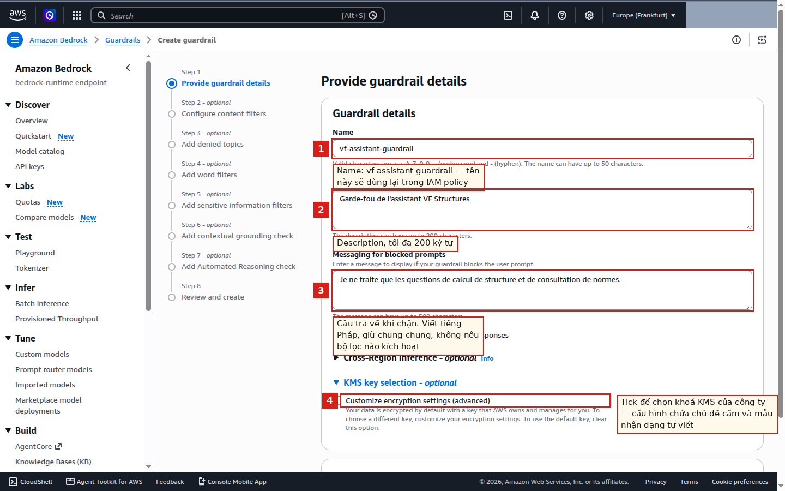

| Ô | Giá trị | Vì sao |
| --- | --- | --- |
| **Name** | `vf-assistant-guardrail` | Tên này được dùng lại trong IAM policy để chặn các lời gọi model thiếu guardrail |
| **Description** | `Garde-fou de l'assistant VF Structures` | Phần mô tả có độ dài tối đa 200 ký tự |
| **Messaging for blocked prompts** | `Je ne traite que les questions de calcul de structure et de consultation de normes.` | Người dùng gõ tiếng Pháp nên thông điệp được giữ ở mức chung chung và không nêu bộ lọc nào đã kích hoạt |
| **Apply the same blocked message for responses** | Được bật sẵn, và có thể bỏ chọn khi cần một thông điệp riêng cho chiều ra | Ô này tương ứng với tham số `--blocked-outputs-messaging` |
| **KMS key selection → Customize encryption settings** | Khoá customer-managed của công ty | Cấu hình chứa các chủ đề cấm và mẫu nhận dạng tự viết nên cần được mã hoá bằng khoá riêng ([06](06-bao-mat.md) §13) |

Trình tạo gồm 8 bước theo thứ tự: details → content filters → denied topics → word filters → sensitive information → contextual grounding → automated reasoning → review and create.

### A.3 Bước 2 — Content filters

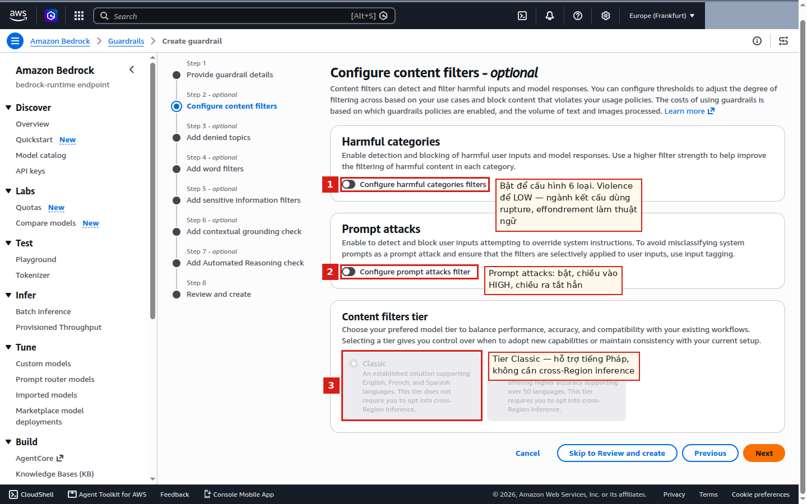

Bước này gồm hai công tắc và một lựa chọn tier. Cả hai công tắc đều **mặc định tắt**, nên nếu không được bật thì bước này không áp dụng bộ lọc nào.

| Ô | Giá trị | Vì sao |
| --- | --- | --- |
| **Configure harmful categories filters** | Được bật, với từng loại được đặt như sau: `MISCONDUCT`, `HATE`, `INSULTS`, `SEXUAL` ở mức Medium, và **`VIOLENCE` ở mức Low** | Ngành kết cấu dùng "rupture par cisaillement" và "effondrement" làm thuật ngữ, nên nếu đặt ở mức cao thì bộ lọc sẽ chặn nhầm các câu hỏi kỹ thuật hợp lệ |
| **Configure prompt attacks filter** | Được bật, với chiều vào ở mức High và chiều ra tắt hẳn | Loại bộ lọc này chỉ có ý nghĩa ở chiều vào, và việc tắt hẳn chiều ra giúp phần đó không bị tính phí |
| **Content filters tier** | **Classic** | Tier này hỗ trợ tiếng Pháp và không đòi hỏi cross-Region inference, nhờ đó dữ liệu được giữ trong EU (Q1) |

### A.4 Bước 3 — Denied topics

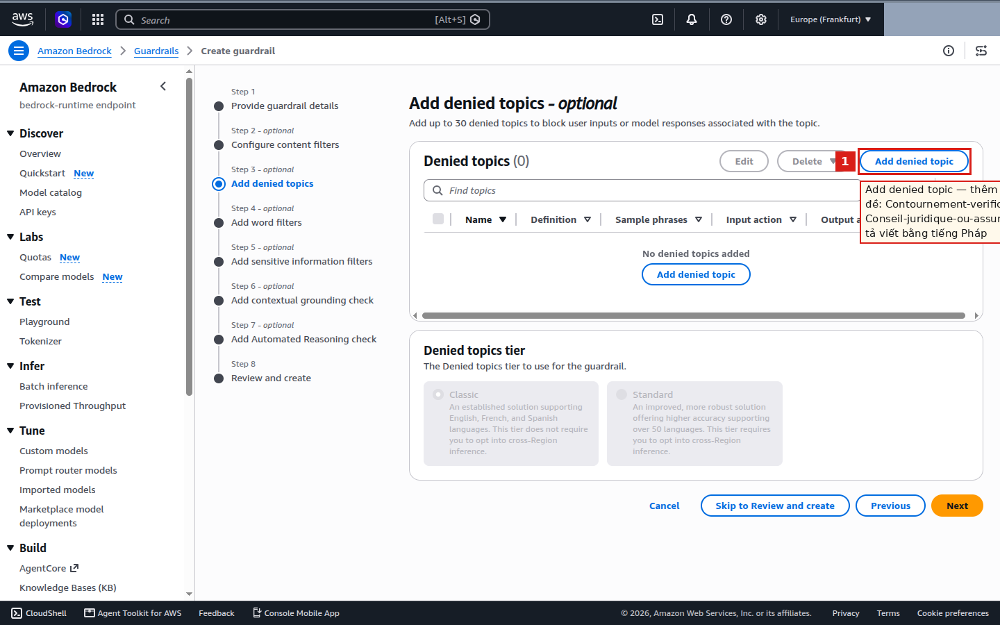

Hai chủ đề được thêm vào, với **phần mô tả và ví dụ được viết bằng tiếng Pháp** vì người dùng gõ tiếng Pháp:

| Tên | Chặn cái gì |
| --- | --- |
| `Contournement-verification` | Các câu hỏi về cách làm sai lệch dữ liệu đầu vào, khai thiếu tải, hạ hệ số an toàn hoặc né quy trình kiểm định |
| `Conseil-juridique-ou-assurance` | Các câu hỏi về trách nhiệm dân sự, bảo hiểm, bảo hành mười năm hoặc hậu quả tranh chấp |

Các giới hạn cứng của bước này gồm: tối đa 30 chủ đề, trường `definition` tối đa 200 ký tự, tối đa 5 ví dụ và mỗi ví dụ tối đa 100 ký tự. Bước này chỉ có chiều `DENY` và không có chiều "chỉ cho phép chủ đề này".

### A.5 Bước 5 — Sensitive information

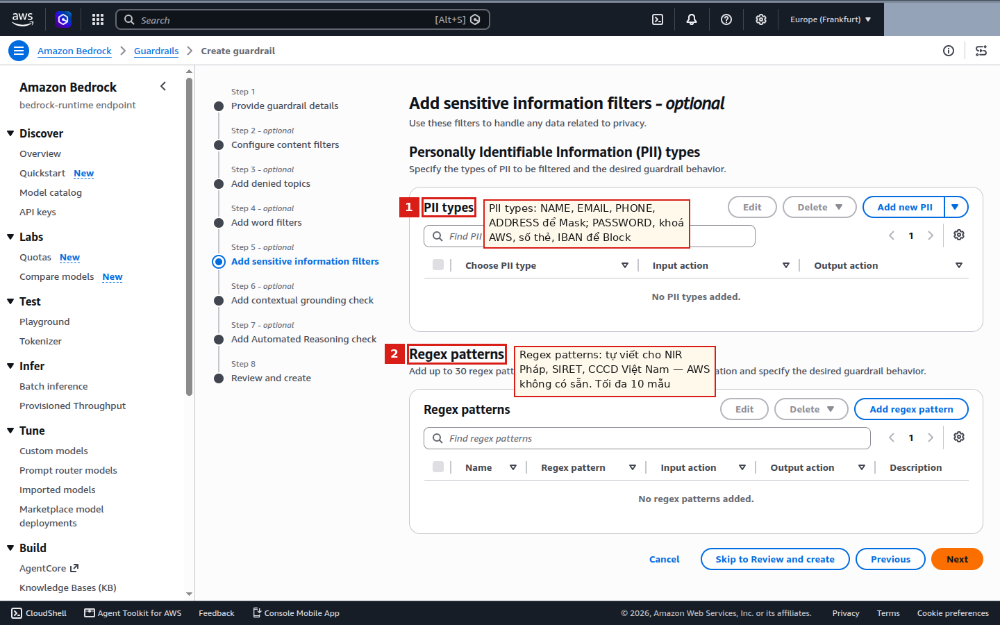

| Nhóm | Giá trị |
| --- | --- |
| **PII types → Mask** | `NAME`, `EMAIL`, `PHONE`, `ADDRESS`, là những loại xuất hiện thường xuyên và vô hại trong ngữ cảnh công việc |
| **PII types → Block** | `PASSWORD`, `AWS_ACCESS_KEY`, `AWS_SECRET_KEY`, `CREDIT_DEBIT_CARD_NUMBER`, `INTERNATIONAL_BANK_ACCOUNT_NUMBER` |
| **Regex patterns** | Các mẫu tự viết cho NIR Pháp, SIRET và căn cước công dân Việt Nam |

AWS có sẵn 31 loại PII nhưng **không có loại nào dành cho Pháp và Việt Nam**, do đó ba mẫu regex ở trên là phần việc thật sự cần làm chứ không phải chi tiết vặt. Giới hạn áp dụng cho phần này là tối đa 10 mẫu và mỗi mẫu tối đa 500 ký tự.

### A.6 Bước 6 — Contextual grounding

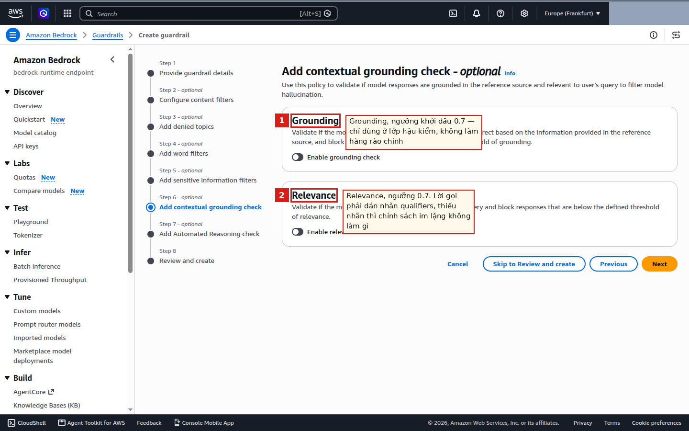

Bước này gồm hai tham số là Grounding và Relevance, cả hai đều có ngưỡng khởi đầu là **0.7**. Đây là **điểm khởi đầu theo khuyến nghị chứ không phải số đo**, và cần được hiệu chỉnh bằng eval.

Điều kiện bắt buộc là mỗi lời gọi phải dán nhãn `qualifiers`, trong đó `grounding_source` dùng cho nguồn và `query` dùng cho câu hỏi. **Nếu không dán nhãn thì chính sách này sẽ im lặng và không làm gì**, nên cần có test để bắt trường hợp này.

### A.7 Hai việc console không làm thay

**Ngay sau khi tạo, guardrail ở trạng thái bản `DRAFT`.** Bản này cần được chốt thành một bản đánh số qua một thao tác thứ hai, bởi vì `DRAFT` có thể bị đổi bất cứ lúc nào và khi đó hệ thống đang chạy sẽ đổi hành vi ngay lập tức mà không ai biết.

**Guardrail chỉ chạy khi lời gọi có khai báo nó.** Nếu trường khai báo bị bỏ ra khỏi mã thì mọi bộ lọc sẽ biến mất mà không có lỗi nào được báo. Trường hợp này được chặn bằng một IAM policy `Deny` có điều kiện `bedrock:GuardrailIdentifier`, với chi tiết ở [05](05-devops.md) §2A.7.

**Ghi chú về độ ổn định của console.** Trong lần dựng đầu tiên, các bước 2–8 trả về thông báo "Unable to load content" do gói giao diện bị HTTP 403 ở `a.b.cdn.console.awsstatic.com`, và tình trạng này thường hết khi thử lại sau ít phút. Nếu lỗi lặp lại, runbook CLI ở [05](05-devops.md) §2A.4 vẫn chạy được ngay vì không phụ thuộc vào giao diện.

### A.8 Chi phí

Các mục Chi phí trong tài liệu này dùng đơn giá on-demand ở `eu-central-1`, tính bằng USD và chưa gồm thuế, đọc từ AWS Price List Bulk API ngày 25/09/2026. Ví dụ theo tháng dựa trên kịch bản **Một công ty**, tức 19 800 lượt hỏi mỗi tháng ở [13](13-chi-phi.md) §5, và ngày công bố của từng bảng giá nằm ở G.4.

Guardrails tính tiền theo **text unit**, mỗi text unit chứa tối đa 1 000 ký tự, và mỗi loại bộ lọc được tính riêng trên cùng một đoạn chữ.

| Bộ lọc | Đơn giá ở `eu-central-1` |
| --- | --- |
| Content filters, gồm cả prompt attack | 0,15 $/1 000 text unit |
| Denied topics | 0,15 $/1 000 text unit |
| Sensitive information (loại PII có sẵn) | 0,10 $/1 000 text unit |
| Contextual grounding | 0,10 $/1 000 text unit |
| Word filters, và regex tự viết trong Sensitive information | Không tính phí |

Cấu hình ở A.3–A.6 bật cả bốn loại trả phí, nên mỗi 1 000 text unit đi qua guardrail tốn **0,50 $**, hoặc 0,40 $ khi tắt contextual grounding.

Số tiền của Guardrails đi theo **lượng chữ** chứ không đi theo số lượt, và phần chữ lớn nhất nằm ở các chunk bọc `guardContent` chứ không nằm ở câu hỏi. Theo [13](13-chi-phi.md) §6, riêng việc soát 12 chunk mỗi lượt đã tốn khoảng 87 $/tháng ở kịch bản Một công ty, dù nội dung chunk không đổi giữa các lượt. Cách giảm hiệu quả nhất là soát chunk một lần lúc nạp, nhưng cách này bỏ lớp soát prompt injection gián tiếp lúc truy vấn, nên chỉ được áp dụng khi [06](06-bao-mat.md) đồng ý.

Contextual grounding là khoản nên cân nhắc riêng. Kịch bản gốc ở [13](13-chi-phi.md) tính nó ở trạng thái tắt, và bật cho mọi câu trả lời làm tổng tháng tăng thêm khoảng 26,81 $. Việc tắt hẳn chiều ra của prompt attack ở A.3 đã loại được một phần phí mà không mất gì, còn tắt guardrail ở đầu ra thì không bao giờ được coi là một cách giảm chi phí.

---

## B · Knowledge Base — nạp chunk tự cắt, bỏ parse/chunk mặc định

Đây là phần cần đọc kỹ nhất, bởi vì **việc lựa chọn loại KB quyết định có được tự cắt chunk hay không**, và một khi đã chọn thì không đổi lại được.

Trên Bedrock có ba hướng dựng knowledge base cho truy xuất và RAG, và mỗi hướng có ưu nhược riêng nên cần cân nhắc kỹ trước khi chọn (theo tài liệu Knowledge Base của Amazon Bedrock):

| Loại KB | Ưu điểm | Nhược điểm | Khi nào phù hợp |
| --- | --- | --- | --- |
| **Bedrock-managed KB** | AWS quản lý trọn gói việc lưu trữ, parse, cắt chunk và truy xuất, nên không phải dựng hay vận hành hạ tầng; ngoài ra còn có sẵn embedding, reranker và agentic retrieval được quản lý | Không chọn được chiến lược chunking (do đó không có No chunking), không kiểm soát được vector store và ít khả năng tuỳ biến | Phù hợp với phần lớn nhu cầu RAG thông thường, khi ưu tiên sự đơn giản và không muốn tự vận hành hạ tầng |
| **Customer-managed KB (unstructured vector store)** | Cho phép chọn cả parser lẫn chunking, bao gồm cả No chunking, và tự chọn được vector store phù hợp | Phải tự dựng, tự vận hành và trả tiền cho vector store, đồng thời mất các thành phần embedding, reranker và agentic retrieval quản lý sẵn | Phù hợp khi cần kiểm soát chunking hoặc parser, hoặc bắt buộc dùng No chunking như dự án này |
| **KB trên kho dữ liệu có cấu trúc (structured data store)** | Truy vấn trực tiếp dữ liệu quan hệ có cấu trúc mà không cần bước nhúng vector | Chỉ hợp với dữ liệu có cấu trúc và không dùng được cho một corpus tài liệu văn bản | Phù hợp khi nguồn dữ liệu là bảng hoặc SQL chứ không phải tài liệu, và không áp dụng cho dự án này. Hướng này không nằm trong hai nhóm mà console của tài khoản hiển thị ngày 23/09/2026, được nêu ở đây chỉ để so sánh |

Dự án chọn hướng **Customer-managed KB với unstructured vector store**, bởi vì chỉ hướng này mới tắt được chunking của AWS, với chi tiết ở B.1.

### B.1 Hai loại KB, chỉ một loại cho tự cắt chunk

Console có hai đường tạo khác nhau:

| Đường | Link | Có chọn chunking không |
| --- | --- | --- |
| **Managed KB** | `#/knowledge-bases` → **Create Managed KB** | **Không có.** Parsing strategy hiển thị cố định là *Managed parser*, còn Text chunking strategy cố định là *Default chunking*; hai dòng này chỉ là chú thích chứ không phải hộp chọn |
| **KB with vector store** (customer-managed) | `#/knowledge-bases/create-knowledge-base` | **Có.** Đường này cho phép chọn cả parser lẫn chunking, bao gồm cả **No chunking** |

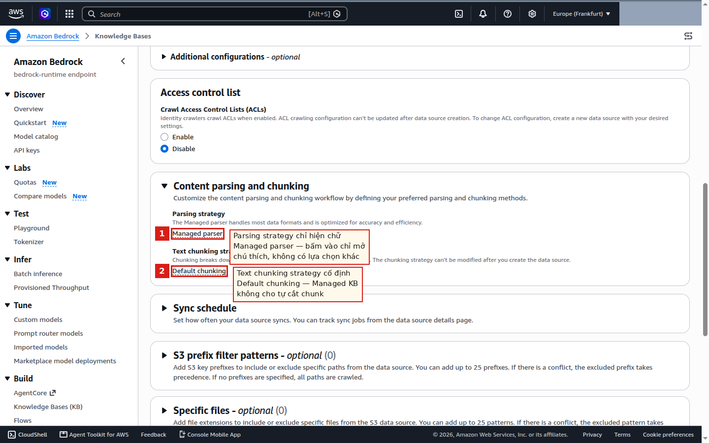

Ảnh trên là trình tạo Managed KB. Việc bấm vào *Managed parser* hay *Default chunking* chỉ mở ra một ô chú thích chứ không có danh sách lựa chọn nào. Ngay cả khi đổi data source type sang **Custom**, hai dòng đó vẫn giữ nguyên.

**Console giấu, nhưng API thì chưa chắc.** `CreateDataSource` nhận `vectorIngestionConfiguration.chunkingConfiguration.chunkingStrategy` như một trường ở cấp ngoài cùng, không gắn với loại KB nào, và tài liệu API **không** nói trường này bị loại với `MANAGED_KNOWLEDGE_BASE_CONNECTOR` — trong khi chỗ khác của chính trang đó lại nói rõ giới hạn theo loại KB (*"For managed knowledge bases, the only supported option is `DELETE`"* cho `dataDeletionPolicy`). Không thể suy ra câu trả lời từ tài liệu, bởi vì chỉ một lệnh `create-data-source` thật trên MKB mới cho biết AWS chấp nhận hay từ chối `NONE`. Lệnh đó tạo tài nguyên thật nên **chưa được chạy**.

Ghi chú của Managed KB về *Default chunking*: *"Automatically splits text into smaller chunks by default. If a document is already small enough, it's not split any further."* Câu này mở ra một đường thứ ba — **nạp file đã cắt sẵn, mỗi file đủ nhỏ** thì MKB không cắt thêm — nhưng AWS không nói "đủ nhỏ" là bao nhiêu ở đường managed, nên đường này chỉ có thể dùng được sau khi đo trên KB thật.

**Đã chốt: tự parse, tự cắt chunk, không dùng parser lẫn chunker của AWS.** Quyết định này loại Managed KB, vì bảng so sánh của AWS ghi rõ MKB dùng *"Built-in parser for multimodal file types"* và chunking chỉ có *"built-in (default) or fixed-size"* — không có `NONE`. AD-17 đã cập nhật theo: retrieval chạy trên **customer-managed KB** với `chunkingStrategy: NONE`, data source loại **Custom**.

**Quyết định này kéo theo bốn hệ quả cần chấp nhận**, bởi vì customer-managed không có sẵn những thứ mà MKB cung cấp miễn phí:

| Mất gì | Phải làm gì thay |
| --- | --- |
| Embedding quản lý sẵn (AWS ghi "None") | AD-06 chỉ còn một nhánh, đó là chọn một mô hình embedding riêng và đo trước khi tạo KB |
| Reranker miễn phí (AWS ghi "None") | Phải trả tiền cho rerank (Cohere Rerank 3.5 khoảng 0,002 $/truy vấn) hoặc bỏ hẳn rerank |
| Agentic retrieval | Chỉ còn `Retrieve` một nhịp, vốn đúng với thiết kế hiện tại nên thực chất không mất gì |
| Không phải nuôi vector store | Phải thêm một kho tự vận hành và trả tiền theo giờ (xem B.4) |

**Ba ràng buộc kỹ thuật của `NONE`:**

- **Số trang phải do Worker tự ghi.** Chế độ `NONE` bỏ đi citation theo trang cùng bộ lọc `x-amz-bedrock-kb-document-page-number`. Thiết kế đang cần số trang cho `CitationValidator`, nên số trang phải nằm trong metadata do Worker sinh ra chứ không trông vào Bedrock.
- **Trần kích thước chunk chính là trần token đầu vào của mô hình embedding.** Mỗi chunk được nhúng nguyên khối, nên Worker phải ép trần này ngay lúc cắt, và trần đó chỉ xác định được sau khi AD-06 chốt mô hình.
- **Điều "không dùng parser của AWS" chỉ đúng khi nội dung nạp vào là văn bản.** Nếu nạp PDF gốc thì Bedrock sẽ lại parse, vì vậy Worker phải nạp dưới dạng text, tức là inline `TEXT` hoặc tệp `.txt`.

### B.2 Tạo KB có chọn chunking

Ở trang **Knowledge Bases (KB)**, thao tác đúng không phải là bấm thẳng vào nút *Create Managed KB* mà là bấm vào mũi tên bên phải nút đó. Khi đó menu đổ xuống chia thành hai nhóm là *Bedrock-managed KB* và *Self-managed KB*.

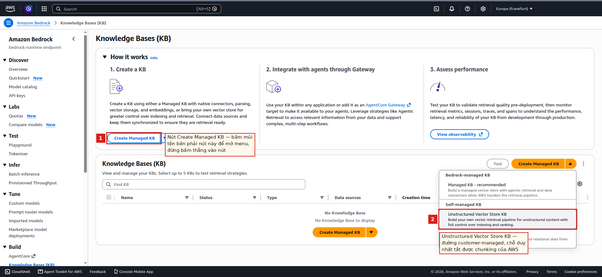

Lựa chọn cần dùng là **Unstructured Vector Store KB**, đây là tên console đặt cho đường customer-managed và là chỗ duy nhất tắt được chunking của AWS. Đường tắt để mở thẳng trang này là: `https://eu-central-1.console.aws.amazon.com/bedrock/home?region=eu-central-1#/knowledge-bases/create-knowledge-base`

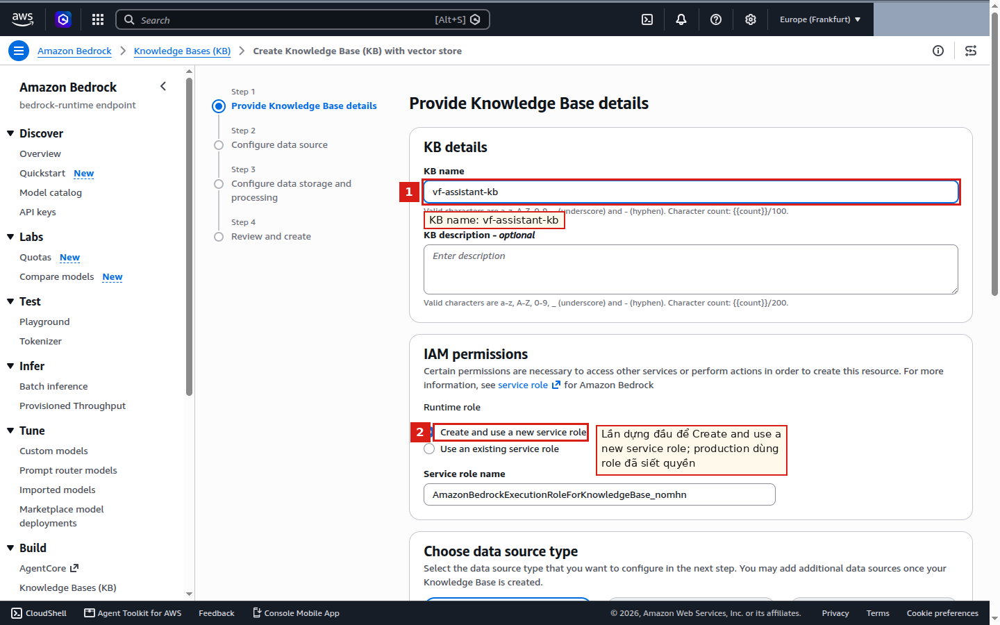

| Ô | Giá trị |
| --- | --- |
| **KB name** | `vf-assistant-kb` |
| **Runtime role** | *Create and use a new service role* cho lần dựng đầu, còn ở production thì dùng role đã được siết quyền theo bảng 4A của [05](05-devops.md) |
| **Choose data source type** | **Custom**, cho phép nạp thẳng tài liệu vào KB bằng API mà không qua thư mục S3 |

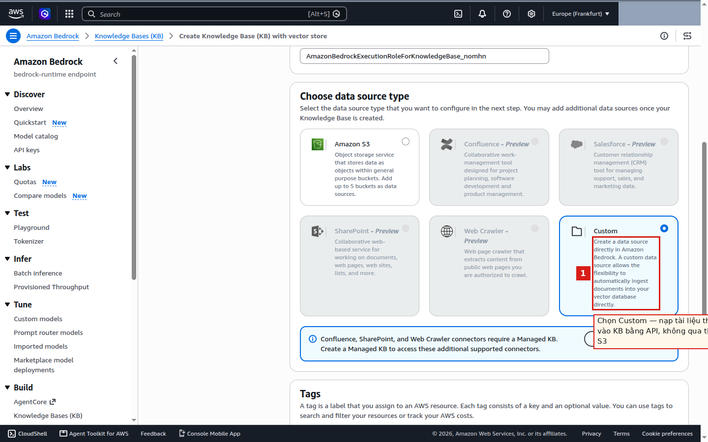

Việc chọn **Custom** là mấu chốt, và mô tả của AWS ngay trong ô đó cũng nói rõ điều này: *"A custom data source allows the flexibility to automatically ingest documents into your vector database directly"*.

### B.3 Bước 2 — chọn No chunking

Phần cấu hình này nằm ở **Advanced settings** → **Content parsing and chunking**.

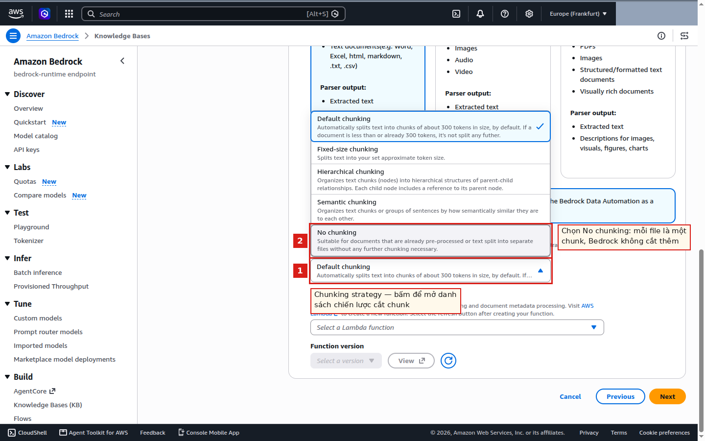

Có năm lựa chọn là Default, Fixed-size, Hierarchical, Semantic và **No chunking**. Mô tả của AWS cho No chunking như sau: *"Suitable for documents that are already pre-processed or text split into separate files without any further chunking necessary."*

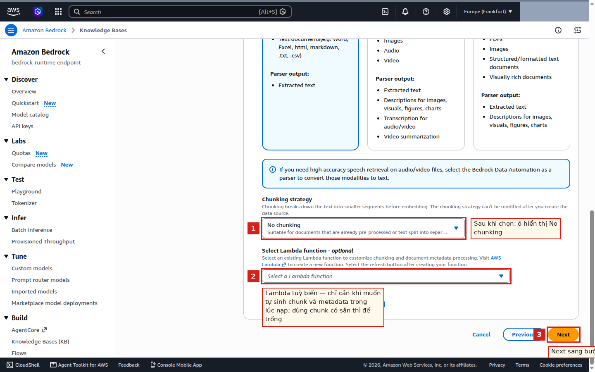

| Ô | Giá trị | Ghi chú |
| --- | --- | --- |
| **Parsing strategy** | *Amazon Bedrock default parser* | Với chunk đã là văn bản thuần thì parser không có việc gì để làm |
| **Chunking strategy** | **No chunking** | Mỗi tài liệu nạp vào trở thành **một chunk**, đúng như đã cắt sẵn |
| **Select Lambda function** | Để trống | Ô này chỉ cần đến khi muốn Bedrock gọi hàm của mình để cắt lại và sinh metadata trong lúc nạp; với chunk đã cắt sẵn thì không cần |

**Việc chọn No chunking khiến mất đi hai thứ**, theo tài liệu AWS: không xem được số trang trong citation, và không lọc được theo `x-amz-bedrock-kb-document-page-number`. Thứ nhất trong hai điều này **có ảnh hưởng tới thiết kế**, bởi vì chunk của dự án có số trang và `CitationValidator` dùng đến nó, nên số trang phải do Worker ghi vào metadata của chính nó. Riêng bộ lọc `scope_key` và `clause_path` thì không bị ảnh hưởng.

**Chunking strategy không sửa được sau khi tạo data source.** Nếu chọn sai thì phải tạo một data source mới và nạp lại toàn bộ.

### B.4 Bước 3 — vector store

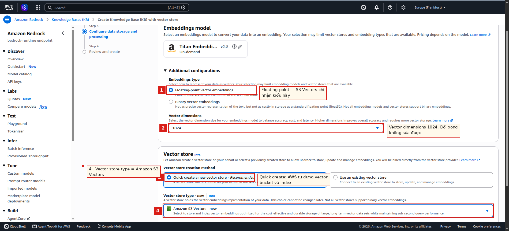

Đường này bắt buộc phải có một vector store riêng. Màn hình hỏi hai thứ theo đúng thứ tự sau: **embeddings model** trước rồi **vector store** sau, và thứ tự này quan trọng vì danh sách kho phụ thuộc vào mô hình đã chọn.

**Bước chọn embeddings model.** Khi bấm *Select model*, hộp thoại mở ra hai nhà cung cấp serverless ở Frankfurt là Amazon và Cohere.

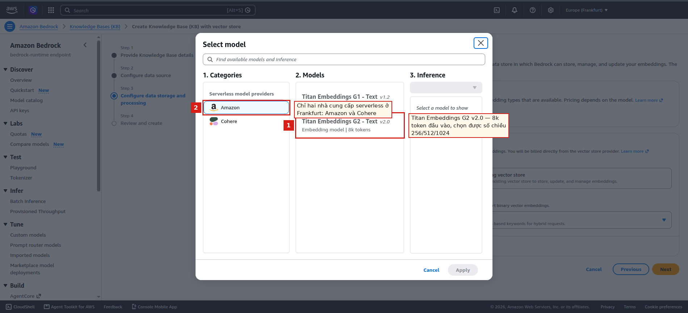

| Ô | Giá trị | Vì sao |
| --- | --- | --- |
| **Model** | `Titan Embeddings G2 - Text v2.0` | Mô hình này nhận tối đa 8k token đầu vào, và trần đó chính là trần độ dài chunk |
| **Embeddings type** | *Floating-point vector embeddings* | S3 Vectors chỉ nhận float32 |
| **Vector dimensions** | `1024` | Có thể chọn 256, 512 hoặc 1024; số chiều càng cao thì càng chính xác nhưng càng tốn kho |

**Sau đó mới đến danh sách vector store.** Tuỳ chọn *Quick create* dựng kho hộ ngay trong tài khoản này, còn *Use an existing vector store* đấu vào một kho có sẵn.

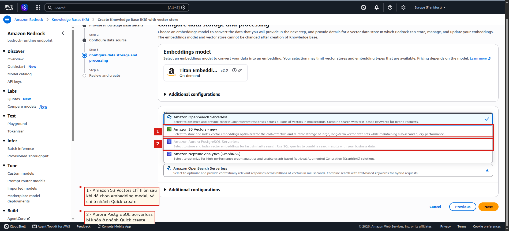

Nhánh **Quick create** cho bốn kho, gồm OpenSearch Serverless, **S3 Vectors**, Aurora PostgreSQL Serverless (đang bị khoá) và Neptune Analytics.

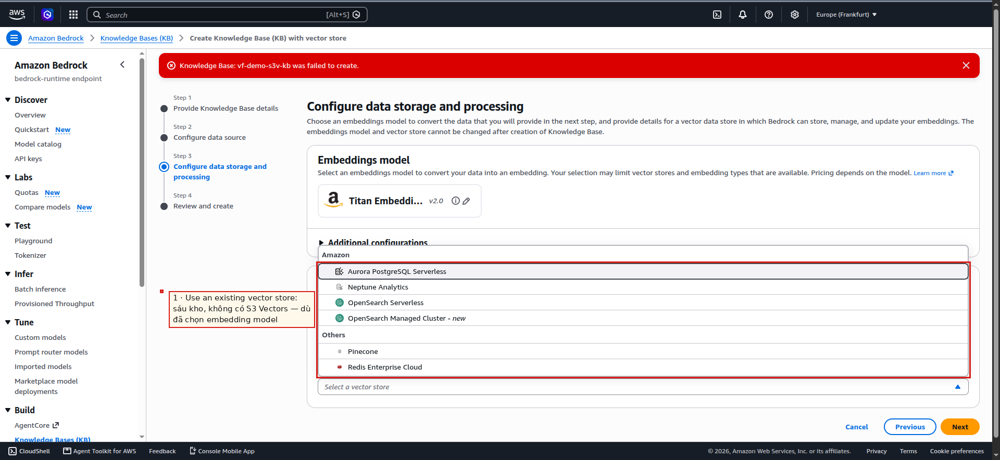

Nhánh *Use an existing vector store* cho sáu kho khác hẳn, gồm Aurora PostgreSQL Serverless, Neptune Analytics, OpenSearch Serverless, OpenSearch Managed Cluster, Pinecone và Redis Enterprise Cloud; trong danh sách này **không có S3 Vectors**, kể cả khi đã chọn xong mô hình embedding (kiểm trên console 24/09/2026).

Có hai điều cần nhớ. Thứ nhất, **trên console, S3 Vectors chỉ dựng được qua Quick create**. Thứ hai, nó chỉ hiện ra sau khi đã chọn mô hình embedding, nên lần dò trước không thấy nó là vì chưa chọn mô hình.

Cả embeddings model lẫn vector store đều **không đổi được sau khi tạo KB**.

**OpenSearch Managed Cluster bị loại hẳn**, bởi vì tài liệu AWS ghi *"For Network, you must choose Public access. OpenSearch domains that are behind a VPC are not supported for your Knowledge Base"*, điều này trái với thiết kế chạy trong VPC.

Ba ứng viên còn lại có cơ cấu giá khác nhau về bản chất, với chi tiết ở [13](13-chi-phi.md) §3a:

| Kho | Cơ cấu giá | Khi rảnh |
| --- | --- | --- |
| OpenSearch Serverless | 0,339 $/OCU-giờ | Vẫn tính tiền, trừ khi đặt sàn 0 OCU và chấp nhận cold start |
| Aurora PostgreSQL Serverless v2 | 0,14 $/ACU-giờ | Co xuống mức ACU tối thiểu |
| S3 Vectors | 0,064 $/GB-tháng + 0,214 $/GB nạp + 0,0000027 $/truy vấn | Gần bằng 0 vì không có sàn theo giờ |

Bảy kho mà console của tài khoản này hiển thị còn khác nhau về chi phí, ưu điểm và các hạn chế mang tính "chỉ hỗ trợ kiểu này, không hỗ trợ kiểu kia", theo ma trận lựa chọn vector store trong tài liệu thiết lập Knowledge Base của AWS:

| Kho | Chi phí | Ưu điểm | Hạn chế và pitfall cần lưu ý |
| --- | --- | --- | --- |
| **S3 Vectors** | 0,064 $/GB-tháng + 0,214 $/GB nạp + 0,0000027 $/truy vấn, gần như bằng 0 khi rảnh vì không có sàn theo giờ | Cách dựng đơn giản nhất trong các kho, do AWS quản lý và Bedrock có thể tự tạo | Là dịch vụ còn mới; trên console chỉ dựng được qua Quick create; chỉ nhận vector `float32` và trên console chỉ hỗ trợ khoảng cách `euclidean`, muốn `cosine` thì phải đi đường API; trần metadata chặt hơn khi dùng chung với Bedrock |
| **OpenSearch Serverless** | 0,339 $/OCU-giờ | Hợp với phần lớn trường hợp và hỗ trợ lọc nâng cao mạnh | Vẫn tính tiền theo OCU-giờ ngay cả khi rảnh, trừ khi đặt sàn 0 OCU và chấp nhận cold start |
| **Aurora PostgreSQL Serverless v2** | 0,14 $/ACU-giờ, co về mức ACU tối thiểu khi rảnh | Tận dụng được khi đội đã dùng Aurora và có chi phí hợp lý | Phải bật extension `pgvector`, tự vận hành cơ sở dữ liệu và lưu credential trong Secrets Manager |
| **OpenSearch Managed Cluster** | Theo cụm tự vận hành (tài liệu này không nêu số cụ thể) | Tận dụng được cụm OpenSearch tự quản đã có sẵn | Chỉ hỗ trợ **Public access** và không hỗ trợ VPC, nên đã bị loại khỏi thiết kế vốn chạy trong VPC |
| **Pinecone** | Theo gói của Pinecone (dịch vụ bên thứ ba) | Dựng nhanh khi đội đã dùng Pinecone | Là dịch vụ bên thứ ba, phải lưu API key trong Secrets Manager, và số chiều index bắt buộc phải khớp với số chiều của mô hình embedding |
| **Redis Enterprise Cloud** | Theo gói Redis Enterprise Cloud (dịch vụ bên thứ ba) | Cho độ trễ thấp nhất trong các kho | Phải dựng cụm có bật module vector search và tự vận hành |
| **Neptune Analytics** | Theo Neptune Analytics (tài liệu này không nêu số cụ thể) | Hợp với các bài toán RAG dựa trên đồ thị (graph) | Phải tạo và cấu hình graph, đồng thời phạm vi sử dụng hẹp hơn các kho còn lại |

Việc chọn kho nào là V-K7 và hiện chưa chốt.

**Embeddings model hiện chưa chốt.** AD-06 quy định việc chốt phải dựa trên đo đạc trên bộ 50 câu trước khi tạo KB, nên không được chọn tuỳ tiện ở màn hình này.

### B.4a Quick create dựng index S3 Vectors bằng tham số gì

Khi bấm *Create Knowledge Base*, console gọi `CreateVectorBucket` rồi `CreateIndex` trước, sau đó mới tạo IAM role và KB. Thân lời gọi `CreateIndex` mà console gửi đi có dạng sau:

```json
{
  "vectorBucketName": "bedrock-knowledge-base-<hậu tố ngẫu nhiên>",
  "indexName": "bedrock-knowledge-base-default-index",
  "dimension": 1024,
  "distanceMetric": "euclidean",
  "dataType": "float32",
  "metadataConfiguration": {
    "nonFilterableMetadataKeys": ["AMAZON_BEDROCK_TEXT", "AMAZON_BEDROCK_METADATA"]
  }
}
```

Có bốn điều đọc ra được từ thân lời gọi này:

- **`distanceMetric` là `euclidean`** chứ không phải cosine, và console không cho đổi. Cosine vẫn có thể lấy được nhưng phải đi qua đường API, vì `S3VectorsConfiguration` của `CreateKnowledgeBase` nhận `vectorBucketArn` và `indexArn`, nên CDK dựng index cosine trước rồi trỏ KB vào đó; chỉ riêng console thì không làm được.
- **Hai khoá metadata bị đánh dấu non-filterable**, trong đó `AMAZON_BEDROCK_TEXT` giữ nguyên văn chunk và `AMAZON_BEDROCK_METADATA` giữ metadata hệ thống. Non-filterable có nghĩa là không lọc được theo chúng, nhưng vẫn đọc ra được khi truy vấn. Một index được phép có tối đa 10 khoá non-filterable, nên vẫn còn tám chỗ trống.
- **Nguyên văn chunk nằm trong metadata của vector.** Bản thân S3 Vectors cho phép 40 KB metadata và 50 khoá mỗi vector, nhưng tài liệu Bedrock ghi một trần chặt hơn khi dùng chung: *"you can attach up to **1 KB of custom metadata** (including both filterable and non-filterable metadata) and **35 metadata keys per vector**"*. Nếu vượt trần thì **ingestion job sẽ ném lỗi** chứ không bỏ qua âm thầm. Mười hai khoá lọc ở [01](01-kien-truc.md) §8.2 vẫn lọt, nhưng không dư nhiều.
- **Tên bucket và index do console tự đặt**, và không sửa được ở màn hình này.

Sau khi index đã tạo, các giá trị sau không đổi được nữa: `dimension`, `distanceMetric`, `dataType` và danh sách khoá non-filterable.

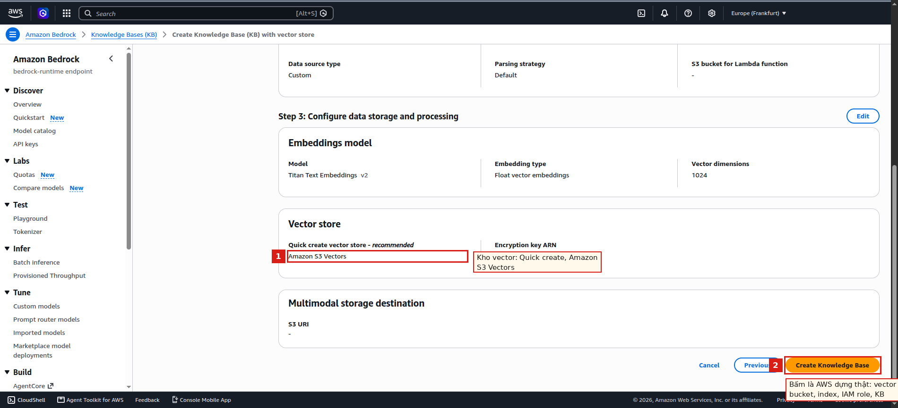

### B.4b Lỗi quyền đầu tiên gặp phải

Trong lần thử dựng thật ngày 24/09/2026 bằng một IAM user thường, hai lời gọi S3 Vectors đi qua được, rồi quá trình dừng lại ở IAM.

```
AccessDeniedException: User: arn:aws:iam::<account>:user/<iam-user> is not authorized to
perform: iam:CreateRole on resource:
arn:aws:iam::<account>:role/service-role/AmazonBedrockExecutionRoleForKnowledgeBase_<hậu tố>
because no identity-based policy allows the iam:CreateRole action
```

Console chỉ báo gọn *"Knowledge Base: … was failed to create"* mà không nói lý do, nên để biết nguyên nhân thì phải mở tab Network của DevTools và đọc phản hồi của `iam.amazonaws.com`.

Có hai hệ quả cần xử lý:

- **Vector bucket và index vẫn còn lại** sau khi KB tạo hỏng, và console không dọn chúng hộ. Vì vậy phải vào console S3 → *Vector buckets* để xoá tay, nếu không chúng sẽ tích dần sau mỗi lần thử.
- **Việc chọn *Create and use a new service role* đòi hỏi người bấm phải có `iam:CreateRole`** trên tiền tố `role/service-role/AmazonBedrockExecutionRoleForKnowledgeBase_*`. Đây là quyền duy nhất đã được kiểm chứng, bởi vì console gọi `CreateServiceRole` kèm một policy template, và lời gọi tạo KB phía sau gần như chắc chắn còn cần thêm `iam:PassRole`, nhưng điều này **chưa kiểm được** vì quá trình dừng ở lỗi đầu tiên. Nếu không cấp được các quyền này thì có thể dựng sẵn role bằng CDK rồi chọn *Use an existing service role*.

Lời gọi `lambda:ListFunctions` ở bước 2 cũng bị từ chối, nhưng điều này vô hại, bởi vì nó chỉ để đổ danh sách vào ô *Select Lambda function*, mà ô đó vốn để trống.

### B.5 Nạp chunk lên: hai cách

Sau khi KB đã có data source loại Custom, chunk được đẩy thẳng bằng `IngestKnowledgeBaseDocuments`, không có bước sync và không cần file nằm trên S3.

**Cách 1: nội dung nằm ngay trong lời gọi**, kèm metadata inline:

```json
{
  "documents": [
    {
      "content": {
        "dataSourceType": "CUSTOM",
        "custom": {
          "customDocumentIdentifier": { "id": "EN1993-1-1_6.2.2_c01" },
          "inlineContent": {
            "textContent": { "data": "<nội dung chunk đã cắt sẵn>" },
            "type": "TEXT"
          },
          "sourceType": "IN_LINE"
        }
      },
      "metadata": {
        "inlineAttributes": [
          { "key": "scope_key",   "value": { "stringValue": "org-42/EN1993", "type": "STRING" } },
          { "key": "clause_path", "value": { "stringValue": "6.2.2",         "type": "STRING" } }
        ],
        "type": "IN_LINE_ATTRIBUTE"
      }
    }
  ]
}
```

**Cách 2: chunk nằm trên S3**, với `sourceType: "S3"` và metadata lấy từ file `.metadata.json` đi kèm (`type: "S3_LOCATION"`).

Có bốn ràng buộc của AWS cần nhớ:

- **Nếu nội dung ở dạng inline thì metadata cũng phải ở dạng inline.** Việc trộn hai kiểu sẽ bị từ chối.
- **Mỗi lời gọi qua API nhận tối đa 25 tài liệu**, còn qua console thì chỉ 10.
- **Trùng `id` sẽ dẫn đến ghi đè** mà không báo trước. Đây vừa là cách cập nhật một chunk, vừa là nguyên nhân gây mất dữ liệu nếu sinh `id` một cách cẩu thả.
- **Không được chạy `IngestKnowledgeBaseDocuments` và `StartIngestionJob` cùng một lúc.**

Với data source loại Custom thì không có `StartIngestionJob`, bởi vì nạp xong là tài liệu đã thuộc cả data source lẫn KB.

Có thể nạp thử vài chunk qua console để xem hình dạng trước khi viết mã, theo đường dẫn: vào KB → chọn data source → **Documents** → **Add documents** → *Add documents directly*.

Sáu chunk demo dựng sẵn cho việc này nằm ở [`cong-cu/demo-chunks/`](../cong-cu/demo-chunks/README.md); khi chạy `build-ingest-payload.py` sẽ ra thân lời gọi `IngestKnowledgeBaseDocuments` cùng bộ file `.txt` kèm sidecar để kéo thả. Sáu chunk đó cố tình chứa một bản đã thay thế, một chunk khác `scope_key` và một tài liệu hướng dẫn phần mềm, nhằm thấy ngay bộ lọc có chặn đúng hay không.

### B.6 Chi phí embedding, truy vấn và rerank

Chi phí vector store đã nằm ở bảng của B.4. Phần còn lại của một customer-managed KB gồm ba khoản:

| Khoản | Đơn giá ở `eu-central-1` | Ví dụ |
| --- | --- | --- |
| Titan Text Embeddings V2, lúc nạp | 0,20 $/1 triệu token | Nạp 50 000 chunk, mỗi chunk 800 token, tốn khoảng 8 $ cho một lần nạp toàn bộ |
| Titan Text Embeddings V2, nhúng câu hỏi | 0,20 $/1 triệu token | 19 800 lượt/tháng, mỗi câu hỏi khoảng 30 token, tốn khoảng 0,12 $/tháng |
| Rerank | Cohere Rerank 3.5 là 0,002 $/truy vấn; Amazon Rerank 1.0 là 0,001 $/truy vấn | Cohere tốn thêm khoảng 22 $/tháng ở kịch bản Một công ty, vì chỉ lượt hỏi tài liệu mới cần rerank ([13](13-chi-phi.md) §6) |

Bảng giá công khai không có dòng phí riêng cho lời gọi `Retrieve` của customer-managed KB. Tiền của một lần truy xuất nằm ở việc nhúng câu hỏi và ở truy vấn vector store. Dòng 0,001 $/truy vấn và 5 $/GB-tháng ở [13](13-chi-phi.md) §3 là giá của Managed KB.

Số chiều vector gần như không ảnh hưởng tới hoá đơn. 50 000 vector 1024 chiều kiểu `float32` chiếm khoảng 0,2 GB trên S3 Vectors, tức khoảng 0,013 $/tháng, còn bản 256 chiều khoảng 0,003 $/tháng. Vì vậy số chiều ở B.4 được chọn theo chất lượng truy xuất đo trên bộ 50 câu, không theo chi phí lưu trữ.

Khoản đáng canh là **nạp lại**. Mỗi lần nạp lại toàn bộ corpus là một lần trả lại toàn bộ tiền embedding, vì chunk trùng `id` được ghi đè chứ không được bỏ qua (B.5). Worker cần nạp theo phần thay đổi, tức chỉ gửi những chunk có nội dung khác bản đã nạp. Amazon Rerank 1.0 rẻ bằng một nửa Cohere Rerank 3.5, nhưng chỉ nên đổi sau khi đo trên bộ 50 câu tiếng Pháp, bởi vì rerank kém sẽ đẩy chunk sai lên đầu.

---

## C · Cổng truy cập và hạn mức

### C.1 Model access — trang này đã bị gỡ

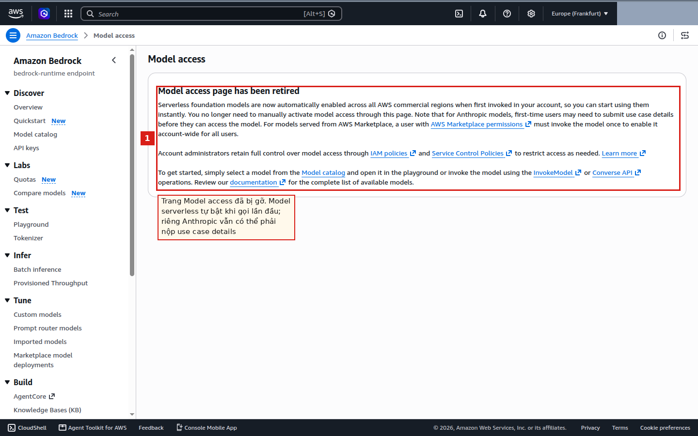

Thao tác "vào Model access, tick model, Save" trong mọi hướng dẫn cũ **không còn nữa**. AWS ghi ngay trên trang đó rằng model serverless nay **tự bật khi được gọi lần đầu** trong tài khoản.

Có ba điều vẫn còn đúng và là những thứ cần chuẩn bị:

- Người dùng lần đầu gọi model Anthropic **vẫn có thể phải nộp use case details**.
- Model bán qua Marketplace cần một người **có quyền Marketplace** gọi một lần để bật cho cả tài khoản.
- Việc quản trị vẫn có thể siết được bằng IAM policy và Service Control Policy.

Hệ quả cho [05](05-devops.md) là: ba loại cổng ở đầu tài liệu đó vẫn đúng, nhưng **cổng Marketplace đã đổi hình dạng**, bởi vì nó không còn là thao tác bật model trong console mà là việc một người có quyền Marketplace gọi model một lần. Hai cổng còn lại, gồm biểu mẫu use case và hạn mức, thì vẫn giữ nguyên.

### C.2 Service Quotas

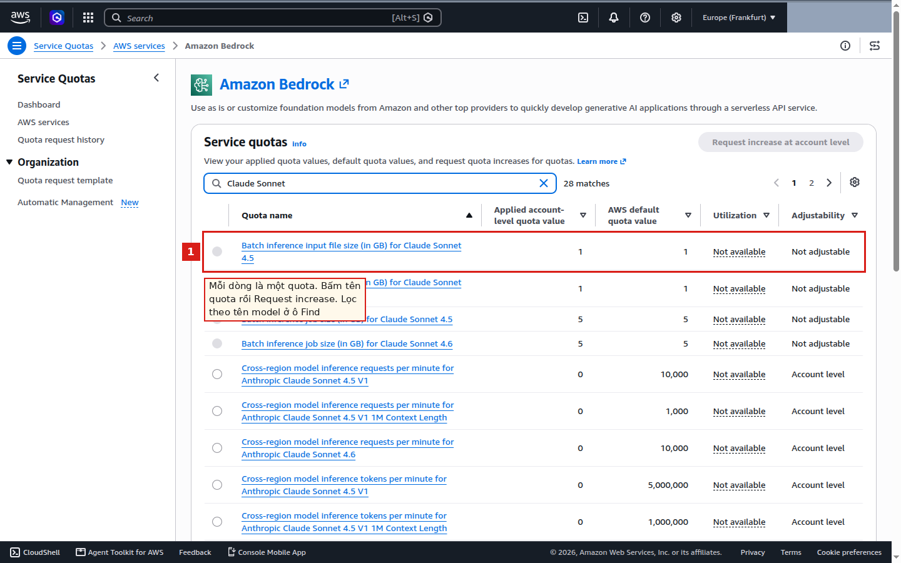

`https://eu-central-1.console.aws.amazon.com/servicequotas/home/services/bedrock/quotas?region=eu-central-1`

Việc tìm quota được thực hiện bằng cách lọc theo tên model ở ô **Find**, mở đúng dòng quota rồi bấm **Request increase**. Đơn xin tăng quota nên được nộp sớm, bởi vì AWS duyệt trong 1–3 ngày làm việc và quota mặc định của một tài khoản mới có thể bằng 0.

Quota của Sonnet 5 ở vùng này nằm dưới dạng **cross-region inference**, và khi lọc `Sonnet 5` sẽ trả về `Cross-region model inference tokens per minute for Anthropic Claude Sonnet 5` cùng bản `Global cross-region...`. Đơn xin tăng cần nhắm đúng dòng **cross-region chứ không phải bản Global**, bởi vì bản Global route ra ngoài EU.

### C.3 Chi phí gọi mô hình

Việc bật model và xin tăng quota không tốn phí. Tiền chỉ phát sinh khi gọi model, và được tính theo token với profile `eu.*`:

| Mô hình | Vai trò | Input | Output | Cache read |
| --- | --- | --- | --- | --- |
| Claude Sonnet 5 | Trả lời và tool loop | 2,20 $ | 11,00 $ | 0,22 $ |
| Claude Haiku 4.5 | Routing | 1,10 $ | 5,50 $ | 0,11 $ |
| Claude Sonnet 4.6 | Fallback | 3,30 $ | 16,50 $ | 0,33 $ |

Đơn vị là USD cho 1 triệu token. Một lượt Sonnet 5 với 6 000 token vào và 600 token ra tốn khoảng 0,0198 $, tức khoảng 19,80 $ cho 1 000 lượt. Cùng lượt đó chạy trên Sonnet 4.6 tốn 29,70 $, đắt gấp 1,5 lần, nên fallback cần có cảnh báo khi kéo dài chứ không được để chạy âm thầm.

Token đọc từ cache chỉ tốn 10% giá input, và phần tĩnh của mỗi lượt (system prompt, mô tả tool) lặp lại ở mọi vòng của tool loop. Theo [13](13-chi-phi.md) §6, prompt caching cho phần tĩnh giảm khoảng 185 $/tháng ở kịch bản Một công ty và là đòn bẩy lớn nhất của cả hệ thống. Ngược lại, profile `global.*` rẻ hơn khoảng 10% nhưng route ra ngoài EU, nên không bao giờ được dùng để giảm chi phí. Provisioned Throughput tính tiền theo giờ kể cả khi không có lượt nào, và dự án không dùng nó.

---

## D · Khoá, kho và sổ ghi

### D.1 KMS — khoá customer-managed

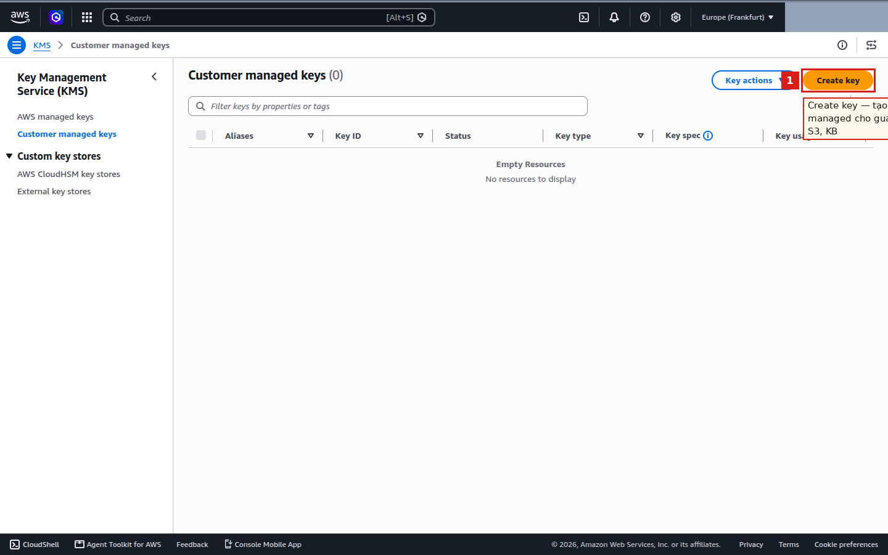

`https://eu-central-1.console.aws.amazon.com/kms/home?region=eu-central-1#/kms/keys`

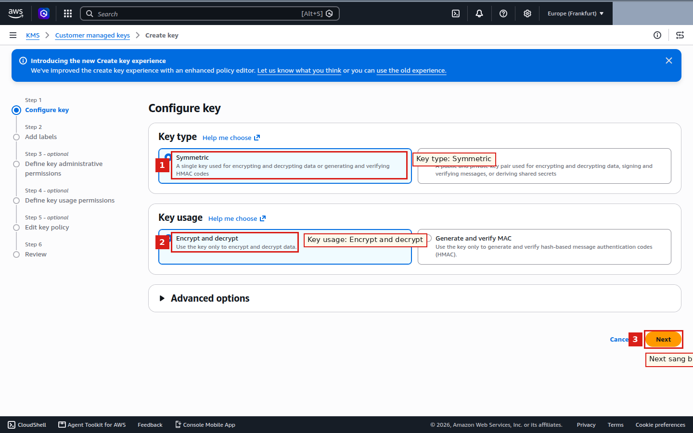

Key type là **Symmetric** và Key usage là **Encrypt and decrypt**. Đây là giá trị mặc định và cũng chính là cấu hình cần cho guardrail, log group, S3 và KB.

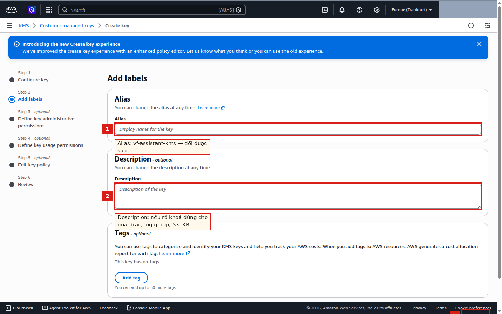

Một khoá có thể được dùng lại cho nhiều dịch vụ, nhưng **khoá mã hoá KB và khoá mã hoá bucket nguồn là hai vai trò khác nhau** ([05](05-devops.md) §4A). Quyền của khoá KB nằm ở key policy cấp cho danh tính **tạo KB**, còn quyền đọc bucket SSE-KMS phải cấp `kms:Decrypt` cho **service role**. Hai chỗ này thường bị gộp nhầm làm một.

### D.2 S3 — bucket nguồn

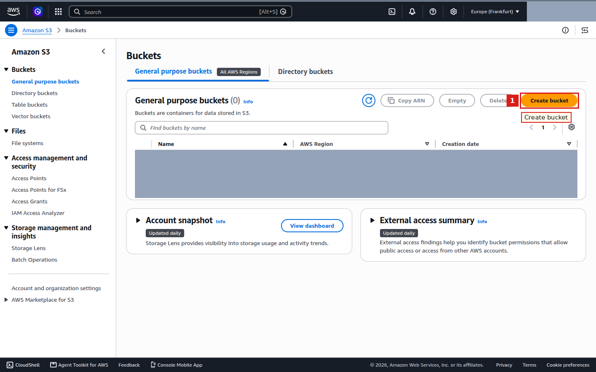

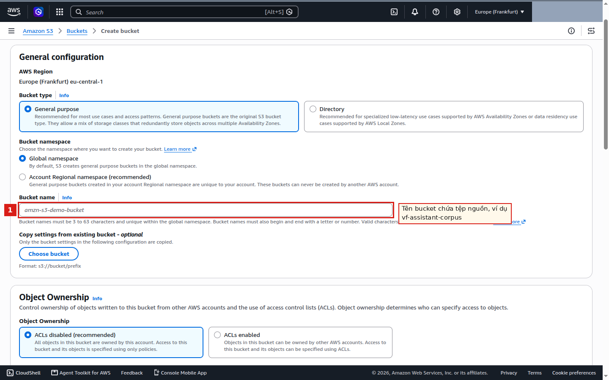

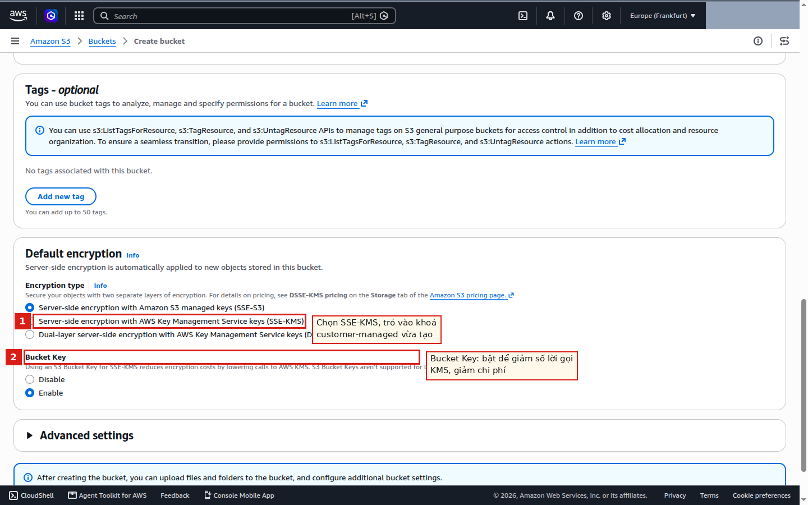

| Ô | Giá trị |
| --- | --- |
| **Bucket name** | Ví dụ `vf-assistant-corpus` |
| **Default encryption** | **SSE-KMS**, trỏ vào khoá đã tạo ở D.1 |
| **Bucket Key** | Enable, giúp giảm số lời gọi KMS và giảm chi phí |
| **Block Public Access** | Được giữ bật toàn bộ |
| **Bucket Versioning** | Enable, vì chunk là dữ liệu dẫn xuất còn tệp gốc mới là nguồn sự thật |

Bucket policy phải kèm điều kiện `aws:SourceAccount`; phần này không có ô riêng trên giao diện tạo bucket mà được làm ở tab **Permissions** sau khi tạo.

### D.3 CloudWatch Logs

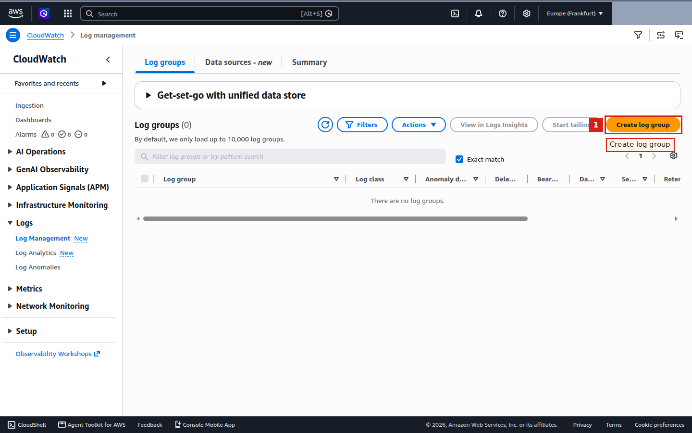

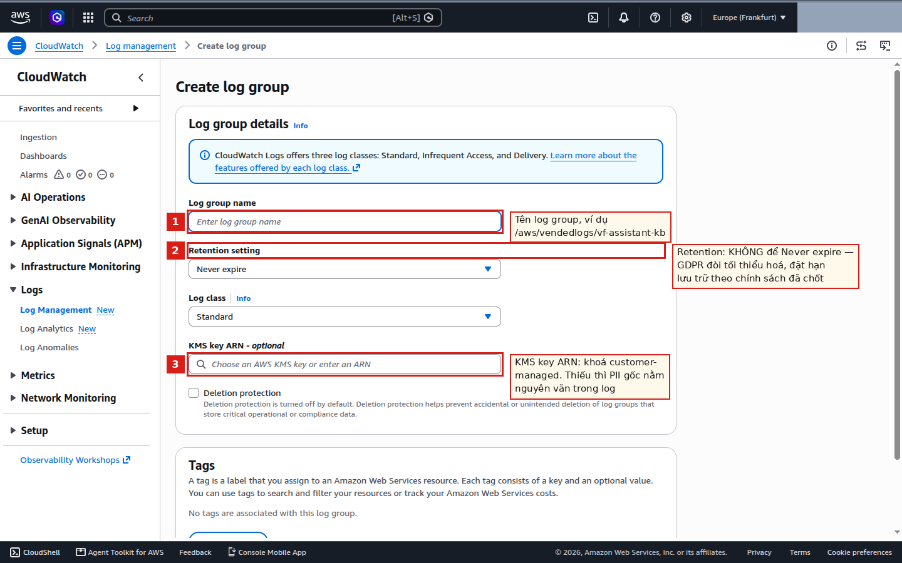

Có ba ô mang tính quyết định, và cả ba đều có **giá trị mặc định sai với dự án này**:

| Ô | Mặc định | Giá trị |
| --- | --- | --- |
| **Retention setting** | `Never expire` | Thời hạn được đặt theo chính sách lưu trữ đã chốt, bởi vì GDPR đòi tối thiểu hoá và việc giữ vô thời hạn là vi phạm |
| **KMS key ARN** | trống | Là khoá customer-managed, bởi vì việc che PII của Guardrails **chỉ áp cho response API** nên bản gốc chưa che vẫn vào log nguyên văn |
| **Deletion protection** | tắt | Được bật cho các log group phục vụ tuân thủ |

Log group có tên bắt đầu bằng `/aws/vendedlogs/` được tạo tự động khi cấu hình log delivery, còn các tên khác **phải được tạo trước** thì mới trỏ tới được.

### D.4 Parameter Store — kill switch

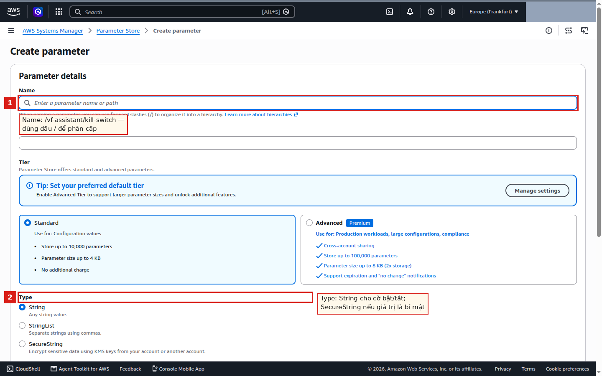

`https://eu-central-1.console.aws.amazon.com/systems-manager/parameters?region=eu-central-1`

Dấu `/` được dùng để phân cấp, ví dụ `/vf-assistant/kill-switch`. Type là `String` cho một cờ bật/tắt. Việc siết ai được gạt cờ được thực hiện bằng IAM trên đúng đường dẫn tham số đó, và không cấp `ssm:PutParameter` một cách rộng rãi.

### D.5 CloudTrail — data event

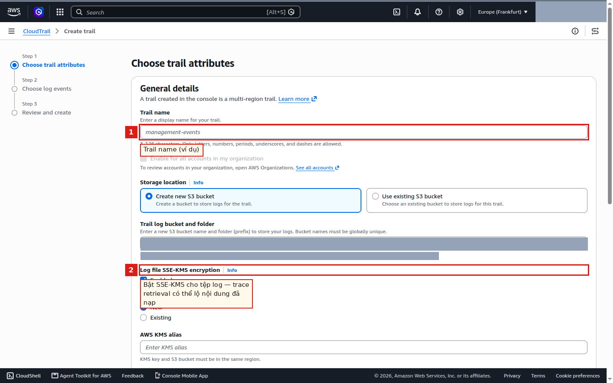

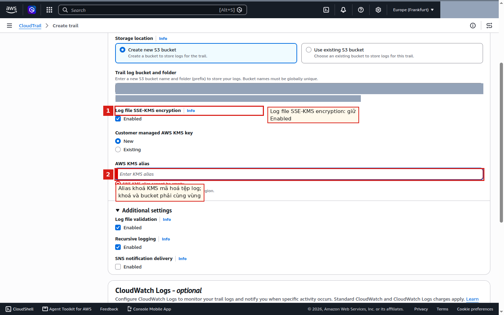

`Log file SSE-KMS encryption` được bật sẵn và **đòi một alias KMS**, nên nếu không điền thì không sang được bước sau.

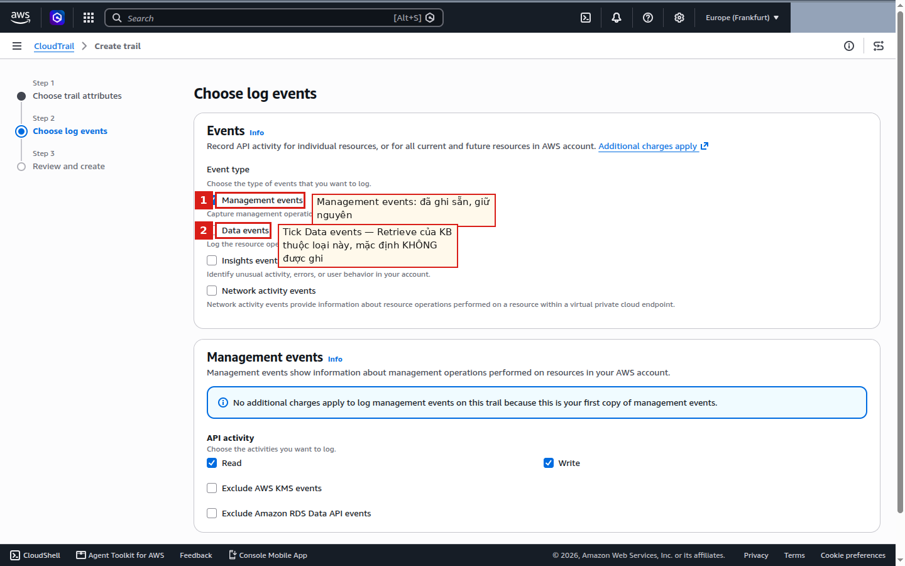

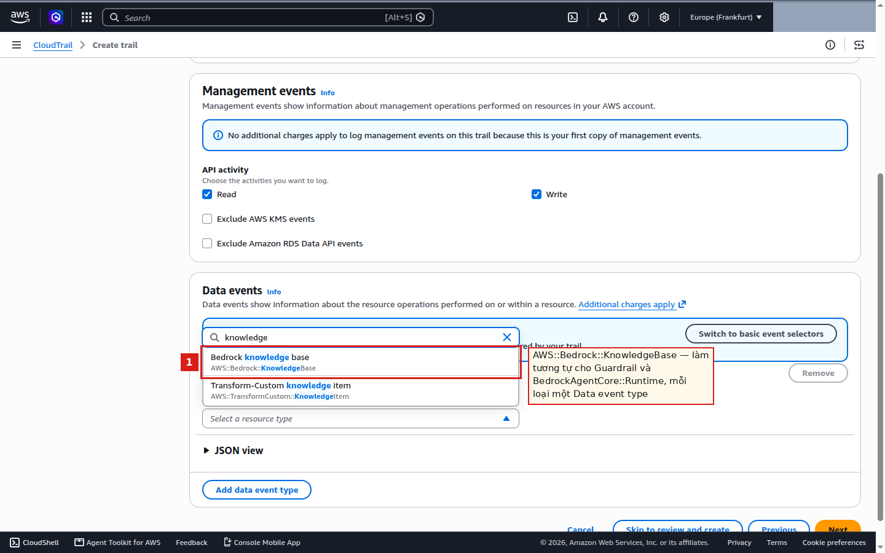

Ô **Data events** được tick, rồi thêm một *Data event type* cho mỗi loại tài nguyên cần truy vết. Có ba loại vừa có thật trong danh sách vừa là ba loại dự án cần đến:

- `AWS::Bedrock::KnowledgeBase`, trong đó `Retrieve` là một data event và **mặc định không được ghi**.
- `AWS::Bedrock::Guardrail`, loại tài nguyên cho các lời gọi guardrail.
- `AWS::BedrockAgentCore::Runtime`, dùng để truy ai đã gọi Harness.

Nếu không bật thì không thể truy được ai đã truy vấn cái gì, và đến khi cần thì đã muộn.

### D.6 Bedrock — Model invocation logging

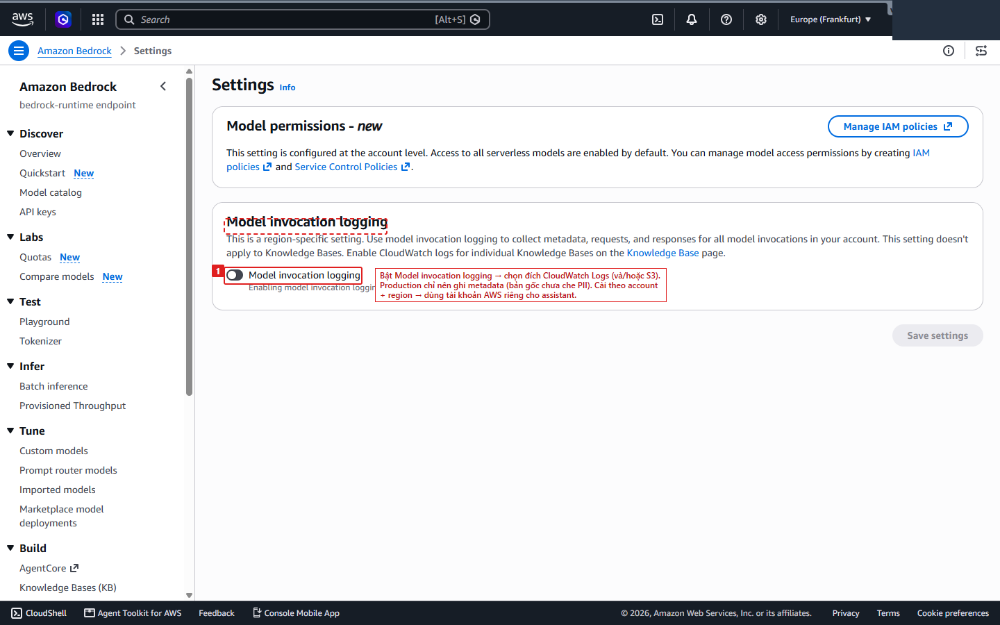

`https://eu-central-1.console.aws.amazon.com/bedrock/home?region=eu-central-1#/settings`

Bước này bật **Model invocation logging** rồi chọn đích là **CloudWatch Logs** (và/hoặc S3).

| Ô | Giá trị | Vì sao |
| --- | --- | --- |
| **Model invocation logging** | Được bật, với đích là CloudWatch Logs | Nếu không bật thì không có log lời gọi mô hình để điều tra |
| Phạm vi ghi | **Chỉ metadata** ở production | Bản gốc chưa che PII sẽ vào log nguyên văn (OPS-3) |
| Log group | Là một log group đã mã hoá KMS và đã đặt retention (D.3) | GDPR đòi tối thiểu hoá và mã hoá |

Thiết lập này áp theo **cả tài khoản và region**, và **không** áp cho Knowledge Bases, bởi vì CloudWatch được bật riêng cho từng KB. Việc che PII của Guardrails chỉ áp cho response API, nên log gốc vẫn ở dạng nguyên văn.

### D.7 Chi phí

| Dịch vụ | Đơn giá ở `eu-central-1` | Ở quy mô dự án |
| --- | --- | --- |
| **KMS** | 1 $/khoá customer-managed/tháng; 0,03 $/10 000 request | 5 khoá theo [13](13-chi-phi.md) §5 là 5 $/tháng. Bucket Key ở D.2 giảm số request tới KMS |
| **S3 Standard** | 0,0245 $/GB-tháng cho 50 TB đầu; 0,0054 $/1 000 request PUT, COPY, POST, LIST; 0,0043 $/10 000 request GET | 10 GB tệp gốc tốn khoảng 0,24 $/tháng |
| **CloudWatch Logs** | 0,63 $/GB ghi vào; 0,0324 $/GB-tháng lưu | 10 GB ghi vào và lưu tốn 6,62 $/tháng ([13](13-chi-phi.md) §5), trong đó tiền ghi vào chiếm gần hết |
| **Parameter Store** | Tham số Standard không tính phí; tham số Advanced 0,05 $/tháng; bật higher throughput thì 0,05 $/10 000 lời gọi API | Cờ kill switch là tham số Standard kiểu `String`, nên bằng 0 |
| **CloudTrail** | Bản sao đầu tiên của management event không tính phí; data event 0,10 $/100 000 sự kiện | Giả định 4 data event mỗi lượt, 19 800 lượt/tháng sinh 79 200 sự kiện, tức khoảng 0,08 $/tháng, cộng tiền lưu tệp log trên S3 |
| **Model invocation logging** | Tính năng không tính phí; tiền nằm ở log ghi vào CloudWatch Logs hoặc S3 | Chỉ ghi metadata, khoảng 1 KB mỗi lượt, tốn khoảng 0,01 $/tháng; ghi cả nội dung, khoảng 20 KB mỗi lượt, tốn khoảng 0,24 $/tháng |

Cả nhóm này cộng lại khoảng 12 $/tháng ở kịch bản Một công ty, nhưng CloudWatch Logs là khoản dễ phình nhất. Retention ở D.3 chỉ giảm tiền **lưu**, trong khi 0,63 $/GB là tiền **ghi vào** và phải trả ngay khi log đến. Log mức debug bật quên ở production có thể đẩy khoản này lên gấp nhiều lần mà không có cảnh báo nào, nên cần đặt alarm trên metric `IncomingBytes` của từng log group.

Dòng cuối của bảng cho thấy lý do ghi chỉ metadata ở D.6 là GDPR chứ không phải chi phí. Ghi cả nội dung vẫn rẻ, nhưng đưa bản gốc chưa che PII vào log. Tương tự, CloudTrail data event rẻ tới mức không có lý do chi phí nào để tắt nó.

Việc chia nhỏ khoá KMS theo vai trò tốn 1 $/khoá/tháng cho mỗi khoá thêm vào. Khoản này nhỏ so với rủi ro dùng chung một khoá cho mọi vai trò, nên không nên gộp khoá để tiết kiệm.

---

## E · AgentCore

`https://eu-central-1.console.aws.amazon.com/bedrock-agentcore/home?region=eu-central-1`: thanh bên của trang này gồm Harness, Runtime, Gateways, Memory, Policy, Identity và Payments.

Có hai đường tạo Harness là **Quick create** và **Advanced create**. Đường được dùng là Advanced, bởi vì sáu giá trị cần sửa đều nằm ở đó.

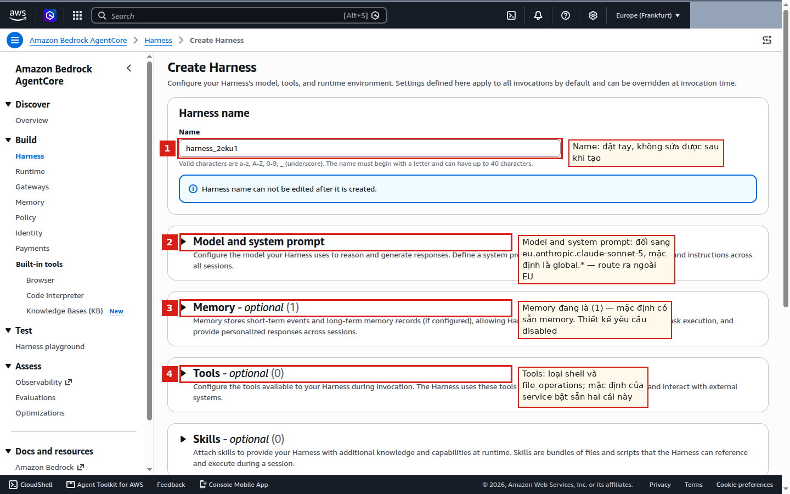

Có hai thứ nhìn thấy ngay trên ảnh, đúng như [05](05-devops.md) §4B đã cảnh báo:

- **Memory hiện `(1)`**, tức là service đã gắn sẵn một memory. Thiết kế yêu cầu đặt `disabled`, bởi vì nếu không sẽ có hai kho hội thoại song song, vừa tốn phí vừa phát sinh rủi ro dữ liệu (Q3).
- **Tools hiện `(0)`** trên giao diện, nhưng mặc định của API lại bật sẵn `shell` và `file_operations`. Khai báo `allowedTools` sẽ loại cả hai công cụ này.

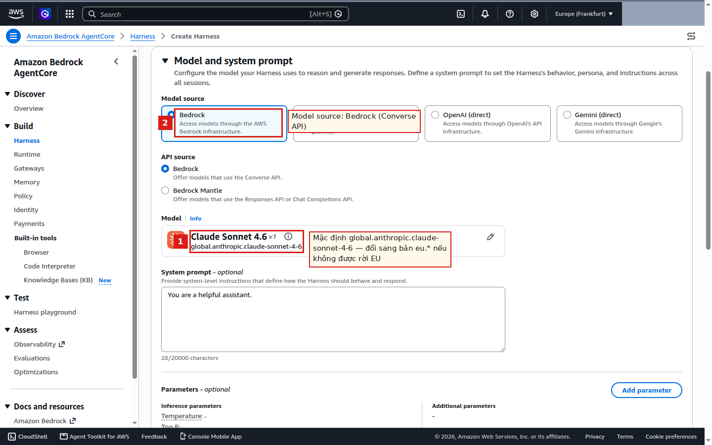

Model mặc định là **`global.anthropic.claude-sonnet-4-6`**, đúng nguyên văn giá trị mà [05](05-devops.md) đã cảnh báo. Tiền tố `global.*` route ra ngoài EU và vi phạm yêu cầu cư trú dữ liệu (Q1), nên giá trị này cần được đổi sang bản `eu.*`.

### E.1 Advanced configurations — số vòng và thời gian chờ

Các giá trị này nằm ở **Advanced configurations** → **Invocation limits** và **Allowed tools**.

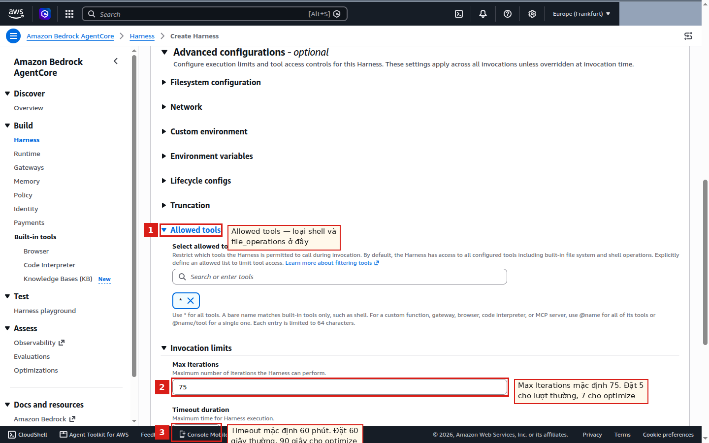

Hai con số mặc định trên màn hình đúng bằng hai con số mà [05](05-devops.md) §4B đã cảnh báo:

| Ô | Mặc định | Giá trị |
| --- | --- | --- |
| **Max Iterations** | **75** | 7 cho mọi lượt |
| **Timeout duration** | **60 phút** (trần 480) | 90 giây cho mọi lượt |
| **Allowed tools** | — | `shell` và `file_operations` bị loại bỏ |

Hai trần này là một con số chung cho mọi lượt chứ không chia theo loại câu hỏi. Lý do nằm ở AD-15: phân loại nay diễn ra trong chính vòng đầu của Harness, nên lúc đặt trần thì chưa biết lượt này thuộc loại nào. Cả hai lấy giá trị cao nhất trong dải cũ, vì hạ trần giữa chừng không có đường làm trên console.

### E.2 Inbound Auth — danh tính gọi vào

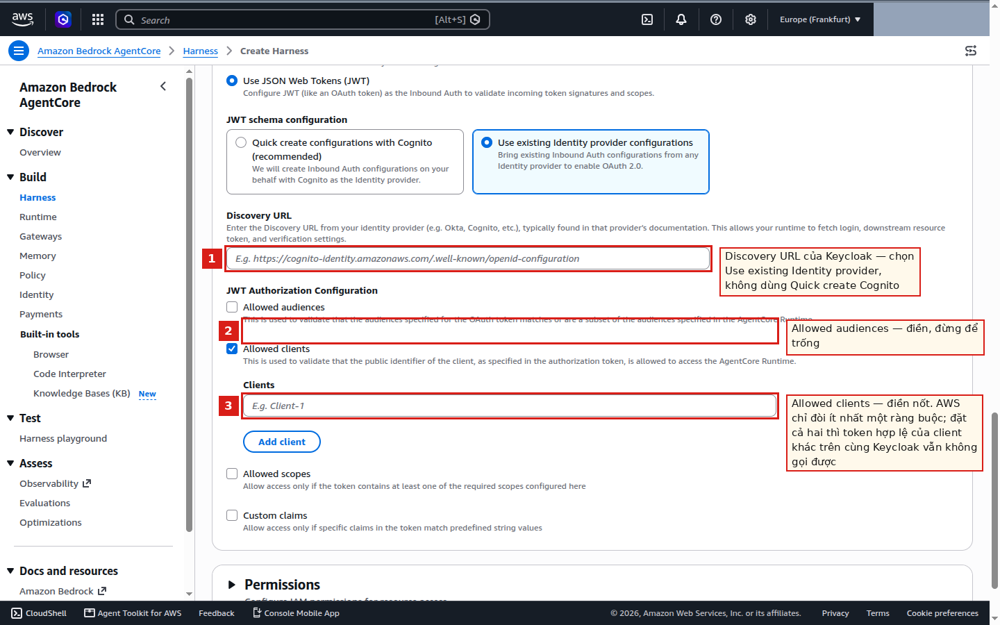

Cấu hình cần chọn **Use JSON Web Tokens (JWT)** → **Use existing Identity provider configurations** (không dùng Quick create Cognito), rồi điền Discovery URL của Keycloak.

Phần **JWT Authorization Configuration** có bốn ô, và theo mặc định chỉ **Allowed clients** được tick:

- Cả **Allowed audiences lẫn Allowed clients** đều cần được tick và điền. AWS chỉ đòi ít nhất một ràng buộc, nhưng nếu chỉ đặt một thì token hợp lệ của một client khác trên cùng Keycloak vẫn gọi được.
- `Allowed scopes` và `Custom claims` là hai ràng buộc bổ sung và hiện chưa chốt trong thiết kế.

### E.3 Gateway

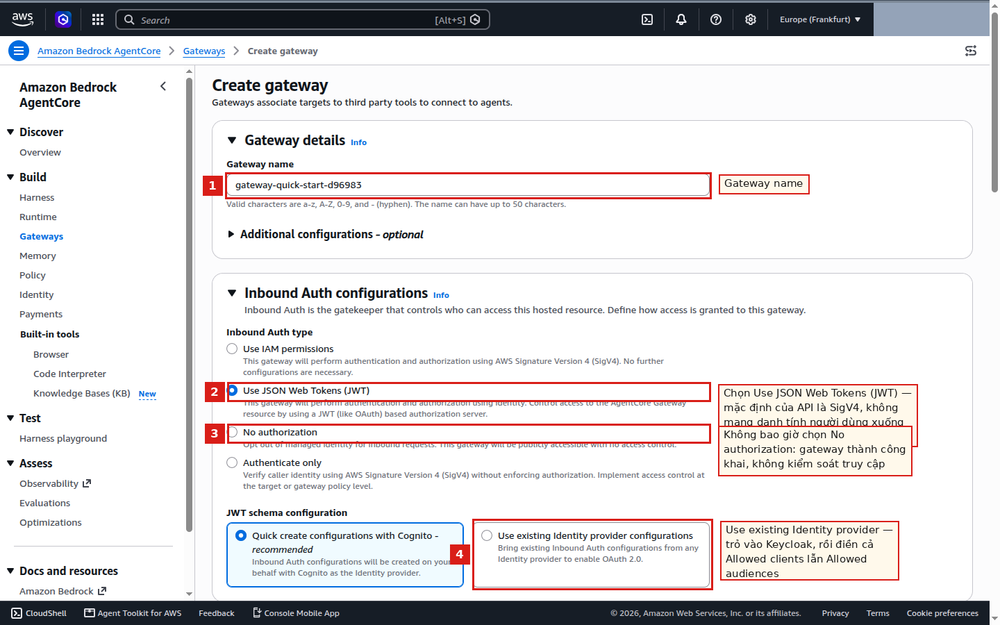

Inbound Auth type có bốn lựa chọn. Tuỳ chọn **`No authorization` tuyệt đối không được sử dụng**, bởi vì khi đó gateway sẽ thành công khai và không kiểm soát truy cập. Tuỳ chọn `Use IAM permissions` là SigV4, xác thực được nhưng **không mang danh tính người dùng xuống Gateway**, nên Cedar không có gì để xét.

Trang tạo Gateway còn có **Policy - optional** (nơi gắn Cedar) và **KMS key - optional**. DevOps **không tạo được Gateway target** nếu Backend chưa phát hành schema OpenAPI của facade, và đây là điểm đồng bộ cứng giữa hai đội.

Keycloak token exchange (V-A6) không có trang trên console AWS mà được làm bên Keycloak.

**Cấu hình Harness phải là mã trong repo**, kèm test tự động đọc lại sau mỗi lần triển khai; console chỉ dùng để xem cho hiểu chứ không phải nơi giữ cấu hình production.

### E.4 Chi phí

| Thành phần | Đơn giá ở `eu-central-1` | Ví dụ |
| --- | --- | --- |
| **Runtime** (Harness) | 0,0895 $/vCPU-giờ; 0,00945 $/GB-giờ | Giả định mỗi lượt giữ phiên 20 giây ở 1 vCPU và 2 GB, 19 800 lượt/tháng tốn khoảng 11,92 $/tháng |
| **Memory** | Short-term 0,00025 $/sự kiện; long-term tính riêng phần lưu và 0,0005 $/lần truy xuất | Để nguyên memory gắn sẵn với 2 sự kiện mỗi lượt tốn khoảng 9,90 $/tháng |
| **Gateway** | 0,000005 $/lần gọi tool; 0,000025 $/lần gọi Search API; 0,0002 $/tool-tháng cho tool index; 0,006 $/GB dữ liệu xử lý khi target nằm trong VPC | 3 lần gọi tool mỗi lượt tốn khoảng 0,30 $/tháng |

Identity và Policy không có dòng giá riêng trong bảng giá `eu-central-1` bản công bố ngày 15/09/2026.

Tiền trả trực tiếp cho AgentCore nhỏ, nhưng cấu hình AgentCore quyết định **tiền mô hình**. Mỗi vòng thêm của tool loop gửi lại toàn bộ ngữ cảnh cho Sonnet 5, nên `optimize` 7 vòng tốn gấp 2,86 lần `calc` 3 vòng ([13](13-chi-phi.md) §6). Hai giá trị mặc định ở E.1 là 75 vòng và 60 phút, và một lượt lỗi chạy hết trần đó có thể tiêu tiền mô hình của hàng chục lượt thường. Vì vậy trần 5–7 vòng và 60–90 giây vừa là giới hạn hành vi vừa là phanh chi phí.

Memory gắn sẵn là khoản tiền trả cho một kho hội thoại thứ hai mà hệ thống không đọc tới, cộng thêm rủi ro dữ liệu đã nêu ở trên, nên cần đặt `disabled` ngay từ lần tạo đầu tiên.

---

## F · Mạng, container, mạng biên

### F.1 VPC endpoint

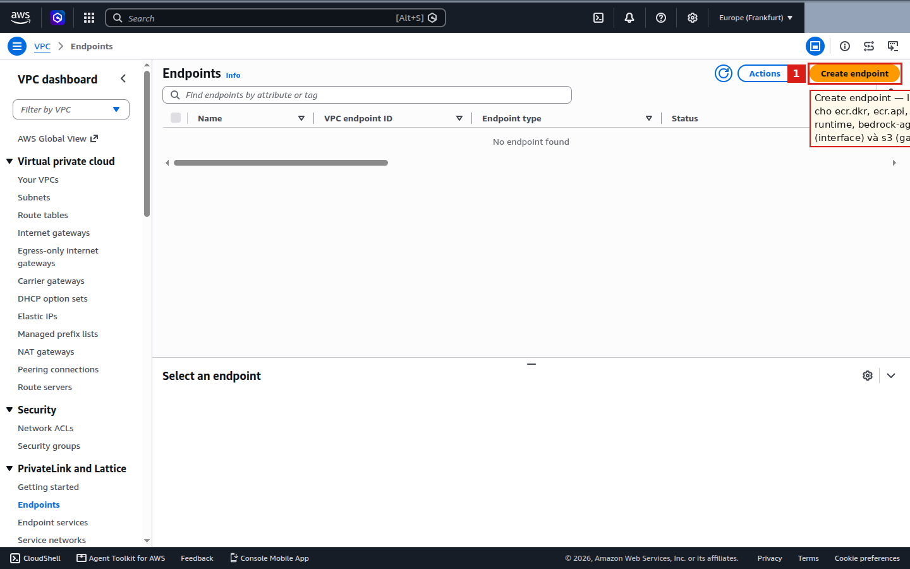

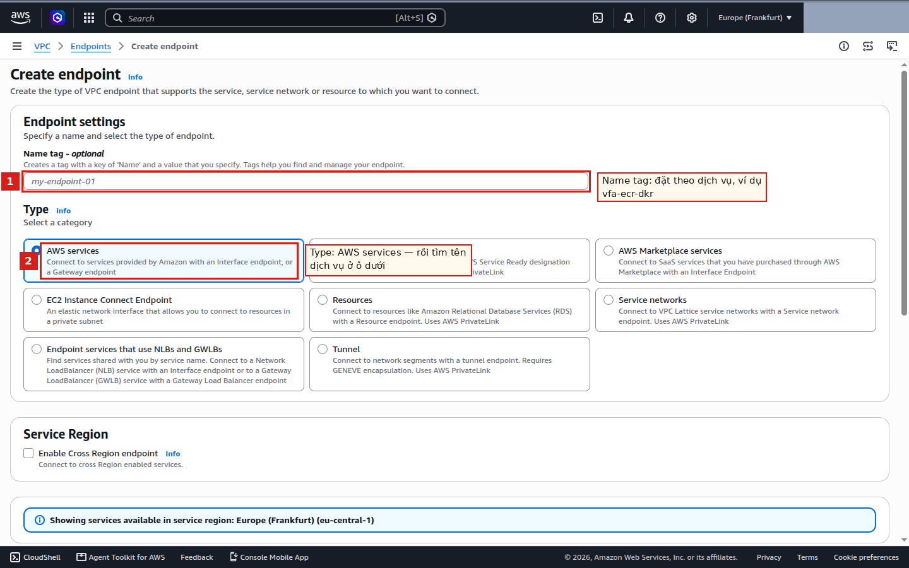

Thao tác này được lặp lại năm lần, và **nếu thiếu một cái thì phiên Harness không khởi động** vì image-pull timeout:

| Tên dịch vụ | Loại |
| --- | --- |
| `com.amazonaws.eu-central-1.ecr.dkr` | Interface |
| `com.amazonaws.eu-central-1.ecr.api` | Interface |
| `com.amazonaws.eu-central-1.bedrock-runtime` | Interface |
| `com.amazonaws.eu-central-1.bedrock-agent-runtime` | Interface |
| `com.amazonaws.eu-central-1.s3` | Gateway |

`bedrock-agent-runtime` là cái dễ sót nhất, bởi vì mọi tài liệu đều chỉ nhắc `bedrock-runtime`, trong khi `Retrieve` lại chạy trên endpoint kia.

### F.2 ECR

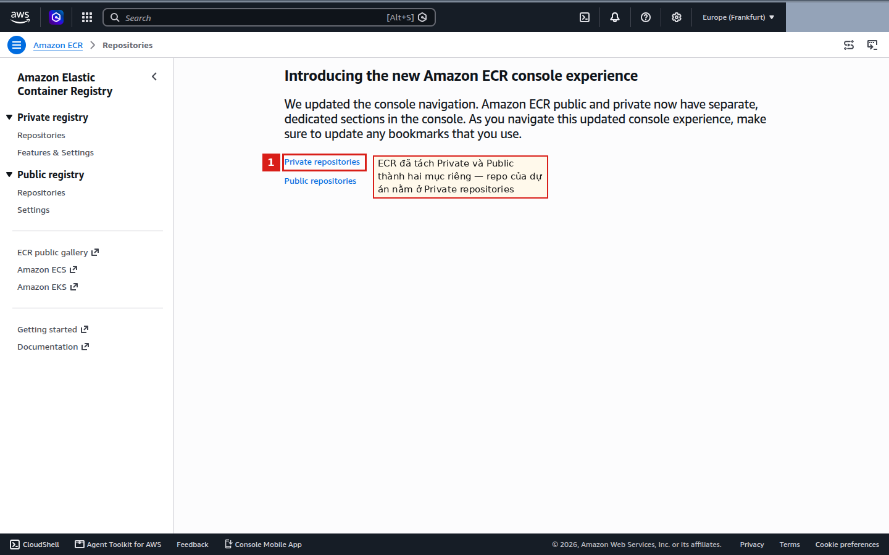

Console ECR đã tách **Private registry** và **Public registry** thành hai mục riêng, và repo của dự án nằm ở Private. Ở chế độ VPC, Harness kéo image từ repo ECR **riêng** của AWS (`harness-<region>`) qua endpoint chứ không qua ECR Public, và cũng không cần NAT gateway.

### F.3 ECS

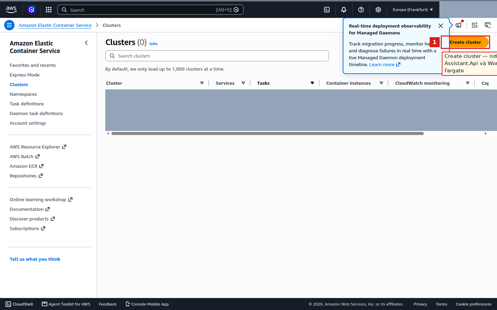

Đây là nơi chạy `Assistant.Api` và Worker trên Fargate; đây là mặc định đề xuất ở [09](09-trien-khai.md) §8 và còn chờ Q4 chốt.

### F.4 ALB — cho SSE đi qua

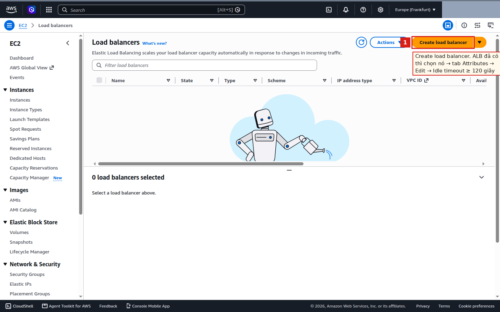

Với một ALB đã có sẵn, đường cấu hình là: chọn nó → tab **Attributes** → **Edit** → **Idle timeout** được đặt ở mức **≥ 120 giây**. Lượt `optimize` có trần 90 giây, nên nếu timeout để ở 60 giây thì nó sẽ cắt ngang và frontend nhận một luồng bị đứt, không có sự kiện `done`.

### F.5 CloudFront

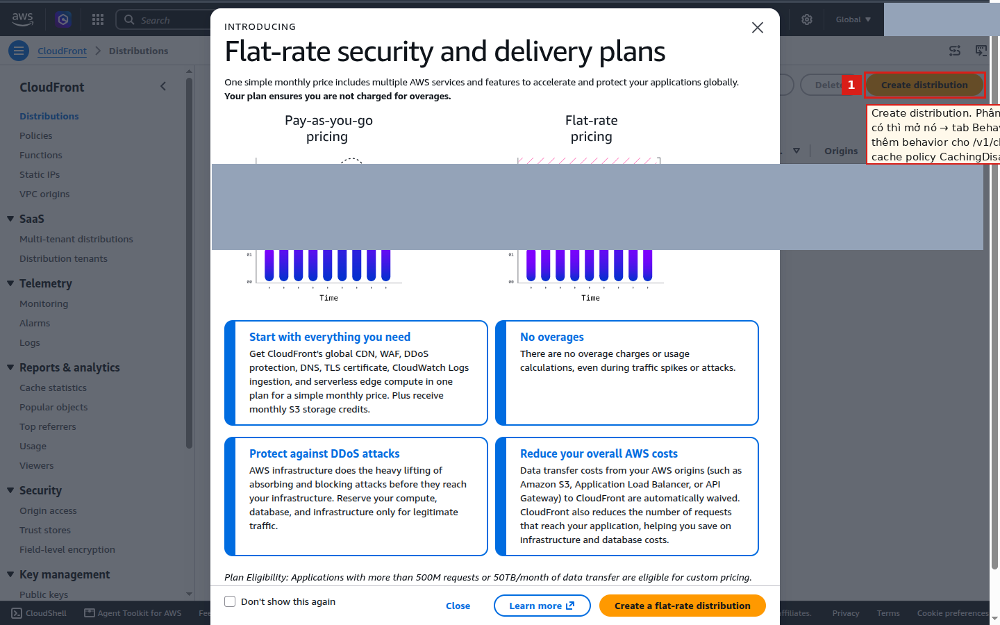

CloudFront là dịch vụ toàn cục, nên link tự chuyển về `us-east-1`; đây là hành vi đúng chứ không phải nhầm vùng.

Với một phân phối đã có sẵn, đường cấu hình là: mở nó → tab **Behaviors** → thêm một behavior cho `/v1/chat` với cache policy **CachingDisabled**. Nếu bật cache trên đường này thì SSE sẽ bị gom lại, chữ không hiện dần và người dùng chỉ nhìn thấy màn hình trắng.

### F.6 Chi phí

| Dịch vụ | Đơn giá ở `eu-central-1` | Ở quy mô dự án |
| --- | --- | --- |
| **VPC interface endpoint** | 0,012 $/giờ cho mỗi AZ; 0,01 $/GB dữ liệu xử lý | Bốn endpoint Interface ở F.1 trên 2 AZ tốn 70,08 $/tháng; tám endpoint như [13](13-chi-phi.md) §5 tốn 140,16 $/tháng. Gateway endpoint cho S3 không tính phí |
| **ECR** | 0,10 $/GB-tháng lưu image | 5 GB image tốn khoảng 0,50 $/tháng |
| **Fargate ARM** | 0,03725 $/vCPU-giờ; 0,00409 $/GB-giờ | Một task 1 vCPU, 2 GB chạy cả tháng tốn 33,16 $; năm task theo [13](13-chi-phi.md) §5 tốn 132,65 $/tháng |
| **ALB** | 0,027 $/giờ; 0,008 $/LCU-giờ | Phần sàn là 19,71 $/tháng, chưa tính LCU |
| **CloudFront** | 0,085 $/GB ra Internet cho 10 TB đầu (Europe); 0,012 $/10 000 request HTTPS | Dưới 1 $/tháng, vì SSE chỉ mang chữ |

**VPC endpoint là khoản cố định lớn nhất của cả hệ thống**, chiếm gần 40% phần cố định theo [13](13-chi-phi.md) §1, và được tính theo giờ dù không có lượt nào chạy qua. Mỗi endpoint trên 2 AZ tốn khoảng 17,5 $/tháng, nên danh sách endpoint cần được chốt theo đúng những dịch vụ thật sự gọi qua mạng riêng ([15](15-chi-tiet-devops.md)), và môi trường dev, staging nên dùng chung endpoint khi cùng VPC. Bỏ bớt một endpoint để tiết kiệm thì không được, bởi vì thiếu một cái là phiên Harness không khởi động (F.1).

Fargate ARM rẻ hơn x86 khoảng 20% cho cả vCPU lẫn bộ nhớ (x86 là 0,04656 $/vCPU-giờ và 0,00511 $/GB-giờ), nên image cần được build cho `arm64`. Sau khoảng hai tuần chạy thật, Compute Optimizer đưa ra khuyến nghị cỡ task cho ECS trên Fargate, và đó là lúc chỉnh lại vCPU, bộ nhớ thay vì đoán từ đầu. Compute Savings Plans áp được cho Fargate, nhưng chỉ nên mua khi số task đã ổn định.

Với ALB, SSE giữ kết nối mở lâu, và số kết nối đang hoạt động là một trong các chiều dùng để tính LCU. Idle timeout 120 giây ở F.4 vì vậy có ảnh hưởng nhỏ tới LCU, nhưng không đáng kể ở lưu lượng của dự án. Với CloudFront, behavior `CachingDisabled` cho `/v1/chat` ở F.5 không làm tăng phí, bởi vì request được tính giá như nhau dù có cache hay không.

---

## G · Chi phí

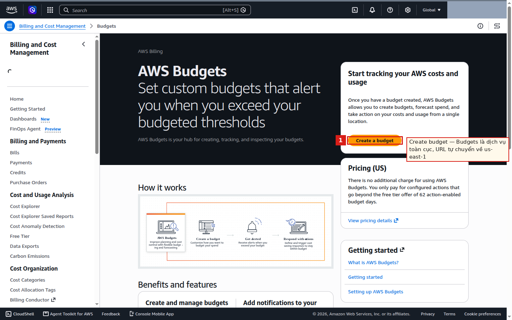

Budgets và Cost Anomaly Detection là dịch vụ toàn cục, nên URL vùng sẽ tự chuyển về `us-east-1`.

**Hai thứ này cần được dựng trước khi tăng lưu lượng chứ không phải sau.** Nếu không có chúng thì hệ thống không có phanh chi phí.

### G.1 Cost Explorer — đã bật, đang chờ dữ liệu

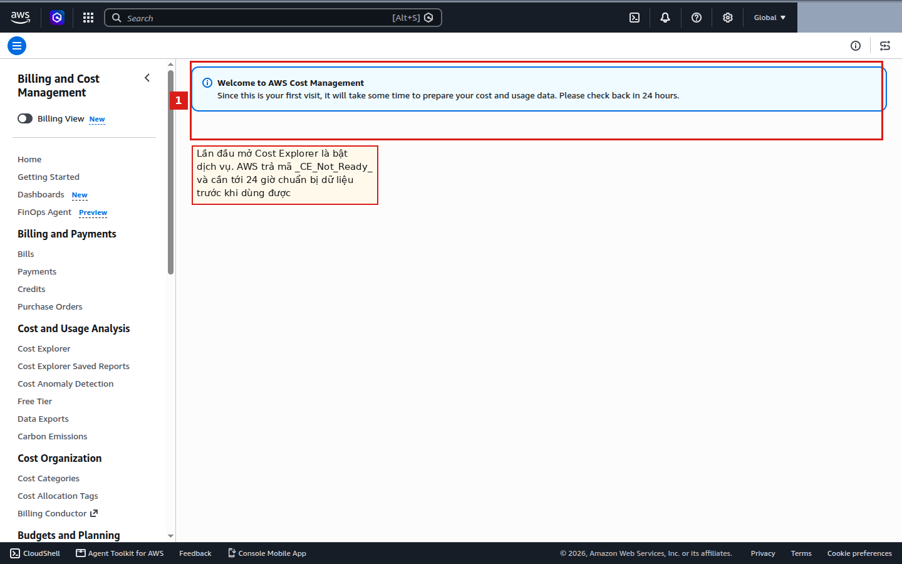

Việc mở Cost Explorer lần đầu **chính là thao tác bật** nó cho cả tài khoản, và không có nút "Enable" riêng. Ngay sau khi bật, console chuyển sang mã `_CE_Not_Ready_` và lời gọi `ce.us-east-1.amazonaws.com` trả về 400, bởi vì AWS đang dựng dữ liệu lịch sử, quá trình này mất tới **24 giờ**. Trong thời gian đó, cả Cost Explorer lẫn Cost Anomaly Detection đều chưa xem được, vì Anomaly Detection đọc dữ liệu của Cost Explorer.

### G.2 Cost Anomaly Detection — còn một việc phải làm

Sau khi Cost Explorer sẵn sàng, ở phần **Cost Anomaly Detection** cần kiểm xem AWS đã tự tạo monitor mặc định chưa rồi mới tạo thêm. Một monitor chỉ hữu ích khi có **alert subscription**, và subscription lại cần địa chỉ người nhận; địa chỉ này hiện chưa chốt nên phải hỏi chủ tài khoản trước khi tạo.

### G.3 Kích hoạt cost allocation tags

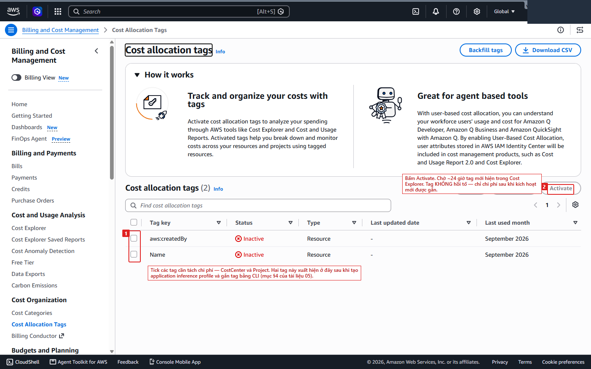

`https://us-east-1.console.aws.amazon.com/costmanagement/home#/tags` (Billing là dịch vụ toàn cục, URL tự về `us-east-1`)

Sau khi tạo application inference profile và gắn tag `CostCenter`/`Project` bằng CLI, hai tag đó xuất hiện trong danh sách **User-defined cost allocation tags**. Hai tag này cần được tick rồi bấm **Activate**.

- Tag **không có hiệu lực hồi tố**, bởi vì chỉ những chi phí phát sinh **sau** khi kích hoạt mới được gắn tag.
- Cần chờ khoảng **~24 giờ** thì tag mới hiện trong Cost Explorer.
- Việc tạo inference profile là thao tác **[CLI/API]** và không làm được trên Console, chi tiết ở [05](05-devops.md) §4.

### G.4 Chi phí của chính các công cụ này

| Công cụ | Đơn giá |
| --- | --- |
| **Budgets** | Budget thường không tính phí. Budget có action được miễn phí 62 budget-ngày đầu mỗi tháng, tức khoảng hai budget chạy cả tháng, sau đó 0,10 $/budget-ngày. Mỗi báo cáo Budgets gửi đi tốn 0,01 $ |
| **Cost Explorer** | Giao diện console không tính phí. Mỗi lời gọi API tốn 0,01 $, nên một job gọi 10 lần mỗi ngày tốn khoảng 3 $/tháng |
| **Cost Anomaly Detection** | Không tính phí |
| **Cost allocation tags** | Không tính phí |
| **IAM, Service Quotas** | Không tính phí, kể cả việc xin tăng quota ở C.2 |

Phanh chi phí gần như miễn phí, nên không có lý do gì để hoãn nó tới khi lưu lượng tăng. Khoản dễ phình nhất là API Cost Explorer: dashboard nội bộ gọi thẳng API mỗi lần có người mở trang sẽ bị tính từng lời gọi, nên dữ liệu cần được kéo theo lịch mỗi ngày một lần rồi đọc từ bản đã lưu.

Toàn bộ đơn giá trong các mục Chi phí được đọc ngày 25/09/2026 từ AWS Price List Bulk API cho `eu-central-1`. Ngày công bố của từng bảng giá như sau: mô hình nền và Guardrails ngày 25/09/2026; RDS ngày 24/09/2026; CloudWatch ngày 22/09/2026; S3 ngày 18/09/2026; VPC ngày 17/09/2026; CloudFront ngày 16/09/2026; AgentCore ngày 15/09/2026; KMS, Fargate, ECR, ELB, CloudTrail, Systems Manager, Secrets Manager, Cost Explorer và Budgets ngày 11/09/2026. Giá mô hình, Guardrails, KMS, Fargate và VPC endpoint trùng với bảng giá mà [13](13-chi-phi.md) §3 dùng.

---

## H · IAM — role và policy least-privilege

Có bốn role tách biệt, gồm `assistant-runtime` (Assistant.Api), `assistant-ingest` (Worker), service role của KB và execution role của Harness. Giá trị policy đầy đủ nằm ở [05](05-devops.md) §2A.7 và [15](15-chi-tiet-devops.md).

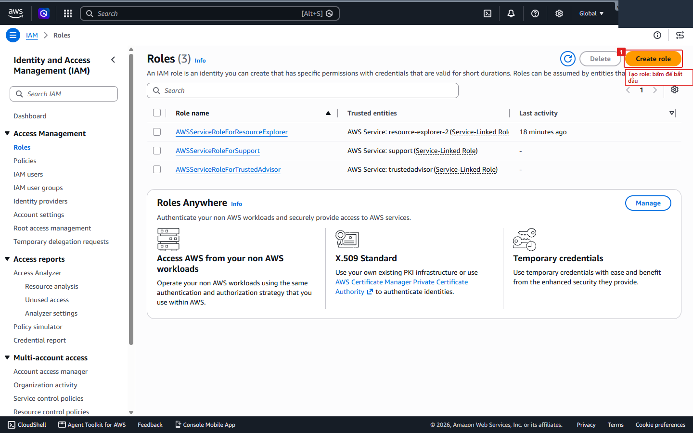

### H.1 Chọn loại thực thể tin cậy

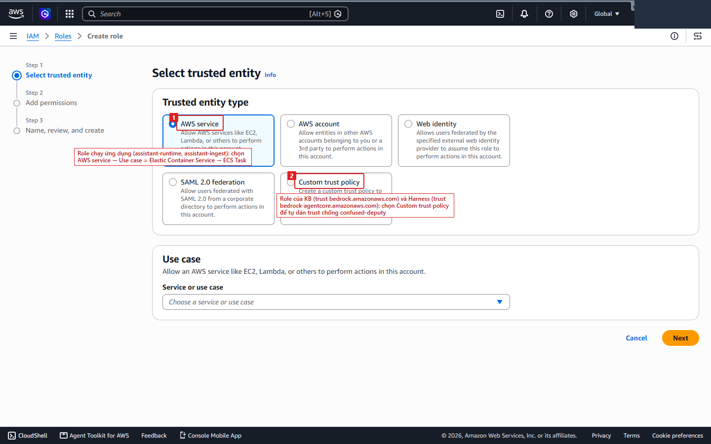

`https://us-east-1.console.aws.amazon.com/iam/home#/roles` → **Create role** (IAM là dịch vụ toàn cục).

| Role | Trusted entity | Ghi chú |
| --- | --- | --- |
| `assistant-runtime`, `assistant-ingest` | **AWS service** → Use case nơi chạy (ECS Task) | Đây là role được gắn vào task chạy ứng dụng |
| Service role KB | **Custom trust policy**, trust `bedrock.amazonaws.com` | Trust được tự dán để thêm điều kiện chống confused-deputy |
| Execution role Harness | **Custom trust policy**, trust `bedrock-agentcore.amazonaws.com` | Cần thêm `iam:PassRole` khi gọi `CreateHarness` |

### H.2 Dán policy least-privilege (tab JSON)

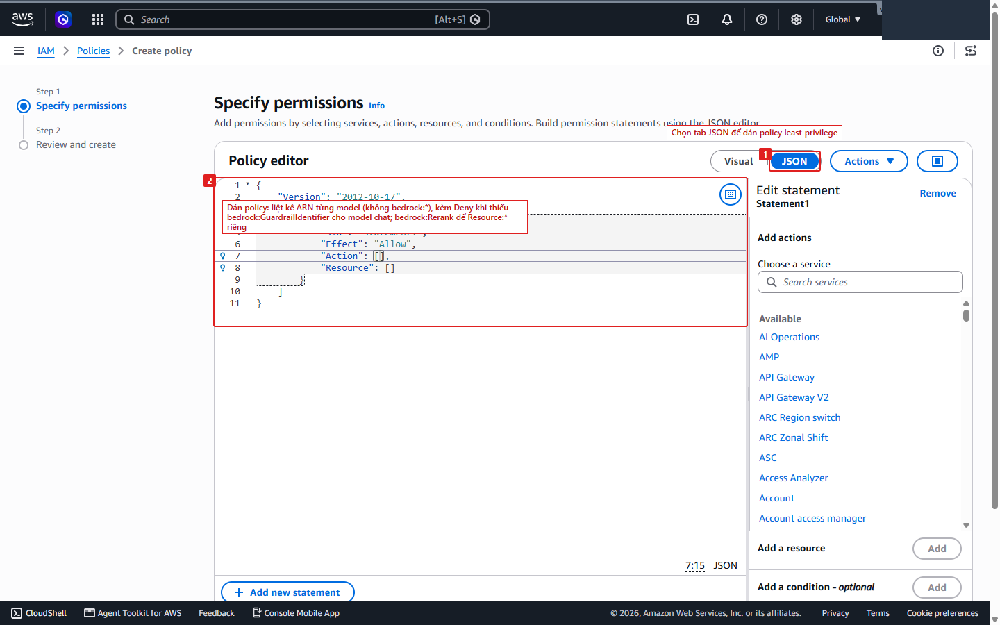

`#/policies/create` → tab **JSON**.

| Nguyên tắc | Vì sao |
| --- | --- |
| Chỉ cho phép **ARN của từng model** (Sonnet 5, Haiku 4.5, Sonnet 4.6) | Để không phải dùng `bedrock:*` hay `AmazonBedrockFullAccess` |
| **Deny khi thiếu `bedrock:GuardrailIdentifier`**, chỉ áp cho ARN model chat | Nhờ đó lập trình viên không bỏ được guardrail, và điều kiện này không áp cho embedding |
| `bedrock:Rerank` được đặt ở một statement `Resource: "*"` riêng | Rerank không nhận ARN cụ thể |
| `assistant-ingest` chỉ đọc/ghi S3 nguồn và **không** có Rerank hay Guardrails | Worker không gọi model chat |

### H.3 Trust policy chống confused-deputy

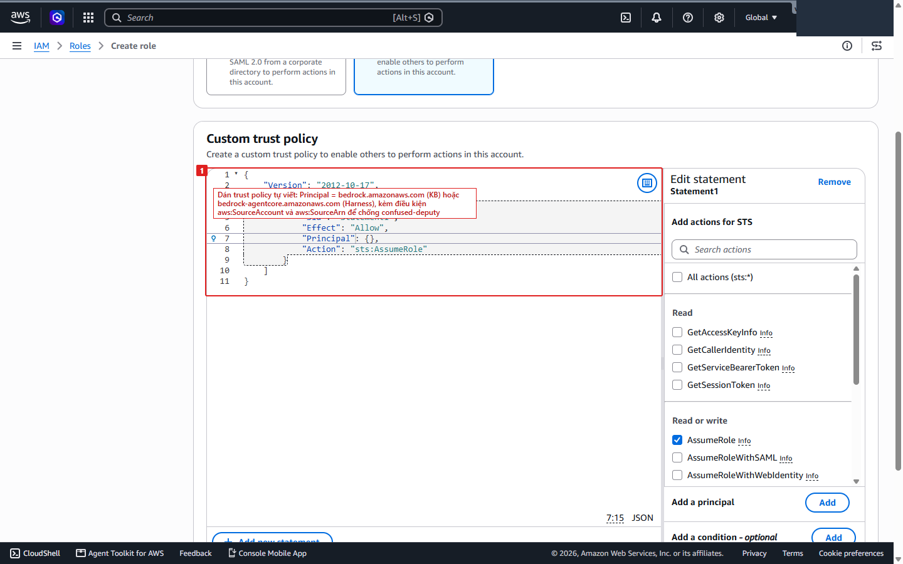

Với role của KB và Harness, trust policy tự viết được dán vào kèm các điều kiện sau:

| Điều kiện | Cho role nào | Chặn gì |
| --- | --- | --- |
| `aws:SourceAccount` + `aws:SourceArn` | KB (`knowledge-base/*`, siết về KB ID sau khi tạo), Harness (`harness/*`) | Ngăn dịch vụ bị bên khác mượn để đóng vai role |
| `aws:ResourceAccount` | S3 của service role KB | Ngăn đọc nhầm bucket trùng tên ở một tài khoản khác |
| `kms:ViaService` | Giải mã bucket nguồn SSE-KMS | Đảm bảo chỉ dùng khoá qua đúng dịch vụ S3 |

`iam:PassRole` là quyền cần cho `CreateHarness`, và nếu thiếu thì sẽ gặp lỗi `AccessDenied` phổ biến khi tạo Harness. IAM có độ trễ lan truyền, nên nếu gặp lỗi "unable to assume role" ngay sau khi tạo role thì cần đợi khoảng ~10 giây rồi thử lại.

---

## I · Cơ sở dữ liệu — RDS/Aurora PostgreSQL

> **Ghi chú AD-17:** dự án không còn cần `pgvector` vì vector store đã nằm ở KB, nên ràng buộc phiên bản vốn sinh ra vì pgvector được bỏ đi. Extension thật sự cần đến là **`fuzzystrmatch`** (dùng cho `levenshtein()` để gợi ý mã điều khoản, AD-29). Aurora DSQL **không** được dùng vì nó không hỗ trợ extension.

### I.1 Engine và template

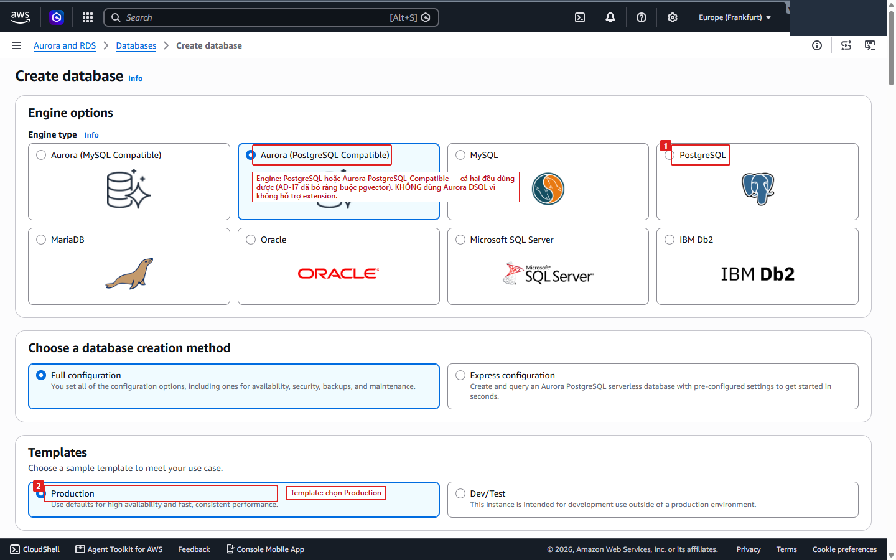

`https://eu-central-1.console.aws.amazon.com/rds/home?region=eu-central-1#launch-dbinstance:` → **Create database** → **Standard create**.

| Ô | Giá trị |
| --- | --- |
| **Engine** | **PostgreSQL** hoặc **Aurora PostgreSQL-Compatible** (cả hai đều dùng được) |
| **Templates** | **Production** |
| Master credentials | Nên chọn **Manage master credentials in AWS Secrets Manager** |

### I.2 Connectivity — trong VPC, không public

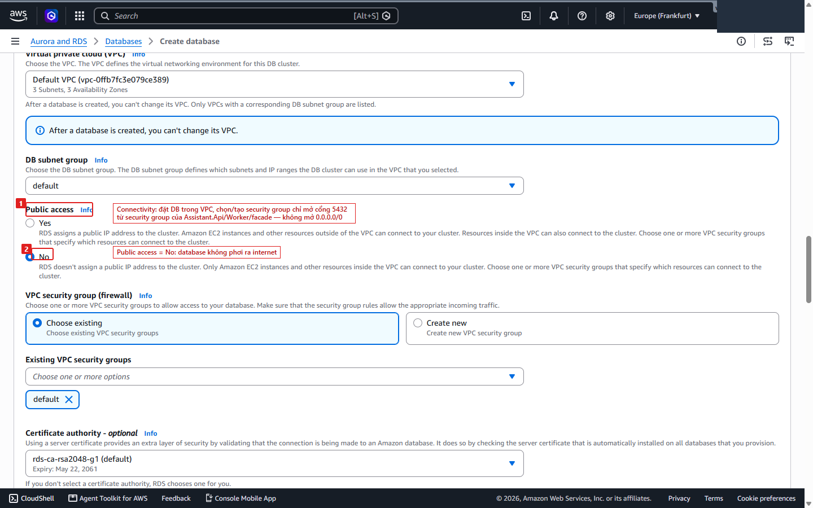

| Ô | Giá trị | Vì sao |
| --- | --- | --- |
| **Public access** | **No** | Để database không phơi ra internet |
| **VPC / Security group** | Nằm trong VPC, với security group chỉ mở cổng 5432 từ SG của Assistant.Api/Worker/facade | Để không mở `0.0.0.0/0` |
| (Tuỳ) **RDS Proxy** | Được cân nhắc khi chạy nhiều instance | Giúp pool kết nối |

### I.3 Encryption at-rest

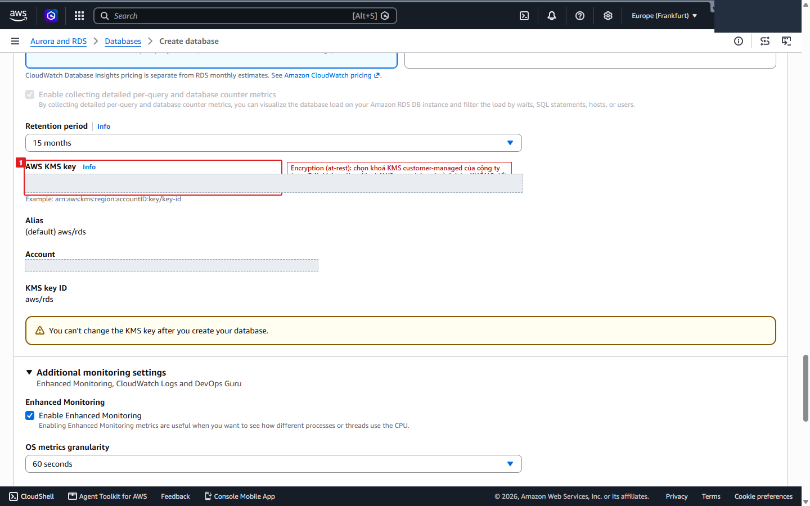

Cấu hình mã hoá gồm: bật **Enable encryption** → chọn **AWS KMS key** là khoá customer-managed của công ty (§D.1). **Khoá này không đổi được sau khi đã tạo database.**

### I.4 Row-Level Security và extension — [SQL], không có trên Console

RLS và extension **không cấu hình được trên Console** mà chỉ làm được bằng SQL sau khi đã kết nối:

```sql
CREATE EXTENSION IF NOT EXISTS fuzzystrmatch;

-- App kết nối bằng role KHÔNG phải owner và KHÔNG có BYPASSRLS
ALTER TABLE "case" ENABLE ROW LEVEL SECURITY;
ALTER TABLE "case" FORCE ROW LEVEL SECURITY;
CREATE POLICY case_org_isolation ON "case"
  USING (org_id = current_setting('app.current_org', true));
```

Giá trị `org_id` đặt vào session phải được lấy từ thuộc tính đã xác thực (Payment API) chứ không lấy từ giá trị mà client gửi lên. Một ràng buộc quan trọng là role ứng dụng không được là owner của bảng và không được có `BYPASSRLS`, bởi vì nếu không thì RLS sẽ bị bỏ qua.

### I.5 Chi phí

| Lựa chọn | Đơn giá ở `eu-central-1` | Theo tháng |
| --- | --- | --- |
| RDS PostgreSQL `db.t4g.medium`, Single-AZ | 0,074 $/giờ | 54,02 $ |
| RDS PostgreSQL `db.t4g.medium`, Multi-AZ | 0,149 $/giờ | 108,77 $ |
| Lưu trữ gp3 của RDS | 0,137 $/GB-tháng, Multi-AZ là 0,274 $ | 20 GB tốn 2,74 $, Multi-AZ là 5,48 $ |
| Aurora PostgreSQL `db.t4g.medium` | 0,085 $/giờ | 62,05 $ |
| Aurora PostgreSQL Serverless v2 | 0,14 $/ACU-giờ; lưu trữ 0,119 $/GB-tháng; 0,22 $/1 triệu I/O | Sàn 0,5 ACU tốn 51,10 $; 20 GB lưu trữ tốn 2,38 $ |
| Backup của RDS vượt mức miễn phí | 0,103 $/GB-tháng | Chỉ phát sinh khi giữ bản chụp lâu hơn dung lượng miễn phí |
| Secrets Manager (master credentials ở I.1) | 0,40 $/secret/tháng; 0,05 $/10 000 lời gọi API | 0,40 $ cho secret của database |

Template **Production** ở I.1 bật Multi-AZ theo mặc định, và Multi-AZ làm tiền instance lẫn tiền lưu trữ tăng gấp đôi. Mức đó đúng cho production nhưng thừa cho dev và staging. Ở hai môi trường này, template Dev/Test với Single-AZ, hoặc Aurora Serverless v2 đặt sàn 0 ACU để tự ngủ, đưa chi phí về gần mức chỉ còn tiền lưu trữ ([13](13-chi-phi.md) §6). Đổi lại, lần truy vấn đầu tiên sau khi ngủ phải chờ database khởi động.

[13](13-chi-phi.md) §5 tính Aurora Serverless v2 với sàn 0,5 ACU luôn bật, ở mức 51,10 $/tháng, rẻ hơn một instance `db.t4g.medium` cố định mà vẫn co giãn được khi tải tăng. Database của dự án chỉ giữ hội thoại, case và log truy vết, không giữ vector, nên sàn thấp là đủ. RDS Proxy ở I.2 tính phí riêng, vì vậy chỉ bật khi số kết nối thật sự cần gom. Nếu production chọn instance cố định thay cho Serverless v2, thì sau một hai tháng chạy ổn định, Reserved Instance một năm là cách giảm tiếp chi phí database, và khuyến nghị mua nằm sẵn trong Cost Explorer.

---

## J · Bản tự dựng on-prem cho từng dịch vụ

Tài liệu tới đây mô tả hệ thống chạy trên dịch vụ quản lý sẵn của AWS. Mục này đặt cạnh mỗi dịch vụ ấy một bản tự dựng chạy trong máy chủ của công ty, cho trường hợp khách hàng đòi dữ liệu và hạ tầng không rời khỏi hạ tầng công ty. Mô hình nền được đặt lên đầu vì nó quyết định cả phương án; từ J.2 trở đi, các mục con đi theo A, B rồi D–I, nên mỗi mục ở trên có đúng một mục đối chiếu ở dưới.

Đây là các phương án để cân nhắc chứ chưa phải quyết định đã chốt. Phần lớn chúng mở lại một quyết định đã ghi ở [01](01-kien-truc.md) §4, và AD nào bị đụng tới thì được gọi tên ngay tại mục có liên quan; chỗ nào phải đo lại trước khi tin cũng vậy.

Một điểm cần thấy trước: **tự dựng không phải một công tắc bật tắt cho cả hệ thống**. Phần lớn các mục dưới đây có bản thay thế chạy được ngay mà không đụng tới hợp đồng ở [02](02-hop-dong.md), còn J.1 thì không có bản thay thế tương đương, và nó là mục quyết định cả phương án.

### J.1 Mô hình nền — chỗ không có bản thay thế tương đương

Trọng số của Claude không phát hành, nên không có cách nào chạy đúng mô hình ở C.3 trong máy chủ công ty. Chỉ còn hai đường, và cả hai đều không giữ nguyên được hệ thống hiện tại.

| Đường đi | Cái được | Cái mất |
| --- | --- | --- |
| Mô hình trọng số mở chạy trên GPU của công ty | Dữ liệu không rời nhà; không còn hạn mức token theo vùng ở C.2 | Chất lượng trả lời tiếng Pháp và độ tin cậy của tool loop đều phải đo lại từ đầu |
| Vẫn gọi Claude qua mạng, chỉ tự dựng phần còn lại | Giữ nguyên chất lượng và toàn bộ thiết kế prompt | Nội dung câu hỏi vẫn ra khỏi hạ tầng công ty, nên đây không phải on-prem theo nghĩa khách hàng đang hỏi |

Phép đo quyết định đường thứ nhất nằm ở [08](08-eval-quan-sat.md) §1: bộ 50 câu của golden set, với `tool_expectation` chấm việc chọn đúng tool và truyền đúng tham số, `expected_verdict` chấm kết luận, và tầng tất định đòi mỗi trích dẫn phải ứng với chunk đã truy xuất. Chừng nào chưa có số của một mô hình cụ thể trên bộ đó thì chưa chốt được mô hình nào, và tài liệu này không đặt tên sẵn.

Hạn mức cũng đổi bản chất. Ở C.2, quota là đơn xin gửi cho AWS; khi tự dựng, quota chính là số GPU đang có, và việc vượt trần không trả về lỗi throttling mà biểu hiện thành hàng đợi dài ra. Trần đồng thời vì vậy phải đặt ở tầng ứng dụng chứ không còn ai đặt hộ.

### J.2 Guardrails

Bốn loại bộ lọc ở A.3–A.6 tách thành bốn thứ khác nhau khi tự dựng, và chỉ hai trong số đó cần tới mô hình.

| Bộ lọc của Bedrock | Bản tự dựng | Ràng buộc phải giữ |
| --- | --- | --- |
| Content filters | Một mô hình phân loại an toàn chạy cùng chỗ với mô hình nền, hoặc bộ phân loại tự huấn luyện trên chính tập câu hỏi của ngành | `VIOLENCE` vẫn phải nới, vì "rupture par cisaillement" và "effondrement" là thuật ngữ nghề (A.3) |
| Prompt attacks | Cùng mô hình phân loại, nhưng chỉ chạy ở chiều vào | Chiều ra vẫn tắt, đúng như A.3 |
| Denied topics | Mô tả chủ đề cấm chuyển thành nhãn của bộ phân loại, hoặc thành một lượt gọi mô hình riêng | Mô tả và ví dụ vẫn viết bằng tiếng Pháp (A.4) |
| Word filters và regex ở Sensitive information | Chạy thẳng trong `Assistant.Api`, vốn đã là mã của dự án | Không đổi |
| Nhận dạng PII có sẵn | Thư viện nhận dạng PII chạy tại chỗ | Vẫn phải tách hai mức xử lý như A.5, che với `NAME`, `EMAIL`, `PHONE`, `ADDRESS` và chặn với mật khẩu, khoá và số thẻ; ba mẫu regex cho NIR Pháp, SIRET và căn cước công dân Việt Nam thì tự viết như cũ |
| Contextual grounding | Một lượt gọi mô hình thứ hai so câu trả lời với chunk đã trích, tức cơ chế LLM-as-judge mà [08](08-eval-quan-sat.md) đã mô tả | Ngưỡng phải hiệu chỉnh lại, vì thang điểm của mô hình khác không trùng thang của Bedrock |

Cách tính tiền biến mất cùng dịch vụ. Khoản 0,50 $/1 000 text unit ở A.8 không còn, nhưng phần chữ phải soát thì vẫn nguyên: 12 chunk mỗi lượt vẫn phải đi qua bộ lọc, và giờ chúng chiếm thời gian GPU thay vì chiếm tiền theo text unit. Vì vậy cách giảm tải vẫn giống hệt, tức soát chunk một lần lúc nạp thay vì mỗi lượt truy vấn, và điều kiện vẫn là [06](06-bao-mat.md) đồng ý.

### J.3 Knowledge Base, embedding và rerank

Đây là mục mà việc tự dựng ít tốn công nhất, bởi vì Worker vốn đã tự parse, tự cắt chunk và tự nạp từng chunk một (B.5). `chunkingStrategy: NONE` ở B.3 tồn tại chỉ để bảo Bedrock đừng làm gì thêm; bỏ Bedrock đi thì ràng buộc ấy cũng không còn.

| Thành phần của B | Bản tự dựng |
| --- | --- |
| Vector store (S3 Vectors, OpenSearch Serverless, Aurora) | `pgvector` trên chính PostgreSQL của dự án, hoặc một vector store dựng riêng khi corpus lớn hơn nhiều |
| Titan Text Embeddings V2 | Mô hình embedding đa ngữ chạy tại chỗ, chọn theo điểm trên bộ 50 câu tiếng Pháp chứ không theo bảng xếp hạng chung |
| Cohere Rerank 3.5 và Amazon Rerank 1.0 | Cross-encoder chạy tại chỗ, đo cùng bộ câu ấy |
| `filter` theo `scope_key` và `status` | Mệnh đề `WHERE` trong câu truy vấn |
| `Retrieve` | Câu SQL của dự án, hoặc API của vector store |

Chọn `pgvector` thì phiên bản phải từ **0.8.0** trở lên, vì `hnsw.iterative_scan` sinh ra đúng cho tình huống của dự án: lọc chọn lọc mạnh trên `scope_key` và `status` rồi mới lấy láng giềng gần nhất. Phiên bản cũ hơn trả thiếu kết quả trong trường hợp đó, và [01](01-kien-truc.md) §11.1 đã ghi ràng buộc này ở V-K7, từ lúc còn cân nhắc Aurora.

Lọc quyền thậm chí chặt hơn bản quản lý sẵn, bởi vì `WHERE` chạy trong cùng database đang bật RLS (I.4) chứ không phải một trường metadata phải tự khai cho đúng. Đổi lại, agentic retrieval và reranker sẵn có đều không còn — nhưng AD-17 đã chấp nhận mất hai thứ đó ngay từ khi chọn customer-managed KB, nên tự dựng không mất thêm gì ở điểm này.

Điều phải nói rõ là đưa `pgvector` trở lại thì mở lại AD-12. Instance vật lý riêng cho assistant hiện là tuỳ chọn, và lý do nó thành tuỳ chọn là kho vector đã sang KB nên không còn tải bộ nhớ lúc build chỉ mục HNSW ([05](05-devops.md) §2A). Đặt chỉ mục vector trở lại database của dự án là đưa đúng tải ấy quay về, nên hoặc instance riêng thành bắt buộc trở lại, hoặc kho vector phải nằm ở một tiến trình khác.

### J.4 Khoá, kho và sổ ghi

| Dịch vụ ở D | Bản tự dựng | Khác biệt đáng kể |
| --- | --- | --- |
| KMS | Một kho khoá tự vận hành với API mã hoá, hoặc HSM qua PKCS#11 | Việc xoay khoá và sổ ghi truy cập khoá trở thành việc của đội vận hành |
| S3 | MinIO hoặc Ceph, đúng như [01](01-kien-truc.md) đã ghi sẵn "S3 / MinIO" | Bucket Key ở D.2 không còn nghĩa, vì không còn tính tiền theo request tới KMS |
| CloudWatch Logs | Một kho log tự dựng, thu bằng agent trên từng node | Retention ở D.3 thành chính sách xoá của kho log; tiền 0,63 $/GB ghi vào ở D.7 biến mất, đổi lấy đĩa và người trực |
| Parameter Store | Kho KV của hệ thống quản lý bí mật, hoặc một bảng cấu hình trong PostgreSQL | Cờ kill switch đọc từ chỗ khác, còn ngữ nghĩa giữ nguyên |
| CloudTrail | Không có bản tương đương trực tiếp | Xem đoạn dưới |
| Model invocation logging | Một span OpenTelemetry phát ra ngay tại chỗ gọi mô hình | Chọn được đúng những trường cần ghi, nên vẫn chỉ ghi metadata vì lý do GDPR ở D.6 |

CloudTrail là khoản mất thật sự của phương án này. Nó ghi mọi lời gọi API ở tầng nền tảng, kể cả những lời gọi mà bản thân ứng dụng không biết là đã thực hiện, và không có phần mềm nào tự dựng cho lại đúng thứ đó. Bản thay thế là ghép nhiều nguồn: sổ kiểm toán của kho khoá, audit log của orchestrator, và bảng `audit_event` vốn đã có trong thiết kế. Ghép lại thì phủ được phần lớn, nhưng phạm vi phủ tới đâu là câu hỏi phải trả lời với [06](06-bao-mat.md) trước khi hứa với kiểm toán.

### J.5 Vòng lặp agent

[10](10-rui-ro.md) R32 đã ghi sẵn phương án này làm dự phòng: bỏ AgentCore, chạy vòng lặp bằng C#. Tự dựng chỉ là biến dự phòng đó thành đường chính.

| Thành phần của E | Bản tự dựng |
| --- | --- |
| Harness và Runtime | Vòng lặp trong `Assistant.Api`, chạy trong cùng container với phần còn lại |
| Số vòng và thời gian chờ ở E.1 | Hai tham số cấu hình, đọc từ kho cấu hình như mọi tham số khác |
| Inbound Auth | Validate JWT của Keycloak qua JWKS, đúng cách mà mọi service trong hệ thống đang làm |
| Memory gắn sẵn của Harness | Bảng hội thoại đã có trong PostgreSQL |
| Gateway cho MCP | Xem đoạn dưới |

Phần vòng lặp gần như không mất gì, bởi vì tool facade, registry và validator đều đã là mã của dự án; AgentCore chỉ đang giữ hộ vòng lặp và trạng thái. Danh tính còn sạch hơn một chút, vì token đi thẳng từ Keycloak vào ứng dụng thay vì qua một authorizer cấu hình bằng bốn trường mà sai một trường là mất hàng rào (AD-31).

Cổng MCP thì khác. AD-31 đặt cổng ấy trên AgentCore Gateway và đã loại thẳng phương án "MCP server tự viết" vì trái AD-08. Tự dựng buộc phải mở lại quyết định đó, và cái phải viết không chỉ là giao thức: `aud` đúng endpoint, token hẹp quyền theo RFC 8693, quota, và `audit_event` cho từng lời gọi. Nếu cổng MCP chưa phải yêu cầu của khách hàng thì cách rẻ nhất là chưa dựng nó.

### J.6 Mạng, container và mạng biên

| Dịch vụ ở F | Bản tự dựng |
| --- | --- |
| VPC endpoint | Không còn tồn tại, vì không còn dịch vụ AWS nào để đi tới |
| ECR | Một registry container tự dựng. GHCR đang dùng ở [09](09-trien-khai.md) §2 vẫn chạy được, nhưng nó do GitHub vận hành nên image vẫn nằm ngoài nhà, đúng kiểu đánh đổi như đường thứ hai ở J.1 |
| ECS trên Fargate | Kubernetes, Nomad, hoặc `docker compose` trên runner self-hosted đúng như dev đang chạy ([09](09-trien-khai.md) §2). Mục này chưa đụng AD nào, vì F.3 vẫn còn chờ Q4 chốt |
| ALB | nginx, HAProxy hoặc Traefik |
| CloudFront | Chính reverse proxy ấy làm luôn cache cho tài nguyên tĩnh |

Hai cái bẫy của SSE ở F.4 và F.5 không biến mất mà chỉ đổi tên tham số, và với nginx thì cả hai đều nằm ở mặc định sai. `proxy_buffering` mặc định là `on`, tức phản hồi được nhận vào buffer của nginx thay vì đẩy thẳng từng sự kiện xuống client, đúng triệu chứng màn hình trắng mà F.5 mô tả; đường `/v1/chat` vì vậy phải đặt `proxy_buffering off`, và tài liệu nginx mô tả chế độ tắt là phản hồi được chuyển cho client ngay khi nhận được. `proxy_read_timeout` mặc định 60 giây, trong khi lượt `optimize` có trần 90 giây, nên nó phải được nâng lên mức ≥ 120 giây giống idle timeout của ALB ở F.4.

Khoản tiền thay đổi nhiều nhất của cả tài liệu nằm ở đây. VPC endpoint là phần cố định lớn nhất, 70,08 $/tháng cho bốn endpoint và 140,16 $/tháng cho tám (F.6), và nó biến mất hoàn toàn cùng với Fargate, ALB và CloudFront. Đổi lại là tiền máy, tiền điện và người trực, tức những khoản không nằm trong bảng giá nào.

### J.7 Chi phí và giám sát chi phí

Hoá đơn đổi hình chứ không chỉ đổi số. Phần lớn chi phí ở A.8 đến F.6 là tiền trả theo lượt và theo giờ; khi tự dựng, gần như toàn bộ chuyển thành khấu hao phần cứng, điện và công vận hành, tức các khoản trả trước và không co theo lưu lượng.

| Công cụ ở G | Bản tự dựng |
| --- | --- |
| Cost Explorer | Bảng đo tự dựng trên metric của hệ thống: GPU-giờ, token mỗi lượt, số lượt theo khách hàng |
| Budgets | Cảnh báo đặt trên chính các metric ấy |
| Cost Anomaly Detection | Không có bản tương đương; thay bằng cảnh báo ngưỡng trên lưu lượng và thời gian GPU |
| Cost allocation tags | Nhãn gắn trên metric, phục vụ đúng việc bổ chi phí theo `CostCenter` và `Project` |
| Compute Optimizer và Savings Plans | Không còn nghĩa; việc tương ứng là đo tải thật rồi chỉnh số replica |

Điều đáng nói là phanh chi phí trên AWS gần như miễn phí (G.4), còn bản tự dựng thì phải viết và phải nuôi. Ngược lại, thứ nó canh cũng ít nguy hiểm hơn: một job gọi nhầm API không sinh ra hoá đơn bất ngờ mà chỉ làm hàng đợi dài ra. Cảnh báo vì vậy nên đặt vào chỗ đau thật, tức thời gian chờ của người dùng và mức chiếm GPU.

### J.8 Danh tính và quyền

Bốn role ở H được chia lại theo ba tầng, và không tầng nào là thứ phải dựng mới: Keycloak đã là nguồn danh tính của cả hệ thống, orchestrator có RBAC riêng, kho bí mật có chính sách riêng.

| Vai trò ở H | Bản tự dựng |
| --- | --- |
| `assistant-runtime`, `assistant-ingest` | Service account của orchestrator, kèm chính sách đọc bí mật hẹp theo từng service |
| Service role của KB | Không còn, vì kho vector nằm trong database của dự án |
| Execution role của Harness | Không còn, vì vòng lặp chạy trong `Assistant.Api` (J.5) |
| Trust policy chống confused-deputy ở H.3 | Ràng buộc `aud` và `azp` trong token Keycloak, đúng cơ chế mà AD-31 đã dùng cho cổng MCP |

Nguyên tắc least-privilege ở H không đổi một chữ, chỉ đổi chỗ khai. Điểm phải cẩn thận là chính sách mặc định: IAM từ chối khi không có allow, còn RBAC và chính sách kho bí mật thì tuỳ cấu hình, nên mặc định từ chối phải được đặt tường minh thay vì tin là đã có.

### J.9 PostgreSQL

Đây là mục mà bản tự dựng gần bản quản lý sẵn nhất, bởi vì engine giống hệt. Extension `fuzzystrmatch` giống hệt, và toàn bộ SQL của RLS ở I.4 chạy nguyên văn, kể cả ràng buộc role ứng dụng không được là owner và không được có `BYPASSRLS`.

| Tính năng của RDS/Aurora | Bản tự dựng |
| --- | --- |
| Multi-AZ | Một cụm có bầu chọn leader tự động |
| Backup và point-in-time recovery | Công cụ backup của PostgreSQL, đặt lịch và đo thời gian khôi phục thật |
| RDS Proxy (I.2) | PgBouncer |
| Master credentials trong Secrets Manager (I.1) | Kho bí mật đã dựng ở J.4 |
| Encryption at-rest (I.3) | Xem đoạn dưới |

Mã hoá at-rest là chỗ khác biệt duy nhất có ý nghĩa với [06](06-bao-mat.md). PostgreSQL bản cộng đồng **không có** transparent data encryption; tài liệu của chính dự án PostgreSQL liệt kê sáu phương án mã hoá, và phương án tương ứng với I.3 là mã hoá ở tầng file system hoặc block, ví dụ `dm-crypt` kèm LUKS. Hệ quả có hai chiều. Chiều xấu là khoá không còn nằm ở tầng database, nên việc phân khoá theo vai trò ở D.1 không áp xuống tới từng database được nữa. Chiều tốt là ràng buộc khó chịu nhất của I.3 biến mất: khoá đĩa đổi được mà không phải dựng lại database, trong khi khoá KMS của RDS thì không.

Số tiền ở I.5 cũng biến mất theo, gồm cả khoảng chênh gấp đôi giữa Single-AZ và Multi-AZ. Đổi lại, high availability trở thành thứ phải tự chứng minh: một cụm có bầu chọn leader chỉ đáng tin sau khi đã diễn tập mất node và đo được thời gian chuyển đổi thật.

### J.10 Cái mất, cái được, và cái phải đo trước khi chốt

| Mất | Được |
| --- | --- |
| Mô hình ngang Claude Sonnet 5 (J.1) | Câu hỏi và tài liệu không rời khỏi hạ tầng công ty |
| CloudTrail ở tầng nền tảng (J.4) | Chi phí chuyển từ biến đổi sang cố định, bỏ được khoản VPC endpoint lớn nhất |
| Quota co giãn theo đơn xin (C.2) | Không còn phụ thuộc hạn mức của một vùng AWS |
| Guardrail đã hiệu chỉnh sẵn cho nhiều ngôn ngữ | Bộ lọc hiệu chỉnh được đúng theo tiếng Pháp và từ vựng ngành |
| Cost Anomaly Detection và các công cụ chi phí miễn phí | Không còn hoá đơn bất ngờ cần canh |

Ba việc phải làm xong trước khi chốt phương án. Thứ nhất là chạy bộ 50 câu tiếng Pháp của [08](08-eval-quan-sat.md) trên mô hình nền, embedding và reranker định dùng, rồi so với số hiện có; chưa có ba con số đó thì J.1 và J.3 vẫn là giả thiết. Thứ hai là chốt với [06](06-bao-mat.md) xem bản ghép sổ kiểm toán ở J.4 có đủ cho kiểm toán không. Thứ ba là dựng bảng chi phí theo hình mới, vì [13](13-chi-phi.md) hiện tính toàn bộ theo đơn giá AWS và không có dòng nào cho máy, điện hay người trực.

Phương án trung gian đáng cân nhắc trước khi làm tất cả: giữ mô hình nền ở nơi nó đang chạy và tự dựng phần còn lại. Cách này lấy ngay các khoản J.3 đến J.9 mà không phải trả lời câu hỏi khó nhất ở J.1, và nó cũng là bước đi đúng thứ tự nếu sau này chuyển hẳn.

---

## Nguồn

- [How content chunking works for knowledge bases](https://docs.aws.amazon.com/bedrock/latest/userguide/kb-chunking-parsing.html) — năm chiến lược chunking và hệ quả của No chunking
- [Ingest changes directly into a knowledge base](https://docs.aws.amazon.com/bedrock/latest/userguide/kb-direct-ingestion.html) — khác biệt giữa nạp trực tiếp và sync
- [Ingest documents directly into a knowledge base](https://docs.aws.amazon.com/bedrock/latest/userguide/kb-direct-ingestion-add.html) — hình dạng request, metadata inline, hạn mức 25 tài liệu
- [CreateDataSource](https://docs.aws.amazon.com/bedrock/latest/APIReference/API_agent_CreateDataSource.html) — `vectorIngestionConfiguration` là trường cấp ngoài cùng; `chunkingConfiguration` không sửa được sau khi tạo
- [Using the AWS Price List bulk API](https://docs.aws.amazon.com/awsaccountbilling/latest/aboutv2/using-price-list-query-api.html) — nguồn của mọi đơn giá ở các mục Chi phí, đọc từ offer file `eu-central-1`
- [Module ngx_http_proxy_module](https://nginx.org/en/docs/http/ngx_http_proxy_module.html) — `proxy_buffering` mặc định `on`, phản hồi vào buffer thay vì chuyển thẳng cho client; `proxy_read_timeout` mặc định 60 giây (J.6)
- [Encryption Options](https://www.postgresql.org/docs/17/encryption-options.html) — sáu phương án mã hoá của PostgreSQL; mã hoá at-rest nằm ở tầng file system hoặc block, ví dụ `dm-crypt` kèm LUKS (J.9)

Những gì không có dòng nguồn ở trên là **đọc trực tiếp từ console tài khoản công ty ngày 23/09/2026**: trang Model access đã bị gỡ, model mặc định của Harness là `global.anthropic.claude-sonnet-4-6`, Harness gắn sẵn một memory, Managed KB không cho chọn chunking, và danh sách resource type của CloudTrail có `AWS::Bedrock::KnowledgeBase`, `AWS::Bedrock::Guardrail`, `AWS::BedrockAgentCore::Runtime`. Ảnh mục **H · IAM**, **I · Cơ sở dữ liệu**, **D.6 (Model invocation logging)** và **G.3 (cost allocation tags)** chụp trực tiếp trên console ngày **24/09/2026**, đã che tên và số tài khoản. Giao diện AWS thay đổi liên tục, nên cần kiểm lại trước khi dựa vào. Mục **J** nằm ngoài phần đọc từ console: các phương án ở đó dựa trên thiết kế đã ghi trong [01](01-kien-truc.md), [09](09-trien-khai.md) và [10](10-rui-ro.md), cộng hai dòng nguồn nginx và PostgreSQL ở trên, và mọi chỗ còn phải đo đều được ghi ngay tại mục.
