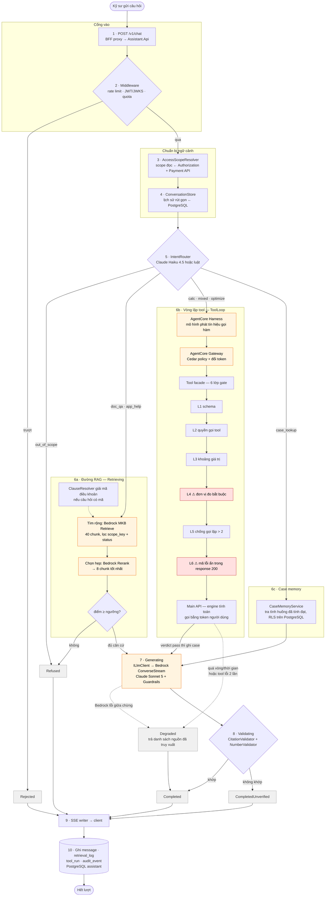

# Kiến trúc VF Structures AI Assistant — các step trong một lượt hỏi

Nguồn: `/home/vdloc/Downloads/vfstructures-ai-assistant (1)/vfstructures-ai-assistant/vfstructures-ai-solution/`
(`01-kien-truc-tong-the.md`, `02-assistant-service.md`, `03-rag.md`, `04-tool-calling.md`, `kien-truc-day-du.md`)

---

## 1. Sơ đồ luồng một lượt hỏi

**Đọc sơ đồ**

- Cam = dịch vụ AWS (Bedrock, AgentCore)
- Đỏ = hai lớp gate nguy hiểm nhất — sai mà màn hình vẫn trông hợp lý
- Xám = trạng thái kết thúc; mọi đường đều đổ về step 10, kể cả khi lỗi
- Nét đứt = đường chịu lỗi hoặc phụ trợ

---

## 2. Bảng step

| # | Step | Thành phần | Kết cục xấu |
| --- | --- | --- | --- |
| 1 | Nhận `POST /v1/chat` | BFF proxy → Assistant.Api | — |
| 2 | Middleware: rate limit → JWT (JWKS Keycloak) → quota | Middleware | `Rejected` |
| 3 | Giải scope đọc của user | `AccessScopeResolver` (Authorization API + Payment API) | — |
| 4 | Lấy lịch sử hội thoại rút gọn | `ConversationStore` (PostgreSQL) | — |
| 5 | Định tuyến ý định | `IntentRouter` — Claude Haiku 4.5 hoặc luật | `out_of_scope` → `Refused` |
| 6 | Rẽ nhánh theo intent | `doc_qa`/`app_help` → RAG · `calc`/`mixed`/`optimize` → tool loop · `case_lookup` → case memory | — |
| 7 | Sinh câu trả lời (stream) | `ILlmClient` → Bedrock ConverseStream + Guardrails, Claude Sonnet 5 | `Degraded` khi Bedrock lỗi |
| 8 | Kiểm lại đầu ra | `CitationValidator` + `NumberValidator` | `CompletedUnverified` khi trích dẫn/số không khớp |
| 9 | Đẩy SSE về client | SSE writer | — |
| 10 | Ghi `message`, `retrieval_log`, `tool_run`, `audit_event` | PostgreSQL assistant | luôn ghi, kể cả khi lỗi |

**State machine**

`Received → Routing → {Retrieving | ToolLoop | CaseLookup} → Generating → Validating → Completed`

Nhánh phụ: `Rejected`, `Refused`, `AskBack`, `Degraded`, `CompletedUnverified`, `Aborted`.

---

## 3. Sáu lớp gate của tool facade

Đường đi: `Assistant.Api → AgentCore Harness → AgentCore Gateway (Cedar + đổi token) → tool facade → Main API`

| Lớp | Kiểm gì |
| --- | --- |
| 1 | Đúng khuôn dạng tham số (schema) |
| 2 | Người dùng có quyền gọi công cụ này không |
| 3 | Giá trị tham số nằm trong khoảng hợp lệ đã khai báo |
| 4 | **Đơn vị đo bắt buộc phải có** — thiếu đơn vị thì từ chối, không suy diễn |
| 5 | Chống gọi lặp — cùng công cụ, cùng tham số, quá hai lần thì dừng |
| 6 | **Đọc đúng mã lỗi thật ẩn trong phản hồi thành công của Main API** |

Lớp 4 và 6 nguy hiểm hơn bốn lớp còn lại: cả hai đều là điểm hệ thống có thể sai mà kết quả vẫn trông hợp lý trên màn hình.

---

## 4. Ba tầng mô hình

| Việc | Mô hình | Lý do |
| --- | --- | --- |
| Phân loại câu hỏi, viết lại, bóc tham số | Claude Haiku 4.5 | Chạy trên mọi lượt hỏi, cần nhanh và rẻ |
| Trả lời chính, vòng lặp gọi hàm | Claude Sonnet 5 | Việc cần chất lượng suy luận cao nhất |
| Đường dự phòng khi mô hình chính lỗi | Claude Sonnet 4.6 | Giữ lượt hỏi hoàn thành thay vì gãy hẳn |

---

## 5. Bảy luồng toàn hệ thống

| Luồng | Kích hoạt bởi | Mô tả | Tài liệu gốc |
| --- | --- | --- | --- |
| F1 | Kỹ sư gửi câu hỏi | Hỏi đáp có dẫn chứng (RAG) | `02`, `03` |
| F2 | Gửi câu hỏi / bấm "Hỏi AI" trên trang tính toán | Vòng lặp tool tính toán | `04` |
| F3 | Engine tính đạt một cấu kiện | Tự ghi case + tra tình huống (case memory) | `ship/12` |
| F4 | Kỹ sư tri thức tải tài liệu | Nạp và cập nhật kho tài liệu | `03` |
| F5 | Chấm tốt/xấu | Phản hồi → bổ sung bộ eval | `09` |
| F6 | Pull request đổi prompt/retrieval/tool | Eval gate trong CI, chặn merge khi chất lượng lùi | `09` |
| F7 | Lịch định kỳ | Quota, quan sát, retention, audit | `07`, `09` |
